**ELK中相关概念知识点整理**

****************


# Elasticsearch

## 文档

* ES是面向文档的，文档是所有可搜索数据的最小单位。

  比如日志文件中的一条日志项；一本电影的具体信息；一张唱片的具体信息；MP3播放器里的一首歌；一篇PDF文档中的具体内容。

* 文档会被序列化JSON格式，保存在ES中。

  JSON对象由字段组成；每个字段都有对应的字段类型(字符串、数值、布尔、日期、二进制、范围类型)

* 每个文档都有一个Unique ID

  我们可以自己指定；或者通过ES自动生成。


### JSON文档

* 一篇文档包含了一系列的字段。类似数据库表中一条记录。

* JSON文档，格式灵活，不需要预先定义格式。

  字段的类型可以指定或者通过ES自动推算

  支持数组、支持嵌套


### 文档的元数据

元数据是用来标注文档的相关信息的。

* _index  文档所属的索引名
* _type   文档所属的类型名
* _id     文档唯一的ID
* _source 文档的原始Json数据
* _all    整合所有字段内容到该字段，已废弃
* _version 文档的版本信息
* _score  相关性打分


## 索引

index 索引是文档的容器，是一类文档的结合。

* index 体现了逻辑空间的概念：每个索引都有自己的mapping定义，用于定义包含的文档的字段名和字段类型。
* shard体现了物理空间的概念：索引中的数据分散在shard分片上。

索引的mapping与settings

* **Mapping定义文档字段的类型**
* **setting定义不同的数据分布**


### 索引的不同语意

* 名词：一个ES集群中，可以创建很多个不同的索引
* 动词：保存一个文档到ES的过程也叫做索引(indexing)，也就是在ES中，创建一个倒排索引的过程。
* 名词：通常可以理解为一个B树索引，在ES中是倒排索引。


### Type

* 在7.0之前，一个index可以设置多个Types
* 6.0开始，Type已经被废弃。从7.0开始，一个索引只能创建一个Type 也就是"_doc"


## ES vs RDBMS的类比

传统关系型数据库和ES的区别有：

* ES的相关性、高性能全文检索
* RDMS 用于事务性，join

| RDBMS                                     | ElasticSearch                       |
| ----------------------------------------- | ----------------------------------- |
| row                                       | document                            |
| table                                     | index                               |
| column                                    | filed                               |
| schema                                    | mapping                             |
| 分布式Mysql中设置的分片数量               | setting                             |
| SQL                                       | dsl                                 |
| 分布式mysql分片路由信息保存在ZK中         | master node(表现为ES的一个JAVA进程) |
| 有点类似访问代理                          | Coordinating Node                   |
| mysql的节点实例                           | data node(表现为ES的一个JAVA进程)   |
| set集群中的master节点上的主的schema的分片 | 主分片(一个lucene实例)              |
| set集群中的slave节点上的从的schema的分片  | 副本分片                            |


## ES分布式特性

* 高可用

  服务可用性：允许有节点停止服务

  数据可用性：部分节点丢失，不会丢失数据

* 可扩展性

  请求量提升、数据的不断增长（将数据分布到所有节点上）

* ES的分布式架构的好处

  存储的水平扩容。

  提高系统的可用性，部分节点停止服务，这个集群的服务不受影响。

* ES的分布式架构

  不同的集群通过不同的名字来区分，默认名字"elasticsearch"。

  通过配置文件修改，或者在命令行中 -E cluster.name=geektime进行设定。

  一个集群可以有一个或多个节点。


## 节点

* 节点是一个ES的实例

  本质上就是一个JAVA进程；一台机器上可以运行多个ES进程，但是生产环境一般建议一台机器上只运行一个ES实例。

* 每一个节点都有名字，通过配置文件配置，或者启动的时候使用 -E node.name=node1指定。

* 每一个节点在启动之后，会分配一个UID，保存在data目录下。


### Master Node

* Master Node的职责

  处理创建，删除索引等请求 / 决定分片被分配到哪个节点 / 负责索引的创建与删除

  维护并且更新Cluster State

  每个节点上都保存了集群的状态，只有master节点才能修改集群的状态信息。

  集群状态，维护了一个集群中必要的信息（所有的节点信息、所有的索引和其相关的Mapping与Setting信息、分片的路由信息）

* Master Node的最佳实践

  * Master节点非常重要，在部署上需要考虑解决单点的问题。

  * 为一个集群设置多个Master节点 / 每个节点只承担Master的单一角色。

    由于索引和搜索数据都是CPU、内存、IO密集型的，可能会对数据节点的资源造成较大压力。因此，在较大规模的集群里，最好要设置单独的仅主节点角色。（这点PB级集群调优时重点关注）

    不要将主节点同时充当协调节点的角色，因为：对于稳定的集群来说，主节点的角色功能越单一越好。 


### Master-eligible nodes & 选主流程

* 一个集群，支持配置多个Master Eligible节点。这些节点可以在必要的时候(如Master节点出现故障，网络故障时)参与选主流程，成为Master节点。

* 每个节点启动后，默认就是一个Master eligible节点。

  可以设置node.master:false禁止

* 当集群内第一个Master eligible节点启动时候，它会将自己选举成Master节点。

* Master-eligible节点可以参加选主流程，成为Master节点


### 集群状态

* 集群状态信息，维护了一个集群中，必要的信息

  所有的节点信息；所有的索引和其相关的mapping与setting信息；分片的路由信息

* 在每个节点上都保存了集群的状态信息

* 但是，只有master节点才能修改集群的状态信息，并负责同步给其他节点

  因为，任意节点能修改信息会导致cluster state信息的不一致


### Master Eligible Nodes & 选主的过程

* 互相ping对方，**node id**低的会成为被选举的节点
* 其他节点会加入集群，但是不承担master节点的角色。一旦发现被选中的主节点丢失，就会选举出新的master节点


### Data Node

数据节点：保存包含索引文档的分片数据，执行CRUD、搜索、聚合相关的操作。属于：内存、CPU、IO密集型，对硬件资源要求高。 

* 可以保存数据的节点，叫做Data Node

  节点启动后，默认就是数据节点。可以设置node.data:false禁止

* Data Node的职责

  保存分片数据。在数据扩展上启动了至关重要的作用(由Master Node决定如何把分片分发到数据节点上)

* 通过增加数据节点

  可以解决数据水平扩展和解决数据单点问题


### Coordinating Node

搜索请求在两个阶段中执行（query 和 fetch），这两个阶段由接收客户端请求的节点 - 协调节点协调。 

在请求阶段，协调节点将请求转发到保存数据的数据节点。 每个数据节点在本地执行请求并将其结果返回给协调节点。

在收集fetch阶段，协调节点将每个数据节点的结果汇集为单个全局结果集。

* 处理请求的节点，叫做Coordinating Node

  路由请求到正确的节点，例如对于创建索引的请求，需要路由到Master节点上去执行。

* 所有节点默认都是Coordinating Node

* 通过将其他类型设置成False，使其成为Dedicated Coordinating Node


### Ingress Node

ingest 节点可以看作是数据前置处理转换的节点，支持 pipeline管道 设置，可以使用 ingest 对数据进行过滤、转换等操作，类似于 logstash 中 filter 的作用，功能相当强大。

可以把Ingest节点的功能抽象为：**大数据处理环节的“ETL”**——抽取、转换、加载。 

比如如何在数据写入阶段修改字段名(不是修改字段值)？比如在批量写入数据的时候，每条document插入实时的时间戳？


### 其他的节点类型

* Hot & Warm Node

  不同硬件配置的Data Node,用来实现Hot&Warm架构，降低集群部署的成本。

* Machine Learing Node

  负责跑机器学习的Job，用来做异常检测

* Tribe Node

  从5.3开始使用Cross Cluster Search工具了


### 脑裂问题

Split-Brain，分布式系统的经典网络问题，当出现问题，一个节点和其他节点无法连接

* node2和node3会重新选举master
* node1自己还是作为master，组成一个集群，同时更新cluster state
* 导致2个master，维护不同的cluster state。当网络恢复的时候，无法选择正确恢复


### 如何避免脑裂问题

* 限定一个选举条件，设置quorum(仲裁)，只有在Master eligible节点大于quorum的时候，才能进行选举。

  Quorum = (master节点总数/2) +1

  当3个master eligible的时候，设置discovery.minimum_master_nodes为2，即可避免脑裂

* 从7.0开始，无需这个配置

  * 移除了minimum_master_nodes参数，让ES自己选择可以形成仲裁的节点
  * 典型的主节点选举现在只需要很短的时间就可以完成了。集群的伸缩变得更安全、更容易，并且可能造成丢失数据的系统配置选项更少了。
  * 节点更清楚地记录它们的状态，有助于诊断为什么它们不能加入集群或为什么无法选举出主节点


### 配置节点类型

* 开发环境中一个节点可以承担多种角色
* 生产环境中，应该设置单一的角色的节点(dedicated node)

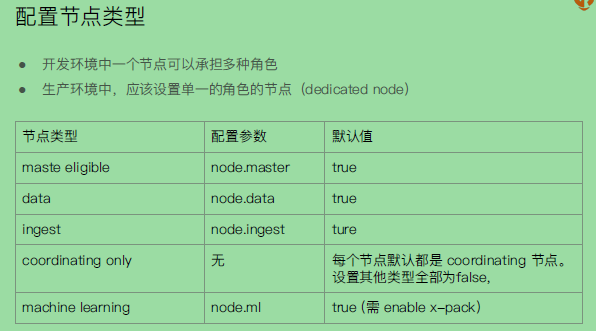


## 分片(Primary Shard&Replica Shard)

主分片，用以解决数据水平扩展的问题。通过主分片，可以将数据库分布到集群内的所有节点之上。

* 一个分片是一个运行的lucene的实例
* 主分片数在索引创建时指定，后续不允许修改，除非Reindex

副本，用以解决数据高可用的问题。分片是主分片的拷贝

* 副本分片数，可以动态的调整
* 增加副本数，还可以在一定程度上提高服务的可用性（读取的吞吐）


## 倒排索引

### 正排索引和倒排索引示例

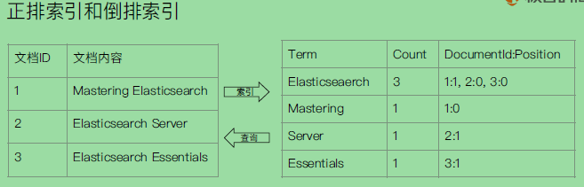


### 倒排索引概念

通俗来讲，正向索引是通过key来找value，反向索引则是通过value来找key。从图书来看，正排索引是目录页；倒排索引是索引页。

**ES分别为JSON文档中的每一个字段都建立了一个倒排索引**。

可以指定对某些字段不做索引，优点是可以节省存储空间；缺点是字段无法被搜索。

Term(单词)：一段文本经过分词器后就会输出一串单词，这一个一个的词就是term。

Term Dictionary(单词字典)：里面维护的是term，是term的集合。

Term Index(单词索引)：为了更快的找到某个单词，我们为单词建立索引。

Posting List(倒排列表)：倒排列表记录了出现过某个单词的所有文档的文档列表(文档ID)及单词在该文档中出现的位置信息，每条记录称为一个倒排项(posting)。根据倒排列表，即可获知哪些文档包含某个单词。（实际的倒排列表中并不只是存储了文档ID那么简单，还有一些其他的信息）

倒排索引项(posting)中有如下的信息：

文档ID；

词频TF，该单词在文档中出现的次数，用于相关性评分；

位置(Position)，单词在文档中分词的位置。用于语句搜索(phrase query)。

偏移(Offset)，记录单词的开始结束位置，实现高亮显示。


#### ES查询的大致过程如下


## 分词器

### 什么是Analysis

Analysis 文本分析就是把全文本转换一系列单词(term/token)的过程，也叫做分词。


### Analysis与Analyzer什么关系

Analysis 是通过Analyzer来实现的，有ES内置的Analyzer分词器，或者也可以使用按需定制化的分词器。


### 什么时候需要使用Analyzer分词器

* 在数据写入的时候使用Analyzer分词器，转换词条。
* 在匹配Query语句的时候也需要指定相同的Analyzer分词器，来对查询语句进行分析


### Analyzer由哪些部分组成

Analyzer主要是由三个部分组成的。

Character Filters(针对原始文本处理，例如去除html)

Tokenizer(按照规则切分为单词)

Token Filter(将切分的单词进行加工，小写，删除stopwords，增加同义词)

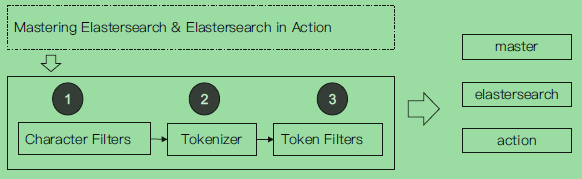


### Character Filters

* 在tokenizer之前对文本进行处理，例如增加删除及替换字符。可以配置多个Character Filters。会影响Tokenizer的position和offset信息。
* 一些自带的caharacter filters
  * HTML strip 去除html标签
  * Mapping   字符串替换
  * Pattern replace  正则匹配替换

``` 
POST _analyze
{
  "tokenizer":"keyword",
  "char_filter":["html_strip"],
  "text": "<b>hello world</b>"
}
#使用char filter进行替换
POST _analyze
{
  "tokenizer": "standard",
  "char_filter": [
      {
        "type" : "mapping",
        "mappings" : [ "- => _"]
      }
    ],
  "text": "123-456, I-test! test-990 650-555-1234"
}
#char filter 替换表情符号
POST _analyze
{
  "tokenizer": "standard",
  "char_filter": [
      {
        "type" : "mapping",
        "mappings" : [ ":) => happy", ":( => sad"]
      }
    ],
    "text": ["I am felling :)", "Feeling :( today"]
}
#正则表达式
GET _analyze
{
  "tokenizer": "standard",
  "char_filter": [
      {
        "type" : "pattern_replace",
        "pattern" : "http://(.*)",
        "replacement" : "$1"
      }
    ],
    "text" : "http://www.elastic.co"
}
```


### Tokenizer

* 将原始的文本按照一定的规则，切分为词(term or token)

* es内置的tokenizers

  whitespace / standard / uax_url_email / pattern / keyword / path hierarchy

* 可以用Java开发插件，实现自己的Tokenizer

```
POST _analyze
{
  "tokenizer":"path_hierarchy",
  "text":"/user/ymruan/a/b/c/d/e"
}
```


### Token Filters

* 将Tokenizer输出的单词(term)，进行增加，修改，删除

* 自带的Token Filters

  lowercase / stop  / synonym(添加近义词)

``` 
GET _analyze
{
  "tokenizer": "whitespace",
  "filter": ["stop","snowball"],
  "text": ["The rain in Spain falls mainly on the plain."]
}
#remove 加入lowercase后，The被当成 stopword删除
GET _analyze
{
  "tokenizer": "whitespace",
  "filter": ["lowercase","stop","snowball"],
  "text": ["The gilrs in China are playing this game!"]
}
```


### Elasticsearch的内置分词器有哪些

* standard analyzer 默认分词器，按词进行切分，小写处理
* simple analyzer 按照非字母切分(符号被过滤)，小写处理
* stop analyzer 小写处理，停用词过滤(the,a,is)
* whitespace analyzer 按照空格切分，不转小写
* keyword analyzer 不分词，直接将输入当作输出
* patter analyzer 正则表达式，默认\W+ (非字符分隔)
* Lanaguage 提供了30多种常见语言的分词器
* Customer Analyzer自定义分词器


### Standard Analyer

这是ES的默认分词器。

Character Filters：没有说明

Tokenizer：是按词来切分

Token Filter：将切分后的单词转为小写，stopwords是默认关闭的


### Simple Analyzer

Character Filters：没有说明

Tokenizer：非字母的都会被去除，例如数字，符号等

Token Filter：将切分后的单词转为小写，stopwords是默认关闭的


### Whitespace Analyzer

Character Filters：没有说明

Tokenizer：按照空格来切分单词

Token Filter：将切分后的单词转为小写，stopwords是默认关闭的


### Stop Analyzer

Character Filters：没有说明

Tokenizer：非字母的都会被去除，例如数字，符号等

Token Filter：将切分后的单词转为小写，多了stop filter，会把the/a/is等修饰性词语去除


### Keyword Analyzer

不分词，直接将输入当一个term输出


### Pattern Analyzer


### Language Analyzer

在english的分词器中

Character Filters：没有说明

Tokenizer：分词后的单词，去除掉复数，ing，等时态信息

Token Filter：将切分后的单词转为小写，多了stop filter，会把the/a/is等修饰性词语去除


### ICU Analyzer

Character Filters：Normalization

Tokenizer：ICU tokenizer

Token Filter: Normalization、Folding、Collation、Transform

这个Analyzer不是ES自带的，需要另行安装。

``` $ elasticsearch-plugin install analysis-icu```

提供了Unicode的支持，更好的支持亚洲语言


## 搜索相关性Relevance

衡量搜索的相关性中有个概念：Precision(查准率)和Recall(查全率)

* Precision (查准率) 尽可能返回较少的无关的文档，也就是查询出来的所有的正确的结果除以全部返回的结果。
* Recall (查全率) 尽量返回较多的相关文档，也就是查询出来的所有的正确的结果除以所有应该返回的正确结果的数量。
* Ranking  是否能够按照相关度进行排序


## Mapping

### 什么是mapping

就是关系型数据库中定义schema。Mapping会把JSON文档映射成Lucene所需要的扁平格式。

一个Mapping属于一个索引的Type；每个文档都属于一个Type；一个Type有一个mapping定义；从7.0开始，不需要在mapping定义中指定Type信息。

作用如下：

* 定义索引中的字段的名称
* 定义字段的数据类型，例如字符串、数字、布尔....
* 字段，倒排索引的相关配置，(Analyzed or Not Analyed, Analyzer)


### ES中字段的数据类型有哪些

* 简单类型
  * Text/keyword
  * date
  * integer / Floating
  * boolean
  * IPV4 & IPV6
* 复杂类型 - 对象和嵌套对象
  * 对象类型、嵌套类型
* 特殊类型
  * geo_point & geo_shape / percolator


### 什么是多字段类型

当我们写入一个文档到ES中，如果这个文档中的某个字段是text类型的话，那么ES默认会给我们增加一个keyword子字段。可以通过mapping信息查看到。

同样我们可以手动显性的去mapping定义一个多字段的类型，在子字段中配置不同的analyzer。例如：针对不同语言；针对pinyin字段的搜索；还支持为搜索和索引指定不通过的anayzer。

``` 
PUT products
{
    "mappins":{
        "properties":{
            "company":{
                "type":"text",
                "fields":{
                    "keyword":{
                        "type":"keyword",
                        "ignore_above":256
                    }
                }
            }
            "comment":{
                "type":"text",
                "fields":{
                    "english_comment":{
                        "type":"text",
                        "analyzer":"english",
                        "search_analyzer":"english"
                    }
                }
            }
        }
    }
}
```


### 什么是精确值，什么是全文本

exact values中包括数字、日志、具体一个字符串。可以使用es中的keyword来实现。

full text中针对的是全文本，非结构化的文本数据，例如es中的text。

精确值(exact value)当设置为keyword的时候，是不会再对这个进行分词的，无论这个有多长。ES会为这个精确值所在的字段类创建一个倒排索引。


### 什么是Dynamic Mapping

简而言之，ES自己根据文档的各个字段的信息，来自动决定创建各个字段的类型。

* 在写入文档的时候，如果索引不存在，会自动创建索引
* Dynamic Mapping的机制，使得我们无需手动定义Mappings。ES会自动根据文档信息，推算出字段的类型。
* 但是有时候会推算的不对，例如地理位置信息
* 当类型如果设置不对的时候，会导致一些功能无法正常运行，例如Range查询


### Dynamic Mapping中类型如何自动识别

| JSON类型 | Elasticsearch类型                                            |
| -------- | ------------------------------------------------------------ |
| 字符串   | * 匹配日期格式，设置成date <br>* 配置数字设置为float或long，该选项默认关闭 <br>* 设置为Text，并且增加keyword子字段 |
| 布尔值   | boolean                                                      |
| 浮点数   | float                                                        |
| 整数     | long                                                         |
| 对象     | Object                                                       |
| 数组     | 由第一个非空数值的类型所决定                                 |
| 空值     | 忽略                                                         |


### 能否更改mapping的字段类型

**新增加字段的情况下**：

* 当Dynamic设置为true的时候，一旦有新增字段的文档写入，Mapping也同时会被更新。

* 当Dynamic设置为false的时候，Mapping不会被更新，新增字段的数据无法被索引，但是信息会出现在_source中。

* 当Dynamic设置成Stric的时候，文档写入失败。

**对已有的字段**，修改字段类型的情况下：

* 对已有的字段，一旦已经有数据写入，就不再支持修改字段定义。

* Lucene实现的倒排索引，一旦生成后，就不允许被修改了。

**原因：**

* 如果修改了字段的数据类型，会导致已被索引的无法被搜索.

* 但是如果是增加新的字段，就不会有这样的影响。


### 控制Dynamic Mappings

通过设置dynamic mappings的值来影响以下三个方面：

* 新增加的文档，是否可以被索引查询出来
* 新增加的字段，是否可以被索引查询出来
* 如果存在新增字段，索引的mapping信息是否会被更新

|                | "true" | "false" | "strict" |
| -------------- | ------ | ------- | -------- |
| 文档可以被索引 | YES    | YES     | NO       |
| 字段可以被索引 | YES    | NO      | NO       |
| mapping被索引  | YES    | NO      | NO       |

值得注意的是，

* 当dynamic被设置成flase的时候，存在新增的字段的数据写入，该数据可以被索引，但是新增字段被丢弃。
* 当设置成strict模式的时候，数据写入直接出错。

修改dynamic mappings的方法：

```
#修改为dynamic false
PUT dynamic_mapping_test/_mapping
{
  "dynamic": false
}
```


## Index Template

### 什么是Index Template

index templates 帮助我们设置mappings和settings，并按照一定的规则，自动匹配到新创建的索引之上。

* 模板仅在一个索引被新创建的时候，才会产生作用。修改模板不会影响已经创建的索引
* 我们可以设定多个索引模板，这些设置会被"merge"在一起
* 可以指定"order"的数值，控制"merging"的过程


### Index Template的工作方式

当一个索引被新创建的时候

* 应用es默认的settings和mappings
* 应用order数值低的index template中的设定
* 应用order高的index template中的设定，之前的设定会被覆盖
* 应用创建索引的时候，用户所指定的settings和mappings，并覆盖之前模板中的设定

``` 
#Create a default template
PUT _template/template_default
{
  "index_patterns": ["*"],
  "order" : 0,
  "version": 1,
  "settings": {
    "number_of_shards": 1,
    "number_of_replicas":1
  }
}
PUT /_template/template_test
{
    "index_patterns" : ["test*"],
    "order" : 1,
    "settings" : {
    	"number_of_shards": 1,
        "number_of_replicas" : 2
    },
    "mappings" : {
    	"date_detection": false,
    	"numeric_detection": true
    }
}
```


## Dynamic Template

### 什么是Dynamic Template

根据ES识别的数据类型，结合字段名称，来动态设定字段类型

* 所有的字符串类型都设定成keyword，或者关闭keyword字段
* is开头的字段都设置成boolean
* long_开头的都设置成long类型

Dynamic Template是定义在某个索引的mapping中；template有一个名称；匹配规则是一个数组；为匹配到字段设置mapping

```
PUT my_index
{
  "mappings": {
    "dynamic_templates": [
            {
        "strings_as_boolean": {
          "match_mapping_type":   "string",
          "match":"is*",
          "mapping": {
            "type": "boolean"
          }
        }
      },
      {
        "strings_as_keywords": {
          "match_mapping_type":   "string",
          "mapping": {
            "type": "keyword"
          }
        }
      }
    ]
  }
}
```


### 匹配规则参数

* match_mapping_type：匹配自动识别的字段类型，如string，boolean等
* match，unmatch：匹配字段名
* path_match，path_unmatch


## 聚合分析

### 什么是聚合Aggregation

* ES除搜索以外，还提供针对ES数据统计分析的功能

  实时性高；Hadoop (T+1)

* 通过聚合，我们会得到一个数据的概览，是分析和总结全套的数据，而不是寻找单个文档。

* 高性能，只需要一条语句，就可以从ES得到分析结果

* 聚合支持嵌套


### 聚合的分类

* Bucket Aggregation 一些列满足特定条件的文档的集合
* Metric Aggregation 一些数学运算，可以对文档字段进行统计分析
* Pipeline Aggregation 对其他的聚合结果进行二次聚合
* Matrix Aggregation 支持对多个字段的操作并提供一个结果矩阵


### 聚合的作用范围及排序

ES聚合分析的默认作用范围是query的查询结果集。

同时ES还支持以下方式改变聚合的作用范围：

filter /post_filter / global


### 聚合的精准度问题

#### 分布式系统的近似统计算法

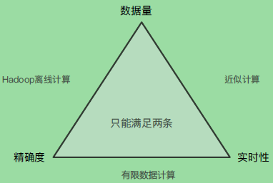


#### Terms聚合分析解析

terms聚合分析的执行流程:

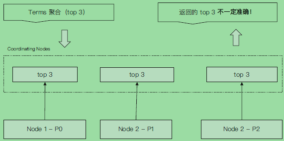

terms不正确的案例：

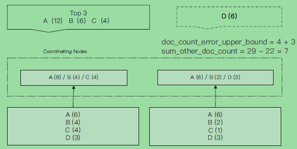


terms aggregation的返回值

* size是最终返回多少个buckt的数量
* shard_size是每个bucket在一个shard 上返回的bucket的总数。然后，每个shard上的结果，会在coordinate节点上再做一次汇总，返回总数。
* doc_count_error_upper_bound：被遗漏的term分桶，包含的文档，有可能的最大值。
* sum_other_doc_count：除了返回结果bucket的terms以外，其他terms的文档总数(总数-返回的总数)
* show_term_doc_count_error： 还会对每个 bucket都显示一个错误数，表示最大可能的误差情况。 


#### 解决terms不准的问题

提升shard_size的参数

terms聚合分析不准的原因，数据分散在多个分片上，coordinating node无法获取数据全貌。

* 解决方案1：当数据量不大的时候，设置primary shard为1；实现准确性。
* 解决方案2：在分布式数据上，设置shard_size参数，提高精确度。(原理是：每次从shard上额外多获取数据，提升准确率)

shard_size设定

* 调整shard size大小，降低doc_count_error_upper_bound来提升准确度

  增加了整体计算量，提高了准确度，但会降低相应时间

* shard size默认大小设定

  shard size = size * 1.5 +10

  


### Aggregation的语法

Aggregation属于search的一部分。一般情况下，建议将其size指定为0。

类似的语法如下：

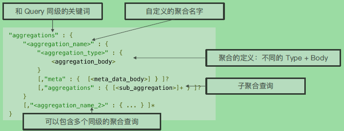


### Bucket & Metric 

metric类似SQL中的count统计，bucket类似SQL中的group by.

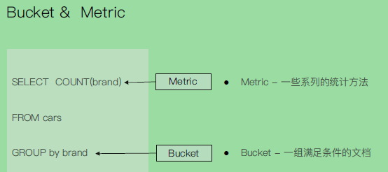


### Buket

我们可以对一类商品分为高档、中档、低档三类，再对高档商品中分为好评、中评、差评。

ES中提供很多类型的Bucket，帮助我们用多种方式划分文档。例如Term & Range(时间/年龄区间/地理位置)。

``` 
#按照目的地进行分桶统计
GET kibana_sample_data_flights/_search
{
	"size": 0,
	"aggs":{
		"flight_dest":{
			"terms":{
				"field":"DestCountry"
			}
		}
	}
}
```


### Metric

* Metric会基于数据集计算结果，除了支持在字段上进行计算，统一也支持在脚本(painless script)产生的结果之上进行计算

* 大多数Metric是数学计算，仅输出一个值

  min/max/sum/avg/cardinality

* 部分metric支持输出多个数值

  stats/percentiles/percentile_ranks

``` 
#查看航班目的地的统计信息，增加平均，最高最低价格
GET kibana_sample_data_flights/_search
{
	"size": 0,
	"aggs":{
		"flight_dest":{
			"terms":{
				"field":"DestCountry"
			},
			"aggs":{
				"avg_price":{
					"avg":{
						"field":"AvgTicketPrice"
					}
				},
				"max_price":{
					"max":{
						"field":"AvgTicketPrice"
					}
				},
				"min_price":{
					"min":{
						"field":"AvgTicketPrice"
					}
				}
			}
		}
	}
}
#嵌套查询价格统计信息+天气信息
GET kibana_sample_data_flights/_search
{
	"size": 0,
	"aggs":{
		"flight_dest":{
			"terms":{
				"field":"DestCountry"
			},
			"aggs":{
				"stats_price":{
					"stats":{
						"field":"AvgTicketPrice"
					}
				},
				"wather":{
				  "terms": {
				    "field": "DestWeather",
				    "size": 5
				  }
				}

			}
		}
	}
}
```


## Term Query

这里的term query，单指的是在request body search 中的term查询。精确值匹配

Term是表达语意的最少单位。搜索和利用统计语言模型进行自然语言处理都需要处理Term。

特点：

* Term level Query:Term Query/ Range Query /Exists Query /Prefix Query /Wildcard Query
* **在ES中，Term查询，对输入不做分词处理**。会将输入作为一个整体，在倒排索引中查找准确的词项，并且使用相关度算分公式为每个包含该词项的文档进行相关度算分。输入什么就是查询什么， 例如输入"Apple"，就是查询的是"Apple"，而"apple"是不会放结果的。而text类型中，会对数据进行分词处理，改为小写。如果term查询中，不是全小写，很有可能是查询不到的。
* 可以通过Constant Score将查询转换成一个Filtering，避免算分，并利用缓存，提高性能。

如何解决term 查询搜索不到结果的问题：

* 如果针对的是text类型的字段的查询，那么term 查询的时候，使用字段名称.keyword，使用keyword会对查询进行完全匹配，插入的值是什么，查询的时候输入什么，就会查询出来。

  ``` 
  POST /products/_search
  {
    "query": {
      "term": {
        "productID": {
          "value": "XHDK-A-1293-#fJ3"
        }
      }
    }
  }
  ```

  

* term查询的时候，输入的查询条件中，查询字段的值，自己手动改为小写来查询。

  ```
  POST /products/_search
  {
    "query": {
      "term": {
        "desc": {
          //"value": "iPhone"
          "value":"iphone"
        }
      }
    }
  }
  ```


## 基于全文的查询

和term query不同的是，这是基于全文的查询，查询的时候会对输入的查询条件的值，进行分词处理。

有Match Query / Match Phrase Query / Query String Query。

特定是：

* **索引和搜索的时候都会进行分词**，查询字符串先传递到一个合适的分词器，然后生成一个供查询的**词项列表**。
* 查询的时候，先会对输入的查询进行分词，然后**每个词项**逐个进行底层的查询，最终将**结果进行合并**。并**为每个文档生成一个算分**。例如查询"Matrix reloaded"，会查到包括Matrix或者reload的所有结果。


### Match Query查询过程

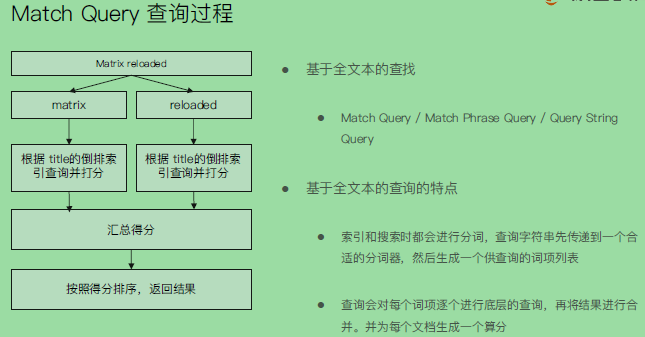


## 结构化搜索

或者可以理解为term查询，或者说是对精确值的查询。


### 什么是结构化数据

* 结构化搜索是指对结构化数据的搜索

  比如日期，布尔类型和数字都是结构化的

* 文本也可以是结构化的

  * 比如彩色笔可以由离散的颜色集合
  * 一个博客可能被标记了标签
  * 电商网站上的商品都有UPCS或者其他的唯一标识，它们都需要遵从严格的规定结构化的格式。


### ES中的结构化搜索

结构化数据：

布尔，时间，日期和数字这类结构化数据：有精确的格式，我们可以对这些格式进行逻辑操作。包括比较数字或时间的范围，或判定两个值的大小。

结构化文本：

结构化的文本可以做精确匹配或部分匹配。

结构化结果：

结构化结果只有"是"或"否"两个值；根据场景需要，可以决定结构化搜索是否需要打分。


## 搜索相关性算分

### 相关性和相关性算分

相关性也就是Relevance,值得注意的是也只有match 查询才有算分的过程，term 查询没有。

* 搜索的相关性算分，**描述了一个文档和查询语句匹配的程度**。ES会对每个匹配查询条件的结果进行算分 _score
* 打分的本质是排序，需要把最符合用户需求的文档排在前面。在ES 5之前，默认的相关性算分采用TF-IDF，现在采用BM 25


### 词频 TF

* Term Freuency：检索词在一篇文档中出现的频率

  **也就是检索词出现的次数除以文档的总字数**

* 度量一条查询和结果文档相关性的简单方法：简单将搜索中每一个词的TF进行相加

  TF(区块链)+TF(的)+TF(应用)

* Stop Word

  "的"在文档中出现了很多次，但是对贡献相关度几乎没有用处，不应该考虑其TF值


### 逆文档频率 IDF

* DF：检索词在所有文档中出现的频率

  这里中，"区块链"在相对比较少的文档中出现；"应用"在相对比较多的文件中出现；"stop word"在大量的文档中出现

* Inverse Document Frequency：简单说是 log(全部文档数/检索词出现过的文档总数)

* TF-IDF本质上就是将TF求和变成了加权求和

  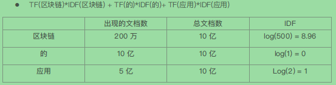


### TF-IDF的评分公式

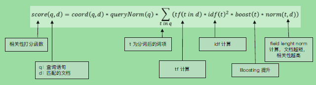

注意的一个参数boosting，可以用来影响算分。


### BM 25

从ES 5开始，默认算法改为BM 25

和经典的TF-IDF相比，当TF无限增加时，BM 25算分会趋于一个数值。

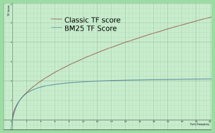


### 自定义相似性

可以自己定义similarity

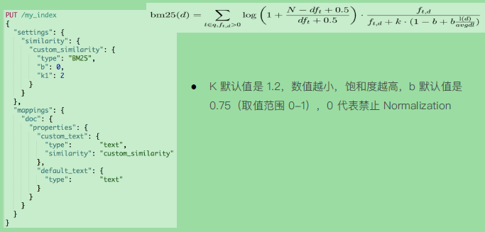


### Explain API查看TF-IDF

在Request body search中打开"explain":true的方法来查看Explain的API

``` 
POST /testscore/_search
{
  "explain": true,
  "query": {
    "match": {
      "content":"you"
      //"content": "elasticsearch"
      //"content":"the"
      //"content": "the elasticsearch"
    }
  }
}
```


### Boosting Relevance

* Boosting是控制相关度的一种手段，可以在索引、字段或查询子条件中进行设置
* 参数boost的含义
  * 当boost>1的时候，打分的相关度相对性提升
  * 当0<boost<1的时候，打分的权重相对性降低
  * 当boost<0的时候，贡献负分

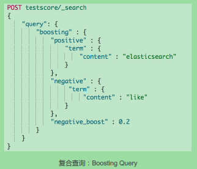


## Query Context & Filter Context

ES中查询子句可以分为query context（查询上下文）和filter context（过滤上下文）。

**查询上下文**，是指其使用的查询子句回答了"此文档与此查询子句的匹配程度"的问题。除了决定文档是否匹配外，查询子句还会计算一个_score，表示此文档和其他文档的匹配程度。

**过滤器上下文**，是指在过滤器上下文中，一个查询子句回答了"此文档是否匹配此查询子句？"的问题。该答案是简单的"YES"或"NO"，没有scores算分的。过滤器上下文主要是用来过滤结构性数据，（一般里面嵌套term 查询）。同时频繁使用的过滤器，将被ES自动缓存，以提升性能。


## 布尔查询

一般应用于多字符串，多字段的复合查询。也就是说查询条件有很多个，有要过滤字段的(filter context)，有要匹配字符串的(query context)。

一个bool查询，是一个或多个查询子句的组合。

**总共包括4种子句。其中2种会影响算分，2种不影响算分**。

**相关性并不只是全文本检索的专利**。也适用于yes | no的子句，**匹配的子句越多，相关性评分越高**。如果多条查询子句被合并为一条复合查询语句，例如bool查询，则每个查询子句计算得出的评分会被合并到总的相关性评分中。

Term query只是不会去分词，还是会算分的。

| must子句     | query context<br>必须匹配，贡献算分         |
| ------------ | ------------------------------------------- |
| should子句   | query context<br/>选择性匹配，贡献算分      |
| must_not子句 | Filter Context<br>必须不能匹配，不贡献算分  |
| filter子句   | Filter Context<br/>必须匹配，但是不贡献算分 |


## Disjunction Max Query

Disjunction Max Query应用于单字符串多字段查询的场景，很多搜索引擎都是这样的。允许你只是输入一个字符串，要多所有的字段进行查询。

下面例子中，只是输入了一个"Brown fox"的字符串，需要对所有的字段做匹配。我们这里使用的是bool查询中的should。

``` 
POST /blogs/_search
{
    "query": {
        "bool": {
            "should": [
                { "match": { "title": "Brown fox" }},
                { "match": { "body":  "Brown fox" }}
            ]
        }
    }
}
```


should的算分过程

* 对每个文档中，执行查询should语句中的两个查询
* 加和这两个查询的评分
* 乘以匹配语句的总数
* 除以所有语句的总数


Disjunction Max Query将任何与任一查询匹配的文档作为结果返回。采用字段上最匹配的评分最终评分返回。

``` 
POST blogs/_search
{
    "query": {
        "dis_max": {
            "queries": [
                { "match": { "title": "Quick pets" }},
                { "match": { "body":  "Quick pets" }}
            ]
        }
    }
}
```


## Multi Match

multi match同样运用于单字符串多字段的查询。

单字符串多字段查询中场景归纳：

* 最佳字段(Best Fields)

  当字段之间相互竞争，又相互关联。例如title和body这样的字段，评分来自最匹配字段。

* 多数字段(Most Fields)

  处理英文内容时：一种常见的手段是，在主字段(english analyzer)，抽取词干，加入同义词，以匹配更多的文档。相同的文本，加入子字段(standard analyzer)，以提供更加精确的匹配。其他字段作为匹配文档提高相关度的信号。匹配字段越多越好。

* 混合字段(Cross Field)

  对于某些实体，例如人名，地址，图书信息。需要在多个字段中确定信息，单个字段之鞥呢作为整体的一部分。希望在任何这些列出的字段中找出尽可能的词。


## Search Template

ES中的search template是用来解耦程序的开发和ES搜索DSL的，这样开发工程师、搜索工程师、性能工程师可以各司其职。

在开发初期，虽然可以明确查询参数，但是往往还不能最终定义查询的DSL的具体结构。

可以定义一个search template，这样前端的开发工程师直接调用这个模板来查看到查询结果就可以了。


## Suggester API

### 什么是搜索建议

现代的搜索引擎，一般的都会提供Suggest as you type的功能。

帮助用户在输入搜索的过程中，进行**自动补全或者纠错**。通过协助用户输入更加精准的关键词，提高后续搜索阶段文档匹配的程度。

在Google上搜索的时候，一开始会自动补全。当输入到一定长度，如因为单词拼写错误无法补全，就会开始提示相似的词或句子。


### 精准度和召回率

* 精准度

  completion > phrase > term

* 召回率

  term > phrase > completion

* 性能

  completion > phrase > term


### ES Suggester API

* 搜索引擎中类似的功能，在ES中是通过Suggester API实现的。
* 原理：将输入的文本分解为Token，然后在搜索的字典里查找相似的Term并返回。
* 根据不同的使用场景，ES设计了4种类别的Suggesters
  * Term & Phrase Suggester
  * Complete & Context Suggester


### Term Suggester 和Phrase Suggester

term suggester按照"suggest_mode"可以分为如下几种：

* Missing：如索引中已经存在，就不提供建议
* Popular：推荐出现频率更加高的词
* Always：无论是否存在，都提供建议。

Phrase Suggester在term suggester上增加了一些额外的逻辑。

例如下面的参数：

* Suggest Mode: missing，popular，always
* Max Errors：最多可以拼错的Terms数
* Confidence：限制返回结果数，默认是1


### Completion Suggester

* completion Suggester提供了"自动完成"(auto complete)的功能。用户每输入一个字符，就需要即时发送一个查询请求到后端查找匹配项。

* 对性能要求比较苛刻。ES采用了不同的数据结构，并非通过倒排索引来完成的。而是将Analyze的数据编码成FST和索引一起存放。FST会被ES整个加载进内存，速度很快。
* FST只能用于前缀查找


### Context Suggester

context suggester是completion suggester的扩展，

可以在搜索中加入更多的上下文信息，例如，输入"star"

* 咖啡相关：建议"starbucks"
* 电影相关的："star wars"


## 文档分布式存储

整理这个章节的目的在于，需要去深入了解文档的查询和索引的过程，文档是如何按分片存储的。


### 概述文档存储

文档会存储在具体的某个主分片和副本分片上：例如文档1，会存储在PO和RO分片上。

文档到分片的映射算法：

* 确保文档能均匀分布在所用分片上，充分利用硬件资源，避免部分机器空闲，部分机器繁忙
* 潜在的算法：
  * 方案一：随机/Round Robin。当查询文档的时候，这个时候分片数很多，需要多次查询才可能查询到。
  * 方案二：维护文档到分片的映射关系。当文档数据量大的时候，维护成本高。
  * 方案三：实时计算，通过文档1，自动算出，需要去哪个分片上获取文档。


### 文档到分片路由算法

shard=hash(_routing)%number_of_primary_shards

* Hash算法确保文档均匀分散到分片中
* 默认的_routing值是文档id
* 可以自行制定routing数值，例如用相同国家的商品，都分配到指定的shard
* 设置Index Setting后，**Primary数，不能随意修改的根本原因**。

参考如下的写入文档的时候，指定_routing的值

```
PUT posts/_doc/100?routing=bigdata
{
  "title":"Mastering Elasticsearch",
  "body":"Let's Rock"
}
```


### 倒排索引不可变性

* 倒排索引采用的是immutable design，一旦生成，不可更改
* 不可变性，带来的好处有：
  * 无需考虑并发写文件的问题，避免了锁机制带来的性能问题
  * 一旦读入内核的文件系统缓存，便留在那里。只要文件系统缓存有足够的空间，大部分请求就会直接请求内存，不会命中磁盘，提升了很大的性能。
  * 缓存容易生产和维护/数据可以被压缩
* 不可变性，带来挑战：如果需要让一个新的文档可以被索引，需要常见整个索引。


### Lucene Index

在lucene中有两个概念，一个是segment，一个是index。多个segment组成了一个index。

* 在lucene中，单个倒排索引文件被称为segment。segment是自包含的，不可变更的。多个segments汇总在一起，称为Lucene的index，其对应的就是ES的shard。
* 当有新文档写入的时候，会生成新的segment，查询时会同时查询所有的segments，并且对结果汇总。lucene中有一个文件，用来记录所有segments信息，叫做commit point。
* 删除的文档信息，保存在".del"文件中。

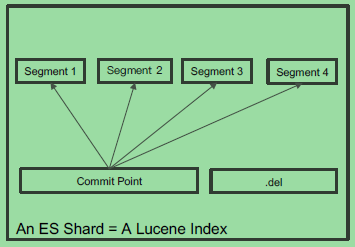


### 什么是Refresh

* 将index buffer写入segment的过程叫做refresh。refresh不执行fsync操作。
* Refresh频率：默认1秒发生一次，可通过index.refresh_interval配置。Refresh后，数据就可以被搜索到了。这也是为什么ES被称为近实时搜索。
* 如果系统有大量的数据写入的时候，那就会产生很多的segment。
* index buffer被占满时，会触发Refresh，默认值是JVM的10%。

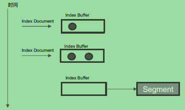


### 什么是Transaction Log

* Segment写入磁盘的过程相对耗时，借助文件系统缓存，Refresh时，先将Segment写入缓存以开放查询。
* 为了保证数据不会丢失。所以在Index文档的时候，同时写Transaction Log，高版本开始，Transaction Log默认落盘。每个分片由一个Transaction Log。
* 在ES Refresh时，Index Buffer被清空，Transaction Log不会清空。

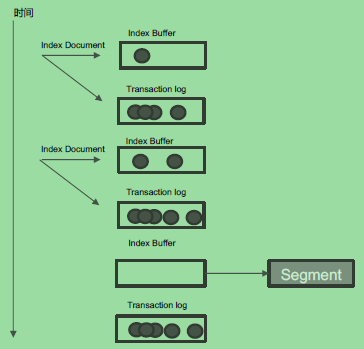


### 什么是Flush

Flush主要是指调用fsync将缓存中的segments写入磁盘的过程。

具体描述ES Flush和lucene commit的过程如下：

* ES写入index buffer，当默认间隔1S或者index buffer到JVM的10%的时候，触发refresh将buffer写入到lucene中的segment。（写入index buffer的时候同时会写transaction log）refresh后的index buffer为清空了。
* 默认经过30分钟或者transaction log满512M的时候，调用fsync将缓存中的segments写入到磁盘中。最后会清空删除相应的transaction log。


### 什么是Merge

* 当segment很多的时候，需要被定期被合并。

  这个时候可以调用merge的API来实现，这样会减少segments的数量，并且会删除已经删除的文档。

* ES和lucene会自动进行merge操作，我们也可以通过手动调用POST my_index/_forcemerge来执行。

* ES有一个后台进程专门负责segment的合并，它会把小segments合并成更大的segments，然后反复这样。


### 整个索引文档到分片的流程

1. 客户端发起数据写入请求，对你写的这条数据根据_routing规则选择发给哪个Shard。 
   * 确认Index Request中是否设置了使用哪个Filed的值作为路由参数 
   * 如果没有设置，则使用Mapping中的配置 
   * 如果mapping中也没有配置，则使用_id作为路由参数，然后通过_routing的Hash值选择出Shard，最后从集群的Meta中找出出该Shard的Primary节点。

2. 写入请求到达Shard后，先把数据写入到内存（buffer）中，同时会写入一条日志到translog日志文件中去。
   * 当写入请求到shard后，首先是写Lucene，其实就是创建索引。 
   * 索引创建好后并不是马上生成segment，这个时候索引数据还在缓存中，这里的缓存是lucene的缓存，并非Elasticsearch缓存，lucene缓存中的数据是不可被查询的。 

3. 执行refresh操作：从内存buffer中将数据写入os cache(操作系统的内存)，产生一个segment file文件，buffer清空。
   * 写入os cache的同时，建立倒排索引，这时数据就可以供客户端进行访问了。 
   * 默认是每隔1秒refresh一次的，所以es是准实时的，因为写入的数据1秒之后才能被看到。
   * buffer内存占满的时候也会执行refresh操作，buffer默认值是JVM内存的10%。
   * 通过es的restful api或者java api，手动执行一次refresh操作，就是手动将buffer中的数据刷入os cache中，让数据立马就可以被搜索到。 
   * 若要优化索引速度, 而不注重实时性, 可以降低刷新频率。

4. translog会每隔5秒或者在一个变更请求完成之后，将translog从缓存刷入磁盘。 
   * translog是存储在os cache中，每个分片有一个，如果节点宕机会有5秒数据丢失，但是性能比较好，最多丢5秒的数据。 
   * 可以将translog设置成每次写操作必须是直接fsync到磁盘，但是性能会差很多。 
   * 可以通过配置增加transLog刷磁盘的频率来增加数据可靠性，最小可配置100ms，但不建议这么做，因为这会对性能有非常大的影响。 

5. 每30分钟或者当tanslog的大小达到512M时候，就会执行commit操作（flush操作），将os cache中所有的数据全以segment file的形式，持久到磁盘上去。 
   * 第一步，就是将buffer中现有数据refresh到os cache中去。
   * 清空buffer 然后强行将os cache中所有的数据全都一个一个的通过segmentfile的形式，持久到磁盘上去。
   * 将commit point这个文件更新到磁盘中，每个Shard都有一个提交点(commit point), 其中保存了当前Shard成功写入磁盘的所有segment。
   * 把translog文件删掉清空，再开一个空的translog文件。
   * flush参数设置有，index.translog.flush_threshold_period , index.translog.flush_threshold_size，控制每收到多少条数据后flush一次, index.translog.flush_threshold_ops。

6. Segment的merge操作：
   * 随着时间，磁盘上的segment越来越多，需要定期进行合并。
   * Es和Lucene 会自动进行merge操作，合并segment和删除已经删除的文档。 
   * 我们可以手动进行merge：POST index/_forcemerge。一般不需要，这是一个比较消耗资源的操作。


# Logstash

## logstash是什么

logstash是ETL工具，数据收集处理引擎，java写的。支持200多个插件。

logstash支持从文件、HTTP、数据库、Kafka等数据源中读取数据，经过定义的规则进行加工清洗和处理，然后最终吐到mogodb、es、HDFS的数据分析器中进行分析和查询。

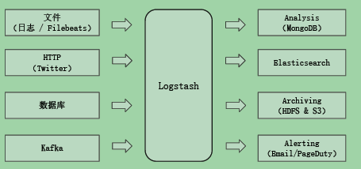


## logstash中的基本概念

pipeline 

* 包含了input - filter - output 三个阶段的处理流程
* 可以对插件进行生命周期管理
* 内置队列的管理

logstash event

* event是数据在内部流转的时候，具体表现形式。数据在input阶段被转换为event，在output阶段被转化为目标格式的数据。
* event其实就是一个java object，在配置文件中，可以对event的属性进行增删改查。


## logstash架构简介

Codec(code / decode)：将原始数据decode成event；将event encode成目标数据。

从input -> 配置code成event -> 经过filter过滤 -> 然后将event encode -> 通过output输出。

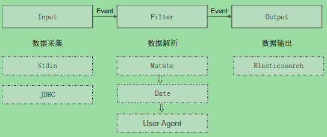


## Input Plugins

一个pipeline可以有多个input插件

* stdin/file
* beats/log4j/elasticsearch/JDBC/kafka/babbitmq/redis
* JMX/HTTP/Websocket/UDP/TCP
* Google Cloud Storages/S3
* Github/Twitter


## Codec Plugins

将原始数据decode成event；将event encode成目标数据

内置的codec plugins有   https://www.elastic.co/guide/en/logstash/7.2/codec-plugins.html 

* line/multiline

* json/avro/cef

* dots/rubydebug


## Filter Plugins

处理event

内置的filter plugins有： https://www.elastic.co/guide/en/logstash/7.2/filter-plugins.html 

* mutate 操作event的字段

* metrics aggregates metrics

* ruby  执行ruby代码


## Output Plugins

将Event发送到特定的目的地，是pipeline的最后一个阶段。

常见的output plugins有, https://www.elastic.co/guide/en/logstash/7.2/output-plugins.html 

* elasticsearch 
* email/pageduty
* influxdb/kafka/mogodb/opentsdb/zabbix
* http/tcp/websocket


## Queue

在logstash中可以配置queue.type为persisted的方式，也就是说在会在当前文件夹下会存储当前正在处理的数据，当初队列来使用。即input已经取到该数据，而filter和output还没处理的数据。 

如果设置了persisted的方式，那么在logstash重启了以后，也不会丢失正在处理的数据，数据会在存储在磁盘上，这样可以继续进行filter和output。

当已经output到ES完成后，会删除掉persisted磁盘中的数据。

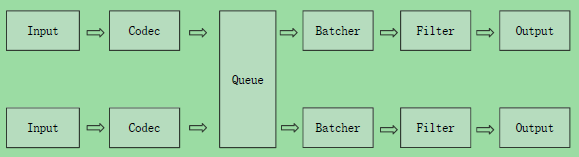

In memory queue:

* 进程crash的时候，机器会宕机，都会引起数据的丢失

Persistent Queue:

* queue.type.persisted（默认是memory）,可以设置queue.max_bytes: 4gb 。

  机器宕机，数据也不会丢失；数据保证会被消费；可以替代kafka等消息队列缓冲区的作用

   https://www.elastic.co/guide/en/logstash/7.2/persistent-queues.html 


## Input Plugin -File

* 支持从文件中读取数据，如日志文件

* 文件读取需要解决的问题

  只被读取一次，重启后需要从上次读取的位置继续(通过sincedb实现)

* 读取到文件新内容，发现新文件

* 文件发生归档操作(文档位置发生变化，日志rotation)，不能影响当前的内容读取


## Code Plugin - Multiline

也就是对于多行的情况下，如何匹配是否属于上一个event还是下一个event。

设置参数：

pattern：设置行匹配的正则表达式

what：如果匹配成功，那么匹配行属于上一个事件还是下一个事件，可选Previous / Next

negate true /false：是否对pattern结果取反，可选为true或flase


## Filter Plugin

filter plugin可以对logstash event进行各种处理，例如解析，删除字段，类型转换

* date：日期解析
* dissect：分隔符解析
* grok：正则匹配解析
* mutate：处理字段。重命名，删除，替换
* ruby：利用ruby代码来动态修改event


### Filter Plugin -Mutate

对字段做各种操作

* convert 类型转换

* gsub 字符串替换

* split / join / merge字符串切割，数组合并字符串，数组合并数组

* rename 字段重命名

* update / replace 字段内容更新替换

* remove_field 字段删除


