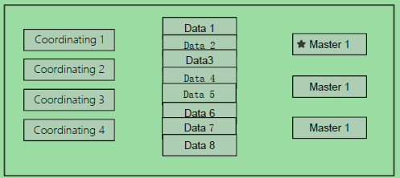
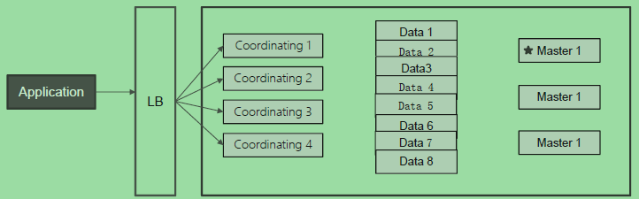
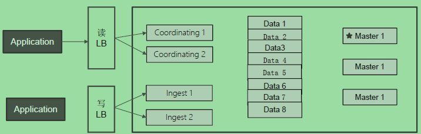
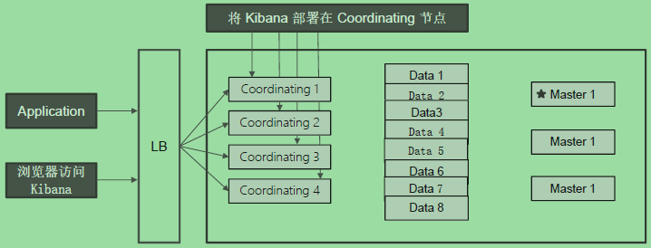

**ELK中架构知识点整理**


# ES集群节点部署方式

这里说的集群部署方式的整理，主要针对的是对于node(节点)的规划，在ES中有很多种节点角色。


## 为什么要进行节点规划

ES中有很多种节点的角色，承担不同的角色任务。节点角色规划的好坏，涉及到如何ES中master节点的高可用，data节点的水平扩展，读写分离等。


## 节点和机器是什么关系

节点是一个ES的实例。

* 本质上就是一个JAVA进程
* 一台机器上可以运行多个ES进程，但是生产环境一般建议一台机器上只运行一个es的实例。

* 单节点ES的JVM内存尽量不超过32G
* 单节点存储数据量尽量不要超过5TB
* 高并发搜索场景推荐单节点配置16C/64G/2TB SSD
* ES集群节点数不要超过300.


## 节点类型有哪些

需要注意的是节点和角色是两个概念，一个节点可以承担多种角色，也可以一个节点单一角色。

ES中有多种节点角色，有Master eligible、data、Ingest、Corrdinating、Machine learning等。

**master node**：处理创建，删除索引等请求 / 决定分片被分配到哪个节点 / 负责索引的创建与删除；集群状态，维护了一个集群中必要的信息（所有的节点信息、所有的索引和其相关的Mapping与Setting信息、分片的路由信息）

**master eligible**：一个集群，支持配置多个Master Eligible节点。这些节点可以在必要的时候(如Master节点出现故障，网络故障时)参与选主流程，成为Master节点。

**data node**：保存包含索引文档的分片数据，执行CRUD、搜索、聚合相关的操作。属于：内存、CPU、IO密集型，对硬件资源要求高。 

**Coordinating Node**：搜索请求在两个阶段中执行（query 和 fetch），这两个阶段由接收客户端请求的节点 - 协调节点协调。在请求阶段，协调节点将请求转发到保存数据的数据节点。 每个数据节点在本地执行请求并将其结果返回给协调节点。在收集fetch阶段，协调节点将每个数据节点的结果汇集为单个全局结果集。

**ingress node**：ingest 节点可以看作是数据前置处理转换的节点，支持 pipeline管道 设置，可以使用 ingest 对数据进行过滤、转换等操作，类似于 logstash 中 filter 的作用，功能相当强大。可以把Ingest节点的功能抽象为：**大数据处理环节的“ETL”**——抽取、转换、加载。

**hot&warm node**：不同硬件配置的Data Node,用来实现Hot&Warm架构，降低集群部署的成本。

**Machine Learing Node**：负责跑机器学习的Job，用来做异常检测。

> 在开发测试环境中，一个节点可以承担多种角色；
>
> 在生产环境中，根据数据量、写入和查询的吞吐量，来选择合适的部署方式。建议设置单一角色的节点(dedicated node)


## 节点角色如何定义

一个节点在默认情况下会同时扮演：master eligible，data node和ingress node。


### 配置参数介绍

| 节点类型          | 配置参数    | 默认值                      |
| ----------------- | ----------- | --------------------------- |
| master eligible   | node.master | true                        |
| data              | node.data   | true                        |
| ingest            | node.ingest | true                        |
| coordinating only | 无          | 设置上面三个参数全部是false |
| machine learning  | node.xml    | true (需要enable x-pack)    |


### 单一角色节点配置

单一的master节点：

```
node.master: true
node.ingest: false
node.data: false
```


单一的data节点：

``` 
node.master: false
node.ingest: false
ndoe.data: true
```


单一的ingest节点：

``` 
node.master: false
node.ingest: true
node.data: false
```


单一的coordinate节点:

``` 
node.master: false
node.ingest: false
node.data: false
```


### 单一角色好处

Dedicated master eligible nodes(或者dedicate master node)：

* 负责集群状态(cluter state)的管理
* 使用低配置的CPU，RAM和磁盘
* 在生产环境中配置3台；一个集群中只有1台活跃主节点(用于分片管理，索引创建，集群管理等操作)。高可用，避免脑裂。
* 生产上和数据节点合用不合适(数据节点占用内存较高)。
* 生产上和coordinate节点合用不合适(coordinate节点有时候可能会有开销很高的查询，导致OOM)

Dedicated data nodes:

* 负责数据存储及处理客户端请求
* 使用高配置的CPU，RAM和磁盘

Dedicate ingest nodes：

* 负责数据处理
* 使用高配置CPU，中等配置的RAM；低配置的磁盘。

Dedicate Coordinating Only Node(client node)：

* 中高等配置CPU；中高等RAM；低配置的磁盘。
* 生产环境中，建议为一些大的集群配置coordinating only nodes。
* 可以扮演load balancers的角色。降低master和data nodes的负载。
* 负载搜索结果的gather / reduce
* 有时候无法预知客户端会发送怎么样的请求，例如有可能会有大量占用内存的聚合操作，一个深度聚合可能引发OOM。


## 数据节点水平扩展

当数据节点的磁盘容量无法满足的时候，可以增加数据节点；磁盘读写压力大的时候，也可以增加数据节点。

如果索引设置了多分片，发现在增加了数据节点后，会自动把分片均匀分配到多个节点上了。




## Coordinating node水平扩展

当系统中有大量的复合查询及聚合的时候，可以增加coordinating节点，来增加查询的性能




## Ingest节点读写分离

通过定义多个ingest节点，专门用于处理ES的写请求，事先对数据进行ETL的处理。

而平时的读请求，则通过定义多个coordinating node来实现的。




## 部署kibana

我们可以通过把kibana的节点部署在coordinating节点的机器上，因为有些时候直接通过kibana的页面进行日志的查询和统计分析也较为方便。而kibana的访问逻辑和通过coordinating节点的逻辑时同样的。




## Hot & Warm节点规划

适用场景：

* 如果数据通常不会有update操作；
* 适用于time based索引数据(生命周期管理)，同时数据量比较大的场景。(日志查询场景)
* 引入warm节点，低配置大容量的机器存放老数据，以降低部署成本。

不同配置：

* Hot节点，通常使用SSD;索引有不断新文档写入。
* Warm节点，通常适用HDD；索引不存在新数据的写入；同时也不存在大量的数据查询。

标记节点：

* 在ES启动的时候通过node.attr.my_node_type为hot或者warm标签
* 在写入ES的创建索引的时候，通过setting配置，要求写入host节点。
* 后期通过index.routing.allocation的一个索引级别的dynamic setting来设置warm。


# 分片设定和管理

## 为什么要进行索引分片的规划

对于某个索引进行分片的规划和管理是非常重要的工作，是整体ES规划的逻辑部分内容。


## 什么是索引分片的规划

**主要涉及到如何规划一个索引的主分片数和副本分片数**。

ES的分布式特性，主要体现在多分片的设计上。

主分片数量过小，如果该索引增长很快，集群无法通过增加节点实现对这个索引的数据扩展。

主分片数量过大，导致单个分片容量很小，引发一个节点上有过多分片，影响性能。

副本分片数设置过多，会降低集群整体的写入性能。


### 多分片的好处

* 当分片数 > 节点数的时候，一旦集群中有新的数据节点加入的时候，分片就可以自动进行分配。
* 分片在重新分配的时候，系统不会有downtime。
* 一个索引如果分布在不同的节点，多个节点查询可以并行执行。
* 一个索引如果分布在不同的节点，数据写入可以分散到多个机器。


### 分片过多的副作用

* shard分片是ES实现集群水平扩展的最小单位
* 由于每个分片是一个lucene的索引，分片过多会使用过多的机器的资源。(例如lucene indices/file descriptiors / RAM/ CPU ,每次搜索的请求，需要从每个分片上获取数据，分片的meta信息由master节点维护。控制分片总数在10W以内)


## 如何做好索引分片的规划

### 注意事项

* 需要注意的是从7.0开始，新创建的一个索引的时候，默认只有一个主分片。
* 单个分片也有好处，对单个分片的查询算分，聚合不准的问题都可以得到避免。
* 单个索引，单个分片的时候，集群无法实现水平扩展。
* 即使增加新的节点，也无法实现水平扩展。


### 如何确定主分片数

从存储的物理角度看：

* 日志类应用，单个分片不要大于50GB.
* 搜索类应用，单个分片不要超过20GB.

为什么要控制主分片存储大小：

* 提供update的性能
* Merge的时候，减少所需的资源
* 丢失节点后，具备更快的恢复速度 / 便于分片在集群内rebalancing


### 如何确定副本分片数

副本是主分片的拷贝。

设置合适的副本分片，可以提高系统可用性：相应查询请求，防止数据丢失。

需要占用和主分片一样的资源。

* 副本会降低数据的索引速度：有几份副本就会有几倍的CPU资源消耗在索引上。

* 会减缓对主分片的查询压力，但是会消耗同样的内存资源

  如何机器资源充分，提高副本数，可以提高整体的查询QPS。


### 优化节点中分片数量

如果一个已经运行的集群中里面新增加一台新机器，由于历史数据比较多，ES的自身的均衡机制（分片策略会尽量保证节点上的分片数大致相同）需要很长的时间。而我们的ES集群需要一直对外提供服务的，那么新创建的索引shards基本上都分片到了新机器上了。这样会存在热点数据过于集中，有性能问题。

下面的参数的设置可以解决这些问题，但是需要注意的是，这些设置是强制执行的硬限制，可能会导致某些分片未分片。


#### index.routing.allocation.total_shards_per_node:

动态设置允许你指定每个节点允许的单个索引中分片总数的硬限制.

将分配给单个节点的最大分片数（副本和主分片）。默认为无边界。 


#### cluster.routing.allocation.total_shards_per_node:

可以限制一个节点可以拥有的分片数量，而不考虑索引。

将全局分配给单个节点的最大分片数（副本和主分片）。默认为无边界（`-1`）。 


# 集群容量规划

## 什么是容量规划

整理的规划中需要多少个节点，每个索引多少个分片。

这里的规划，更考虑的是磁盘容量的规划。

* 规划上需要保持一定的余量，当负载出现波动，节点出现丢失时，还能正常工作。
* 考虑机器的软硬件配置
* 单条文档的尺寸、文档的总数据量、索引的总数据量(Time base数据保留的时间)、副本分片数
* 文档是如何写入的(bulk的尺寸)
* 文档的复杂度，文档是如何进行读取的(怎样进行查询和聚合)


## 评估业务的性能需求

首先需要评估下业务的性能需求是什么。

* 数据吞吐及性能需求
  * 数据写入的吞吐量，每秒要求写入多少数据？
  * 查询的吞吐量？
  * 单条查询可以接受的最大返回时间？
* 了解我们的数据
  * 数据的格式和数据的mapping
  * 实际的查询和聚合长的是什么样子


## 两个场景分类

整体ES的使用场景规划，分为两个场景：

搜索类：固定大小的数据集

* 搜索的数据集增长相对比较缓慢

日志：基于时间序列的数据

* 使用ES存放日志与性能指标。数据每天不断写入，增长数据较快
* 结合warm node做数据的老化处理。


## 硬件配置的规划

* 选择合理的硬件，数据节点尽可能使用SSD
* 搜索等性能要求高的场景，建议SSD
  * 按照1:10的比例配置内存和硬盘(也有认定为1:16)
* 日志类和查询并发低的场景，可以考虑使用机械硬盘存储
  * 按照1:50的比例配置内存和硬盘(也有认定为1:48到1:96之间)
* 单节点数据建议控制在2TB以内，最大不建议超过5TB
* JVM配置机器内存的一半，JVM内存配置不建议超过32G。


## 容量规划案例1：固定大小的数据集

例如存储的一些数据，如唱片信息库，产品信息。

一些特性：

* 被搜索的数据集很大，但是增长相对比较慢(不会有大量的写入)。更关心搜索和聚合的读取性能。
* 数据的重要性与时间范围无关。关注的是搜索的相关度。

估算索引的数据量，然后确定分片的大小：

* 单个分片的数据不要超过20GB。
* 可以通过增加副本分片，提高查询的吞吐量。


## 容量规划案例2：基于时间序列的数据

* 相关的用例

  * 日志、指标、安全相关的events
  * 舆情分析

* 一些特性

  * 每条数据都有时间戳；文档基本不会被更新(日志和指标数据)
  * 用户更多的会查询近期的数据；对旧的数据查询相对较少
  * 对数据的写入性能要求比较高。

  


# 索引设计

## 拆分索引

* 如果业务上有大量的查询是基于一个字段进行filter，该字段又是一个数量有限的枚举值。例如订单所在的地区。那么我们可以考虑根据地区来切分索引，这样数据会分散到更多的索引和分片上，有利于提升查询性能。
* 如果在单个索引上有大量的数据，可以考虑将索引拆分成多个索引。
  * 查询性能可以得到提高
  * 如果要对多个索引进行查询，还可以在查询中指定多个索引得以实现
* 如果业务上有大量的查询是基于一个字段进行filter，该字段数值并不固定的情况下。
  * 可以启用routing功能，按照filter字段的值分布到集群中不同的shard中，降低查询时相关的shard，提高CPU利用率


## 创建基于时间序列的索引

* 创建 time-based索引
  * 在索引的名字中增加时间信息
  * 按照每天、每周、每月的方式进行划分
* 带来的好处
  * 更加合理的组织索引，例如随着时间推移，便于对索引做老化处理
    * 利用hot & warm architecture
    * 备份和删除 （delete by query执行速度慢，底层不会立刻释放空间，而merge时又很消耗资源）


## 索引的Setting设置


## 索引的mapping设置


# 设计案例1

现有三台物理机，2路12核，256G，1T的SSD磁盘。

三台机器上分别部署三个master，三个datanode，内存配置31G。

如果是日志类型的应用，单个索引数据是500G。

日志类型的分片单个分片不超过50G，那么就需要10个分片左右。考虑每个索引是10个主分片，另外每个都是1个副本分片。

从使用来看，500G*2分布在三个节点上，每个节点估计使用300多G，估计也只能存储三天的所有数据。要指定相应的索引生命周期策略，定期删除索引。


