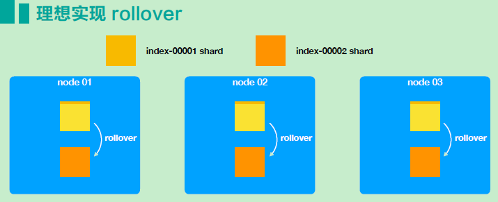
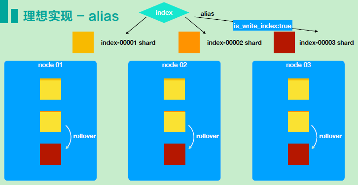
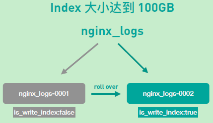
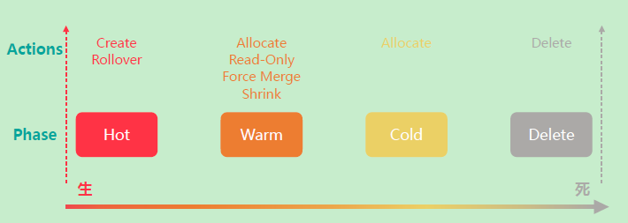
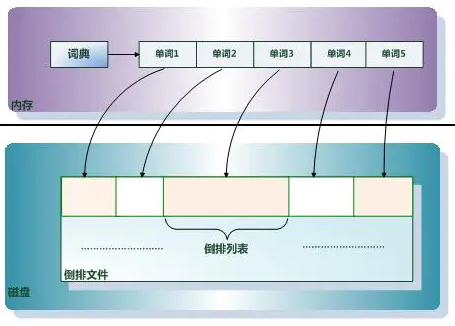
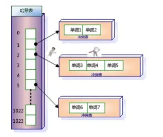
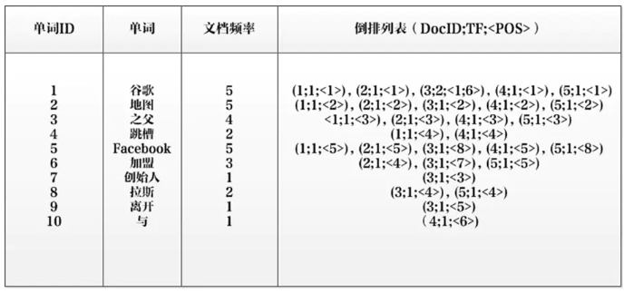
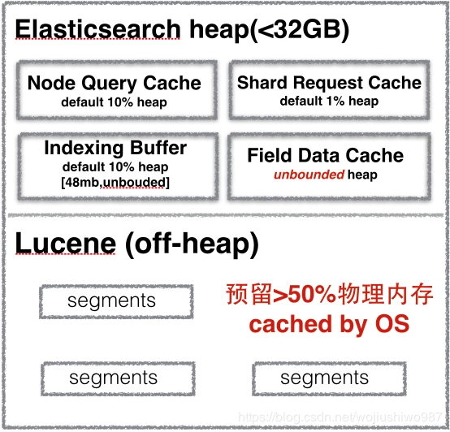

# ES常见问题列表

## ILM的配置

### 什么是ILM

ILM全名叫做index lifecycle managemenet，也就是所谓的索引生命周期管理。包含了索引的从诞生(hot)，warm节点，cold节点，直至delete。


从ES6.6开始引入集成，是ES最佳实践的集大成者。并且以hot-warm为基础，自动化的对索引进行管理。解放使用者的心智，提升集群稳定性，达到一劳永逸的效果。

图解生命周期


### 提出问题:为什么需要ILM

从ES最佳实践的角度来看：

* 单分片大小需要控制在50GB以内
  * 推荐日志场景在30GB
  * 搜索场景在10GB
* 索引分片数为数据节点的倍数

在一个数据不断增长的场景下，不管是索引的分片数，还是单个分片可能的大小，都很难进行准确的估算的。


### 理论上如何解决这个问题

我们主要需要解决的是，让shard数随着数据量的不断增长，而进行同步的增长。增长的方式有，分裂(从原有的分片中分裂出1个分片来)；还有新增分片的方式。

考虑到ES默认使用的对log_id进行hashcode路由的方式来分片存储的，采用新增分片的方式，比较合适。




### ES如何实现新增分片的

新增的分片实际上是，新增了新的索引。新的索引和老的索引都有着相同的索引的别名，我们写数据的时候，是通过索引别名的方式来写数据的。

当老的索引达到某个阀值的时候，触发ES执行rollover，老的索引的别名参数设置为`is_write_index:false`，新的索引的别名参数设置为`is_write_index:true`。这样就把数据写到了新的索引上面了。



具体场景如下：




### ES迁移分片到warm和cold节点

ILM的功能，同样可以使得某个索引的分片达到某个阀值后，将索引的分片往warm或cold节点上进行迁移。

Hot节点是高配的机器，可以读写索引。而Warm和cold节点是低配的机器，只读索引的状态。


### ILM的基本概念

Policy: 顾名思义，就是一条索引的生命周期的策略。

Phase: 指的是索引的不同的生命周期的阶段，包括有Hot阶段、Warm阶段、Cold阶段、Delete阶段。

Action: 是指在各个阶段，有哪些可以执行的操作。

如下图所示：



在Hot阶段，我们需要手动执行Create一个索引，达到某个阀值后，会触发Rollover滚动。

在Warm阶段，可以执行Allocate分配操作，将索引的分片从hot的节点属性上迁移到warm的节点属性上；将之前的索引设置为Read-Only的状态；可以执行Force Merge的操作，手动触发合并以减少索引的每个分片中的段数，并释放已删除文档使用的空间；Shrik操作是指，减少索引中的主分片数量。

在Cold阶段，只有一个Allocate的操作。

在Delete阶段，直接将对应的之前的Cold阶段到期的索引，直接删除掉了。


### Hot Phase阶段

1. 我们需要先定义了一个index template，其中定义了索引的别名，匹配索引的模式，匹配上的生命周期的policy名称。
2. 手动创建一个对应的索引，这个索引除了要满足匹配的索引模式外，还应该是后缀是以中横线`-`，加上一串数字结尾的索引的名字。
3. 我们往别名中写入文档，当索引的文档数或索引的大小，或再者是时间达到一定条件后，新建索引。
4. Rollover的时候，实际上会把新索引中的别名参数`is_write_index:true`，而老的索引`is_write_index:false`。


### Warm Phase阶段

1. 从Hot阶段allocate至Warm阶段的时候，Hot 和warm都需要提前给ES的节点打上标签。
2. 相应的allocate会去执行`index.routing.allocation.require.*`的配置。
3. 会将allocate后的老的索引，设置为Read-only，也就是所谓的`index.blocks.read_only:true`的配置。
4. 可以执行Force Merge
5. 可以执行Shrink操作。


### Cold Phase阶段

同样的需要有对应的打上cold标签的节点。

同时也是会去执行`index.routing.allocation.require.*`的操作。


## ILM API

涉及创建policy的API和创建index template的API。


### 创建policy的API

``` 
PUT /_ilm/policy/nginx_ilm_policy
{
  "policy": {
    "phases": {
      "hot": {
        "actions": {
          "rollover": {
            "max_docs": "10",
            "max_age": "20d",
            "max_size": "50gb"
          }
        }
      },
      "warm": {
        "min_age": "5s",
        "actions": {
          "allocate": {
            "include": {
              "box_type": "warm"
            },
            "number_of_replicas": 0
          },
          "forcemerge": {
            "max_num_segments": 1
          },
          "shrink": {
            "number_of_shards": 1
          }
        }
      },
      "cold": {
        "min_age": "1d",
        "actions": {
          "allocate": {
            "require": {
              "box_type": "cold"
            }
          }
        }
      },
      "delete": {
        "min_age": "40s",
        "actions": {
          "delete": {}
        }
      }
    }
  }
}
```

"rollover"中有三个可以触发的参数，最大的索引的文档数，最大的时间，还有就是索引最大的大小。

"warm"里面的"min_age"，如果前面"hot"阶段有rollover的话，就是从rollover后开始的计算。如果前面"hot"阶段没有rollover的话，那么就是从开始创建索引的时候开始计算的(从头开始计算的)。


### 创建index template

``` 
PUT /_template/nginx_ilm_template
{
  "index_patterns": ["nginx_logs-*"],                 
  "settings": {
    "number_of_shards": 1,
    "number_of_replicas": 0,
    "index.lifecycle.name": "nginx_ilm_policy",      
    "index.lifecycle.rollover_alias": "nginx_logs",
    "index.routing.allocation.include.box_type": "hot"
  }
}
```

"index_patterns"是索引的匹配模式；"index.lifecycle.rollover_alias"是针对这个策略的索引的别名，这里有个问题，不同的索引的别名，需要创建不同的policy，应该是在7.9版本中的data stream中解决了这个问题。


### 实际操作

1. 准备3节点的ES集群，每个节点的标签分别是hot/warm/cold

2. 临时设置ES中定时器的时长间隔

   ``` 
   PUT _cluster/settings
   {
     "persistent": {
       "indices.lifecycle.poll_interval":"1s"
     }
   }
   ```

3. 设置一个索引7天后删除的策略和一个自定义的个性化的策略

   策略1：

   ``` 
   PUT /_ilm/policy/delete_after_7d_ilm_policy
   {
     "policy": {
       "phases": {
         "hot": {
           "actions": {
             
           }
         },
         
         "delete": {
           "min_age": "7d",
           "actions": {
             "delete": {}
           }
         }
       }
     }
   }
   ```

   策略2：

   ``` 
   PUT /_ilm/policy/nginx_ilm_policy
   {
     "policy": {
       "phases": {
         "hot": {
           "actions": {
             "rollover": {
               "max_docs": "10"
             }
           }
         },
         "warm": {
           "min_age": "5s",
           "actions": {
             "allocate": {
               "include": {
                 "box_type": "warm"
               }
             }
           }
         },
         "delete": {
           "min_age": "40s",
           "actions": {
             "delete": {}
           }
         }
       }
     }
   }
   ```

4. 创建ILM的 policy策略

   ``` 
   PUT /_template/nginx_ilm_template
   {
     "index_patterns": ["nginx_logs-*"],                 
     "settings": {
       "number_of_shards": 1,
       "number_of_replicas": 0,
       "index.lifecycle.name": "nginx_ilm_policy",      
       "index.lifecycle.rollover_alias": "nginx_logs",
       "index.routing.allocation.include.box_type": "hot"
     }
   }
   ```

5. 手动create一个索引

   ``` 
   DELETE nginx_logs*
   GET _alias/nginx_logs
   PUT nginx_logs-000001
   {
     "aliases": {
       "nginx_logs": {
         "is_write_index":true
       }
     }
   }
   ```

6. 往索引别名中写入超过10个文档数据

   ``` 
   POST nginx_logs/_doc
   {
     "name":"abbc"
   }
   ```

7. 观察索引的各个阶段的状态

   ``` 
   GET _cat/indices/nginx_logs*?v
   ```


## Logstash导入ES

### Mysql中全量导入ES

1. 工具准备

   logstash的版本必须和es的版本是一致的，另外还需要连接mysql的jar包。

   logstash的JVM配置成30G, ES的JVM配置成30G。

2. 新增同步的conf文件

   ``` 
   input {
           jdbc {
                   #驱动包路径
                   jdbc_driver_library => "/app/docker/logstash-7.8.1/logstash-core/lib/jars/mysql-connector-java-5.1.40.jar"
                   #驱动类
                   jdbc_driver_class => "com.mysql.jdbc.Driver"
                   #jdbc url
                   jdbc_connection_string => "jdbc:mysql://192.168.1.100:3389/test1"
                   jdbc_user => "xxx"
                   jdbc_password => "xxx"
                   #schedule => "* * * * *"
                   statement => "select * from table1"
                   #增量标识字段名
                   tracking_column => "table_ID"
                   #是否使用字段值作为增量标识
                   use_column_value => true
                   #源表字段名导入ES后是否忽略大小写
                   lowercase_column_names=> false
                   #分页
                   jdbc_paging_enabled => "true"
                   #每页数据量
                   jdbc_page_size => "500000"
                   #默认时区
                   jdbc_default_timezone => "UTC"
           }
   }
   output{
           elasticsearch {
                   hosts =>["http://192.168.1.200:9200"]
                   index => "mysql_t0_es"
                   document_id => "%{table_ID}"
                   user => "xxxx"
                   password => "xxxx"
           }
   }
   ```

3. 启动logstash并查看相应的同步日志

   ``` 
   ./logstash -f ../config/oracle2es.conf >> log   -w 3 &
   ```

   

### Oracle中全量导入ES

1. 工具准备

   logstash的版本必须和es的版本是一致的，另外还需要连接mysql的jar包。logstash的JVM配置成30G, ES的JVM配置成30G。

2. 新增同步的conf文件

   ``` 
   input {
           jdbc {
                   #驱动包路径
                   jdbc_driver_library => "/app/ctgcloud/logstash-7.2.1/logstash-core/lib/jars/ojdbc6-11.2.0.3.jar"
                   #驱动类
                   jdbc_driver_class => "Java::oracle.jdbc.driver.OracleDriver"
                   #jdbc url
                   jdbc_connection_string => "jdbc:oracle:thin:@192.168.2.100:1521/testdb"
                   jdbc_user => "xxxx"
                   jdbc_password => "xxxx"
                   #schedule => "* * * * *"
                   statement => "select * from table2"
                   #增量标识字段名
                   tracking_column => "table2_ID"
                   #是否使用字段值作为增量标识
                   use_column_value => true
                   #源表字段名导入ES后是否忽略大小写
                   lowercase_column_names=> false
                   #分页
                   jdbc_paging_enabled => "true"
                   #每页数据量
                   jdbc_page_size => "500000"
                   #默认时区
                   jdbc_default_timezone => "UTC"
           }
   }
   output{
           elasticsearch {
                   hosts =>["http://192.168.1.200:9200"]
                   index => "table2_es_oracle2"
                   document_id => "%{table2_ID}"
                   user => "xxxx"
                   password => "xxx"
           }
   }
   ```

3. 启动logstash并查看相应的同步日志

   ``` 
   ./logstash -f ../config/oracle2es.conf >> log   -w 3 &
   ```


### ES环境的优化

修改"refresh_interval"，暂时设置副本分片为0，修改translog的配置，修改ES的线程池和队列。

``` 
PUT table2_es_oracle2/_settings
{
 "refresh_interval": "-1" ,
 "number_of_replicas":0,
 "translog": {
        "flush_threshold_size": "51200mb",         
        "durability": "async"
      }
}
```


参考URL：

https://www.elastic.co/guide/en/elasticsearch/reference/current/tune-for-indexing-speed.html

https://cloud.tencent.com/developer/article/1696747?fromSource=gwzcw.1293314.1293314.1293314&cps_key=ad1dd5b36e1c498308f7302ab4cdabb7

https://t.zsxq.com/BQRvfea

单次bulk限制在10M左右，ES目标索引的mapping规则，最好根据实际业务定义模板，ES自定义的有一半机率影响性能。

>● 计算资源评估：2C8G 的配置大概能支持 5k doc/s 的写入，32C64G 的配置大概能支撑 5w doc/s的写入能力；


## ES中多表关联如何解决

整个文档，摘录来自"铭毅天下"的博客。原始的地址如下：

> [Elasticsearh多表关联设计](https://mp.weixin.qq.com/s/j7YdtmyuzBFRK1BViDtp2w)


### 引入问题

多表关联通常是指：1对多，或者多对多关系在ES中的呈现。

比如：博客和评论的关系，用户和爱好的关系，主表和子表的关系。


### 基础认知

#### 关系型数据库

关系型数据库是专门为关系设计的，有如下特点：

* 可以通过主键唯一地标识每个实体(如Mysql中的行)。
* 实体规范化。唯一实体的数据只存储一次，而相关实体只存储它的主键。只能在一个具体位置修改这个实体的数据。
* 实体可以进行关联查询，可以跨实体搜索。
* 支持AICD特性，即：单个实体的变化是原子的、一致的、隔离的和持久的。
* 大多数关系型数据库支持跨多个实体的ACID事务。

关系型数据库的缺陷：

* 第一：全文检索有限的支持能力。这点，postgresql已部分支持，但相对有限。
* 第二：多表关联查询的耗时很长，甚至不可用。之前系统开发中使用过Mysql8个表做关联查询，一次查询等待十分钟以上，甚至不可用。


#### Elasticsearch

ES和大多数NoSQL数据库类似，是扁平化的。索引是独立文档的集合体。文档是否匹配搜索请求取决于它是否包含所有的所需信息和关联程度。

ES中单个文档的数据变更是满足ACID的，但是如果涉及多个文档时的删除，修改时，则不支持事务。当一个事务中的部分文档更新失败的时候，是无法将所有涉及到的事务内的文档更新操作都回滚到之前状态的。

扁平化有如下的优势：

* 索引过程是快速和无锁的。
* 搜索过程是快速和无锁的。
* 因为每个文档相互都是独立的，大规模数据可以在多个节点上进行分布。


#### Mysql VS Elasticsearch

mysql擅长关系管理，而ES擅长的是检索。

Medcl也曾强调："如果可能，尽量在设计时使用扁平的文档模型。"ES的关联存储、检索、聚合操作势必会有非常大的性能开销。


### ES场景中如何解决这种关联关系

关联关系仍然非常重要。某些时候，我们需要缩小扁平化和现实世界关系模型的差异。有如下的四种常用的方法，用来在ES中进行关联数据的管理。


#### 应用端关联

这是普遍使用的技术，即在应用接口层面来处理关联关系。

针对上面的问题，来如下实践：

``` 
1. 存储层面：独立两个索引存储
2. 实际业务层面分两次请求：
第一次查询返回：Top5中文姓名和成绩；
根据第一次查询的结果中，取出中文姓名。
到第二个表中进行查询，返回对应的Top5中文姓名和英文姓名。
最后将第一次查询结果和第二次查询结果组合后，返回给用户。
即：实际业务层面是进行两次查询，统一返回给用户。用户是无感知的。
```

适用场景：数据量少的业务场景。

优点：数据量少时，用户体验好。

缺点：数据量大，两次查询耗时肯定会比较长，影响用户体验。

引申场景：关系型数据库和ES结合，各取所长。将关系型数据库全量同步到ES存储，不做冗余处理。

如前所述：ES擅长的是检索，而MySQL才擅长关系管理。所以可以考虑二者结合，使用ES多索引建立相同的别名，针对别名检索到对应ID后再回MySQL查询，业务层面通过关联ID join 出需要的数据。


#### 宽表冗余存储

对每个文档保持一定数量的冗余数据可以在需要访问时避免进行关联。

这点通过logstash同步关联数据到ES时，通常会建议：先通过视图对MySQL数据做好多表关联，然后同步视图数据到ES。此处的视图就是宽表。

针对最开始提出的问题：姓名、英文名、成绩两张表合为一张表存储。

适用场景：一对多或者多对多关联。

优点：速度快。因为每个文档都包含了所需的所有信息，当这些信息需要在查询进行匹配时，并不需要进行昂贵的关联操作。

缺点：索引更新或删除数据，应用程序不得不处理宽表的冗余数据；由于冗余数据，导致某些搜索和聚合操作可能无法按照预期工作。


#### 嵌套文档nested存储

Nested类型是ES mapping定义的集合类型之一，它解决了原有object类型扁平化的字段属性，导致查询错误的问题，是支持独立检索的类型。

举例：有一个文档描述了一个帖子和一个包含帖子上所有评论的内部对象评论。可以借助于Nested实现。

实践注意1：当使用嵌套文档时，使用通用的查询方式是无法访问到的，必须使用合适的查询方式(nested query、nested filter、nested facet等)，很多场景下，使用嵌套文档的复杂度在于索引阶段对关联关系的组织拼装。

实践注意2：

``` 
index.mapping.nested_fields.limit 缺省值为50
即：一个索引中最大允许拥有50个nested类型的数据。
index.mapping.mested_object.limit 缺省值是10000。
即：1个文档中所有nested类型json对象数据的总量是10000。
```

适用场景：对少量，子文档偶尔更新、查询频繁的场景。

如果需要索引对象数组并保持数组中每个对象的独立性，则应使用嵌套Nested数据类型而不是对象Object数据类型。

优点：nested文档可以将父子关系的两部分数据(举例：博客+评论)关联起来，可以基于nested类型做任何的查询。

缺点：查询相对慢，更新子文档需要更新整篇文档。


#### 父子文档存储

注意：6.X之前的版本的父子文档存储在相同索引的不同type中。而6.X之上的版本，单索引下已不存在多type的概念。父子文档Join的都是基于相同索引相同type实现的。

Join类型是ES mapping定义的类型之一，用于在同一索引的文档中创建父/子关系。关系部分定义文档中的一组可能关系，每个关系是父名称和子名称。

适用场景：子文档数据量要明显多于父文档的数据量，存在1对多的关系；子文档更新频繁的场景。

举例：1个产品和供应商之间是1对N的关联关系。

当使用父子文档时，使用has_child或has_parent做父子关联查询。

优点：父子文档可以独立更新。

缺点：维护Join关系需要占据部分内存，查询较Nested更耗资源。


### 小结

Nested Object和父子关系的这两种的区别如下：

| 对比 | Nested Object                    | Parent/Child                                     |
| ---- | -------------------------------- | ------------------------------------------------ |
| 优点 | 文档存储在一起，因此读取性能高   | 父子文档可以独立更新，互不影响                   |
| 缺点 | 更新父或子文档时需要更新整个文档 | 为了维护Join的关系，需要占用部分内存读取性能较差 |
| 场景 | 子文档偶尔更新，查询频繁         | 子文档更新频繁                                   |


注意1：在ES开发实战中对于多表关联的设计要突破关系型数据库设计的思维定式。

注意2：不建议在ES做Join操作，父子能实现部分功能，但是它的开销比较大，如果有可能，尽量在设计时使用扁平的文档模型。

注意3：尽量将业务转化为没有关联关系的文档形式，在文档建模处多下功夫，以提升检索效率。

注意4：Nested&Join父子类型，在选项时必须考虑性能问题。nested类型检索使得检索效率慢几倍，父子Join类型检索会使得检索效率慢几百倍。


## ES有哪些应用场景

ES的主要应用分为两大类：

* 搜索类(带上聚合)，考虑事务性，频繁更新，与现有数据库进行同步，通过ES进行查询聚合。
* 日志类，包括日志收集，指标性收集，通过beats等工具收集到kafka等Q中，通过logstash进行转换，输送到ES中，然后通过Kibana进行展示。


## ES与关系型数据库的抽象类比


| RDBMS                                     | ElasticSearch                       |
| ----------------------------------------- | ----------------------------------- |
| row                                       | document                            |
| table                                     | index                               |
| column                                    | filed                               |
| schema                                    | mapping                             |
| 分布式MySQL设置的分片数量                 | setting                             |
| SQL                                       | dsl                                 |
| 分片路由信息保存在ZK中                    | master node(表现为ES的一个JAVA进程) |
| 有点类似dbproxy                           | Coordinating Node                   |
| mysql的节点实例                           | data node(表现为ES的一个JAVA进程)   |
| set集群中的master节点上的主的schema的分片 | 主分片(一个lucene实例)              |
| set集群中的slave节点上的从的schema的分片  | 副本分片                            |


## 正排索引和倒排索引

这里我们主要是研究三个问题：

* 正排索引和倒排索引的关系是什么？
* 倒排索引的数据结构究竟长得什么样子？
* 倒排索引的物理存储究竟是什么样子？


### 倒排索引的数据结构

> 原文的地址为：https://www.cnblogs.com/zlslch/p/6440114.html和https://www.jianshu.com/p/104f322de27c

见其名知其意，有倒排索引，对应肯定有正向索引。

正向索引(forward index)，反向索引(inverted index)，更熟悉的名字是倒排索引。


### 为什么需要倒排索引呢?

在搜索引擎中每个文件都对应一个文件ID，文件内容被表示为一系列关键词的集合(实际上在搜索引擎库中，关键词也已经转换为关键词ID)。例如"文档1"经过分词，提取了20个关键词，每个关键词都会记录它在文档中的出现次数和出现位置。

得到的正向索引的结构如下：

"文档1"的ID > 单词1：出现次数，出现位置列表；单词2：出现次数，出现位置列表；......

"文档2"的ID > 此文档初选的关联词列表。

如下图所示，我们一般也是通过key，去找vaule。


当用户在主页上搜索关键词"华为手机"的时候，假设只存在正向索引(forward index)，那么就需要扫描索引库中的所有文档，找出所有包含关键词"华为手机"的文档，再根据打分模型进行打分，排出名次后呈现给用户。因为互联网上收录在搜索引擎中的文档的数目是个天文数字，这样的索引结构根本无法满足实时返回排名结果的要求。

所以，搜索引擎会将正向索引重新构建为倒排索引，即把文件ID对应到关键词的映射转换为关键词到文件ID的映射(1对N转换为N对M)，每个关键词都对应着一系列的文件，这些文件中都出现这个关键词。

得到倒排索引的结构如下：

"关键词1"："文档1"的ID，"文档2"的ID，.......

"关键词2"：带有此关键词的文档ID列表。

如下图所示，从词的关键字去找文档。


### 什么是倒排索引呢？

#### 单词-文档矩阵

单词-文档矩阵是表达两者之间所具有的一种包含关系的概念模型，下图展示了其含义。每列代表一个文档，每行代表一个单词，打对勾的位置代表包含关系。


从纵向即文档这个维度来看，每列代表文档包含了哪些单词，比如文档1包含了词汇1和词汇4，而不包含其他单词。从横向即单词这个维度来看，每行代表了哪些文档包含了某个单词。比如对于词汇1来说，文档1和文档4中出现过单词1，而其他文档不包含词汇1。矩阵中其他的行列也可以作此种解读。

搜索引擎的索引其实就是实现的"单词-文档矩阵"的具体数据结构。可以有不同的方式来实现上述**概念模型**，比如"倒排索引"、"签名文件"、"后缀树"等方式。但是各项实验数据表名，"倒排索引"是实现单词到文档映射关系的最佳实现方式，所以本文档主要介绍"倒排索引"的技术细节。


#### 倒排索引基本概念

文档(Document)：一般搜索引擎的处理对象是互联网网页，而文档这个概念要更宽泛一些，代表以文本形式存在的存储对象，相比网页来说，涵盖更多种形式，比如word，PDF，HTML，XML等不同格式的文件都可以称之为文档。再比如一封邮件，一条短信，一条微博也可以称之为文档。在本书后续内容，很多情况下会使用文档来表征文本信息。

文档集合(Document Collection)：由若干文档构成额集合称之为文档集合。比如海量的互联网网页或大量的电子邮件都是文档集合的具体例子。

文档编号(Document ID)：在搜索引擎内部，会将文档集合内每个文档赋予一个唯一的内部编号，以此编号来作为这个文档的唯一标识，这样方便内部处理，每个文档的内部编号即称之为"文档编号"，后文有时会用DocID来便捷地代表文档编号。

单词编号(Word ID)：与文档编号类似，搜索引擎内部以唯一的编号来表征某个单词，单词编号可以作为某个单词的唯一表征。

倒排索引(Inverted Index)：倒排索引是实现"单词-文档矩阵"的一种具体存储形式，通过倒排索引，可以根据单词快速获取包含这个单词的文档列表。倒排索引主要由两个部分组成："单词词典"和"倒排文件"。

单词词典(Lexicon)：搜索引擎的通常索引单位是单词，单词词典是由**文档集合**中出现过的所有单词构成的字符串集合，单词词典内每条索引项记载单词本身的一些信息以及指向"倒排列表"的指针。

倒排列表(PostingList)：倒排列表记载了出现过**某个单词的所有文档的文档列表**及单词在该文档中出现的位置信息，每条记录称为一个倒排项(Posting)。根据倒排列表，即可获知哪些文档包含某个单词。

倒排文件(Inverted File)：所有单词的倒排列表往往顺序地存储在磁盘的某个文件里，这个文件即被称为倒排文件，倒排文件是存储倒排索引的物理文件。

上述的所有的这些概念之间的关系，可以通过下面的图示比较清晰的看出来。




#### 倒排索引简单实例

倒排索引从逻辑结果和基本思路上来讲非常简单。下面我们通过具体的实例来进行说明，使得读者能够对倒排索引有一个宏观而直接的感受。

假设文档集合包含五个文档，每个文档内容如下图所示，在图中左端一栏是每个文档对应的文档编号。我们的任务就是对这个文档集合建立倒排索引。


中文和英文等语言不同，单词之间没有明确分隔符号，所以首先要用分词系统关键文档自动切分为单词序列。这样每个文档就转换为由单词序列构成的数据流，为了系统后续处理方便，需要对每个不同的单词赋予唯一的单词编号，同时记录下哪些文档包含这个单词，在如此处理结束后，我们可以得到最简单的倒排索引。在下面的图示中，"单词ID"一栏记录了每个单词的单词编号，第二栏是对应的单词，第三栏即每个单词对应的倒排列表。比如单词"谷歌"，其单词编号为1，倒排列表为{1,2,3,4,5}，说明文档集合中每个文档都包含了这个单词。


上面的图所示的倒排索引是最简单的，是因为这个索引系统只记载了哪些文档包含某个单词，而事实上，索引提供还可以记录除此之外的更多信息。下面的图示是一个相对复杂些的倒排索引，与上面的图的基本索引系统相比，在单词对应的倒排列表中不仅记录了文档编号，还记载了**单词频率信息(TF)，即这个单词在某个文档中的出现的次数**，之所以要记录这个信息，是因为词频信息在搜索结果排序时，计算查询和文档相似度是很重要的一个计算因子，所以将其记录在倒排列表中，以方便后续排序时进行分值计算。在下面的图示的例子中，单词"创始人"的单词编号是7，对应的倒排列表内容为：(3:1)，其中的3代表文档编号为3的文档包含这个单词，数字1代表词频信息，即这个单词在3号文档中只出现过1此，其他单词对应的倒排列表所代表含义与此相同。


实用的倒排索引还可以记载更多的信息，下图所示的索引系统除了记录文档编号和单词频率信息外，额外记载了两类信息，即每个单词对应的"文档频率信息"(对应下图中的第三栏)，以及在倒排列表中记录单词在某个文档出现的位置信息。


"文档频率信息"代表了文档集合中有多少个文档包含某个单词，之所以要记录这个信息，其原因与单词频率信息一样，这个信息在搜索结果排序计算中是非常重要的一个因子。而单词在某个文档中出现的位置信息并非索引系统一定要记录的，在死机的索引系统里可以包含，也可以选择不包含这个信息，之所以如此，因为这个信息对于搜索系统来说并非必须的，位置信息只有在支持"短语查询"的时候才能排上用场。

以单词"拉斯"为例，其单词编号为8，文档频率为2，代表整个文档集合中有两个文档包含这个单词，对应的倒排列表为：{(3;1;<4>)},(5;1;<4>)}，其函数以为在文档3和文档5出现过这个单词，单词频率都为1，单词"拉斯"在两个文档中的出现未知都是4，即文档中第四个单词是"拉斯"。

上图所示的倒排索引已经是一个非常完备的索引系统，实际搜索系统的索引结构基本如此，区别无非是采取哪些具体的数据结构来实现上述逻辑结构。

有了这个索引系统，搜索引擎可以很方便地响应用户的请求，比如用户输入查询此"Facebook"，搜索系统查找倒排索引，从中可以读出包含这个单词的文档，这些文档就是提供给用户的搜索结果，而利用单词频率信息、文档频率信息既可以对这些候选搜索结果进行排序，计算文档和查询的相似性，按照相似性得分由高到低排序输出，此即为搜索系统的部分内部流程。


#### 单词词典

单词词典是倒排索引中非常重要的组成部分，它用来维护文档集合中出现过的所有单词的相关信息，同时用来记载某个单词对应的倒排列表在倒排文件中的位置信息。在支持搜索时，根据用户的查询词，去单词词典里查询，就能够获得相应的倒排列表，并以此作为后续排序的基础。

对于一个规模很大的文档集合来说，可能包含几十万甚至上百万的不同单词，能否快速定位某个单词，这直接影响搜索时的响应速度，所以需要高效的数据结构来对单词词典进行构建和查找，常用的数据结构包括哈希加链表结构和树形词典结构。


#### 哈希加链表

下图就是这种词典结构的示意图。这种词典结构主要由两个部分构成：

主体部分是哈希表，每个哈希表项保存一个指针，指针指向冲突链表，在冲突链表里，相同哈希值的单词形成链表结构。之所以会有冲突链表，是因为两个单词获得相同的哈希值，如果是这样，在哈希方法里被称作是一次冲突，可以将相同哈希值的单词存储在链表里，以供后续查找。



在建立索引的过程中，词典结构也会相应地被构建出来。比如在解析一个新文档的时候，对于某个在文档中出现的单词T，首先利用哈希函数获得其哈希值，之后根据哈希值对应的哈希表项读取其中保存的指针，就找到了对应的冲突链表。如果冲突链表里已经存在这个单词，说明单词在之前解析的文档里已经出现过。如果在冲突链表里没有发现这个单词，说明单词是首次碰到，则将其加入冲突链表里。通过这种方式，当文档集合内所有文档解析完毕时，相应的词典结构也就建立起来了。

在响应用户查询请求时，其过程与建立词典类似，不同点在于即使词典里没出现过某个单词，也不会添加到词典内。以上图为例，假设用户输入的查询请求为单词3，对这个单词进行哈希，定位到哈希表内的2号槽，从其保留的指针可以获得冲突链表，依次将单词3和冲突链表内的单词比较，发现单词3在冲突链表内，于是找到这个单词，之后可以读出这个单词对应的倒排列表来进行后续的工作，如果没有找到这个单词，说明文档集合内没有任何文档包含单词，则搜索结果为空。


#### 树形结构

B树(或者B+树)是另外一种高效查找结构，下图是一个B树结构示意图。B树与哈希方式查找不同，需要字典项能够按照大小排序(数字或字符序)，而哈希方式则无需数据满足此项要求。

B树形成了层级查找结构，中间节点用于指出一定顺序范围的词典项目存储在哪个子树中，起到根据词典项比较大小进行导航的作用，最底层的叶子节点存储单词的地址信息，根据这个地址就可以提取出单词字符串。


### 倒排索引的总结


第一个图示就是5篇文档。


第二个图示就是类似的Posting List



单词ID：记录每个单词的单词编号。

单词：对应的单词。

文档频率：代表文档集合中有多少个文档包含某个单词。

倒排列表：包含单词ID及其他必要信息。

DocID：单词出现的文档ID。

TF：单词在某个文档中出现的次数。

POS：单词在文档中出现的位置。

以单词"加盟"为例，其单词编号为6，文档频率为3，代表整个文档集合中有三个文档包含这个单词，对应的倒排列表{(2;1;<4>),(3;1;<7>),(5;1;<5>)}，含义是在文档2,3,5出现过这个单词，在每个文档的出现过1次，单词"加盟"在第一个文档的POS为4，即文档的第四个单词是"加盟"，其他类似。


## ES Top10监控指标


### 监控ES集群的重要性

ES具有通用性，可扩展性和实用性的特点，集群的基础架构必须满足如上特性。合理的集群架构能支撑其数据存储及并发响应需求。相反，不合理的集群基础架构和错误配置可能导致集群性能下降、集群无法响应甚至集群崩溃。

适当地监视集群可以帮助你实时监控集群规模，并且可以有效地处理所有数据请求。

本文将从五个不同的维度来看待集群，并从这些维度中提炼出监控的关键指标，并探讨通过观察这些指标可以避免哪些潜在问题。


### 集群健康维度：分片和节点

集群、索引、分片、副本的定义不再阐述。分片数的多少对集群性能的影响至关重要。分片数量设置过多或过低都会引发一些问题。

> 分片数量过多，则批量写入/查询请求被分隔为过多的子写入/查询，导致该索引的写入、查询拒绝率上升。
>
> 对于数据量较大的索引，当分片数量过小的时候，无法充分利用节点资源，造成机器资源利用率不高或不均衡，影响写入/查询的效率。

通过`GET _cluster/health`监视群集时，可以查询集群的状态、节点数和活动分片计数的信息。还可以查看重新定位分片，初始化分片和未分配分片的计数。

``` 
GET _cluster/health
{
  "cluster_name" : "elasticsearch",
  "status" : "yellow",
  "timed_out" : false,
  "number_of_nodes" : 1,
  "number_of_data_nodes" : 1,
  "active_primary_shards" : 127,
  "active_shards" : 127,
  "relocating_shards" : 0,
  "initializing_shards" : 0,
  "unassigned_shards" : 120,
  "delayed_unassigned_shards" : 0,
  "number_of_pending_tasks" : 0,
  "number_of_in_flight_fetch" : 0,
  "task_max_waiting_in_queue_millis" : 0,
  "active_shards_percent_as_number" : 51.417004048582996
}
```

集群运行的重要指标：

* status: 集群的状态。红色：部分主分片未分配。黄色：部分副本分片未分配。绿色：所有分片分配ok。
* nodes: 节点。包括集群中的节点总数，并包括成功和失败节点的计数。ount of activate
* shards: 活动分片计数。集群中活动分片的数量。
* Relocating Shards: 重定位分片。由于节点丢失而移动的分片计数。
* Initializing Shards: 初始化分片。由于添加索引而初始化的分片计数。
* Unassgned Shards: 未分配的分片。尚未创建或分配副本的分片计数。


### 搜索性能维度：请求率和延迟

我们可以通过测量系统处理请求的速率和每个请求的使用时间来衡量集群的有效性。

当集群收到请求时，可能需要跨多个节点访问多个分片中的数据。系统处理和返回请求的速率，当前正在进行的请求数，以及请求的持续时间等核心指标是衡量集群健康重要因素。

请求过程本身分为两个阶段：

* 第一个是查询阶段(query phrase)，集群将请求分发到索引中的每个分片(主分片或副本分片)。
* 第二个是获取阶段(fetch phrase)，查询结果被收集，处理并返回给用户。

通过GET index_a/_stats查看对应目标索引状态。大致截取了下面的信息：

``` 
      "search" : {
        "open_contexts" : 0,
        "query_total" : 10,
        "query_time_in_millis" : 0,
        "query_current" : 0,
        "fetch_total" : 1,
        "fetch_time_in_millis" : 0,
        "fetch_current" : 0,
        "scroll_total" : 5,
        "scroll_time_in_millis" : 15850,
        "scroll_current" : 0,
        "suggest_total" : 0,
        "suggest_time_in_millis" : 0,
        "suggest_current" : 0
      },
```

请求检索性能相关的重要指标如下：

* query_current: 当前正在进行的查询数。集群当前正在处理的查询计数。
* fetch_current: 当前正在进行的fetch次数。集群中正在进行的fetch计数。
* query_total: 查询总数。集群处理的所有查询的聚合数。
* fetch_total: 提取总数。集群处理的所有fetch的聚合数。
* fetch_time_in_millis: fetch 所花费的总时间。所有fetch消耗的总时间(以毫秒为单位)


### 索引性能维度：刷新(refresh)和合并(merge)时间

文档的增、删、改操作，集群需要不断更新其索引，然后在所有节点上刷新它们。所有这些都由集群负责，作为用户，除了配置refresh interval之外，我们对此过程的控制有限。

增、删、改批处理操作，会形成新段(segment)并刷新到磁盘，并且由于每个段消耗资源，因此将较小的段合并为更大的段对于性能非常重要。同上类似，这由集群本身管理。

监视文档的**索引速度(indexing rate)**和**合并时间(merge time)**有助于在开始影响集群性能之前提前识别异常和相关问题。将这些指标与每个节点的运行状况并行考虑，这些指标为系统内的潜在问题提供了重要线索，为性能优化提供重要参考。

可以通过`GET /_nodes/stats`获取索引性能指标，并可以在节点，索引或分配级别进行汇总。

``` 
 "merges" : {
          "current" : 0,
          "current_docs" : 0,
          "current_size_in_bytes" : 0,
          "total" : 245,
          "total_time_in_millis" : 58332,
          "total_docs" : 1351279,
          "total_size_in_bytes" : 640703378,
          "total_stopped_time_in_millis" : 0,
          "total_throttled_time_in_millis" : 0,
          "total_auto_throttle_in_bytes" : 2663383040
        },
        "refresh" : {
          "total" : 2955,
          "total_time_in_millis" : 244217,
          "listeners" : 0
        },
        "flush" : {
          "total" : 127,
          "periodic" : 0,
          "total_time_in_millis" : 13137
        },
```

索引性能维度相关重要指标：

* refresh.total: 总刷新计数。刷新总数的计数。
* refresh.total_time_in_millis: 刷新总时间。汇总所有花在刷新的时间(以毫秒为单位进行测量)
* merges.current_docs: 目前的合并。合并目前正在处理中。
* merges.total_docs: 合并总数。合并总数的计数。
* merges.total_stopped_time_in_millis: 合并花费的总时间。合并段的所有时间的聚合。


### 节点运行状况维度：内存，磁盘和CPU指标

每个节点都运行物理硬件上，需要访问系统内存，磁盘存储和CPU周期，以便管理其控制下的数据并响应对集群的请求。

ES是一个严重依赖内存以实现性能的系统，因此密切关注内存使用情况与每个节点的运行状况和性能相关。改进指标的相关配置更改也可能会对内存分配和使用产生负面影响，因此记住从整体上查看系统运行状况非常重要。

监视节点的CPU使用情况并查找峰值有助于识别节点中的低效进程或潜在问题。CPU性能与Java虚拟机(JVM)的垃圾收集过程密切相关。

磁盘高读写可能导致系统性能问题。由于访问磁盘在时间上是一个"昂贵"的过程，因此应尽可能减少磁盘IO。

通过如下命令行可以实现节点级别度量指标，并反映运行它的实例或计算机的性能。

``` 
GET /_cat/nodes?v&h=id,disk.total,disk.used,disk.avail,disk.used_percent,ram.current,ram.percent,ram.max,cpu
```

节点运行的重要指标：

* disk.total: 总磁盘容量。节点主机上的总磁盘容量。
* disk.used: 总磁盘使用量。节点主机上的磁盘使用总量。
* avail disk: 可用磁盘空间总量。
* disk.avail disk.used_percent: 使用的磁盘百分比。已使用的磁盘百分比。
* ram：当前的RAM使用情况。当前内存使用量(测量单位)。
* percent ram: RAM百分比。正在使用的内存百分比。
* max: 最大RAM。节点主机上的内存总量。
* CPU：中央处理器。正在使用的CPU百分比。

实际业务场景中推荐使用：Elastic-HQ，cerebro监控。


### JVM运行状况维度：堆，GC和池大小(Pool Size)

作为基于Java的应用程序，ES在Java虚拟机(JVM)中运行。JVM在其"堆"分配中管理其内存，并通过garbage collection进行垃圾回收处理。

如果应用程序的需求超过堆的容量，则应用程序开始强制使用连接的存储介质上的交换空间。虽然这可以防止系统崩溃，但它可能会对集群的性能造成严重破坏。监视可用堆空间以确保系统具有足够的容量对于集群的健康至关重要。

JVM内存分配给不同的内存池。我们需要密切注意这些池中每个池，以确保它们得到充分利用并且没有被超限利用的风险。

`垃圾收集器(GC)`很像物理垃圾收集服务。我们希望让它定期运行，并确保系统不会让它过载。理想情况下，GC性能视图应类似均衡波浪线大小的常规执行。尖峰和异常可以成为更深层次问题的指标。

可以通过GET /_nodes/stats命令检索JVM度量标准。

``` 
  "jvm" : {
        "timestamp" : 1557582707194,
        "uptime_in_millis" : 22970151,
        "mem" : {
          "heap_used_in_bytes" : 843509048,
          "heap_used_percent" : 40,
          "heap_committed_in_bytes" : 2077753344,
          "heap_max_in_bytes" : 2077753344,
          "non_heap_used_in_bytes" : 156752056,
          "non_heap_committed_in_bytes" : 167890944,
          "pools" : {
            "young" : {
              "used_in_bytes" : 415298464,
              "max_in_bytes" : 558432256,
              "peak_used_in_bytes" : 558432256,
              "peak_max_in_bytes" : 558432256
            },
            "survivor" : {
              "used_in_bytes" : 12172632,
              "max_in_bytes" : 69730304,
              "peak_used_in_bytes" : 69730304,
              "peak_max_in_bytes" : 69730304
            },
            "old" : {
              "used_in_bytes" : 416031952,
              "max_in_bytes" : 1449590784,
              "peak_used_in_bytes" : 416031952,
              "peak_max_in_bytes" : 1449590784
            }
          }
        },
        "threads" : {
          "count" : 116,
          "peak_count" : 119
        },
        "gc" : {
          "collectors" : {
            "young" : {
              "collection_count" : 260,
              "collection_time_in_millis" : 3463
            },
            "old" : {
              "collection_count" : 2,
              "collection_time_in_millis" : 125
            }
          }
        },
```

JVM运行的重要指标如下：

* mem: 内存使用情况。堆和非堆进程和池的使用情况统计信息。
* threads: 当前使用的线程和最大数量。
* gc：垃圾收集。计算垃圾收集所花费的总时间。


### ES Top10监控指标

经过上面的分析，Top10监控指标如下。

1. Cluster Health - Nodes and Shards
2. Search Performance - Request Latency and
3. Search Performance - Request Rate
4. Indexing Performance - Merge Times
5. Indexing Performance - Refresh Times
6. Node Health - Memory Usage
7. Node Health - Disk I/O
8. Node Heatlh - CPU
9. JVM Health - Heap Usage and Garbage Collection
10. JVM health - JVM Pool Size

对于将ES作为解决方案的任何公司而言，投资全面的监控策略至关重要。有效的监控可以节省公司因非响应或无法修复的集群问题而导致的停机时间成本和经济成本。


## seed_host/initial master区别联系

### 腾讯大佬的灵魂9问

还是没太搞懂seed_hosts和cluster.inital_master_nodes的区别。

1. seed_hosts里面一定是配置master eligible节点吗？
2. 还是说data节点也可以。
3. ES是如何发现潜在机器的？
4. initial_master一定是master eligible节点吗？
5. 集群初始启动时，这几个节点一定都要在吗？
6. 初始化的时候是不是可以配置一个，然后集群初始化后，再加master eligible节点也可以的呢？
7. 多加几个以后，把initial_master里的几个去掉是不是也可以了？
8. 如果一个集群当前master是7，那它的quorum是4.ES是支持慢慢去掉节点，quorum慢慢降低的吗？
9. 假如慢慢去掉了3个节点，原集群正常工作，那这三个节点重启后网络分区在一起了，那会不会自己形成集群呢？


### 解答如下

1-3问：seed_host是7.x之前的参数，initial master是之后的。seed推荐是master-eligible，不是一定的。

4-6问：initial node需要是master eligible。第一次，新集群，需要配置。以后不需要，也不需要再改动。

9问：7之前的版本有个最小master eligible控制，防止脑裂。7以后参数被废除了，看官方文档是说现在很智能选举很快，不用担心这种情况。


## network.host/discovery.seed_hosts等区别和联系

> https://wx.zsxq.com/dweb2/index/group/225224548581?from=mweb&type=detail


### 提问：

如何理解es7中下面几个配置使得属性解释。

network.bind_host

network.publish_host

network.host

discovery.seed_hosts

cluster.initial_master_nodes

还有，network.host配置成ip和0.0.0.0有什么区别？


### 解答：

#### 这几个参数是什么意思呢？

先将network.host、network.publish_host、network.bind_host，这几个属性解答下。

network.host兼具有publish_host和bind_host两者的功能。

注意：0.0.0.0的意思是：0.0.0.0是可以接受的IP地址，将绑定到所有网络接口。这里的IP建议设置为内网地址，不要设置0.0.0.0，0.0.0.0会暴露你的地址至公网，非常不安全，如果非要使用：建议加一层代理。

publish_host means:"Call me on this number",是ES与其他集群机器通信的地址。

bind_host means:"I'll answer on this number", 这是设置控制ES侦听的网络地址的接口。

实际业务场景中，我们只使用了network.host，其他没有配置。可以将publish_host和bind_host设置为不同的值，并且在某些情况下非常有用。


#### 有啥实际应用的场景吗？

具体场景：我在数据中心有一个本地网络，我运行由不同节点组成的es集群。每个机器都有两个IP地址，一个用于从外部计算机到达，另一个用于本地连接到同一网络中的其他计算机。

内部ip(eth1)用于让不同的ES节点相互通信，发现等。

外部ip(eth0)是我的web应用程序(在另外一个网络中)发出请求的地址。

所以，在这种场景下，我们的web应用程序位于另外一个网络中，可以从bind_host地址访问ES群集，而ES使用publish_host与集群其他节点通信。


#### discovery.seed_hosts参数理解

discovery.seed_hosts，在6.X/5.X中对应的名字是，discovery.zen.ping.unicast.hosts。对比：除了名称不同，解释部分一模一样。

``` 
In order to join a cluster, a node needs to konw the hostname or IP 
address of at least some of the other nodes in the cluster
```

如果多节点集群，discovery.seed_hosts应该配置为候选主节点。


#### cluster.initial_master_nodes

这也是7.X的特性，区别于之前设置min_master_count候选主节点的个数。

白话文：设置候选主机节点的主机名称列表。

当第一次启动全新的ES 集群时，会出现一个集群引导步骤，该步骤确定在第一次选举中计票的主要合格节点集。

你在生产模式下启动全新集群时，必须明确列出符合条件的节点的名称或IP地址，这些节点的投票应在第一次选举中计算。使用这个参数来设置此列表。


## 常见大佬博客整理

1. wood大叔(Elasticsearch 中文社区)，文档地址：

   > [ES中文社区](https://elasticsearch.cn/people/wood)

2. 彬哥(Elastic认证中国第一人，普翔科技CTO)

   > [[rockybean](https://www.jianshu.com/u/pEBdkp)]

3. 张超（奇安信搜索架构师，《Elasticsearch 源码解析与实战》作者）

   > [easyice](http://easyice.cn/)

4. 死磕Elasticsearch

   > [铭毅天下](https://elastic.blog.csdn.net/)

5. Elastic官方技术博客

   > [Elastic官方技术博客](https://elastic.blog.csdn.net/)


## 三节点(含master)集群高可用测试

现有192.168.3.26/192.168.3.27/192.168.3.28，三台主机。这三台主机上都部署了es和kibana。

这三台机器会承担ES的所有角色，包含master节点角色。


1. 先停26上master节点

   目前master节点是26，通过26的kibana可以正常查询节点状态和查看写入一个索引文档。

   ``` 
   GET _cat/nodes?v
   GET _cat/indices?v
   POST tes/_doc
   {
     "id": 111,
     "name": "lili"
   }
   ```

   接下来kill掉26上的es 进程。

   从27的kibana上来看，现在集群为2个节点，27和28两个节点。

   再次执行上面的查看集群状态，写入索引数据，依旧正常。

2. 停掉27节点

   现在master节点在28上，我们先手动停止27上的ES进程。

   登录28上的kibana来查看上面的集群状态，写入索引数据测试。

   执行如下命令报错：

   ```
   GET _cat/nodes
   GET _cat/health
   GET _cluster/health
   POST tes/_doc
   {
     "id": 111,
     "name": "lili"
   }
   ```

   报错信息：

   ``` 
   报错：
   {
     "statusCode": 504,
     "error": "Gateway Time-out",
     "message": "Client request timeout"
   }
   ```

   查看28上面的ES日志报错信息如下：

   ``` 
    [cluster_block_exception] blocked by: [SERVICE_UNAVAILABLE/2/no master]
   ```

   但是执行查询索引信息，虽然慢性，还是有查询返回的。

   ``` 
   GET kibana_sample_data_flights/_search
   GET tes/_search
   ```


先将27节点上面的ES 进行恢复。现在整个集群都恢复正常了，现在master节点还是在28上面。接下来停28，这个原本是master节点的上面的ES实例，再次执行上面的查看集群的状态和执行写入文档信息，查看索引信息。结果和上面是一样的，可以查一些文档索引信息，但是查集群的信息报错。


## Elasticsearch不适合做什么

1. 不支持事务。对事务要求高的金融、银行业务选项慎重。
2. 近实时非准实时。写入到可被检索最快1s。对实时要求高选项要注意。
3. 聚合是非精确的。每个分片取TopN导致结果不准确。对精确值要求高的选项需要注意。
4. ES数据预处理功能相对受限(尽管可以结合：ingest和logstash filter)，但实时流队列第三方平台的要么定义开发，要么借助第三方：如kafka stream实现。选型需要注意。
5. 多表关联不适合，选项需要注意。传统数据的多表关联操作，在ES中处理非常麻烦(尽管有宽表，nested，join等方案)。原因在于：传统数据库设计的初衷在于特定字段的关键词匹配查询；而ES倒排索引的设计更擅长全文检索。


## Elasticsearch 25个默认值

ES中存在很多的默认值，这些默认值对于架构选型、开发实战、运维排查性能问题等都有很好的借鉴价值。

需要分析常用的默认值的适用场景、参数、默认值大小、静态/动态参数类型、实战建议等知识点。


### 参数类型以及静态和动态参数的区别

#### 参数类型

参数类型分为：集群级别参数、索引级别、Mapping级别参数等。


#### 集群级别参数

举例1：cluster.max_shards_per_node

前缀是：cluster.*，修改针对集群生效。

举例2：indices.query.bool.max_clause_count

需要在：elasticesarch.yml配置文件中设置，重启ES生效


#### 索引级别参数

举例：index.number_of_shards

前缀是：index.*，修改针对索引生效


#### 区分静态参数和动态参数

Elasticsearch主分片数在索引创建之后，不可以修改(除非reindex)，index.number_of_shards是静态参数。

但副本分片数，可以动态的借助：update-index-settings API任意调整。index.number_of_replicas是动态参数。

以下内容分别从：集群层面、索引层面、映射层面、其他常用逐步展开讲解。


### ES集群bool类型默认支持最大子句个数

* 适用场景：N多子句的bool组合查询，实现类型规则过滤的功能。
* 参数：indices.query.bool.max_clause_count。
* 参数类型：静态参数(需要在elasticsearch.yml中设置)
* 默认最大值：1024.
* 限制原因：为了防止搜索子句过多而占用过多的CPU和内存，导致集群性能下降。

https://www.elastic.co/guide/en/elasticsearch/reference/current/search-settings.html


### ES集群数据节点支持默认分片数个数

* 适用场景：大数据量的集群分片选项。
* 参数：cluster.max_shards_per_node
* 默认最大值：1000 (7.x版本后)
* 扩展知识：超大规模集群会遇到这个问题

每个节点可以存储的分片数和可用的堆内存大小成正比关系。

Elastic官方博客文章建议：堆内存和分片的配置比例为1:20，举例：30GB堆内存，最多可有600个分片。

https://www.elastic.co/guide/en/elasticsearch/reference/7.0/misc-cluster.html#cluster-shard-limit

https://github.com/elastic/kibana/issues/35529

不合理分片可能问题：

分片数量过多，写入放大，导致bulk queue打满，拒绝率上升；

一定数据量后，分片数量过少，无法充分利用多节点资源，机器资源不均衡。


### ES集群index_buffer默认比例是多少

* 适用场景：堆内存中索引缓冲区用于存储新索引的文档。填满后，缓冲区中的文档将写入磁盘上的某个段。它在节点上的所有分片之间划分。

* 参数：indices.memory.index_buffer_size/indices.memory.min_index_buffer_size/indices.memory.max_index_buffer_size

* 参数类型：静态参数(需要在elasticsearch.yml中设置)

* 默认值：

  indices.memory.index_buffer_size: 10%

  indices.memory.min_buffer_size: 48Mb

* 使用建议：

  必须在集群中的每个数据节点上进行配置。

  写入优化中首选的优化参数之一，有助于提高写入性能和稳定性。

  https://www.elastic.co/guide/en/elasticsearch/reference/current/indexing-buffer.html


### ES默认磁盘使用率85%不再支持写入数据吗？

* 使用场景：基于磁盘分配分配的参数之一，控制磁盘的使用率低警戒水位线值。

* 参数: cluster.routing.allocation.disk.watermark.low/high/flood_stage

* 默认值：

  cluster.routing.allocation.disk.watermark.low: 85%

  cluster.routing.allocation.disk.watermark.high: 90%

  cluster.routing.allocation.disk.watermark.flood_stage: 95%

* 参数类型：集群动态参数

* 使用建议

  85%：禁止写入；90%：索引分片迁移到其他可用节点；95%：索引只读。

  磁盘使用率也是监控的一个核心指标之一。


### ES集群默认的gc方式

* 适用场景：写入到可搜索的最小时间间隔(单位s)

* 默认参数：

  ``` 
  -XX:+UserConcMarkSweepGC
  -XX:CMSInitiatingOccupancyFraction=75
  -XX:+UserCMSInitiatingOcupancyOnly
  ```

* 使用建议：

  官方建议：

  目前，我们仍然认为CMS垃圾收集器是大多数部署的最佳选择，但是自ES6.5.0(如果在JDK 11或更高版本上运行)以来，我们现在也支持G1GC。

  https://github.com/elastic/elasticsearch/issues/44321

  配置位置：jvm.options,优化参考wood大叔建议：更改为

  ``` 
  -XX:+UseG1GC
  -XX:MaxGCPauseMillis=50
  ```

  其中-XX:MaxGCPauseMillis是控制预期的最高GC时长，默认值为200ms，如果线上业务特性对于GC停顿非常敏感，可以适当设置低一些。但是这个值如果设置过小，可能会带来比较高的cpu消耗。

  G1对于集群正常运作的情况下减轻G1停顿对服务时延的影响还是很有效的，但是如果是GC导致集群卡死，那么很有可能换G1也无法根本上解决问题。通常都是集群的数据模型或者Query需要优化。

  https://elasticsearch.cn/question/4589


### ES索引默认主分片分配大小

* 适用场景：数据存储

* 参数：index.number_of_shards

* 参数类型：静态参数

* 默认值：1 (7.X版本，早期版本是5)；单索引最大支持分片数：1024.

* 使用建议：

  只能在创建索引时设置此值。

  单索引1024个最大分片数的限制是一项安全限制，可防止因资源分配问题导致集群不稳定。

  可通过在每个节点上指定export ES_JAVA_OPTS = "-Des.index.max_number_of_shards = 128"系统属性来修改此限制。


### ES索引默认压缩算法是什么

* 适用场景：写入数据压缩

* 参数：index.codec

* 参数类型：静态参数

* 默认值：LZ4

* 使用建议：

  可以将其设置为best_compression，它使用DEFLATE以获得更高的压缩率，但代价是存储字段的性能较慢。

  不追求压缩效率，追求磁盘占用比低的用户推荐best_compression压缩


### ES索引默认副本分片数

* 适用场景：确保业务数据的高可用性

* 参数：index.number_of_replicas

* 参数类型：动态参数

* 默认值：1

* 使用建议：

  根据业务需要合理设置副本，基于数据安全性考虑，建议副本至少设置1.


### ES索引默认的刷新频率

* 适用场景：确保业务数据的高可用性
* 参数：index.refresh_interval
* 参数类型：动态参数
* 默认最小值：1s
* 使用建议：对于实时性要求不高且想优化写入的业务场景，建议根据业务实际调大刷新频率


### ES索引terms默认最大支持的长度是什么?

* 适用场景：Terms query
* 参数：index.max_terms_count
* 参数类型：动态参数
* 默认最大值：65536
* 使用建议：一般不会超过此最大值


### ES索引默认分页返回最大条数?

* 适用场景：搜索的深度翻页

* 参数：index.max_result_window

* 参数类型：动态参数

* 默认最大值：10000

* 使用建议：

  深度翻页的机制，决定了越往后越慢。除非特殊业务需求，不建议修改默认值，可以参考百度和google的实现。

  全部数据遍历推荐scroll API. 仅支持向后翻页推荐：Search After API


### ES索引默认管道有必要设置吗？

* 适用场景：索引默认写入数据环节加上ETL操作。

* 参数：index.default_pipeline

* 参数类型：动态参数

* 默认值：自定义关东

* 使用建议：

  结合实际业务需要，一些基础需要ETL的功能建议加上。

  如果不加index.default_pipeline也可以，update_by_query + 自定义pipeline结合也能实现。不过第一种方法更周全、简练。


### ES索引Mapping默认支持最大字段数?

* 使用场景：防止索引Mapping横向无限增大，导致内存泄漏等异常。
* 参数：index.mapping.total_fields.limit
* 参数类型：动态参数
* 默认最大值：1000
* 使用建议：不建议修改


### ES索引Mapping字段默认的最大深度？

* 使用场景：防止索引Mapping纵向无限增大，导致异常。
* 参数：index.mapping.depth.limit
* 参数类型：动态参数
* 默认最大值：20
* 使用建议：不建议修改
* 计算依据：例如，如果所有字段都在根对象级别定义，则深度为1。如果有一个对象映射，则深度为2，依次类推。默认值为20。


### ES索引Mapping nested默认支持大小？

* 适用场景：nested类型选型。

* 参数：

  index.mapping.nested_fields.limit

  一个索引最大支持的nested类型个数

  index.mapping.nested_objects.limit

  一个nested类型支持的最大对象数

* 参数类型：动态参数

* 默认值：

  index.mapping.nested_fields.limit: 50

  index.mapping.nested_objects.limit: 10000

* 使用建议：

  nested的可能的性能问题不容小觑。nested本质：每个嵌套对象都被索引为一个单独的Lucene文档。如果我们为包含100个用户对象的的那个文档建立索引，则将创建101个Lucene文档。

  nested较父子文档不同之处：

  如果子文档频繁更新，建议使用父子文档。

  如果子文档不频繁更新，查询频繁建议nested类型。


### ES索引动态Mapping条件下，匹配的字符串默认匹配的是？

* 适用场景：不提前设置Mapping精准字段的场景。

* 默认类型：text + keyword类型。

* 实战举例如下：

  ``` 
  {
    "my_index_0001" : {
      "mappings" : {
        "properties" : {
          "cont" : {
            "type" : "text",
            "fields" : {
              "keyword" : {
                "type" : "keyword",
                "ignore_above" : 256
              }
            }
          }
        }
      }
    }
  }
  ```

* 实际建议：建议结合业务需要，提前精准设置Mapping，并优化数据建模。


### ES默认的评分机制是什么？

* 默认值：BM 25

* 除非业务需要，否则不建议修改。

  https://www.elastic.co/guide/en/elasticsearch/reference/current/similarity.html


### ES keyword类型默认支持的字符数是多少?

* ES 5.X版本以后，keyword支持的最大长度为32766个UTF-8字符，text丢字符长度没有限制。
* 设置ignore_above后，超过给定长度后的数据将不被索引，无法通过term精确匹配检索返回结果。

https://blog.csdn.net/laoyang360/article/details/78207980


### 为什么说，ES默认不适用别名，不算入门ES

一句话概括：别名可以零停机改造(经典技巧，无缝切换)

https://www.elastic.co/guide/en/elasticsearch/reference/6.8/indices-aliases.html


### ES集群节点默认属性值

* 默认：候选主节点、数据节点、Ingest节点、协调节点、机器学习节点(如果付费)的角色
* 建议：集群规模到达一定量级后，一定要独立设置专有的主节点、协调节点、数据节点。角色划分清楚。

https://www.elastic.co/guide/en/elasticsearch/reference/current/modules-node.html


### ES客户端请求的节点默认是？

* 如果不明确指定协调节点，默认请求的节点充当协调节点的角色。
* 每个节点都隐式地是一个协调节点。协调节点：需要具有足够的内存和CPU才能处理收集阶段。

https://www.elastic.co/guide/en/elasticsearch/reference/current/modules-node.html


### ES默认分词器？

* 适用场景：不明确指定分词器的场景。

* 默认类型：analyzer分词器。

* 实战举例如下：

  ``` 
  POST /_analyze
  {
     "text": "fdfdfdf",
     "analyzer": "standard"
  }
  ```

* 实战建议：\_analyze API在聚集分词问题中的作用巨大。


### ES聚合默认UTC时间，可以修改吗？

* 可以聚合时候修改，设置时区time_zone即可解决。

* "+08:00"：代表东8区。

  ``` 
  GET my_index/_search?size=0
  {
    "aggs": {
      "by_day": {
        "date_histogram": {
          "field":     "date",
          "calendar_interval":  "day",
          "time_zone": "+08:00"
        }
      }
    }
  }
  ```


### ES默认堆内存大小？

* 默认值：2gB，建议一定结合实际机器环境修改。
* ES建议独立机器环境部署，不和其他进程：如logstash，hadoop，redis等共享机器资源。
* JVM设置建议：min(31GB，机器内存的一半)


### ES JDK 什么版本开始默认自带的？

7.0版本。7.0版本之后开始默认捆绑了JDK(安装包里自带JDK)，因此我们可以不单独安装JDK。


### 索引(动态/静态)设置参考：

https://www.elastic.co/guide/en/elasticsearch/reference/current/index-modules.html


## ES集群状态变成非绿怎么办？

ES集群处于不同的状态下，会以不同的颜色来呈现。


### 集群状态的含义是什么

红色：至少一个主分片未分配成功；

黄色：至少一个副本分片未分配成功；

绿色：全部主&副本都分配成功。


### 排查实战思路

#### 查看集群状态

`GET _cluster/health`


#### 到底哪个节点出现了红色或黄色问题呢？

`GET _cluster/health?level=indices`

如下的方式，更明快直接，来找到对应的索引。

`GET /_cat/indices?v&health=yellow`

`GET /_cat/indices?v&health=red`


### 到底索引的哪个分片出现了红色或黄色问题？

`GET _cluster/health?level=shards` 


### 到底什么原因导致了集群变成红色或黄色呢？

`GET _cluster/allocation/explain`

返回核心信息解读举例：

``` 
"current_state" : "unassigned",——未分配
  "unassigned_info" : {
    "reason" : "INDEX_CREATED",——原因，索引创建阶段
    "at" : "2020-01-29T07:32:39.041Z",
    "last_allocation_status" : "no"
  },

  "explanation" : """node does not match index setting [index.routing.allocation.require] filters [box_type:"hot"]"""
        }——根本原因，shard分片过滤类型不一致
```


### 扩展思考：类似"current_state":"unassigned"， 未分配还有哪些?

`GET _cat/shards?h=index,shard,prirep,state,unassigned.reason`

>
>
>[官方文档](https://www.elastic.co/guide/en/elasticsearch/reference/7.9/cat-shards.html)

未分配状态及原因解读：

1. INDEX_CREATED : unassigned as a result of an API creation of an index.
2. Cluster_Recovered：unassigned as a result of a full cluster recover.
3. Index_Reopened: unassigned as a result of opening a closed index.
4. Dangling_index_imported: unassigned as a result of importing a dangling index.
5. New_index_Restored: unassigned as a result of restoring into a new index.
6. Existing_index_Restored: unassigned as a result of restoring into a closed index
7. Replica_ADDED: unassigned as a result of explicit addition of a replica.
8. Allocation_Failed: unassigned as a result of a failed allocation of the shard.
9. Node_Left: unassigned as a result of the node hosting it leaving the cluster.
10. Reroute_cancelled: unassigned as a result of explicit cannel reroute command.
11. Reinitialized: when a shard moves from started back to initializing, for example, with shadow replicas.
12. Reallocated_Replica: A better replica location is identified and casuses the existing replica allocation to be cancelled.


## 文档打标签

作业： 写入如下数据： 

```
1、“庆俞年”更新！李国庆用章了，俞渝被“任命”新职位 
2、当当大戏“庆俞年”上演第二集
3、当当网创始人李国庆和俞渝之间的权力之争，在昨日如宫斗剧一般再度上演。
4.这时候距离李国庆和妻子俞渝分居，已经过去了8个月。
```

注意：写入时做匹配。

``` 
包含： 庆俞年的打上“庆俞年”的tag, 包含李国庆的打上"李国庆"的tag, 包含当当的打上"当当"的tag 两个或者更多包含的tag组成数组。
```

举例如下:

``` 
举例：1、“庆俞年”更新！李国庆用章了，俞渝被“任命”新职位 的tags为：［"庆俞年" "李国庆］ 请思考并回答您的实现？？
```

答案如下：

可以使用ingest中的append的proessor来实现，if去判断string中是否存在该字段名，如果存在，则添加tags字段，里面是一个数组。

但是，这种方式，只是适合于文档不多，不大的情况下的使用。如果文档很多的话，文档很长的话，估计会存在效率上的问题。最好的方式是，使用合适的中文分词器，结合自定义分词来实现。

``` shell
POST _ingest/pipeline/_simulate
{
  "pipeline": {
    "processors": [
      {
        "append": {
          "field": "tags",
          "value": "庆俞年",
          "if": "ctx.text.contains('庆俞年')"
        }
      },
      {
        "append": {
          "field": "tags",
          "value": "李国庆",
          "if": "ctx.text.contains('李国庆')"
        }
      },
      {
        "append": {
          "field": "tags",
          "value": "当当",
          "if": "ctx.text.contains('当当')"
        }
      },
      {
        "set": {
          "field": "tags",
          "value": "{tags.0}",
          "if": "ctx.tags != null && ctx.tags instanceof List && ctx.tags.length == 1"
        }
      }
    ]
  },
  "docs": [
    {
      "_source": {
        "text": "当当网创始人李国庆和俞渝之间的权力之争，在昨日如宫斗剧一般再度上演."
      }
    }]
}
```

那个set 的processor的目的，只是在于，将只有一个字段匹配上的时候，这个新增的字段，是一个text类型，而不是数组类型。

其中ctx.text.contains()方法，是painless中可以使用的java 方法。

> https://www.elastic.co/guide/en/elasticsearch/painless/7.2/painless-api-reference-shared.html


## 索引的分片规划

### 球友提问

"在做集群规划的时候，大都会提到分片数，分片大小等参数。请问除了数据量的大小，数据条数方面有没有最佳实践？一个分片，一个索引，一个节点，可以塞下多少条数据？"

"还有假如数据量已知的情况下，要分索引存储，那是索引数多一些好，还是每个索引的分片多一些好？例如，现在根据每个分片可以承载的数据大小，划分出需要1000个分片，是一个索引1000分片，还是10个索引，每个索引100个分片合适呢？"


### 星主回复

需要注意的是，单个分片支持的文档的个数是2的32次幂减1，大于42亿多。这只是理论值，实际上使用中，会远远低于这个值的。这点非常重要，这是lucene底层的索引机制所决定的。

通常为了照顾到各个节点的数据分布均匀，规划的主分片的数量是数据节点的整数倍。我看有的书上提到的是1.5~3倍。实际业务场景中，基本是整数1倍。举个例子，5个数据节点，那就是5个分片。

> https://blog.csdn.net/laoyang360/article/details/78080602


## ES磁盘空间满

### 故障现象

1. kibana中查询对应的ES日志，没有更新，只有早上3点有数据。

   

2. 查看相应的应用中，发现有索引read-only的错误。


### 故障分析

联想到当索引处于read-only状态时，肯定是ES本身将索引处于保护的状态了，很有可能是这个时候磁盘的空间不足了。

接下来查看ES集群中，各个节点的磁盘空间大小。


### 故障处理

1. 在kibana中删除过期的索引。

2. 将ES节点所有的索引设置中的"read_only_alow_delete"设置为"false"

   > 参考如下URL  https://www.jianshu.com/p/90cec7c6523f


### 总结

1. 在ES集群中查看各个节点的磁盘大小，使用率的情况。

   ``` 
   GET _cat/allocation?v&pretty
   ```

2. 在ES集群中查看节点的详细配置信息。

   使用如下的DSL，可以查看到ES节点的几乎所有配置，各种参数/路径配置等信息。

   `GET _nodes`

3. 后期考虑开启ILM，自动清理ES索引。


## Reindex 高性能实践

### 问题描述

reindex索引的时候，发现非常缓慢。整体的ES的集群发现并没有太多的瓶颈。

在数据量几十个G或者上百个G的index中，执行reindex的时候，有啥性能提升的配置？


### Reindex简介

5.X版本后新增Reindex。Reindex可以直接在ES集群里面对数据进行重建，如果我们索引的mapping因为修改而需要重建，又或者索引setting修改，需要重建的时候，借助reindex可以很方便的异步进行重建，并且支持持跨集群间的数据迁移。

比如按天创建的索引可以定期重建合并到以月为单位的索引里面去。当然索引里面要启用`_source` 。

``` 
POST _reindex
{
  "source": {
    "index": "twitter"
  },
  "dest": {
    "index": "new_twitter"
  }
}
```


### 原因分析

reindex的核心是做跨索引、跨集群的数据迁移。

慢的原因及优化思路无非包括：

* 批量大小值可能太小。例如需要结合堆内存、线程池调整大小。
* reindex的底层是scroll实现，借助scroll并行优化方式，提升效率；
* 跨索引、跨集群的核心是写入数据，考虑写入优化角度提升效率。


### Reindex提升迁移效率的方案

#### 提升批量写入大小值

默认情况下，`_reindex`使用1000进行批量操作，我们可以在source中调整batch_size。

``` 
POST _reindex
{
  "source": {
    "index": "source",
    "size": 5000
  },
  "dest": {
    "index": "dest",
    "routing": "=cat"
  }
}
```

批量大小设置的依据：

1. 使用批量索引请求以获得最佳性能

   批量大小取决于数据、分析和集群配置，但一个好的起点是每批处理5-15MB。

   注意，这是物理大小。文档数量不是度量批量大小的好指标。例如，如果每批索引1000个文档。

   * 每个1kb的1000个文档是1mb.
   * 每个100kb的1000个文档是100MB.

   这些是完全不同的体积大小。

2. 逐渐递增文档容量大小的方式调试

   * 从大约5-15MB的大容量开始，慢慢增加，直到看不到性能的提升。然后开始增加批量写入的并发性(多线程等)。
   * 使用kibana、cerebro或iostat、top和ps等工具监视节点，以查看资源何时开始出现瓶颈。如果我们开始接收到EsRejectedExecutionException，那么这个时候我们的集群就不能再跟上了，或者说至少有一个资源达到了瓶颈。要么减少并发性，或者提供更多有限的资源(例如从机械硬盘切换到SSD固态硬盘)，要么添加更多节点。


### 借助scroll的sliced提升写入效率

reindex支持sliced scroll以并行化重建索引过程。这种并行化可以提高效率，并提供一种方便的方法将请求分解为更小的部分。


#### sliced原理

1. 用过scroll接口吧，很慢？如果你数据量很大，用scroll遍历数据那确实是接受不了，现在scroll接口可以并发来进行数据遍历了。
2. 每个scroll请求，可以分成多个slice请求，可以理解为切片，各slice独立并行，利用scroll重建或者遍历要快很多倍。


#### slicing使用举例

slicing的设定分为两种方式：手动设置分片、自动设置分片。

``` 
POST _reindex?slices=5&refresh
{
  "source": {
    "index": "twitter"
  },
  "dest": {
    "index": "new_twitter"
  }
}
```

slices大小设置注意事项：

1. slices大小的设置可以手动指定，或者设置slices为auto，auto的含义是：针对单索引，slices大小=分片数；针对多索引，slices = 分片的最小值。
2. 当slices的数量等于索引中的分片数量时，查询性能最高效。slices大小大于分片数，非但不会提升效率，反而会增加开销。
3. 如果这个slices数字很大(例如500)，建议选择一个较低的数字，因为过大的slices会影响性能。


### ES副本数设置为0

如果要进行大量批量导入，请考虑通过设置index.number_of_replicas来禁用副本：0。

主要原因在于：复制文档时，将整个文档发送到副本节点，并逐字重复索引过程。这意味着每个副本都将执行分析，索引和潜在合并过程。

相反，如果你使用零副本进行索引，然后在提取完成时启用副本，则恢复过程本质上是逐字节的网络传输。这比复制索引过程更有效。

``` 
PUT /my_logs/_settings
{
    "number_of_replicas": 1
}
```


### 增加refresh间隔

如果我们的搜索结果不需要接近实时的准确性，可以考虑先不急于索引刷新refresh。可以将每个索引的refresh_interval到30s。

``` 
PUT /my_logs/_settings
{ "refresh_interval": -1 }
```


### 设置task

可以设置task，后台去执行。

``` 
POST _reindex?slices=auto&wait_for_completion=false
{
  "source":{
    "index":"pn_num_use_rec_es_hn",
    "type":"_doc",
    "size": 10000
  },
  "dest":{
    "index":"sr_pn_app_11_mkt_res_num_use_rec",
    "type":"mkt_res_num_use_rec"
  }
}
```

查看task的任务执行情况：

``` 
GET _tasks?detailed=true&actions=*reindex
```

停止cancel掉task:

``` 
POST _tasks/mwkNLS9LTn-2wHt0Oy1EwQ:12512020/_cancel
```


### 小结

这样调整以后，会比默认设置reindex速度提升10倍+。

类似这种问题，多从官网、原理甚至源码角度思考。

参考：

> https://www.elastic.co/guide/en/elasticsearch/guide/master/indexing-performance.html
>
> https://www.elastic.co/guide/en/elasticsearch/reference/7.2/docs-reindex.html
>
> https://www.elastic.co/guide/en/elasticsearch/reference/7.2/tasks.html
>
> https://blog.csdn.net/laoyang360/article/details/81589459


## 修改未分片，重新分片

https://blog.csdn.net/qq_21383435/article/details/109136021


## 删除索引数据，不删除模型

https://cloud.tencent.com/developer/article/1737025


## FRA

### filebeat和logstash有什么区别联系

``` 

```


### ES的堆内存该设置多大，为什么?

宿主机内存的一半和31GB，两个值中，取最小值。




### 什么是堆内存

Java中的堆是JVM所管理的最大的一块内存空间，主要用于存放各种类的实例对象。在Java中，堆被划分成两个不同的区域：新生代(Young)、老年代(Old)。

新生代(Young)又被划分为三个区域：Eden、From Survivor、To Survivor。

这样划分的目的是为了使JVM能够更好的管理堆内存中的对象，包括内存的分片以及回收。


### 堆内存的作用是什么？

在虚拟机启动时创建。

堆内存的**唯一目的就是创建对象实例**，所有的对象实例和数组都要在堆上分配。

堆是由垃圾回收来负责的，因此也叫做"GC堆"，垃圾回收采用分代算法，堆由此分为新生代和老生代。

**堆的优势是可以动态地分配内存大小**，生存期也不必事先告诉编译器，因为它是在运行时动态分配内存的，Java的垃圾收集器会自动收走这些不再使用的数据。

但**缺点**是，由于要在运行时动态分配内存，存取速度较慢。当堆内存因为满了无法扩展的时候就会抛出java.lang.OutOfMemoryError:Java heap space异常。出现这种情况的解决办法具体参见java调优。


### 堆内存如何配置？

默认情况下，ES JVM使用堆内存最小和最大大小为2GB(5.X版本以上)。

早期版本默认1GB，官网指出：这明显不够。

在转移到生产环境时，配置足够容量的堆大小以确保ES功能和性能是必要的。

ES将通过Xms(最小堆大小)和Xmx(最大堆大小)设置来分配jvm.options中指定的整个堆。


### 堆内存配置建议

* 将最小堆大小(Xms)和最大堆大小(Xmx)设置为彼此相等。
* ES可用的堆越多，可用于缓存的内存就越多。但请注意，太多的堆内存可能会使得我们长时间垃圾收集暂停。
* 将Xmx设置为不超过物理内存的50%，以确保有足够的物理内存留给内核文件系统缓存。
* 不要将Xmx设置为JVM超过32GB
* 一般取宿主机内存大小的一半和31GB中的，两个值的最小值。


### 堆内存为什么不能超过物理机内存的一半？

堆内存对于ES绝对重要。它被许多内存数据结构用来提供快速操作。但还有另外一个非常重要的内存使用者：Lucene.

Lucene旨在利用底层操作系统来缓存内存中的数据结构。Lucene段(segment)存储在单个文件中。因为段是一成不变的，所以这些文件永远不会改变。这使得它们非常容易缓存，并且底层操作系统将愉快地将热段(hot segments)保留在内存中以便更快地访问。这些段包括倒排索引(用于全文搜索)和文档值(用于聚合)。

Lucene的性能依赖于与操作系统的这种交互。**但是如果我们把所有可用的内存都给了ES的堆内存，那么Lucene就不会有任何剩余的内存**。这会严重影响性能。

标准建议是将可用内存的50%提供给ES堆，而将其他50%空闲。它不会被闲置，Lucene会高兴地吞噬掉剩下的东西。

如果我们不需要在字段上做聚合操作(例如，我们不需要fielddata)，则可以考虑进一步降低堆。堆越小，我们可以从ES(更快的GC)和Lucene(更多内存缓存)中获得更好的性能。


### 堆内存为什么不能超过32GB?

在Java中，所有对象都分配在堆上并由指针引用。普通的对象指针(OOP)指向这些对象，传统上它们是CPU本地字的大小：32位或64位，取决于处理器。

对于32位系统，这意味着最大堆大小为4GB。对于64位系统，堆大小可能会变得更大，**但是64位指针的开销意味着仅仅因为指针较大而存在更多的浪费空间**。并且比浪费的空间更糟糕的是，当在主存储器和各种缓存(LLC,L1等等)之间移动值时，较大的指针**消耗更多的带宽**。

Java使用称为压缩OOPS的技巧来解决这个问题。而不是指向内存中的确切字节位置，而是表示指针引用对象偏移量。这意味着一个32位指针可以引用40亿个对象，而不是40亿个字节。最终，这意味着堆可以增长到约32GB的物理尺寸，同时仍然使用32位指针。

一旦穿越了这个神奇的32GB的边界，指针就会切换回普通的对象指针。每个指针的大小增加，使用**更多的CPU内存带宽**，并且实际上会丢失内存。实际上，在使用压缩OOPS获得32GB以下堆的相同有效内存之前，需要大约40-50GB的分配堆。

以上小结为：即使我们有足够的内存空间，尽量避免跨越32GB的堆边界。

否则会导致浪费了内存，降低了CPU的性能，并使GC在大堆中挣扎。


### 我是内存土豪怎么办？

首先，我们建议避免使用这种大型机器。

但是，如果已经有了这些机器，我们有三种实用的选择：

1. 我们是否主要进行全文检索？

   考虑给ES提供4-32GB，并让Lucene通过操作系统文件系统缓存使用剩余的内存。所有内存都会缓存段，并导致快速全文检索。

2. 我们是否做很多排序/聚合？

   大部分聚合数字、日期、地理位置和not_analyzed字符串？那么这个时候，我们的聚合将在内存缓存的文档值上完成。

   分配4-32GB的内存给ES堆内存，剩下的让操作系统在内存中缓存doc值。

3. 我们是否对分析过的字符串进行很多排序/聚合？(例如对于字标记或SigTerms等)？

   * 这种情况下，我们需要使用fielddata，这意味着我们需要堆空间。
   * 考虑在一台机器上运行两个或多个节点，而不是只有一个节点，配置数量巨大的RAM。
   * 尽管如此，仍然坚持50%的规则。

   小节：

   * 如果我们的机器具有128GB的RAM，请运行两个节点，每个节点的容量低于32GB。这意味着小于64GB将用于堆，而Lucene将剩余64GB以上。
   * 如果我们选择此选项，需要在我们的一台机器上的几个ES实例中设置 cluster.routing.allocation.same_shard.host: true。这将阻止主副本分片共享同一台物理机(因为这会消除副本高可用的好处)


### 堆内存优化建议

方式一：最好的办法是在系统上完全禁用交换分区。

下面可以暂时关闭swap:

``` 
sudo swapoff -a
```

要永久禁用它，需要编辑我们的/etc/fstab

方式二：控制操作系统尝试交换内存的积极性。

如果完全禁用交换不是一种选择，我们可以尝试降低swappiness。该值控制操作系统尝试交换内存的积极性。这可以防止在正常情况下交换，但仍然允许操作系统在紧急内存情况下进行交换。

对于大多数Linux系统，这是使用sysctl值配置的：

``` 
vm.swappiness = 1
```

1的swappiness优于0，因为在某些内核版本上，swappiness为0可以调用OOM杀手。

方式三：mlockall允许JVM锁定其内存并防止其被操作系统交换

最后，如果两种方法都不可行，则应启用mlockall文件。这允许JVM锁定其内存并防止其被操作系统交换。在我们的elasticsearch.yml中，设置如下：

``` 
bootstrap.mlockall: true
```


### 最新认知

wood大叔：事实上，给ES分配的内存有一个魔法上限值26GB。这样可以确保启用zero based Compressed OOPS，这样性能才是最佳的。


### 参考URL

> [铭毅天下](https://blog.csdn.net/laoyang360/article/details/79998974)
>
> [JVM之压缩指针——Compressed oops](https://blog.csdn.net/liuxiao723846/article/details/91981757)
>
> [elastic中文社区](https://elasticsearch.cn/question/3995)


