**Python知识点FRA整理**


# Python基础知识点


## 如何进行Pycharm安装和激活

这里演示的是windows如何安装专业版的pycharm，并且进行激活。


### Pycharm专业版和社区版有什么区别

专业版比社区版多了例如：Web开发，Python Web框架，Python的探测，远程开发能力，数据库和SQL的支持。其他的功能两者都是一样的。

具体的功能区别看如下的图示：

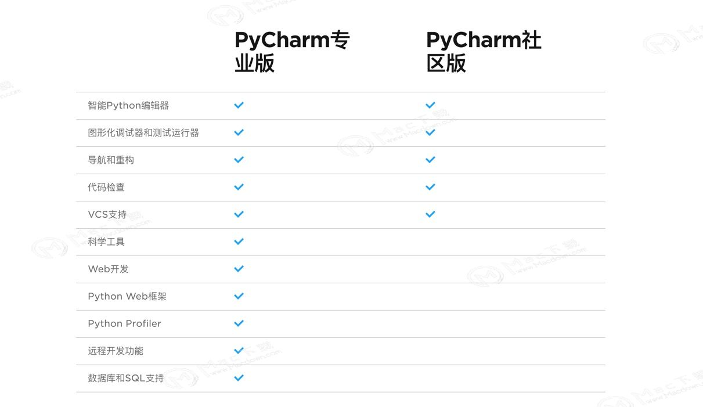


### 安装的具体步骤如下

1. 下载pycharm的版本软件

   http://xxxx:7000/file/tools/pycharm-professional-2019.1.2.exe

2. 选择相应的版本

   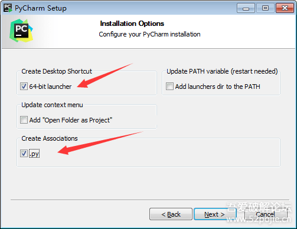

3. 选择运行pycharm

   

4. 选择先不设置

   一直选择点击下一步，下一步。

   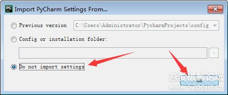

   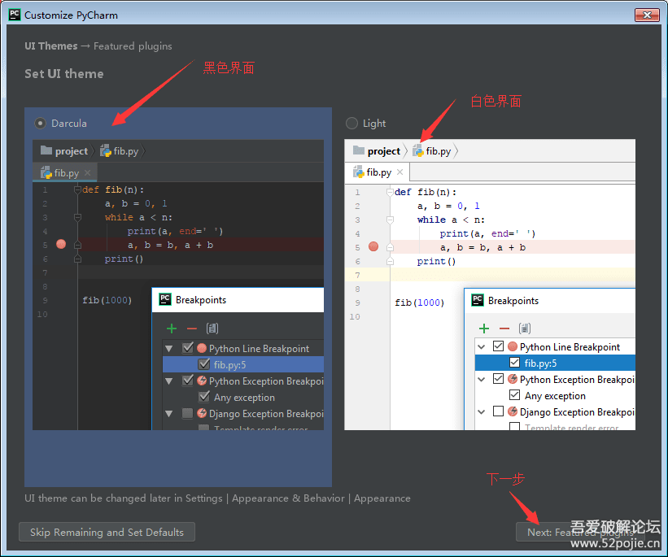

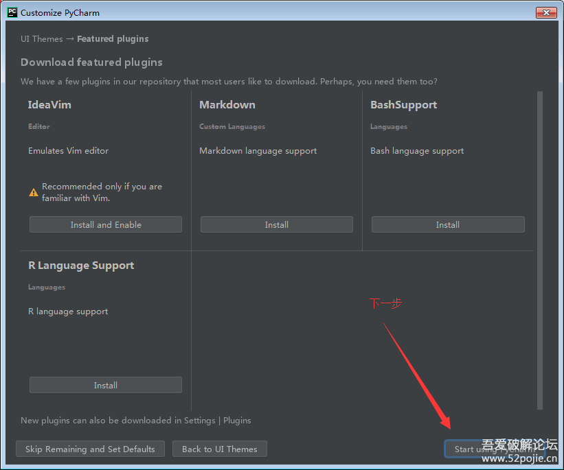

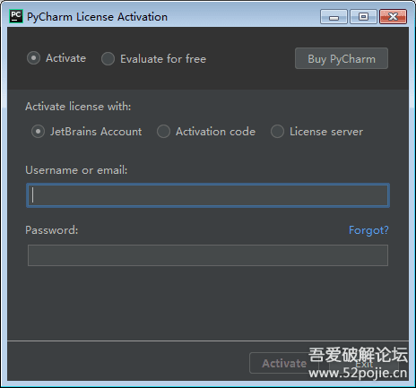


### 配置agent包

1. 下载agent包

   下载agent的jar包到相应的目录下。

   http://xxxx:7000/file/tools/jetbrains-agent.jar

2. 打开pycharm配置vm options

   打开pycharm后，选择"configure"或"Help" --> Edit Custom VM options

   ``` shell
   # custom PyCharm VM options
   
   -Xms1024m
   -Xmx1024m
   -XX:ReservedCodeCacheSize=240m
   -XX:+UseConcMarkSweepGC
   -XX:SoftRefLRUPolicyMSPerMB=50
   -ea
   -Dsun.io.useCanonCaches=false
   -Djava.net.preferIPv4Stack=true
   -Djdk.http.auth.tunneling.disabledSchemes=""
   -XX:+HeapDumpOnOutOfMemoryError
   -XX:-OmitStackTraceInFastThrow
   -javaagent:C:\pycharm\jetbrains-agent.jar
   ```

3. 重启pycharm

   注意如果启动不来，要注意最后添加的-javaagent信息是否正确，相应的需要打开如下的目录文件进行调整。

   ```C:\Users\Administrator\.PyCharm2019.1\config\pycharm64.exe.vmoptions```


### 导入密钥

打开pycharm软件，然后选择"Configure"--> "Manage License"

选择"Activation code"

``` shell
3AGXEJXFK9-eyJsaWNlbnNlSWQiOiIzQUdYRUpYRks5IiwibGljZW5zZWVOYW1lIjoiaHR0cHM6Ly96aGlsZS5pbyIsImFzc2lnbmVlTmFtZSI6IiIsImFzc2lnbmVlRW1haWwiOiIiLCJsaWNlbnNlUmVzdHJpY3Rpb24iOiIiLCJjaGVja0NvbmN1cnJlbnRVc2UiOmZhbHNlLCJwcm9kdWN0cyI6W3siY29kZSI6IklJIiwiZmFsbGJhY2tEYXRlIjoiMjA4OS0wNy0wNyIsInBhaWRVcFRvIjoiMjA4OS0wNy0wNyJ9LHsiY29kZSI6IkFDIiwiZmFsbGJhY2tEYXRlIjoiMjA4OS0wNy0wNyIsInBhaWRVcFRvIjoiMjA4OS0wNy0wNyJ9LHsiY29kZSI6IkRQTiIsImZhbGxiYWNrRGF0ZSI6IjIwODktMDctMDciLCJwYWlkVXBUbyI6IjIwODktMDctMDcifSx7ImNvZGUiOiJQUyIsImZhbGxiYWNrRGF0ZSI6IjIwODktMDctMDciLCJwYWlkVXBUbyI6IjIwODktMDctMDcifSx7ImNvZGUiOiJHTyIsImZhbGxiYWNrRGF0ZSI6IjIwODktMDctMDciLCJwYWlkVXBUbyI6IjIwODktMDctMDcifSx7ImNvZGUiOiJETSIsImZhbGxiYWNrRGF0ZSI6IjIwODktMDctMDciLCJwYWlkVXBUbyI6IjIwODktMDctMDcifSx7ImNvZGUiOiJDTCIsImZhbGxiYWNrRGF0ZSI6IjIwODktMDctMDciLCJwYWlkVXBUbyI6IjIwODktMDctMDcifSx7ImNvZGUiOiJSUzAiLCJmYWxsYmFja0RhdGUiOiIyMDg5LTA3LTA3IiwicGFpZFVwVG8iOiIyMDg5LTA3LTA3In0seyJjb2RlIjoiUkMiLCJmYWxsYmFja0RhdGUiOiIyMDg5LTA3LTA3IiwicGFpZFVwVG8iOiIyMDg5LTA3LTA3In0seyJjb2RlIjoiUkQiLCJmYWxsYmFja0RhdGUiOiIyMDg5LTA3LTA3IiwicGFpZFVwVG8iOiIyMDg5LTA3LTA3In0seyJjb2RlIjoiUEMiLCJmYWxsYmFja0RhdGUiOiIyMDg5LTA3LTA3IiwicGFpZFVwVG8iOiIyMDg5LTA3LTA3In0seyJjb2RlIjoiUk0iLCJmYWxsYmFja0RhdGUiOiIyMDg5LTA3LTA3IiwicGFpZFVwVG8iOiIyMDg5LTA3LTA3In0seyJjb2RlIjoiV1MiLCJmYWxsYmFja0RhdGUiOiIyMDg5LTA3LTA3IiwicGFpZFVwVG8iOiIyMDg5LTA3LTA3In0seyJjb2RlIjoiREIiLCJmYWxsYmFja0RhdGUiOiIyMDg5LTA3LTA3IiwicGFpZFVwVG8iOiIyMDg5LTA3LTA3In0seyJjb2RlIjoiREMiLCJmYWxsYmFja0RhdGUiOiIyMDg5LTA3LTA3IiwicGFpZFVwVG8iOiIyMDg5LTA3LTA3In0seyJjb2RlIjoiUlNVIiwiZmFsbGJhY2tEYXRlIjoiMjA4OS0wNy0wNyIsInBhaWRVcFRvIjoiMjA4OS0wNy0wNyJ9XSwiaGFzaCI6IjEyNzk2ODc3LzAiLCJncmFjZVBlcmlvZERheXMiOjcsImF1dG9Qcm9sb25nYXRlZCI6ZmFsc2UsImlzQXV0b1Byb2xvbmdhdGVkIjpmYWxzZX0=-WGTHs6XpDhr+uumvbwQPOdlxWnQwgnGaL4eRnlpGKApEEkJyYvNEuPWBSrQkPmVpim/8Sab6HV04Dw3IzkJT0yTc29sPEXBf69+7y6Jv718FaJu4MWfsAk/ZGtNIUOczUQ0iGKKnSSsfQ/3UoMv0q/yJcfvj+me5Zd/gfaisCCMUaGjB/lWIPpEPzblDtVJbRexB1MALrLCEoDv3ujcPAZ7xWb54DiZwjYhQvQ+CvpNNF2jeTku7lbm5v+BoDsdeRq7YBt9ANLUKPr2DahcaZ4gctpHZXhG96IyKx232jYq9jQrFDbQMtVr3E+GsCekMEWSD//dLT+HuZdc1sAIYrw==-MIIElTCCAn2gAwIBAgIBCTANBgkqhkiG9w0BAQsFADAYMRYwFAYDVQQDDA1KZXRQcm9maWxlIENBMB4XDTE4MTEwMTEyMjk0NloXDTIwMTEwMjEyMjk0NlowaDELMAkGA1UEBhMCQ1oxDjAMBgNVBAgMBU51c2xlMQ8wDQYDVQQHDAZQcmFndWUxGTAXBgNVBAoMEEpldEJyYWlucyBzLnIuby4xHTAbBgNVBAMMFHByb2QzeS1mcm9tLTIwMTgxMTAxMIIBIjANBgkqhkiG9w0BAQEFAAOCAQ8AMIIBCgKCAQEA5ndaik1GD0nyTdqkZgURQZGW+RGxCdBITPXIwpjhhaD0SXGa4XSZBEBoiPdY6XV6pOfUJeyfi9dXsY4MmT0D+sKoST3rSw96xaf9FXPvOjn4prMTdj3Ji3CyQrGWeQU2nzYqFrp1QYNLAbaViHRKuJrYHI6GCvqCbJe0LQ8qqUiVMA9wG/PQwScpNmTF9Kp2Iej+Z5OUxF33zzm+vg/nYV31HLF7fJUAplI/1nM+ZG8K+AXWgYKChtknl3sW9PCQa3a3imPL9GVToUNxc0wcuTil8mqveWcSQCHYxsIaUajWLpFzoO2AhK4mfYBSStAqEjoXRTuj17mo8Q6M2SHOcwIDAQABo4GZMIGWMAkGA1UdEwQCMAAwHQYDVR0OBBYEFGEpG9oZGcfLMGNBkY7SgHiMGgTcMEgGA1UdIwRBMD+AFKOetkhnQhI2Qb1t4Lm0oFKLl/GzoRykGjAYMRYwFAYDVQQDDA1KZXRQcm9maWxlIENBggkA0myxg7KDeeEwEwYDVR0lBAwwCgYIKwYBBQUHAwEwCwYDVR0PBAQDAgWgMA0GCSqGSIb3DQEBCwUAA4ICAQBonMu8oa3vmNAa4RQP8gPGlX3SQaA3WCRUAj6Zrlk8AesKV1YSkh5D2l+yUk6njysgzfr1bIR5xF8eup5xXc4/G7NtVYRSMvrd6rfQcHOyK5UFJLm+8utmyMIDrZOzLQuTsT8NxFpbCVCfV5wNRu4rChrCuArYVGaKbmp9ymkw1PU6+HoO5i2wU3ikTmRv8IRjrlSStyNzXpnPTwt7bja19ousk56r40SmlmC04GdDHErr0ei2UbjUua5kw71Qn9g02tL9fERI2sSRjQrvPbn9INwRWl5+k05mlKekbtbu2ev2woJFZK4WEXAd/GaAdeZZdumv8T2idDFL7cAirJwcrbfpawPeXr52oKTPnXfi0l5+g9Gnt/wfiXCrPElX6ycTR6iL3GC2VR4jTz6YatT4Ntz59/THOT7NJQhr6AyLkhhJCdkzE2cob/KouVp4ivV7Q3Fc6HX7eepHAAF/DpxwgOrg9smX6coXLgfp0b1RU2u/tUNID04rpNxTMueTtrT8WSskqvaJd3RH8r7cnRj6Y2hltkja82HlpDURDxDTRvv+krbwMr26SB/40BjpMUrDRCeKuiBahC0DCoU/4+ze1l94wVUhdkCfL0GpJrMSCDEK+XEurU18Hb7WT+ThXbkdl6VpFdHsRvqAnhR2g4b+Qzgidmuky5NUZVfEaZqV/g==
```

如果激活窗口一直弹出(error 1653219),需要在hosts文件里面移除jetbrains相关的信息。


### 参考URL信息

具体参考如下的URL信息

https://www.52pojie.cn/thread-961836-1-1.html

https://www.sdbeta.com/wg/2019/0509/229677.html


## 如何理解多进程与多线程

### fork()系统调用

fork系统调用用于从已存在进程中创建一个新进程，新进程称为子进程，而原进程称为父进程。fork调用一次，返回两次，这两个返回分别带回它们各自的返回值，其中在父进程中的返回值是子进程的进程号，而子进程中的返回值则返回0。因此，可以通过返回值来判定该进程是父进程还是子进程。

使用fork函数得到的子进程是父进程的一个复制品，它从父进程处继承了整个进程的地址空间，包括**进程上下文**、进程堆栈、内存信息、打开的文件描述符、信号控制设定、进程优先级、进程组号、当前工作目录、根目录、资源限制、控制终端等，而子进程所独有的只有它的进程号、计时器等。因此可以看出，使用fork系统调用的代价是很大的，它复制了父进程中的数据段和堆栈段里的绝大部分内容，使得fork系统调用的执行速度并不是很快。

> 参考如下URL:
>
> https://blog.csdn.net/guoping16/article/details/6580006


### 单进程

在下面的例子中，我们看到的是程序中的代码是按顺序一点点的往下执行，即使是两个不相关的下载任务，也需要先等待一个文件下载完成后才能开始下一个下载任务。

``` python
from random import randint
from time import time,sleep

def download_task(filename):
    print('开始下载%...' % filename)
    time_to_download = randint(5, 10)
    sleep(time_to_download)
    print('%下载完成！耗费%d秒' % (filename, time_to_download))
    
def main():
    start = time()
    download_task('Python从入门到住院.pdf')
    download_task('Peking Hot.avi')
    end = time()
    print('总共耗费%.2f秒.' % (end - start))

if __name__ == '__main__':
    main()
```


### 多进程

#### 概念

Unix和Linux操作系统上提供了fork()系统调用来创建进程。Python的os模块提供了fork()函数。由于windows系统没有fork()调用，因此要实现跨平台的多进程编程，可以使用multiprocessing模块的Porcess类来创建子进程，而且该模块还提供了更高级的封装，例如批量启动进程的进程池(Pool)、用于进程间通信的队列(Queue)和管道(pipe)等。


#### 多进程示例

在下面的代码中，我们通过Process类创建了进程对象，通过target参数我们传入一个函数来表示进程启动后要执行的代码，后面的args是一个元组，它代表了传递给函数的参数。```'Python从入门到住院.pdf',```代表这个元组中只有一个元素。

``` python
from multiprocessing import Process
from os import getpid
from random import randint
from time import time, sleep

def download_task(filename):
    print('启动下载进程,进程号[%d].' % getpid())
    print('开始下载%s...' % filename)
    time_to_download =  randint(5, 10)
    sleep(time_to_download)
    print('%s下载完成!耗时了%d秒' % (filename, time_to_download))

def main():
    start = time()
    p1 = Process(target=download_task, args=('Python从入门到住院.pdf',))
    p1.start()
    p2 = Process(target=download_task, args=('Peking Hot.avi',))
    p2.start()
    p1.join()
    p2.join()
    end = time()
    print('总共耗费了%.2f秒.' % (end - start))

if __name__ == '__main__':
    main()
```


#### join()方法有什么作用

该方法的意思是指，**阻塞当前进程，直到调用join方法的那个进程执行完，再继续执行当前进程。**

默认的格式可以为:**join([timeout])**，该方法内中括号的timeout为一个时间单位为秒的值，中括号为可选参数。如果指定时间到点，就释放阻塞。

如果我们在上面注释掉了p1.join()和p2.join()，那么可以看到程序的运行会不等待两个进程执行完毕就执行后面的end = time()和print。这个不符合我们的预期的。


#### run()方法有什么作用

run()方法是指，如果我们在创建Process对象的时候不指定target，那么就会默认执行Process的run方法。如果我们不改写run方法，那么执行的时候是没有任何效果的，因为默认的run方法是判断如果不指定target，那就什么都不做。例如下面的示例：

``` python
from multiprocessing import Process
import os, time, random

def r():
    print 'run method'
    
if __name__ == "__main__":
        print "main process run..."
        #没有指定Process的targt
        p1 = Process()
        p2 = Process()
        #如果在创建Process时不指定target，那么执行时没有任何效果。因为默认的run方法是判断如果不指定target，那就什么都不做
        #所以这里手动改变了run方法
        p1.run = r
        p2.run = r
        
        p1.start()
        p2.start()
        p1.join()
        p2.join()
        print "main process runned all lines..."
```


#### 为什么要依次调用start再调用join

在多进程中，为什么要先依次调用start再调用join，而不是start完了就调用join呢？

例如下面的例子中，如果是p1.start()完后，立即执行p1.join()，随后才是p2.start()呢？结果我们会发现，p2的进程会一直等待p1的进程完成后再去执行。join是用来阻塞当前线程的。

``` python
p1.start()
p2.start()
p1.join()
p2.join()
#改为
p1.start()
p1.join()
p2.start()
p2.join()
```

> 参考如下URL：
>
> https://www.cnblogs.com/lipijin/p/3709903.html


### 多线程

目前的多线程开发，我们使用threading模块，该模块对多线程编程提供了更好的面向对象的封装。


#### 使用Thread类创建线程

我们可以直接使用threading模块中的Thread类来创建线程对象，整体的流程和多进程很类似。

``` python
from random import randint
from threading import Thread
from time import time, sleep

def download(filename):
    print("开始下载%s..." % filename)
    time_to_download = randint(5, 10)
    sleep(time_to_download)
    print("%s下载完成! 耗费了%d秒" % (filename, time_to_download))

def main():
    start = time()
    t1 = Thread(target=download, args=("Python从入门到住院.pdf",))
    t1.start()
    t2 = Thread(target=download, args=("Peking Hot.avi",))
    t2.start()
    t1.join()
    t2.join()
    end = time()
    print("总共耗费了%.3f秒" % (end - start))

if __name__ == '__main__':
    main()
```


#### 继承Thread类自定义线程类

我们通过继承Thread类的方式来创建自定义的线程类，然后再创建线程对象并启动线程。这个时候同样，需要自己定义一个run方法。

``` python
from random import randint
from threading import Thread
from time import time, sleep

class DownloadTask(Thread):
    def __init__(self, filename):
        super().__init__()
        self._filename = filename
    
    def run(self):
        print('开始下载%s...' % self._filename)
        time_to_download = randint(5, 10)
        sleep(time_to_download)
        print('%s下载完成！耗费了%d秒' % (self._filename, time_to_download))

def main():
    start = time()
    t1 = DownloadTask('Python从入门到住院.pdf')
    t1.start()
    t2 = DownloadTask('Peking Hot.avi')
    t2.start()
    t1.join()
    t2.join()
    end = time()
    print('总共耗费了%.2f秒.' % (end - start))

if __name__ == '__main__':
    main()
```


## 如何实现Python数据库访问

### 数据库编程接口

为了对数据库进行统一的操作，大多数的语言都提供了简单的、标准化的数据库接口(API)。在Python Database API 2.0规范中，定义了Python数据库API接口的各个部分，如**模块接口**、**连接对象**、**游标对象**、**类型对象和构造器**、**DB API的可选扩展**以及可选的**错误处理机制**。


#### 连接对象

##### 什么是数据库连接对象

数据库的连接对象主要提供**获取数据库游标对象**和**提交、回滚事务的方法**，以及**关闭数据库连接**。


##### 为什么需要数据库连接对象

我的理解是创建了数据库的连接对象，实际上是已经创建了一个数据库的连接，我们可以基于这个连接，进行数据库的各种操作。


##### 如何获取连接对象

如果是对mysql进行操作的话，我们可以使用pymysql模块中的connect()函数，来获取连接对象。该函数有多个参数，分别可以用来设置主机、IP、端口、用户、密码、数据库名称等信息。

``` python
import pymysql
conn = pymysql.connect(host='localhost', user='user', password='passwd', db='test', charset='utf8', cursorclass='pymysql.cursors.DictCursor')
```


##### 连接对象的方法

connect()函数返回连接对象，这个对象表示目前和数据库的会话，连接对象支持的方法如下：

| 方法名     | 说明                                                    |
| ---------- | ------------------------------------------------------- |
| close()    | 关闭数据库连接                                          |
| commit()   | 提交事务                                                |
| rollback() | 回滚事务                                                |
| cursor()   | 获取游标对象，操作数据库，如执行DML操作，调用存储过程等 |


#### 游标对象

是什么？

游标对象代表了数据库中的游标，用于指示抓取数据操作的上下文，主要提供执行SQL语句、调用存储过程、获取查询结果等方法。

如何获取游标对象？

通过使用连接对象的cursor()方法，可以获取到游标对象。游标对象的属性有两个：

* description： 数据库列类型和值的描述信息
* rowcount：回返结果的行数统计信息，如select、update、callproc等。

游标对象的方法如下表：

| 方法名                                | 说明                                                 |
| ------------------------------------- | ---------------------------------------------------- |
| callproc(procname, [,parameters])     | 调用存储过程，需要数据库支持                         |
| close()                               | 关闭当前游标                                         |
| execute(operation[,parameters])       | 执行数据库操作，SQL语句或数据库命令                  |
| executemany(operation, seq_of_params) | 用于批量操作，如批量更新                             |
| fetchone()                            | 获取查询结果集中的下一条记录                         |
| fetchmany(size)                       | 获取指定数量的记录                                   |
| fetchall()                            | 获取结果集的所有记录                                 |
| nextset()                             | 跳至下一个可用的结果集                               |
| arraysize                             | 指定使用fetchmany()获取的行数，默认为1               |
| setinputsizes(sizes)                  | 设置在调用execute*()方法时分配的内存区域大小         |
| setoutputsize(sizes)                  | 设置列缓冲区大小，对大数据列(如longs和blobs)尤其有用 |


### 访问Mysql

#### 安装pymysql模块

``` python
pip install PyMySQL
```


#### 执行创建表

``` python
import pymysql
# 打开数据库连接
db = pymysql.connect("localhost", "root", "root", "mrsoft")
# 使用cursor()方法创建一个游标对象cursor
cursor = db.cursor()
# 使用execute()方法执行SQL，如果表存在则删除
cursor.execute("DROP TABLE IF EXISTS books")
# 使用预处理语句创建表
sql = """
CREATE TABLE books (
  id int(8) NOT NULL AUTO_INCREMENT,
  name varchar(50) NOT NULL,
  category varchar(50) NOT NULL,
  price decimal(10,2) DEFAULT NULL,
  publish_time date DEFAULT NULL,
  PRIMARY KEY(id)
) ENGINE=MyISAM AUTO_INCREMENT=1 DEFAULT CHARSET=uft8;
"""
# 执行SQL语句
cursor.execute(sql)
# 关闭数据库连接
db.close()
```


#### 查询语句

``` python
import pymysql
# 打开数据库连接
db = pymysql.connect("localhost", "root", "root", "mrsoft")
# 使用cursor()方法获取操作游标
cursor = db.cursor()
# 使用execute()方法执行SQL查询
cursor.execute("select * from books")

# 使用fetchone()方法获取单条数据
# 返回的是一个元组
data1 = cursor.fetchone()
print(data1)

# 使用fetchmany(x)方法查询多条数据
# fetchmany()方法传递一个参数，其值为2，默认为1
# 返回的是一个列表，列表中包含2个元组
data2 = cursor.fetchmany(2)
print(data2)

# 使用fetchall()方法查询所有数据
# 返回的也是一个列表
data3 = cursor.fetchall()
print(data3)

# 带条件的查询，使用问好作为占位符号
# 然后使用一个元组来替换问号
# 注意，不要忽略元组中最后的逗号
cursor.execute('select * from user where id >?',(1,))
data4 = cursor.fetchall()
print(data4)

# 关闭游标
cursor.close()
# 关闭connection
conn.close()
```


#### 执行插入

``` python
import pymysql
# 打开数据库连接
db = pymysql.connect("localhost", "root", "root", "mrsoft")
# 使用cursor()方法获取操作游标
cursor = db.cursor()
# 数据列表
data = [("学python", 'python', '79', '2018-5-20'),
        ("学java", 'java', '100', '2018-6-18'),
        ("学php", 'php', '80', '2019-3-11'),
        ("学docker", 'docker', '200', '2018-12-03')]
try:
    # 执行SQL语句，插入多条数据
    cursor.executemany("insert into books(name, category, price, publish_time) values (%s, %s, %s, %s)", data)
    # 提交数据
    db.commit()
except:
    # 发生错误时回滚
    db.rollback()
# 关闭数据库连接
db.close()
```


#### 修改表数据

``` python
import pymysql
# 打开数据库连接
db = pymysql.connect("localhost", "root", "root", "mrsoft")
# 使用cursor()方法获取操作游标
cursor = db.cursor()
# 执行update
cursor.execute('Update user set name = ? where id = ?',('MR',1))
cursor.execute('select * from user')
data = cursor.fetchall()
print(data)
# 关闭游标
cursor.close()
# 关闭Connection
conn.close()
```


#### 删除表数据

``` python
import pymysql
# 打开数据库连接
db = pymysql.connect("localhost", "root", "root", "mrsoft")
# 使用cursor()方法获取操作游标
cursor = db.cursor()
cursor.execute('delete from user where id = ?',(1,))
cursor.execute('select * from user')
data = cursor.fetchall()
print(data)
# 关闭游标
cursor.close()
# 提交事务
conn.commit()
# 关闭connection
conn.close()
```


## 为什么pip安准包会报错

### 问题描述

在Windows中使用pip install  xxxx的方式来安装第三方插件的时候，出现了如下的报错：

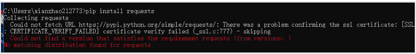

碰到这个问题，主要的原因是网站pypi.python.org在国内是被墙了的，在安装程序的时候，无法从python官网下载而导致的。


### 解决办法一

在C盘，进入%user%/pip目录，就是在当前的用户下找到pip文件夹，没有就自己创建一个。在pip文件夹下创建pip.ini文件，修改pip.ini内容如下：

``` ini
[global] 
index-url=http://pypi.douban.com/simple/
[install]
trusted-host=pypi.douban.com
```

随后，重新使用pip install xxx即可。


### 解决办法二

可以临时解决这个报错的问题，使用如下的命令进行pip安装

``` shell
pip install 插件名 -i 国内镜像地址 http://pypi.douban.com/simple --trusted-host pypi.douban.com
```

可以把豆瓣镜像地址换成如下的镜像地址

``` shell
http://mirrors.aliyun.com/pypi/simple/ 阿里云
https://pypi.mirrors.ustc.edu.cn/simple/  中国科技大学
http://pypi.douban.com/simple/  豆瓣
https://pypi.tuna.tsinghua.edu.cn/simple/ 清华大学
http://pypi.mirrors.ustc.edu.cn/simple/ 中国科学技术大学
```


## 如何进行pip离线安装模块

### 下载第三方包

下载第三方包，有两种方式

方法一：下载单个包

``` shell
$ pip download -d /usr/local/download/pip/ jieba
```


方法二：下载多个包，并指定版本

编写requirement.txt，可参照如下格式：

``` shell
alembic==1.0.0            # via flask-migrate
amqp==2.3.2               # via kombu
asn1crypto==0.24.0        # via cryptography
babel==2.6.0              # via flask-babel
billiard==3.5.0.4         # via celery
bleach==3.0.2
celery==4.2.0
certifi==2018.8.24        # via requests
cffi==1.11.5              # via cryptography
chardet==3.0.4            # via requests
```


执行下面的命令进行下载:

``` shell
pip download -d /usr/local/download/pip/ -r requirement.txt
```


### 离线安装

方法一：单独安装一个模块

``` shell
pip install --no-index --find-links=/usr/local/download/pip/ jieba 
```


方法二：批量安装定义需要安装的模块

``` shell
pip install --no-index --find-links=/usr/local/download/pip/ -r requirement.txt
```


## 如何实现Python中Request模块中post请求

利用requeset模块中post方法，来进行post请求的发送。

下面的案例是发起post请求，带参数，带请求头。

``` python
#! /usr/bin/env python
# -*- coding: utf-8 -*-
import requests
import json
url = 'http://official-account/app/messages/group'
body = {"type": "text", "content": "测试文本", "tag_id": "20717"}
headers = {'content-type': "application/json", 'Authorization': 'APP appid = 4abf1a,token = 9480295ab2e2eddb8'}

print type(body)
print type(json.dumps(body))
# 这里有个细节，如果body需要json形式的话，需要做处理
# 可以是data = json.dumps(body)
response = requests.post(url, data = json.dumps(body), headers = headers)
# 也可以直接将data字段换成json字段，2.4.3版本之后支持
# response  = requests.post(url, json = body, headers = headers)

# 返回信息
print response.text
# 返回响应头
print response.status_code
```


### form形式发送post请求

request支持以form表单形式发送post请求，只需要将请求的参数构造成一个字典，然后传给requests.post()的data参数即可。

``` python
import requests

url = 'http://httpbin.org/post'
d = {'key1': 'value1', 'key2': 'value2'}
r = requests.post(url, data=d)
print r.text
```

我们可以看到，请求头中的content-type字段已经设置为application/x-www-form-urlencoded，且`d = {'key1': 'value1', 'key2': 'value2'}`以form表单的形式提交到服务端，服务端返回的form字段即是提交的数据。


### json形式发送post请求

也就是将一个json串传给requests.post()的data参数。

``` python
url = 'http://httpbin.org/post'
s = json.dumps({'key1': 'value1', 'key2': 'value2'})
r = requests.post(url, data=s)
print r.text
```

可以看到，请求的content-type设置为application/json，并将这个json串提交到了服务端中。


### multipart形式发送post请求

requests也支持以multipart形式发送post请求，只需将一文件传给requests.post()的file参数即可。

``` python
url = 'http://httpbin.org/post'
files = {'file': open('report.txt', 'rb')}
r = requests.post(url, files=files)
print r.text
```


## 如何理解字典和列表的嵌套

### 什么是序列

序列是有顺序的数据集合，就好像一列排好对的士兵。

序列包含的一个数据被称为序列的一个元素。

序列可以分为两种类型，元组(tuple)和列表(list)


### 什么是元组

定义：是一组不可变更的元素，是**不可变的序列**，也是一种可以**存储各种数据类型的集合**，用小括号()表示元组的开始和结束，元素之间用逗号,分隔。

这里的不可变，包括不能对元组对象进行增加元素、变换元素位置、修改元素、删除元素操作。元组中的每个元素提供对应的一个下标，下标从0开始，0、1、2...按顺序标注。

值得注意的是：多个元素可以是不同的类型，可以是整型，可以是浮点型，也可以是字符序，布尔型。用小括号来定义。

元组的定义如下：

``` python
example_tuple = (2, "love", 1.3 , False)
```

元组的引用如下：引用的格式是，引用名+中括号，中括号里面是从0开始的数字，代表第一个元素。

``` python
example_tuple[0]
example_tuple[0]  =  "12121212"
```


### 什么是列表

列表是可变个序列，也是一种可以存储各种数据类型的集合，用中括号[]表示列表的开始和结束，元素之间用逗号,分隔。列表中每个元素提供一个对应的下标。


### 元组和列表有什么区别和联系

元组和列表都是用来存储多个元素的容器。

不同的地方在于，元组的各个元素不可再变更，而列表元素可以变更。


### 什么是字典

词典也是一个可以容纳多个元素的容器。

词典包含多个元素，每个元素以逗号分隔。

词典的元素包含两个部分，键(key)和值(value)。键是数据的索引，值是数据本身。

词典的元素可以通过键来引用。

字典的定义：

``` python
example_dict = {"tom":11, "sam":57, "lily":100}
```

字典的引用：

``` python
example_dict["tom"]
example_dict["tom"] = 30
```


### 字典嵌套字典

是指在一个字典的内部再嵌套一个字典。{}表示是一个字典，jiangsu和anhui是里面的两个字典，jiangsu里面有嵌套了多个字典。

不太清楚什么时候用{}还是[]的时候，用type来判断确认。

用{}还是[]关键在于，里面的内容是啥，是key/value的形式值，还是单纯的是一个列表。

``` python
dict5 = {
    'jiangsu': {
        'nanjing': '025',
        'wuxi': '0510',
        'xuzhou': '0516',
        'changzhou': '0519'
    },
    'anhui': {
        'hefei': '0551',
        'wuhu': '0553',
        'buben': '0552'
    }
}
print(type(dict5))
print(dict5['jiangsu'])
```


### 字典嵌套列表

是指在字典中嵌套了一个列表。在下面的例子中，jiangsu和anhui是两个字典，jiangsu里面又嵌套了多个字典，其中nanjing这个字典里面嵌套了一个列表。

不太清楚什么时候使用{}和[]的时候，用type来判断。

用{}还是[]关键在于，里面的内容是啥，是key/value的形式值，还是单纯的是一个列表。

``` python
dict6 = {
    'jiangsu': {
        'nanjing': ['025','111111','222222'],
        'wuxi': '0510',
        'xuzhou': '0516',
        'changzhou': '0519'
    },
    'anhui': {
        'hefei': '0551',
        'wuhu': '0553',
        'buben': '0552'
    }
}
print(type(dict6))
print(dict6['jiangsu'])
print(dict6['jiangsu']['nanjing'])
print(dict6['jiangsu']['nanjing'][1])
```


### 列表嵌套字典

下面的例子中是，在dict7是一个列表，这个列表中有两个元素，jiangsu那个元素是一个大的字典，在这个字典里面，nanjing里面又嵌套了多个列表的元素。

``` python
dict7 = [
    {
    'jiangsu': {
        'nanjing': ['025','111111','222222'],
        'wuxi': '0510',
        'xuzhou': '0516',
        'changzhou': '0519'
    }},
    {'anhui': {
        'hefei': '0551',
        'wuhu': '0553',
        'buben': '0552'
    }}
]
print(type(dict7))
print(dict7[0])
print(dict7[1])
print(dict7[1]['anhui']['hefei'])
```


### 列表嵌套列表

在下面的例子中，dict8是一个列表。这个列表里面有两个元素，jiangsu这个元素是一个字典，后面的一个元素是一个列表。[{'hefei': '0551'}],[{'wuhu': '0553'}],[{'buben': '0552'}]  里面的每一个元素是一个key/value的字典。

``` python
dict8 = [
    {
    'jiangsu': {
        'nanjing': ['025','111111','222222'],
        'wuxi': '0510',
        'xuzhou': '0516',
        'changzhou': '0519'
    }},
    [[{'hefei': '0551'}],[{'wuhu': '0553'}],[{'buben': '0552'}]]
]
print(type(dict8))
print((dict8)[1])
print(type((dict8)[1][0]))
print((dict8)[1][0][0]['hefei'])
```


## 什么时候使用()号，什么时候使用[]号，什么时候使用{}号


### 在Python中使用`()`小括号有如下两种场景：

1. 定义一个元组tuple的时候

   ``` python
   #一个元组，括号
   #注意元组的各个元素定义完后不可再更改了
   #也就是说后面不可能再出现对元组某个元素赋值的操作了
   example_tuple = (2, 1.3, "love", 5.6, False)
   ```

   

2. 函数定义中表示参数/调用函数时参数传递(和类中方法一个意思)

   ``` python
   # 定义函数
   def square_sum(a,b):
       a = a**2
       b = b**2
       c = a + b
       return c
   # 调用函数
   a = 5
   b = 6
   x = square_sum(a, b)
   print(x)
   ```

   

### 在Python中使用`[]`中括号有如下两种情形：

1. 定义一个列表(list)

   在序列中，我们可以通过下面的方式来定义一个列表，主要注意的是定义的时候，变量名和后面`[]`中间有个`=`号来连接的。

   ``` python
   example_list = [True, 5, "smile"]             
   #一个列表，中括号
   ```

2. 表示对某个或某些元素的引用

   需要注意的是，引用元素的时候，中间是没有`=`号的。但是如何对字典的某个元素进行赋值的时候，是可以有`=`号的。

   * 元组中对元素的引用

     ``` python
     #显示序列example_tuple元组中第一个元素
     example_tuple[0]
     ```

   * 列表中对元素的引用

     ``` python
     #显示的是第二个元素中，
     #第二个元素是一个嵌套的列表，该嵌套列表中的第三个元素
     nest_list[1][2]
     ```
     
   * 元组或列表中多个元素的引用

     序列中可以通过范围引用，来找到多个元素。范围引用的基本样式是：序列名[下限:上限:步长]
   
     下限表示起始下标，上限表示结尾下标。在起始下标和结尾下标之间，按照步长的间隔来找到元素。默认的步长是1。
   
     ``` python
     # 下标为0，2，4的元组元素
     example_tuple[0:5:2]
     # 倒数第一(最后一个)的元素
     # -1代表最后一个
     example_tuple[-1]
     # 倒数第三个元素
     # -3代表倒数第三
     example_tuple[-3]
     #序列的第二个到倒数第二个元素
     #这里是下限是-1，下限是最后一个元素
     example_tuple[1:-1] 
     ```
   
   * 对字典中的key进行赋值
   
     ``` python
     example_dict = {"tom":11, "sam":57, "lily":100}
     example_dict["tom"]
     example_dict["tom"] = 30
     ```
     


### 在Python中使用`{}`号有如下 一种场景

在Python中定义字典的时候，使用`{}`，但是引用的时候使用`[]`

``` python
example_dict = {"tom":11, "sam":57, "lily":100}
example_dict["tom"]
```


## 如何使用Anaconda

### windows安装Anaconda

Anaconda指的是一个开源的Python发行版本，其包含了conda、Python等180多个科学包及其依赖项。 因为包含了大量的科学包，Anaconda 的下载文件比较大（约 531 MB），如果只需要某些包，或者需要节省带宽或存储空间，也可以使用Miniconda这个较小的发行版（仅包含conda和 Python）。
Conda是一个开源的包、环境管理器，可以用于在同一个机器上安装不同版本的软件包及其依赖，并能够在不同的环境之间切换。

Anaconda包括Conda、Python以及一大堆安装好的工具包，比如：numpy、pandas等。

Miniconda包括Conda、Python。

分为下载，安装，配置环境变量。

设置如下环境变量：

``` shell
C:\Anaconda3\Scripts
C:\Anaconda3\Library\bin
而C:\Anaconda3可以先不设置看看
```


### Centos7安装Anaconda

#### 下载Anaconda

可以在清华镜像的网站下载最新的匹配的Anaconda版本，地址是  [清华大学镜像](https://mirrors.tuna.tsinghua.edu.cn/anaconda/archive/?C=M&O=D)

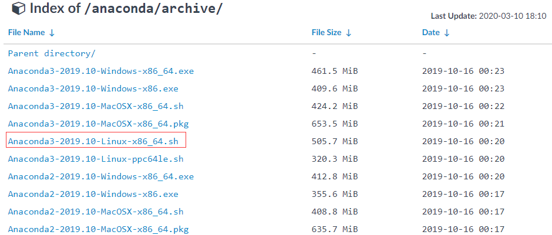


#### 安装Anaconda

``` shell
$ bash Anaconda3-2019.10-Linux-x86_64.sh 
```

许可证声明，回车

``` shell
In order to continue the installation process, please review the license
agreement.
Please, press ENTER to continue
>>> 
```

选择yes

``` shell
Do you accept the license terms? [yes|no]
[no] >>> 
```

选择安装目录，这里我们就直接回车，不修改目录了。

``` shell
Anaconda3 will now be installed into this location:
/app/python/anaconda3

  - Press ENTER to confirm the location
  - Press CTRL-C to abort the installation
  - Or specify a different location below

[/app/python/anaconda3] >>> 
```

是否选择利用conda初始化，我们这里选择yes。

这样自动添加环境变量，会使得开机自动启动base环境

``` shell
Do you wish the installer to initialize Anaconda3
by running conda init? [yes|no]
[no] >>> 
```

退出，重新进入python用户，进行验证。

``` shell
(base) [python@lteindicator091224 ~]$ 
```


### 常见命令

#### 查看conda版本

``` shell
$ conda --version
```


#### 升级conda版本

``` shell
$ conda upgrade --all
```


#### 虚拟环境是什么

默认会有一个base环境的python解释器，我们可以将原有环境变量中的python去除掉，这个时候使用的python不是原来环境变量中设置的，而是base环境下的python。而命令行前面也会多一个(base)说明当前我们处于的是base环境下。

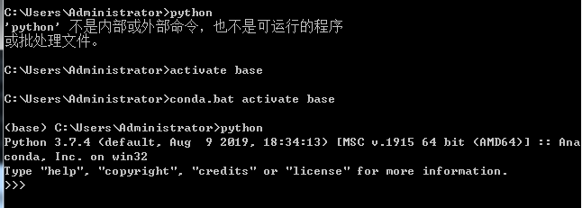


#### 新建虚拟环境

下面创建一个名为test1的虚拟环境，并指定python版本为3.7(这里conda会自动找3.7中最新的版本下载)

``` shell
$ conda create -n test1 python=3.7
```


#### 激活环境

``` shell
windows机器
$ activate test1
Linux和mac机器
$ source activate test1
```


#### 取消激活的环境

``` shell
windows机器
$ deactivate test1
linux和mac机器
$ source deactivate test1
```


#### 切换环境

``` shell
$ activate test1
```


#### 查看所有的环境

``` shell
$ conda env list
```


#### 卸载环境

``` shell
$ conda remove --name test1 --all
```


#### 卸载第三方包

``` shell
利用conda卸载
$ conda remove requests
利用pip卸载
$ pip uninstall requests
```


#### 安装第三方包

``` shell
利用conda安装
下面的name是packages包的名字
$ conda install name
# 使用conda install package=version 就能安装指定版本的package
利用pip安装
$ pip install name
```


#### 查看环境中包信息

``` shell
$ conda list
```


#### 导入导出环境

如果想要导出当前环境的包信息可以用，下面的命令导出yaml文件中

``` shell
$ conda env export > environment.yaml
```

重新创建一个相同的虚拟环境(导入)可以用，下面的命令

``` shell
$ conda env create -f environment.yaml
```


## 如何在vscode中conda虚拟环境配置

1. 安装Anaconda

2. 安装vscode 

3. 配置window的环境变量

   ``` shell
   /c/Anaconda3/Library/bin
   /c/Anaconda3/Scripts
   /c/Anaconda3
   ```

4. 设置vscode中变量

   文件--首选项--设置--扩展--Python

   在用户配置或工作区配置，选择python.pythonPath为anaconda中的python路径，这里是"C:\Anaconda3"

   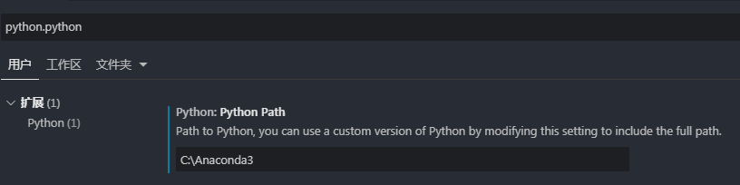

5. 新建虚拟环境

   参照前面的Anaconda3中conda的设置

6. 切换python虚拟环境

   左下角，选择相应的解释器。

   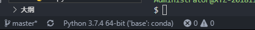

   选择需要相应虚拟环境的，相应的工作目录。这些目录需要在工作区内。

   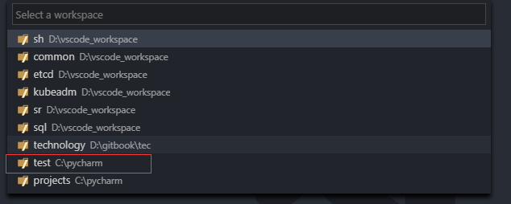

   随后打开上面选择的目录下的python文件，发现会已经切换了

   


## 为什么Python运行慢

1. Python是动态性语言不是静态性语言

   Python程序执行的时候，编译器不知道变量的类型。Python只知道是一个对象，动态类型意味着任何操作都需要更多的步骤。这是Python在数值数据操作方面比C慢的主要原因。

2. Python是解释性语言而不是编译性语言

   解释型语言与编译型语言它们本身的区别也会造成程序在执行的时候的速度差异。一个智能化的编译器可以预测并针对重复和不需要的操作进行优化。这也是提升程序执行的速度。

3. Python的对象模型会导致访问内存效率低下

   相对于C语言，例如Python中对整数进行操作会有一个额外的类型信息层。当对数据进行操作时(例如排序、计算、查找等)，无论是存续成本还是访问成本，都很高。

>参考如下文档，进行的整理
>
>https://www.jianshu.com/p/3fa56d9f58cb 


# 如何理解Python中单引号/双引号/多引号


## 如何理解Python中for循环range()函数

在Java中的for循环的格式是如下的：

``` java
for (i=0, i<10, i++){
    system.out.print(i);
}
```

在python中要改写成这样：

``` python
for i in range(0, 10, 1):
    print(i)
```

其中range()函数中的第一个参数是开始(包含本身)，第二个参数是结束(不包含本身)，第三个参数是步长。

> 参考的如下的网上文档：
>
> https://jingyan.baidu.com/article/fec7a1e5d6f00a1190b4e7a5.html


## 如何理解for循环和while循环的区别

for循环，就是遍历某一对象，也就是说根据循环次数限制做多少次重复操作。

例如如下的for循环操作：```for i in range(3)```意思就是i循环4次，i的取值为0、1、12。

while循环，就是当满足什么条件的时候，才做某种操作。

例如如下的while操作：```while count < 3```意思是当count小于3时，才做下面的操作。

案例分析：在做一个登陆的小程序的时候，最多输入用户名和密码3次，这时就应该用while循环，而不是for循环，因为循环次数不一定(我们的循环体内写的是重复登陆要输入的用户名和密码)。

> 参考如下的网页：
>
> https://www.cnblogs.com/klmm/p/8620331.html


## 如何理解Python中的do...while

Java中有相应的do while的语法，与while的差别在于，do while是先执行循环体语句，然后进行判断语句，也就是说无论判断是否为true都会至少执行一次。

``` java
public class whiletest {
    public static void main(string[] args) {
        int i = 1;
        do {
            i++;
            system.out.println(i);
        } while (i<1) 
    }
}
```

在python中是没有do while这种语法格式的，但是可以使用while(无限循环)和break组合起来实现do .... while 。这里的while(无限循环)，相当于是do 里面的内容；而带上if 条件后的break，就是原有的while 中的内容。

``` python
n = 0 
while True:     # 无限循环....
    print n
    n += 1
    if n == 10:
        break
```

> 参照如下网页：
>
> https://blog.csdn.net/qq_37131111/article/details/54580587
>
> https://www.jianshu.com/p/028cd9460ccb
>
> https://segmentfault.com/q/1010000002428584


## 为什么pip install报SSL ERROR

正常执行pip install某个模块的时候，就会报SSL的错误。

改为如下命令执行：

``` shell
pip install requests -i http://pypi.douban.com/simple/ --trusted-host pypi.douban.com
```


## 如何理解Python中的函数和方法的区别

函数的定义：在函数定义的过程中，用的是def关键字，有函数的形参，有相应的return 返回值。

``` python
def square_sum(a,b):
    a = a**2
    b = b**2
    c = a + b
    return c
```

函数的调用：函数的调用，和函数的定义很相似。只不过在调用函数的时候，我们把真实的数据填入到括号中，作为参数传递给函数。

``` python
a = 5
b = 6
x = square_sum(a, b)
print(x)
```

方法的定义：方法属于定义类中包含的内容，方法是用来定义类的一些"行为"属性，也就是说在类的内部定义函数的方式来说明方法。但是和定义函数的方式还是有不同。也是使用def关键字，方法的内部的第一个参数是self，是为了在方法内部引用对象自身。无论该参数是否用到，方法的第一个参数必须是用于指代对象自身的self。

``` python
class Bird(object):
    feather = True
    reproduction = "egg"
    def chirp(self, sound):
        print(sound)
```

方法的调用：我们是通过对象来调用方法，先要实例化一个对象，然后像调用函数那样，通过传参来实现调用。

``` python
summer = Bird()
summer.chirp("jijijij")    #打印'jijijij'
```


## 如何实现print函数格式化输出

在python中，我们有时候需要对输出进行格式化输出，有两种方式：第一种方法是占位符的方式；第二种方法是格式化输出的方式。

### 占位符方式

例如我们需要输出"你好XX，你的额度是XX"，其中XX的变量，我们是无法预知的。这个时候就需要格式化输出，和C语言一样，我们可以使用占位符%?，其中?代表不同的字符，例如%s代表字符串，%d代表十进制整数，%f代表浮点数。

%前面是占位符号，后面是真实的值，name将替换%s的位置，b将替换%d的位置，字符串后的%用来说明是哪些变量要替换前面的占位符，当只有一个变量的时候，可以省略括号。

``` python
name = "potato"
b = 100
print("你好%s，你的额度是%d" % (name,b))
```

占位符还可以控制输出的格式，例如保留几位小数。如果不知道数据类型的话，用%s即转为字符串进行输出会比较稳妥。

``` python
# %.2f代表保留两位小数
print("小数: %.2f" % 3.14159)
# %.2f保留两位小数，不够的位用0补充
print("小数: %.2f" % 4.5)
# %3d代表这个数的宽度为3，不够的话用空格在前面补，如果数的宽度大于3，则正常输出
print("占位: %3d" % 5)
# %05d代表这个数的宽度为5，不够的话用0在前面补，如果数的宽度大于5，则正常输出
print("前导0: %05d" % 2)
```


### format方式格式化输出

可以利用string对象的format对象，进行格式化。

``` python
#{0}代表占位符和format里的参数对应，{1:.2f}，
#冒号后是格式控制，代表保留两位小数，
#下面的结果是"你好potato,你余额是3.10"
print("你好{0}，你的余额是{1:.2f}".format("Potato",3.1))
#或者可以使用py内置的format函数
print(format(3.1415,".2f"))
#结果是3.14
```

> 参考的URL如下：
>
> https://segmentfault.com/a/1190000018081959


从Python2.6开始，新增了一种格式化字符串的函数str.format()，它增强了字符串格式化的功能。基本的语法是通过`{}`和`:`来代替以前的`%`.

format函数可以接受不限参数个数，位置可以不按顺序。

字符串里面的`{}`，想怎么写就怎么写，不需要考虑在`{}`上面加上`''`或`""`，在format函数后面的括号里面的各个值，要注意写的方式，如果是字符串就加上`''`或`""`，如果是数字类型，那么就什么也不要加。

str.format()里面只是描述了，在字符串的某个位置，应该填入哪些变量，至于这个变量合不合理，类型是不是有误，这就不是str.format()函数关心的事情了，例如如果写入sql中的字段不对，那么数据库自己根据事务性的原则自己去回滚。


#### 不指定位置

str里面的`{}`和format()函数里面的各个值，不去指定对应的关系，那么就按照两者出现的先后顺序去匹配上。

```
print('i love nanjing: {} {}'.format("sha","lili"))

print('i love nanjing: ({},{})'.format(100,"lili"))
```


#### 指定位置

通过对str里面的`{0}`、`{1}` .... 等方式，来和后面的format()函数中的各个值匹配上，`{0}`代表匹配的是format()函数中的第一个值，`{1}`代表匹配的是format()函数中的第二个值，以此类推。

``` 
print('i love nanjing: {1} {0}'.format("sha","lili"))

print('i love nanjing: ({1},{0})'.format(100,"lili"))
```


### f-string 格式化字符串常量

摘录于如下的URL地址：

> [Python格式化字符串f-string概览](https://blog.csdn.net/sunxb10/article/details/81036693)

f-string，被称为格式化字符串常量，是Python3.6新引入的一种字符串格式化方法，主要目的是事格式化字符串的操作更加简便。f-string在形式上是以`f`或`F`修饰符引领的字符串(`f'xxx'`或`F'xxx'`)，以大括号`{}` 标明被替换的字段；f-string在本质上并不是字符串常量，而是一个在运行时运算求值的表达式。

f-string在功能方面不逊于传统的`%-formatting语句`和str.format()函数，同时性能又优于两者，且使用起来也更加简明，因此对于Python3.6及以后的版本，推荐使用f-string进行字符串格式化。

``` 
s_num = 1005
print(f"学号为{s_num}的详细信息为：" f"number={num},name={name},class_name={cs_name}")
```


## 为什么单个元素的元组需要有逗号","

在进行多进程的案例中，出现了在初始化Process类为对象的时候，需要传参一个元组，但是有时候这个元组只有一个元素，很奇怪的发现了是如下的写法```args=('Peking Hot.avi', )```

其实这是在Python中的规范，如果一个元组中只有一个元素，那么必须需要在这个元素后面加上','来表示这是个元组，否则的话Python解释器会把这个解释为其他的类型。例如下面的案例：

``` python
a = (1, 2)
b = (3)
c = a + b
```

执行上面的代码会发现报错```TypeError: can only concatenate tuple (not "int") to tuple```,原来python解释器把(3)当作一个算数表达式来处理的，它的结果就是一个int型对象。为了和只有单个元素的元组区分，python规定要在元素后面带上一个逗号，例如d=(3,)。也就是如下的形式：

``` python
a = (1, 2)
b = (3,)
c = a + b
```


## 如何理解print函数中end和flush

代码中有时候会出现如下的print的格式：

``` python
for i in range(5):
    print("hello", end = '', flush = True)
```


### 换行输出和不换行输出

**end = ""**的意思是，双引号之间的内容就是结束的内容，可以是空格，也可以是其他字符，如果不去定义end，那么默认就是换行的。

换行输出：

``` python
for i in range(5):
    print("hello", end = '\n', flush = True)
for i in range(5):
    print("hello")
```

不换行输出，每次输出以一个空格结尾：

``` python
for i in range(5):
    print("hello", end = " ", flush = True)
```

不换行输出，每次输出都紧接着上一次的输出：

``` python
for i in range(5):
    print("hello", end = "", flush = True)
```


### flush参数

简单来说就是将缓存里面的内容立即输出到标准输出流(这里是sys.stout，也就是默认的显示器)。

这个功能在客户端脚本几乎用不上，大多用于服务器端。

比如反向Ajax里面就要用到flush,举个例子: 在线web聊天页面会实时显示聊天的内容, 其实后台是一直在向服务器请求数据的,正常情况下是请求完毕之后才会输出相应内容, 但是是即时聊天, 需要一有相应就得立即返回,flush也就起作用了。

下面的例子中，我们用print写内容到一个文件中，先运行第一段代码，我们发现123.txt文件，并没有"123456789"被写入，文件内容为空。只有f.close()后才将内容写进文件中。如果加入flush = True，那么可以不用f.close()即可将内容写进文件中。

flush参数主要是刷新，默认flush=False，不刷新。也就是print到f中的内容先存到内存中，当文件对象关闭时才把内容输出到123.txt中；而当flush=True时它会立即把内容刷新存到123.txt中。

``` python
# 示例1
f = open("123.txt", "w")
print("123456789", file = f)
# 示例2
f = open("123.txt", "w")
print("123456789",file = f, flush = True)
```


## Python中self的作用是什么

### self出现在类的自定义方法的第一个参数上

self英文是自己的意思，在python中定义类的方法的时候，我们一般习惯于，将self作为该类中的定义的某个方法的一个参数。而这个self的意思在于，在方法内部引用了对象自身(self代表类的实例，而非类)。

``` python
class Bird(object):
    feather = True
    reproduction = "egg"
    def chirp(self, sound):
        print(sound)
```


### self出现在类的自定义方法体内

出现在类的自定义方法体内的话，self代表的是对于对象(instance)自身的引用。

或者可以说是通过在**方法体中的self来配置该实例的个性化对象属性**。

这就涉及到一个作用域的问题，下面案例中的self.inputname和input1这两个变量，都赋值为name，那么这两个值有什么区别呢？

``` python
class Person:
    def setName(self, name):
        self.name = name
        self.inputname = name
        input1 = name
    def getName(self):
        return self.name
    def greet(self):
        print "Hello world! I'm %s . " % self.name
```

```self.name = name```的意思是，setName方法中的传参name赋值给，初始化Person这个class后的某个具体对象的name属性。而```input1 = name```则是正常的类中的某个方法中的属性赋值。

总结：不加self的变量是局部变量，作用域是当前函数方法。(该类中其他方法无法使用这个变量)；而加了self的变量的是实例变量(某个具体对象的变量)，作用域是当前实例，可以在该类的其他方法中对该变量的使用。

> 参考如下的URL：
>
> https://www.jianshu.com/p/bdbd577314f9
>
> https://blog.csdn.net/bing900713/article/details/60884931
>
> https://www.cnblogs.com/jessonluo/p/4717140.html


## \__init__()方法有什么作用

\__init__()函数本身就是python中的，针对类的初始化的构造方法。用来初始化新创建的对象的各种属性，在一个对象被创建以后就会被立即调用。

* 带有两个下划线开头的函数是声明该属性为私有，不能再类的外部被使用或直接访问。
* init函数（方法）支持带参数的类的初始化 ，也可为声明该类的属性
* init函数（方法）的第一个参数必须是 self（self为习惯用法，也可以用别的名字），后续参数则可 以自由指定，和定义函数没有任何区别。

在类中没有\__init__()函数方法的时候，我们如果想在创建这个类的对象后，就想让这个对象拥有一些个性化(父类没有)的属性的时候，我们就需要手动写个方法，然后在创建完对象后，手动调用这个方法来实现，(但是想在各个方法中共用这个初始化的属性，还想做更多)，实现起来非常的麻烦。

``` python
class Bird(object):
    def __init__(self, sound):
        self.sound = sound
        print("my sound is:", sound)
    def chirp(self):
        print(self.sound)

summer = Bird("ji")
summer.chirp()
```

> 参考如下的URL：
>
> https://www.javazhiyin.com/40640.html


## super()有什么作用

我们在子类中使用super关键字，这样就可以在子类中调用父类中被覆盖的方法。

super是用来解决多重继承问题的，直接用类名调用父类方法在使用单继承的时候没有问题，但是如果使用多继承，会涉及到查找顺序(MRO)、重复调用(钻石继承)等种种问题。

Python3中可以直接使用super().xxx代替super(Class, self).xxx  

示例如下：

``` python
# coding=utf-8

# 胖子老板的父类
class FatFather(object):
    def __init__(self,name):
        print('FatFather的init开始被调用')
        self.name = name
        print('调用FatFather类的name是%s' % self.name)
        print('FatFather的init调用结束')

# 胖子老板类 继承 FatFather 类
class FatBoss(FatFather):
    def __init__(self,name,hobby):
        print('胖子老板的类被调用啦！')
        self.hobby = hobby
        #FatFather.__init__(self,name)   # 直接调用父类的构造方法
        super().__init__(name)
        print("%s 的爱好是 %s" % (name,self.hobby))


def main():
   #ff = FatFather("胖子老板的父亲")   
   fatboss = FatBoss("胖子老板","打斗地主")

if __name__ == "__main__":
   main()
```

注意事项：

* `super().__init__`相对于`类名.__init__`，在单继承上用法基本无差
* 但在多继承上有区别，super方法能保证每个父类的方法只会执行一次，而使用类名的方法会导致方法被执行多次
* 多继承时，使用super方法，对父类的传参数，应该是由于python中super的算法导致的原因，必须把参数全部传递，否则会报错
* 单继承时，使用super方法，则不能全部传递，只能传父类方法所需的参数，否则会报错
* 多继承时，相对于使用`类名.__init__`方法，要把每个父类全部写一遍, 而使用super方法，只需写一句话便执行了全部父类的方法，这也是为何多继承需要全部传参的一个原因

> 参考如下的URL：
>
> https://www.jianshu.com/p/3b7ebe0389e4


## virtualenv/pip/conda区别和联系

### 什么是virtualenv

就是可以利用virtualenv工具来创建任意多个虚拟环境，每个虚拟环境可以用于不同的项目。

这样当我们运行环境中运行多种不同类型的python程序的时候，不要担心不同环境中不同的python版本，模块版本，导致python的运行受到影响。

* 分门别类的创建不同的虚拟环境，互不污染。(如机器学习和爬虫互不影响)
* 其次，一旦我们不使用了，可以直接删除虚拟环境，而不用管各种文件残留，可能带来的关联问题。


### 什么是pip

pip 是Python最常用的包管理器，该工具提供了对python包的查找、下载、安装、卸载的功能。能够自动处理依赖。类似于linux的yum工具。

主要的安装包的使用方法为```pip install packagename```, conda也具有包管理器的功能，命令为```conda install packagename```


### 什么是conda

conda也可以用来创建虚拟环境，并且安装python 包。

* venv是虚拟环境管理器，pip是包管理器，那么conda则是两者的结合。
* conda的包管理器一般会安装过多的依赖，大多数情况下还是使用pip安装包。
* pip只能安装python包，conda可以安装一些工具软件，即使这些软件不是基于Python开发的。
* 在虚拟环境管理上，venv会在该项目下创建虚拟环境；然而conda的每个虚拟环境不会占用项目文件夹的空间，它创建在用户设定的一个位置，这使得多个项目共享一个虚拟环境更加方便。
* conda虚拟环境是独立于操作系统解释器环境，即无论操作系统解释器是什么版本，我们也可以指定虚拟环境python版本为3.7，而venv是依赖主环境的。
* conda是环境自动集成了numpy这样的主流科学计算包，venv每个包都要自行下载。
* conda有图形化环境管理器，venv没有。

参考如下URL：

> https://blog.csdn.net/zhouchen1998/article/details/84671528


## 回车与换行

\n和\r的区别的理解:

在python中，"\n"和"\r"都是转义字符。也就是说后面的n和r，不是单纯的字母n和字母r的意思了。**"\n"代表着回车，光标在下一行；"\r"代表着换行，光标在上一行**。

需要注意的是，\n和\r同样都有移动光标位置的功能，但是不同的就是在于光标的具体位置不一样。\n后的光标在下一行开头，\r后的光标在本行的开头。

``` python
print('你好吗？\n朋友') 
print ("——分隔线——")
print ("你好吗？\r朋友")
# 返回的结果是
你好吗？
朋友
——分隔线——
朋友吗？
```

我们可以看到在加了\n的符号后，显示的是"你好吗？"的"朋友"进行了换行，光标在另外一行的开头了。而加了\r的符号后，显示的是"朋友吗？"，这是由于将光标移动到了这一行的行首了，那就将"朋友"替换了原来的"你好"，最后显示的就是"朋友吗？"


## 如何理解字符串前缀u/b/r

### 无前缀 和 u前缀

字符串默认创建即以Unicode编码存储，可以存储中文。

string = 'a' 等效于 string = u'a'

这里是string 类

Unicode中通常每个字符由2个字节表示

* u'a'即 u'\u0061' 实际内存中为[0000 0000] [0110 0001]


### b前缀

b前缀的意思是，将字符串存储ASCII码，但是ASCII码无法存储中文。

在ASCII码中，每个字符由1个字节表示(8位)。

* b'a'即b'\x61' 实际内存中为[0110 0001]

如下面的例子中，如果有b前缀，并且后面的字符串带有中文，那么会报错。

``` python
result = b'你好61'
会报语法错误！
```


### r前缀

r前缀主要解决的是转义字符，特殊字符的问题。里面的转义字符变得无效了。

如果以r开头的，那么说明后面的字符，都是普通的字符了，即如果是"\n"那么表示一个反斜杠字符和一个字母n。而不是表示换行了。

通常以r或R开头的字符，常用于正则表达式，对应着re模块。

正如下面的例子中，带上r或R，能够方便处理过滤反斜杠的问题。

``` python
f = open(r'D:\工作内容\最近工作\集团省份上线文档\山西\1keepalived.conf','r')
for i in f:
    print(i)
f.close()
```


### 三个前缀总结

参照下面的例子来看，我们分别以r为前缀，b为前缀，u为前缀。

``` python
print(r'A\tA')   # 结果为A\tA    原来是什么就是什么，转义字符无效。
print(b'A\tA')   # 结果为b'A\tA' 转为ASCII码，字节类型   
print(u'A\tA')   # 结果为A        A，这里\t转义字符生效为8个空格
```


## 如何理解Python3中的bytes和str类型

str类型也就是字符串类型，bytes类型也就是字节流类型。

python3最重要的新特性之一就是对字符串和


## web开发理解(摘自廖雪峰)

在BS架构下，客户端只需要浏览器，应用程序的逻辑和数据都存储在服务器端。浏览器只需要请求服务器，获取Web页面，并把Web页面展示给用户即可。

Web页面具有极强的交互性。由于Web页面是用HTML编写的，而HTML具备超强的表现力，并且，服务器端升级后，客户端无需任何部署就可以使用到新的版本。

Web开发经历了如下几个阶段：

* 静态web页面：由文本编辑器直接编辑并生成静态的HTML页面，如果要修改Web页面的内容，就需要再次编辑HTML源文件，早期的互联网Web页面就是静态的。
* CGI：由于静态Web页面无法与用户交互，比如用户填写了一个注册表单，静态Web页面就无法处理。要处理用户发来的动态数据，出现了Common Gateway Interface，简称为CGI，用C/C++编写。
* ASP/JSP/PHP：由于Web应用特点是修改频繁，用C/C++这样的低级语言非常不适合Web开发，而脚本语言由于开发效率高，与HTML结合紧密，因此，迅速取代了CGI模式。ASP是微软退出的用VBScript脚本语言编程的Web开发技术，而JSP用Java来编写脚本，PHP本身则是开源的脚本语言。
* MVC：为了解决直接用脚本语言嵌入HTML导致的可维护性差的问题，Web应用也引入Model-View-Controller的模式，来简化Web开发。ASP发展为ASP.Net，JSP和PHP也有一大堆MVC框架。

目前，Web开发技术仍在快速发展中，异步开发、新的MVVM前端技术层出不穷。


### HTTP协议简介

在Web应用中，服务器把网页传给浏览器，实际上就是把网页的HTML代码发送给浏览器，让浏览器展示出来。

而**浏览器和服务器之间的传输协议是HTTP**。(讲明一个通信协议的关键是谁与谁之间的通信协议)


#### 什么是HTTP协议

引入HTML，HTML是一种用于定义网页的文本，会HTML，就可以编写网页。

HTTP是在网络上传输HTML的协议，用于浏览器和服务器的通信。


#### 查看HTTP交互过程

我们这里使用的是谷歌浏览器的开发者工具，去访问wwww.sina.com.cn的网址，去理解我们自己的客户端和服务器端的HTTP协议的交互过程。


#### 打开谷歌浏览器的开发者工具

Chrome提供了一套完整地调试工具，非常适合Web开发。

选择浏览器右上角的三个点 -> "更多工具" -> "开发者工具"

或者按F12，进入"开发者工具"

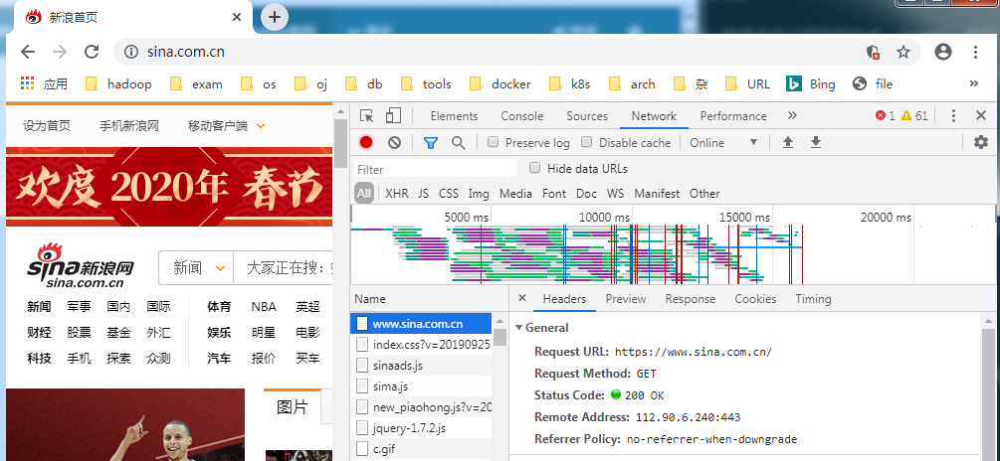

* Elements显示的是网页的结构
* Network显示的是浏览器和服务器的通信，我们点击"Network"的时候，确保第一个小红点亮着，代表chrome浏览器会记录所有浏览器和服务器之间的通信。


#### 查看HTTP的请求信息

基于上面已经打开"开发者模式"的情况下，我们切换到"Network"子菜单中，在浏览器地址栏中输入"www.sina.com.cn"。

这个时候，我们通过Network就可以查看到所有的，我们的浏览器作为客户端通过HTTP协议去请求www.sina.com.cn资源的时候，和sina的服务器之间的通信过程。

我们在Network中，定位到第一条记录，"Headers" -> "Request Headers" -> "view source"，意思就是**显示服务器返回的原始响应数据**。

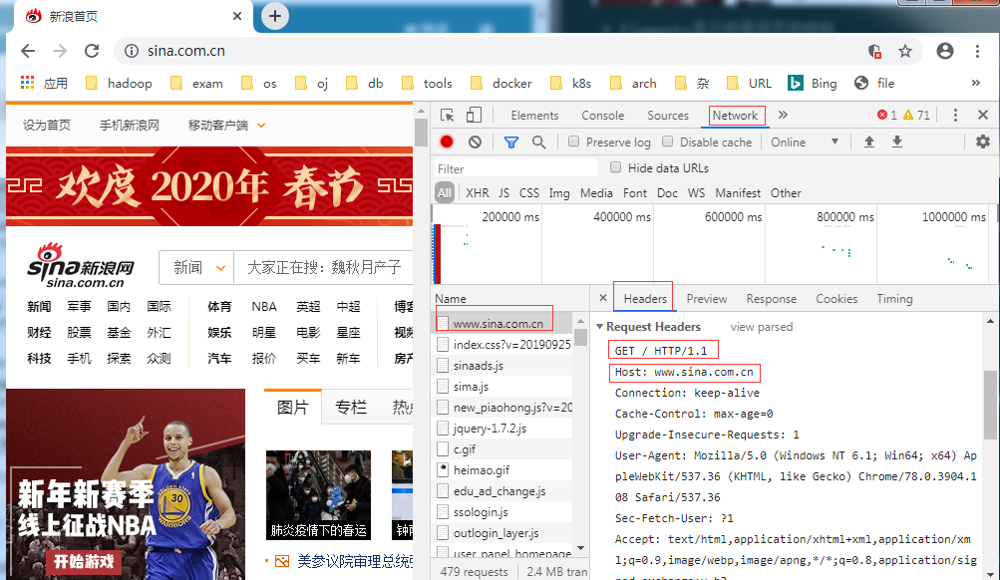

重要解析如下：

第一行：`GET / HTTP/1.1`

`GET`表示一个读取请求，将从服务器获取网页数据， `/`表示的是URL的路径，URL总是以`/`开头，`/`就表示首页。 `HTTP/1.1`表示的是采用HTTP协议版本是1.1。HTTP1.1版本和1.0版本的主要区别在于1.1版本允许多个HTTP请求复用一个TCP连接，以加快传输速度。

从第二行，开始都是类似于`xxx:yyyy`的形式

例如`Host: www.sina.com.cn`表示的是请求的域名是`www.sina.com.cn`


#### 查看HTTP的返回信息

HTTP响应分为Header和Body两部分(Body是可选项)。

在上面的同样的页面中，选择"Response Headers"，点击"view source"，同样来显示服务器返回的原始响应数据。

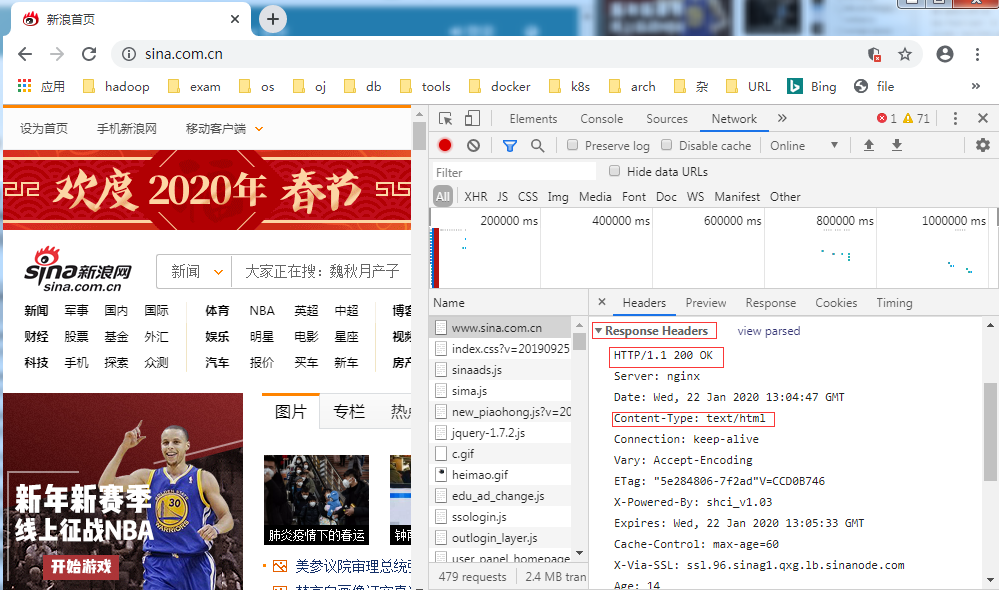

重要解析如下：

第一行中的`200 OK`

`200`表示一个成功的响应码，失败的响应码有`404 Not Found`:网页不存在，`500 Internal Server Error`：服务器内部出错，等等。

`Content-Type`行的内容：

`Content-Type`表示的是响应的内容，这里是`text/html`表示HTML页面。需要注意的是浏览器是根据`Content-Type`来判读响应的内容是网页还是图片，是视频还是音乐。反过来说，浏览器不是靠URL的连接来判断响应的内容，例如URL是`http://example.com/abc.jpg`，它也不一定是图片。

例如`Content-Type: text/html;charset=utf-8`表示响应类型是HTML文本，并且编码是`UTF-8`,`Content-Type: image/jpeg`表示响应类型是JPEG格式的图片。

如何查看HTTP响应的Body内容：

我们可以在上面的页面上，从"Headers"切换到"Response"来查看返回的body内容。或者直接在网页上右键"查看网页源码"

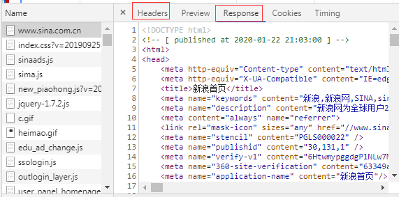


#### Content-Length的理解

我们在上面的"Response Headers"中可以发现有一个"Content-Length"的header头信息。这个信息很重要，下面主要从"Content-Length"的是什么？为什么(有什么作用)的角度来理解，这个header头参数。

`Content-Length`的header头告诉了浏览器报文中body主体的大小。单位是字节数。这个大小是包含了内容编码的，比如对文件进行了gzip压缩，Content-Length就是压缩后的大小(这点对我们编写服务器非常重要)。除非使用了分块编码，否则`Content-Length`首部就是带有实体主体的报文必须使用的。

使用`Content-Length`首部是为了能够检测出服务器崩溃而导致的**报文截尾**，并对**共享持久连接的多个报文进行正确分段**。

1) 检测截尾

HTTP的早期版本采用了关闭连接的办法来划定报文的结束。但是，没有`Content-Length`的话，客户端无法区分到底是报文结束时正常的关闭连接还是报文传输中由于服务器崩溃而导致的连接关闭。客户端要通过`Content-Length`来检测报文截尾。

报文截尾的问题对缓存代理服务来说尤为重要。如果缓存服务器收到截尾的报文却没有识别出截尾的话，它可能会存储不完整的内容并多次使用他来提供服务。**缓存代理服务器通常不会为没有显式`Content-Length`首部的HTTP主体做缓存**，以此来减少缓存已截尾报文的风险。

2) Content-Length与持久连接

Content-Length首部对于持久链接是必不可少的。如果响应通过持久连接传送，就可能有另一条HTTP响应紧随其后。客户端通过`Content-Length`首部就可以知道报文在何处结束，下一条报文从何处开始。因为连接是持久的，客户端无法依赖连接关闭来判断报文的结束。

3) 分块编码的介绍

有一种情况下，使用持久连接可以没有`Content-Length`首部，即采用分块编码(chunked encoding)时。在分块编码的情况下，数据是分为一系列的块来发送的，每一块都有大小说明。哪怕服务器在生成首部的时候不知道整个实体的大小(通常是因为实体是动态生成的)，仍然可以使用分块编码传输若干已知大小的块。


参考如下URL：

>https://my.oschina.net/xishuixixia/blog/93185


#### 浏览器读取到HTML源码做了什么

当浏览器读取到新浪首页的HTML源码后，它会解析HTML，显示页面，然后，根据HTML里面的各种链接，再发送HTTP请求给新浪服务器，拿到相应的图片、视频、Flash、JavaScript脚本、CSS等各种资源，最终显示出一个完整的页面。

所以，我们会在"Network"下面看到很多额外的HTTP请求。


### 总结一下

#### HTTP请求流程

1) 步骤1，浏览器首先向服务器发送HTTP请求，请求包括：

方法：`GET`还是`POST`，`GET`仅请求资源，而`POST`会附带用户数据；

路径：`/full/url/path`

域名：由Host头指定，`Host: www.sina.com.cn`

以及其他相关的Header；

如果是POST，那么请求还应该包括一个Body，包含用户数据。

2) 步骤2，服务器向浏览器返回HTTP响应，响应包括：

响应代码：`200`表示成功，`3XX`表示重定向，`4XX`表示客户端发送的请求有错误，`5XX`表示服务器端处理时发生了错误；

响应类型：由`Content-Type`指定，例如`Content-Type: text/html`表示响应类型是HTML文本，`Content-Type: image/jpeg`表示响应类型是JPEG格式的图片；

以及其他相关的Header；

通常服务器的HTTP响应会携带内容，也就是有一个Body，包含响应的内容，网页的HTML源码就在Body中。

3) 步骤3，如果浏览器还需要继续向服务器请求其他资源，比如图片，就再次发送HTTP请求，重复步骤1和步骤2。


#### HTTP协议对服务器开发的理解

Web采用的HTTP协议中采用了非常简单的请求-响应模式，从而大大简化了开发。**当我们编写一个页面的时候，我们只需要在HTTP响应中把HTML发送出去，不需要考虑如何附带图片、视频等**，浏览器如果需要请求图片和视频，它会发送另外一个HTTP请求，因此，**一个HTTP请求只处理一个资源**。

HTTP协议同时具备极强的扩展性，例如虽然浏览器请求的是`http://www.sina.com.cn/`的首页，但是新浪在HTML中可以链入其他服务器的资源，比如`<imgsrc="http://i1.sinaimg.cn/xxxxxxxx.png">`，从而将请求压力分散到各个服务器上。并且，一个站点可以链接到其他站点，无数个站点互相链接起来。


#### HTTP格式

每个HTTP请求和响应都遵循相同的格式，一个HTTP包含Header和Body两部分，其中Body是可选的。HTTP协议是一种文本协议，所以，它的格式也非常简单。

HTTP GET请求的格式，每个Header一行一个，换行符是`\r\n`。

``` http
GET /path HTTP/1.1
Header1: Value1
Header2: Value2
Header4: Value3
```


HTTP POST请求的格式，每个Header一行一个，换行符是`\r\n`；当遇到两个`\r\n`的时候，Header部分结束，后面的数据全部是Body。

``` http
POST /path HTTP/1.1
Header1: Value1
Header2: Value2
Header4: Value3

body data goes here ....
```

 

HTTP响应的格式，如果响应中包含了body，也是通过`\r\n\r\n`来分隔的。需要再次注意的是，body的数据类型由`Content-Type`头来确定，如果是网页，Body就是文本，如果是图片，Body就是图片的二进制数据。

当存在`Content-Encoding`时，Body数据是被压缩的，最常见的压缩方式是gzip，所以，看到`Content-Encoding: gzip`的时候，需要将Body数据先解压缩，才能得到真正的数据。压缩的目的在于减少Body的大小，加快网络传输。


### HTML简介

在这个章节，根据廖雪峰老师的文档，总结了HTML的基本格式，大致了解了HTML是定义了页面的内容；CSS是用来控制页面元素的样式；而JavaScript负责页面的交互逻辑。


#### HTML的理解

可以理解为网页就是HTML。在网页中不但包含了文字，还有图片、视频、Flash小游戏，有复杂的排版、动画效果，所以，HTML定义了一套语法规则，来告诉浏览器如何把一个丰富多彩的页面展示出来。

一个简单的HTML的格式内容大致如下：

``` html
<html>
<head>
  <title>Hello</title>
</head>
<body>
  <h1>Hello, world!</h1>
</body>
</html>
```

可以看出，HTML文档就是一系列的Tag组成的，最外层的Tag是`<html>`，还有`<head>...</heand>,<body>...</body>`(这里不要和HTTP的Header、Body搞混了)，由于HTML是富文档模型，所以，还有一系列的Tag用来表示链接、图片、表格、表单等等。


#### CSS简介

CSS是Cascading Style Sheets(层叠样式表)的简称，**CSS用来控制HTML里的所有元素如何展现**，比如，给标题元素加上一个样式，变成48号字体，灰色，带阴影：

``` html
<html>
<head>
  <title>Hello</title>
  <style>
    h1 {
      color: #333333;
      font-size: 48px;
      text-shadow: 3px 3px 3px #666666;
    }
  </style>
</head>
<body>
  <h1>Hello, world!</h1>
</body>
</html>
```


#### JavaScript简介

JavaScript，它和Java一点关系没有。**JavaScript是为了让HTML具有交互性而作为脚本语言**添加的，JavaScript既**可以内嵌到HTML中，也可以从外部链接到HTML**中。例如，我们希望当用户点击标题的时候把标题变成红色，就必须通过JavaScript来实现：

``` html
<html>
<head>
  <title>Hello</title>
  <style>
    h1 {
      color: #333333;
      font-size: 48px;
      text-shadow: 3px 3px 3px #666666;
    }
  </style>
  <script>
    function change() {
      document.getElementsByTagName('h1')[0].style.color = '#ff0000';
    }
  </script>
</head>
<body>
  <h1 onclick="change()">Hello, world!</h1>
</body>
</html>
```


### WSGI接口

#### 为什么需要WSGI

在描述为什么的时候，又有几个概念需要讲清楚：web访问基本流程/静态动态页面/WSGI能做些什么

在理解为什么需要WSGI的时候，先要有个web应用访问的基本流程：

1) 浏览器发送一个HTTP请求;

2) 服务器收到请求，生产一个HTML文档;

3) 服务器把HTML文档作为HTTP响应的Body发送给浏览器;

4) 浏览器收到HTTP响应，从HTTP Body取出HTML文档并显示。


静态页面和动态页面的区别(有两种分类，主要分类是第一种)：

第一种:

静态页面：根据页面语言脚本来区分，把纯HTML+JS脚本成为静态页面，这种页面内容基本固定；

动态页面：把ASP/PHP/JSP/Python 等程序语言写的页面称为动态页面，这种页面基本都会调用数据库，或者通过和用户交互产生变化。

第二种：

静态页面：根据页面的直观表示。把只有文本和静态图片的HTML页面称为静态页面。

动态页面：把包含GIF动画图片和Flash动画以及一些视频音乐等富媒体的HTML页面称为动态页面。


如果只是展示静态的HTML，确实不需要WSGI：

最简单的Web应用就是先把HTML用文件保存好，用一个现成的HTTP服务器软件(Apache/Nginx/Lighttpd)等这些常见的静态服务器，来接受用户请求，从文件中读取HTML。


如果要展示动态的HTML，确实需要WSGI的存在：

要动态生成HTML，那么缺少不了程序语言的存在，而单独靠类似Nginx这种Web服务器无法完成从接受请求到动态生成HTML，返回请求内容的需求。那么这个时候就需要Nginx和Python Web框架之间有个共同的通信协议，这个协议就是WSGI。

WSGI就是为了方便我们为了访问动态HTML的时候，做了接受客户端的HTTP请求，解析HTTP请求，然后发送返回HTTP响应，做了这些工作。而Python web框架只是关注于如何响应生产动态HTML文档就行了。有了这个，我们就可以专心用Python编写Web业务。


#### 什么是WSGI

WSGI，也就是Web Server Gateway Interface。是定义在web服务器和web应用的一种接口规范，只适用于Python语言来使用。


#### 基于WSGI来定义web app

在WSGI的接口规范中，它只要求Web开发者实现一个函数，就可以响应HTTP请求。例如下面的例子中：

``` python
def application(environ, start_reponse):
    start_response('200 OK', [('Content-Type', 'text/html')])
    return [b'<h1>Hello, web!</h1>']
```

上面的`application()`函数就是符合WSGI标准的一个HTTP处理函数，它接收两个参数：

* environ：一个包含所有HTTP请求信息的`dict`对象；
* start_response：一个发送HTTP响应的函数。(主要是响应码，和响应的header头信息，由web server自己实现的)

在`application()`函数中，调用了`start_response`方法，发送了HTTP响应的Header，注意的是Header只能发送一次，也就是只能调用一次`start_response()`函数。`start_response()`函数接收两个参数，一个是HTTP响应码，一个是一组`list`表示的HTTP Header，每个Header用一个包含两个`str`的`tuple`表示。

函数的返回值`b'<h1>Hello, web!</h1>'`，将作为HTTP响应的Body发送给浏览器。


#### 思考WSGI标准下的web app开发

有了WSGI，我们关心的就是如何从`environ`这个`dict`对象拿到HTTP请求信息，然后构造HTML，通过`start_response()`发送Header，最后返回Body。

整个`application()`函数本身没有涉及到任何解析HTTP的部分，也就是说，底层代码不需要我们自己编写，我们只负责在更高层次上考虑如何响应请求就可以了。

`application()`函数是由符合WSGI标准的web服务器来调用的。


#### 运行WSGI服务

这里使用python内置的一个wsgiref模块，来演示一下，如何整体运行一个wsgi的Web服务。

这里的代码分为hello.py和server.py两个部分，hello.py是我们根据WSGI的规范来书写的app应用函数，上面介绍过，这个app应用程序主要是根据请求的environ字典信息，返回header 头信息和body信息。

而server.py则是负责启动指定端口的wsgi服务器，在这个程序中会导入上面我们书写的app应用函数，作为HTTP的返回header和返回body。

示例1：

hello.py

``` python
def application(environ, start_response):
    start_response('200 OK', [('Content-Type', 'text/html')])
    return [b'<h1>Hello, web!</h1>']
```

server.py

``` python
# server.py
# 从wsgiref模块导入
from wsgiref.simple_server import make_server
# 导入我们自己编写的application函数
from hello import application

# 创建一个服务器，IP地址为空，端口是8000，处理函数是application:
httpd = make_server('', 8000, application)
print('Serving HTTP on port 8000 ...')
# 开始监听HTTP请求：
httpd.serve_forever()
```


示例2：

hello.py

``` python
def application(environ, start_response):
    start_response('200 OK', [('Content-Type', 'text/heml')])
    body = '<h1>Hello, %s!</h1>' % (environ['PATH_INFO'][1:] or 'web')
    return [body.encode('utf-8')]
# 这里environ['PATH_INFO'][1:]
# 是对environ字典集合中'PATH_INFO'这个key的引用
# 而[1:]是指'PATH_INFO'这个key对应的value还是一个序列
# 这个序列是从下标1往后到最后一个元素的所有元素
# 'PATH_INFO'是访问URL中端口后面的上下文信息
# 例如http://127.0.0.1:8000/text/tt 中
# /text/tt是'PATH_INFO'中[0:]
# [1:0]是text/tt
```

server.py

``` python
# server.py
# 从wsgiref模块导入
from wsgiref.simple_server import make_server
# 导入我们自己编写的application函数
from hello import application

# 创建一个服务器，IP地址为空，端口是8000，处理函数是application:
httpd = make_server('', 8000, application)
print('Serving HTTP on port 8000 ...')
# 开始监听HTTP请求：
httpd.serve_forever()
```


## 使用Web框架

这块的知识点不太好整理，还是从遵循为什么，是什么，怎么样的逻辑的来整理下。


### 为什么要有Web框架

一个Web框架的出现，肯定是为了解决我们现实的Web开发中遇到的痛点而存在的。那么我们根据上面学习的WSGT接口的app应用开发来看，遇到的痛点是什么呢？

静态网页(只有web服务器和静态HTML) -> WSGI层(动态网页，处理重复的接受请求，解析请求，回复请求等工作) -> Web框架(基于WSGI进一步抽象，专注于一个函数处理一个URL，而URL到函数映射交给Web框架来做)

WSGI接口的app开发痛点：

上面我们了解到了WSGI的框架的出现，是为了解决动态HTML的生产而出现的，换句话说，是为了解决开发动态网页，解决让WSGI层去处理重复的接收请求，解析请求，回复请求的繁琐的工作，而让app的应用专注于自己业务逻辑的开发而出现的。

如果HTTP请求，需要处理很多的不同的URL(带着不同的上下文)，每个URL可能还是不同的方法(GET/POST/PUT/DELETE)，如果还是用WSGI接口来处理的话，这种不同的URL和不同方法的代码，维护起来非常麻烦，这个时候我们基于WSGI层做一个进一步的抽象，用Web框架来处理这些复杂的映射。

查看下面的例子中(WSGI处理不同的URL，不同的方法)：

``` python
def application(environ, start_response):
    method = environ['REQUEST_METHOD']
    path = environ['PATH_INFO']
    if method=='GET' and path=='/':
        return handle_home(environ, start_response)
    if method=='POST' and path=='/signin':
        return handle_signin(environ, start_response)
    ...
```

这样写下去的代码是无法维护的。原因在于WSGI提供的接口虽然比HTTP接口高级了不少，但是和Web APP的处理函数比(处理函数由于上下文和方法的不同，比较复杂)，还是比较低级，我们需要在WSGI接口上能够进一步的抽象，让我们专注于用一个函数处理一个URL，至于URL到函数的映射，就交给了Web框架来处理了。


### 什么是Web框架

简单来说就是对WSGI接口上的进一步抽象，维护代码层面上URL到函数的映射，这样我们写代码的时候就能专注于用一个函数处理一个URL。


### 如何使用Web框架

这里以Flask这个Web框架来介绍下如何开发一个web应用程序。


#### 准备Flask环境

可以使用pip来安装flask包

``` shell
$ pip install flask
```


也可以通过conda或者pycharm来创建一个flask的虚拟环境。


#### 规划一个web应用

需要编写一个app.py，处理3个URL，分别是：

`GET /`：首页，返回`HOME`;

`GET /signin`：登录页，显示登录表单；

`POST /signin`：处理登录表单，显示登录结果。

同一个URL`/signin`分别有GET和POST两种请求，映射到两个处理函数中。

Flask是通过Python的装饰器在内部自动地把URL和函数关联起来，所以，书写的代码如下：

``` python
from flask import Flask
from flask import request

app = Flask(__name__)


@app.route('/', methods=['GET', 'POST'])
def hello_world():
    return 'Hello World!'

@app.route('/signin', methods=['GET'])
def signin_form():
    return ''' <form action="/signin" method="post">
               <p><input name="username"></p>
               <p><input name="password" type="password"></p>
               <p><button type="submit">Sign In</button></p>
               </form>'''

@app.route('/signin', methods=['POST'])
def singin():
    # 需要从request对象的form方法来读取表单内容：
    if request.form['username']=='admin' and request.form['password']=='password':
        return '<h3>Hello, admin!</h3>'
    return '<h3>Bad username or password.</h3>'


if __name__ == '__main__':
    app.run()
```


运行这个`app.py`，Flask自带的Server在端口5000上监听：

当我们在浏览器中输入`http://127.0.0.1:5000/signin`，会显示登录表单：

输入用户名`admin`和密码`password`，登录成功；

输入其他错误的用户名和口令，则登录失败；


## 使用模板

按照之前的逻辑，还是先阐述下为什么，是什么，怎么样的。


### 为什么需要模板

根据我们的经验，模板的出现，也是为了解决Web开发中出现的一些痛点而存在的。

我们从WSGI层中应用函数的编写，到现在使用Web框架，解决了不同的URL，不同的方法的映射的问题。

但是我们在实际的Web app的开发中，不仅仅是单纯的处理逻辑，还需要展示给用户页面。我们在函数中返回一个包含HTML的字符串，简单的页面还是可以的，但是如果对于大量的HTML文档信息，我们是无法单纯的依靠Python的字符串中正确的书写出来的。

Web APP最复杂的部分就在HTML页面。HTML不仅要正确，还要通过CSS美化，再加上复杂的JavaScript脚本来实现各种交互和动画效果。所以手动书写生成HTML页面的难度很大。

为了更快，更方便的生成HTML页面，而且还为了更大限度的重用HTML页面，这个时候模板的技术出现了。


### 什么是模板技术

使用模板，我们需要预先准备一个HTML文档，这个HTML文档不是普通的HTML，而是嵌入了一些变量和指令，然后，根据我们传入的数据，替换后，得到最终的HTML，发送给用户。

这也就是我们所说的MVC：Model - View - Controller，"模型-视图-控制器"。通过MVC，我们在Python代码中处理M：Model和C：Controller，而V：View是通过模板来处理的，这样，我们就可以把Python代码和HTML代码最大限度地分离了。

使用模板的另外一大好处在于，模板改起来很方便，而且，改完保存后，刷新浏览器就能看到最新的效果，这对于调试HTML、CSS和JavaScript的前端工程是太重要了。

控制器：

在Python中处理URL的函数就是C，Controller，Controller负责业务逻辑，比如检查用户名是否存在，取出用户信息等等；

视图：

也就是包含了变量的模板HTML文件，就是View，视图。View负责显示逻辑，通过简单地替换一些变量，View最终输出的就是用户看到的HTML。

模型：

在MVC中的Mode，模型。是用来传给View值的，用来替换View中变量。也就是说从Model中取出相应的数据，去替换View中的变量。一般情况下，是我们请求URL中一个上下文信息，或者是相应的head信息，或body信息中的内容。是存在一个dict字典中的。

处理逻辑如下：


### 如何使用模板

#### 安装jinja2

Flask默认支持的模板是jinja2，需要先安装jinja2

``` python
$ pip install jinja2
```


#### 准备模板的HTML

所有的模板的HTML文件都需要放在正确的`templates`目录下，`templates`和`app.py`在同级目录下：

home.html用来显示首页的模板：

``` html
<html>
<head>
  <title>Home</title>
</head>
<body>
  <h1 style="font-style:italic">Home</h1>
</body>
</html>
```

form.html用来显示登录表单的模板：

``` html
<html>
<head>
  <title>Please Sign In</title>
</head>
<body>
  
  <p style="color:red">{{ message }}</p>
  
  <form action="/signin" method="post">
    <legend>Please sign in:</legend>
    <p><input name="username" placeholder="Username" value="{{ username }}"></p>
    <p><input name="password" placeholder="Password" type="password"></p>
    <p><button type="submit">Sign In</button></p>
  </form>
</body>
</html>
```

signin-ok.html用来登录成功的模板：

``` html
<html>
<head>
  <title>Welcome, {{ username }}</title>
</head>
<body>
  <p>Welcome, {{ username }}!</p>
</body>
</html>
```

登录失败的模板，我们用form.html中加入一点条件判断，把这个html重用为登录失败的模板。


### Jinja2模板

在jinja2模板中，我们用类似```{{name}}```表示一个需要替换的变量。很多时候，还需要循环、条件判断等指令语句，在Jinja2中，用``````表示指令。

比如下面的循环输出页码：

``` html

    <a href="/page/{{i}}">{{i}}</a>

```

如果`page_list`是一个list:`[1,2,3,4,5]`,上面的模板将输出5个超链接。


除了Jinja2，常见的模板还有：

Mako: 用`<%...%>`和`${xxx}`的一个模板；

Cheetah：也是用`<%...%>`和`${xxx}`的一个模板；

Django：Django是一站式框架，内置一个用`<%...%>`和`${xxx}`的一个模板。


## 如何理解Nginx/WSGI/Flash之间的关系

### 概述

这里主要描述的是Nginx，WSGI(或者uWSGI)，Flask(或者Django)，这几者之间的关系。

Nginx代表的是Web服务器层，WSGI代表的是WSGI层，Flask代表的是web框架层。

总体来说，客户端从发送一个HTTP请求到Flask处理请求，分别经过了web服务器层，WSGI层，web框架层，这三个层次。不同的层次其作用也不同，下面简要介绍各层的作用。

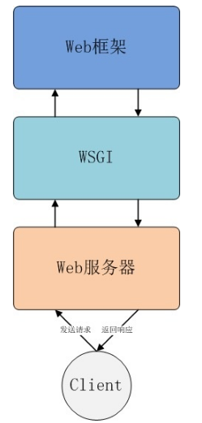


### Web服务器层

对应的是我们的Nginx，对于传统的客户端-服务器架构，其请求的处理过程是，客户端向服务器发送请求，服务器接收请求并处理请求，然后给客户端返回响应。在这个过程中，服务器的作用是：

1) 接收请求

2) 处理请求

3) 返回响应

web服务器是一类特殊的服务器，其作用主要是接收HTTP请求并返回响应。常见的web服务器有nginx，Apache，IIS等。


### Web框架层

Web框架的作用主要是方便我们开发web应用程序，HTTP请求的动态数据就是由web框架层来提供的。常见的web框架有Flask，Django等，如下的例子中，以Flask为例，展示了Web框架的作用：

``` python
from flask import Flask
app = Flask(__name__)

@app.route('/hello')
def hello_world():
    return 'Hello World!'

if __name__ == '__main__':
    app.run(host='0.0.0.0', port=8080)
```

以上简单的几行代码，就创建了一个web应用程序对象app。app监听机器所有ip的8080端口，接受用户的请求连接。

我们知道，HTTP协议使用URL来定位资源，上面的程序会将路径`/hello`的请求交由`hello_world()`方法来处理，`hello_world()`方法返回'Hello World!'字符串。

对于web框架的使用者来说，他们并不关心如何接收HTTP请求，也不关系如何将请求路由到具体方法处理并将响应结果返回给用户。Web框架的使用者在大部分情况下，只需要关系如何实现业务的逻辑即可。


### WSGI层

WSGI不是服务器，也不是用于与程序交互的API，更不是真实的代码，**WSGI只是一种接口**，它**只适用于Python语言**，其全称为Web Server Gateway Interface，**定义了web服务器和web应用之间的接口规范**。

也就是说，只要web服务器和web应用都遵守WSGI协议，那么web服务器和web应用就可以随意的组合。

下面的用例中展示的就是web服务器和web应用基于WSGI的协议，组合在了一起。

``` python
def application(env, start_response):
    start_response('200 OK', [('Content-Type', 'text/html')])
    return [b"Hello World"]
```

这个application函数是web应用框架中定义的，这个函数有两个入参，一个参数是`env`，是一个字典，包含了类似于HTTP_HOST，HOST_USER_AGENT等从web服务器(nginx)中传入的HTTP协议中的request headers；

另外一个参数是`start_response`，这是一个由web服务器来实现的函数，从start这个字眼可以看出，是正式返回response body体之前的内容，这个方法`start_reponse`，接受两个参数，分别是`status`,`response_headers`，这个`status`，是http返回中的状态码信息，而`response_headers`，则是http返回中的头信息。`response_headers`是一组`list`表示的HTTP Header，所以外面用了中括号，里面的每个Header用一个包含两个`str`的`tuple`元组来表示。这两个入参，都是我们Web应用要自己实现来传入的。

`application`函数的作用是，设置http响应的状态码和Content-Type等头部信息，并返回响应的具体结果。

PS：上述代码就是一个完整的WSGI的应用，当一个支持WSGI的web服务器接收到客户端的请求后，便会调用这个`application`方法。WSGI层并不关心`env`，`start_response`这两个变量是如何实现的，就像在`application`里面做的，直接使用者两个变量即可。


### 相关名词解释

* uwsgi

  同wsgi一样也是一种协议，uWSGI服务器就是使用了uwsgi协议

* uWSGI

  实现了uwsgi和WSGI两种协议的web服务器。注意uWSGI本质上也是一种web服务器，处于上面描述的三层结构中的web服务器层。

* CGI

  通用网关接口，并不限于Python语言，定义了web服务器是如何向客户端提供动态的内容。例如，规定了客户端如何将参数传递给web服务器，web服务器如何将参数传递给web应用，web应用如何将它的输出如何发送给客户端，等等。

  生产环境下的web应用都不实用CGI了，CGI进程(类似Python解释器)针对每个请求创建，用完就抛弃，效率低下。WSGI正是为了替代CGI而出现的。


#### 总结

这里总结下WSGI在web服务器和web框架之间的作用：WSGI就像一条纽带，将web服务器与web框架连接起来。

以下面的三者之间的对话来理解：

Nginx：Hey，WSGI，我刚收到了一个请求，我需要你作些准备，然后由Flask来处理这个请求。
WSGI：OK，Nginx。我会设置好环境变量，然后将这个请求传递给Flask处理。
Flask：Thanks WSGI！给我一些时间，我将会把请求的响应返回给你。
WSGI：Alright，那我等你。
Flask：Okay，我完成了，这里是请求的响应结果，请求把结果传递给Nginx。
WSGI：Good job！Nginx，这里是响应结果，已经按照要求给你传递回来了。
Nginx：Cool，我收到了，我把响应结果返回给客户端。大家合作愉快！


### 参考信息

参考如下的URL信息

> https://blog.csdn.net/lihao21/article/details/52304119


## 如何理解import和from import的区别

在python中单单import的话是引入整个包，而from ... import ...是引入了某个包中某个函数或某个类。例子如下：

``` python
# 引入了整个datetime包
import datetime
print(datetime.datetime.now())

# 从datetime包中引入datetime这个类
from datetime import datetime
print(datetime.now())
```


## 定义函数一定要有形参，一定要有返回值吗？

细分是三个问题：函数定义一定要有形参吗；函数定义中一定要有返回值吗；函数调用的时候一定要有实参吗


## 在Python中点号`.`有哪些用法

import包中

调用类中某个方法的时候


## 如何写Python函数注释

需要注意的是，在书写的注释中，不管哪种形式写的，**python对这些注释信息，不做检查，不做检查，不做验证！什么也不做！**

在python函数中，写注释大体有如下两种方法：


### 方法一：使用`"""xxxx"""`的格式

也就是说直接在函数内部，用三个双引号括起来的部分就是需要注释的内容。

类似如下的例子，可以用help(函数名称) 的方法来查看注释信息。

``` python
def square_sum(a,b):
    """ 
    return the square
    sum of two arguments
    """
    a = a**2
    b = b**2
    c = a + b
    return c

help(square_sum)
```


### 谷歌风格的注释

``` python
def foo():
    """ 
    this is a group style docs.
    
    Parameters:
        param1 - this is the first param
        param2 - this is a second param
    
    Returns:
        this is a description of what is returned
    
    Raises:
        KeyError - raises an exception
    """

help(foo)
```


### Rest风格

``` python
def chuck():
    """
    This is a Rest Style.

    :param param1: this is the first param
    :param param1: this is a second param
    :returns: this is a description of what is returned
    :raises keyError: raises an exception
    """

help(chuck)
```


### 方法二：定义参数的时候加入注释

通常会在定义的函数的参数后面加入":"冒号，写上一个建议的参数的数据类型。如果很长可以加上单引号。

这些注释信息都是函数的元信息，保存在f.\___annotations__字典中。

需要注意的是，python对注释信息和f.\__annotations__的一致性，不做检查，不做强制，不做验证！什么都不做。

定义完参数后用`->`一个参数类型，来表示建议返回的值的类型。

``` python
def f(text:str, max_len:'int>0'=80) ->str:
    """这个是函数的说明文档，help的时候会显示"""
    return True

"""
函数声明中，text是参数名称，：冒号的str是参数的注释
如果参数有默认值，还要加上注释，那么就在默认值的"="等号前写上
如'int>0'就是对默认值max_len=80的注释
->str是函数返回值的注释
"""
```


## 如何写Python类的注释


## 如何利用Pyecharts库来画图表

### 安装pyecharts包

``` python
$ pip install pyecharts
```


### 折线图的示例

下面的例子中，有两条折线，定义了主标题，副标题，加入了工具栏，加入了x轴方向的滚动轴。

``` python
import pyecharts.options as opts
from pyecharts.faker import  Faker
from pyecharts.charts import Line
def line_base() -> Line:
    c = (
        Line()
        .add_xaxis(Faker.choose())
        .add_yaxis("商家A", Faker.values())
        .add_yaxis("商家B", Faker.values())
        .set_global_opts(
            title_opts={
                "text": "line的测试",
                "subtext": "副标题",
                },
            toolbox_opts=opts.ToolboxOpts(),
            # legend_opts=opts.LegendOpts(is_show=False),
            datazoom_opts=opts.DataZoomOpts(),
        )
    )
    return c

line_base().render()
```


最终显示的样式如下：

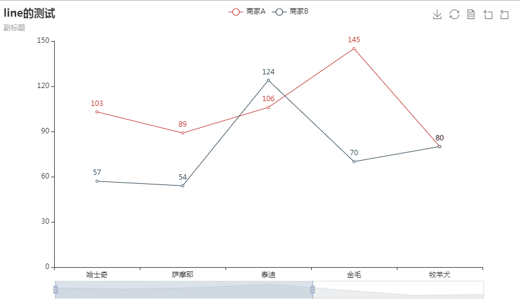


### 柱形图示例

下面的图示中，有两种类型的柱形图。加入了工具栏，X轴方向的滚动轴，主副标题。

``` python
from pyecharts.faker import Faker
from pyecharts import options as opts
from pyecharts.charts import Bar
from pyecharts.commons.utils import JsCode
def bar_base() -> Bar:
    c = (
        Bar()
        .add_xaxis(Faker.choose())
        .add_yaxis("商家A", Faker.values())
        .add_yaxis("商家B", Faker.values())
        .set_global_opts(
            title_opts={
                "text": "bar的测试",
                "subtext": "副标题",
                },
            toolbox_opts=opts.ToolboxOpts(),
            # legend_opts=opts.LegendOpts(is_show=False),
            datazoom_opts=opts.DataZoomOpts(),
        )
    )
    return c

bar_base().render()
```


最终显示的图示如下：


## conda channel的镜像设置

### 显示所有channel

输入`conda config --show`能够显示出所有的config的信息

输入`conda config --show channels` 显示的是所有channels信息


### 移除镜像源

这里可以移除掉上面 显示出来的镜像源的信息。

`conda config --remove channels https://mirrors.tuna.tsinghua.edu.cn/anaconda/cloud/conda-forge/`


### 添加可用的清华镜像源

``` 
conda config --add channels https://mirrors.tuna.tsinghua.edu.cn/anaconda/pkgs/free/
conda config --add channels https://mirrors.tuna.tsinghua.edu.cn/anaconda/pkgs/main/
conda config --set show_channel_urls yes
```

其中`conda config --set show_channel_urls yes` 意思是从channel中安装包时显示channel的url，这样就可以知道包的安装来源了。


### 关闭安装过程中默认yes

默认使用conda install xxx的时候，是不需要输入yes or  no的，conda直接跳过了，默认是yes，如果需要自己加以判断，如下设置。

`conda config --set always_yes false`


### 一些其他的conda指令

`conda install <包名>` 安装指定包
`conda remove <包名>` 移除指定包
`conda update <包名>` 更新指定包


## vscode配置 python

https://zhuanlan.zhihu.com/p/88458083


https://www.jianshu.com/p/ef1ae10ba950


https://blog.csdn.net/joson1234567890/article/details/105134711


https://blog.csdn.net/qq_38875402/article/details/107141964


## python安装psycopg2包

### 环境准备

由于python在centos7下连接postgresql数据库报错:

`python SCRAM authentication requires libpq version 10 or above`

大概意思是libpg的版本低了，但使用 yum install postgresql-devel 只能更新到 9.2.24版本

需要安装高版本的postgresql相关的rpm 包

1. 添加pg包的源

   `rpm -Uvh https://download.postgresql.org/pub/repos/yum/reporpms/EL-7-x86_64/pgdg-redhat-repo-latest.noarch.rpm`

2. 下载pg包，准备离线安装

   `yumdownloader --destdir ./ --resolve postgresql10 postgresql10-dev postgresql10-libs`

3. 生产环境中安装RPM包

   `rpm -ivh postgresql10*.rpm`

4. 查找pg_config的位置

   `find / -type f -name "pg_config"`

5. 先删除/usr/bin下的pg_config

6. 建立软链接

   `ln -s  /usr/pgsql-10/bin/pg_config pg_config `

7. 查看pg_config版本

   ```
   #pg_config --version
   
   PostgreSQL 10.18
   ```

   

参考URL：

[下载rpm包的两种方法](https://blog.csdn.net/u011431128/article/details/81272530)

[python SCRAM authentication requires libpq version 10 or above](http://www.heycode.com/a15819.html)


### 源码安装psycopg2

1. 下载psycopg2

   `pip download -d /usr/local/download/pip/  psycopg2`

   

2. 离线安装

   ```
   tar -xzvf psycopg2-2.9.3.tar.gz
   cd psycopg2-2.9.3
   python setup.py build
   python setup.py install
   ```

   

3. 测试psycopg2

   ```
   python
   > import psycopg2
   ```


[离线安装psycopg2](https://blog.csdn.net/Ryxiong728/article/details/104988252)
