# 《数据结构与算法之美》读书笔记


从今天开始要开始学习王争老师的《数据结构与算法之美》，重要的坚持到底，深入的思考，为学习数据结构打下坚实的基础。


第一遍先听录音，第二遍重点词汇和语句的摘抄，第三遍查看别人的重点标记，第四遍查看留言。


## 前序

今天主要学习的第一篇，入门篇，主要描述的学习数据结构与算法的重要意义。

1. 基础知识就像是一座大楼的地基，它决定了我们的技术高度。而要想快速做出点事情，前提前脚一定是基础能力过硬，“内功”要到位。
2. 为了由浅入深地学习，把专栏分成四个递进的模块。
   * 第一部分是入门篇，通过这一模块，能掌握时间、空间复杂度的概念，大O表示法的由来，各种复杂度分析技巧，以及最好、最坏、平均、均摊复杂度分析方法。
   * 第二部分是基础篇，是学习的重点。介绍了最基础、最常用的数据结构和算法。
   * 第三部分是高级篇，主要会讲解一些不是那么常用的数据结构和算法。
   * 第四部分是实战篇，主要围绕数据结构和算法在具体软件实践中的应用来讲的。
3. 人生道路上，我们会遇到很多的坎。跨过去，你就可以成长，跨不过去就是困难和停滞。而在后面很长的一段时间里，你都需要为这个困难买单。


## D21(2020/10/07)

今天是学习的是《数据结构与算法之美》的准备课，“如何抓住重点，系统高效地学习数据结构与算法”；


## 如何抓住重点，系统高效地学习数据结构与算法

### 什么是数据结构？什么是算法？

从广义上来讲，数据结构就是指一组数据的存储结构。算法就是操作数据的一组方法。

从狭义上来讲，也就是我们专栏要讲的，是指某些著名的数据结构和算法，比如队列、栈、堆、二分查找、动态规划等。这些经典的数据结构和算法，都是前人从很多实际操作场景中抽象出来的，可以高效的解决很多实际开发问题。


#### 数据结构与算法的关系

数据结构与算法是相辅相成的。数据结构是为算法服务的，算法要作用在特定的数据结构之上。因此，我们无法孤立数据结构来讲算法，也无法孤立算法来讲数据结构。

数据结构是静态的，它只是组织数据的一种方式。如果不在它的基础上操作、构建算法，孤立存在的数据结构是没用的。

例如，因为数组具有随机访问的特点，常用的二分查找算法需要用数组来存储数据。但如果我们选择链表这种数据结构，二分查找算法就无法工作了，因为链表并不支持随机访问。


#### 学习的重点在什么地方？

梳理学习的重点，就是要了解应该先学什么，后学什么。

要想学习数据结构与算法，首先要掌握一个数据结构与算法中最重要的概念 ---- 复杂度分析。

数据结构和算法解决的是如何更省、更快地存储和处理数据的问题，因此，我们就需要一个考量效率和资源消耗的方法，这就是复杂度分析方法。

如果我们只是掌握了数据结构与算法的特点、用法，但是没有学会复杂度分析，那就相当于只知道操作口诀，而没有掌握心法。只有把心法了然于胸，才能做到无招胜有招。

所以，结合我自己的学习心得，还有这些年的面试、开发经验，总结**了20个最常用的、最基础的数据结构与算法**，不管是应付面试还是工作需要，只要集中精力逐一攻克这20个知识点就足够了。

这里面有10个数据结构：数组、链表、栈、队列、散列表、二叉树、堆、跳表、图、Trie树；10个算法：递归、排序、二分查找、搜索、哈希算法、贪心算法、分治算法、回溯算法、动态规划、字符串匹配算法。

在学习的过程中，要**学习它的"来历" "自身的特点" "适合解决的问题"以及"实际的应用场景"**。


### 一些可以让你事半功倍的学习技巧

1. 边学边练，适度刷题

2. 多问、多思考、多互动

   可以多在留言区写下自己的疑问、思考和总结，也可以经常看看别人的留言，和他们进行互动。

3. 打怪升级学习法

   学习的过程中，我们碰到最大的问题就是，坚持不下来。

   在枯燥的学习过程中，也可以给自己设立一个切实可行的目标，就像打怪升级一样。

   比如，针对这个专栏，可以设立这样一个目标：每节课后的思考题都认真思考，并且回复到留言区。当你看到很多人给你点赞之后，你就会为了每次都能发一个漂亮的留言，而更加认真地学习。

   比如，每节课后都写一篇学习笔记或学习心得；或者你还可以每节课都找下讲的不对的、不合理的地方。

4. 知识需要沉淀，不要想试图一下子掌握所有

   学习知识的过程是反复迭代、不断沉淀的过程。

   如果碰到"拦路虎"，你可以尽情在留言区问我，也可以先沉淀一下，过几天再重新学一遍。所谓，书读百遍其义自见。


## 复杂度分析(上)：如何分析、统计算法的执行效率和资源消耗？


### 为什么需要复杂度分析？

事后统计法：

通过统计、监控，就能得到算法执行的时间和占用的内存大小。为什么还要做时间、空间复杂度分析呢？这种分析方法能比我实实在在跑一遍得到的数据更准确吗？

上面的评估算法执行效率的方法是正确的。可以称为事后统计法，但是这种统计方法有非常大的局限性。


1. 测试结果非常依赖测试环境

   测试结果，依赖于服务器的环境的好坏。

2. 测试结果受数据规模的影响很大

   数据是否有序，数据规模的大小，都可能会对测试结果产生影响，可能无法真实地反映算法的性能。

   我们需要一个不用具体的测试数据来测试，就可以粗略地估计算法的执行效率的方法。


### 大O复杂度表示法

算法的执行效率，粗略地讲，就是算法代码执行的时间。

下面的一行代码，就是求1,2,3 ... n的累加和。

``` 
int cal(int n) {
	int sum = 0;
	int i = 1;
	for(; i<=n; ++i) {
		sum  = sum + i;
	}
	return sum;
}
```

从CPU的角度来看，这段代码的每一行都执行着类似的操作：**读数据-运算-写数据**。尽管每行代码对应的CPU执行的个数、执行的时间都不一样，但是，我们这里只是粗略估计，所以可以**假设每行代码执行的时间都一样，为unit_time**。在这个假设的基础之上，这段代码的总执行时间是多少呢？

第1行`int cal(int n) {`是代码程序的入口，如果要算是代码的执行时间的话，那就是1次(这里我们考虑的是单次调用的场景下的分析)。

第2行`int sum=0;`和第3行`int i=1;`代码分别需要1个unit_time的执行时间，第4、5行都运行了n遍(分别i从1到n)，所以需要2n* unit_time的执行时间，所以这段代码总的执行时间就是(2n+2)*unit_time。可以看出来，**所有代码的执行时间T(n)与每行代码的执行次数成正比**。


#### 示例分析2

按照上面分析的思路，来看下面的这段代码。

``` 
int cal(int n) {
	int sum = 0;
	int i = 1;
	int j = 1;
	for (; i<=n; ++i) {
		j = 1;
		for (; j <=n; ++j) {
			sum  = sum + i*j;
		}
	}
}
```

我们依旧假设每个语句的执行时间是unit_time。那么这段代码的总执行时间T(n)是多少呢？

第2、3、4行代码，每行都需要1个unit_time的执行时间，第5、6行代码循环执行了n遍，需要2n* unit_time的执行时间，第7、8行代码循环执行了$n^2$ 遍，所以需要2$n^2$ * unit_time的执行时间。所以，整段代码总的执行时间T(n) = (2$n^2$ + 2n +3) * unit_time.


### 大O表示法

尽管我们不知道unit_time的具体值，但是通过这两段的代码执行时间的推导过程，我们可以得到一个非常重要的规律，那就是，**所有代码的执行时间T(n)与每行代码的执行次数n成正比**。

我们可以把这个规律总结成一个公式。

`T(n) = O(f(n))`

其中，T(n)表示代码执行的时间；n表示数据规模的大小；f(n)表示每行代码执行的次数总和。公式中的O，表示代码的执行时间T(n)与f(n)表达式成正比。

所以，第一个列子中的T(n) = O(2n+2)，第二个例子中的T(n) = O(2$n^2$ + 2n +3)。这就是**大O时间复杂度表示法**。大O时间复杂度实际上并不具体表示代码真正的执行时间，而是表示**代码执行时间随数据规模增长的变化趋势**，所以，也叫做**渐进时间复杂度**，简称为时间复杂度。

当n很大时，可以把它想象成10000、100000。而公式中的低阶、常量、系数三部分并不左右增长趋势，所以都可以忽略。我们只需要记录一个最大量级就可以了，如果用大O表示法刚讲的那两段代码的时间复杂度，就可以记为：T(n) = O(n); T(n) = O($n^2$) .

分析代码的执行时间，假设每行的执行时间一样。--> 每行代码的执行次数 --> 用大O来表示执行次数和时间时间的正比关系 --> 去除低阶、常量、系数，真正成为大O表示法 。


### 时间复杂度分析

前面介绍了大O时间复杂度的由来和表示方法。

现在来看下，如何分析一段代码的时间复杂度？这里有三个比较实用的方法可以分享。


1. 只关注循环执行次数最多的一段代码

   刚才所说的，大O这种复杂度表示方法只是表示一种变化趋势。我们通常会忽略掉公式中的常量、低阶、系数，只需要记录一个最大阶的量级就可以了。

   所以，**我们在分析一个算法、一段代码的时间复杂度的时候，也只关注循环次数最多的那一段代码就可以了**。这段核心代码执行次数的n的量级，就是整段要分析代码的时间复杂度。

   ``` 
   int cal(int n) {
   	int sum = 0;
   	int i = 1;
   	for(; i<=n; ++i) {
   		sum  = sum + i;
   	}
   	return sum;
   }
   ```

   其中第2、3行代码都是常量级的执行时间，与n的大小无关，所以对于复杂度并没有影响。循环执行次数最多的是第4、5行代码，所以这块代码要重点分析。这两行代码被执行了n次，所以总的时间复杂度就是O(n)。

2. 加法法则：总复杂度等于量级最大的那段代码的复杂度

   ``` 
   int cal(int n) {
   	int sum_1 = 0;
   	int p = 1;
   	for (; p<100; ++p) {
   		sum_1 = sum_1 + p;
   	}
   	int sum_2 =0;
   	int q = 1;
   	for (; q<n; ++q) {
   		sum_2 = sum_2 + q;
   	}
   	int sum_3 = 0;
   	int i =1;
   	int j =1;
   	for (; i<=n; ++i) {
   		j = 1;
   		for (; j<=n; ++j) {
   			sum_3 = sum_3 + i*j;
   		}
   	}
   	return sum_1 + sum_2 + sum_3;
   }
   ```

   这个代码分为三个部分，分别是求sum_1、sum_2、sum_3。我们可以分别分析每一部分的时间复杂度，然后把它们放在一块，再去一个量级最大的作为整段代码的复杂度。

   第一段代码求sum_1，for循环中执行了100次，所以是一个常量的执行时间，跟n的规模无关。

   需要强调的是，即便这段代码循环了10000次、100000次，只要是一个已知的数，跟n无关，照样也是常数级的执行时间。当n无限大的时候，就可以忽略。尽管对代码的执行时间会有很大影响，但是回到时间复杂度的概念来说，它表示的是一个算法执行效率于数据规模增长的变化趋势，所以不管常量的执行时间多大，我们都可以忽略掉。因为它本身对增长趋势并没有影响。

   那第二段代码和第三段代码的时间复杂度是多少呢？答案是O(n)和O($n^2$)。

   综合这三段代码的时间复杂度，我们取其中最大的量级。所以，整段代码的时间复杂度就是O($n^2$) . 也就是说：**总的时间复杂度就等于量级最大的那段代码的时间复杂度**。

   如果T1(n) = O(f(n))，T2(n) = O(g(n))；那么T(n) = T1(n) + T2(n) = max(O(f(n)), O(g(n))) = O(max(f(n), g(n))).

3. 乘法法则：嵌套代码的复杂度等于嵌套内外代码复杂度的乘积

   对应上面的加法法则，这里还有一个乘法法则。也就是如果T1(n)=O(f(n))，T2(n)=O(g(n)); 那么T(n)=T1(n)*T2(n) = O(f(n))\*O(g(n)) = O(f(n)\*g(n))

   也就是说，假设T1(n) = O(n)，T2(n) = O($n^2$), 则T1(n)*T2(n) = O($n^3$)。落实到具体的代码上，我们可以把乘法法则看成是**嵌套循环**。

   ``` 
   int cal(int n) {
   	int ret = 0;
   	int i = 1;
   	for (; i<n; ++i) {
   		ret = ret + f(i);
   	}
   }
   
   int f(int n) {
   	int sum = 0;
   	int i = 1;
   	for (; i<n; ++i) {
   		sum = sum +i;
   	}
   	return sum;
   }
   ```

   我们单独看cal()函数。假设f()只是一个普通的操作，那第4~6行的时间复杂度就是，T1(n) = O(n)。但f()函数本身不是一个简单的操作，它的时间复杂度是T2(n) = O(n)，所以整个cal()函数的时间复杂度就是，T(n) =T1(n) * T2(n) = O(n*n) =O($n^2$) .

   上面的三种复杂度分析技巧，不需要刻意记忆。实际上，复杂度分析这个东西关键在于"熟练"。只要多看案例，多分析，就能做到"无招胜有招"。


### 几种常见时间复杂度案例分析

下面的图示，展示的是常见的时间复杂度的各个量级，按照数量级递增。


对于上面罗列的复杂度量级，我们可以粗略地分为两类，**多项式量级**和**非多项式量级**。其中，非多项式量级只有两个：O($2^n$) 和O(n!)

我们把时间复杂度为非多项式量级的算法问题叫做NP(非确定多项式)问题。

当数据规模n越来越大时，非多项式量级算法的执行时间会急剧增加，求解问题的执行时间会无限增长。所以，非多项式时间复杂度的算法其实是非常低效的算法。所以，关于NP的时间复杂度就不展开讲了。下面主要讨论的是常见的**多项式时间复杂度**。

1. O(1)

   首先必须明确一个概念，O(1)只是常量级时间复杂度的一种表示方法，并不是指只执行了一行代码。

   比如下面的这段代码中，即便有3行，它的时间复杂度也是O(1)，而不是O(3)。

   ``` 
   int i = 8;
   int j = 6;
   int sum = i + j;
   ```

   需要了解的是，只要代码的执行时间不随n的增大而增长，这样代码的时间复杂度我们都记住O(1)。或者说，**一般情况下，只要算法中不存在循环语句、递归语句，即使有成千上万行的代码，其时间复杂度也是O(1)**。

2. O(logn)、O(nlogn)

   对数阶时间复杂度非常常见，同时也是最难分析的一种时间复杂度。

   ``` 
   i = 1;
   while (i<=n) {
   	i = i*2;
   }
   ```

   根据我们前面讲的复杂度分析方法，第三行代码是循环执行次数最多的。所以，我们只要能**计算出这行代码被执行了多少次**，就能知道整段代码的时间复杂度。

   从代码中可以看出，变量i的值从1开始取，每循环一次就乘以2。当大于n时，循环结束。这个就类似于高中所学的等比数列。实际上，变量i的取值就是一个等比数列。如果我们把它一个个列出来，就应该是下面这个样子:

   $2^0$ $2^1$ $2^2$  $2^3$  ...  $2^k$ ... $2^x$ ，最终一直到i<=n才停止。

   所以，我们只要知道x值是多少，就知道这行代码执行的次数是多少了。通过求解$2^x$ = n，来求解x的值。根据对数可知，x = $\log_2{n}$ ,所以，这段代码的时间复杂度就是O($\log_2{n}$)

   那么现在，我们把代码稍微修改一下，再观察一下下面代码的时间复杂度是多少？

   ``` 
   i = 1;
   while (i<=n) {
   	i = i*3;
   }
   ```

    根据上面同样的算法，我们可以得出这段代码的时间复杂度为O($\log_3{n}$).

   实际上，不管是以2为底、以3为底，还是以10为底，我们可以把所有对数阶的时间复杂度都记为O($\log n$). 为什么呢？

   我们知道，对数之间是可以相互转换的，$\log_3 n$ 就等于$\log_3 2$ * $\log_2 n$ ,所以O($\log_3 n$) = O(C * $\log_2 n$) ，其中C = $\log_3 2$ 是一个常量。

   基于我们前面的一个理论：**在采用大O标记复杂度的时候，可以忽略系数**。所以，O($\log_2 n$)就等于O($\log_3 n$)。因此，在对数阶时间复杂度的表示方法里，我们忽略了对数的"底"，统一表示为O(logn).

   进而对于O(n$\log n$)就很容易理解了，这个就类似于之前学习的乘法法则。如果一段代码的时间复杂度是O($\log n$)，我们循环执行n遍，时间复杂度就是O(n$\log n$)，这也是一种非常常见的算法时间复杂度。比如，归并排序、快速排序的时间复杂度都是O(n$\log n$) 。

3. O(m+n)、O(m*n)

   下面的例子是不一样的时间复杂度，代码的复杂度是由两个数据的规模来决定的。

   ``` 
   int cal(int m, int n) {
   	int sum_1 = 0;
   	int i = 1;
   	for (; i<m; ++i) {
   		sum_1 = sum_1 + i;
   	}
   	int sum_2 = 0;
   	int j = 1;
   	for (; j<n; ++j) {
   		sum_2 = sum_2 + j;
   	}
   	return sum_1 + sum_2;
   }
   ```

   从代码中可以看出，m和n是表示两个数据规模。我们无法事先评估m和n谁的量级大，所以我们在表示复杂度的时候，就不能简单地利用加法法则，省略掉其中一个。所以，上面代码的时间复杂度就是O(m+n).

   针对这种情况下，原来的加法法则就不正确了，我们需要将加法法则改为：T1(m) + T2(n) = O(f(m) + g(n))。但是乘法法则则继续有效：T1(m)* T2(n) = O(f(m)*f(n)).


### 空间复杂度分析

前面我们讲到，时间复杂度的全称是**渐进时间复杂度**，表示算法的执行时间与数据规模之间的增长关系。类比一下，空间复杂度的全称就是渐进式空间复杂度，**表示算法的存储空间与数据规模之间的增长关系**。

``` 
void print(int n) {
	int i = 0;
	int[] a = new int[n];
	for (i; i<n; ++i) {
		a[i] = i*i;
	}
	for (i = n-1; i>=0; --i) {
		print out a[i]
	}
}
```

空间时间复杂度，看的是代码申请的内存空间的情况，表示的是这个代码使用的内存空间与数据规模之间增长的关系；而时间复杂度看的是算法的执行时间，或者更进一步说是代码中某一行的执行次数与数据规模之间的增长关系。

跟时间复杂度分析一样，我们可以看到，第2行代码中，我们申请了一个空间存储变量i，但是它是常量阶的，跟数据规模n没有关系，所以我们可以忽略。第3行申请了一个大小为n的int类型数组，除此之外，剩下的代码都没有占用更多的空间，所以整段代码的空间复杂度就是O(n)。

我们常用的空间复杂度就是O(1)、O(n)、O($n^2$)，像O($logn$)、O($nlogn$)这样的对数阶复杂度平时都用不到。而且，空间复杂度分析比时间复杂度分析要简单得多。


### 内容小结

复杂度分析也叫渐进复杂度，包括时间复杂度和空间复杂度，用来分析算法执行效率与数据规模之间的增长关系，可以粗略地表示，越高阶复杂度的算分，执行效率越低。

常见的复杂度并不多，从低阶到高阶有：O(1)、O($\log n$)、O(n)、O(n$\log n$)、O($n^2$)。


复杂度分析并不难，关键在于多练。


## D22(2020/10/08)

今天主要是要学习复杂度分析的下半部分，浅析最好、最坏、平均、均摊时间复杂度的内容。

上一节，我们讲了复杂度的大O表示法和几个分析技巧，还举了一些常见复杂度分析的例子，比如O(1)、O($\log n$)、O(n)、O(n$\log n$)复杂度分析。

今天我会继续给你讲四个复杂度分析方面的知识点，**最好情况时间复杂度**、**最坏情况时间复杂度**、**平均情况时间复杂度**、**均摊时间复杂度**。


## 最好、最坏情况时间复杂度

先分析如下的代码的时间复杂度。

``` 
int find(int[] array, int n, int x) {
	int i = 0;
	int pos = -1;
	for (; i<n; ++i) {
		if (array[i] == x) {
			pos = i;
		}
	}
	return pos;
}
```

我们应该可以看出来，这段代码要实现的功能是，在一个无序的数组(arry)中，查找变量x出现的位置。如果没有找到，就返回-1。按照上节课讲的分析方法，这段代码的复杂度是O(n)，其中，n代表数组的长度。

其实，我们在数组中查找一个数据，并不需要每次都把整个数组都遍历一遍，因为有可能中途找到就可以提前结束循环了。所以说，我们可以如下优化一下这段查找代码。

``` 
int find(int[] array, int n, int x) {
	int i = 0;
	int pos = -1;
	for (; i<n; ++i) {
		if (array[i] == x) {
			pos = i;
			break;
		}
	}
	return pos;
}
```

这个时候，问题来了。我们优化后，这段代码的时间复杂度还是O(n)吗？很显然，我们上一节学习的分析方法，解决不了这个问题。

因为，要查找的变量x可能出现在数组的任意位置。如果数组中第一个元素正好是要查找的变量x，那就不需要继续遍历剩下的n-1个数据了，那时间复杂度就是O(1)。

但如果数组中不存在变量x，那我们就需要把整个数组都遍历一遍，时间复杂度就成了O(n)。所以，不同的情况下，这段代码的时间复杂度是不一样的。

为了表示代码在不同情况下的不同时间复杂度，我们需要引入三个概念：最好情况时间复杂度、最坏情况时间复杂度和平均情况时间复杂度。

顾名思义，**最好情况时间复杂度就是，在最理想的情况下，执行这段代码的时间复杂度**。就像我们刚刚了解的，在最理想的情况下，要查找的变量x正好是数组的第一个元素，这个时候对应的时间复杂度就是最好情况时间复杂度。

同理，**最坏情况时间复杂度就是，在最糟糕的情况下，执行这段代码的时间复杂度**。就像刚举的那个例子，如果数组中没有要查找的变量x，我们需要把整个数组都遍历一遍才行，所以这种最糟糕情况下对应的时间复杂度就是最坏情况时间复杂度。


## 平均情况时间复杂度

我们都知道，最好情况时间复杂度和最坏情况时间复杂度对应的都是极端情况下的代码复杂度，发生的概率其实并不大。为了更好地表示平均情况下的复杂度，我们需要引入另一个概念：平均情况时间复杂度，后面我们简称为平均时间复杂度。

平均时间复杂度又该怎么分析呢，继续上面的查找变量x的例子来说。

要查找的变量x在数组中的位置，有n+1种情况：**在数组的0~ n-1位置中**和**不在数组中**。我们把每种情况下，查找需要遍历的元素个数(或者说执行代码的次数)累加起来，然后再除以n+1种情况，就可以得到需要遍历的元素个数的平均值，即：

$\frac{1+2+3+...+n+n}{n+1}$ = $\frac{n(n+3)}{2(n+1)}$  

我们知道，在时间复杂度的大O标记法中，可以省略掉系数、低阶、常量，所以，咋们把刚刚这个公式简化之后，得到的平均时间复杂度就是O(n).

这个结果虽然是正确的，但是计算过程稍微有点问题。我们刚讲的这个n+1种情况，出现的概率并不是一样的。

我们知道，要查找的变量x，要么在数组里，要么就不在数组里。这两种情况对应的概率统计起来很麻烦，为了方便理解，我们假设在数组中与不再数组中的概率都是1/2。另外，要查找的数据出现在0~n-1这n个位置的概率也是一样的，为1/n。所以，根据概率乘法法则，要查找的数据出现在0~ n-1中任意位置的概率就是1/(2n).

我们前面在推导过程中存在的最大问题就是，没有将各种情况发生的概率考虑进去。如果我们把每种情况发生的概率也考虑进去，那平均时间复杂度的计算过程就变成了下面的这样：

1$\times$$\frac{1}{2n}$ + 2$\times$$\frac{1}{2n}$ + 3$\times$$\frac{1}{2n}$ + ... + n$\times$$\frac{1}{2n}$ + n$\times$$\frac{1}{2}$ = $\frac{3n+1}{4}$

这个值就是概率论中的**加权平均值**，也叫做期望值，所以平均时间复杂度的全称应该叫做**加权平均时间复杂度** 或者 **期望时间复杂度**。

引入概率之后，前面那段代码的加权平均值为(3n+1)/4。用大O表示法来表示，去掉系数和常量，这段代码的加权评平均时间复杂度仍然是O(n).

我们可能会感觉到，平均时间复杂度貌似比较复杂，还要涉及到概率论的知识。实际上，在大多数情况下，我们并不需要区分最好、最坏、平均情况时间复杂度三种情况。很多时间就像上一节课举的那些例子那样，使用一个复杂度就可以满足需求了。只有同一块代码在不同的情况下，时间复杂度有量级的差距，我们才会使用这三种复杂度表示法来区分。


## 均摊时间复杂度

到此为止，我们已经掌握了算法复杂度分析的大部分内容了。下面需要描述的是一个更加高级的概念，**均摊时间复杂度**，以及它对应的分析方法，**摊还分析(或者叫平摊分析)**。

均摊时间复杂度，听起来跟平均时间复杂度有点像。对于初学者来说，这两个概念确实非常容易弄混。大部分的情况下，我们并不需要区分最好、最坏、平均三种复杂度。平均复杂度只在某些特殊情况下才会用到，而均摊时间复杂度应用的场景比它更加特殊、更加有限。

``` 
// array 表示一个长度为n的数组
// 代码中的array.length就等于n 
int[] array = new int[n];
int count = 0;

void insert(int val) {
	if (count == array.length) {
		int sum = 0;
		for (int i =0; i < array.length; ++i) {
			sum = sum + array[i];
		}
		array[0] = sum;
		count = 1;
	}
	array[count] = val;
	++count;
} 
```

这个代码是外层有个循环在反复的调用的。

这段代码实现了一个往数组中插入数据的功能。一开始count=0，先执行array[count] = val和++count，也就是如下的情况：

``` 
这里假设array数组的长度为5。
count=0时，array[0] = val, count =1
count=1时，array[1] = val, count =2 
count=2时，array[2] = val, count =3
count=3时，array[3] = val, count =4
count=4时，array[4] = val, count =5

这个时候count == array.length了，执行for循环5次(从i=0到i=4)，其中将前面几个array数组中的各个数组元素都相加起来，变成了sum。
随后将sum赋值给了array[0]，原来的array[0]的值被替换掉了。
将count 赋值为1，这个很重要。**实现了数组的清空**
紧接着又开始了。。。

count=1时，array[1] = val, count =2 
count=2时，array[2] = val, count =3
count=3时，array[3] = val, count =4
count=4时，array[4] = val, count =5
```

这段代码实现了一个往数组中插入数据的功能。当数组满了之后，也就是代码中的count == array.length时，我们用for循环遍历数组求和，并清空数组(count = 1;)，将求和之后的sum值放到数组的第一个位置，然后再将新的数据插入。但如果数组一开始就有空闲空间，则直接将数据插入数组。

那这段代码的时间复杂度是多少呢？我们可以先用我们刚学的三种时间复杂度的分析方法来分析一下。

最理想的情况下，数组中有空闲时间，我们只需要将数据插入到数组下标为count的位置就可以了，所以最好情况时间复杂度为O(1)。最坏情况下，数组中没有空闲空间了，我们需要先做一次数组的遍历求和，然后再将数据插入，所以最坏情况时间复杂度为O(n)。

那平均时间复杂度是多少呢？答案是O(1)。我们还是可以通过前面讲的概率论的方法来分析。

假设数组的长度是n，根据数据插入的位置的不同，我们可以分为n种情况，每种情况的时间复杂度是O(1)。除此之外，还有一种"额外"的情况，就是在数组没有空闲空间时插入一个数据，这个时候的时间复杂度是O(n)。而且，这n+1种情况发生的概率一样，都是1/(n+1)。所以，根据加权平均的计算方法，我们求得的平均时间复杂度就是：

1$\times$$\frac{1}{n+1}$ + 1$\times$$\frac{1}{n+1}$ +... + 1$\times$$\frac{1}{n+1}$ + n$\times$$\frac{1}{n+1}$  -->  O(1)

到此为止，前面的最好、最坏、平均时间复杂度的计算，理解起来应该都没有问题。但是这个例子里的平均复杂度分析其实并不需要这么复杂，不需要引入概率论的知识。这是为什么呢？

我们先来对比一下这个insert()的例子和前面那个find()的例子，我们就会发现这两者有很大差别。

首先，find()函数在极端情况下，复杂度才为O(1)。但insert()在大部分情况下，时间复杂度都为O(1)。只有个别的情况下，复杂度才比较高，为O(n)。这是insert()第一个区别于find()的地方。

第二个不同的地方。对于insert()函数来说，O(1)时间复杂度的插入和O(n)时间复杂度的插入，出现的频率是非常有规律的，而且有一定的前后时序的关系，一般都是一个O(n)插入之后，紧跟着n-1个O(1)的插入操作(是指已经满的情况下产生的规律)，循环往复。

所以，针对这样一种特殊场景的复杂度分析，我们并不需要像之前讲平均复杂度分析方法那样，找出所有的输入情况及相应的发生概率，然后再计算加权平均值。

针对这种特殊的场景，我们引入了一种更加简单的分析方法：**摊还分析法**，通过摊还分析得到的时间复杂度我们起了一个名字，叫做**均摊时间复杂度**。

那究竟如何使用摊还分析法来分析算法的均摊时间复杂度呢？

我们还是继续看在数组中插入数据的这个例子。每一次O(n)的插入操作，都会跟着n-1次 O(1)的插入操作，所以把耗时多的那次操作摊到接下来的 n-1 次耗时少的操作上，均摊下来，这一组连续的操作的均摊时间复杂度就是O(1)。(我的理解下，那一次的O(n)的插入操作的循环代码的次数为n，也就是n个unit_time，将n个单位的unit_time平均摊派到前面的n-1次中，大致每一次都分到一个unit_time，还是O(1)的时间复杂度。由于这个每一次的插入操作的概率都是相同的，所以这种均摊是可以成立的)

均摊时间复杂度和摊还分析应用场景比较特殊，所以我们并不会经常用到。为了方便我们理解和记忆，我们需要简单总结一下它们的应用场景。

对一个数据结构进行一组连续操作中，大部分情况下时间复杂度都很低，只有个别情况下时间复杂度比较高，而且这些操作之间存在前后连贯的时序关系，这个时候，我们就可以将这一组操作放在一块儿分析，看是否能将较高时间复杂度那次操作的耗时，平摊到其他那些时间复杂度比较低的操作上。而且，在能够引用均摊时间复杂度分析的场合，一般均摊时间复杂度就等于最好情况时间复杂度。

尽管很多数据结构和算法书籍都花了很大力气来区分平均时间复杂度和均摊时间复杂度，但其实我个人认为，**均摊时间复杂度就是一种特殊的平均时间复杂度**，我们没必要花太多精力去区分它们。我们最应该掌握的是它的分析方法，摊还分析。


## 内容小结

今天我们学习了几个复杂度分析相关的概念，分别有：最好情况时间复杂度、最坏情况时间复杂度、平均情况时间复杂度、均摊时间复杂度。之所以引入这几个复杂度概念，是因为，同一段代码，在不同输入的情况下，复杂度量级有可能是不一样的。

在引入这几个概念之后，我们可以更加全面地表示一段代码的执行效率。而且，这几个概念理解起来都不难。


## D23(2020/10/09)

今天主要是要学习的是数组方面的内容。

在每一种编程语言中，基本都会有数组这种数据类型。不过，它不仅仅是一种编程语言中的数据类型，还是一种最基础的数据结构。尽管数组看起来非常基础、简单，但是我估计很多人都并没有理解这个基础数据结构的精髓。

在大部分的编程语言中，数组都是从0开始编号的，但是是否下意识地想过，**为什么数组要从0开始编号，而不是从1开始呢？** 从1开始不是更符合人类的思维习惯吗？


## 如何实现随机访问?

什么是数组呢？**数组(Array)是一种线性表数据结构。它用一组连续的内存空间，来存储一组具有相同类型的数据**。

这个定义中，有几个关键词。


### 第一是**线性表**

顾名思义，线性表就是数据排成像**一条线**一样的结果。每个线性表上的数据最多只有**前和后两个方向**。其实除了数组，链表、队列、栈等也是线性表结构。


而与它相对立的概念是**非线性表**，比如二叉树、堆、图等。之所以叫非线性，是因为，在非线性表中，**数据之间并不是简单的前后关系**。


### 第二个是**连续的内存空间和相同类型的数据**

正是因为这两个限制，它才有了一个堪称"杀手锏"的特性：**"随机访问"**。但有利也有弊，这两个限制也让数组的很多操作变得非常低效，比如要想**在数组中删除、插入一个数据**，为了保证连续性，就需要**做大量的数据搬移工作**。


### 随机访问实现原理

说到数据的访问，数组是如何实现根据下标随机访问数组元素的？

我们拿一个长度为10的int类型的数组int[] a = new int[10]来举例。在下面画的图示中，计算机给数组a[10]，分配了一块连续内存空间1000~1039，其中，内存块的首地址为base_address = 1000。1个字节理解为1个房间，一个int类型的元素会占据4个房间。

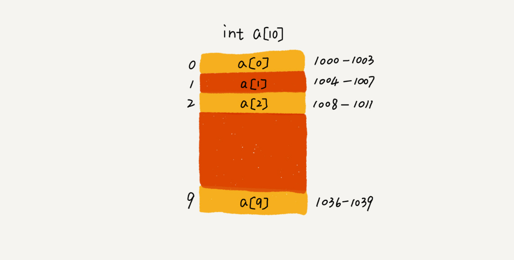

我们知道，计算机会给每个内存单元分配一个地址，计算机通过地址来访问内存中的数据。当计算机需要随机访问数组中的某个元素的时候，它会首先通过下面的寻址公式，计算出该元素存储的内存地址：

``` 
a[i]_address = base_address + i * data_type_size
```

其中data_type_size 表示数组中每个元素的大小。根据这里的例子来看，数组中存储的是int类型的数据，所以data_type_size就是4个字节。

根据这个公式，我们就能实现了数组元素的快速访问了。


### 随机访问的注意

这里需要纠正一个"错误"。在面试的时候，常常会问数组和链表的区别，很多人都回答说，"链表适合插入、删除，时间复杂度O(1)；数组适合查找，查找时间复杂度为O(1)".

实际上，这种表述是不准确的。数组是适合查找操作，但是查找的时间复杂度并不为O(1)。即使是排好序的数组，我们用二分查找，时间复杂度也是O(log n)。所以，正确的表述应该是，数组支持随机访问，根据下标随机访问的时间复杂度为O(1)。


## 低效的"插入"和"删除"

前面概念部分我们提到，数组为了保持内存数据的连续性，会导致插入、删除这两个操作比较低效。为什么会导致低效呢？又有哪些改进方法呢？


### "插入"操作

假设数组的长度是n，现在，如果我们需要将一个数据插入到数组中的第k个位置。为了把第k个位置腾出来，给新来的数据，我们需要将第k ~ n这部分的元素都顺序地往后挪一位。那插入操作的时间复杂度是多少呢？

如果在数组的末尾插入元素，那就不需要移动数据了，这时的时间复杂度是O(1)。但如果在数组的开头插入元素，那所有的数据都需要依次往后移动一位，所以最坏时间复杂度是O(n)。因为我在每个位置插入元素的概率是一样的，所以平均情况时间复杂度为(1+2+...+n)/n = O(n)。

> 我的理解是，n个线性表的元素中，有n+1个插槽，每个位置的概率都是一样的，都是1/(n+1)。 而出现在不同的位置上，需要移动的元素的个数是不一样的，在末尾是0，倒数第二位是1，倒数第二位是2 。。。 直至开头是n。 根据加权平均数的求解，那就是1 * (1/(n+1)) + 2* (1/(n+1)) .... + n* (1/(n+1)) = {(1+n)n}/{2(n+1)} = n/2 ，也就是O(n)

这里的场景中，数组初始化后默认都是每个位置都是有元素的，默认的没有填入的元素的值，就是0。


### 降低"插入"时间复杂度的技巧

如果数组中的数据是有序的，我们在某个位置插入一个新的元素时，就必须按照刚才的方法搬移k之后的数据。但是，如果数组中存储的数据并没有任何规律，数组只是被当作一个存储数据的集合。在这种情况下，如果要将某个数据插入到第k个位置，为了避免大规模的数据搬移，我们还有一个简单的办法就是，直接将第k位的数据搬移到数组元素的最后，把新的元素直接放入第k个位置。

为了更好地理解，我们举一个例子。假设数组a[10]中存储了如下5个元素：a,b,c,d,e

我们现在需要将元素x插入到第3个位置。我们只需要将c放入到a[5]，将a[2]赋值为x即可。最后，数组中的元素如下：a，b, x,d,e,c 


利用这种处理技巧，在特定的场景下，在第k个位置插入一个元素的时间复杂度就会降为O(1)。这个处理思想会在快排中用到。


### 删除操作

跟插入数据类似，如果我们要删除第k个位置的数据，为了内存的连续性，也需要搬移数据，**不然中间就会出现空洞，内存就不连续了**。

和插入类似，如果删除数组末尾的数据，则最好情况下时间复杂度为O(1)；如果删除开头的数据，则最坏情况时间复杂度为O(n)；平均情况时间复杂度也为O(n)，这个推导的原理和上面的插入是一样的。


### 连续删除更高效

实际上，在某些特殊场景下，我们并不一定非得追求数组中数据的连续性。如果我们将多次删除操作集中在一起执行，删除的效率是不是会提高很多呢？

观看下面的例子。数组a[10]中存储了8个元素：a,b,c,d,e,f,g,h。现在，我们要依次删除a,b,c三个元素。


为了避免d,e,f,g,h 这几个数据会被搬移三次，我们可以先记录下已经删除的数据。每次的删除操作并不是真正地搬移数据，只是记录数据已经被删除。当数组没有更多空间存储数据的时候，我们再触发执行一次真正的删除操作，这样就大大减少了删除操作导致的数据搬移。

如果了解JVM，就会发现，这就是JVM标记清除垃圾回收算法的核心思想。**很多时候我们并不是要去死记硬背某个数据结构或者算法，而是要学习它背后的思想和处理技巧，这些东西才是最有价值的**。


### 警惕数组的访问越界问题

先看下面C语言代码的例子：

``` 
# include <stdio.h>
int main(int argc, char* argv[]) {
	int i =0;
	int arr[3] = {0};
	for (; i<=3; i++) {
		arr[i] = 0;
		printf("%s","hello world\n");
	}
	return 0;
}
```

我们会发现代码的运行结果并非是打印三行"hello word"，而是会无限打印"hello world"，这是为什么呢？

因为，数组大小为3，a[0]，a[1]，a[2]，而我们的代码因为书写错误，导致for循环的结束条件错写为了i<=3 而非 i<3，所以 当i=3的时候，数组a[3]访问越界。

我们知道，在C语言中，只要不是访问受限的内存，所有的内存空间都是可以自由访问的。根据我们前面讲的数组寻址公式，a[3]也会被定位到某块不属于数组的内存地址上，而这个地址正好是存储变量i的内存地址，

数组寻址公式是`a[i]_address = base_address + i * data_type_size`，

> 函数体内的局部变量存在栈上，且是连续压栈。在Linux进程的内存布局中，栈区在高地址空间，从高向低增长。变量i和arr在相邻地址，且i比arr的地址大，所以arr越界正好访问到i。当然，前提是i和arr元素同类型，否则那段代码仍是未决行为。
>
> 我觉得那个例子，栈是由高到低位增长的，所以，i和数组的数据从高位地址到低位地址依次是：i, a[2], a[1], a[0]。a[3]通过寻址公式，计算得到地址正好是i的存储地址，所以a[3]=0，就相当于i=0.

数组越界在C语言中是一种未决行为，并没有规定数组访问越界时编译器应该如何处理。因为，访问数组的本质就是访问一段连续内存，只要数组通过偏移计算得到的内存地址是可用的，那么程序就可能不会报任何错误。

这种情况下，一般都会出现莫名其妙的逻辑错误，就像我们刚刚举的那个例子，debug的难度非常的大。而且，很多计算机病毒也正是利用到了代码中的数组越界可以访问非法地址的漏洞，来攻击系统，所以写代码的时候一定要警惕数组越界。

但并非所有的语言都像C一样，把数组越界检查的工作丢给程序员来做，像Java本身就会做越界检查，比如下面这几行Java代码，就会抛出java.lang.ArrayIndexOutOfBoundsException 。

``` 
int[] a = new int[3];
a[3] = 10;
```


## 容器能否完全替代数组？

针对数组类型，很多语言都提供了容器类，比如Java中的ArrayList、C++ STL中的vector。在项目开发中，什么时候适合用数组，什么时候适合用容器呢？

用Java语言来描述，ArrayList和数组相比，到底有哪些优势呢？

个人觉得，ArrayList最大的优势就是**可以将很多数组操作的细节封装起来**。 比如前面提到的数组插入、删除数据时需要搬移其他数据等。另外，它还有一个优势，就是**支持动态扩容** 。

数组本身在定义的时候需要预先指定大小，因为需要分配连续的内存空间。如果我们申请了大小为10的数组，当第11个数据需要存储到数组中时，我们就需要重新分配一块更大的空间，将原来的数据复制过去，然后再将新的数据插入。

如果使用ArrayList，我们就完全不需要关心底层的扩容逻辑，ArrayList已经帮我们实现好了。每次存储空间不够的时候，它都会将空间自动扩容为1.5倍大小。

不过，这里需要注意一点，因为扩容操作涉及内存申请和数据搬移，是比较耗时的。所以，如果事先能确定需要存储的数据大小，最好在**创建ArrayList的时候事先指定数据大小**。

比如下面的情况下，我们要从数据库中取出10000条数据放入ArrayList。我们看下面这几行代码，就会发现，相比之下，事先指定数据大小可以省略掉很多次内存申请和数据搬移操作。

``` 
ArrayList<User> users =  new ArrayList(10000);
for (int i = 0; i < 10000; ++i) {
   users.add(xxx);
}
```


## 单独使用数组的场景

作为高级语言编程者，是不是数组就无用武之地了呢？当然不是，有些时候，用数组会更合适一些，总结了如下几点自己的经验。

1. Java ArrayList无法存储基本类型，比如int、long，需要封装为Integer、Long类，而Autoboxing、Unboxing则有一定的性能消耗，所以如果特别关注性能，或者希望使用基本类型，就可以选用数组。
2. 如果数据大小事先已知，并且对数据的操作非常简单，用不到ArrayList提供的大部分方法，也可以直接使用数组。
3. 还有就是个人喜好，当要表示多维数组的时候，用数组往往会更加直观。比如Object \[][] array ; 而用容器的话则需要这样定义：ArrayList <ArrayList\<object>> array.

对于业务开发，直接使用容器就足够了，省时省力。毕竟损耗一丢丢性能，完全不会影响到系统整体的性能。但如果我们是做一些非常底层的开发，比如开发网络架构，性能的优化需要做到极致，这个时候数组就会优于容器，成为首选。


## 答疑开篇问题

现在来解答一下开篇的问题：为什么大多数编程语言中，数组要从0开始编号，而不是从开始呢？

从数组存储的内存模型上来看，"下标"最确切的定义应该是"偏移(offset)"。前面也提到，如果用a来表示数组的首地址，a[0]就是偏移为0的位置，也就是首地址，a[k]就表示偏移k个type_size的位置，所以计算a[k]的内存地址只需要也能够这个公式：

`a[k]_address = base_address + k * data_type_size`

但是，如果数组从1开始计数，那我们计算数组元素a[k]的内存地址就会变成：

`a[k]_address = base_address + (k-1) * data_type_size`

对比两个公式，我们不难发现，从1开始编号，每次随机访问数组元素都多了一次减法运算，对于CPU来说，就是多了一次减法指令。

数组作为非常基础的数据结构，通过下标随机访问数组元素又是其非常基础的编程操作，效率的优化就要尽可能做到极致。所以为了减少一次减法操作，数组选择了从0开始编号，而不是从1开始。

其实说，数组起始编号非0开始不是一定不可，最重要的可能是历史原因。

C语言设计者用0开始计数数组下标，之后的Java、JavaScript等高级语言都效仿了C语言，或者说，为了在一定程度上减少C语言程序员学习Java的学习成本，因此急需沿用了从0开始计数的习惯。实际上，很多语言中数组也并不是从0开始计数的，甚至还有一些语言支持负数下标，比如Python。


### 内容小结

我们今天学习了数组。它可以说是最基础、最简单的数据结构了。数组用一块连续的内存空间，来存储相同类型的一组数据，最大的特定就是支持随机访问，但插入、删除操作也因此变得比较低效，平均情况时间复杂度为O(n)。在平时的业务开发中，我们可以直接使用编程语言提供的容器类，但是，如果是特别底层的开发，直接使用数组可能会更合适。


### 二维数组的寻址公式

那么对于二维数组 x[][](长度为a1\*a2)来说，求x\[i][j]的时候（不会考虑i j越界的情况），要到i的时候，一定走完了i\*a2的长度，在x\[i][0]往后找j个长度就是x\[i][j]，所以会从初始地址增加 （i*a2+j）个单位长度

一维数组：（a1）x[i]_address = base_address + i * type_size

二维数组：（a1*a2）x[i][j]_address = base_address + (i * a2 + j )* type_size


## D24(2020/10/10)

今天需要学习的是链表linked list这个数据结构。学习链表又有什么作用呢？为了回答这个问题，先要讨论一个经典的链表应用场景，那就是LRU缓存淘汰算法。


## 链表(上)：如何实现LRU缓存淘汰算法？

缓存是一种提供数据读取性能的技术，在硬件设计、软件开发中都有着非常广泛的应用，比如常见的CPU缓存、数据库缓存、浏览器缓存等。

缓存的大小有限，当缓存被用满的时候，哪些数据应该被清理出去，哪些数据应该被保留呢？这就需要缓存淘汰策略来决定。常见的策略有三种：先进先出策略FIFO(First In, First Out)、最少使用策略LFU(Least Frequently Used)、最近最少使用策略LRU(Least Recently Used)。

这里就需要关注的一个问题：**如何用链表来实现LRU缓存淘汰策略呢?**


### 链表与数组的区别

相比数组，链表是一种稍微复杂一点的数据结构。对于初学者来说，掌握起来也要比数组稍微难一些。数组和链表是两个非常基础、非常常用的数据结构，我们会常常放到一起比较。

从底层的存储结构上来看：

参考如下的图示，从图中我们可以看到，数组需要一块**连续的内存空间**来存储，对内存的要求比较高。如果我们申请了一个100MB大小的数组，当内存中没有连续的、足够大的存储空间的时候，即便内存的剩余总可用空间大于100MB，仍然会申请失败。(Java中的ArrayList可用不连续)

而链表恰恰相反，它并不需要一块连续的内存空间，它通过"指针"将一组**零散的内存块**串联起来使用，所以如果我们申请的是100MB大小的链表，根本不会有问题。


### 单链表基本概念

链表结构五花八门，重点需要学习的是三种最常见的链表结构，它们分别是：单链表、双向链表和循环链表。

链表通过指针将一组零散的内存块串联在一起。其中，我们把内存块称为链表的"结点"。为了将所有的结点串起来，每个链表的结点除了存储数据之外，还需要记录链上的下一个结点的地址。如下面的图示，我们把这个记录下个结点地址的指针叫做**后继指针next**。


从上面的单链表的图中，可以发现，其中有两个结点是比较特殊的，它们分别是第一个结点和最后一个结点。我们习惯性把第一个结点叫做**头结点**，把最后一个结点叫做**尾结点**。其中头结点用来记录链表的基地址。有了它，我们就可以遍历得到整条链表。而尾结点特殊的地方是：指针不是只想下一个结点，而是指向一个**空地址NULL**，表示这时候链表上最后一个结点。

> 参考《大话数据结构》中的内容，对于头结点，头指针的区别和联系。
>
> 参考URL：http://data.biancheng.net/view/103.html
>
> 头结点：是放在第一个元素结点之前的一个节点，其数据域一般无意义(也可以存放链表的长度)。头结点可有可无。
>
> 头指针：如果存在头节点，那么头指针则是指向头结点的指针。如果不存在头节点，那么头指针则是执行第一个结点元素的指针。头指针是链表必须存在的。


### 单链表的查找/插入/删除

与数组一样，链表也支持数据的查找、插入和删除操作。

我们知道，在进行数组的插入、删除操作的时候，为了保证内存数据的连续性，需要做大量的数据搬移，所以时间复杂度是O(n)。

而在链表中插入或删除一个数据，我们并不需要为了保持内存的连续性而搬移结点，因为链表的存储空间本身就不是连续的。所以，在链表中插入和删除一个数据是非常快速的。

从下面的图示中，可以看出，针对链表的插入和删除操作，我们只需要考虑相邻结点的指针的改变，所以对应的时间复杂度是O(1).


但是，有利就有弊。链表要想随机访问第k个元素，就没有数组那么高效了。因为链表中的数据并非连续存储的，所以无法像数组那样，根据首地址和下标，通过寻址公式就能直接计算出对应的内存地址，而是需要根据指针一个结点一个结点地依次遍历，直到找到相应的结点。

我们把单链表想象成一个队伍，队伍中的每个人都只知道自己后面的人是谁，所以当我们希望知道排在第k位的人是谁的时候，我们就需要从第一个人开始，一个个第往下数。所以，链表随机访问的性能没有数组好，需要O(n)的时间复杂度。


### 循环链表

**循环链表是一种特殊的单链表**。实际上，循环链表也很简单。它跟单链表唯一的区别就在尾结点。我们知道，单链表的尾结点指针指向空地址，表示这就是最后的结点了。


而循环链表的尾结点指针是指向链表的头结点。从上面的循环链表的图示中，可以看出，它像一个环一样首尾相连，所以叫做"循环"链表。

和单链表相比，**循环链表**的优点是从链尾到链头比较方便。当要处理的数据具有环形结构特点时，就特别适合采用循环链表。


### 双向链表的概念

在实际的软件开发中，也更加常用的链表结构：双向链表。

单向链表只有一个方向，结点只有一个后继指针next指向后面的结点。而双向链表，顾名思义，它支持两个方向，每个结点不止有一个后继指针next指向后面的结点，还有一个前驱指针prev指向前面的结点。


从上面的图示中可以看出，双向链表需要额外的两个空间来存储后继结点和前驱结点的地址。所以，如果存储同样多的数据，双向链表要比单链表占用更多的内存空间。虽然两个指针比较浪费存储空间，但可以支持双向遍历，这样也带来了双向链表操作的灵活性。


### 双向链表的优势

那相比单链表，双向链表适合解决哪种问题呢？

从结构上来看，双向链表可以支持O(1)时间复杂度的情况下找到前驱结点，正是这样的特点，也使双向链表在某些情况下的插入、删除等操作都要比单链表简单、高效。

可能我们会说，我们刚才讲的单链表的插入、删除操作的时间复杂度已经是O(1)了，双向链表还能再怎么高效呢？

刚才我们的分析比较偏理论，很多数据结构和算法书籍中都会这么讲，但是这种说法实际上是不准确的，或者说是有先决条件的。接下来，我们一起分析一下链表的两个操作。


#### 双向链表的删除操作

在实际的软件开发中，从链表中删除一个数据无外乎这两种情况：

* 删除结点中"值等于某个给定值"的结点；(如果是这种情况的删除，我们需要先定位到要删除的元素，然后再执行删除操作。定位到要删除的元素的平均复杂度是O(n)，执行删除操作的时间复杂度是O(1))
* 删除给定指针指向的结点。(这就意味着不用我们再去遍历找到被删除的元素。直接删除指向这个元素的相应的指针。)

对于第一种情况，不管是单链表还是双向链表，为了查找到值等于给定值的结点，都需要从头结点开始一个一个依次遍历对比，直到找到值等于给定值的结点，然后再通过我们前面讲的指针操作将其删除。

尽管单纯的删除操作时间复杂度是O(1)，但遍历查找的时间是主要的耗时点，对应的时间复杂度为O(n)。根据时间复杂度分析中的加法法则，删除值等于给定值的结点对应的链表操作的总时间复杂度为O(n)。

对于第二种情况，我们已经找到了要删除的结点，但是删除某个结点q需要知道其前驱结点，而单链表并不支持直接获取前驱结点，所以，为了找到前驱结点，我们还是要从头结点开始遍历链表，直到p->next = q, 说明p是q的前驱结点。

但是对于双向链表来说，这种情况就比较有优势了。因为双向链表中的结点已经保存了前驱结点的指针，不需要像单链表那样遍历。所以，针对第二种情况，单链表删除操作需要O(n)的时间复杂度，而双向链表只需要在O(1)的时间复杂度内就搞定了。


#### 双向链表的插入操作

同理，如果我们希望在链表的某个指定结点前面插入一个结点，双向链表比单链表有很大的优势。

双向链表可以在O(1)时间复杂度搞定，而单向链表需要O(n)的时间复杂度。


#### 双向链表的查询

除了插入、删除操作有优势之外，对于一个有序链表，双向链表的按值查询的效率也要比单链表高一些。

因为，我们可以记录上次查找的位置p，每次查询时，根据要查找的值与p的大小关系，决定是往前还是往后查找，所以平均只需要查找一半的数据。


### 双向链表总结

从上面的例子中，可以看出双向链表确实是要比单链表要更加高效一些。这就是为什么在实际的软件开发中，双向链表尽管比较费内存，但还是比单链表的应用更加广泛的原因。

如果我们熟悉Java语言，我们肯定就用过LinkedHashMap这个容器。深入了解LinkedHashMap的实现原理，就会发现其中就用到了双向链表这种数据结构。


### 空间换时间or时间换空间

这里用到了一个空间换时间的设计思想。

当内存空间充足的时候，如果我们更加追求代码的执行速度，我们就可以选择空间复杂度相对较高、但时间复杂度相对很低的算法或数据结构。相反，如果内存比较紧张，比如代码跑在手机或单片机上，这个时间，就要反过来用时间换空间的设计思路。

还是开篇缓存的例子。缓存实际上就是利用了空间换时间的设计思想。如果我们把数据存储在硬盘上，会比较节省内存，但每次查找数据都要询问一次硬盘，会比较慢。但如果我们通过缓存技术，事先将数据加载在内存中，虽然会比较耗费内存空间，但是每次数据查询的速度就大大提高了。

所以总结一下，对于执行较慢的程序，可以通过消耗更多的内存(空间换时间)来进行优化；而消耗过多的内存程序，可以通过消耗更多的时间(时间换空间)来降低内存的消耗。


### 双向循环链表

我们可以将循环链表和双向链表结合在一起，就得到了双向循环链表。

可以参见如下的图示，实际上每个链表中的结点，都可以理解为一个结构体，这个结构体中存储了相应的数据域，还有相应的结构体类型的指针，分别可以指向前驱和后驱的结构体类型的结点。

下面的图像中，第一个节点的前驱指向末尾节点的结构体内存地址的指针，而末尾节点的后继指向第一个节点的结构体内存地址的指针。


### 数组和链表性能比较

通过学习，可以知道，数组和链表是两种截然不同的内存组织方式。正是因为内存存储的区别，它们插入、删除、随机访问操作的时间复杂度正好相反。


不过，数组和链表的对比，并不能局限于时间复杂度。而且，在实际的软件开发中，不能仅仅利用复杂度分析就决定使用哪个数据结构存储数据。

1. 数组简单易用，在实现上使用的是连续的内存空间，可以借助CPU的缓存机制，预读数组中的数据，所以访问效率更高。而链表在内存中并不是连续存储，所以对CPU缓存不友好，没有办法有效预读。

2. 数组的缺点是大小固定，一经声明就要占用整块连续内存空间。如果声明的数组过大，系统可能没有足够的连续内存空间分配给它，导致"内存不足(out of memory)"。如果声明的数组过小，则可能出现不够用的情况。这时只能再申请一个更大的内存空间，把原数组拷贝进去，非常费时。链表本身没有大小的限制，天然地支持动态扩容，这是它与数组最大的区别。

   上一节的学习中，我们知道了Java中ArrayList容器，也可以支持动态扩容。根据上一节的内容，我们知道，当我们往支持动态扩容的数组中插入一个数据的时候，如果数组中没有空闲空间时，就会申请一个更大的空间，将数据拷贝过去，而数据拷贝的操作是非常耗时的。

3. 除此之外，如果我们的代码对内存的使用非常苛刻，那就使用数组更合适。因为链表中的每个结点都需要消耗额外的存储空间去存储一份指向下一个结点的指针，所以内存消耗会翻倍。而且，对链表进行频繁的插入、删除操作，还会导致频繁的内存申请和释放，容易造成内存碎片，如果是Java语言，就有可能导致频繁的GC(Garbage Collection，垃圾回收)


### 解答开篇的问题

如何基于链表实现LRU缓存淘汰算法？

我的思路是这样的：我们维护一个有序单链表，越靠近链表尾部的结点是越早之前访问的。当有一个新的数据被访问时，我们从链表头开始顺序遍历链表。

1. 如果此数据之前已经被缓存在链表中了，我们遍历得到这个数据对应的结点，并将其从原来的位置删除，然后再插入到链表的头部。
2. 如果此数据没有在缓存链表中，又可以分为两种情况：
   * 如果此时缓存未满，则将此结点直接插入到链表的头部；
   * 如果此时缓存已满，则链表尾结点删除，将新的数据结点插入链表的头部。

这样我们就用链表实现了一个LRU缓存。

现在我们再来看下缓存访问的时间复杂度是多少。因为不管缓存有没有满，我都需要遍历一遍链表，所以这种基于链表的实现思路，缓存访问的时间复杂度为O(n)。

实际上，我们可以继续优化这个实现思路，如果引入散列表(Hash table) 记录每个数据的位置，将缓存访问的时间复杂度降到O(1)。


### 内容小结

今天我们学习了一种跟数组"相反"的数据解雇，链表。它跟数组一样，也是非常基础、非常常用的数据结构。不过链表要比数据稍微复杂，从普通的单链表衍生出来好几种链表结构，比如双向链表、循环链表、双向循环链表。

和数组相比，链表更适合插入、删除操作频繁的场景，查询的时间复杂度较高。


### 问题思考

1. C语言中指针占用几个字节

   指针即为地址，指针几个字节跟语言无关，而是跟系统的寻址能力有关。现在一般是32位系统，所以是4个字节，64为的系统，就是8个字节。可以通过如下的代码来查看运行环境中指针占多大字节。

   ``` 
   #include <stdio.h>   
   int main(void)  
   {  
       int a=1;  
       char b='a';  
       float c=1.0;  
       void *p;  
       p=&a;  
       printf("a的地址为：0x%x，其字节数为：%d\n",p,sizeof(p));  
       p=&b;  
       printf("b的地址为：0x%x，其字节数为：%d\n",p,sizeof(p));  
       p=&c;  
       printf("c的地址为：0x%x，其字节数为：%d\n",p,sizeof(p));  
       return 0;  
   } 
   ```

   参考如下的网上资源：

   > https://blog.csdn.net/IOSSHAN/article/details/88944637
   >
   > https://blog.csdn.net/koches/article/details/7627381#

2. 单链表中尾结点的后继指针问题

   在单链表中，尾结点的后继指针next指向的不再是下一个结点。而是指向一个空地址null。这样做的好处在于：防止尾结点的后继指针next成为一个野指针，导致遍历链表根本停不下来，或者出现一些本不属于该链表的垃圾数据。

3. 参考《大话数据结构》中的内容，对于头结点，头指针的区别和联系。

   参考URL：http://data.biancheng.net/view/103.html

   头结点：是放在第一个元素结点之前的一个节点，其数据域一般无意义(也可以存放链表的长度)。头结点可有可无。

   头指针：如果存在头节点，那么头指针则是指向头结点的指针。如果不存在头节点，那么头指针则是执行第一个结点元素的指针。头指针是链表必须存在的。

   

   

4. 单链表实现LRU，数组实现LRU

   单链表LRU：我们约定，越靠近链表尾部的结点是越早之前访问的(当然也可以是链尾是越后访问的)。当有一个新的数据被访问的时候，我们从链表头开始顺序遍历链表。

   * 如果此数据之前已经被缓存在链表中了，我们遍历得到这个数据对应的结点，并将其从原来的位置删除，然后再插入到链表的头部；
   * 如果此数据没有在缓存链表中，可以分为两种情况：如果此时缓存未满，则将此结点直接插入到链表的头部；
   * 如果此时缓存已满，则链表尾结点删除，将新的数据结点插入链表的头部。

   数组LRU：同样我们约定，越靠近数组尾部的元素是越迟访问的。当有一个新的数据被访问的时候，我们就从数组的第一个元素开始顺序遍历数组。

   * 如果此数据之前已经被缓存在数组中了，我们遍历得到这个数据对应的元素的位置，并将其从原来的位置删除，然后再插入到数组的尾部。
   * 如果此数据没有在缓存的数组中，可以分为两种情况：如果此时缓存未满，则将此元素直接插入到数组的末尾；
   * 如果此时缓存已满，则将数组的第一个元素删除，将新的元素插入到数组的尾部。

5. 判断一个字符串是否是回文字符串，这个字符串是通过单链表来存储的。

   ```
   使用快慢两个指针找到链表中点，
   慢指针每次前进一步，快指针每次前进两步。
   在慢指针前进的过程中，同时修改其next指针，
   使得链表前半部分反序。
   最后比较中点两侧的链表是否相等。
   时间复杂度：O(n)
   ```

   

## D25(2020/10/11)

今天主要是要学习的是链表的下半部分，主要学习和描述的内容是如何轻松地写出正确的链表代码。

要想写好链表代码并不是容易的事，尤其是那些复杂的链表操作，比如链表反转、有序链表合并等，写的时候非常容易出错。

为什么链表代码这么难写？究竟怎样才能轻松地写出正确的链表代码呢？

只要愿意投入时间，我觉得大多数人都是可以学会的。比如说，如果你真的能花上一个周末或者一整天的时间，就去写链表反转这一代码。

当然，自己有决心并且付出精力是成功的先决条件，除此之外，我们还需要一些方法和技巧。我根据自己的学习经历和工作经验，总结了**几个写链表代码技巧**。如果你能熟练掌握这几个技巧，加上自己的主动和坚持，轻松拿下链表代码完全没有问题。


## 技巧一：理解指针或引用的含义

事实上，看懂链表的结构并不是很难，但是一旦把它和指针混在一起，就很容易让人摸不着头脑。所以，要想写对链表代码，首先就要理解好指针。

我们知道，有些语言有"指针"的概念，比如C语言；有些语言没有指针，取而代之的是"引用"，比如Java、Python。不管是"指针"还是"引用"，实际上，它们的意思都是一样的，都是存储所指对象的内存地址。

接下来，我会拿C语言中的"指针"来讲解，如果你用的是Java或者其他没有指针的语言也没有关系，你把它理解成"引用"就可以了。

实际上，对应指针的理解，我们只需要记住下面这句话就可以了：

**将某个变量赋值给指针，实际上就是将这个变量的地址赋值给指针，或者反过来说，指针中存储了这个变量的内存地址，指向了这个变量，通过指针就能找到这个变量**。

在编写链表代码的时候，我们经常会有这样的代码：p->next = q。这行代码是说，p结点中的next指针存储了q结点的内存地址。

还有一个更复杂的，也是我们写链表代码经常会用到的：p->next = p->next->next . 这行代码表示，p结点的next指针存储了p结点的下下一个结点的内存地址。


## 技巧二：警惕指针丢失和内存泄漏

很多时候，在写链表代码的时候，很容易不知道指针指向哪里了。

指针往往都是怎么弄丢的呢？下面看一个单链表插入的操作例子：


如上图所示，我们希望在结点a和相邻的结点b之间插入结点x，假设当前指针p指向结点a。如果我们将代码实现变成下面的样子，就会发生指针丢失和内存泄漏.

``` 
p->next = x;   //将p的next指针指向x结点
x->next = p->next; //将x的结点的next指针指向b
```

在这里是错误的。p->next指针在完成第一步操作之后，已经不再指向结点b了，而是指向结点x。第2行代码相当于将x赋值给x->next，自己指向自己。因此，整个链表也就断成了两半，从结点b往后的所有结点都无法访问到了。(这里的意思是，由于指向性的丢失，结点b往后的所有结点都无法访问到了，也就是说无法去释放它们了。没有了指针，程序也不知道从哪个位置开始取释放内存空间)

对于有些语言来说，比如C语言，内存管理是由程序员负责的，如果没有手动释放结点对应的内存空间，就会产生内存泄漏。所以，我们**插入结点时，一定要注意操作的顺序**，要先将结点x的next指针指向结点b，再把结点a的next指针指向结点x，这样才不会丢失指针，导致内存泄漏。所以，对于刚刚的插入代码，我们只需要把第1行和第2行代码的顺序颠倒一下就可以了。

同理，**删除链表结点的时候，也一定要记得手动释放内存空间**。否则，也会出现内存泄漏的问题。当然，对于像Java这种虚拟机自动管理内存的编程语言来说，就不需要考虑这么多了。


## 技巧三：利用哨兵简化实现难度

首先，我们先来回顾一下单链表的插入和删除操作。如果我们在结点p后面插入一个新的结点，只需要下面两行代码就可以搞定。

``` 
new_node->next = p->next; 
//原先p的后继指针里面的地址位置赋值给了新节点的后继指针里面
p->next = new_node;  
//将新节点的地址值，赋给p的next后继指针
```

但是，当我们要向一个空链表中插入第一个结点，刚刚的逻辑就不能用了。我们需要进行下面这样的特殊处理，其中head表示链表的头结点。所以，从这段代码，我们可以发现，对于单链表的插入操作，第一个结点和其他结点的插入逻辑是不一样的。

``` 
if (head == null) {
    head = new_node;
}
```

我们再来看单链表结点删除操作。如果要删除结点p的后继结点，我们只需要一行代码就可以了。

``` 
p->next = p->next->next;
```

但是，如果我们要删除链表中的最后一个结点，前面的删除代码就不能工作了。跟插入操作类似，我们也需要对于这种情况特殊处理。代码如下：

``` 
if (head->next == null) {
    head = null;
}
```

从前面的一步一步分析来看，**针对链表的插入、删除操作，需要对插入第一个结点和删除最后一个结点的情况进行特殊处理**。 这样代码实现起来就会很繁琐，不简洁，而且也容易因为考虑不全而出错。可以参考如下的方法来解决问题。

可以利用哨兵，哨兵，解决的是国家之间的边界问题。同理，这里说的哨兵也是解决"边界问题"的，不直接参与业务逻辑。

上面用`head = null`来表示链表中没有结点了。其中head表示头结点指针，指向链表中的第一个结点。

如果我们引入哨兵结点，在任何时候，不管链表是不是空，head指针都会一直指向这个哨兵结点。我们也把这种有哨兵结点的链表叫**带头链表**。相反，没有哨兵结点的链表就叫作**不带头链表**。

下面的图示是一个带头链表，我们可以发现，哨兵结点是不存储数据的。因为哨兵结点一直存在，所以插入第一个结点和插入其他结点，删除最后一个结点和删除其他结点，都可以统一为相同的代码实现逻辑了。


实际上，这种利用哨兵简化编程难度的技巧，在很多代码实现中都有用到，比如插入排序、归并排序、动态规划等。下面是用C写的例子。

``` c
//在数组a中，查找key，返回key所在的位置
// 其中，n表示数组a的长度
int find(char* a, int n, char key) {
	//边界条件处理，如果a为空，或者n<=0，说明数组中没有数据，就不用while循环比较了
	if (a == null || n <=0) {
		return -1;
	}
	int i = 0;
	// 这里有两个比较操作：i<n和a[i] == key.
	while (i<n) {
		if (a[i] == key) {
			return i;
		}
		++i;
	} 
	return -1;
} 
```

代码二：

``` 
// 在数组a中，查找key，返回key所在的位置
// 其中，n表示数组a的长度
int find(char* a, int n, char key) {
	if (a == null || n <=0) {
		return -1;
	}
	if (a[n-1] == key) {
		return n-1;
	}
	char tmp = a[n-1];
	a[n-1] = key;
	int i = 0;
	while (a[i] != key) {
		++i;
	}
	a[n-1] = tmp;
	if (i == n-1) {
		return -1;
	} else {
		return i;
	}
} 
```

对比两段代码，在字符串a很长的时候，比如几万、几十万，哪段代码运行的更快点呢？答案是代码二，因为两段代码中执行次数最多就是while循环那一部分。第二段代码中，我们通过一个哨兵a[n-1] = key，成功省掉了一个比较语句i<n(i<n在while循环中存在的意义是，帮助控制循环的次数，不要无限循环下去。而这里设置了a[n-1]=key，就保证了while循环会在最后一个数组元素后退出了)。不要小看这一条语句，当累积执行万次、几十万次时，累积的时间就很明显了。

当然，这只是为了举例说明哨兵的作用，我们写代码的时候千万不要写第二段那样的代码，因为可读性太差了。大部分情况下，我们并不需要如此追求极致性能。


## 技巧四：重点留意边界条件处理

软件开发中，代码在一些边界或异常的情况下，最容易产生Bug。链表代码也不例外。要想实现没有Bug的链表代码，一定要在编写的过程中以及编写完成之后，检查边界条件是否考虑全面，以及代码在边界条件下是否能正确运行。

我经常用来检查链表代码是否正确的边界条件有如下几个：

* 如果链表为空时，代码是否能正常工作？
* 如果链表只包含一个结点的时候，代码是否能正常工作？
* 如果链表只包含两个结点的时候，代码是否能正常工作？
* 代码逻辑在处理头结点和尾结点的时候，是否能正常工作？

当我们写完链表代码之后，除了看下我们写的代码在正常的情况下能否工作，还要看下在上面我列出的几个边界条件下，代码仍然能否正确工作。如果这些边界条件下都没有问题，那基本上可以认为没有问题了。


## 技巧五：举例画图，辅助思考

对于稍微复杂的链表操作，我们可以使用举例法和画图法。

我们可以找一个具体的例子，把它画在纸上，释放一些脑容量，留更多的给逻辑思考，这样就会感觉到思路清晰很多。比如往单链表中插入一个数据这样一个操作，我一般都是把各种情况都举一个例子，画出插入前和插入后的链表变化。


## 技巧六：多写多练，没有捷径

精选了5个常见的链表操作。我们需要把这几个操作都能写熟练，不熟就多写几遍。

* 单链表反转
* 链表中环的检测
* 两个有序的链表合并
* 删除链表倒数第n个结点
* 求链表的中间结点


## 内容小结

这里主要罗列了写链表代码的六个技巧。分别是理解指针或引用的含义、警惕指针丢失和内存泄漏、利用哨兵简化实现难度、重点留意边界条件处理，以及举例画图、辅助思考，还有多写多练。

写链表代码是最考验逻辑思维能力的。


## 问题思考

1. C语言中，内存泄漏的问题

   对于c语言而言，删除链表的结点时，也一定要手动释放结点所占用的内存空间，否则也会容易产生内存泄漏的问题。

2. 如何获取结构体的首地址

   参考如下的代码：

   ``` 
   #include<stdio.h>
   typedef struct
   {
    int a;
    int b;
   }T;
   int  main()
   {
   	T t;
   	void *p1;
   	void *p2;
   	p1 = &t;
   	p2 = &t.a;
   	printf("p1 = %p, p2 = %p\n",p1,p2);
   }
   ```


## D26(2020/10/12)

今天主要是要学习的是栈相关方面的内容。

这里我先引出一个浏览器中前进和后退的例子。

当我们依次访问完一串页面a-b-c之后，点击浏览器的后退按钮，既可以看到之前浏览过的页面b和a。当我们后退到页面a，点击前进按钮，就可以重新查看页面b和c。但是，如果我们后退到了页面b之后，点击了新的页面d了，那就无法再通过前进、后退功能查看页面c了。


## 如何理解"栈"？

关于"栈"，有个非常贴切的例子，就是一摞叠在一起的盘子。我们平时放盘子的时候，都是从下往上一个个放；取的时候，我们也是从上往下一个个的依次取，不能从中间任意抽出。**后进者先出，新进者后出，这就是典型的"栈"结构** 。

从栈的操作特性来看，**栈是一种"操作受限"的线性表**，只允许在一端插入和删除数据。

那对于这种栈的结构，存在的意义是什么呢？相比于数组和链表，栈带给我们的好像只有限制，并没有任何优势。我们可以直接使用数组或链表来替代栈，我们为什么还要用这个"操作受限"的栈呢？

事实上，从功能上来说，数组或链表确实可以替代栈，但我们需要知道，特定的数据结构是对特定场景的抽象，而且，数组或链表暴露了太多的操作接口，操作上的确灵活自由，但使用时就比较不可控，自然也就跟容易出错。

**当某个数据集合只涉及在一端插入和删除数据，并且满足后进先出、先进后出的特性，我们就应该首选"栈"这种数据结构**。


## 如何实现一个"栈"？

从刚才栈的定义里面，我们可以看出，栈主要包含两个操作，入栈和出栈，也就是在栈顶插入一个数据和从栈顶删除一个数据。

实际上，栈既可以用数组来实现，也可以用链表来实现。用数组实现的栈，我们叫做**顺序栈**，用链表来实现的栈，我们叫做**链式栈**。

下面的代码是用java写的用数组实现的顺序栈

``` 

```

了解了定义和基本操作，那它的操作的时间、空间复杂度是多少呢？

不管是顺序栈还是链式栈，我们存储数据只需要一个大小为n 的数组够了。在入栈和出栈的过程中，只需要一两个临时变量存储空间，所以空间复杂度是O(1).

注意，这里存储数据需要一个大小为n的数组，并不是说空间复杂度就是O(n)。因为，这n个空间是必须的，无法省掉。所以我们说空间复杂度的时候，是指除了原本的数据存储空间外，算法运行还需要额外的存储空间。

不管是顺序栈还是链式栈，入栈、出栈只涉及栈顶个别数据的操作，所以时间复杂度都是O(1)。


## 支持动态扩容的顺序栈

刚才那个基于数组实现的栈，是一个固定大小的栈，也就是说，在初始化栈时需要事先指定栈的大小。当栈满之后，就无法再往栈里添加数据了。尽管链式栈的大小不受限，但要存储next指针，内存消耗相对较多。那我们如何基于数组实现一个可以支持动态扩容的栈呢？

我们在数组那一节描述过，当数组空间不够的时候，我们就重新申请一块更大的内存，将原来数组中数据统统拷贝过去。这样就实现了一个支持动态扩容的数组。

所以，如果要实现一个支持动态扩容的栈，我们只需要底层依赖一个支持动态扩容的数组就可以了。当栈满了之后，我们就申请一个更大的数组，将原来的数据搬移到新数组中。如下图所示：


实际上，支持动态扩容的顺序栈，在平时的开发中并不常见。我们可以根据这个场景，复习一下复杂度的分析。

对于出栈操作来说，我们不会涉及内存的重新申请和数据的搬移，所以出栈的时间复杂度仍然是O(1)。但是，对于入栈操作来说，情况就不一样了。当栈中有空闲空间的时候，入栈的操作的时间复杂度是O(1)。但是当空间不够的时候，就需要重新申请内存和数据搬移，所以时间复杂度就变成了O(n)。

也就是说，对于入栈操作来说，最好情况时间复杂度是O(1)，最坏情况的时间复杂度是O(n)。那平均情况下的时间复杂度又是多少呢？这个入栈操作的平均情况下的时间复杂度可用用摊还分析法来分析。

为了分析的方便，我们需要事先做一些假设和定义：

* 栈空间不够的时候，我们重新申请一个是原来大小两倍的数组；
* 为了简化分析，假设只有入栈操作没有出栈操作；
* 定义不涉及内存搬移的入栈操作为simple-push操作，时间复杂度为O(1)。

如果当前栈大小为k，并且已满，当再有新的数据要入栈的时候，就需要重新申请2倍大小的内存，并且做K个数据的搬移操作，然后再入栈。但是，接下来的K-1次入栈操作，我们都不需要再重新申请内存和搬移数据，所以这K-1次入栈操作都只需要一个simple-push操作就可以完成。如下图所示：


我们可以看出，这K次入栈操作，总共涉及了K个数据的搬移，以及K次simple-push操作。将K个数据搬移均摊到K次入栈操作，那每个入栈操作只需要一个数据搬移和一个simple-push操作。以此类推，入栈操作的均摊时间复杂度是O(1)。

从这个例子的分析中，可以看出，均摊时间复杂度一般都等于最好情况时间复杂度。因为在大部分的情况下，入栈操作的时间复杂度O都是O(1)，只有在个别的时刻才会退化为O(n)，所以把耗时多的入栈操作的时间均摊到其他入栈操作上，平均情况系的耗时就接近O(1)。


## 栈在函数调用时的应用

栈作为一个比较基础的数据结构，经典的一个应用场景就是**函数调用栈**。

操作系统给每个线程分配了一块独立的内存空间，这块内存被组织成"栈"这种结构，用来存储函数调用时的临时变量。每进入一个函数，就会将临时变量作为一个栈帧入栈，当被调用函数执行完成，返回之后，将这个函数对应的栈帧出栈。

可以查看下如下的代码：

``` 
# include <stdio.h>
int add(int x, int y) {
	int sum = 0;
	sum = x + y;
	return sum;
}

int main() {
	int a = 1;
	int ret = 0;
	int res = 0;
	ret = add( 3, 5);
	res = a + ret;
	printf("%d", res);
	return 0;
}
```

从代码中我们可以看出，main()函数调用了add()函数，获取计算结果，并且与临时变量a相加，最后打印res的值。下面的图示中展示的，对应的函数栈里出栈、入栈的操作。


## 栈在表达式求值中的应用

这里展示的是栈的另一个常见的应用场景，编译器如何利用栈来实现表达式求值。

为了方便解释，我将算术表达式简化为只包含加减乘除四则运算，比如：34+13*9+44 - 12/3。

对于计算机来说，编辑器就是通过两个栈来实现的。其中一个保存操作数的栈，另一个是保存运算符的栈。我们从左向右遍历表达式，当遇到数字，我们就直接压入操作数栈；当遇到运算符，就与运算符栈的栈顶元素进行比较。

如果比运算符栈顶元素的优先级高，就将当前运算符压入栈；**如果比运算符栈顶元素的优先级低或相同，从运算符栈中取栈顶运算符，从操作数的栈顶取2个操作数，然后进行计算，再把计算完的结果压入操作数栈，继续比较**。

下面是将3+ 5*8 -6 这个表达式的计算过程画成了一张图


## 栈在括号匹配中的应用

除了用栈来实现表达式求值，我们还可以借助栈来检查表达式中的括号是否匹配。

我们同样简化一下背景。我们假设表达式中只包含三种括号，圆括号()、方括号[]和花括号{}，并且它们可以任意嵌套。比如，{[]()[{}]} 或者是[{()}([])]等都是合法格式，而{[}()] 或[({)] 为不合法的格式。如果现在有一个包含三种括号的表达式字符串，如何检查它是否合法呢？

这里也可以用栈来解决。我们用栈来保存未匹配的左括号，从左到右依次扫描字符串。当扫描到左括号的时候，则将其压入栈中；当扫描到右括号时，从栈顶取出一个左括号。如果能够匹配，比如"("跟")"匹配，"["跟"]"匹配，"{"跟"}"匹配，则继续扫描剩下的字符串。如果扫描的过程中，遇到不能配对的右括号，或者栈中没有数据，则说明为非法格式。

当所有的括号都扫描完成之后，如果栈为空，则说明字符串为合法格式；否则，说明有未匹配的左括号，为非法格式。

>
>
>1. 扫描到左括号时，将其压入栈。
>2. 当扫描到右括号时，从栈顶取出数据。
>3. 如果能够匹配，则继续扫描；反之，就是非法。
>4. 最后假如栈中没有数据，表示格式非法。


## 解答开篇

我们再来看看开篇的思考题，如何实现浏览器的前进、后退功能？其实，用两个栈就可以非常完美地解决这个问题。

我们使用两个栈，X和Y，我们把首次浏览的页面依次压入栈X，当点击后退按钮的时候，再依次从栈X中出栈，并将出栈的数据依次放入栈Y。当我们点击前进按钮的时候，我们依次从栈Y中取出数据，放入栈X中。当栈X中没有数据的时候，那就说明没有页面可以继续后退浏览量。当栈Y中没有数据，那就说明没有页面可以点击前进按钮浏览了。

> X栈是用来实现后退功能的，但是每后退依次，从X栈中取出一个数据，需要放入到Y栈中。
>
> 当需要实现前进功能的时候，就依次从Y栈中取出一个数据。同时将这个数据压如栈X中。
>
> 每浏览一个页面就将其数据压入栈X，同时清理Y栈。
>
> 需要注意的是，如果是访问新的页面的时候，就需要清空Y栈，不管是刚开始登录页面，还是回退到某个页面后点击的新页面，这两个时候都不能使用Y栈的数据了，也就是说，不能进行前进的操作了。


具体我们可以参照下面的图示来解决问题：

比如我们顺序查看了a,b,c三个页面，我们就依次把a,b,c压入栈，这个时候，两个栈的数据就是下面的样子。


当我们通过浏览器的后退按钮，从页面C后退到页面a之后，我们就依次把c和b从栈X中弹出，并且依次放入到栈Y。这个时候，两个栈的数据就是下面的样子:


这个时候我们又想看页面b，于是我们又点击前面按钮回到b 页面，我们就把b再从栈Y中出栈，放入栈X中。此时两个栈的数据是下面的样子了：


这个时候，我们通过页面b又跳转到新的压面d上了，页面c就无法再通过前进、后退按钮重复查看了，所以需要清空栈Y。此时两个栈的数据如下样子了：


## 内容小结

栈是一种操作受限的数据结构，只支持入栈和出栈操作。后进先出是它最大的特点。栈既可以通过数组实现，也可以通过链表来实现。不管基于数组还是链表，入栈、出栈的时间复杂度都是O(1)。


## 问题思考

1. 为什么函数调用要用"栈"来保存临时变量？用其他数据结构不行吗？

   其实，我们不一定非要用栈来保存临时变量，只不过如果这个函数调用符合后进先出的特性，用栈这种数据结构来实现，是最顺理成章的选择。

   从调用函数进入被调用函数，对于数据来说，变化的是什么呢？是作用域。所以根本上，只要能保证**每进入一次新的函数，都是一个新的作用域就可以**。而要实现这个，用栈就非常方便。在进入被调用函数的时候，分配一段栈空间给这个函数的变量，在函数结束的时候，将栈顶复位，正好回到调用函数的作用域内。

2. 内存管理上的"栈"和数据结构上的"栈"到底是不是一回事。

   不是。


## D27(2020/10/13)

今天主要是要学习的是队列方面的内容。队列在线程池等有限资源池中的应用。

我们知道，CPU资源是有限的，任务的处理速度与线程个数并不是线程正相关的。(不是说，线程个数越多，任务处理的速度越快，当线程很多很多事，频繁的CPU上下文切换，也会导致性能处理下降)   相反，过多的线程反而会导致CPU频繁切换，处理性能下降。

所以，线程池的大小一般都是综合考虑要处理任务的特点和硬件环境，来事先设置的。

**当我们向固定大小的线程池中请求一个线程的时候，如果线程池中没有空闲资源了，这个时候线程池如何处理这个请求呢？是拒绝请求还是排队请求？各种处理策略又是怎么实现的？**

实际上，这些问题并不复杂，其底层的数据结构就是我们今天要学习的内容，队列(queue)。


## 如何理解"队列"？

队列这个概念非常好理解。可以把它想象成排队买票，先来的先买，后来的人只能站末尾，不允许插队。**先进者先出，这就是典型的"队列"**

我们知道，栈只支持两个基本操作：入栈push()和出栈pop()。队列跟栈非常相似，支持的操作也很有限，最基本的操作也是两个：**入队enqueue()**，放一个数据到队列尾部；**出队dequeue()**，从队列头部取一个元素。


所以，队列跟栈一样，也是一种**操作受限的线性表数据结构**

队列的概念很好理解，基本操作也是很容易掌握的。作为一种非常基础的数据结构，队列的应用也是非常广泛，特别是一些具有额外特性的队列，比如循环队列、阻塞队列、并发队列。它们在很多偏底层系统、框架、中间件的开发中，起着关键性的作用。 比如高性能队列Disruptor、Linux环形缓存，都用到了循环并发队列；Java concurrent并发包利用ArrayBlockingQueue来实现公平锁等。


## 顺序队列和链式队列

如何实现一个队列呢？

跟栈一样，队列可以用数组来实现，也可以用链表来实现。用数组实现的栈叫做顺序栈，用链表实现的栈叫做链式栈。同样，用数组实现的队列叫做**顺序队列**，用链表实现的队列叫做**链式队列**。

下面的是用Java代码试实现的顺序队列的内容：

``` 

```

相对于栈来说，我们只需要一个栈顶指针就可以了。但是队列需要两个指针：一个是head指针，指向队头；一个是tail指针，指向队尾。

从下面的图示来看。当a、b、c、d依次入队之后，队列中的head指针指向下标为0的位置，tail指针指向下标为4的位置。


当我们调用两次出队操作之后，队列中head指针指向下标为2的位置，tail指针仍然指向下标为4的位置。

我们会发现你，随着不停地进入入队、出队操作，head和tail都会持续往后移动。当tail移动到最右边，即使数组中还有空闲空间，也无法继续往队列中添加数据了。这个问题该如何解决？(这是由于只有队头会删除元素，队尾只会增加元素的特性导致的)

我们还记得，在数组那一节，也遇到类似的问题，就是数组的删除操作会导致数组中的数据不连续。我们当时只能使用**数据搬移**来解决这个问题。但是，每次进行出队操作都相当于删除数组下标为0的数据，要搬移整个队列中的数据，这样出队操作的时间复杂度就会从原来的O(1)变成了O(n)。

实际上，我们在出队列的时候可以不用搬移数据。**如果没有空闲空间了，我们只需要在入队的时候，再集中触发一次数据的搬移操作**。借助这个思想，出队函数dequeue()保持不变，我们稍加改造一下入队函数enqueue()的实现，就可以轻松解决刚才的问题了。

``` 

```

从代码中我们看到，当队列的tail指针移动到数组的最右边后，如果有新的数据入队，我们可以将head到tail之间的数据，整体搬移到数组中0到tail-head的位置。


这种实现的思路中，出队操作的时间复杂度仍然是O(1)，但入队操作的时间复杂度还是O(1)吗？ 出队的情况不考虑，不管是什么情况下的，它的时间复杂度都是O(1)。入队的操作中，最好情况下，这个队列先是空的，有n个位置，可以入队n-1个元素，这个时间复杂度是O(1)。最后当tail == n的时候，就需要移动一次了，最差情况下，需要移动n-1个元素的操作，也是就是O(n)的复杂度了，大致上好像可以理解为摊还分析法来看是O(1)。


## 链表队列的实现

我们再来看下链表队列的实现方法。

基于链表的实现，我们同样需要两个指针：head指针和tail指针。它们分别指向链表的第一个结点和最后一个结点。如下图所示，入队时，tail->next = new_node，tail = tail->next；出队的时候，head = head->next。


## 循环队列

我们刚才用数组来实现队列的时候，在tail == n时，会有数据搬移操作，这样入队操作性能就会受到影响。为了避免数据搬移，这里引出了循环队列的解决思路。

循环队列，顾名思义，它长得像一个环。原本数组是有头有尾的，是一条直线。我们可以把首尾相连，扮成一个环。


我们可以看到，图中这个队列的大小为8，当前head=4，tail=7。当有一个新的元素a入队的时候，我们放入下标为7的位置。但这个时候，我们并不把tail更新为8，而是将其在环中后移一位，到下标为0的位置。当再有一个元素b入队的时候，我们将b放入下标为0的位置，然后tail加1更新为1。所以，在a,b依次入队之后，循环队列中的元素就变成了下面的样子。


我们通过这样的方法，就成功避免了数据搬移的操作。看起来不难理解，但是循环队列的代码实现难度要比前面的非循环队列难多了。要想写出没有bug的循环队列的实现代码，个人觉得，最关键的是，**确定好队空和队满的判定条件**。

在用数组实现的非循环队列中，队满的判断条件是tail == n，队空的判断条件是head == tail。那针对循环队列，如何判断队空和队满呢？

队列为空的判断条件仍然是head == tail。但队列满的判断条件就稍微有些复杂了。可以看如下图示：


就像图中画的队满的情况，tail=3，head=4，n=8的时候，可以总结一下规律如下：(3+1)%8 = 4。多判断几种情况下，我们就会发现，当队满的时候，(tail+1)%n = head.

我们可以发现，当队列满的时候，图中的tail指向的位置实际上是没有存储数据的。所以，循环队列会浪费一个数组的存储空间。

可以查看如下的实现代码：

``` 

```


## 阻塞队列和并发队列

队列这种数据结构很基础，平时的业务开发不太可能从零实现一个队列，设置都不会直接用到。而一些具有特殊特性的队列应用却比较广泛，比如阻塞队列和并发队列。

**阻塞队列**其实就是在队列基础上增加了阻塞操作。简单来说，就是在队列为空的时候，从队头取数据会被阻塞。因为此时还没有数据可取，直到队列中有了数据才能返回；如果队列已经满了，那么插入数据的操作就会被阻塞，直到队列中有空闲位置后再插入数据，然后再返回。  简单来说，会在队空和队满的时候，阻塞操作。


我们可以看到，上述的定义就是一个"生产者-消费者模型" 。的确，我们可以使用阻塞队列，轻松实现一个"生产者-消费者模型"！

这种基于阻塞队列实现的"生产者-消费者模型"，可以有效地协调生产和消费的速度。当"生产者"生产数据的速度过快，"消费者"来不及消费的时候，存储数据的队列很快就会满了。这个时候，生产者就阻塞等待，直到"消费者"消费了数据，"生产者"才会被唤醒继续"生产"。

而且不仅如此，基于阻塞队列，我们还可以通过协调"生产者"和"消费者"的个数，来提高数据的处理效率。基于上面的例子，我们可以多配置几个"消费者"，来应对一个"生产者"。


前面讲到的阻塞队列，在多线程的情况下，会有多个线程同时操作队列，这个时候就会存在线程安全问题，那如何实现一个线程安全的队列呢？

线程安全的队列，我们叫做**并发队列**。最简单直接的实现方式是直接在enqueue()、dequeue()方法上加锁，但是锁粒度大并发度会比较低，同一时刻仅允许一个存活取操作。实际上，基于数组的循环队列，利用CAS原子操作，可以实现非常高效的并发队列。这也是循环队列比链式队列应用更加广泛的原因。


## 解答开篇

这里回到了开篇的问题。线程池没有空闲线程时，新的任务请求线程资源时，线程池该如何处理？各种处理策略又是如何实现的呢？

我们一般有两种处理策略。第一种是非阻塞的处理方式，直接拒绝任务请求；另一种是阻塞的处理方式，将请求排队，等到有空闲线程时，取出排队的请求继续处理。那如何存储排队的请求呢？

我们希望公平地处理每个排队的请求，先进者先服务，所以队列这种数据结构很适合来存储排队请求。我们前面说过，队列有基于链表和基于数组这两种实现方式。这两种实现方式对于排队请求又有什么区别呢?

基于链表的实现方式，可以实现一个支持无限排队的无界队列(unbounded queue)，但是可能会导致过多的请求排队等待，请求处理的响应时间过长。所以，针对响应时间比较敏感的系统，基于链表实现的无限排队的线程池是不合适的。

而基于数组实现的有界队列(bounded queue)，队列的大小有限，所以线程池中排队的请求超过队列大小的时候，接下来的请求就会被拒绝，这种方式对响应时间敏感的系统来说，就相对更加合理。不过，设置一个合理的队列大小，也是非常有讲究的。队列太大导致等待的请求太多，队列太小会导致无法充分利用系统资源、发挥最大性能。

除了前面所说的队列应用在线程池请求排队的场景之外，队列可以应用在任何有限资源池中，队列还可以应用在任何有限资源池中，用于排队请求，比如数据库连接池等。**实际上，对于大部分资源有限的场景，当没有空闲资源的时候，基本上都可以通过"队列"这种数据结构来实现请求排队**。


## 内容小结

今天我们学习了一种和栈很相似的数据结构，队列。

队列最大的特点就是先进先出，主要的两个操作是入队和出队。跟栈一样，它既可以用数组来实现，也可以用链表来实现。用数组实现的叫顺序队列，用链表实现的叫链式队列。特别是长得像一个环的循环队列。在数组实现队列的时候，会有数据搬移操作，要想聚集数据搬移的问题，我们就需要像环一样的循环队列。

循环队列是重点，关键是要确定好队空和队满的判定条件，具体的代码需要能写出来。

除此之外，我们还讲了几种高级的队列结构，阻塞队列、并发队列，底层都还是队列这种数据结构，只不过在之上附加了很多其他功能。阻塞队列就是入队、出队操作可以阻塞，并发队列就是队列的操作多线程安全。


## D28(2020/10/14)

今天主要学习的是递归方面的内容。提出的问题是，如何用三行代码找到"最终推荐人"。


## 如何理解"递归"？

从学习数据结构和算法的经历来看，有个最难理解的知识点，一个是动态规划，另一个就是递归。

递归是一种应用非常广泛的算法(或者编程技巧)。之后我们要讲的很多数据结构和算法的编码实现都要用到递归，比如DFS深度优先搜索、前中后序二叉树遍历等。所以，搞懂递归非常重要，否则，后面复杂一些的数据结构和算法学起来就会比较吃力。

这就是一个非常标准的递归求解问题的分解过程，去的过程叫"递"，回来的过程叫"归"。基本上，所有的递归问题都可以用递归公式来表示。上面的那个例子中，我们用递归公式来表示出来就这样：

`f(n)=f(n-1)+1  其中，f(1)=1`

f(n)表示我们想知道自己在哪一排，f(n-1)表示前面一排所在的排数，f(1)=1表示第一排的人知道自己在第一排。有了这个递推公式，我们可以将它改为递归代码。

``` 
int f(int n){
   if (n==1) return 1;
   return f(n-1) + 1;
}
```


## 递归需要满足的三个条件

什么样的问题可以用递归来解决呢？总结了三个条件，只要同时满足以下三个条件，就可以用递归来解决。


1. 一个问题的解可以分解为几个子问题的解

   何为子问题？子问题就是数据规模更小的问题。比如，前面讲的电影院的例子，需要知道，"自己在哪一排"的问题，可以分解为"前一排的人在哪一排"这样一个子问题。

2. 这个问题与分解之后的子问题，除了数据规模不同，求解思路完全一样

   比如电影院的那个例子，在求解"自己在哪一排"的思路，和前面一排人求解"自己在哪一排"的思路，是一模一样的。

3. 存在递归终止条件。

   把问题分解为子问题，把子问题再分解为子字问题，一层一层分解下去，不能存在无限循环，这就需要有终止条件。

   还是电影院的例子，第一排的人不需要再继续询问任何人，就知道自己在哪一排，也就是 f(1) =1, 这就是递归的终止条件。


## 如何编写递归代码？

写递归代码最关键的是**写出递推公式，找到终止条件**，剩下将递推公式转化为代码就很简单了。

假如这里有n个台阶，每次你可以跨1个台阶或2个台阶，请问走这n个台阶有多少种走法？如果有7个台阶，你可以2，2，2，2，1这样子上去，也可以1，2，1，1，2这样子上去，总之走法有很多，如何用编程求得总共有多少种走法呢？

我们仔细想下，实际上，可以根据第一步的走法把所有走法分为两类，第一类是第一步走了1个台阶，另一类是第一步走了2个台阶。所以n个台阶的走法就可简化为，先走了1个台阶后，n-1个台阶的走法，然后再加上，先走了2阶后，n-2个台阶的走法。用公式表示就是：

`f(n) = f(n-1) + f(n-2)`

有了递推公式，递归代码基本上就完成了一半。我们再来看下终止条件。当有一个台阶时，我们不需要再继续递归，就只有一种走法。所以f(1)=1。这个递归终止条件足够吗？我们可以用n=2, n=3这样比较小的数试验一下。

n=2时，f(2)=f(1)+f(0)。如果递归终止条件只有一个f(1)=1，那f(2)就无法求解了。所以除了f(1)=1这一个递归终止条件外，还要有f(0)=1，表示走0个台阶有一种走法，不过这样子看起来就不符合正常的逻辑思维了。

所以，我们可以把f(2)=2作为一种终止条件，表示走2个台阶，有两种走法，一步走完或分两步来走。

所以，递归终止条件就是f(1)=1, f(2)=2。这个时候，你可以再拿n=3，n=4来验证一下，这个终止条件是否足够并且正确。

我们把递归终止条件和刚刚得到的递推公式放到一起就是这样的：

``` 
f(1) = 1;
f(2) =2;
f(n) = f(n-1) + f(n-2)
```

有了这个公式，我们转化成递归代码就简单多了。最终的递归代码是这样的：

``` 
int f(int n) {
    if (n==1) return 1;
    if (n==2) return 2;
    return f(n-1) + f(n-2);
}
```

总结一下，**写递归代码的关键是找到如何将大问题分解为小问题的规律，并且基于此写出递推公式，然后再推敲终止条件，最后将递推公式和终止条件翻译成代码**。

刚才讲的电影院的例子，我们的递归调用只有一个分支，也就说"一个问题只需要分解为一个子问题"，我们很容易能够想清楚"递"和"归"的每一个步骤，所以写起来、理解起来都不难。

但是，当我们面对的是一个问题要分解为多个子问题的情况，递归代码没那么好理解了。

在第二个例子中，人脑几乎没有办法把整个"递"和"归"的过程一步步都想清楚。

计算机擅长做重复的事情，所以递归正合它的胃口。而我们人脑更喜欢平铺直叙的思维方式。当我们看到递归的时候，我们总想把递归平铺展开，脑子里就会循环，一层一层往下调，然后再一层一层返回，试图想搞清楚计算机每一步都是怎么执行的，这样就很容易被绕进去。

对于递归代码，这种试图想清楚整个递归过程的做法，实际上是进入了一个思维误区。很多时候，我们理解起来比较吃力，主要原因就是自己给自己制造了这种理解障碍。那正确的思维方式应该是怎样的呢？

如果一个问题A可以分解为若干个子问题B、C、D，你可以假设子问题B、C、D已经解决，在此基础上思考如何解决问题A。而且，你只需要思考问题A与子问题B、C、D两层之间的关系即可，不需要一层层往下思考子问题与子子问题，子子问题与子子子问题之间的关系。屏蔽掉递归细节，这样子理解起来就简单多了。

因此，**编写递归代码的关键是，只要遇到递归，我们就把它抽象成一个递推公式，不用想一层层的调用关系，不要试图用人脑去分解递归的每个步骤**。


## 递归代码要警惕堆栈溢出

在实际的软件开发中，编写递归代码时，我们会遇到很多问题，比如堆栈溢出。而堆栈溢出会造成系统性崩溃，后果非常严重。为什么递归代码容易造成堆栈溢出呢？我们又该如何预防堆栈溢出呢？

我们在"栈"那一节讲过，函数调用会使用栈来保存临时变量。每调用一个函数，都会将临时变量封装为栈帧压入内存栈，等函数执行完成返回时，才出栈。系统栈或者虚拟机栈空间一般都不大。如果递归求解的数据规模很大，调用层次很深，一直压入栈，就会堆栈溢出的风险。

如何避免堆栈溢出呢？

我们可以通过在代码中限制递归调用的最大深度的方式来解决这个问题。递归调用超过一定深度之后，我们就不继续往下再递归了，直接返回报错。下面是根据例子，写的伪代码，为了代码简洁，有些边界条件没有考虑，比如x <=0.

``` 
// 全局变量，表示递归的深度
int depth = 0;

int f(int n) {
	++depth;
	if (depth > 1000) throw exception;
	
	if (n==1) return 1;
	return f(n-1) + 1;
} 
```

但是这种做法并不能完全解决问题，因为最大允许的递归深度跟当前线程剩余的栈空间大小有关，事先无法计算。如果实时计算，代码过于复杂，就会影响代码的可读性。所以，如果最大深度比较小，比如10，50，就可以用这种方法，否则这种方法并不是很实用。


## 递归代码要警惕重复计算

除此之外，使用递归时还会出现重复计算的问题。从刚才看到的第二个递归代码的例子，如果我们把整个递归过程分解一下的话，那就是这样的：

从图中，可以直观看出，想要计算 f(5)，需要先计算f(4)和f(3)，而计算f(4)的时候还需要再次计算 f(3)，因此，f(3)就被计算了很多次，这就是重复计算问题。

为了避免重复计算，我们可以通过一个数据结构(比如散列表)来保存已经求解过的f(k)。当递归调用到f(k)时，先看下是否已经求解过了。如果是，则直接从散列表中取值返回，不需要重复计算，这样就能避免刚讲的问题了。

``` 
/**
 * recursion
 */
public class recursion {

    public int f(int n) {
        if (n==1) return 1;
        if (n==1) return 2;
    }

    // hasSolvedList可以理解为一个Map，key是n，value是f(n)
    if (hasSolvedList.containsKey(n)) {
        return hasSolvedList.get(n);
    }

    int ret = f(n-1) + f(n-2);
    hasSolvedList.put(n, ret);
    return ret;
}
```

除了堆栈溢出、重复计算这两个常见的问题。递归代码还有很多别的问题。

在时间效率上，递归代码里多了很多函数调用，当这些函数调用的数量较大的时候，就会积聚成一个可观的时间成本。在空间复杂度上，因为递归调用一次就会在内存栈中保存一次现场数据，所以在分析递归代码空间复杂度的时候，需要额外考虑这部分的开销，比如我们前面讲的电影院递归代码，空间复杂度并不是O(1)，而是O(n)。


## 怎么将递归代码改写为非递归代码？

我们刚才说到，递归有利有弊，利是递归代码的表达力很强，写起来非常简洁；而弊就是空间复杂度高、有堆栈溢出的风险、存在重复计算、过多的函数调用会耗时较多等问题。所以，在开发过程中，我们要根据实际情况来选择是否需要用递归的方式来实现。

我们可以将电影院的例子，将f(x) = f(x-1)+1这个递推公式，进行改写。

``` 
int f(int n) {
	int ret = 1;
	for (int i=2; i<=n; ++i) {
		ret = ret + 1;
	}
	return ret;
}
```

同样的，第二个例子也可以改为非递归的实现方式。

``` 
int f(int n) {
	if (n==1) return 1;
	if (n==2) return 2;
	
	int ret = 0;
	int pre = 2;
	int prepre = 1;
	for (int i=3; i<=n; ++i) {
		ret = pre + prepre;
		prepre = pre;
		pre = ret;
	}
	return ret;
}
```

笼统地讲，我们可以将递归代码改写为 迭代循环的非递归写法。因为递归本身就是借助栈来实现的，只不过我们使用的栈是系统或虚拟机本身提供的，我们没有感知罢了。如果我们自己在内存堆上实现栈，手动模拟入栈、出栈过程，这样任何递归代码都可以改写成看上去不是递归代码的样子。


## 解答开篇

解决下开篇的问题：如何找到"最终推荐人"？

``` 
long findRootRefrrerId(long actorId) {
	Long referrerId = select referrer_id from [table] where actor_id = actorId;
	if (referrerId == null) return actorId;
	return findRootReferrerId(referrerId);
}
```


## D29(2020/10/15)

今天主要是学习的是排序中的第一个章节的内容，提出的问题是，"为什么插入排序比冒泡排序更受欢迎？"

我们学习的第一个算法中，可能就是排序。大部分的编程语言中，也都提供了排序函数。在平常的项目中，我们也经常会用到排序，排序非常重要，我们会多花一点时间来学习。

排序算法太多了，很多连名字都没听说过，比如猴子排序、睡眠排序、面条排序等。这里只是研究众多排序算法中的一小撮，也是最经典的、最常用的：冒泡排序、插入排序、选择排序、归并排序、快速排序、计数排序、基数排序、桶排序。

在这里我们按照时间复杂度把它们分成了三类，分三次来讲解。


带着问题去学习，是最有效的学习方法。所以按照惯例，我们还是先提出一个思考题：**插入排序和冒泡排序的时间复杂度相同，都是O($n^2$)，在实际的软件开发里，为什么我们更倾向于使用插入排序算法而不是冒泡排序算法呢？** 


## 如何分析一个"排序算法"？

学习排序算法，我们除了学习它的算法原理、代码实现之外，更重要的是要学会如何评价、分析一个排序算法。那分析一个排序算法，要从哪几个方面入手呢？


### 排序算法的执行效率

对于排序算法执行效率的分析，我们一般会从这几个方面来衡量：

1. 最好情况、最坏情况、平均情况时间复杂度

   我们在分析排序算法的时间复杂度时，要分别给出最好情况、最坏情况、平均情况下的时间复杂度。

   除此之外，我们还要说出最好、最坏时间复杂度对应的要排序的原始数据是什么样的。

   为什么要区分这三种时间复杂度呢？第一，有些排序算法要进行区分，为了好对比，所以我们最好都做一下区分。第二，对于要排序的数据，有的接近有序，有的完全无序。有序度不同的数据，对于排序的执行时间肯定是有影响的，我们要知道排序算法在不同数据下的性能表现。

2. 时间复杂度的系数、常数、低阶

   我们知道，时间复杂度反映的是数据规模n 很大的时候的一整个增长趋势，所以它表示的时候会忽略系数、常数、低阶。

   但是实际的软件开发中，我们排序的可能是10个、100个、1000个这样规模很小的数据，所以，在对同一阶时间复杂度的排序算法性能对比的时候，我们就要把系数、常数、低阶也考虑进来。

3. 比较次数和交换(或移动)次数

   这一节和下一节讲的基于比较的排序算法。基于比较的排序算法的执行过程，会涉及到两种操作，一种是元素比较大小，另一种是元素交换或移动。

   所以，如果我们在分析排序算法的执行效率的时候，应该把比较次数和交换(或移动)次数也考虑进去。


### 排序算法的内存消耗

我们前面也讲过，算法的内存消耗可以通过空间复杂度来衡量，排序算法也不例外。不过，针对排序算法的空间复杂度，我们还引入了一个新的概念，**原地排序(sort in place)。** 原地排序算法，就是特指空间复杂度是O(1)的排序算法。今天所描述的三种排序算法，都是原地排序算法。


### 排序算法的稳定性

仅仅用执行效率和内存消耗来衡量算法的好坏是不够的的。针对排序算法，我们还有一个重要的度量指标，**稳定性**。这个概念是说，如果待排序的序列中存在值相等的元素，经过排序之后，相等元素之间原有的先后顺序不变。

通过一个例子来解释。比如我们有一组数据2，9，3，4，8，3，按照大小排序之后就是2，3，3，4，8，9.

这组数据里有两个3。经过某种排序算法排序之后，如果两个3的前后顺序没有改变，那我们就把这种排序算法叫做**稳定的排序算法**；如果前后顺序发生了变化，那对应的排序算法就叫做**不稳定的排序算法**。

两个3，谁在前，谁在后，有什么关系呢？稳不稳定又有什么关系呢？为什么要考察排序算法的稳定性呢？

很多数据结构和算法课程，在讲排序的时候，都是用整数来举例，但是在真正的软件开发中，我们要排序的往往不是单纯的整数，而是一组对象，我们需要按照对象的某个key来排序。

比如说，我们现在要给电商交易系统中的"订单"排序。订单有两个属性，一个是下单时间，另一个是订单金额。如果我们现在有10万条订单数据，我们希望按照金额从小到大对订单数据排序。对于金额相同的订单，我们希望按照下单时间从早到晚有序。对于这样一个排序需求，如何来做？

最先想到的办法是：我们先按照金额对订单数据进行排序，然后，再遍历排序之后的订单数据，对于每个金额相同的小区间再按照下单时间来排序。这种排序思路理解起来不难，但是实现起来会很复杂。

如果我们借助于稳定排序算法，这个问题可以非常简洁地解决。解决思路是这样的：我们先按照下单时间给订单排序，注意这里是按照下单时间，而非金额。排序完成之后，我们用稳定排序算法，按照订单金额重新排序。两遍排序之后，我们得到的订单数据就是按照金额从小到大排序，金额相同的订单按照下单时间从早到晚排序的。为什么呢？

**稳定排序算法可以保持金额相同的两个对象，在排序之后的前后顺序不变**。第一次排序之后，所有的顶你单按照下单时间从早到晚有序了。在第二次排序中，我们用的是稳定的排序算法，所以经过第二次排序之后，相同的金额的订单仍然保持下单时间从早到晚有序。


## 冒泡排序

从冒泡排序开始，学习今天的三种排序算法。

冒泡排序只会操作相邻的两个数据。每次冒泡排序都会对相邻的两个元素进行比较，看是否满足大小关系要求。如果不满足就让它俩互换。一次冒泡会让至少一个元素移动到它应该在的位置，重复n次，就完成了n个数据的排序工作。

从下面的例子来看下整个冒泡排序的整个过程。我们要对一组数据45，6，3，2，1  从小到大进行排序。第一次冒泡操作的详细过程如下：


可以看出，经过一次冒泡排序之后，6这个元素已经存储在正确的位置上。要想完成所有数据的排序，我们只需要进行6次这样的冒泡操作就行了。


实际上，刚才的冒泡过程还是可以优化的。当某次冒泡操作已经没有数据交换时，说明已经达到完全有序，不用再继续执行后续的冒泡操作。参照下面的例子来看，这里面有6个元素排序，只需要4次冒泡操作就可以了。


冒泡排序算法的原理比较容易理解，代码如下：

``` 

```

结合代码，我们可以思考三个问题。


### 第一，冒泡排序是原地排序算法吗？

冒泡的过程只涉及相邻数据的交换操作，只需要常量级的临时空间，所以它的空间复杂度为O(1)，是一个原地排序算法。


### 第二，冒泡排序是稳定的排序算法吗？

在冒泡排序中，只有交换才可以改变两个元素的前后顺序。为了保证冒泡排序算法的稳定性，当有相邻的两个元素大小相等的时候，我们不做交换，相同大小的数据在排序前后不会改变顺序，所以冒泡排序是稳定的排序算法。


### 第三，冒泡排序的时间复杂度是多少？

最好情况下，要排序的数据已经是有序的了，我们只需要进行一次冒泡操作，就可以结束了，所以最好情况时间复杂度是O(n)。而最坏的情况是，要排序的数据刚好是倒序排列的，我们需要进行n次冒泡操作，所以最坏情况时间复杂度是O($n^2$) 。

最好情况时间复杂度(在定义第1趟排序中，对n个元素，进行n-1次的比较。发现都不满足于前面数组元素要大于紧跟着的相邻的数组元素，那么始终都无法将flag调整为true，进行外层的for循环的第二趟的比较，就直接跳出了整个两层for循环)，结果只有内层for循环的n-1的比较判断操作，直接复杂度是O(n)。

最坏情况时间复杂度，就是整个数据都是正好从大到小的，里面的for循环，和外面的for循环，总共共执行时间复杂度是O($n^2$) 。

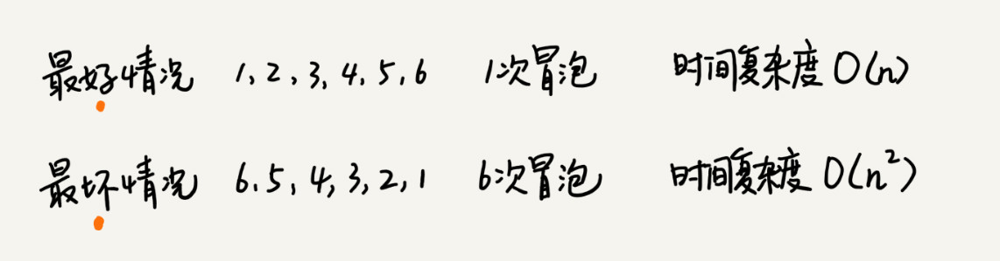

最好、最坏情况下的时间复杂度很容易分析，那平均情况下的时间复杂度是多少呢？我们前面讲过，平均时间复杂度就是加权平均期望时间复杂度，分析的时候要结合概率论的知识。

对于包含n个数据的数组，这n个数据就有n!种排列方式。不同的排列方式，冒泡排序执行的时间肯定时不同的。比如我们刚才举的例子中，其中一个要进行6次冒泡，而另一个只需要4次。如果用概率论方法定量分析平均时间复杂度，涉及的数学推理和计算就会很复杂。

这里还有一个思路，通过"**有序度**"和"**逆序度**"这两个概念来进行分析。

**有序度**是数组中具有有序关系的元素对的个数。有序元素对用数学表达式就是这样：

``` 
如果i < j，有序元素对：a[i] < = a[j]，就是一个有序元素对
```


同理，对于一个倒序排序的数组，如6,5,4,3,2,1， 其有序度是0；对于一个完全有序的数组，比如1，2，3，4，5，6，有序度就是n*(n-1) /2 ，也就是15.我们把这种完全有序的数组的有序度叫做**满有序度**。

> 第一种理解：假设一个完全有序的数组长度是N，则第1项与其后面的各项有N-1个组合，第2项与其后面各项有N-2个组合，第3项与其后面各项有N-3个组合，第N-1项与其后面各项有1个组合，第N项与其后面各项有0个组合。所以这个公式为：(N-1)+(N-2)+(N-3)+(N-4)+....+(N-1)+0 = (首项+末项)*项数 / 2 ，所以就等于 (N-1 + 0)\*N / 2
>
> 第二种理解：从N个元素中任意抽取2个元素，其形成的就是一个有序对，我们用Cn 2来做，怎么理解呢？ C这种排列，本身对于取的数的先后顺序是不做考虑的(取的两个数，先取哪个，后取哪个，这是一个方法)，而这里恰巧数据就是有序的，有序的意思，就是不用考虑两个数的先后顺序了。符合C排列的概念。Cn 2 = n!/(2! (n-2)!) = (n-1)n / 2

逆序度的定义正好跟有序度相反(默认情况下，我们称数据从小到大为有序)，我们应该可以想到了。

``` 
逆序元素对：a[i] > a[j]， 如果i < j。
```

关于这三个概念，我们还可以得到一个公式：**逆序度 = 满有序度 - 有序度** 。 我们排序的过程就是一种增加有序度，减少逆序度的过程，最后达到满有序读，就说明排序完成了。

我还是拿前面举的那个冒泡排序的例子来说明。要排序的数组的初始状态是4，5，6，3，2，1。其中，有序元素对有(4,5) (4,6) (5,6)，所以有序度是3。n=6，所以排序完成之后终究的满有序度为 n*(n-1) /2 = 15.


冒泡排序包含两个操作原子，**比较**和**交换**。每交换一次，有序度就加1。不管算法怎么改进，交换次数总是确定的，即为**逆序度** ， 也就是 n*(n-1)/2 - 初始有序度。此例子中就是15-3 =12，要进行12次交换操作。

对于包含n个数据的数组进行冒泡排序，平均交换次数是多少呢？ 最坏情况下，初始状态的有序度是 0，所以要进行n*(n-1) /2次交换。最好情况下，初始状态的有序度是n\*(n-1)/2，就不需要进行交换。我们可以取个中间值n\*(n-1)/4， 来表示初始有序度既不是很高也不是很低的平均情况。

换句话说，平均情况下，需要n*(n-1)/4次交换操作，比较操作肯定要比交换操作多，而复杂度的上限是O($n^2$) , 所以平均情况下的时间复杂度就是O($n^2$) .

这个平均时间复杂度推导过程其实并不严格，但是很多时候很实用，毕竟概率论的定量分析太复杂，不太好用。等我们讲到快排的时候，还会再次用这种"不严格"的方法来分析平均时间复杂度。


## 插入排序

我们来看一个问题。一个有序的数组，我们往里面添加一个新的数据后，如何继续保持数据有序呢？很简单，我们只要遍历数组，找到数据应该插入的位置将其插入即可。


这是一个动态排序的过程，即动态地往有序集合中添加数据，我们可以通过这种方法保持集合中的数据一直有序。而对于一组静态数据，我们也可以借鉴上面讲的插入方法，来进行排序，于是就有了插入排序算法。


### 插入排序的实现

插入排序具体是如何借助于上面的思想来实现排序的呢？

首先，我们将数组中的数据分为两个区间，**已排序区间** 和**未排序区间** 。初始已排序区间只有一个元素，就是数组的第一个元素。插入算法的核心思想是取未排序区间中的元素，在已排序区间中找到合适的插入位置将其插入，并保证已排序区间数据一直有序。重复这个过程，直到未排序区间中元素为空，算法结束。

如图所示，要排序的数据是4，5，6，1，3，2，其中左侧为已排序区间，右侧是未排序区间。


插入排序也包含两种操作，一种是**元素的比较**，一种是**元素的移动**。 当我们需要将一个数据a插入到已排序区间时，需要拿a与已排序区间的元素依次比较大小，找到合适的插入位置。找到插入点之后，我们还需要将插入点之后的元素顺序往后移动一位，这样才能腾出位置给元素a插入。

对于不同的查找插入点方法(从头到尾、从尾到头)，元素的比较次数是有区别的。但对于一个给定的初始序列，移动操作的次数总是固定的，就等于逆序度。

为什么说移动次数就等于逆序度呢？拿刚才的例子画了一个图表，来观察一下。满有序度是n*(n-1) /2 =15，初始序列的有序度是5，所以逆序度是10。插入排序中，数据移动的个数总和也等于10 = 3+3+4


下面可以看下插入排序的代码：

``` 
// 插入排序，a表示数组，n表示数组大小
public void insertionSort(int[] a, int n) {
  if (n <= 1) return;
  //外层的for循环，每次从无序的区间中取出一个元素
  //除去首个数组元素的值，一共要取n-1次
  for (int i = 1; i < n; ++i) {
    // 将取出的一个无序区间的一个数组元素的值，赋值给value
    int value = a[i];
    // 定义变量j，将i-1的值赋给j
    int j = i - 1;
    // 查找插入的位置
    // 依次从有序的区间的元素，从尾巴到头的方式去遍历
    // 每次取尾巴的一个元素，直至取到有序区间元素的头部元素
    for (; j >= 0; --j) {
      // 如果取出的有序序列中的元素大于，外层for循环取出的要插入的那个无序区间的那个元素
      if (a[j] > value) {
        // 就将a[j]的值赋值给a[j+1]
        // 由于有序的区间的元素都是从小到大排列的
        // 不存在有序区间中，一些大于value，一些小于value的数
        // 如果有序区间首个末尾的值要小于value
        // 那么取的这个外层的无序的要插入的这个元素，就插入在原来的位置上a[j+1] = value
        // 如果有序区间首个末尾的值要大于value
        // 那内部的for循环，每次去和有序区间元素比较的时候，
        // 都去将a[j]赋予到了a[j+1]的位置
        // 目的是空出a[j]的位置
        a[j+1] = a[j];  // 数据移动
      } else {
        break;
      }
    }
    // 上述循环结束后，就已经找到了需要在a[j]后面的位置
    // 是插入数据所要在的位置
    // 注意上述for循环结束后，j是--j，不满足上面的if条件，跳出了循环
    // 所以相应的是是a[j+1]才是新增数据的位置
    a[j+1] = value; // 插入数据
  }
}
```

现在来看三个问题：

第一，插入排序是原地排序算法吗？

从实现过程可以很明显地看出，插入排序算法的运行并不需要额外的存储空间，所以空间复杂度是O(1)，也就是说，这是一个原地排序算法。

第二，插入排序是稳定的排序算法吗？

在插入排序中，对于值相同的元素，我们可以选择将后面出现的元素，插入到前面出现的元素的后面，这样就可以保持原有的前后顺序不变，所以插入排序是稳定的排序算法。

第三，插入排序的时间复杂度是多少？

如果要排序的数据已经是有序的，我们并不需要搬移任何数据。如果我们从尾到头在有序数据组里面查找插入位置，每次只需要比较一个数据就能确定插入的位置。所以这种情况下，最好是时间复杂度为O(n)。注意，这里是**从尾到头遍历已经有序的数据**。

如果数组是倒序的，每次插入都相当于在数组的第一个位置插入新的数据，所以需要移动大量的数据，所以最坏情况时间复杂度是O($n^2$).

记得在数组中插入一个数据的平均时间复杂度是多少？是O(n)。所以，对于插入排序来说，每次插入操作都相当于在数组中插入一个数据，循环执行n次插入操作，所以平均时间复杂度为O($n^2$)


## 选择排序

选择排序算法的实现思路有点类似插入排序，也分已排序区间和未排序区间。但是选择排序每次会从未排序区间中找到最小的元素，将其放到已排序区间的末尾。


同理需要了解三个问题。

首先，选择排序空间复杂度是O(1)，是一种原地排序算法。选择排序的最好情况时间复杂度、最坏情况和平均情况时间复杂度都是O($n^2$) 

那选择排序是稳定的排序算法吗？

答案是否定的，选择排序是一种不稳定的排序算法。从我前面画的那张图中，可以看出来，选择排序每次都要找剩余未排序元素中的最小值，并和前面的元素交换位置，这样破坏了稳定性。

比如5，8，5，2，9这样一组数据，使用选择排序算法来排序的话，第一次找到最小元素2，与第一个5交换位置，那第一个5和中间的5的顺序就变了，所以就不稳定了。正是因此，相对于冒泡排序和插入排序，选择排序就稍微逊色了。

选择排序的代码示例：

``` 
// package array;
/*
 * 选择排序：  3,1,5,2,4,9,6,8,7
 * 稳点性差
 */
public class SelectSort {
	public static void selectSort(int [] x) {
		if(x.length!=0) {
			int temp = 0;
			for(int i = 0;i<x.length;i++) {
				int min = i;
				for(int j = i;j<x.length;j++) {
					if(x[j] <= x[min]) {
						min = j;
					}
				}
				temp = x[min];
				x[min] = x[i];
				x[i] = temp;
			}
		}
	}
	public static void main(String[] args) {
		int [] arr = {3,1,5,2,4,9,6,8,7};
		System.out.print("原始数组是：");
		for(int a :arr) {
			System.out.print(a+",");
		}
		selectSort(arr);
		System.out.println();
		System.out.print("排序之后的数组是：");
		for(int i = 0;i<arr.length;i++) {
			System.out.print(arr[i]+",");
		}
	}
 
}
```

最外面一层的for循环，表示的要进行多少次的排序，在一个n个元素的数组中，需要进行n次排序。内层的for循环，是用于在无序的各个数组元素中，通过比较选出一个最小的，然后放在有序的数列的末尾。

不管是最好最坏情况下，最外层的for循环n次是少不了。里面的for循环，各个元素的比较也是少不了了，最好最坏的差异只是在于，找到内层for循环的找到最小的元素时，貌似通过第三方变量交换的步骤，也少不了。

时间复杂度分析：

> https://blog.csdn.net/yuzhihui_no1/article/details/44339673
>
> 选择排序的时间复杂度不像前面几种排序方法那样，前面几种排序方法的时间复杂度不是一眼就能看出来的，而是要通过推导计算才能得到的。一般会涉及到递归和完全二叉树，所以推导也不是那么容易。但是选择排序就不一样了，你可以很直观的看出选择排序的时间复杂度：就是两个循环消耗的时间；
>
> ​    比较时间：T = （n-1)）+ （n -2）+（n - 3）.... + 1;  ===>>  T =  [n*(n-1) ] / 2；
>
> **交换时间：最好的情况全部元素已经有序，则 交换次数为0；最差的情况，全部元素逆序，就要交换 n-1 次；**
>
> ​    **所以最优的时间复杂度  和最差的时间复杂度  和平均时间复杂度  都为 ：O(n^2)**


## 解答开篇

冒泡排序和插入排序的时间复杂度都是O($n^2$)，都是原地排序算法，为什么插入排序要比冒泡排序更受欢迎呢？

我们前面分析冒泡排序和插入排序的时候讲到，冒泡排序不管怎么优化，元素交换的次数是一个固定值，是原始数据的逆序度。插入排序是同样的，不管怎么优化，元素移动的次数也等于原始数据的逆序度。

但是，从代码实现上来看，冒泡排序的数据交换要比插入排序的数据移动要复杂，冒泡排序需要3个赋值操作，而插入排序只需要1个。

``` 
冒泡排序中数据的交换操作：
if (a[j] > a[j+1]) {
    // 交换
    int tmp = a[j];
    a[j] = a[j+1];
    a[j+1] = tmp;
    flag = true;
}

插入排序中数据的移动操作：
if (a[j] > value) {
    // 数据移动
    a[j+1] = a[j];
} else {
    break;
}
```

我们把执行一个赋值语句的时间粗略地计为单位时间(unit_time)，然后分别用冒泡排序和插入排序对同一个逆序度是K的数组进行排序。用冒泡排序，需要K次交换操作，每次需要3个赋值语句，所以交换操作总耗时就是3*K单位时间。而插入排序中数据移动操作只需要K个单位时间。

这个只是非常理论的分析，为了实验，针对上面的冒泡排序和插入排序的Java代码，我们写了一个性能对比测试程序，随机生成10000个数组，每个数组中包含200个数据，然后在我们的机器上分别用冒泡和插入排序算法来排序，冒泡排序算法大约有700ms才能执行完成，而插入排序只需要100ms左右就能搞定。

所以，虽然冒泡排序和插入排序在时间复杂度是是一样的，都是O($n^2$)，但是如果我们希望把性能优化做到极致，那肯定首选是插入排序。插入排序的算法思路也有很大的优化空间，我们只是讲了最基础的一种。


## 内容小结

分析、评价一个排序算法，需要从执行效率、内存消耗和稳定性三个方面来看。因此，这里分析了三种时间复杂度都是O($n^2$) 的排序算法，冒泡排序、插入排序、选择排序。


在这三种时间复杂度为O($n^2$) 的排序算法中，冒泡排序、选择排序，可能就纯粹停留在理论的层面，学习的目的也只是为了开拓思维，实际开发中应用并不多，但是插入排序还是挺有用的。后面讲排序优化的时候，会讲到，有些编程语言中的排序函数的实现原理会用到插入排序算法。

今天学习的三种排序算法，实现代码都非常简单，对于小规模数据的排序，用起来非常高效。但是在大规模数据排序的时候，这个时间复杂度还是稍微有点高，所以我们更倾向于用下一节所用的时间复杂度为O(nlong n)的排序算法。


## D30(2020/10/17)

今天主要是对本周学习的基础知识内容，进行一次总结。

整理的内容涵盖了学习方法、复杂度分析方面的内容，数组，链表，栈，队列，递归以及排序的一部分的内容。


## 学习方法

在数据结构和算法这部分的知识来看，确实比较难，比较抽象，比较考验人的耐心。对于这门难啃的知识来说，我们首先思想要重视，不要认为看一遍就可以都会了，不要以为粗粗看看就行，不要以为这些都是些过时的、没用的知识，不要以为有侥幸的心理，要学会深究，学会反复思考。


### 数据结构和算法的概念

从广义上来看，数据结构就是指一组数据的存储结构，算法就是操作数据的一组方法。

从狭义上来看，是指某些著名的数据结构和算法。比如队列、栈、堆、二分查找、动态规划等。


### 数据结构和算法的关系是什么呢？

1. 数据结构是为算法来服务的，数据结构是静态的，它只是组织数据的一种方式。
2. 算法要作用在特定的数据结构之上的，孤立的数据结构是没有用的。
3. 例如，因为数据具有随机访问的特点，常用的二分查找算法炫耀用数组来存储数据，但是如果我们选择链表这种数据结构，二分查找算法就无法工作了，因为链表并不只是随机访问。


### 学习重点是什么

1. 先重点学习，算法的复杂度分析的内容，包括各种数据结构和相应算法的最好情况时间复杂度，最坏情况时间复杂度，平均情况时间复杂度。并且分别对应的那种情况的数据排列的情况。

2. 随后中重点是要学习的是常用的一些数据结构，以及对应的基于这些数据结构上的算法。

3. 共计20个常用的数据结构和算法。

   * 10个数据结构：数组、链表、栈、队列、散列表、二叉树、堆、跳表、图、Trie树。
   * 10个算法：递归、排序、二分查找、搜索、哈希算法、贪心算分、分治算法、回溯算法、动态规划、字符串匹配算法。


### 学习思维

1. 首先要学习这个数据结构和算法的"来历"，怎么会有出现这种数据结构或相应的算法的，之前的不香吗，之前的是出现了什么问题，要引入新的数据结构和算法呢？

2. 学习它的"自身特点"，每种特定的数据结构和算法，都有其各自的特点。这些特点，会体现在解决问题的新的思维上。包含了具体的算法实现上，结合我目前的实际情况，我重点关注的C++的实现，以及Java的实现，顺带着考虑Python的实现。考研的笔试中，会有相应的C++的编程题，而在复试的机试中会有相应的上机题。

   特别特别要注意，各种数据结构和算法的代码实现上，不要求一开始要掌握全部，不着急，慢慢来，常用的就那么几个，手指头都算的过来。把心思和精力放在，是否真的理解了，是否自己能不看材料，自己写出来。

3. 学习它的“适合解决的问题”，以及它的“实际应用场景”。新的数据结构和算法肯定要结合具体的场景来存在的，深入理解这些场景，就是为了从这些场景中，提取算法的共性，了解其算法的本质，进而可以推广应用到其他场景中去。


### 学习技巧

1. 边学边练，适度刷题
2. 学习的过程，是一个延迟享受的过程，克服自己焦躁的心态。多问、多思考、多互动，没有一个问题是愚蠢的问题。可以躲在留言区写下自己的疑问、思考和总结，也可以经常看看别人的留言，和他们进行互动。
3. 打怪升级法。通过设立目标，留言学习，每节课后都写一篇学习笔记或学习心得。
4. 知识需要沉淀，不要试图一下子掌握所有。学习知识的过程是反复迭代、不断沉淀的过程。如果碰到"拦路虎"，我们可以尽情在留言区提问，也可以先沉淀一下，过几天再重新学习一边。所谓，书读百遍其义自见。


## 复杂度分析

### 为什么需要复杂度分析？

1. 事后分析法的局限性

   通过统计、监控，就能得到算法执行的时间和占用的内存大小。

   但是，"事后"测试结果依赖测试环境，不同的测试环境中的测试结果是不一样的。"事后"测试的结果受到数据规模影响很大，数据量少的情况下，很难反应出程序代码的真正效率。

2. 这个时候，我们需要一个不用具体的测试数据，来粗略估计算法的执行效率的方法。


### 引入大O表示法

1. 从算法的执行效率，粗略来看，就是算法代码执行时间。

2. 我们假设每行代码都执行类似的操作，读取数据->运算->写数据的操作。

3. 假设每行代码执行时间都是一样的unit_time。 尽管每行代码对应的CPU执行的个数、执行的时间都不一样。但是，我们这里只是粗略的估计。

4. 示例代码一分析：

   ``` 
   int cal(int n) {
   	int sum = 0;
   	int i = 1;
   	for(; i<=n; ++i) {
   		sum  = sum + i;
   	}
   	return sum;
   }
   ```

   在这段代码中总的执行时间是，(2n+2)* unit_time。

5. 示例代码二分析：

   ``` 
   int cal(int n) {
   	int sum = 0;
   	int i = 1;
   	int j = 1;
   	for (; i<=n; ++i) {
   		j = 1;
   		for (; j <=n; ++j) {
   			sum  = sum + i*j;
   		}
   	}
   }
   ```

   在这段代码中，总的执行时间是，T(n) = (2$n^2$ + 2n +3) * unit_time.

   第2、3、4行代码，每行都需要1个unit_time的执行时间，

   第5、6行代码循环执行了n遍，需要2n 个unit_time的执行时间，

   第7、8行代码循环执行了$n^2$遍，所以需要2$n^2$个unit_time的执行时间。

   所以，整段代码总的执行时间是：T(n) = (2$n^2$ + 2n +3) * unit_time.


### 分析大O表示法

1. T(n) = O(f(n))

   T(n)表示的是代码执行的时间，n表示数据规模的大小；f(n)表示的是每行代码执行的次数总和。公式中的O，表示的是代码的执行时间T(n)与f(n)表达式成正比。

2. 用大O来表示

   在第一个例子中的T(n) = O(2n+2), 简写为T(n) = O(n).

   在第二个例子中的T(n) = O(2$n^2$ + 2n + 3)，简写为T(n) = O($n^2$)

3. 大O时间复杂度实际上并不具体表示代码的真正的执行时间，而是表示的是代码执行时间随着数据规模增长的变化趋势，所以也叫做渐进式时间复杂度，简称为时间复杂度。

4. 大O的演进

   分析代码的执行时间，假设每行代码中的执行时间都是一样的。--> 进而考虑的是每行代码的执行次数  --> 用大O来表示执行次数和执行时间的正比关系  --> 去除低阶、常量、系数，真正成为大O表示法。


### 时间复杂度分析

1. 只关注循环次数最多的一段代码。大O复杂度表示法，只是表示一种变化趋势。我们通常会忽略掉公式中的常量、低阶、系数，只需要记录一个最大阶的量级就可以了。

2. 加法法则

   所谓的加法法则，是指总的时间复杂度等于量级最大的那段代码的复杂度。

   例如，一个程序中有三段代码，综合这三段代码的时间复杂度，我们取其中最大的量级。所以，整段代码的时间复杂度就是O($n^2$) .

3. 乘法法则

   所谓的乘法法则，是指嵌套代码的复杂度，等于嵌套内外代码复杂度的乘积。

   可以把乘法法则看成是**嵌套循环**。


### 常见时间复杂度分析

在我们常见的时间复杂度分析的常见量级中，大致可以分为 非多项式量级和多项式量级。


#### 非多项式量级

所谓的非多项式量级中，只有两个：O($2^n$) 和O(n!) 。

非多项式的问题，也就是所谓的NP(非确定多项式)问题。

在上述的两种非多项式量级中，都是非常低效的。

当数据规模n越来越大的时候，非多项式量级算法的执行时间会急剧增加，求解问题的执行施加会无限增长。所以，非多项式时间复杂度的算法其实是非常低效的算法。


#### 多项式量级

在所谓的多项式量级的分类中，我们大致分为三大类：常量级O(1)，对数级O(logn)和O(nlog n)，还有就是复杂度是由两个数据的规模来决定的，O(m+n)和O(m*n)。


##### O(1)

表达的是常量级的时间复杂度，这里的1并不是说只执行一行代码，而是指只要代码执行时间不随n的增大而增大，这样代码的时间复杂度都可以记住O(1).

一般情况下，只要算法中不存在循环语句、递归语句，即使有成千上万的代码，其时间复杂度也是O(1)。


##### O(log n)

在下面的示例代码中，就是一个O(log n)的代码复杂度。

``` 
i = 1;
while (i<=n) {
	i = i*2;
}
```

变量i的值从1开始取，每循环一次就乘以2，大于n时，循环结束。

变量i的取值就是一个等比数列：

$2^1$ , $2^2$ , $2^3$ , $2^4$ , ... $2^k$ ... $2^x$ 

我们这里先假设当2的x次方的值等于 n的时候，恰好循环结束。通过求解x的值，根据对数的知识可知， x = $log_2 n$ ，所以代码复杂度就是O($log_2 n$)

我们知道对数之间是可以相互转换的，例如$log_3 n$ 就等于$log_3 2$ * $log_2 n$ ，所以我们可以得知O($log_3 n$) = O(C* $log_2 n$) ，其中 C= $log_3 2$就是一个常量。

所以对我们来说，我们可以忽略系数，忽略对数的"底"，所以说，我们在对数阶的时间复杂度的表示方法中，我们忽略了对数的"底"，统一表示为O($log n$)


##### O(nlogn)

通过乘法法则，n与log n嵌套循环。


##### O(m+n)/O(m*n)

在这里，复杂度是由两个数据的规模来决定的。我们无法事先评估m和n两个数的谁的量级大，不能简单利用加法法则，来忽略掉其中一个。

例如下面的代码：

``` 
int cal(int m, int n) {
	int sum_1 = 0;
	int i = 1;
	for (; i<m; ++i) {
		sum_1 = sum_1 + i;
	}
	int sum_2 = 0;
	int j = 1;
	for (; j<n; ++j) {
		sum_2 = sum_2 + j;
	}
	return sum_1 + sum_2;
}
```

在上面的例子中，我们无法判断是m的量级大还是n的量级大，所以，这里只能是O(m+n)。


### 空间复杂度分析

1. 表示算法的存储空间与数据规模之间的增长关系。

2. 一般是指算法额外申请的内存空间的情况。

3. 与时间复杂度分析的区别来看，时间复杂度看的是算法的执行时间，更进一步来说是，代码中某一行的执行次数与数据规模之间的增长关系。而空间复杂度看的是算法的内存空间，是这个代码使用的内存空间与数据规模之间增长的关系。

4. 空间复杂度分析示例：

   ``` 
   void print(int n) {
   	int i = 0;
   	int[] a = new int[n];
   	for (i; i<n; ++i) {
   		a[i] = i*i;
   	}
   	for (i = n-1; i>=0; --i) {
   		print out a[i]
   	}
   }
   ```

   在第3行中申请了一个大小为n的int类型数组，整段代码的空间复杂度就是O(n).


### 低阶到高阶的排序

从低阶到高阶的排序如下：

O(1) < O($log n$) < O(n) < O(n$log n$) < O($n^2$) 


## D31(2020/10/19)

今天继续对之前学习的数据结构和算法的知识点进行整理。

主要涵盖的是复杂度分析、数组、链表、栈、队列、递归以及排序的一部分的内容。


## 复杂度分析

### 最好/最坏时间复杂度

#### 引入最好/最坏时间复杂度

例如下面的代码中，主要的功能是从一个数组中，找到数据元素值为x的元素，然后返回对应的数组下标。

``` 
int find(int[] array, int n, int x) {
	int i = 0;
	int pos = -1;
	for (; i<n; ++i) {
		if (array[i] == x) {
			pos = i;
		}
	}
	return pos;
}
```

由于代码中没有break强制的退出，也就是说即使已经找到某个值的数组元素，也要执行完整个for循环。时间复杂度不分情况，都是O(n).


#### 进一步分析

我们对上面的代码进行优化，在数组中查找一个数据，并不需要每次都把整个数组都遍历一遍，因为有可能中途找到了几可以提前结束循环了。

``` 
int find(int[] array, int n, int x) {
	int i = 0;
	int pos = -1;
	for (; i<n; ++i) {
		if (array[i] == x) {
			pos = i;
			break;
		}
	}
	return pos;
}
```

从上面的代码可以看出，由于查找变量x 可能出现在数组的任意位置。

最好情况下，如果数组中第一个元素正好是要查找的变量x，那就不需要继续遍历剩下的n-1个数据了，那此时的时间复杂度就是O(1)。

但是如果数组中不存在变量x，那么这个时候我们就需要把整个数组都遍历一遍，这个时候的时间复杂度就成了O(n)了。


### 平均时间复杂度

如果我们想要考虑的是这个代码在平均情况下的时间复杂度的情况呢？

还是上面从数组中find数组元素的代码，查找的变量x在数组中的位置，有n+1种的情况，也就是在数组的0~ n-1的位置中，和不在数组中。

一般思维：我们统计出所有情况下，代码的执行的次数，然后将这些次数进行累加起来求和。然后再除以n+1种情况，以求解到这个代码遍历元素个数的平均数了。$\frac{1+2+3+...+n+n}{n+1}$ = $\frac{n(n+3)}{2(n+1)}$  ，所以这种情况下，我们可以判断出这个平均时间复杂度就是O(n).

仔细思考：n+1种情况，出现的概念并不是一样的。我们可以分析出每种情况的出现的概率，然后每种情况遍历比较的次数 *  该种情况出现的概率，将所有的这些情况都累加起来，得到的就是一个加权的平均数了。

例如，我们要查找的变量x，要么在数组里，要么就不在数组里面。这两种情况对应的概率统计起来很麻烦，为了方便理解，我们假设在数组中与不在数组中的概率都是1/2。另外，要查找的数据出现在0~n-1这n个位置的概率也是一样的，为1/n。所以，根据概率乘法法则，要查找的数据出现在0~n-1种任意位置的概率就是1/(2n).

1$\times$$\frac{1}{2n}$ + 2$\times$$\frac{1}{2n}$ + 3$\times$$\frac{1}{2n}$ + ... + n$\times$$\frac{1}{2n}$ + n$\times$$\frac{1}{2}$ = $\frac{3n+1}{4}$

我们得到的加权平均值就是(3n+1)/4 ，由此可以得到平均时间复杂度仍然是O(n).


### 均摊时间复杂度

#### 总体概述

相比与平均时间复杂度，均摊时间复杂度的使用场景，更为特殊。有哪些场景可以用的上均摊时间复杂度呢？

* 对一个数据结构进行**一组连续操作**中，大部分的情况下的时间复杂度都很低，只有在个别情况下的时间复杂度比较高。
* 这些连续的操作之间，**存在前后连贯的时序关系**，可以将这一组操作放在一块儿分析。
* 看的是，能否将这些较高的时间复杂度那次操作的耗时，平摊到其他的那些时间复杂度比较低的操作上。
* 在能够引用均摊时间复杂度分析的场合中，一般均摊时间复杂度就等于最好情况下的时间复杂度。


#### 摊还分析法

简而言之，就是利用摊还分析法，来得到均摊时间复杂度。

例如，每一次O(n)的插入操作，都会跟着n-1次的O(1)的插入操作。耗时多的那次操作摊到接下来的n-1次耗时少的操作上。通过均摊下来，这一组连续的操作的均摊时间复杂度就是O(1)了。

我的理解，那一次的O(n)的插入操作的循环代码的次数为n，也就是n个unit_time。将n个单位的unit_time平均摊派到前面的n-1次中，大致每一次都能分到一个unit_time，这样的话，还是O(1)的时间复杂度。由于这个每一次的插入操作的概率都是相同的，所以这种均摊是可以成立的。


#### 代码示例

代码中，是一个连续的往数组中插入的操作，数组未满时，赋予相应的数组元素对应的值，并且将count++。当数组满的时候，将现有的数组中的各个元素求和赋予给第一个数组元素的值，同时将count置为1，以便于后面继续从1开始插入元素。

``` 
// array 表示一个长度为n的数组
// 代码中的array.length就等于n 
int[] array = new int[n];
int count = 0;

void insert(int val) {
	if (count == array.length) {
		int sum = 0;
		for (int i =0; i < array.length; ++i) {
			sum = sum + array[i];
		}
		array[0] = sum;
		count = 1;
	}
	array[count] = val;
	++count;
} 
```

这个代码是有个循环在反复的调用的。理想的情况下，数组中有空闲的元素位置(count未到数组的大小值)，我们只需要将数据插入到数组下标为count的位置就可以了，所以最好情况时间复杂度是O(1)。

最坏情况下，数组中没有空闲位置了，我们需要先做一次数组的遍历求和，然后再将数据插入，所以最坏情况时间复杂度是O(n)。

平均情况下，假设数组的长度是n，根据数据插入的位置的不同，我们可以分为n种情况，每种情况的时间复杂度是O(1)。除此之外，还有一种"额外"的情况，就是在数组中没有空闲空间的的时候插入一个数据时，这个时候的时间复杂度是O(n)。而且，这个n+1种情况发生的概率是一样的，都是1/(n+1)。所以，根据加权平均的计算方法，我们求到的平均时间复杂度就是：1* $\frac{1}{n+1}$ + 1* $\frac{1}{n+1}$ +... + 1 * $\frac{1}{n+1}$ + n * $\frac{1}{n+1}$  -->  O(1)


### insert()与find()代码比较

#### 第一个区别

* find()函数在极端的情况下，复杂度才是O(1)
* insert()在大部分的情况下，时间复杂度都是O(1)
* insert()只有在个别的情况下，复杂度才比较高，为O(n)


#### 第二个区别

对于insert()函数来说，O(1)的时间复杂度的插入和O(n)的时间复杂度的插入，出现的概率是非常有规律的，而且有一定的前后时序的关系，一般的都是一个O(n)插入之后，紧跟着n-1个O(1)的插入操作(是指已经满的情况下产生的规律)，循环往复。


## 数组

### 基本概念

1. 数组array是一种线性表的数据结构
2. 数组是用一组连续的内存空间，来存储一组具有相同类型的数据。
3. 重点理解:
   * 第一是线性表。线性表就是数据排成像一条线一样的结果；每个线性表上的数据**最多只有**前和后两个方向；除了数组之外，链表、队列、栈等也是线性表的结构；非线性表有二叉树、堆、图，这些数据之前并不是简单的前后关系。
   * 第二，连续内存空间和相同数据类型。这种数据结构的特点优势，就是可以"随机访问"；劣势在于，删除/插入数据，都需要数据移动。


### 随机访问实现原理

1. 计算机会给每个内存单元分配一个地址。
2. 计算机通过地址来访问内存中的数据。
3. 随机访问数组中某个元素的时候，由于连续内存空间，可以通过寻址公式来查找。`a[i]_address = base_address + i * data_type_size`
4. 例如，int数组元素是需要有4个字节。内存块的首地址是base_address = 1000，那么a[3]地址是: 1000 + 3*4


### 数组的时间复杂度描述

1. 数组适合查找，但是其查找的时间复杂度并非是O(1)。
2. 数组支持随机访问，我们可以根据下标来访问数组元素，其时间复杂度是O(1).
3. 即使数组元素有序时，二分查找法的时间复杂度也是O(log n)


### 低效的"插入"

#### "插入"操作

假设线性表的长度是n，现在，如果我们需要将一个数据插入到数组中的第K个位置。为了把第K个位置腾出来，给新插入的数据，我们需要将第k~n这部分的元素都顺序地往后挪一位。

1. 如果在线性表末尾插入元素，就不需要移动数据了，这个时候的时间复杂度为O(1)，也是最好情况的时间复杂度。
2. 如果我们从数组的头部来插入元素，那所有元素都需要依次往后移动一位，所以最坏的时间复杂度是O(n)
3. 在每个位置上插入元素的概率都是一样的，平均时间复杂度是O(n)。在一个数组大小为n中，有n个插槽，每个位置的概率都是一样的，都是1/n。而出现在不同的位置上，需要移动的元素的个数是不一样的，在末尾的话是0，倒数第二个是1，倒数第二位是2 ....   直至开头是n。根据加权平均数的求解，那就是1* 1/n + 2* 1/n ... + n* (1/n) = (n+1)/2 ，也就是O(n)。


#### 降低"插入"时间复杂度

如果数组中存储的数据并没有任何规律，数组只是被当作一个存储数据的集合。

如果要将某个数据插入到第K个位置，为了避免大规模的数据搬移。我们就需要直接将第k位的数据搬移到数组元素的最后。然后把新的元素直接放入第k个位置，这个时候的时间复杂度就降为O(1)。


### 低效的"删除"

#### "删除"操作

跟插入数据类似，如果我们要删除第k个位置的数据，为了保证内存的连续性，也需要搬移数据。不然的话，中间就会出现空洞，内存就不连续了。

如果删除线性表末尾的数据，则最好情况下时间复杂度是O(1)；如果删除线性表开头的数据，那所有元素都需要依次往前移动一位，最坏情况时间复杂度是O(n)；每个位置删除元素的概率也是一样的，参照上面分析的插入的平均时间复杂度来看，是为O(n)。


#### 连续删除更高效

1. 原先的情况下，如果删除多个元素，之前的数组，就需要将数据移动多次了。
2. 在某些特殊的场景下，我们并不一定非得追求数组中数据的连续性。
3. 这个时候的话，我们每次的删除操作并不是真正地搬移数据，只是记录数据已经被删除。
4. 当数据中，没有更多空间来存储数据的时候，就触发执行一次真正的删除操作。
5. 这样的好处在于，可以大大减少了删除操作导致的数据搬移。


### 数组越界问题

在下面的代码中，由于在for循环的结束条件中错写了i < =3，而非 i<3，结果就导致了数据越界。该段代码会无限打印 "hello world"

``` 
# include <stdio.h>
int main(int argc, char* argv[]) {
	int i =0;
	int arr[3] = {0};
	for (; i<=3; i++) {
		arr[i] = 0;
		printf("%s","hello world\n");
	}
	return 0;
}
```

原因在于，函数体内的局部变量存在栈上，且是连续压栈。

在Linux进程的内存布局中，栈去在高地址空间，从高向低增长。在上面的main 函数中，首先向函数的栈区压入i = 0，紧接着是一个int attr[3]，也就是一个陆续压入了attr[2]、attr[1]、 attr[0]。我们知道数组的内存空间是从低到高的，而栈区的内存地址是从高到低的。

当我们通过attr[3]寻址公式，计算得到地址正好是i的存储地址，所以当对attr[3] = 0 ,也就是对i赋值为0了，结果导致了无限循环打印。


### 高级语言的容器类与数组

#### 容器类的优势

1. ArrayList最大的优势就是可以将很多数组操作的细节封装起来了。比如前面提到的数组插入、删除数据时需要搬移其他数据等。
2. ArrayList支持动态扩容，使用ArrayList，我们就完全不需要关心底层的扩容逻辑了，ArrayList已经帮我们实现好了，每次存储空间不够的时候，它都会将空间自动扩容为1.5倍大小。
3. 为了避免频繁内存的申请和数据搬移，ArrayList最好事先指定数据大小。
4. 在业务的开发中，直接使用容器类，可以省时省力，只会损耗一点点性能。


#### 单独使用数组的场景

1. ArrayList无法存储基本类型，比如int、long，需要封装为Interger、Long类，而Autoboxing、Unboxing则有一定的性能损耗。
2. 如果数据大小事先已知，并且对数据的操作非常简单，用不到ArrayList提供的大部分方法。
3. 在多维数组的使用上，更加清晰的使用。
4. 在基于底层架构开发的时候，可以将性能优化到极致。


### 为何数组从0开始

"下标"最确切的定义应该是"偏移(offset)"，a[0]就是偏移量为0的位置。这个时候，计算a[k]的内存地址只需要使用下面的这个公式：`a[k]_address = base_address + k*data_type_size`

如果数组从1开始，多一层CPU减去指令。这个时候，计算数组元素a[k]的内存地址就会变成，a[k]_address = base_address + (k-1)* data_type_size.


### 二维数组寻址公式

一维数组的寻址公式为：

`(a1)*[i]_address = base_address + i* type_size`

二维数组的寻址公式为：

`(a1*a2)* [i][j]_address = base_address + (i*a2 +j) * type_size`

a2是列的长度，一定要走完i * a2的长度，随后在a\[i][o] 的位置开始，往后找j 个长度就是 a[i] [j] 了。

 

## 链表

这个章节，主要整理的是链表的知识点的内容。


### 引入链表

由于数组需要一块连续的内存空间，如果这个时候没有连续的、足够大的内存空间的话，就会申请失败。注意：Java的ArrayList不存在这个问题。

这个时候，就引出了链表，申请一个链表，不需要连续的空间，链表通过"指针"将一组零散的内存块串联起来。


### 单链表

在描述单链表的信息时，从基本概念入手，随后讲解单链表的相关操作：单链表的查询、单边表的插入/删除。


#### 基本概念

1. "结点"，在链表中，一个内存块就被称为一个"结点"。
2. "后继指针next"：记录下一个结点地址的指针。
3. "头结点"：通常我们认为是，放在第一个元素结点之前的一个节点，其数据域一般无意义(也可以存放链表的长度)，头结点可有可无。
4. "头指针"：在链表中，头指针是必须要存在的。若存在头结点，头指针是指向头结点的；但是若不存在头结点，头指针指向第一个结点元素。
5. 第一个元素结点，顾名思义，就是第一个存放元素值的节点。
6. "尾结点"：是指最后一个结点。
7. 尾结点的next指针指向一个空地址NULL，或者可以说，当一个结点的next指针指向NULL空地址的时候，这个就表示这个结点是链表上的最后一个结点了。


#### 单链表的查询操作

当需要随机访问链表的第K个元素的时候，这个场景下面，就和数组有很大的不同了。

需要根据指针一个结点一个结点的一次遍历，单链表的随机访问没有数组好，需要O(n)的时间复杂度。


#### 单链表的插入/删除操作

1. 数组的插入/删除操作，需要保证内存连续性，为了保证数组内存的连续性，在做插入/删除操作的时候，要配套做大量的数据搬移工作，其时间复杂度是O(n)。
2. 链表的插入/删除操作，不需要考虑内存的连续性，也不需要进行数据搬移。只需要改变相邻结点的指针，理论上其时间复杂度是O(1)


### 循环链表

循环链表是特殊的单链表，与单链表唯一的区别在于尾结点。

单链表的尾结点的指针指向的是NULL，循环链表的尾结点指针指向链表的头结点(或者说是第一个元素结点)，这种把链尾和链头连接了起来，适合处理环形的数据结构。


### 双向链表

#### 基本概念

1. 双向链表与单链表相比，多了一个前驱指针prev。
2. 前驱指针prev，会指向前面的结点。
3. 后继指针next，指向后面的结点。
4. 缺点：双向链表需要额外存储两个指针。
5. 优点：支持向前向后(双向)遍历。


#### 删除操作

在双向链表中，对某个结点的删除，有两种场景，第1种场景是：删除结点中"值等于某个给定值"的结点；第2种场景是：删除给定指针指向的结点。


##### 删除"值等于某个给定值"的结点

1. 我们要先遍历定位要删除的元素，这时候的遍历的程序代码的时间复杂度是O(n)。
2. 执行删除查询到的结点，这个删除的操作的时间复杂度是O(1)。
3. 在这种场景下，双链表的删除操作和单链表的删除操作都是一样的，都需要先一个个遍历，时间复杂度也是相同的。


##### 删除给定指针指向的结点

在这个场景中，就意味着不用我们再去遍历，找到需要被删除的元素了，而是直接去删除指向这个元素的相应的指针就可以了。

1. 首先，我们已经找到了要删除的结点。
2. 但是，删除结点，需要知道该结点的前驱指针，这个结点的前驱指针指向的是前面的那个结点，我们需要改写前面结点的后继指针，将这个指针指向其他的结点。
3. 单链表不支持直接获取其前面结点的指针。单链表需要从头开始遍历链表，这个时候的时间复杂度是O(n)。
4. 但是双向链表，可以通过"删除结点"的前驱指针来找到前面的结点了。
5. 这个时候的双向链表的删除操作的时间复杂度是O(1)


#### 插入操作

对于双向链表而言，可以选择插入到某个结点后面，或者是插入到某个结点前面。


##### 插入到某个结点后面

在这个时候，单链表和双链表的时间复杂度就都是一样的了。因为这种场景下，单链表已经知道了"要插入的位置的前面结点"的信息了。


##### 插入到某个结点前面

这个时候，如果是单链表的话，操作的步骤和删除操作类似，需要先遍历找到前面结点的信息。这个时候单链表的时间复杂度是O(n)，双链表的操作和上面的删除操作是一样的，时间复杂度是O(1)。


#### 查询

如果链表是无序的话，单链表和双链表的查询的时间复杂度都是一样的。

如果链表是有序的，双向链表按值来查询要比单链表要高，双向链表可以根据查询到的值，和目标值进行比较，决定是往前查找，还是往后查找。


#### 应用场景

在实际的开发过程中，大多数使用的双向链表。虽然会多存储一些内存空间，这也是用空间换时间的设计体现。


### 数组与链表的比较

#### 从内存是否连续上

数组简单易用，需要连续的内存空间，可以借助CPU的缓存机制，预读数据，访问效率高。

链表在内存中是非连续的，对CPU缓存不友好，无法预读数据。


#### 动态扩容上

数组如果过小，需要申请更大的内存，这个时候需要原来的数组都拷贝过去，非常耗时。

链表本身没有大小限制，天然的就支持动态扩容。

与数组相比，链表更适合插入/删除操作频繁的场景。


### 书写链表代码

#### 理解指针或引用的含义

在C语言中是有指针的概念的，而在Java、Python中是没有指针的概念的，取而代之的是引用的概念。

我们可以将某个变量的地址赋值给指针。这样的话，这个指针中就纯粹了这个变量的内存地址，指向了这个变量。通过指针我们就能够找到这个变量。


#### 警惕指针丢失和内存泄漏

由于在链表的删除中，可能会由于指针指向的问题，结果就导致了有些链表分成了两个部分。或者说是某个链表结点的指向性丢失了，也就是说无法去释放这些空间的内存了。

程序本身自己是无法知道这部分内存空间在哪里了，更加无法去释放了。


#### 利用哨兵来简化实现

我们在单链表中的插入和删除操作中，如果我们在结点p后面插入一个新的结点，只需要下面两行代码就可以了。

``` 
new_node->next = p->next;
p->next = new_node;
```

但是，当我们要向一个空链表中插入第一个结点时，上面的代码就不能用了。我们需要进行下面的特殊处理，其中 head表示链表的头结点。所以，从这段代码来看，我们可以发现，对于单链表的插入操作，第一个结点和其他结点的插入逻辑是不一样的。

``` 
if (head == null) {
    head = new_node;
}
```

我们再来看下单链表中的结点删除操作。如果要删除结点p的后继结点，我们只需要一行代码就可以搞定。

`p->next = p->next->next;`

但是，如果我们要删除链表中的最后一个结点，前面的删除代码就不work了。跟插入类似，我们也需要对这种情况特殊处理。写成代码如下：

``` 
if (head->next == null) {
    head = null;
}
```

从前面的操作可以看出，针对链表的插入、删除操作，需要对插入第一个结点和删除最后一个结点的情况来进行特殊处理。

为了考虑代码的简洁，可以利用哨兵。引入哨兵结点，在任何时候，不管链表是不是空，head指针都会一直指向这个哨兵结点。我们也把这种有哨兵结点的链表叫做**带头链表**。相反，没有哨兵结点的链表就叫做**不带头链表**。

哨兵结点不存储数据，因为哨兵结点一直存在，原来的插入第一个结点的场景  --> 就是在哨兵结点后插入结点；删除最后一个结点的场景  --> 这个不是最后一个结点，删除后，还有个哨兵结点。


#### 留意边界条件

考虑的边界条件有，链表为空的时候；链表只包含一个结点的时候；链表包含两个结点的时候；处理头结点和尾结点的时候。


## 栈

### 什么是栈

后进者先出，先进者后出，这就是典型的"栈"结构。

栈是一种"操作受限"的线性表，只允许在一端插入和删除数据。


### 栈存在的意义

从功能上来看，数组或链表都可以替代栈。

了解到特定的数据结构是对特定场景的抽象，数组或链表暴露了太多的操作接口，在操作撒花姑娘的确灵活自由，但是在使用上就比较不可控了，自然就更容易出错。

栈的数据结构，是应用于当某个数据集合只涉及在一端插入和删除数据的场景，并且满足于后进先出、先进后出的特性的时候，我们就应该首选"栈"这种数据结构。


### 如何实现一个"栈"

用数组来实现的栈，是顺序栈；用链表来实现的栈，是链式栈。栈一般来说有两个操作，入栈(在栈顶插入一个数据)，出栈(从栈顶删除一个数据)。

在栈的使用中，我们需要强化一下空间复杂度的概念，我们所说的空间复杂度，是指除了原本的数据额外的存储空间外，算法运行还需要额外的存储空间。

不管顺序栈还是链式栈，不管是入栈还是出栈，时间复杂度都是O(1)。


### 栈在函数调用中的应用

场景描述是，函数调用栈。

1. OS会给每个线程分配一块独立的内存空间。
2. 这块内存被组织成"栈"这种数据结构。用来存储函数调用时的临时变量。
3. 每进入一个函数，就会将临时变量作为一个栈帧入栈。
4. 当调用函数执行完成后，返回之后，会将这个函数对应的栈帧出栈。


### 栈在括号匹配中的应用

场景的描述是，我们可以借助栈来检查表达式的括号是否匹配。

1. 我们可以把([{ 这些都叫做左括号，}])这些都叫做右括号。
2. 我们用栈来保存未匹配的左括号
3. 从左到右一次扫描字符串
4. 当扫描到左括号的时候，将其压入栈
5. 当扫描到右括号的时候，从栈顶取出一个左括号，如果这是时候能匹配的上，则继续扫描剩下的字符串；如果不能匹配，或栈中没有数据的话，则说明为非法格式。


### 栈在页面前进后退中的应用

我们可以用栈，来实现网页的前进和后退。

1. 我们可以借助于两个栈来实现。
2. 首次浏览页面的时候，依次压入X栈。
3. 后退的时候，依次从X栈中弹栈，放入Y栈。
4. 前进按钮，依次从Y栈中取出数据，放入X栈。
5. 当访问新页面的时候，压入X栈，同时清空Y栈。
6. 当X栈没有数据的时候，表明无法进行后退了。
7. 当Y栈没有数据的时候，表明无法前进了。


## D32(2020/10/21)

今天主要是要完成队列、递归，以及排序的一部分的内容。


## 队列

### 引出队列

我们在线程池，多并发的开发场景中，这个时候如果线程满了。我们该如何去处理新的线程请求呢？拒绝请求还是排队请求呢？


### 理解"队列"

先进先出，就是典型的"队列"。与栈有些类似，都有两个基本的操作，入队和出队的操作。我们是从队尾入队，从队头出队。与栈类似，队列是一种操作受限的线性表。


### 顺序队列/链式队列

从队列的定义来看，我们把用数组来实现的队列叫做顺序队列；把用链表实现的队列叫做链式队列。


#### 顺序队列的两个指针

head指针，指向队头元素；tail指针，指向队尾元素的下一个位置，需要注意的是tail指针指向的不是队尾元素，而是队尾的下一个，这么做是为了区分队列为空和队列中只有一个元素的两种场景。

判断队列为空的条件：head == tail 

判断队列只有一个元素：tail - head = 1


#### 顺序队列入队

当tail == n的时候，也就是说队列末尾没有空间了，但是，不存在当tail == n的时候的数组a[tail]。

只有当tail == n并且head == 0的时候，表示队列都占满了。这个时候将触发数据搬移工作，当数据搬迁完以后，再更新head和tail .

``` 
for (int i = head; i< tail; ++i) {
    item[i-head] = items[i];
}
```

更新tail和head指针

``` 
tail = tail - head;
head = 0;
```

如果当队列中队尾还有空间，直接一个插入操作就可以了，这个时候对于顺序队列的插入而言，是最好情况下的时间复杂度，此时为O(1)。

当队列中没有空间的时候，for循环来搬移元素，会执行n-1次  ??

当频繁调用顺序队列入队列的时候，从队列为空开始吗，入一个队列，出一个队列的方式的话，这种情况下的程序的代码复杂度是从O(1)到O(n)，利用摊还分析法来看的话是O(1)。


#### 链表队列

在链表队列中，head指针指向的是链表的第一个结点，tail指针指向的是最后一个结点，在入队的时候，可以做如下的操作：

在入队的时候，主要有下面的两个代码：

``` 
tail->next = new_node
tail = tail->next
```

我们将新结点的内存地址，赋值给了原来的tail->next，原来的链表的tail->next指向的是null。这样的话，新结点就可以连接上了原来的链表的后的一个元素了。最后，再修改tail的指针。

出队列的时候，`head = head->next`


#### 循环队列

引入循环队列：

为什么要引入循环队列呢？在原有的顺序队列中，当tail == n的时候，会有数据搬移的操作，循环队列就是为了避免搬移操作。

在循环队列中，我们是将顺序队列首尾相连。

当达到head == tail 的场景中，这是判断队列为空的条件。

当达到(tail+1)%n = head的时候，这个时候是判断队列满的条件，在这个时候tail指向的位置实际上没有存储数据的，这会浪费一个数组的元素的存储空间。

入队列的时候，我们需要移动tail指针，`iterms[tail] = item; tail = (tail+1)%n;`

出队列的时候，我们需要移动head指针，`String ret = iterm[head]; head = (head+1)%n;`

不管是head还是tail，加上1后，然后对n取余的目的，在于逆时针移动一格。


#### 阻塞队列

我们在队列的基础上增加了阻塞的操作。当队列为空的时候，从队头取数据会被阻塞直到队列中有了数据才能返回；当队列满的时候，插入数据的操作会被阻塞，直到队列中有空闲位置后再插入数据，再返回；基于阻塞队列可以实现"生产者 - 消费者模型"，通过协调"生产者"和"消费者"的个数，可以提高数据的处理效率。


#### 并发队列

当几个线程同时操作队列的时候，会引发线程安全的问题。

当多个线程访问某个方法的时候，不管你通过怎样的调用方式或者说这些线程如何交替的执行，我们在主程序中不需要去做任何的同步，这个类的结果行为都是我们设想的正确行为，那么我们就可以说这个类是线程安全的。

但是如果多个线程操作共享变量的时候，就会出现错误了。

线程安全的队列，也叫做并发队列。最简答的直接实现方式是，在enqueue()、dequeue()方法上加锁，实际上基于数组的循环队列(避免搬移数据)的CAS原子操作，可以实现高效的并发队列。


## 递归

理解递归，去的过程叫"递"，回来的过程叫"归"。

所有的递归问题都可以用递推公式来表示，例如f(n) = f(n-1) +1，其中f(1)=1.


### 递归的三个条件

当打算使用递归的时候，必须满足下面三个条件的内容：

1. 一个问题的解可以分解为几个子问题的解。
2. 这个问题与分解之后的子问题，除了数据规模的不同，求解的思路是完全一样的。
3. 存在递归终止的条件。


### 如何写"递归"代码

1. 关键在于找到如何将大问题分解为小问题的规律
2. 基于分解后的小问题，来写出相应的递推公式
3. 再写出推敲递归终止的条件。
4. 最后将递推公式和终止条件都翻译成代码。


### 递归代码的注意点

1. 抽象成一个递推公式。
2. 不用去想一层层的调用关系。
3. 不要试图用人脑去分解递归的每个步骤。
4. 警惕堆栈的溢出，可以通过限定深度大小的方式，适用于最大深度比较小的情况下。
5. 警惕重复的计算，可以利用散列表来存放已经求解的值。
6. 警惕空间复杂度。


## 排序

### 如何分析一个"排序算法"

#### 排序算法的执行效率

排序算法的执行效率来看，可以分为最好情况/最坏情况/平均情况时间的复杂度，我们需要了解到最好情况下要排序的原始数据是什么样的，最坏情况下要排序的原始数据是什么样的。

当我们对同一阶时间复杂度的排序算法进行性能比较的时候，要把系数、常数、低阶也要考虑进去。

在基于比较的排序算法中，这里会涉及到两种操作：一种是元素比较大小，一种是元素交换或移动。


#### 排序算法的内存消耗

在分析一个排序算法的时候，要考虑到算法的空间复杂度的情况，当我们描述一个排序算法是一个原地的排序算法的时候，特指这个程序的空间复杂度是O(1)的排序算法。


#### 排序算法的稳定性

一般来说，如果待排序的序列中存在值相等的元素，经过排序之后，相等的元素之间原有的先后顺序不变。如果是这种情况的话，我们就说这个排序算法是稳定的。

同理而言，如果同值的两个数，排序后，前后顺序发生了变化，这个时候，我们就称这个排序算法是不稳定的排序算法。


### 有序度

有序度是指，在数组中具有有序关系的元素对的个数。

如果i<j，有序元素对：a[i] <= a[j]，这种情况，就叫做一个有序对。

逆序度：

数组中具有逆序关系的元素对的个数。逆序度 = 满有序度 - 有序度，相对而言就是，如果i < j，逆序元素对是 a[i] > a[j]

满有序度：

一般来说，完全有序的数组的有序度叫做满有序度。

满有序度的大小可以用： n*(n-1) / 2来表示大小。


### 冒泡排序

#### 排序思想

外层for循环，是排序的趟数。而内层的for循环，是对相邻的两个元素的比较饿交换。

我们在对内层的for循环中，会对相邻的两个元素进行比较，如果满足条件，则需要去进行交换，每交换一次，这个数组的序列，有序度就会相应的加上1，相应的逆序度就减1了。


#### 冒泡排序代码

具体的代码如下：

``` 
/**
 * bubbleSort
 */
public class bubbleSort {

    // 冒泡排序，a表示数组，n表示数组大小
    public void bubbleSort(int[] a, int n) {
        if (n < =1) return;

        for (int i=0; i <n; ++i) {
            // 提前退出冒泡循环的标志位
            boolean flag = false;
            for (int j =0; j< n-i-1; ++j) {
                if (a[j] > a[j+1]) {
                    //交换
                    int tmp = a[j];
                    a[j] = a[j+1];
                    a[j+1] = tmp;
                    // 表示有数据交换
                    flag = true;
                }
            }
            // 没有数据交换，提前退出
            if (!flag) break;     
        }   
    }
}
```

优化的冒泡：

* 冒泡排序的时候，也是将数组的元素，分为了两部分：待排序，和已排序的区间。
* 在外层的for循环内，设置了一个boolean类型的变量flag，初始的默认值为false。
* 在进行某一趟的，待排序的各个数组元素，进行比较的时候，发现没有移动位置，那么可以判断出这个时候待排序的区间的各个数组元素，实际上都是已经有序了。
* 可以这样设置，如果内层的for循环中，如果发生了交换，我们就把flag的值设置为true，如果没有发生交换，那么就什么也没做，保留flag的值为false。
* 随后，我们紧接着是一个if对flag的条件判断，如果flag的值为flase，那么我们就跳出外层的for循环，就此终止所有的排序操作。


### 插入排序

从打扑克牌的时候，不断的拿牌，不断的插入排序的思路来理解。

从动态插入新数据的方式，引入了插入排序的方式。这种插入排序的方法同样使用于 静态的数据排序。


#### 排序思想

我们把排序的数组，分为两个区间，已排序区间和未排序区间。

初始的已排序的区间只有一个元素，就是数组的第一个元素。

核心思想：取出未排序区间中的元素，在已排序区间中找到合适的插入位置将其插入，并保证已排序区间数据一直有序。重复这个过程，直到未排序的区间中元素为空，这样的话，算法结束。


#### 插入排序的操作

插入排序的操作中一共包含两种操作，一种是元素的比较，一种是元素的移动。

元素的比较，是指拿需要排序的数a与已排序区间的元素依次比较比较，找到合适和插入位置。

元素的移动，找到对应的插入点之后，还需要将插入带你之后的元素顺序往后移动一位，这样的话才能腾出位置给元素a来插入。

不同的查找插入方法，对于元素的比较次数还是有所区别的。对于不同的查找插入点方法(从头到尾、从尾到头)，元素的比较次数是有所区别的。

在给定的初始序列中，移动操作的次数总是固定的，就等于逆序度。


#### 分析插入排序

插入排序算法的运行并不需要额外的存储空间，空间复杂度是O(1)，所以说是原地的排序算法。

对于值相同的元素，我们可以选择将后面出现的元素，插入到前面出现元素的后面，这样就可以保证原有的前后顺序不变，所以说插入排序是稳定的排序算法。

从时间复杂度这个角度来看，当排序的数据已经是有序了，也是不需要搬移任何数据的。当从尾到头的方式去查找插入位置后，算法的主要消耗在那未排序的区间的每个元素去和每个元素进行比较。依次比较的次数，也是一个n的等差数列，得到的算法的时间复杂度是O(n)

当数组的各个元素都是倒序的情况的时候，外层的 for循环去寻找位置的O(n)是跑不掉的，内层的for循环需要对找到的位置往后的元素依次往后移动，所以总体来说，其时间复杂度是O($n^2$).

这个平均时间复杂度，用加权求平均数也是可以的，一个数组为n的，有n+1个位置，每个位置出现的概率都是一样的，可以理解为1/(n+1)，然后分析下，每个槽位大致的查找的位置的时间复杂度和移动数组元素的时间复杂度，可以得到该算法的平均时间复杂度是O($n^2$).


### 选择排序

#### 排序思想

在选择排序中，也是分为已排序区间和未排序区间的。

我们每次会从未排序区间中找到最小的元素，然后将其放到已排序区间的末尾。


#### 代码实现

下面的代码是一个选择排序的代码示例：

``` 
// package array;
/*
 * 选择排序：  3,1,5,2,4,9,6,8,7
 * 稳点性差
 */
public class SelectSort {
	public static void selectSort(int [] x) {
		if(x.length!=0) {
			int temp = 0;
			for(int i = 0;i<x.length;i++) {
				int min = i;
				for(int j = i;j<x.length;j++) {
					if(x[j] <= x[min]) {
						min = j;
					}
				}
				temp = x[min];
				x[min] = x[i];
				x[i] = temp;
			}
		}
	}
	public static void main(String[] args) {
		int [] arr = {3,1,5,2,4,9,6,8,7};
		System.out.print("原始数组是：");
		for(int a :arr) {
			System.out.print(a+",");
		}
		selectSort(arr);
		System.out.println();
		System.out.print("排序之后的数组是：");
		for(int i = 0;i<arr.length;i++) {
			System.out.print(arr[i]+",");
		}
	}
 
}
```

最外面的一层for循环，表示的是要进行多少次的排序，在一个n个元素的数组中，需要进行n次排序。内层的for循环中，是用于在无序的各个数组元素中，通过比较选出一个最小的，然后放在有序的数组的末尾。


#### 分析选择排序

在选择排序中，不需要额外的存储空间，其空间复杂度是O(1)，所以说选择排序是一个原地排序算法。

选择排序的思想是从未排序的区间元素中，选择一个最小值，然后将与有序区间末尾的无序区间的第一个元素，交换位置。交换位置的过程，会导致相同元素的前后顺序颠倒。

举例来说，比如5，8，5，2，9这样一组数据，使用选择排序算法来排序的话，第一次找到的最小元素为2，与第一个5交换位置，那第一个5和中间的5的顺序就变了，所以就不稳定了。

最好情况的时间复杂度为O($n^2$)，最外层是对n个数组元素去寻找合适的位置，需要n 趟，如果这个时候数组的各个元素是有序的，里面的for循环，还是需要依次为某个位置，去寻找合适的最小值元素，里面的比较次数n，也是少不了的。在这种情况下，数据是否有序，已经不重要了，比较的次数占了大头。

最坏情况的时间复杂度是O($n^2$)，不管是最好最坏的情况下，最外层的for循环n次是少不了的。里面的for循环，各个元素的比较也是少不了的，最好最坏的差异只是在于，找到内层for循环的时候，利用第三方的变量的交换的步骤，比较的复杂度和交换的时间复杂度是一样的都是O($n^2$)

平均情况下的时间复杂度是O($n^2$)


### 插入排序比冒泡排序更好

对于相同的数组元素，究竟是使用插入排序好，还是使用冒泡排序好呢？

这两种排序算法中，不管是什么情况的数组元素，元素交换移动的次数是一个固定值。为什么呢？这是由于各个元素的交换移动的次数，是由数据的逆序度决定的，相同的数组元素，其逆序度是一样的。

但是，在冒泡排序中，需要K次交换操作，是利用一个第三方的中间变量，来实现两个相邻元素的交换的，每次这种交换的操作都需要3个赋值语句，所以交换操作总耗时可以理解为3*K个单位时间。

而在插入排序中，由于直接是用了a[j+1] = a[j]的方式直接赋值了，替换了。只需要K个单位时间。

所以在最好、最坏、平均时间复杂度相同的冒泡排序和插入排序的两种排序算法的比较中，较优的是插入排序的算法。


## D33(2020/10/22)

今天开始主要是要整理已经学习的一些数据结构和算法的一些常见代码。

参考github中的思路，参考《大话数据结构》中的思路，从C/C++开始总结起来，其次是Java。

在github中虽然有些代码阅读起来比较麻烦，没有统一的风格和格式，甚至还无法运行，有错误。

但是总体来说，还是提供了一些代码的书写的思路和方向。


## 抽象数据结构类型

### 数据类型

数据类型：是指一组性质相同的值的**集合**及定义在此集合上的一些**操作**的总称。

在C语言中，按照取值的不同，数据类型可以分为两类：

* 原子类型：是不可以再分解的基本类型，包括整型、实型、字符型等。
* 结构类型：由若干个类型组合而成，是可以再分解的。例如，整型数组是由若干整型数据组成的。

抽象是指抽取出事物具有的普遍性的本质。


### 抽象数据类型

抽象数据类型(Abstract Data Type, ADT)：是指一个**数学模型**及定义在该模型上的**一组操作**。抽象数据类型的定义仅取决于它的一组逻辑特性，而与在计算机内部如何表示和实现无关。

抽象数据类型体现了程序设计中问题分解、抽象和信息隐藏的特性。

抽象数据类型的标准格式：

```  
ADT  抽象数据类型名
Data 
     数据元素之间逻辑关系的定义
Operation
     操作1
          初始条件
          操作结果描述
     操作2
          ...
     操作n
          ...
endADT
```


## 数组(线性表)

### 线性表的抽象数据类型

我感觉理解每种数据结构，及其对应的算法，就应该从抽象数据类型开始。我们大多人的学习认识都是平铺直叙的方式，适合我们的是循序渐进的认知方式，从这里开始，是认识理解代码的第一步。

``` 
ADT 线性表(List)
Data  
     线性表的数据对象集合为{a1 ... an},每个元素的类型均为DataType。
     其中，除了第一个元素a1外，每个元素有且只有一个直接前驱元素，
     除了最后一个元素an外，每一个元素有且只有一个直接后继元素。
     数据元素之间的关系是一对一的关系。
Operation 
     InitList (*L): 初始化操作，建立一个空的线性表L。
     ListEmpty (L): 若线性表为空，返回true，否则返回false.
     ClearList (*L): 将线性表清空。
     GetElem (L,i,*e): 将线性表L中的第i个位置元素值返回给e。
     LocateElem (L,e): 在线性表L中查找与给定值e相等的元素，
                       如果查找成功，返回该元素在表中序号表示成功；
                       否则，返回0表示失败。
     ListInsert (*L,i,e): 在线性表L中的第i个位置插入新元素e。
     ListDelete (*L,i,*e): 删除线性表L中第i个位置元素，并用e返回其值。
     ListLength (L): 返回线性表L的元素个数。
endADT
```


### 线性表的顺序存储结构

参照下面的代码来实现线性表的顺序存储结构。

``` 
# define MAXSIZE 20  /*存储空间初始分配量*/
typedef int ElemType;  /*ElemType类型根据实际情况而定，这里假设为int*/

typedef struct
{
    ElemType data[MAXSIEZ];  /*数组存储数据元素，最大值为MAXSIZE*/
    int length;          /*线性表当前长度*/
} SqList;
```

注意这里几个概念：

* 存储空间的起始位置：数组data，它的存储位置就是存储空间的存储位置。
* 线性表的最大存储容量：数组长度MaxSize.
* 线性表的当前长度：length.
* 数组的长度是存放线性表的存储空间的长度。
* 线性表的长度是线性表中数据元素的长度。
* 任意时候，线性表的长度应该小于等于数组的长度。(保证数组的空间可用，不去考虑数组空间不够的时候，数组扩容的问题) 


### 获得元素操作

也就是线性表ADT中的GetElem，在这个方法中，GetElem (L,i,*e): 将线性表L中的第i个位置元素值返回给e。L是线性表的名称，i是数组的第几个位置的元素。

问题1：*e是什么呢？  准确的说，应该是ElemType *e是什么呢？

* ElemType使我们自己定义的数组类型，这里我们可以大致用int来替换理解下。
* 应该来说在我们定义的一个GetElem的方法中，`Statu GetElem (SqList L, int i, ElemType *e)`中，我们把`ElemType *e`要理解为ElemType类型的指针，这个指针的变量是e。
* 单独出现的*e是指，取地址变量e中，所存放的值。
* 为什么要在这个方法中，有这个指针入参呢？直接写个int e不香吗？这里涉及到一个问题，我们大多数使用数组的元素的各个方法中，可以会涉及到修改数据里面的元素的值的情况，如果不是用对应的指针变量作为方法的入参的话，那么就肯定会出现无法修改数组元素值的情况。
* 重点：在C/C++ 中，如果在某个方法的入参中，出现了指针变量，注意了，有可能会改变这个变量值的情况。另外一种修改全局变量值的方法，就是引用，在方法的入参中，出现了符号 &.

代码如下：

``` 
# define OK 1
# define ERROR 0
# define TRUE 1
# define FALSE 0
typedef int Status;
/*这里把Status也是一个int类型的数据类型*/
/*Status是函数的类型，其值是函数结果状态代码，如OK等*/
/*初始条件：顺序线性表L已存在，1<=i<=ListLength(L)*/
/*操作结果：用*e返回L中第i个数据元素的值*/
Status GetElem (SqList L, int i,ElemType *e)
{
    if (L.length==0 || i<1 || i>L.length)
        return ERROR;
    *e = L.dat[i-1];
    return OK;
}
```

这里的返回类型Status是一个整型，返回OK代表1，ERROR代表0。


### 插入操作

这个操作方法的主要的目的，是往线性表L的第i个位置插入新的元素e。

`ListInsert (*L,i,e)`

插入算法的思路是：

* 如果插入位置不合理，就抛出异常；
* 如果线性表长度大于等于数组长度，则抛出异常或动态增加容量；
* 从最后一个元素开始向前遍历到第i个位置，分别将它们都向后移动一个位置；
* 将要插入元素填入位置i处；
* 表长加1.

实现代码如下：

``` 
# define MAXSIZE 20  /*存储空间初始分配量*/
typedef int ElemType;  /*ElemType类型根据实际情况而定，这里假设为int*/

/*定义了一个结构体类型SqList*/
typedef struct
{
    ElemType data[MAXSIEZ];  /*数组存储数据元素，最大值为MAXSIZE*/
    int length;          /*线性表当前长度*/
} SqList;

# define OK 1
# define ERROR 0
# define TRUE 1
# define FALSE 0
typedef int Status;
/*这里把Status也是一个int类型的数据类型*/
/*Status是函数的类型，其值是函数结果状态代码，如OK等*/
/*初始条件：顺序线性表L已存在，1<=i<=ListLength(L)*/
/*操作结果：用*e返回L中第i个数据元素的值*/

/*初始条件：顺序线性表L已存在，1<= i <= ListLength(L)*/
/*操作结果：在L中第i个位置上插入新的数据元素e，L的长度加1*/

Status ListInsert (SqList *L, int i, ElemType e)
{
    int k;
    /*顺序线性表已经满*/
    if (L->length == MAXSIZE)
      return ERROR;
    /*当i不在范围内时*/
    if (i<1 || i>L->length+1)
      return ERROR;
    /*若插入数据位置不在表尾*/
    if (i<= L->length) {
        /*将要插入位置后数据元素向后移动一位*/
        /*length-1是目前线性表中，在数组中的最大的下标*/
        /*线性表的第i个位置，也就是数组下标是i-1的位置*/
        for (k= L->length -1; k>=i-1; k--) {
            L->data[k+1] = L->data[k];
        }
    }
    /*将新元素插入*/
    L->data[i-1]=e;
    L->length++;
    return OK;

}
```


### 删除操作

这个删除方法中，也就是从一个线性表L中，删除第i个数据元素。

删除算法的思路：

* 如果删除位置不合理，抛出异常；
* 取出删除元素；
* 从删除元素位置开始遍历到最后一个元素位置，分别将它们都向前移动一个位置。
* 表长度减去1

参考的代码如下：

``` 
# define MAXSIZE 20  /*存储空间初始分配量*/
# define OK 1
# define ERROR 0
# define TRUE 1
# define FALSE 0
typedef int Status;
/*这里把Status也是一个int类型的数据类型*/
/*Status是函数的类型，其值是函数结果状态代码，如OK等*/
/*初始条件：顺序线性表L已存在，1<=i<=ListLength(L)*/
/*操作结果：用*e返回L中第i个数据元素的值*/

typedef int ElemType;  /*ElemType类型根据实际情况而定，这里假设为int*/

typedef struct
{
    ElemType data[MAXSIZE];  /*数组存储数据元素，最大值为MAXSIZE*/
    int length;          /*线性表当前长度*/
} SqList;

/*初始条件：顺序线性表L已存在，1<= i <= ListLength(L) */
/*操作结果：删除L的第i个数据元素，并用e返回其值，L的长度减1*/
Status ListDelete (SqList *L, int i, ElemType *e) {
    int k;
    /*线性表为空*/
    if (L->length == 0) {
        return ERROR;
    }
    /*删除位置不正确*/
    if (i<1 || i>L->length) {
        return ERROR;
    }
    *e = L->data[i-1];
    /*如果删除不是最后的位置*/
    if (i< L->length) {
        /*将删除位置后继元素前移*/
        for (k = i; k< L->length; k++) {
            L->data[k-1] = L->data[k];
        }
    }
    L->length--;
    return OK;
}
```


## D34(2020/10/23)

今天主要是要复习的是链表的各种算法代码。


## typedef与struct

struct是用来定义结构体的，typedef是用来用于自定义类型的。

参考网上的文档。

> https://blog.csdn.net/weixin_41262453/article/details/88120561


### 定义结构体/无变量/无类型

这里定义的是最初始的结构体，没有基于定义结构体的时候，定义了该结构体的变量，也没有给这个结构体定义一个自定义的类型，这个结构体中也没有结构体指针。

``` 
struct node {
    // 一些基本的数据结构或自定义的数据类型
};
```

这个时候如果要定义这种类型的结构体的变量时，要这么写`struct node n; `


### 定义结构体(包含结构体变量)

这个时候定义的结构体中，顺带定义了结构体类型的变量，而且这种变量和普通变量一样。这个时候，结构体理解为是一种数据类型。包含结构体类型的变量，和指向这种结构体类型内存地址指针的变量。

``` 
struct studentInfo {
	int id;
	char gender; //'F' or 'M'
	char name[20];
	char major[20];
} Alice, Bob, stu[1000], *p;
```

在这个结构体定义的例子中，studentInfo是结构体的名字，Alice和Bob是代表着两个结构体变量，stu[1000]代表的是这种结构体的数组，而*p代表的是这种结构体类型的指针变量p，这个变量p存储着一个这种结构体数据类型的内存地址。


### 定义结构体(typedef定义了这种结构体的别名)

在这个案例中，会使用到了typedef这个关键字了，定义了这种结构体数据类型的一个别名。

``` 
typedef struct node 
{
    int no;
    char name[10];
} stu, student;
```

后面的stu和student都是这种结构体类型的别名。我们在声明这种结构体类型的变量的时候，可以这么写了。

`stu a1; 或者是student a2;`


### typedef定义符合类型(指针或数组)

这个理解起来，有些绕口，但是还是会有这样的代码出现。

typedef还可以用来掩饰复合类型，如指针和数组。

定义一个typedef，每当要用到相同类型和大小的数组时，可以这样书写：

`typedef char Line[81];`

此时Line类型即代表了具有81个元素的字符数组(也就是char[81]的意思)，使用方法，例如Line text.

再比如下面，定义了下面，利用typedef定义结构体别名，单独来定义了这个结构体类型的指针变量。

``` 
/*线性表的单链表存储结构*/
typedef struct Node
{
    ElemType data;
    struct Node *next;
} Node;
typedef struct Node *LinkList;  /*定义LinkList*/
```

其中`typedef struct Node *LinkList`中的`struct`可以省略。

LinkList就Node类型的指针变量。


### 定义结构体(内含同类型结构体指针变量)

这个结构体Node里面又嵌套了一个Node的数据类型的指针变量，这个指针变量中存放的内存地址，是下个结点的内存地址。

``` 
struct node 
{
    int age;
    struct node *next;
};
```

通过测试，不管是在C还是C++中，结构体里面的那个`struct`也是可以去掉的。


### 定义结构体(typdef与内含结构体指针的结合)

先看下面的例子是错误的写法。

``` 
typedef struct 
{
	int age;
	Student1 *next; 
}Student1,*StudentPtr;
```

这是由于Student1是在结构体的末尾定义的，在结构体的内部是无法识别这个被typedef定义为别名Student1，这个类型的。

应该改为如下的写法：

```
typedef struct Student1
{
	int age;
	Student1 *next; 
}Student1,*StudentPtr;
```

里面的*next前面的Student1实际上是一开始typedef struct后面的名字，这样里面的结构体指针定义的时候，才能正确识别。


### 结构体指针初始化


## 单链表

下面是单链表的存储结构：

``` 
/*线性表的单链表存储结构*/
typedef struct Node
{
    ElemType data;
    struct Node *next;
} Node;
typedef struct Node *LinkList;  /*定义LinkList*/
```

从这个单链表的存储结构体来看，这个结点由存放数据元素的数据域和存放后继结点地址的指针域组成。

定义了一个Node类型的指针变量，用来存储Node类型的内存地址，该变量的名称叫做LinkList.

假设p是指向该单链表的第i个元素的指针，结点$a_i$的数据域，可以用p->data来表示，也就是p->data = $a_i$ , 同样p->next指向的是$a_i$的下一个元素，也就是指向第i+1个元素，即指向$a_{i+1}$的指针，那么p->next->data = $a_{i+1}$ .


### 单链表的读取1(大话系列)

和数组有些类似，同样要实现的是读取线性表的第i个元素。该操作的方法，同样定义为`Status GetElem (LinkList L, int i, ElemType *e)`

获得链表第i个数据的算法的思路：

1. 声明一个指针p指向链表第一个结点，初始化j从1开始；
2. 当j<i时，就遍历链表，让p的指针向后移动，不断指向下一个结点，j累加1；
3. 若到链表末尾p为空，则说明第i个元素不存在；
4. 否则查找成功，返回结点p的数据。

代码如下：

``` 
# define OK 1
# define ERROR 0
# define TRUE 1
# define FALSE 0
/*这里把Status也是一个int类型的数据类型*/
/*Status是函数的类型，其值是函数结果状态代码，如OK等*/
typedef int Status;

/*ElemType类型根据实际情况而定，这里假设为int*/
typedef int ElemType;  

/*线性表的单链表存储结构*/
typedef struct Node
{
    ElemType data;
    struct Node *next;
} Node;
typedef struct Node *LinkList;  /*定义LinkList*/


/*初始条件：顺序线性表L已存在，1<= i <= ListLength(L)*/
/*操作结果：用e返回L中第i个数据元素的值*/
Status GetElem (LinkList L, int i, ElemType *e) 
{
    int j;
    /*声明了指针p*/
    LinkList p;
    /*让p指向链表L的第一个结点*/
    /*也可以改写为p=Head->next;这里的L可以理解为头指针*/
    p = L->next;
    /*j为计数器*/
    j = 1;
    /*p不为空或计数器j还没有等于i的时候，循环继续*/
    while (p && j<i) {
        /*让p指向下一个结点*/
        p = p->next;
        ++j;
    }
    /*第i个元素不存在*/
    /*定位位置不合理：空表或i小于0或i大于表长*/
    if (!p || j>i) {
        return ERROR;
    }
    /*取第i个元素的数据*/
    *e = p->data;
    return OK;
}
```


### 单链表(按位序查找)

上面的代码的实际情况，根据提供需要查找的线性表(链表)的第几个位置，来进行返回。

``` 
//按位置来查找链表元素
int GetElem(int i) 
{
    // 获取第i个数据元素的值
    Node *p;
    p = Head->next;
    int j = 1;
    while (p && j<i) {
        p=p->next;
        j++;
    }
    // 定位位置不合理：空表或i小于0或i大于表长
    if (!p || j>i) {
        cout << "位置异常";
        return -1;
    } else {
        return p->data;
    }
}
```


### 单链表查询(按值查找)

按照来查找的操作是，在链表中来查找是否有结点值等于给定值key的结点，若有，则返回首次找到的值为key的结点的存储位置；否则返回NULL。查找过从开始结点出发，顺着链表逐个将结点的值和给定值key做比较。

``` 
//按值来查找，匹配值的链表的位置
int LocateElem(int e)
{
    int j=1;
    Node *p;
    p = Head->next;
    while (p && p->data!=e) {
        p = p->next;
        j++;
    }
    if (p == NULL) {
        return 0; //0表示不存在，而非0，则表示存在，返回位置
    } else {
        return j;
    }
}
```


### 单链表的插入

已知一个单链表，在这个单链表的第i个结点位置上，插入一个新的结点，这个新结点中有新插入的结点元素的值。

单链表的第i个数据插入结点的算法思路：

1. 声明一结点p指向链表的第一个结点，初始化j从1开始；
2. 当j<i的时候，就遍历链表，让p的指针向后移动，不断指向下一个结点，j累加1；
3. 若到链表末尾p为空，则说明第i个元素不存在；
4. 否则查找成功，在系统中生成一个空结点s；
5. 将数据元素e赋值给s->data;
6. 单链表的插入标准语句s->next = p->next； p->next=s;
7. 返回成功。

具体的代码如下，重点在于，p结点是要插入位置的前面一个结点，先将原有的p->next值 ，赋值给结点s->next；然后将新增的s结点的内存地址赋值给p->next.

``` c
/*初始条件：顺序线性表L已存在，1<= i <= ListLength(L)*/
/*操作结果：在L中第i个位置之前插入新的数据元素e，L的长度加1*/
Status ListInsert(LinkList *L, int i, ElemType e) 
{
    int j;
    LinkList p,s;
    p = *L;
    j = 1;
    //寻找第i个结点
    while (p && j < i) {
        p = p->next;
        ++j;
    }
    // 第i 个元素不存在
    if (!p || j>1) {
        return ERROR;
    }
    // 生成新结点, malloc是C语言的标准函数
    s = (LinkList) malloc(sizeof(Node));
    s->data = e;
    // 将p的后继结点赋值给s的后继
    s->next = p->next;
    // 将s赋值给p的后继
    p->next = s;
    return OK;
}
```

简化后的C++的单链表插入的代码如下：

``` 
void ListInsert(int i, int e)
{
    int j = 0;
    Node *p;
    p = Head;
    // 定位到插入点之前
    while (p && j < i-1) {
        p = p->next;
        j++;
    }
    // 插入位置不合理，i<0或者i>表长
    if (!p || j > i-1) {
        cout << "位置异常，结点插入失败！";
        return;
    } else {
        Node *s;
        s = new Node;
        s->data = e;
        s->next = p->next;
        p->next = s;
    }
}
```

单链表的插入数据元素，无需像顺序表那样移动其后续数据元素，算法的时间主要耗费在查找正常的插入位置，最好O(1)，最坏O(n)，平均O(n).


### 单链表的创建

对于每个链表来说，它所占用空间的大小和位置是不需要预先分配划定的，可以根据系统的情况和实际的需求即时生成。

创建单链表的过程就是一个动态生成链表的过程。即从"空表"的初始状态起，依次建立各元素结点，并逐个插入链表。

`void CreateListHead(LinkList *L, int n)` 的单链表的整表创建的算分思路：

1. 声明一结点p和计数器变量i;
2. 初始化一空链表L;
3. 让L的头结点的指针指向NULL，即建立一个带头结点的单链表；
4. 循环：
   * 生成一新结点赋值给p；
   * 随机生成一数组赋值给p的数据域p->data;
   * 将p插入到头结点与前一新结点之间。


#### 头插法

顾名思义，就是始终让新结点在第一的位置。我们可以把这种算法简称为头插法。

C语言的代码示例如下：

``` c
/*随机产生n个元素的值，建立带表头结点的单链线性表L(头插法)*/
void CreateListHead(LinkList *L, int n) 
{   
    //这里的入参中的  LinkList *L  是否可以改为LinkList L
    // 结点p是要插入的新结点
    // 结点L的指针指向的地址，可以理解为头指针
    LinkList p;
    int i;
    /*初始化随机数种子*/
    srand(time(0));
    *L = (LinkList) malloc(sizeof(Node));
    /*先建立一个带头结点的单链表*/
    (*L)->next = NULL;
    for (i=0; i<n; i++) {
        /*生成新结点*/
        p = (LinkList) malloc(sizeof(Node));
        /*随机生成100以内的数字*/
        p->data = rand()%100+1;
        p->next = (*L)->next;
        /*插入到表头*/
        (*L)->next = p;
    }

}
```

重点代码是，一开始创建了一个带有头结点的单链表，这个结点中没有存放任何的数据，只是这个头结点的后继指针指向NULL，指向这个头结点的指针(L)理解为head指针。

关键代码：`p->next = (*L)->next;`和`(*L)->next = p;`

用C++的代码来描述：

``` 
void CreateList1(int n)
{
    //头插法创建线性表
    // p指向头结点的头指针，s是新增的结点
    Node *p, *s;
    p = Head;
    cout << "请依次输入" <<n<< "个数据元素值：" <<endl;
    for (int i=1; i<=n; i++) {
        // 新建结点
        s = new Node;
        cin >> s->data;
        // 新结点插入表头
        s->next = p->next;
        // 将指针变量s的值赋值给p->next
        p->next = s;
    }
}
```

C++的代码相对来说比较清晰，创建了Node 类型的 结点p和结点s这两个指针变量，其中变量p存放的理解为是头结点上的头指针，而变量s存放的理解为是要新增结点上面的指针变量的内存地址。


#### 尾插法

头插法虽然算法简单，如果按$a_1$，$a_2$, ... , $a_n$的顺序插入结点元素，头插法插入后展示的链表的各个元素的情况，正好和输入的顺序相反。即首先被插入的结点是线性表的最后一个数据元素$a_n$，最后被插入的结点是线性表的第一个数据元素$a_1$。

为了实现创建链表过程中结点的输入顺序与结点实际的逻辑次序相同，这里可以采用尾插入法。尾插入法每次讲新生成的结点插入到当前链表的表尾上。这里需要增加一个尾指针，始终指向当前链表的尾结点。

如下是C语言的代码：

```
/*随机产生n个元素的值，建立带表头结点的单链线性表L(尾插法)*/
void CreateListTail(LinkList *L, int n) 
{
    //p是新增的结点，r是尾部指针
    LinkList p,r;
    int i;
    /*初始化随机数种子*/
    srand (time(0));
    /*为整个线性表*/
    *L = (LinkList) malloc(sizeof(Node));
    /*r为指向尾部的结点*/
    r = *L;
    for (i = 0; i < n; i++) {
        /*生成新结点*/
        p = (Node *) malloc(sizeof(Node));
        /*随机生成100以内的数字*/
        p->data = rand()%100+1;
        /*将表尾终端结点的指针指向新结点*/
        r->next = p;
        /*将当前的新结点定义为表尾终端结点*/
        r = p;
    }
    /*表示当前链表结束*/
    r->next = NULL;
}
```

重点在于两段代码`r->next = p; r = p;`,  在这里L与r的关系，L是指整个单链表，而r是指向的是尾结点的变量，r会随着循环不断地变化结点，而L则是随着循环增长为一个多结点的链表。

如下是C++的代码示例：

``` 
void CreateList2(int n)
{
    //尾插法创建线性表
    // p结点是尾巴指针变量
    // s结点是新插入的结点的指针变量
    Node *p,*s;
    p = Head;
    cout << "请依次输入："<< n <<"个数据元素值:" <<endl;
    for (int i = 1; i <= n; i++) {
        // 新建结点
        s = new Node;
        cin >> s->data;
        // 新结点插入表尾
        p->next = s;
        p = s;
    } 
}
```


### 单链表的单个元素删除

这里所指的是将这个单链表中的第i个结点删去，也就是改变$a_{i-1}$ 、$a_i$与$a_{i+1}$之间的链接关系。

因为在单链表中结点$a_i$的存储地址是在其前驱结点$a_{i-1}$的指针域next中。

1. 所以必须首先找到$a_{i-1}$的存储位置p。
2. 然后令p->next指向$a_i$的后继结点，即将$a_i$从链表上摘下。
3. 最后释放结点$a_i $的空间。

单链表删除第i个数据结点的步骤如下：(p为ai-1 结点，q为ai结点)

1. 声明一结点p指向链表第一个结点，初始化j从1开始
2. 当j<i的时候，就遍历链表，让p的指针向后移动，不断指向下一个结点，j累加1；
3. 若到链表末尾p为空，则说明第i个元素不存在；
4. 否则查找成功，将欲删除的结点p->next赋值给q；
5. 单链表的删除标准语句p->next = q->next
6. 将q结点中的数据赋值给e，作为返回；
7. 释放q结点；
8. 返回成功。

如下是C语言的代码：

``` 
/*初始条件：顺序线性表L已存在，1<=i<=ListLength(L)*/
/*操作结果：删除L的第i个数据元素，并用e返回其值，L的长度减1*/
Status ListDelete (LinkList *L, int i, ElemType *e) 
{
    int j;
    LinkList p, q;
    p = *L;
    j = 1;
    /*遍历寻找第i个元素*/
    while (p->next && j < i) {
        p = p->next;
        ++j;
    }
    if (!(p->next) || j>i) {
        /*第i个元素不存在*/
        return ERROR;
    }
    q = p->next;
    /*将q的后继赋值给p的后继*/
    p->next = q->next;
    /*将q结点中的数据给e*/
    *e = q->data;
    /*让系统回收此结点，释放内存*/
    free(q);
    return OK;
}
```

相对C++的代码如下所示：

``` 
// i 是第i个位置，删除数据元素e
Node* ListDelete(int i, int e)
{
    int j = 0;
    Node *p;
    p =  Head;
    // 定位到删除点之前
    while (p && j < i-1)
    {
        p = p->next;
        j++;
    }
    if (!p || j > i-1)
    [
        cout<<"位置异常，结点插入失败!";
        return ;
    ]
    // 插入位置不合理，i<0或i>表长
    else {
        Node *s;
        s = p;
        p->next = p->next->next;
        return s;
    }
}
```


### 单链表整体删除

当我们不打算使用这个单链表的时候，我们就需要将它销毁，其实也就是在内存中将它释放掉。

单链表整表删除的算法思路如下：

1. 声明一个结点p和q
2. 将第一个结点赋值给p；
3. 循环：
   * 将下一个结点赋值给q；
   * 释放p；
   * 将q赋值给p 

C语言中实现的代码如下：

``` 
/*初始条件：顺序线性表L已经存在，操作结果：将L重置为空表*/
Status ClearList(LinkList *L)
{
    LinkList p,q;
    /*p指向第一个结点*/
    p = (*L)->next;
    /*没到表尾*/
    while (p)
    {
        q = p->next;
        free(p);
        p=q;
    }
    /*头结点指针域为空*/
    (*L)->next = NULL;
    return OK;
}
```

这里需要注意的是，q变量的存在还是很有意义的。在循环体内，不能直接写free (p) ; p = p->next，如果直接free(p)的话，那么就删除了p的整个结点，包含 p的数据域和指针域，就找不到后面的一个链表元素了。这里用`q=p->next`的目的，就是在于在删除前，先保留住p结点后面的结点的指针地址。


## D35(2020/10/26)

今天需要总结的是静态链表的相关知识点。


## 静态链表的概念

静态链表是指用一维数组表示的单链表。在静态链表中，用数据元素在数组中的下标作为单链表。

静态链表的特点如下：

1. 静态的含义是指静态链表采用一维数组表示，表的容量是一定的，因此称为静态。
2. 静态链表中结点的指针域next存放的是其后继结点在数组中的位置(即数组下标)


### 静态链表的定义

下面的代码就是实现了一个静态链表的结构，实际上是一个结构体数组。

``` 
/*线性表的静态链表存储结构*/
/*假设链表的最大长度是1000*/
# define MAXSIZE 1000
typedef struct 
{
    ElemType data;
    /*游标Curosr，为0的时候表示无指向*/
    /*cur相当于单链表中的next指针*/
    /*存放该元素的后继在数组中的下标*/
    int cur;
} Component, StaticLinkList[MAXSIZE];
```

`一般来说对于数组的第一个和最后一个元素作为特殊元素处理，不存数据`。

例如数组a[0]作为备用链表表头，备用链表的作用是回收数组中未使用或之前使用过(目前未使用)的存储空间，留待后期使用。也就是说备用链表的表头位于数组下标为0 (a[0])的位置。

数据链表的表头位于数组下标为1 (a[1])的位置。

下面是C++中的代码，定义的静态列表的结构：


### 初始化静态列表

下面是用C写的静态列表的初始化，在初始化的时候，我们只是在这里定义了 每个结构体数组中的cur的值为下一个元素在这个结构体数组中存储的下标，相当于单链表中的next 指针。

``` 
/*将一维数组space中各分量链成一备用链表*/
/*space[0].cur为头指针，"0"表示空指针*/
Status InitList(StaticLinkList space)
{
    int i;
    for (i=0; i<MAXSIZE-1; i++) {
        space[i].cur = i+1;
    }
    /*目前静态链表为空，最后一个元素的cur为0ss*/
    space[MAXSIZE-1].cur = 0;
    return OK;
}
```


### 静态链表的插入操作

定义了一个分配节点malloc的函数。

``` 
/*若备用空间链表非空，则返回分配的结点下标，否则返回0*/
int Malloc_SLL(StaticLinkList space)
{
    /*当前数组第一个元素的cur存的值*/
    /*就是要返回的第一个备用空闲的下标*/
    int i = space[0].cur;
    
    if (space[0].cur) {
        /*由于要拿出一个分量来使用了，所以我们*/
        /*就得把它的下一个分量用来做备用*/
        space[0].cur = space[i].cur;
    }
    return i;

}
```

下面是在一个静态的链表中，插入一个元素。这个时候是不需要移动数据的。例如这个时候需要在第i的位置上插入一个元素e，那就先让第i-1位置上的元素的cur下标指向先插入的元素e，然后将新的元素e的下标指向原来第i  位置所在的下标就可以了。

``` 
/*在L中第i个元素之前插入新的数据元素e*/
Status ListInsert(StaticLinkList L, int i, ElemType e)
{
    int j, k, l;
    /*注意k首先是最后一个元素的下标*/
    k = MAX_SIZE -1;

    if (i < 1 || i > ListLength(L) + 1) {
        return ERROR;
    }
    /*获得空闲分量的下标*/
    j = Malloc_SLL(L);
    
    if (j) {
        /*将数据赋值给此分量的data*/
        L(j).data = e;
        // 找到第i个元素之前的位置
        for (l = 1; l <= i -1; l++) {
            k = L[k].cur;
        }
        // 把第i个元素之前的cur赋值给新元素的cur
        L[j].cur = L[k].cur;
        // 把新元素的下标赋值给第i个元素之前元素的cur
        L[k].cur = j;
        return OK;
    }
    return ERROR;
}
```


下面是C++的实现代码：

``` 
// 插入数据元素
int SLinkList::SLinkListMalloc()
{
    // 若链表非空，则返回分配的结点下标，否则返回0
    int i;
    i = space[0].next;
    if (space[0].next) {
        space[0].next = space[i].next;
    }
    return i;
}

void SLinkList::SLinkListInsert(int i, int e)
{
    // 在静态链表中第i个位置插入数据元素
    int j =1, m;
    while (j<i-1) {
        j = space[j].next;
    }
    m = SLinkListMalloc();
    space[m].data = e;
    space[m].next = space[j].next;
    space[j].next = m;
}
```


### 静态链表的删除操作

C语言中实现的释放结点的函数free()。

``` 
/*删除在L中第i个数据元素e*/
Status ListDelete (StaticLinkList L, int i)
{
    int j, k;
    if (i < 1 || i > ListLength(L)) {
        return ERROR;
    }
    k = MAX_SIZE -1;
    for (j = 1; j <= i -1; j++) {
        k = L[k].cur;
    }
    j = L[k].cur;
    L[k].cur = L[j].cur;
    Free_SSL(L, j);
    return OK;
}
```

最终实现的删除代码如下：

``` 
/*将下标为k的空想结点回收到备用链表*/
void Free_SSL(StaticLinkList space, int k) {
    // 把第一个元素cur值赋给要删除的分量cur
    space[k].cur = space[0].cur;
    // 把要删除的分量下标赋值给第一个元素的cur
    space[0].cur = k;
}
```


下面是C++的代码实现：

``` 
//删除数据元素
int SLinkList::SLinkListDelete(int i)
{
    //  删除表中第i个数据元素，并用e返回其值
    int j = 1, k=Maxsize-1;
    int e;
    if (i<1 || i>length) {
        cout<<"位置不合法";
        return -1;
    }
    for (j=1; j<i; j++) {
        k = space[k].next;
    }
    j = space[k].next;
    space[k].next = space[j].next;
    e = space[j].data;
    free(j);
    return e;
}
```


## D36(2020/10/27)

今天主要是学习和复习两块的知识点，循环链表和双向链表，以及两者的结合，双向循环链表。

增加学习栈的内容。


## 循环链表

将单链表中终端结点的指针端由空指针改为指向头结点(或理解为第一个元素结点)，就使得整个单链表形成一个环，这种头尾相接的单链表称为单循环链表，简称为循环链表。

循环链表解决了一个很麻烦的问题，就是如何从当中一个结点出发，访问到链表的全部结点。

在循环链表的遍历操作中，单循环链表的终止条件不再像非循环链表那样判断某个指针是否为空，而是判断该指针是否等于某一指定指针(如头指针或尾指针)。

循环链表的类定义与单链表一样，只是使用时间尾结点的指针域由空改为指向头结点。


## 双向链表+双向循环链表

双向链表是在单链表的每个结点中，再设置一个指向其前驱结点的指针域。所以在双向链表中的结点都有两个指针域，一个指向直接后继，另一个指向直接前驱。

我们更多的是将双向链表和循环链表组合而成，双向循环链表。


### 双向链表的结构

下面使用C语言的结构体来定义的双向链表的存储结构。

``` 
// 线性表的双向链表存储结构
type struct DulNode
{
    ElemType data;
    // 直接前驱指针
    struct DulNode *prior;
    // 直接后继指针
    struct DulNode *next;
} DulNode, *DuLinkList;
```


### 双向循环链表带头结点的空链表

如下图示是，双向链表的循环带头结点的空链表。


### 插入一个结点

s是存储元素e的，要插入的结点。我们需要在P结点后面插入s结点。

整体的思路是：

* 先搞定s的前驱和后继；
* 再搞定"后结点"的前驱；
* 最后解决"前结点"的后继


插入的代码示例如下：

``` 
//如图中的1，把p赋值给s的前驱
s->prior = p;
//如图中的2，把p->next赋值给s的后继
s->next=p->next;
//如图中的3，把s赋值给p->next的前驱
p->next->prior = s;
//如图中的4，把s赋值给p的后继
p->next = s;
```


### 删除一个结点

在循环双向链表中，删除一个结点的话，需要下面两个步骤：

这两个语句的先后顺序是可以颠倒的，图示中，表明的是如何删除一个结点p.

从结点p这个角度出发，可以顺序修改结点p的后继，结点p的前驱。


``` 
// 把p->next赋值给p->prior的后继，如图示中的1
p->prior->next = p->next;
// 把p->prior赋值给p->next的前驱，如图示中的2
p->next->prior = p->prior;
// 释放结点
free(p);
```


## 栈

栈是限定仅在表尾进行插入和删除操作的线性表。

允许插入和删除的一端称为栈顶(top)，如果顺序栈，那就是表尾；另外一端称为栈底。

栈的插入操作，叫做进栈，也称为压栈、入栈。push

栈的删除操作，叫做出栈，也有的叫做弹栈。pop

用一个栈顶指针top来指示栈顶，栈底指针base来指示栈底。


### 栈的抽象数据类型

我们把栈的插入操作叫做push，把栈的删除操作叫做pop。

``` 
ADT 栈(stack)
Data 
    同线性表。元素具有相同的类型，相邻的元素具有前驱和后继关系。
Operation
    InitStack(*S): 初始化操作，建立一个空栈S。
    DestoryStack(*S): 若栈存在，则销毁它。
    ClearStack(*S): 将栈清空
    StackEmpty(S): 若栈为空，返回true，否则返回false.
    GetTop(S,*e): 若栈存在且非空，用e返回S的栈顶元素.
    Push(*S, *e): 若栈S存在，插入新元素e到栈S中并成为栈顶元素
    Pop(*S, *e): 删除栈S中栈顶元素，并用e返回其值
    StackLength(S): 返回栈S的元素个数。
endADT
```


### 顺序栈的概念

顺序栈，即用一组地址连续的存储单元一次存放自栈底到栈顶的数据元素。top指针来指示栈顶元素在顺序栈中的位置。

**顺序栈的栈顶是数组的末尾(线性表的末尾)，栈底是数组的开头(线性表的开头)**。

如果用top=0来表示空栈的话，由于数组的下标一般约定从0开始，如此设定会有些不便。

用如下的方法对栈进行初始化，其中StackSize表示栈当前用于存储数据元素的数组长度。

顺序栈中，栈底指针base始终指向栈底的位置，所以若base=NULL，则表明栈结构不存在。


(1) 栈空的时候，栈顶指针top=base.

(2) 入栈的时候，栈顶指针top=top+1.

(3) 出栈的时候，栈顶指针top=top-1.

(4) 栈满的时候，栈顶指针top=StackSize-1.


### 顺序栈的类定义

栈的抽象数据类型的类定义在顺序栈存储结构下用C++实现。

``` 
class SqStack
{
    private:
    // 栈底指针
      int *base;
    // 栈顶
      int top;
    // 栈容量
      int stacksize;
    public:
    // 构建一个长度为m的栈
      SqStack(int m);
    // 销毁栈
      ~SqStack() {delete [] base; top=-1; stacksize=0};
    // 入栈
      void Push(int e);
    // 出栈
      int Pop();
    // 获取栈顶元素
      int GetTop();
    // 测栈空
      int StackEmpty();
    // 显示栈中元素
      void StackTranerse();
};
```


### 顺序栈入栈算法

顺序栈入栈算法的操作步骤如下。

第一步：如果栈满，则追加存储空间；否则直接执行下一步。

第二步：将新元素插入栈顶位置。

第三步：栈顶指针增加1.

下面是C++的算法实现：

``` 
void Push(int e)
{
    if (top == stacksize -1) {
        cout<<"栈满，无法入栈";
        return;
    }
    top++;
    base[top] = e;
}
```


### 顺序栈出栈算法

顺序栈的出栈算法的操作步骤如下：

第一步：如果栈空，则返回错误信息，操作结束；否则执行下一步

第二步：取出栈顶元素赋值给e

第三步：栈顶指针减去1，并返回e

下面是通过代码给出具体的出栈算法:

``` 
int Pop() 
{
    int e;
    if (top==-1) {
        cout<<"栈空，不能出栈";
        return -1;
    }
    //base是个int类型的指针，这种写法对吗？
    e = base[top--];
    return e;
}
```


### 链式栈的概念

如果栈采用的是链式存储，那么我们就把这种栈叫做链栈。通常链栈采用单链表表示，链栈的插入和删除操作只能在表头进行(链表头)，这一点倒是和数组结构的线性表有些区别的，线性栈是在数组尾巴(表尾)进行的。


为什么这么做呢？

* 数组从尾巴插入删除方便，算法的时间复杂度是O(1)，如果从数组头部插入删除，那么每次操作的时间复杂度就是O(n).
* 链式表有头插法和尾插法两种，如果考虑的头插法，那么就是从表头来插入和删除的。

1). 入栈的时候，将新创建的结点s加入到链表表头，并将栈顶指针top指向s.

2). 出栈时，栈顶指针top指向链表第一个结点的下一个结点。


Q：链式栈中，为什么不考虑链的尾插法，而是采用头插法呢？


### 链栈的类定义

链栈的结点结构与单链表的结点结构相同，因此链栈类定义的C++描述如下：

``` 
Struct Node {
    int data;
    Node *next;
};
class LinkStack {
    private:
    // 栈顶指针即链栈的头指针
        Node *top;
    public:
    // 构造函数，置空链栈
        LinkStack() {top=NULL};
    // 析构函数，释放链栈中各结点的存储空间
        ~LinkStack();
    // 将元素e入栈
        void Push(int e);
    // 将栈顶元素出栈
        int Pop();
    // 取栈顶元素(并不删除)
        int GetTop() {if (top!=NULL) retur top->data;}
    // 判断链栈是否为空栈
        bool Empty() {top==Null? return 1; return 0;}
};
```


### 链栈入栈算法

链栈入栈即在链表表头插入新结点，且栈顶指针指向该结点。

第一步：创建一个新结点s，将s的值设为入栈元素值。

第二步：将新结点s插入表头。

第三步：栈顶指针指向s。

用C++实现的代码如下：

``` 
void LinkStack::Push(int e)
{
    s = new Node;
    if (!s) {
        cout<< "内存分配失败";
        return ;
    }
    //申请一个数据域为e的结点s
    s->data = e;
    // 将结点s插在栈顶
    s->next = top; 
    top = s;
}
```


### 链栈出栈算法

链栈出栈即删除链表的首元素结点，具体操作步骤如下。

第一步：如果栈空，则返回错误信息，操作结束；否则继续执行下一步。

第二步：取出栈顶元素赋值给e。

第三步：栈顶指针后移一位，并删除原栈顶结点，返回e。

下面是链栈出栈的C++代码：

``` 
int LinkStack::Pop()
{
    if (top==NULL) {
        cout<< "溢出";
        return -1;
    }
    //暂存栈顶元素
    x = top->data;
    // 将栈顶指针指向后移
    p = top;
    top = top->next;
    delete p;
    return x;
}
```


## D37(2020/10/28)

主要进行基于队列的代码的整理，包括顺序队列，循环队列，链式队列。


## 队列的概念

队列是另一种限定存取位置的线性表。它只允许在表的一端插入，在另一端删除，其中允许插入的一端称为队尾(Rear)，允许删除的一端称为队头(Front)。从队尾插入元素的操作称为入队；从队头删除元素的操作称为出队。


## 队列的抽象数据类型

队列的操作与栈类似，不同的是队列的删除操作是在表的头部(队头)进行的。下面给出队列的抽象数据类型定义：

``` 
ADT Queue {
Data 
    同线性表。元素具有相同的类型，相邻元素具有前驱和后继关系。
Operation
    InitQueue(*Q): 初始化操作，建立一个空队列Q。
    DestroyQueue(*Q): 若队列Q存在，则销毁它。
    ClearQueue(*Q): 将队列Q清空
    QueueEmpty(Q): 若队列Q为空，返回true，否则返回false.
    GetHead(Q, *e): 若队列Q存在且非空，用e返回队列Q的队头元素
    EnQueue(*Q, e): 若队列Q存在，插入新元素e到队列Q中并成为队尾元素。
    DeQueue(*Q, *e): 删除队列Q中队头元素，并用e返回其值
    QueueLength(Q): 返回队列Q的元素个数
}
EndADT
```


## 顺序队列

在研究队列的时候，实际上有两个大方向的问题，需要研究和讨论。队列是否采用数组还是链表，队列是否需要循环。

下面会从几个简单的实例来实践一下，如果用数组的方式来实现，需要对该数组的队列方式进行改造，并且明确的指出非循环的队列，肯定会存在问题，所以说到队列，一定会去使用循环队列。


### 顺序队列的存储不足

假设这里有一个队列有n个元素是用数组实现的顺序队列，数组下标为0的一端是队头。

入队列的操作，其实就是在队尾追加一个元素，这个时候不需要移动任何元素，因此时间复杂度是O(1)。

但是出队列的时候，是从队头(数组下标为0的位置)删除元素数据的，这样的话，由于数组顺序存储的连续性的要求，后续的数组元素都要依次往前移动，这样的话算法的时间复杂度就是O(n)。


#### 解决队头删除元素O(n)的问题

为什么出队列的时候一定要全部移动呢？如果不去限制队列的元素必须存储在数组的前n个单元这一条件，出队的性能就会大大增加。  --> 队头不需要一定在下标为0的位置。

那么就需要一个队头指针和一个队尾指针，入队列一个，队尾指针往后移动一个。出队列一个，队头指针往后移动一个。front指针指向队头元素，rear指针指向队尾元素的下一个位置，当front=rear的以后，此时队列不是还是剩下一个元素，而是空队列。


提出新问题？"假溢出"

由于front指针随着出队列，不断的往后移动。rear直至随着入队列也不断的往后移动，很有可能会出现rear指针移动到了数组之外，而这个时候数组是有位置的。这种现象就叫做"假溢出"。


### 循环队列定义

为了解决上面的假溢出的问题，就出现了循环队列。解决的方法就是，把一个单一的队列组成一个首尾相连的队列。我们把队列的这种头尾相接的顺序存储结构称为循环队列。


#### 循环队列判断队空和队满

之前我们定义的队空的时候是，front == rear，但是如果是循环队列的时候，如果这个时候队满了，也会出现front == rear了，这就会存在问题。

解决办法1：增加设置一个标志位置变量flag，当front == rear，且flag = 0的时候为队列空，当front == rear，且flag = 1的时候为队列满。

解决办法2：当队列空的时候，条件就是front == rear，当队列满的时候，我们修改其条件，保留一个元素空间。也就是说，队列满的时候，数组中还有一个空闲单元了。


#### 保留一个元素空间的方法来判断队满

如果我们采用了上面的第二种方法的话，由于rear可能比front大，也可能比front小，所以尽管它们只相差一个位置时就是满的情况，但也可能是相差整整一圈。

所以若队列的最大尺寸是QueueSize，那么队列满的条件是(rear+1)% Queuesize == front(取模%的目的就是为了整合rear与front大小为一个问题)。


#### 保留一个元素空间的方法来计算队列长度

当采用上面第二中方法，通过留下一个空闲的位置，来判断队列满的情况的话。

有时候，我们front指针会小于rear，也就是rear还没转圈的时候，此时队列的长度为rear - front；有时候，当rear转圈后，就会发现rear < front了，这个时候的队列的长度分为两段了，一段是QueueSize - front，另一端是0 + rear，加在一起，队列长度为rear - front + QueueSSize。

因此通用的计算队列长度公式为：`(rear - front + QueueSize)% QueueSize`


### 循环队列的顺序存储结构

下面是用C定义的循环队列中的顺序存储结构的代码。

``` 
// QElemType类型根据实际情况而定，这里设置为int
typedef int QElemType;
// 循环队列的顺序存储结构
typedef struct 
{
    QElemType data[MAXSIZE];
    // 头指针
    int front;
    // 尾指针，若队列不空，指向队尾元素的下一个位置
    int rear;
} SqQueue;
```


### 初始化一个空队列

这里用C的代码来实现了初始化一个空队列的目的。

``` 
// 初始化一个空队列Q
Status InitQueue(SqQueue *Q)
{
    Q->front = 0;
    Q->rear = 0;
    return OK;
}
```


### 返回队列的当前长度

下面用C的代码实现的是，返回当前队列的长度。

``` 
// 返回Q的元素个数，也就是队列的当前长度
int QueueLength (SqQueue Q)
{
    return (Q.rear - Q.front + MAXSIZE )%MAXSIZE;
}
```


### 循环队列的入队列

下面是用C++代码实现的，循环队列中入队列的代码。

``` 
// 循环队列的入队列操作代码如下：
Status EnQueue(SqQueue *Q, QElemType e) 
{
    // 队列满的判断
    if ((Q->rear + 1)%MAXSIZE == Q->front) {
        return ERROR;
    }
    // 将元素e赋值给队尾
    Q->data[Q->rear] = e;
    // rear直至向后移动一个位置
    // 若到了最后则转到数组头部
    Q->rear = (Q->rear + 1)% MAXSIZE;
    return OK;
}
```


下面使用C++代码实现的循环队列入队列的情况。

``` 
// 如下使用循环队列中的入队代码
void EnQueue(int e)
{
    if ((rear + 1)% queuesize == front) {
        cout<<"上溢，无法入队";
        return;
    }
    base[rear] = e;
    rear = (rear+1)% queuesize;
}
```


### 循环队列的出队列

下面是用C代码实现的，循环队列中出队列的代码。

``` 
// 循环队列的出队列的操作代码如下
// 若队列不空，则删除Q中队头元素，用e返回其值
Status DeQueue(SqQueue *Q, QElemType *e)
{
    // 队列空的判断
    if (Q->front == Q->rear) {
        return ERROR;
    }
    // 将队头元素赋值给e
    *e = Q->data[Q->front];
    // front指针向后移动一个位置
    // 若到最后则转到数组头部
    Q->front = (Q->front + 1)% MAXSIZE;
    return OK;
}
```

下面是用C++代码实现的，在循环队列中出队列的代码情况：

``` 
// 如下使用的是循环队列中的出队代码
int DeQueue() 
{
    int e;
    if (front == rear) {
        cout<<"下溢，不能出队";
        return -1;
    }
    e = base[front];
    return e;
}
```


## 链式队列

队列的链式存储结构，其实就是线性表的单链表，只不过它只能尾进头出而已，我们把它简称为链队列。

为了操作上的方便，我们将队头指针指向链队列的头结点，而队尾指针指向终端结点。(这里同样引入了头结点，头结点不存储任何元素，只是为了保证为当这个链队列为空的时候，和非空的队列的操作是一致的)。

这个是和上面的顺序队列不一样了，在顺序队列中，头指针指向的是数组下标为0的位置，链尾指针指向的是数组中队尾元素的下一个位置。


空队列的时候，front和rear都指向头结点。


### 链队列的结构

下面的C语言代码展示的是，链队列的结构。

``` 
// QElemType类型根据实际情况而定，这里可以假设为int
typedef int QElemType;

// 结点结构
typedef struct QNode
{
    QElemType data;
    struct QNode *next;
} QNode, *QueuePtr;

// 队列的链表结构
typedef struct
{
    // 队头、队尾指针
    QueuePtr front,rear;
} LinkQueue;
```


### 链队列的入队操作

在链队列中，入队的时候，实际上就是在链表的尾部插入结点。

链队列的入队操作中，相比与上面的顺序队列的入队操作来说，不需要去判断这个队列是否满了，也就是不需要去判断数组是否溢出了。

下面是用C语言代码实现的操作：

``` 
// 链队列入队的操作
// 插入元素e为Q的新的队列元素
Status EnQueue(LinkQueue *Q, QElemType e)
{
    QueuePtr s = (QueuePtr) malloc(sizeof(QNode));
    // 存储分配失败
    if (!s) {
        exit (OVERFLOW);
    }
    s->data = e;
    s->next = NULL;
    // 把拥有元素e新结点s赋值给原队尾结点的后继
    Q->rear->next = s;
    // 把当前的s 设置为队尾结点，rear指向s
    Q->rear = s;
    return OK;
}
```


下面是用C++语法实现的链队列入队的代码：

``` 
// 链队列入队算法
void LinkQueue::EnQueue(int e)
{
    Node *s;
    s = new Node;
    s->data = e;
    // 下面的代码可以直接改写为s->next = NULL
    s->next = rear->next;
    //将结点s的地址赋值给了原来的队尾指针
    //也就是说原来的最后一个元素不是最后一个了，
    //这个结点的next不是null，而是S结点了
    rear->next = s;
    //最后将 s结点的地址赋值给rear指针了
    //也就是说 rear指针指向的是S结点了
    rear = s;
    //如果原来的队列是个空队列
    //那么就将front指针指向的是新加入的结点S
    if (front->next == NULL) {
        front->next = s;
    }
}
```


### 链队列的出队操作

出队操作时，也就是头结点的后继结点出队，将头结点的后继改为它后面的结点(后继的后继)，若链表除头结点外只剩下一个元素的时候，则需要将rear指向头结点。


下面是用C语言实现的链队列出队的代码.

``` 
// 链队列出队的操作
// 若队列不空，删除Q的队头元素，用e返回其值，并返回OK，否则返回ERROR
Status DeQueue(LinkQueue *Q, QElemType *e)
{
    QueuePtr p;
    if (Q->front == Q->rear) {
        return ERROR;
    }
    // 将要删除的队头结点暂存给p
    p = Q->front->next;
    // 将预删除的队头结点的值赋值给e
    *e = p->data;
    // 将原队头结点后继p->next赋值给头结点后继
    Q->front->next = p->next;
    // 若队头是队尾，则删除后将rear指向头结点
    if (Q->rear == p) {
        Q->rear = Q->front;
    }
    free(p);
    return OK;
}
```

下面是C++实现的链队列出队的算法。

``` 
// 链队列出队算法
// front是头结点
int LinkQueue::DeQueue()
{
    int e;
    Node *p;
    // 队空，则下溢
    if (rear == front) {
        cout<< "下溢";
        return -1;
    }
    // 先将第一个结点的内存地址保存到指针p中
    p = front->next;
    // 将第一个结点的data值，保存到变量e中
    e = p->data;
    // 将第一个结点的后继赋值给  头结点的后继
    front->next = p->next;
    // 如果要删除的这个结点是唯一的结点元素的话
    if (p->next == NULL) {
    // 则将rear的末尾结点的指针指向了头结点
        rear = front;
    }
    delete p;
    return e;
}
```


## D38(2020/10/29)

今天继续要学习下排序的知识点。

上一节我们学习的冒泡排序、插入排序、选择排序这三种排序算法，它们的时间复杂度都是O($n^2$)，比较高，适合小规模数据的排序。

今天，要学习的两种时间复杂度为O(nlogn)的排序算法，归并排序和快速排序。这两种排序算法适合大规模的数据排序，比上一节讲的那三种排序算法要更常用。

归并排序和快速排序都用到了分治思想，非常巧妙。我们可以借鉴这种思想，来解决非排序的问题，比如：**如何在O(n)的时间复杂度内查找一个无序数组中的第K大元素？** 


## 归并排序的原理

### 归并排序(Merge Sort)

我们如果要排序一个数组，我们先把数组从中间分成前后两部分，然后对前后两部分分别排序，再将排好序的两部分合并在一起，这样整个数组就都有序了。

归并排序使用的就是分治思想。分治，顾名思义，就是分而治之，将一个大问题分解成小的子问题来解决。小的子问题解决了，大问题也就解决了。

分治思想就是我们之前所讲的递归思想很像。分治算法一般都是用递归来实现的。分治是一种解决问题的处理思想，递归是一种编程技巧，这两者并不冲突。


### 递归代码来实现归并排序

之前我们所学习到的书写递归代码的技巧就是，分析得出递推公式，然后找到终止条件，最后将递推公式翻译成递归代码。所以，要想写出归并排序的代码，先得写出归并排序的递推公式。

``` 
递推公式：
merge_sort(p...r) = merge(merge_sort(p..q), merge_sort(q+1 .... r))
终止条件：
p >= r 不用再继续分解
```

理解上面的递推公式。

merge_sort(p...r)表示，给下标从p到r之间的数组排序。我们将这个排序问题转化为了两个子问题，merge_sort(p...q)和merge_sort(q+1 ... r)，其中下标q等于p和r的中间位置，也就是(p+r)/2。当下标从p到q和从q+1到r这两个子数组都排好序之后，我们再将两个有序的子数组合并在一起，这样下标从p到r之间的数据就也排好序了。

有了递推公式，我们就可以转化为代码了，这样就实现了归并排序的算法。

``` 
// 归并排序算法，A是数组，n表示数组大小
merge_sort(A, n) {
    merge_sort_c(A, 0, n-1)
}
// 递归调用函数
merge_sort_c(A,p,r) {
    // 递归终止条件
    if p >= r then return
    // 取p到r之间的中间位置q
    q = (p+r)/2
    // 分治递归
    merge_sort_c(A, p, q)
    merge_sort_c(A, q+1, r)
    // 将A[p...q]和A[q+1...r]合并为A[p...r]
    merge(A[p...r],A[p...q],A[q+1...r])
}
```

这里，我们可以发现了，merge(A[p...r],A[p...q],A[q+1...r])这个函数的作用就是，将已经有序的A[p...q]和A[q+1 ... r]合并成一个有序的数组，并且放入A[p...r]。那个具体的合并的操作该如何实现呢？

如图所示，我们申请一个临时数组tmp，大小与A[p...r]相同。我们用啊领个游标i和j，分别指向A[p...q]和A[q+1 ... r]的第一个元素。比较这两个元素A[i]和A[j]，如果A[i]<=A[j]，我们就把A[i]放入到临时数组tmp，并且i后移一位，否则将A[j]放入到数组tmp，j后移一位。

继续上述比较过程，直到其中一个子数组中的所有数据都放入临时数组中，再把另一个数组中的数据依次加入到临时数组的末尾，这个时候，临时数组中存储的就是两个子数组合并之后的结果了。最后再把临时数组tmp中的数据拷贝到原数组A[p...r]中。


我们把merge()函数写成伪代码，就是下面的样子：

``` 
merge(A[p...r], A[p...q], A[q+1 ... r]) {
    // 初始化变量i,j,k
    var i:=p, j:=q+1, k:=0
    // 申请一个大小跟A[p...r]一样的临时数组
    var tmp:= new arrray[0 ... r-p]
    while i<=q AND j<=r do {
        if A[i] <= A[j] {
        // i++等于i:=i+1
            tmp[k++] = A[i++]
        } else {
            tmp[k++] = A[j++]
        }
    }
}
// 判断哪个子数组中有剩余的数据
var start:= i, end:=q
if j<=r then start :=j, end:=r
// 将剩余的数据拷贝到临时数组tmp
while start<= end do  {
    tmp[k++] = A[start++]
}
// 将tmp中的数组拷贝会A[p...r]
for i:=0 to r-p do {
    A[p+i] = tmp[i]
}
```


## 归并排序的性能分析

下面来分析一下归并排序的三个问题。


### 第一，归并排序是稳定的排序算法吗？

结合前面画的那张图和归并排序的伪代码，我们应该能发现，归并排序稳不稳定关键要看merge()函数，也就是两个有序子数组合并成一个有序数组的那部分代码。

在合并的过程中，如果A[p...q]和A[q+1...r]之间有值相同的元素，那我们可以像伪代码中的那样，先把A[p...q]中的元素放入tmp数组。这样就保证了值相同的元素，在合并前后的先后顺序不变。所以，归并排序是一个稳定的排序算法。


### 第二，归并排序的时间复杂度是多少？

归并排序涉及递归，时间复杂度的分析稍微有点复杂。我们可以借此来分析一下递归代码的时间复杂度。

在递归那一节，我们了解到，递归适用的场景是，一个问题a可以分解为多个子问题b、c，那求解问题a就可以分解为求解问题b、c。问题b、c解决之后，我们再把b、c 的结果合并成a的结果。

如果我们定义求解问题a的时间T(a)，求解问题b、c的时间分别是T(b)和T(c)，那我们就可以得到这样的递推关系式：

`T(a) = T(b) + T(c) +K`

其中K等于将两个子问题b、c的结果合并成问题a的结果所消耗的时间。

从刚才的分析，可以看出：**不仅递归求解的问题可以写成递推公式，递归代码的时间复杂度也可以写成递推公式**。

套用这个公式，我们来分析一下归并排序的时间复杂度。

我们假设对n个元素进行归并排序需要的时间是T(n)，那分解成两个子数组排序的时间都是T(n/2)。我们知道，merge()函数合并两个有序子数组的时间复杂度是O(n)。所以，套用前面的公式，归并排序的时间复杂度的计算公式就是：

``` 
T(1) = C; n=1时，只需要常量级的执行时间，所以表示为C
T(n) = 2* T(n/2) + n; n>1
```

通过这个公式，如何来求解T(n)呢？我们可以再进一步分解计算过程。

``` 
T(n) = 2*T(n/2) + n
     = 2*(2*T(n/4) + n/2) + n = 4*T(n/4) + 2*n
     = 4*(2*T(n/8) + n/4) + 2*n = 8*T(n/8) + 3*n
     = 8*(2*T(n/16) + n/8) + 3*n = 16*T(n/16) + 4*n
     ......
     = 2^k * T(n/2^k) + k * n
     ......
```

通过这样一步一步分解推导，我们可以得到T(n)=  2^k * T(n/2^k) + k * n。当T(n/2^k) = T(1)时，也就是n/2^k = 1，我们得到k=$log_2{n}$ . 我们将k值代入上面的公式，得到T(n)=Cn + n$log_2{n}$。如果我们用大O标记法来表示的话，T(n)就等于O(nlogn)。

从我们的原理分析和伪代码可以看出，归并排序的执行效率与要排序的原始数组的有序程度无关，所以其时间复杂度非常稳定，不管是最好情况、最坏情况，还是平均情况，时间复杂度都是O(nlogn).


### 第三，归并排序的空间复杂度是多少？

归并排序的时间复杂度任何情况下都是O(nlogn)，看起来非常优秀。(和下面的快速排序相比，最坏情况天，时间复杂度也是O($n^2$))。但是，归并排序并没有像快排那样，应用广泛，这是为什么呢？

这是因为它有一个致命的"弱点"，那就是归并排序不是原地排序算法。

这是因为归并排序的合并函数，在合并两个有序数组为一个有序数组的时候，需要借助额外的存储空间。但是，归并排序的空间复杂度到底是多少呢？

如果我们继续按照分析递归时间复杂度的方法，通过递推公式来求解，那整个归并过程需要的空间复杂度就是O(nlogn)。不过，类似分析时间复杂度那样来分析空间复杂度，这个思路是不对的。

实际上，递归代码的空间复杂度并不能像时间复杂度那样累加。刚刚我们忘记了最重要的一点，那就是，尽管每次合并操作都需要申请额外的内存空间，但在合并完成之后，临时开辟的内存空间也就释放掉了。在任意时刻，CPU只会有一个函数在执行，也就只会有一个临时的内存空间在使用。临时内存空间最大也不会超过n个数据的大小，所以空间复杂度是O(N).


## 快速排序的原理

QuickSork，习惯性地叫做"快排"。快排利用的也是分治思想。

快排的思想是这样：如果要排序数组中下标从p到r之间的一组数据，我们选择p从r之间的任意一个数据作为pivot (分区点)。

我们遍历p到r之间的数据，将小于pivot的放到左边，将大于pivot的放到右边，将pivot放到中间。经过这一步骤之后，数组p到r之间的数据就被分成了三个部分，前面p到q-1之间都是小于pivot的，中间是pivot，后面的q+1到r之间是大于pivot的。


根据分治、递归的处理思想，我们可以用递归排序下标从p到q-1之间的数据和下标从q+1到r之间的数据，直到区间缩小为1，就说明所有的数据都有序了。

如果我们用递推公式来将上面的过程写出来的话，就是这样：

``` 
递推公式：
quick_sort(p...r) = quick_sort(p...q-1) + quick_sort(q+1 ... r)
终止条件：
p >= r
```

我们将递推公式转化成递归代码。跟归并排序一样，下面用伪代码来实现下。

``` 
// 快速排序，A是数组，n表示数组的大小
quick_sort(A, n) {
    quick_sort_c(A, 0, n-1)
}
// 快速排序递归函数，p，r为下标
quick_sort_c(A, p, r) {
    if p >= r then return
    // 获取分区点
    q = partition(A, p, r)
    quick_sort_c(A, p, q-1)
    quick_sort_c(A, q+1, r)
}
```

归并排序中有一个merge()合并函数，我们这里有一个partition()分区函数。partition()分区函数实际上我们前面已经了解了，就是随机选择一个元素作为pivot(一般情况下，可以选择p到r区间的最后一个元素)，然后对A[p...r]分区，函数返回pivot的下标。

如果我们不考虑空间消耗的话，partition()分区函数可以写得非常简单。我们申请两个临时数组X和Y，遍历A[p...r]，将小于pivot的元素都拷贝到临时数组X，将大于pivot的元素都拷贝到临时数组Y，最后再将数组X和数组Y中数据顺序拷贝到A[p...r].


但是，如果按照这种思路实现的话，partition()函数就需要很多额外的内存空间，所以快排就不是原地排序算法了。如果我们希望快排是原地排序算法，那它的空间复杂度就得是O(1)，那partition()分区函数就不能占用太多额外的内存空间，我们就需要在A[p...r]的原地完成分区操作。

原地分区函数的实现思路非常巧妙，如下面的伪代码.

``` 
partition(A, p, r) {
    privot:= A[r]
    i := p
    for j := p to r-1 do {
        swap A[i] with A[j]
        i := i+1
    }
}
swap A[i] with A[r]
return i
```

这里的处理有点类似选择排序。我们通过游标i把A[p...r-1]分成两部分。A[p...i-1]的元素都是小于pivot的，我们暂且叫它"已处理区间"，A[i...r-1]是"未处理区间"。我们每次都从未处理的区间A[i...r-1]中取一个元素A[j]，与pivot对比，如果小于pivot，则将其加入到已处理区间的尾部，也就是A[i]的位置。

在数组的插入操作中，在数组某个位置插入元素，需要搬移数据，非常耗时。当时我们也提及到一种处理技巧，就是交换，在O(1)的时间复杂度内完成插入操作。这里我们也借助这个思想，只需要将A[i]和A[j]交换，就可以在O(1)的时间复杂度内将A[j]放到下标为i的位置。

如下图所示的，就是一个快速排序中的图示。


因为分区的过程涉及交换操作，如果数组中有两个相同的元素，比如序列6，8，7，6，3，5，9，4，在经过第一次分区操作之后，两个6的相对先后顺序就会改变。所以，快速排序并不是一个稳定的排序算法。

到此，快速排序的原理也了解了。现在，我们提出一个问题：快排和归并用的都是分治思想，递推公式和递归代码也非常相似，它们的区别在哪里？

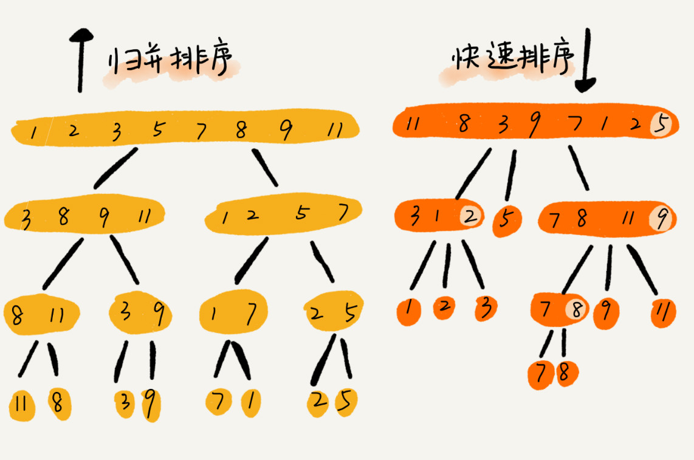

可以发现，归并排序的处理过程是由下到上的，先处理子问题，然后再合并。而快排正好相反，它的处理过程是由上到下的，先分区，然后再处理子问题。

归并排序虽然是稳定的、时间复杂度为O(nlogn)的排序算法，但是它是非原地排序算法。前面提到过，归并排序之所以是非原地排序算法，主要原因是合并函数无法在原地执行。快速排序通过设计巧妙的原地分区函数，可以实现原地排序，解决了归并排序占用太多内存的问题。


## 快速排序的性能分析

接下来我们分析一下快速排序的性能。在讲解快速排序的实现原理的时候，已经分析了稳定性和空间复杂度。快排是一种原地、不稳定的排序算法。

快排也是用递归来实现的。对于递归代码的时间复杂度，前面提及的总结的公式，这里还是适用的。如果每次分区操作，都能正好把数组分成大小接近相等的两个小区间，那快排的时间复杂度递推求解公式跟归并是相同的。所以，快排的时间复杂度也是O(nlogn).

``` 
T(1) = C;  n=1时，只需要常量级的执行时间，所以表示C
T(n) = 2*T(n/2) + n; n>1
```

但是，公式成立的前提是每次分区操作，我们选择的pivot都很合适，正好能将大区间对等地一分为二。

我们举一个比较极端的例子。如果数组中的数据原来就已经是有序的了，比如1，3，5，6，8。如果我们每次选择最后一个元素作为pivot，那每次分区得到的两个区间都是不均等的。我们需要进行大约n次分区操作，才能完成快排的整个过程。每次分区我们平均要扫描大约n/2 个元素，这种情况下，快排的时间复杂度就从O(nlogn) 退化成了O($n^2$) .

刚才看到的是两个极端情况下的时间复杂度，一个是分区极其均衡，一个是分区极其不均衡。它们分别对应快排的最好情况时间复杂度和最坏情况时间复杂度。那快排的平均情况时间复杂度是多少呢？

我们假设每次分区操作都将区间分成大小为9:1的两个小区间。我们继续套用递归时间复杂度的递推公式，就会变成这样：

``` 
T(1) = C; n=1时，只需要常量级的执行时间，所以表示为C。
T(n) = T(n/10) + T(9*n/10) +n; n>1
```

这个公式的递推求解的过程非常复杂，虽然可以求解，但是我们不推荐用这种方法。实际上，递归的时间复杂度的求解方法除了递推公式之外，还有递归树。这里先记住结论：T(n)在大部分的情况下的时间复杂度都可以做到O(nlogn)，只有在极端的情况下，才会退化到O($n^2$)。


## 解答开篇

快排的核心思想就是分治和分区，我们可以利用分区的思想，来解答开篇的问题：O(n)时间复杂度内求无序数组中的第K大元素。比如，4,2,5,12,3这样一组数据，第3大元素就是4。

我们选择数组区间A[0...n-1]的最后一个元素A[n-1]作为pivot，对数组A[0...n-1]原地分区，这样数组就分成了三部分，A[0...p-1]、A[p]、A[p+1 ... n-1].

如果p+1 =K，那么A[p]就是要求解的元素；如果K>p+1，说明第K大元素出现在A[p+1...n-1]区间，我们再按照上面的思路递归第在A[p+1...n-1]这个区间内查找。同理，如果K<p+1，那我们就在A[0...p-1]区间查找。


我们再来看，为什么上述解决思路的时间复杂度是O(n)？

第一次分区查找，我们需要对大小为n的数组执行分区操作，需要遍历n个元素。第二次分区查找，我们只需要对大小为n/2的数组执行分区操作，需要遍历n/2个元素。依次类推，分区遍历元素的个数分别为n/2、n/4、n/8、n/16 ....直到区间缩小为1.

如果我们把每次分区遍历的元素个数加起来，就是：n+n/2 +n/4 +n/8 +...+1. 这是一个等比数列求和，最后的和是2n-1、所以，上述解决思路的时间复杂度是O(n).


## 内容小结

归并排序和快速排序是两种稍微复杂的排序算法，它们用的都是分治的思想，代码都通过递归俩实现，过程非常相似。理解归并排序的重点是理解递推公式和merge()合并函数。同理，理解快排的重点也是理解递推公式，还有partition()分区函数。

归并排序算法是一种在任何情况下时间复杂度都比较稳定的排序算法，这也使它存在致命的缺点，即归并排序不是原地排序算法，空间复杂度比较高，是O(n)。正因为此，它也没有快排应用广泛。

快速排序算法虽然最坏情况下的时间复杂度是O($n^2$)，但是平均情况下时间复杂度都是O(nlogn)。不仅如此，快速排序算法时间复杂度退化到O($n^2$)的概率非常小，我们可以通过合理地选择pivot来避免这种情况。


## D39(2020/11/02)

今天主要是再次梳理一下归并排序和快速排序的内容，熟悉书写的代码和排序的原理。


## 归并排序

归并排序(Merge Sort)是一类借助"归并"进行排序的方法。

归并的含义是将两个或两个以上的有序序列归并为一个有序序列的过程。归并排序按所合并的表的个数可分为二路归并排序和多路归并排序。

二路归并排序(2-way Merge Sort)的基本思想：将待排序的n个元素看成是n个有序的子序列，每个子序列的长度是1，然后两两归并，得到[$\frac{n}{2}$] 向下取整，个长度为2或1(最后一个有序序列的长度可能是1)的有序子序列；再两两归并，得到[$\frac{n}{4}$] 向下取整，个长度为4或小于4(最后一个有序序列的长度可能小于4)的有序子序列；再两两归并，.... 直至得到一个长度为n的有序序列。


### 二路归并排序的操作步骤如下

Step1: 将待排序的列划分为两个长度相当的子序列。

Step2: 若子序列长度大于1，则对子序列执行一次归并排序。

Step3: 执行下列步骤对子序列两两合并成有序序列。

1. 创建一个辅助数组temp[]. 假设两个子列的长度分别为u、v，两个子列的下标为0~u，u+1 ~ v+u+1。设置两个子表的起始下标和辅助数组的起始下标：i=0; j=u+1; k=0
2. 若i>u或j>v+u+1，说明其中一个子表已经合并完毕，执行第4步。
3. 选取r[i]和r[j]中关键字较小的存入辅助数组temp[]; 若r[i].key < r[j].key，则temp[k]=r[i]; i++;k++; 否则temp[k]=r[j]; j++; k++。返回第2步。
4. 将尚未处理完的子表元素依次存入temp[]，结束合并。


## 快速排序

### 快速排序的基本思想

快速排序是通过对关键字的比较和交换，以待排序列中的某个数据为支点，将待排序列分成两部分，其中左半部分数据小于等于支点，右半部分数据大于等于支点。然后，对左右两部分分别进行快速排序的递归处理，直到整个序列按关键字有序为止。


### 快速排序与冒泡排序

在冒泡排序中，元素的比较和移动是在相邻位置进行的，元素的每次交换只能前移或后移一个位置，因而总的比较次数和移动次数较多。

而在快速排序中，元素的比较和移动是从两端向中间进行的，关键字较大的记录一次就能从前面移动到后面，关键字较小的记录一次就能从后面移动到前面，记录移动的距离较远，从而减少了总的比较次数和移动次数。

因此，可以将快速排序视为对冒泡排序的一次改进。


### 快速排序的流程图

下面是一个快速排序的完整的流程图，其中low是序列中的第一个结点，high指向的是序列中的最后一个结点，且令r[low]为支点。


### 快速排序的基本步骤

Step1: 如果待排子序列中元素的个数等于1，则排序结束；否则以r[low]为支点，按如下方式进行一次划分；

1. 设置两个搜索指针：low是向后搜索指针，初始指向序列第一个结点；high是向前搜索指针，初始指向最后一个结点；取第一个记录为支点，low位暂时取值为支点privotkey = r[low].key 
2. 若low=high，一次划分结束
3. 若low<high 且r[high].key >= privotkey, 则从high 所指定的位置向前搜索：high =high -1，重新执行1.3；否则若有low<high并且有r[high].key < privotkey，交换r[high].key和r[low].key,然后令low=low +1，执行下面第4步；若有low>=high，则指向上面第2步；
4. 若low<high且r[high].key<= privotkey。则从low所指的位置开始往后搜索：low = low +1，然后再重新执行第4步；否则若有low < high并且有r[low].key > pivotkey，则交换r[high].key和r[low].key，然后令high = high -1，执行上面第3步；若有low >= high，则执行第2步。

Step2: 对支点左半子序列重复Step1

Step3: 对支点右半子序列重复Step1.


### 快速排序代码

分为分区函数和主函数两块的代码。

``` 
# include <stdio.h>

// 对序列进行一次划分
int Partition (SqList &L, int low, int high)
{
    int pivotkey;
    // 关键字
    privotkey = L.r[low];

    // 从表的两端交替向中间扫描
    while (low < high) 
    {
        while (low<high && L.r[high] >=privotkey) {
            --high;
        }
        // 交换位置
        L.r[low] = L.r[high];
        while (low<high && L.r[low] <=pivotkey) {
            ++low;
        }
        // 交换位置
        L.r[high] = L.r[low];
    }
    // 返回中间的位置
    return low;
}

// 主程序，按分区对子程序进行调用
void QuickSort1 (SqList &L, int low, int high)
{
    int mid;
    if (low < high) {
        mid = Partition(L, low, high);
        //对低子表进行排序
        QuickSort1 (L, low, mid-1);
        //对高子表进行排序
        QuickSort1 (L, mid+1, high);
    }
}
```


## D40(2020/11/03)

今天主要是要学习的桶排序、计数排序，还有基数排序中的内容。

上两节中，我们学习了几种常用排序算法的原理、时间复杂度、空间复杂度、稳定性等。今天，我们会重点学习三种时间复杂度是O(n)的排序算法：桶排序、计数排序、基数排序。因为这些排序算法的时间复杂度是线性的，所以我们把这类排序算法叫做线性排序(Linear sort)。之所以能做到线性的时间复杂度，主要原因是，这三个算法是非基于比较的排序算法，都不涉及元素之间的比较操作。

这几种排序算法理解起来都不难，时间、空间复杂度分析起来也和简单，但是对要排序的数据要求很苛刻，所以学习的重点是掌握这些排序算法的适用场景。


## 桶排序(Bucket sort)

首先，我们来看桶排序。桶排序，顾名思义，会用到"桶"，核心思想是将要排序的数据分到几个有序的桶里，每个桶里的数据再单独进行排序。桶内排完序之后，再把每个桶里的数据按照顺序依次取出，组成的序列就是有序的了。


桶排序的时间复杂度为什么是O(n)呢？

如果要排序的数据有n个，我们把它们均匀地划分到m个桶内，每个桶里就有k= n/m 个元素。每个桶内部使用快速排序，时间复杂度为O(k* logk)。m个桶排序的时间复杂度就是O(m\*k\* logk)，因为k=n/m，所以整个桶排序的时间复杂度就是O(n\* log(n/m))。当桶的个数m接近数据个数n的时候，log(n/m)就是一个非常小的常量，这个时候桶排序的时间复杂度接近O(n).


### 桶排序看起来很优秀，是不是可以替代之前讲的排序算法？

答案是否定的。上面的例子是为了轻松理解桶排序的核心思想，做了很多的假设。实际上，桶排序对要排序数据的要求是非常苛刻的。

首先，要排序的数据需要很容易就能划分成m个桶，并且，桶与桶之间有着天然的大小顺序。这样每个桶内的数据都排序完之后，桶与桶之间的数据不需要再进行排序。

其次，数据在各个桶之间的分布是比较均匀的。如果数据经过桶的划分之后，有些桶里的数据非常多，有些非常少，很不均匀，那桶内数据排序的时间复杂度就不是常量级了。在极端情况下，如果数据都被划分到一个桶里，那就退化为O(nlogn)的排序算法了。

桶排序比较适合用在外部排序中。所谓的外部排序就是数据存储在外部磁盘中，数据量比较大，内存有限，无法将数据全部加载到内存中。

比如说我们有10GB的订单数据，我们希望按订单金额(假设金额都是正整数)进行排序，但是我们的内存有限，只有几百MB，没办法一次性把10GB的数据都加载到内存中。这个时候该怎么办呢？

现在可以来思考一下，如何借助桶排序的处理思想来解决这个问题。

我们可以先扫描一遍文件，看订单金额所处的数据范围。假设经过扫描之后我们得到，订单金额最小是1元，最大是10万元。我们将所有订单根据金额划分到100个桶里，第一个桶我们存储金额在1元到1000元之内的订单，第二桶存储金额在1001到2000元之间的订单，以此类推。每一个桶对应一个文件，并且按照金额范围的大小顺序编号命名(00, 01, 02... 99)。

理想的情况下，如果订单金额在1到10万元之间均匀分布，那订单会被均匀划分到100个文件中，每个小文件中存储大约100MB的订单数据，我们就可以将这100个小文件依次放到内存中，用快排来排序。等所有文件都排好序之后，我们只需要按照文件编号，从小到大依次读取每个小文件中的订单数据，并将其写入到一个文件中，那这个文件中存储的就是按照金额从小到大排序的订单数据了。

不过，我们也可能会发现，订单按照金额在1元到10万元之间并不一定是均匀分布的，所以10GB订单数据是无法均匀地被划分到100个文件中的。有可能某个金额区间的数据特别多，划分之后对应的文件就会很大，没法一次性读入内存。这又该如何？

针对这些划分之后还是比较大的文件，我们可以继续划分，比如，订单金额在1元到1000元之间的比较多，我们就将这个区间继续划分为10个小区间，1元到100元，101元到200元，201元到300元 ... 901元到1000元。如果划分之后，101元到200元之间的订单还是太多，无法一次性读入内存，那就继续再划分，直到所有的文件都能读入内存为止。


## 计数排序(Counting sort)

个人认为，计数排序其实是桶排序的一种特殊情况。当要排序的n个数据，所处的范围并不大的时候，比如最大值是k，我们就可以把数据划分成k个桶。每个桶内的数据值都是相同的，省掉了桶内排序的时间。

如果所在的省有50万考生，如何通过成绩快速排序得出名次呢？

考生的满分是900分，最小是0分买这个数据的范围很小，所以我们可以分成901个桶，对应分数从0分到900分。

根据考生的成绩，我们将这50W考生划分到这901个桶里。桶内的数据都是分数相同的考生，所以并不需要再进行排序。我们只需要一次扫描每个桶，将桶内的考试依次输出到一个数组中，就实现了50万考试的排序。因为只涉及扫描遍历操作，所以时间复杂度是O(n).

计数排序的算法思想，跟桶排序非常类似，只是桶的大小粒度不一样。不过，为什么这个排序算法叫"计数"排序呢？

我们还是用考生的例子，对数据规模做了简化。假设只有8个考生，分数在0到5分之间。这8个考生的成绩我们放在一个数组A[8]中，它们分别是：2，5，3，0，2，3，0，3。

考生的成绩从0到5分，我们使用大小为6的数组C[6]表示桶，其中下标对应分数。不过，C[6]内存储的并不是考生，而是对应的考生个数。以刚才的例子，我们只需要遍历一遍考试分数，就可以得到C[6]的值。


从图中可以看出，分数为3分的考生有3个，小于3分的考试有4个，所以，成绩为3分的考试在排序之后的有序数组R[8]中，会保存下标4，5，6的位置。


那我们如何快速计算出，每个分数的考试在有序数组中对应的存储位置呢？这个处理方法非常巧妙。

思路是这样的：我们对C[6]数组顺序求和，C[6]存储的数据就变成了下面的样子。C[k]里存储小于等于分数k的考生个数。


我们从后到前依次扫描数组A。比如，当扫描到3的时候，我们可以从数组C中取出下标为3的值7，也就是说，到目前为止，包括自己在内，分数小于等于3的考生有7个，也就是说3是数组R中的第7个元素(也就是数组R中下标为6的位置)。当3放入到数组R中后，小于等于3的元素就只剩下6个了，所以相应的C[3]要减1，变成6。

> 理解：从后到前的方向来扫描数组A，扫描到一个元素值的时候，到C这个数组下面，根据A中扫描的那个值的作为C的下标，得到C中对应的下标的元素的值，我们从C中得到值X，减去1，放入到R中(x-1)的数组下标下面。完成一次后，将C中对应的下标中的值x也减去1。

以此类推，当我们扫描到第2个分数为3的考生的时候，就会把它放入数组R中的第6个元素的位置(也就是下标为5的位置)。当我们扫描完整个数组A后，数组R内的数据就按照分数从小到大有序排列的了。

计数排序只能用在数据范围不大的场景中，如果数据范围k比要排序的数据n大很多，就不适合用计数排序了。而且，计数排序只能给非负整数排序，如果要排序的数据是其他类型的，要将其在不改变大小的情况下，转化为非负整数。

比如，还是考生的例子。如果考生成绩精确到小数后一位，我们就需要将所有的分数都先乘以10，转化成整数，然后再放到9010个桶内。再比如，如果要排序的数据中有负数，数据的范围是[-1000,1000]，那我们就需要先对每个数据都加1000，转化成非负整数。


## 基数排序(Radix sort)

再看一个排序问题。假设我们有10万个手机号码，希望将这10万个手机号码从小到大排序。

利用之前讲的快排，时间复杂度可用做到O(nlogn)，是否还有更加高效的排序算法？桶排序、计数排序能排上用场吗？ 

由于手机号码有11位，范围太大了，显然不适合用桶排序或者计数排序。这里，我们可以用到新的排序算法，基数排序。

刚刚这个问题里有这样的规律：假设要比较两个手机号码a，b的大小，如果在前面几位中，a手机号码已经比b手机号码大了，那后面的几位就不用看了。

借助稳定排序算法，这里有一个巧妙的实现思路。我们这里先按照最后一位来排序手机号码，然后，再按照倒数第二位重新排序，以此类推，最后按照第一位重新排序。经过11次排序之后，手机号码就都有序了。


这里按照每位来排序的排序算法要是稳定的。因为如果是非稳定的排序算法，那最后一次排序只会考虑最高位的大小顺序，完全不管其他位的大小关系，这样的话，低位的排序就完全没有意义了。

根据每一位来排序，我们可以用刚讲过的桶排序或计数排序，它们的时间复杂度可以做到O(n)。如果要排序的数据有k位，那我们就需要k次桶排序或计数排序，总的时间复杂度是O(k*n)。当k不大的时候，比如手机号码排序的例子，k最大就是11，所以基数排序的时间复杂度就近视于O(n).

实际上，有时候要排序的数据并不都是等长的，例如英文单词，最短的只有1个字母，最长的有45个字母。对于这种不等长的数据，基数排序如何去做呢？

我们可以把所有的单词补齐到相同长度，位数不够的可以在后面补"0"。因为根据ASCII值，所有字母都大于"0"，所以补"0"不会影响到原有的大小顺序。这样就可以继续使用基数排序了。

总结来说，基数排序对要排序的数据是有要求的，需要可以分割出独立的"位"来比较，而且位之间有递进的关系，如果a数据的高位比b数据大，那剩下的低位就不用比较了。除此之外，每一位的数据范围不能太大，要可以用线性排序算法来排序，否则，基数排序的时间复杂度就无法做到O(n)了。


## 解答开篇

再来看看开篇的思考题：如何根据年龄给100W用户排序？

实际上，根据年龄给100W用户排序，就类似按照成绩给50W考生排序。我们假设年龄的范围最小1岁，最大不超过120岁。我们可以遍历这100万用户，根据年龄将其划分到这120个桶里，然后依次顺序遍历这120个桶内的元素。这样就得到了按照年龄排序的100万用户的数据。


## 内容小结

今天，学习了3种线性时间复杂度的排序算法，有桶排序、计数排序、基数排序。它们对要排序的数据都有比较苛刻的要求，应用不是非常广泛。但是如果数据特征比较符合这些排序算法的要求，应用这些算法，会非常高效，线性时间复杂度可以达到O(n).

桶排序和计数排序的排序思想非常相似的，都是针对范围不大的数据，将数据划分成不同的桶来实现排序。

基数排序要求数据可以划分为高低位，位之间有递进的关系。比较两个数，我们只需要比较高位，高位相同的再比较低位。而且每一位的数据范围不能太大，因为基数排序算法需要借助桶排序或者计数排序来完成每一位的排序工作。


## D41(2020/11/04)

今天主要是要学习的是，对各个排序算法的一种大概的总结。

几乎所有的编程语言都会提供排序函数，比如C语言中qsort()，C++ STL中的sort()、stable_sort()，还有Java语言中的Collections.sort()。在平时的开发中，我们也都是直接使用这些现成的函数来实现业务逻辑中的排序功能。


## 如何选择合适的排序函数？

如果要实现一个通用的、高效率的排序函数，我们应该选择哪种排序算法呢？


### 冒泡排序

#### 冒泡排序的思想

对于冒泡排序来说，会有两个for循环，外层的for循环，控制的是排序的趟数，内层的for循环，是在某一趟内，对相邻的两个元素进行比较和交换。


#### 冒泡排序的优化

这里会涉及到一个对冒泡排序的优化，在外层for循环排序那，设置一个flag标签，外层flag的初始值是false。在实际的冒泡排序中，会存在这么一种场景，当内层的for循环在执行的过程中，是对前后相邻的两个数进行比较，但是如果这个时候发现相邻的两个数没有交换(已经有序)了，那么后面的数也是有序的了。所以来说，只有当内存for循环执行了交换，才会去修改flag的值为true，否则如果flag依旧还是为false的话，那么就直接跳出


#### 冒泡排序的代码

代码示例如下：

``` 
int main()
{
    int n;
    int arry[10];
    for (int i = 0; i < n - 1; i++)
    {
        bool flag = false;
        for (int j = 0; j < n - i - 1; j++)
        {
            if (arry[j] > arry[j + 1])
            {
                int tmp = arry[j];
                arry[j] = arry[j + 1];
                arry[j + 1] = tmp;
                flag = true;
            }
        }

        if (!flag)
        {
            break;
        }
    }

    for (int i = 0; i < n; i++)
    {
        printf("%d\n", arry[i]);
    }
}
```

书写冒泡排序有两个重要点：

1. 要注意两个for循环的i的范围和j的范围，i的范围从[0, n-1]，j的范围是从[0,n-i-1]。
2. 注意flag的位置，初始设置flag=false的位于最外层for循环开始的位置，而flag = true则设置在内层循环的交换完毕后，设置的值，具体的位置应该是在if (a[j]>a[j+1]) 里面的方法体内，具体位置，在交换位置的代码的最后。`确保只有发生了交换，才会去设置这个flag 为true`


#### 冒泡排序算法分析

1. 冒泡排序是原地的排序算法。在整个的排序的过程中，只是涉及到相邻的数据的交换的操作，只需要引入一个临时的数组元素变量，不需要申请其他的内存空间了。所以冒泡排序的空间复杂度是O(1)，是一个原地排序算法。

2. 冒泡排序是稳定的排序算法。在冒泡排序中，只有交换才可以改变两个元素的前后顺序。为了保证冒泡排序算法的稳定性，当有相邻的两个元素大小相等的时候，我们不做交换。这样的话，相同大小的数据在排序前后不会改变顺序。

3. 冒泡排序的时间复杂度。

   * 最好情况时间复杂度O(n)。当要排序的数据已经是有序的了，我们只需要最外层的一个for循环就可以了(表示的要比较的趟数)，里面的for循环(初始的去判断一次，由于不满足条件，没有去交换元素，直接将flag设置为了true)，从而直接跳出了外层的for循环。整体的最好情况时间复杂度是O(n).

   * 最坏情况时间复杂度O($n^2$)。最外层的for循环需要n趟，里层的for循环也要有n次，所以最坏情况下的时间复杂度是O($n^2$)。

     

### 插入排序

#### 插入排序思想

插入排序整体思想是，将数组中的数据分为两个区间，已排序区间和未排序区间。

初始的已排序的区间，我们设置为只有1个元素，这个元素就是数组中的第一个元素。

核心思想就是，取未排序区间中的元素，在已排序区间中找到合适的插入位置将其插入，并保证已排序区间数据一直有序。重复这个过程，直到未排序区间中元素为空，算法结束。


#### 有序度/逆序度/满有序度

1. 有序度是指，数组中具有有序关系的元素对的个数。

   ``` 
   2,4,3,1,5,6这组数据的有序度是11，因为其有序元素对为11个。分别是：
   (2,4) (2,3) (2,5) (2,6) 
   (4,5) (4,6) (3,5) (3,6)
   (1,5) (1,6) (5,6)
   ```

   

2. 满有序度是指，数组中完全有序的数组的有序度，也就是完全有序的有序关系的元素对的个数。

   ``` 
   对于一个完全有序的数组，比如1,2,3,4,5,6，
   有序度就是n*(n-1)/2，也就是15
   ```

   

3. 逆有序度是指，数组中无序关系的元素对的个数。同时，我们还可以了解到`逆序度=满有序度-有序度`.

   对于冒泡排序或者是插入排序，这种包含比较和交换两种操作的排序来说。不管算法怎么改进，交换次数总是确定的，即为逆序度，也就是n*(n-1)/2 -初始有序度。


#### 插入排序代码

代码示例如下：

``` 
#include <stdio.h>
void InsertSort(int *a, int length)
{
    int i, j, tmp;
    // 外层的循环，表示的是需要有n-1个数组元素需要进行插入排序
    // 默认认定a[0]这个元素是有序的
    for (i = 1; i < length; i++)
    {
        // 将要插入的数a[i]赋值给tmp
        // 为什么要引入tmp这个中间变量呢？
        // 后续里面从a[0]到a[i]中的元素，都有可能出现移动，而导致原来a[i]的值出现改变
        // 或者可以理解为先将a[i]这个值拿出来
        tmp = a[i];
        // 从i-1开始，逐个向前递减，循环来比较
        for (j = i - 1; j >= 0; j--)
        {
            // a[j]代表的是有序的数组序列中的一个元素
            // 如果要插入的元素，比a[j]要小
            if (tmp < a[j])
            {
                // 将a[j]的值赋值给a[j+1]
                // 这样就实现了a[j]往后移动一个位置的目的
                // 这里用a[j+1]而不是a[i]
                // a[j+1]是个动态变化的过程
                a[j + 1] = a[j];
            }
            else
            {
                // 如果要插入的元素，大于等于a[j]
                // 直接跳出内层的循环
                break;
            }
        }
        // 将要插入的数tmp放入a[j+1]中
        a[j + 1] = tmp;
    }
}

int main()
{
    int array[10] = {9, 4, 2, 10, 5, 1, 3, 5, 7, 9};
    
    InsertSort(array, sizeof(array) / sizeof(array[0]));
    int i;
    for (i = 0; i < sizeof(array) / sizeof(array[0]); i++)
    {
        printf("%d ", array[i]);
    }
    printf("\n");
    return 0;
}
```

在书写插入排序代码的时候，还是有一定的难度的。

总体来说，插入排序的逻辑还是比较和交换。思想是将数组分为两个部分，有序子序列，和无序的子序列。我们先默认有序子序列只有1个，是数组的第一个元素a[0]，然后依次从无序子序列中取出一个数组元素，加入到有序子序列中，通过将拿出来的那个无序的元素，通过从后往前的一个个比较，找到合适的位置，然后再将其插入，相依的原有的有序子序列往后移动。

代码分为两层for循环，外层for循环是依次从无序的子序列中取出一个元素，外层for循环i从 1开始，小于n，i++，共需要取n-1次。内层的for循环，表示的是要比较的数组元素，j从i-1开始，j>=0，j--。由于内层的for循环都是有序的子序列，所以最多需要比较i-1次，一旦发现有序序列中的某个元素是比 外层拿出来比较的元素要来的小，那就跳出内层for循环。


#### 书写代码的注意点

1. 外层for循环，i从1开始，i<n，i++
2. 内层for循环，j从i-1开始，j>=0， j--
3. 在外层for循环内，引入一个中间变量tmp，用来临时存储a[i]，这是由于取出a[i]放入有序序列进行比较的过程中，会有各个有序序列的移动，这样的话，要插入的元素a[i]的值就会有变化了，所以先取出来，放入一个中间变量中，待找到合适的位置的时候，再插入进去。
4. 内层循环中，判断条件是 if (tmp < a[j])，那么a[j+1] = a[j]。也就是a[j]元素的值，放入到a[j+1]的上面了。
5. 内层循环中，如果条件 if (tmp >= a[j])的话，直接跳出内层for循环。
6. 注意最后的赋值出现在内层for循环中，a[j+1] = tmp。这个要分两种情况来理解，一种是完整执行完毕内层for循环，跳出了循环，这个时候j=-1了，所以需要j+1。第二种情况，是中途当发现tmp>=a[j]的话的时候，直接跳出循环了，将tmp放入a[j+1]的位置。


#### 插入排序代码分析

1. 插入排序是原地排序算法。在整个代码的实现过程中，可以看出，插入排序算法中，除了引入了一个tmp的临时变量，没有开辟其他的内存空间。所以空间复杂度是O(1)，这是一个原地的排序算法。
2. 插入排序是稳定的排序算法。在将取出的无序的子序列的一个元素tmp的时候，会依次与a[j]开始比较，只有当tmp <a[j]的时候，才会去交换外置，等于的时候，不变化位置，这样的话，就可以保证原有的前后顺序不变，所以说插入排序是稳定的排序算法。
3. 插入排序的时间复杂度。如果数组的元素都是有序的情况下，只需要一个外层的每个取无序数组元素的一个操作，内层for循环由于不满足tmp < a[j]，直接就跳出了循环，所以最好情况下的时间复杂度是O(n)。如果数组的元素都是无序的，那么除了外层的取各个元素的for 循环操作，内层for循环还需要挨个的比较，交换位置。所以最坏情况时间复杂度是O($n^2$)。平均时间复杂度是O($n^2$)，数组中插入一个数据的评卷时间复杂度是O(n)，循环n次，就是O($n^2$)。


### 选择排序

#### 选择排序思想

选择排序算法的实现思路也有点类似插入排序，也分为已排序区间和未排序区间。但是选择排序每次会从未排序区间中找到最小的元素，将其放到已排序区间的末尾。


#### 选择排序代码

``` 
# include <stdio.h>

void select_sort(int *a, int len)
{
    int i;
    int j;
    // 定义最小值
    int min_value;
    // 定义最小值的位置
    int min_pos;

    // n个元素，需要进行n-1趟的排序
    // 看作是n个位置上逐个从剩余的元素中找最小值
    // 第一个位置，从n个元素中找
    // 第二个位置，从n-1个元素中找
    // 第n-1个位置，剩下的2个元素中来找
    // 第n个位置，不要找了，就是最后一个元素
    for (i=0; i< len -1; i++)
    {
        // 先定义一个初始的最小值和最小值的位置
        min_value = a[i];
        min_pos = i;

        // 内层循环从a[i+1]开始，直到a[len-1]结束的无序数组中来找寻最大值
        for (j=i+1; j< len; j++)
        {
            // 如果无序子序列中的某个元素值，要小于初始定义的最小值
            if (a[j] < min_value)
            {
                //  将a[j]赋值给min_value
                min_value = a[j];
                // 将j赋值给min_pos
                min_pos = j;
            }
        }
        // 将内层的for循环中找到的最小值，和初始的最小值进行比较
        // 如果内层的无序的for循环中的最小值要比初始定义的最小值，还要小
        if (min_value < a[i]) 
        {
            // 将原先定义的最小值放入，后面无序子序列中找到的最小值的位置上
            // 也就是实现了a[i]和后面找到的a[min_pos]的两个值的交换
            a[min_pos] =a[i];
            // 将后面找到的最小值赋值给a[i]
            a[i] = min_value;
        }
    }
}

int main()
{
    int a[9] = {12, 44, 0, 12, 45, 666, 5, 4, 3};
    select_sort(a, 9);
    for (int i=0; i<9; i++)
    {
        printf("%d ", a[i]);
    }
    printf("\n");
    return 0;
}
```


#### 选择排序代码分析

1. 选择排序是原地排序代码。只是引入了一个int 最小值，和一个最小值所在的位置，空间复杂度是O(1)。所以选择排序是一种原地排序算法。
2. 选择排序是不稳定的排序算法。比如5,7,5,2,9这样一组数据，使用选择排序算法来排序的话，第一次找到最小元素2，与第一个5进行了交换位置，那么第一个5和中间的5的顺序就变了，所以就不稳定了。
3. 选择排序的时间复杂度。最好情况，最坏情况，和平均情况的时间复杂度都是O($n^2$)。这是由于外层逐个位置的for循环不会少，内层的从无序子序列中找寻最小值的for循环也不会少，只是后面的if代码会有些变化，但是总体的时间复杂度还是O($n^2$) .


### 归并排序

#### 归并排序思想

基本思想就是：将两个或两个以上的有序子序列"归并"为一个有序序列。如果是两个有序子序列的话，就是2-路归并排序。

即将两个位置相邻的有序子序列R[l...m]和R[m+1...n]归并为一个有序序列R[l...n].


#### 归并排序代码

``` 
#include <iostream>
using namespace std;

// L是指arr数组中最开始的位置，数组下标
// R是指arr数组中最右边的位置，数组下标
// M是(L+R)/2后得到的中间位置的数组下标
// arr是一个数组，这个数组有个特点，前半部分有序，后半部分也有序
void merge(int *arr, int L, int M, int R){
	int left_size = M-L;
	int right_size = R-M+1;
	int *L_arr = new int[left_size];
	int *R_arr = new int[right_size];

	// 1. fill in the left sub array
	for(int i=L; i<M; i++)
		L_arr[i-L] = arr[i];
	// 2. fill in the right sub array
	for(int i=M; i<=R; i++)
		R_arr[i-M] = arr[i];
	
	// i表示的是left_size数组中一开始的下标
	// j表示的是right_size数组中一开始的下标
	// 定义k一开始指向原数组最开始的位置,也就是L，由于是反复的嵌套调用，所以需要是L
	int i = 0, j = 0, k = L;
	// i和j都不碰到各自s数组的最大的限制
	while(i < left_size && j < right_size)
	    //判断两个数组中，下标为i和下标为j 的这两个谁大
		if(L_arr[i]<R_arr[j])
		    // 可以改写为arr[k]=left[i]; i++; k++;
			arr[k++] = L_arr[i++];
		else
		   // 可以改写为arr[k]=right[j]; j++; k++;
			arr[k++] = R_arr[j++];
	// 上面那个while结束后，如果i还小于left_size的话
	// 就将left数组中的剩余的元素都挨个，赋值到arr数组中
	while(i < left_size)
	    // 下面代码可以改写为arr[k]=left[i];i++;k++;
		arr[k++] = L_arr[i++];
	// 上面那个while结束后，如果j还小于right_size的话
	// 就将right数组中的剩余的元素都挨个，赋值到arr数组中
	while(j < right_size)
	    // 下面代码可以改写为arr[k]=right[j];j++;k++;
		arr[k++] = R_arr[j++];
}

void merge_sort(int *arr, int L, int R){
	// 左边的下标和右边下标相等的话，
	// 就认为是已经能拍好顺序了
	// 递归的终止条件
	if(L == R)
		return;
	else
	{
		int M = (L+R)/2;
		merge_sort(arr, L, M);
		merge_sort(arr, M+1, R);
		merge(arr, L, M+1, R);
	}
}

void print_sort(int *arr, int num)
{
	for(int i=0; i < num; i++)
		cout << arr[i] << "   ";
	cout << endl;
}

int main()
{
	int arr[11] ={6, 3};
	merge_sort(arr, 0, 1);
	print_sort(arr, 2);
	return 0;
}
```


#### 归并排序代码分析

1. 归并排序不是原地的排序算法，需要额外申请一个和原数组大小一样的数组来临时存放数据。空间复杂度是O(n).
2. 归并排序是稳定的排序算法。在比较两个有序子序列的时候，我们可以将两个相等元素，不交换位置。
3. 归并排序的最好，最坏的时间复杂度都是O(nlogn).


### 快速排序

#### 排序思想

快排是以待排序列中的某个数据为支点，将待排序的序列分为两个部分，其中左半部分的数据要小于等于支点，而右半部分的数据要大于等于支点。

分别三个下标，privotkey是我们选择的支点，可以选择是第一个或最后一个元素。low是我们选择的从数组最开始往后搜索的指针，而high是从数组中最末尾向前搜索的指针。

如果privotkey是第一个元素，那么先从high 与 privotkey比较，如果high > privotkey则继续high向前移动，直到小于privotkey的时候，与low交换位置。交换完后，low开始向后比较，直到low所在的元素比pri大的时候，与high 交换位置。最后当high与low重合的时候，该趟停止。

然后将在pirvotkey的两边，分成两个子序列，循序继续上面的操作。直到所有都有序。


#### 快速排序的代码

``` 
# include <stdio.h>

// 对序列进行一次划分
int Partition (SqList &L, int low, int high)
{
    int pivotkey;
    // 关键字
    privotkey = L.r[low];

    // 从表的两端交替向中间扫描
    while (low < high) 
    {
        while (low<high && L.r[high] >=privotkey) {
            --high;
        }
        // 交换位置
        L.r[low] = L.r[high];
        while (low<high && L.r[low] <=pivotkey) {
            ++low;
        }
        // 交换位置
        L.r[high] = L.r[low];
    }
    // 返回中间的位置
    return low;
}

// 主程序，按分区对子程序进行调用
void QuickSort1 (SqList &L, int low, int high)
{
    int mid;
    if (low < high) {
        mid = Partition(L, low, high);
        //对低子表进行排序
        QuickSort1 (L, low, mid-1);
        //对高子表进行排序
        QuickSort1 (L, mid+1, high);
    }
}
```


#### 分析快速排序的代码

1. 快速排序是不稳定的排序算法。无法保证两个相等的元素，排序前后的位置是一致的。
2. 快速排序是原地的排序算法，不需要一看如额外的内存空间。
3. 快排的时间复杂度，快排的大部分时候的时间复杂度是O(nlogn)，但是当分区均衡的时候，是O(nlogn)。而当分区及其不均衡的时候，是指已经是一个有序的数组了，这种情况下分区是及其不均衡的，这个时候的时间复杂度会退化到O($n^2$) .


### 桶排序

#### 桶排序的排序思想

首先对于使用桶排序，还是对数组序列有一定的要求的。这些要排序的数据需要很容易的划分成m个桶。

桶与桶之间有着天然的大小顺序，这个每个桶内的数据都排好序后，桶与桶之间的额数据不需要再进行排序了。另外桶的范围不能太大了。

1. 首先将要排序的数据分到几个有序的桶里。
2. 每个桶里的数据再单独进行排序。
3. 桶内排完序后，再把每个桶内的数据按照顺序依次取出。
4. 最后组成的序列就是有序的了。


#### 分析桶排序代码

1. 桶排序是稳定的排序算法，原数组扫描的时候，如果从头开始扫描依次放入各个桶内，然后从桶内读取数据，也依次读出，可以保证有序性。
2. 桶排序是非原地的排序算法。需要引入额外的内存空间，桶。
3. 桶排序的时间复杂度。
   * 最好情况下，n个数据，均匀地分到m个桶内，每个桶内就是k=n/m个数据。每个桶内使用快排，时间复杂度就是O(k*logk)。m个桶排序的时间复杂度就是O(m\*k\*logk)，因为k=n/m，所以整个桶的排序就是O(n\*log(n/m)).当桶的个数m接近数据个数n的时候，log(n/m)就是一个非常小的常量。这个时候的桶排序时间复杂度接近O(n).  
   * 最坏情况下，同上面的具体情况，如果极度不均匀，就只有一个桶的时候，一个桶的排序就是一个快排了O(nlogn).


### 计数排序

#### 计数排序的算法思想

普通思想：

n个数据，所处的范围并不大的时候。比如最大值为k，我们就设定每个值是1个桶，就把数据划分成了k个桶。每个桶内的数据值都是相同的，省掉了桶内排序的时间。最后依次扫描各个桶，形成排好序的完整数组。

稳定的算法思想：

存储每个值的桶内的原始值，为数组前后的相加。这样每个桶位置上的数值，就是小于等于该桶下标的值的数量。我们先从尾到头遍历一下原来要排序的数组A，找到A中的一个元素值X，利用这个值，到C桶数组中，找到C桶中对应的这个X值的下标的值是Y。将A中的这个元素值，写入到完整排好序的数组R[Y-1]的位置。继续从为到头遍历数组A，这样继续从尾巴到头遍历数组A，下来，数组中相等元素的位置就是稳定的了。


#### 计数排序的特殊要求

计数排序只能是针对大量重复数据，在一个小范围内的排序，如果数据范围k比要排序的数据n大得多，就不适合用计数排序了。

计数排序其实是桶排序的一种特殊情况。

计数排序中的桶大小粒度，与桶排序中的粒度是不一样的。桶排序中，考虑的是每个桶内要均匀，而在计数排序中的桶，考虑的是涵盖一个小的范围，每个值就是一个桶。

计数排序只能给非负整数排序，如果要排序的数据是其他类型，要将其在不改变相对大小的情况下，转化为非负整数。


#### 计数排序的算法分析

1. 计数排序可以做到稳定的排序算法。
2. 计算排序不是原地排序算法，同样，在排序的过程中，需要额外申请一个桶C的数组k，还有一个最后拍好序的数组n.
3. 计数排序的时间复杂度。由于计数排序的要求是特殊场景下，才能实现的，只要满足这种场景的情况下使用的计数排序，都是O(n).


### 基数排序

#### 基数排序的特殊要求

1. 要排序的数据，可以分割出独立的"位"来比较，位数不够的，需要补足位数。补足的位数，不要影响原有的大小顺序。数据可以划分"高低"位。
2. 位与位之间有递进的关系，如果a数据的高位比b数据大，那么剩下的低位就不用比较了。
3. 每一位的数据范围不能太大，要可以使用线性排序算法。由于要对每一位上的数据范围，进行桶排序或者是计数排序。


#### 基数排序的排序思想

1. 所有数据先按最后一位来排序，可以使用桶排序或计数排序。
2. 接下来是倒数第二位排序。
3. 直到最后对第一位排序。


#### 基数排序算法分析

1. 基数排序是稳定的排序算法，在对每一位进行桶或计数排序的时候，可以保证整个数据的前后顺序的一致性。
2. 基数排序不是原地的排序算法。由于每一位的排序中，用到了桶排序或计数排序，而桶排序需要一个C数组和一个新牌号序的数组R，计数排序也是同样需要的。
3. 基数排序算法的时间复杂度。道理同上面的计数排序，基数排序还是非常特殊的排序，用在特殊的场景下，如果这个时候要排序的数据有k位，需要使用k次桶排序或计数排序，总的时间复杂度就是O(k*n)。当k不大的时候，可以将基数排序时间复杂度近似于O(n)。


### 整体分析

线性排序算法(桶排序、计数排序、基数排序)的时间复杂度比较低，使用场景比较特殊。所以如果要写一个通用的排序函数，不能选择线性排序算法。

如果对小规模数据进行排序，可以选择时间复杂度是O($n^2$)的算法；如果Udine大规模数据进行排序，时间复杂度是O(nlogn)的算法更加高效。所以，为了兼顾任意规模数据的排序，一般都会首选时间复杂度是O(nlogn)的排序算法来实现排序函数。

时间复杂度是O(nlogn)的排序算法不止一个，我们已经讲过的有归并排序、快速排序，后面还会有堆排序。堆排序和快速排序都有比较多的应用，比如Java语言采用堆排序实现排序函数，C语言使用快速排序实现排序函数。

实际过程中，使用归并排序的情况其实并不多。我们知道，快排在最坏情况下的时间复杂度是O($n^2$) ，而归并排序可以做到平均情况、最坏情况下的时间复杂度都是O(nlogn)，从这点上看起来很诱人，那为何归并排序使用不多呢？

这是由于归并排序并不是原地排序算法，空间复杂度是O(n)。

前面提及了，快速排序比较适合来实现排序函数，但是，我们也知道，快速排序子最坏情况下的时间复杂度是O($n^2$)，如何来解决这个问题呢？


## 如何优化快速排序？

快排算法，为什么在最坏情况下的时间复杂度是O($n^2$)呢？如果数据原来就是有序的或者接近有序的，每次分区点都选择最后一个数据，那快速排序算就会变得非常糟糕，时间复杂度就会退化为O($n^2$)。实际上，这种O($n^2$) 时间复杂度出现的这主要原因还是因为我们分区点选得不够合理。

那如何来选择好的分区点呢？

最理想的分区点是：被分区点分开的两个分区中，数据的数量差不多。

如果很粗暴地直接选择第一个或者最后一个数据作为分区点，不考虑数据的特点，肯定会出现之前的情况。在某些情况下，排序的最坏情况时间复杂度是O($n^2$)。


### 三数取中法

我们从区间的首、尾、中间，分别取出一个数，然后对比大小，取这 3 个数的中间值作为分区点。这样每间隔某个固定的长度，取数据出来比较，将中间值作为分区点的分区算法，肯定要比单纯取某一个数据更好。但是，如果要排序的数组比较大，那“三数取中”可能就不够了，可能要“五数取中”或者“十数取中”。


### 随机法

随机法就是每次从要排序的区间中，随机选择一个元素作为分区点。这种方法并不能保证每次分区点都选的比较好，但是从概率的角度来看，也不大可能会出现每次分区点都选得很差的情况，所以平均情况下，这样选的分区点是比较好的。时间复杂度退化为最糟糕的 O(n2) 的情况，出现的可能性不大。

我们知道，快速排序是用递归来实现的。我们在递归那一节讲过，递归要警惕堆栈溢出。为了避免快速排序里，递归过深而堆栈过小，导致堆栈溢出，我们有两种解决办法：第一种是限制递归深度。一旦递归过深，超过了我们事先设定的阈值，就停止递归。第二种是通过在堆上模拟实现一个函数调用栈，手动模拟递归压栈、出栈的过程，这样就没有了系统栈大小的限制。


## 举例分析排序函数

Glibc 中的 qsort() 函数举例说明一下。虽说 qsort() 从名字上看，很像是基于快速排序算法实现的，实际上它并不仅仅用了快排这一种算法。

如果你去看源码，你就会发现，qsort() 会优先使用归并排序来排序输入数据，因为归并排序的空间复杂度是 O(n)，所以对于小数据量的排序，比如 1KB、2KB 等，归并排序额外需要 1KB、2KB 的内存空间，这个问题不大。现在计算机的内存都挺大的，我们很多时候追求的是速度。还记得我们前面讲过的用空间换时间的技巧吗？这就是一个典型的应用。

但如果数据量太大，就跟我们前面提到的，排序 100MB 的数据，这个时候我们再用归并排序就不合适了。所以，要排序的数据量比较大的时候，qsort() 会改为用快速排序算法来排序。

qsort() 选择分区点的方法就是“三数取中法”。还有我们前面提到的递归太深会导致堆栈溢出的问题，qsort() 是通过自己实现一个堆上的栈，手动模拟递归来解决的。

实际上，qsort() 并不仅仅用到了归并排序和快速排序，它还用到了插入排序。在快速排序的过程中，当要排序的区间中，元素的个数小于等于 4 时，qsort() 就退化为插入排序，不再继续用递归来做快速排序，因为我们前面也讲过，在小规模数据面前，O(n2) 时间复杂度的算法并不一定比 O(nlogn) 的算法执行时间长。

我们在讲复杂度分析的时候讲过，算法的性能可以通过时间复杂度来分析，但是，这种复杂度分析是比较偏理论的，如果我们深究的话，实际上时间复杂度并不等于代码实际的运行时间。

时间复杂度代表的是一个增长趋势，如果画成增长曲线图，你会发现 O(n2) 比 O(nlogn) 要陡峭，也就是说增长趋势要更猛一些。但是，我们前面讲过，在大 O 复杂度表示法中，我们会省略低阶、系数和常数，也就是说，O(nlogn) 在没有省略低阶、系数、常数之前可能是 O(knlogn + c)，而且 k 和 c 有可能还是一个比较大的数。

假设 k=1000，c=200，当我们对小规模数据（比如 n=100）排序时，n2的值实际上比 knlogn+c 还要小。

所以，对于小规模数据的排序，O(n2) 的排序算法并不一定比 O(nlogn) 排序算法执行的时间长。对于小数据量的排序，我们选择比较简单、不需要递归的插入排序算法。


## D42(2020/11/10)

今天要学习的是二分查找的第一部分。

今天要学习的是一种针对有序数据集合的查找算法：二分查找算法，也叫折半查找算法。二分查找的思想非常简单，但是看似简单的东西往往越掌握好，想要灵活应用就更加困难。


## 无处不在的二分思想

假设有10个订单，订单金额分别是：8，11，19，23，27，33，45，55，67，98。我们如何利用二分查找的思想，查找到是否存在金额等于19元的订单。如果存在，则返回订单数据，如果不存在则返回null.

利用二分思想，每次都与区间的中间数据比对大小，缩小查找区间的范围。为了更加直观，画了一张查找过程的图。其中，low和high表示待查找区间的下标，mid表示待查找区间的中间元素下标。


二分查找针对的是一个有序的数据集合，查找思想有点类似分治思想。每次都通过跟区间的中间元素对比，将待查找的区间缩小为之前的一半，知道找到要查找的元素，或者区间被缩小为0。


## O(logn)惊人的查找速度

我们假设数据大小是n，每次查找后数据都会缩小为原来的一半，也就是会除以2。最坏情况下，直到查找区间被缩小为空，才停止。


可以看出来，这是一个等比数列。其中n/ $2^k$ = 1时，k的值就是总共缩小的次数。而每一次缩小操作只涉及两个数据的大小比较，所以，经过了k次区间缩小操作，时间复杂度就是O(k)。通过n/ ($2^k$) = 1, 我们可以求得k= log2 n ,所以时间复杂度就是O(logn)。

二分查找是我们目前为止遇到的第一个时间复杂度是O(logn)的算法。后面章节还会讲到堆、二叉树的操作等等，它们的时间复杂度也是O(logn)。

O(logn)这种对数时间复杂度，是一种极其高效的时间复杂度，有的时候甚至比时间复杂度是常量级O(1)的算法还要高效。

因为logn是一个非常"恐怖"的数量级，即便n非常非常大，对应的logn也很小。比如n等于2的32次方，这个数大约是42亿。也就是说，如果我们在42亿个数据中用二分查找一个数据，最多需要比较32次。

我们前面讲过，用大O标记法表示时间复杂度的时候，会省略掉常数、系数和低阶。对于常量级时间复杂度的算法来说，O(1)有可能表示的是一个非常大的常量值，比如O(1000)、O(10000)。所以，常量级时间复杂度的算法有时候可能还没有O(logn)的算法执行效率高。


## 二分查找的递归与非递归实现

简单的二分查找，并不难写，如下所示。

最简单的情况就是有序数组中不存在重复元素，我们在其中用二分查找值等于给定值的数据。如下面的Java代码：

``` 
public int bsearch(int[] a, int n, int value) {
  int low = 0;
  int high = n - 1;

  while (low <= high) {
    int mid = (low + high) / 2;
    if (a[mid] == value) {
      return mid;
    } else if (a[mid] < value) {
      low = mid + 1;
    } else {
      high = mid - 1;
    }
  }

  return -1;
}
```

在这个代码中，low、high、mid都是指数组下标，其中low和high表示当前查找的区间范围，初始low=0，high=n-1。mid表示[low, high]的中间位置。我们通过对比a[mid]与value的大小，来更新接下来要查找的区间范围，直到找到或者区间缩小为0，就退出。这里有三个容易出错的地方.


1. 循环退出条件

   注意是low <= high，而不是low < high.

   

2. mid的取值

   实际上，mid=(low+high)/2这种写法是由问题的。因为如果low和high比较大的话，两者之和就有可能会溢出。改进的方法是将mid的计算方式写成low+(high-low)/2。更进一步，如果要将性能优化到极致的话，我们可以将这里的除以2操作转化成位运算low+((high-low)>>1)。因为相比除法运算来说，计算机处理位运算要快得多。

   

3. low和high的更新

   low = mid +1, high=mid -1。注意这里的+1和-1，如果直接写成low=mid 或者high=mid，就可能会发生死循环。比如，当high=3, low=3时，如果a[3]不等于value，就会导致一直循环不退出。


实际上，二分查找除了用循环来实现，还可以用递归来实现，过程也非常简单。

如下面的Java代码所示：

``` 
// 二分查找的递归实现
public int bsearch(int[] a, int n, int val) {
  return bsearchInternally(a, 0, n - 1, val);
}

private int bsearchInternally(int[] a, int low, int high, int value) {
  if (low > high) return -1;

  int mid =  low + ((high - low) >> 1);
  if (a[mid] == value) {
    return mid;
  } else if (a[mid] < value) {
    return bsearchInternally(a, mid+1, high, value);
  } else {
    return bsearchInternally(a, low, mid-1, value);
  }
}
```


## 二分查找应用场景的局限性

二分查找的时间复杂度是O(logn)，查找数据的效率非常高。不过，并不是什么情况下都可以用二分查找，它的应用场景是有很大局限性的。那什么情况下适合用二分查找，什么情况下不适合用呢？

首先，二分查找依赖的是顺序表结构，简单来说就是数组。

如果我们对链表是否能使用二分查找呢？答案是不可以的，主要原因是二分查找算法需要按照下标随机访问元素。数组按照下标随机访问数据的时间复杂度是O(1)，而链表随机访问的时间复杂度是O(n)。所以，如果数据使用链表来存储的话，二分查找的时间复杂度就会变得很高。

二分查找只能用在数据是通过顺序表来存储的数据结构上。如果你的数据是通过其他数据结构存储的，则无法应用二分查找。

其次，二分查找针对的是有序数据。

二分查找对这一点的要求比较苛刻，数据必须是有序的。如果数据没有序，我们需要先排序。前面提及，排序的时间复杂度最低是O(nlogn)。所以，如果我们针对的是一组静态的数据，没有频繁地插入、删除，我们可以进行一次排序，多次二分查找。这样排序的成本可被均摊，二分查找的边际成本就会比较低。

但是，如果我们的数据集合有频繁的插入和删除操作，要想用二分查找，要么每次插入、删除操作之后保证数据仍然有序，要么在每次二分查找之前都先进行排序。针对这种动态数据集合，无论哪种方法，维护有序的成本都是很高的。

所以，二分查找只能用在插入、删除操作不频繁，一次排序多次查找的场景中。针对动态变化的数据集合，二分查找将不再适用。那针对动态数据集合，会考虑使用二叉树。

再次，数据量太小的不适合二分查找。

如果要处理的数据量很小，完全没有必要使用二分查找，顺序遍历就足够了。比如我们在一个大小为10的数组中查找一个元素，不管用二分查找还是顺序遍历，查找速度都差不多。只有数据量比较大的时候，二分查找的优势才会比较明显。

不过，这里也有一个例外。如果数据之间的比较操作非常耗时，不管数据量大小，我都推荐使用二分查找。比如，数组中存储的都是长度超过300的字符串，如此长的两个字符串之间比对大小，就会非常耗时。我们需要尽可能地减少比较次数，而比较次数的减少会大大提高性能，这个时候二分查找就比顺序遍历更有优势。

最后，数据量太大也不适合二分查找。

二分查找的底层需要依赖数组这种数据结构，而数组为了支持随机访问的特性，要求内存空间连续，对内存的要求比较苛刻。比如，我们有1GB大小的数据，如果希望用数组来存储，那就需要连续的，连续的，连续的1GB的内存空间。


## 解答开篇

虽然大部分情况下，用二分查找可以解决的问题，用散列表、二叉树都可以解决。但是，我们后面会了解到，不管是散列表还是二叉树，都会需要比较多的额外的内存空间。

如果用散列表或者二叉树来存储这1000万的数据，用100MB的内存肯定是存不下的。二分查找底层依赖的是数组，除了数据本身之外，不需要额外存储其他信息，是最省内存空间的存储方式。


## D43(2020/11/11)

今天要学习二分查找的第二部分。如何快速定位IP对应的额省份地址？

我们把要查询202.102.133.13这个IP地址的归属地的问题，转换为查找这个IP地址是否落在了[202.102.133.0,202.102.133.255]这个地址范围内，我们利用这个地址范围来给出这个IP地址的归属地了。

我们的问题是，在一个庞大的地址库中逐一比对IP地址所在的区间，是非常耗时的。假设我们有12万条这样的IP区间与归属地的对应关系，如何快速定位出一个IP地址的归属地呢？

上一节所学的二分查找的代码实现并不难写，那是因为上一节讲的只是二分查找中最简单的一种情况，在不存在重复元素的有序数组中，查找值等于给定值的元素。最简单的二分查找写起来确实不难，但是，二分查找的变形问题就没那么好写了。

下面要描述的是4种二分查找的变形问题，分别是查找第一个值等于给定值的元素；查找最后一个值等于给定值的元素；查找第一个大于等于给定值的元素；查找最后一个小于等于给定值的元素。


## 变体一：查找第一个值等于给定值的元素

上一节的二分查找是最简单的一种，即有序数据集合中不存在重复的数据，我们在其中查找值等于某个给定值的数据。如果我们将这个问题稍微修改一下，有序数据集合中存在重复的数据，我们希望找到第一个值等于给定值的数据，这样之前的二分查找代码还能继续工作吗？

比如下面这样一个有序数组，其中，a[5]，a[6]，a[7]的值都等于8，是重复的数据。我们希望查找第一个等于8的数据，也就是下标是5的数据。


如果我们用上一节课讲的二分查找的代码实现，首先拿8与区间的中间值a[4]比较，8比6大，于是在下标5到9之间继续查找。下标5和9的中间位置是下标7，a[7]正好等于8，所以代码就返回了。

尽管a[7]也等于8，但它并不是我们想要找的第一个等于8的元素，因为第一个值等于8的元素是数组下标为5的元素。我们上一节讲的二分查找代码就无法处理这种情况了。所以，针对这个变形问题，我们可以改造上一节的代码。

``` 
public int bsearch(int[] a, int n, int value) {
  int low = 0;
  int high = n - 1;
  while (low <= high) {
    int mid =  low + ((high - low) >> 1);
    if (a[mid] > value) {
      high = mid - 1;
    } else if (a[mid] < value) {
      low = mid + 1;
    } else {
      if ((mid == 0) || (a[mid - 1] != value)) return mid;
      else high = mid - 1;
    }
  }
  return -1;
}
```

a[mid]跟要查找的value的大小关系有三种情况：大于、小于、等于。对于a[mid]>value的情况，我们需要更新high=mid -1; 对于a[mid] < value的情况，我们需要更新low = mid+1。这两点很好理解。那当a[mid] = value的时候应该如何处理呢？

如果我们查找的是任意一个值等于给定值的元素，当a[mid]等于要查找的值的时候，a[mid]就是我们要找的元素。但是，这里我们要求解的是第一个值等于给定值的元素，当a[mid]等于要查找的值时，我们就需要确认一下这个a[mid]是不是第一个值等于给定值的元素。

我们来看第11行代码。

```
if ((mid == 0) || (a[mid - 1] != value)) return mid;      
else high = mid - 1;
```

如果mid等于0，那这个元素已经是数组的第一个元素，那它肯定是我们要找的；如果mid不等于0，但a[mid]的前一个元素a[mid-1]不等于value，那也说明a[mid]就是我们要找的第一个值等于给定值的元素。

如果经过检查之后发现a[mid]前面的一个元素a[mid-1]也等于value，那说明此时的a[mid]肯定不是我们要查找的第一个值等于给定值的元素。那我们就更新high=mid -1，因为要找额元素肯定出现在[low, mid-1]之间。


## 变体二：查找最后一个值等于给定值的元素

如果这里要查找的是最后一个值等于给定值的元素，该如何写代码。

``` 
public int bsearch(int[] a, int n, int value) {
  int low = 0;
  int high = n - 1;
  while (low <= high) {
    int mid =  low + ((high - low) >> 1);
    if (a[mid] > value) {
      high = mid - 1;
    } else if (a[mid] < value) {
      low = mid + 1;
    } else {
      if ((mid == n - 1) || (a[mid + 1] != value)) return mid;
      else low = mid + 1;
    }
  }
  return -1;
}
```

上面的代码是根据第一种问题的改写，得来的。

重点还是在第11行代码，如果a[mid]这个元素已经是数组中的最后一个元素了，那它肯定是我们要找的；如果a[mid]的后一个元素a[mid+1]不等于value，那也说明a[mid]就是我们要找的最后一个值等于给定值的元素。

否则的话(这个时候已经找到了mid是给定的值，但是不是最后一个，后一个元素还是等于给定值)，那么就将low = mid+1，也就是说将low下标往后移动一格，继续去执行while循环。直到满足下面的条件，才返回。

``` 
if ((mid == n - 1) || (a[mid + 1] != value)) return mid;      
else low = mid + 1;
```

如果我们经过检查之后，发现a[mid]后面的一个元素a[mid+1]也等于value，那说明当前的这个a[mid]并不是最后一个值等于给定值的元素。我们就更新low=mid+1，因为要找的元素肯定出现在[mid+1,high]之间。


## 变体三：查找第一个大于等于给定值的元素

现在我们再来看另外一个变形问题。在有序数组中，查找第一个大于等于给定值的元素。比如，数组中存储的这样一个序列：3，4，6，7，10。如果查找第一个大于等于5的元素，那就是6。

``` 
public int bsearch(int[] a, int n, int value) {
  int low = 0;
  int high = n - 1;
  while (low <= high) {
    int mid =  low + ((high - low) >> 1);
    if (a[mid] >= value) {
      if ((mid == 0) || (a[mid - 1] < value)) return mid;
      else high = mid - 1;
    } else {
      low = mid + 1;
    }
  }
  return -1;
}
```

如果a[mid]小于要查找的值value，那要查找的值肯定在[mid+1, high]之间，所以，我们更新low=mid+1。

对于a[mid]大于等于给定值的value的情况，我们要先看下这个a[mid]是不是我们要找的第一个值大于等于给定值的元素。如果a[mid]前面已经没有元素，或者前面一个元素小于要查找的值value，那a[mid]就是我们要找的元素。这段逻辑对应的代码是第7行。

```
if (a[mid] >= value) {      
    if ((mid == 0) || (a[mid - 1] < value)) return mid;      
    else high = mid - 1;    
} else {      
    low = mid + 1;    
    }  
  }
```

如果a[mid-1]也大于等于要查找的值value，那说明要查找的元素在[low, mid-1]之间，所以，我们将high更新为mid-1。


## 变体四：查找最后一个小于等于给定值的元素

现在，我们来看最后一种二分查找的变形问题，查找最后一个小于等于给定值的元素。比如，数组中存储了这样一组数据：3，5，6，8，9，10。最后一个小于等于7的元素就是6。

``` 
public int bsearch7(int[] a, int n, int value) {
  int low = 0;
  int high = n - 1;
  while (low <= high) {
    int mid =  low + ((high - low) >> 1);
    if (a[mid] > value) {
      high = mid - 1;
    } else {
      if ((mid == n - 1) || (a[mid + 1] > value)) return mid;
      else low = mid + 1;
    }
  }
  return -1;
}
```


## 解答开篇

如何快速定位出一个IP地址的归属地？

如果IP区间与归属地的对应关系不经常更新，我们可以先预处理这12万条数据，让其按照起始IP从小到大排序。我们知道，IP地址可以转化为32位的整型数。所以，我们可以将起始地址，按照对应的整型值的大小关系，从小到大进行排序。

然后，这个问题就可以转化为第四种变形问题 "在有序数组中，查找最后一个小于等于某个给定值的元素"了。

当我们要查询某个IP归属地时，我们可以通过二分查找，找到最后一个起始IP小于等于这个IP的IP区间，然后，检查这个IP是否在这个IP区间内，如果在，我们就取出对应的归属地显示；如果不在，就返回未查找到。


## 内容小结

凡是用二分查找能解决的，绝大部分我们更倾向于用散列表或二叉查找树。即便是二分查找在内存使用上更节省，但是毕竟内存如此紧缺的情况并不多。

实际上，上一节我们学习的"值等于给定值"的二分查找确实不怎么会被用到，二分查找更适合用在"近似"查找问题，在这类问题上，二分查找的优势就更加明显了。比如，今天学习的这几种变体问题，用其他数据结构，比如散列表、二叉树，就比较难实现了。


## D44(2020/11/12)

今天要学习的是跳表的数据结构。

上两节我们讲解了二分查找算法。当时我们讲到，因为二分查找底层依赖的是数组随机访问的特性，所以只能用数组来实现。如果数据存储在链表中，就真的没有办法来用二分查找算法了吗？

实际上，我们只需要对链表稍加改造，就可以支持类似"二分"的查找算法。我们把改造之后的数据结构叫做跳表 (skip list)。

跳表这种数据结构，是一种各方面性能都比较优秀的动态数据结构。可以支持快速地插入、删除、查找操作，写起来也不复杂，甚至可以替代红黑树。

Redis 中的有序集合(sorted Set)就是用跳表来实现的。我们也知道红黑树也是可以实现快速地插入、删除和查找操作。

那Redis 为什么会选择用跳表来实现有序集合呢？为什么不用红黑树呢？


## 如何理解跳表

对于一个单链表来讲，即便链表中存储的数据是有序的，如果我们要想在其中查找某个数据，也只能从头到尾遍历链表。这样查找效率就会很低，时间复杂度会很高，是O(n)。


那么如何来提高查找效率呢？如果像图中那样，对链表建立一级"索引"，查找起来是不是就会更快一些呢？每两个结点提取一个结点到上一级，我们把抽出来的那一级叫做索引或索引层。如下图所示，down表示down指针，指向下一级结点。


如果我们现在要查找某个结点，比如16。我们可以先在索引层遍历，当遍历到索引层中值为13的结点时，我们发现下一个结点是17，那要查找的结点16肯定就在这两个结点之间。然后我们通过索引层结点的down指针，下降到原始链表这一层，继续遍历。这个时候，我们只需要再遍历2个结点，就可以找到值等于16的这个结点了。这样，原来如果要查找16，需要遍历10个结点，现在只需要遍历7个结点。

从这个例子来看，加来一层索引之后，查找一个结点需要遍历的结点个数减少了，也就说查找效率提高了。那如果我们再加一级索引呢？效率会不会提升更多呢？

跟前面建立第一级索引的方式相似，我们在第一级索引的基础之上，每两个结点就抽出一个结点到第二级索引。现在我们再来查找16，只需要遍历6个结点了，需要遍历的结点数量又减少了。


下面的例子中，我画了一个包含64个结点的链表，按照前面讲的思路，建立了五级索引。


从图中我们可以看出，原来没有索引的时候，查找62需要遍历62个结点，现在只需要遍历11个节点，速度提高了很多。所以，当链表的长度n比较大的时候，比如1000、10000的时候，在构建索引之后，查找效率的提升就会非常明显。

前面讲的这种链表加多级索引的结构，就是跳表。我们通过例子展示了跳表是如何减少查询次数的，由此来提高查询效率。接下来，我们会定量地分析一下，用跳表查询到底有多快呢？


## 用跳表查询到底有多快？

前面我们讲解过，算法的执行效率可以通过时间复杂度来度量的。我们知道，在一个单链表中查询某个数据的时间复杂度是O(n)。那在一个具有多级索引的跳表中，查询某个数据的时间复杂度是多少呢？

这个时间复杂度的分析方法比较难以想到。我们这里把问题分解一下，先来看这样一个问题，如果链表里有n个结点，会有多少级索引呢？

按照我们刚才讲的，每两个结点会抽出一个结点作为上一级索引的结点，那第一级索引的结点个数大约就是n/2，第二级索引的结点个数大约就是 n/4，第三级索引的结点个数大约就是n/8，依次类推，也就是说，第k级索引的结点个数是第k-1级索引的结点个数的1/2，那第k级索引结点的个数就是 n/(2^k)。

假设索引有h级，最高级的索引有2个结点。通过上面的公式，我们可以得到n/(2^k) = 2, 从而求得h= $\log_2 k$ -1 。如果包含原始链表这一层，那么整个跳表的高度就是 $log_2 n$。我们在跳表中查询某个数据的时候，如果每一层都要遍历m个结点，那么在跳表中查询一个数据的时候的时间复杂度就是O(m*$log_2 n$) .

那么这个m的值到底是多少来着呢？按照前面这种索引结构，我们每一级索引都最多只需要遍历3个结点，也就是说m=3，为什么呢？

假设我们要查找的数据是x，在第k级索引中，我们遍历到y结点之后，发现x大于y，小于后面的结点z，所以我们通过y的down指针，从第k级索引下降到第k-1级索引。在第k-1级索引中，y和z之间只有3个节点(包含y和z)，所以，我们在K-1级索引中最多只需要遍历3个结点，依次类推，每一级索引都最多只需要遍历3个结点。


通过上面的分析，我们得到m=3，所以在跳表中查询任意数据的时间复杂度就是O($log n$). 这个查找的时间复杂度跟二分查找是一样的。换句话说，我们其实是基于单链表实现了二分查找。

但是这种查询效率的提升，前提是建立了很多级的索引，也就是我们所说的用空间来换时间的设计思路。


## 跳表是不是很浪费内存

比起单纯的单链表，跳表需要存储多级索引，肯定要消耗更多的存储空间。那到底需要消耗多少额外的存储空间呢？ 我们来分析一下跳表的空间复杂度。

跳表的空间复杂度分析并不难，在前面所说的，假设原始链表大小为n，那第一级索引大约有n/2个结点，第二级索引大约有n/4个结点，以此类推，每上升一级就减少一半，直到剩下2个结点。如果我们把每层索引的结点数都写出来，就是一个等比数列。


这几级索引的结点总和就是n/2 + n/4 + n/8 ... +8 +4+2 =n-2。所以，跳表的空间复杂度是 O(n)。也就是说，如果将包含n个结点的单链表构造成跳表，我们需要额外再用接近n个结点的存储空间。那我们有没有办法降低索引上占用的内存空间呢？

我们前面都是每两个结点抽一个结点到上级索引，如果我们每三个结点或五个结点，抽一个结点到上级索引，是不是就不用那么多索引结点了呢？下面是一个每三个结点抽一个的示意图，我们可以看下。


从图中可以看出，第一级索引需要大约n/3个结点，第二级索引需要大约n/9个结点。每往上一级，索引结点个数都除以3。为了方便计算，我们假设最高一级的索引结点个数是1。我们把每级索引的结点个数都写下来，也是一个等比数列。


通过等比数列求和公式，总的索引结点大约就是n/3 + n/9 + n/27 + ...+9+3+1 = n/2。尽管空间复杂度还是O(n)，但比上面的每两个结点抽一个结点的索引构建方法，要减少了一半的索引结构存储空间。

实际上，在软件开发中，我们不必太在意索引占用的额外空间。在讲数据结构和算法时，我们习惯性把要处理的数据看成是整数，但是在实际的软件开发中，原始链表中存储的有可能是很大的对象，而索引结点只需要存储关键值和几个指针，并不需要存储对象，所以当对象比索引结点大很多时，那索引占用的额外空间就可以忽略了。


## 高效的动态插入和删除

上面描述了跳表的查找操作。实际上，跳表这个动态数据结构，不仅支持查找操作，还支持动态的插入、删除操作，而且插入、删除操作的时间复杂度也是O(logn)。


### 动态插入

下面来看下，如何在跳表中插入一个数据，以及它是如何做到O(logn)的时间复杂度。

我们知道，在单链表中，一旦定位好要插入的位置，插入结点的时间复杂度是很低的，就是O(1)。但是，这里为了保证原始链表中数据的有序性，我们需要先找到要插入的位置，这个查找操作就会比较耗时。

对于纯粹的单链表，需要遍历每个结点，来找到插入的位置。但是，对于跳表来说，我们讲过查找某个结点的时间复杂度是O(logn)，所以这里查找某个数据应该插入的位置，方法也是类似的，时间复杂度也是O(logn)。


### 动态删除

如果这个结点在索引中也有出现，我们除了要删除原始链表中的结点，还要删除索引中的。因为单链表中的删除操作需要拿到要删除结点的前驱结点，然后通过指针操作完成删除。所以在查找要删除的结点的时候，一定要获取前驱结点。当然，如果我们用的是双向链表，就不需要考虑这个问题了。


## 跳表索引动态更新

当我们不停地往跳表中插入数据时，如果我们不更新索引，就有可能出现某2个索引结点之间数据非常多的情况。极端情况下，跳表还会退化成单链表。

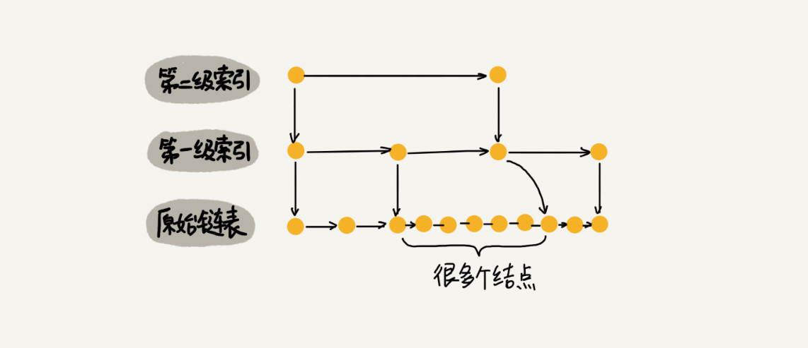

作为一种动态数据结构，我们需要某种手段来维护索引与原始链表大小之间的平衡，也就是说，如果链表中结点过多了，索引结点就相应地增加一些，避免复杂度退化，以及查找、插入、删除操作性能下降。

我们了解到红黑树、AVL树这样平衡二叉树，它们是通过左右旋的方式保持左右子树的大小平衡，而跳表是通过随机函数来维护前面提到的"平衡性"。

当我们往跳表中插入数据的嘶吼，我们可以选择同时将这个数据插入到部分索引层中。如何选择加入哪些索引层呢？

我们通过一个随机函数，来决定将这个结点插入到哪几级索引中，比如随机函数生成了值K，那我们将这个结点添加到第一级到第K级索引中。


随机函数的选择很有讲究，从概率上来讲，能够保证跳表的索引大小和数据大小平衡性，不至于性能过度退化。


## 解答开篇

我们来讲解一下开篇的思考题：为什么Redis要用跳表来实现有序集合，而不是红黑树。

Redis中的有序集合是通过跳表来实现的，严格来说，其实还用到了散列表。不如果我们去查看Redis 的开发手册，就会发现，Redis中的有序集合支持的核心操作主要有下面这几个：

* 插入一个数据；
* 删除一个数据；
* 查找一个数据；
* 按照区间查找数据(比如查找值在[100, 356]之间的数据)；
* 迭代输出有序序列。

其中，插入、删除、查找以及迭代输出有序序列这几个操作，红黑树也可以完成，时间复杂度跟跳表一样。但是，按照区间来查找数据这个操作，红黑树的效率没有跳表高。

对于按照区间查找数据这个操作，跳表可以做到O(logn)的时间复杂度定位区间的起点，然后在原始链表中顺序往后遍历就可以了。这样做非常高效。

当然，Redis 之所以用跳表来实现有序集合，还有其他原因，比如，跳表更容易代码实现。虽然跳表的实现也不简单，但比起红黑树来说还是好懂、好写多了，而简单就意味着可读性好，不容易出错。还有，跳表更加灵活，它可以通过改变索引构建策略，有效平衡执行效率和内存消耗。

不过，跳表也不能完全替代红黑树。因为红黑树比跳表的出现要早一些，很多编程语言中的Map类型都是通过红黑树来实现的。我们做业务开发的时候，直接拿来用就可以了，不用费劲自己去实现一个红黑树，但是跳表并没有一个现成的实现，所以在开发中，如果我们想要使用跳表，必须要自己实现。


## 内容小结

今天我们学习了跳表这种数据结构。跳表使用空间换时间的设计思路，通过构建多级索引来提高查询的效率，实现了基于链表的"二分查找"。跳表是一种动态数据结构，支持快速地插入、删除、查找操作，时间复杂度都是O(logn).

跳表的空间复杂度是O(n)。不过，跳表的实现非常灵活，可以通过改变索引构建策略，有效平衡执行效率和内存消耗。虽然跳表的代码实现并不简单，但是作为一种动态数据结构，比起红黑树来说，实现要简单多了。所以很多时候，我们为了代码的简单、易读，比起红黑树，我们更倾向于跳表。


## D45(2020/11/19)

今天要学习的是散列表中的第一部分的内容。


## 散列思想

散列表的英文叫"Hash Table"，我们平时也叫它"哈希表"或者"Hash表"。

散列表用的是数组支持按照下标随机访问数据的特性，所以散列表其实就会数组的一种扩展，由数组演化而来。可以说，如果没有数组，就没有散列表。

这里用一个例子来解释一下。假如我们有89名选手参加学校运动会。为了方便记录成绩，每个选手胸前都会贴上自己的参赛号码。这89名选手的编号依次是1到89。现在我们希望编程实现这样一个功能，通过编号快速找到对应的选手信息。

我们可以把这89名选手的信息放在数组里。编号为1的选手，我们放到数组中下标为1的位置；编号为2的选手，我们放到数组中下标为2的位置。以此类推，编号为K的选手放到数组中下标为K的位置。

因为参赛编号跟数组下标一一对应，当我们需要查询参赛编号为x的选手的时候，我们只需要将下标为x的数组元素取出来就可以了，时间复杂度就是O(1)。这样按照编号查找选手信息。

实际上，这个例子已经用到了散列的思想。在这个例子里，参赛编号是自然数，并且与数组的下标形成一一映射，所以利用数组支持根据下标随机访问的时候，时间复杂度是O(1)这一特性，就可以实现快速查找编号对应的选手的信息。

假设校长说，参赛编号不能设置得这么简单，要加上年级、班级这些更详细的信息，所以我们把编号的规则稍微修改了一下，用6位数字来表示。比如051167，其中，前两位05表示年级，中间两位11表示班级，最后两位还是原来的编号1到89。这个时候我们该如何存储选手信息，才能够支持通过编号来快速查找选手信息呢？

思路还是跟前面类似。尽管我们不能直接把编号作为数组下标，但我们可以截取参数编号的后两位作为数组下标，来存取选手信息数据。当通过参数编号查询选手信息的时候，我们用同样的方法，取参赛编号的后两位，作为数组下标，来读取数组中的数据。

这就是典型的散列思想。其中，参赛选手的编号我们叫做键(key)或者关键字。我们用它来标识一个选手。我们把参数编号转化为数组下标的映射方法就叫做散列函数(或Hash函数  哈希函数)，而散列函数计算得到的值就叫做散列值。


通过这个例子，我们可以总结出这样的规律：散列表用的就是数组支持按照下标随机访问的时候，时间复杂度是O(1)的特性。我们通过散列函数把元素的键值映射为下标，然后量数据存储在数组中对应下标的位置。当我们按照键值查询元素时，我们用同样的散列函数，将键值转化数组下标，从对应的数组下标的位置取数据。


## 散列函数

散列函数在散列表中起着非常关键的作用。

散列函数，顾名思义，它是一个函数。我们可以把它定义为hash(key)，其中key表示元素的键值，hash(key)的值表示经过散列函数计算得到的散列值。

那第一个例子中，编号就是数组下标，所以hash(key)就等于key。改造后的例子，写成散列函数稍微有点复杂。下面用伪代码将它写成函数如下：

``` 
int hash(String key) {
  // 获取后两位字符
  string lastTwoChars = key.substr(length-2, length);
  // 将后两位字符转换为整数
  int hashValue = convert lastTwoChas to int-type;
  return hashValue;
}
```

刚刚举的学校运动会的例子，散列函数比较简单，也比较容易想到。但是，如果参数选手的编号是随机生成的6位数字，又或者用的是a到z之间的字符串，该如何构造散列函数呢？我总结了三点散列函数设计的基本要求：

1. 散列函数计算得到的散列值是一个非负整数；
2. 如果key1 = key2，那hash(key1) == hash(key2);
3. 如果key1 != key2，那hash(key1) != hash(key2)。

其中，第一点理解起来应该没有任何问题。因为数组下标是从0开始的，所以散列函数生成的散列值也要是非负整数。第二点也很好理解。相同的key，经过散列函数得到的散列值也应该是相同的。

第三点理解起来可能会有问题。这个要求看起来合情合理，但是在真实的情况下，要想找到一个不同的key对应的散列值都不一样的散列函数，几乎是不可能的。即便是业界著名的MD5、SHA、CRC等哈希算法，也无法完全避免这种散列冲突。

所以我们几乎无法找到一个完美的无冲突的散列函数，即便能够找到，付出的时间成本、计算成本也是很大的，所以针对散列冲突问题，我们需要通过其他途径 解决。


## 散列冲突

再好的散列函数也无法避免散列冲突。那究竟该如何解决散列冲突问题呢？我们常用的散列冲突解决方法有两类，开放寻址法和链表法。


### 开放寻址法

开放寻址法的核心思想是，如果出现了散列冲突，我们就重新探测一个空闲位置，将其插入。那如何重新探测新的位置呢？我先讲一个比较简单的探测方法，线性探测。

当我们往散列表中插入数据时，如果某个数据经过散列函数散列之后，存储位置已经被占用了，我们就从当前位置开始，依次往后查找，看是否有空闲位置，知道找到为止。

如下面图示来看，这里面黄色的色块表示空闲位置，橙色的色块表示已经存储了数据。


从图中可以看出，散列表的大小为10，在元素x插入散列表之前，已经6个元素插入到散列表中。x经过Hash算法之后，被散列到位置下标为7的位置，但是这个位置已经有数据了，所以就产生了冲突。于是我们就顺序地往后一个一个找，看有没有空闲的位置，遍历到尾部都没有找到空闲的位置，于是我们再从表头开始找，直到找到空闲位置2，于是将其插入到这个位置。

在散列表中查找元素的过程有点儿类似插入过程。我们通过散列函数求出要查找元素的键值对应的散列值，然后比较数组中下标为散列值的元素和要查找的元素。如果相等，则说明就是我们要找的元素；否则就顺序往后依次查找。如果遍历到数组中的空闲位置，还没有找到，就说明要查找的元素并没有在散列表中。


散列表跟数组一样，不仅支持插入、查找操作，还支持删除操作。对于使用线性探测法解决冲突的散列表，删除操作稍微有些特别。我们不能单纯地把要删除的元素设置为空。

在查找的时候，一旦我们通过线性探测方法，找到一个空闲位置，我们就可以认定散列表中不存在这个数据。但是，如果这个空闲位置是我们后来删除的，就会导致原来的查找算法失效。本来存在的数据，会被认定为不存在。

我们可以将删除的元素，特殊标记为deleted。当线性探测查找的时候，遇到标记为deleted的空间，并不是停下来，而是继续往下探测。

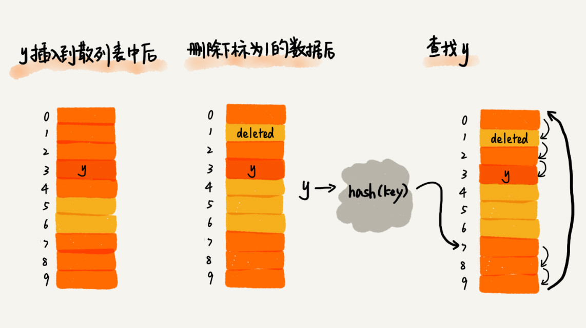

我们可能已经发现了，线性探测法其实存在很大的问题。当散列表中插入的数据越来越多的时候，散列冲突发生的可能性就会越来越大，空闲位置会越来越少，线性探测的时间就会越来越久。极端情况下，我们可能需要探测整个散列表，所以最坏情况下时间复杂度是O(n)。同理，在删除和查找的时候，也有可能会线性探测整张散列表，才能找到要查找或删除的数据。

对于开放寻址冲突解决方法，除了线性探测方法之外，还有另外两种比较经典的探测方法，二次探测和双重散列。

所谓二次探测，跟线性探测很像，线性探测的每次探测的步长是1，那它探测的下标序列就是hash(key)+0，hash(key)+1，hash(key)+2 .... 而二次探测探测的步长就变成了原来的"二次方"，也就是说，它探测的下标序列就是hash(key)+0，hash(key)+1^2 , hash(key)+2^2  ....

所谓双重散列，意思就是不仅要使用一个散列函数。我们使用一组散列函数hash1(key)，hash2(key)，hash3(key) ....我们先用第一个散列函数，如果计算得到的存储位置已经被占用，再用第二个散列函数，依次类推，知道找到空闲的存储位置。

不管采用哪种探测方法，当散列表中空闲位置不多的时候，散列冲突的概率就会大大提高。为了尽可能保证散列表的操作效率，一般情况下，我们会尽可能保证散列表中有一定比例的空闲槽位。我们用装载因子来表示空位的多少。

装载因子的计算公式是：

`散列表的装载因子 =  填入表中的元素个数/散列表的长度`

装载因子越大，说明空闲位置越少，冲突越多，散列表的性能会下降。


### 链表法

链表法是一种更加常用的散列冲突解决办法，相比开放寻址法，它要简单很多。我们来看下面的图示，在散列表中，每个"桶(bucket)"或者"槽(slot)"会对应一条链表，所有散列值相同的元素我们都放到相同槽位对应的链表中。


当插入的时候，我们只需要通过散列函数计算出对应的散列槽位，将其插入到对应链表中即可，所以插入的时间复杂度是O(1)。当查找、删除一个元素的时候，我们同样通过散列函数计算出对应的槽，然后遍历链表查找或删除。

实际上，这两个操作的时间复杂度跟链表的长度k成正比，也就是O(k)。对于散列比较均匀的散列函数来说，理论上讲，k=n/m，其中n表示散列中数据的个数，m表示散列表中"槽"的个数。


## 解答开篇

Word文档中单词拼写检查功能是如何实现的？

常用的英文单词有20万个左右，假设单词的平均长度是10个字母，平均一个单词占用10个字节的内存空间，那20W英文单词大约占2MB的存储空间，就算放大10倍也就是20MB。对于现在的计算机来说，这个大小完全可以放在内存里面。所以我们可以用散列表来存储整个英文单词词典。

当用户输入某个英文单词的时候，我们拿用户输入的单词去散列表中查找。如果查到，则说明拼写正确；如果没有查到，则说明拼写可能有误，给予提示。借助散列表这种数据结构，我们就可以轻松实现快速判断是否存在拼写错误。


## 内容小结

散列表来源于数组，它借助散列山水对数组这种数据结构进行扩展，利用的是数组支持按照下标随机访问元素的特性。散列表两个核心问题是散列函数设计和散列冲突解决。散列冲突有两种常用的解决方法，开放寻址法和链表法。散列函数的设计好坏决定了散列冲突的概率，也就决定散列表的性能。


## D46(2020/11/23)

今天要学习的是散列表中的第二部分的内容。


通过上一节的学习，我们知道，散列表的查询效率并不能笼统地说成是O(1)。它跟散列函数、装载因子、散列冲突等都有关系。如果散列函数设计得不好，或者装载因子过高，都可能导致散列冲突发生的概率升高，查询效率下降。

在极端情况下，有些恶意的攻击者，还有可能通过精心构造的数据，使得所有的数据经过散列函数之后，都散列到同一个槽里。如果我们使用的是基于链表的冲突解决方法，那这个时候，散列表就会退化为链表，查询的时间复杂度就从O(1)急速退化为O(n)。

如果散列表中有10万个数据，退化后的散列表查询的效率就下降了10万倍。更直接点说，如果之前运行100次查询只需要0.1秒，那现在就需要1万秒。这样就有可能因为查询操作消耗大量CPU或线程资源，导致系统无法响应其他请求，从而达到拒绝服务攻击(DoS)的目的。这也就是散列表碰撞攻击的基本原理。

今天，我们就来学习一下，如何设计一个可以应对各种异常情况的工业级散列表，来避免在散列冲突的情况下，散列表性能的急剧下降，并且能抵抗散列碰撞攻击？


## 如何设计散列函数？

散列函数设计的好坏，决定了散列表冲突的概率大小，也直接决定了散列表的性能。那什么才是好的散列函数呢？

首先，散列函数的设计不能太复杂。过于复杂的散列函数，势必会消耗很多计算时间，也就间接影响到散列表的性能。

其次，散列函数生成的值要尽可能随机并且均匀分布，这样才能避免或者最小化散列冲突，而且即便出现冲突，散列到每个槽里的数据也会比较平均，不会出现某个槽内数据特别多的情况。

实际工作中，我们还需要综合考虑各种因素。这些因素有关键字的长度、特点、分布、还有散列表的大小等。散列函数各式各样，我举几个常用的、简单的散列函数的设计方法，让我们有个直观的感受。

第一个例子就是我们上一节的学生运动会的例子，我们通过分析参赛编号的特征，把编号中的后两位作为散列值。我们还可以用类似的散列函数处理手机号码，因为手机号码前几位重复的可能性很大，但是后面几位就比较随机，我们可以取手机号的后四位作为散列值。这种散列函数的设计方法，我们一般叫做"数据分析法"。

第二个例子就是上一节的开篇思考题，如何实现Word拼写检查功能。这里面的散列函数，我们就可以这样设计：将单词中每个字母的ASCII码值"进位"相加，然后再跟散列表的大小求余、取模，作为散列值。

``` 
hash("nice")=(("n" - "a") * 26*26*26 + ("i" - "a")*26*26 + ("c" - "a")*26+ ("e"-"a")) / 78978
```

实际上，散列函数的设计方法还有很多，比如直接寻址法、平方取中法、折叠法、随机数法等。


## 装载因子过大了怎么办？

我们上一节讲到散列表的装载因子的时候说过，转载因子越大，说明散列表中的元素越多，空闲位置越少，散列冲突的概率就越大。不仅插入数据的过程要多次寻址或者拉很长的链，查找的过程也会因此变得很慢。

对于没有频繁插入和删除的静态数据集合来说，我们很容易根据数据的特点、分布等，设计出完美的、极少冲突的散列函数，因为毕竟之前数据都是已知的。

对于动态散列表来说，数据集合是频繁变动的，我们事先无法预估将要加入的数据个数，所以我们也无法事先申请一个足够大的散列表。随着数据慢慢加入，装载因子就会慢慢变大。当装载因子大到一定程度之后，散列冲突就会变得不可接受。这个时候，我们该如何处理呢？

我们可以参照之前学习的"动态扩容"的知识点，我们在数组、栈、队列的时候是如何实现动态扩容的。

针对散列表，当装载因子过大的时候，我们也可以进行动态扩容，重新申请一个更大的散列表，将数据搬移到这个散列表中。假设每次扩容我们都申请一个原来散列表大小两倍的空间。如果原来散列表的装载因子是0.8，那经过扩容之后，新散列表的装载因子就下降为原来的一半，变成了0.4。

针对数据的扩容，数据搬移操作比较简单。但是，针对散列表的扩容，数据搬移操作要复杂很多。因为散列表的大小变了，数据的存储位置也变了，所以我们需要通过散列函数重新计算每个数据的存储位置。

可以看到图里这个例子。在原来的散列表中，21这个元素原来存储在下标Wie0的位置，搬移到新的散列表中，存储在下标为7的位置。


对于支持动态扩容的散列表，插入操作的时间复杂度是多少呢？

插入一个数据，最好情况下，不需要扩容，最好时间复杂度是O(1)。最坏情况下，散列表装载因子过高，启动扩容，我们需要重新申请内存空间，重新计算哈希位置，并且搬移数据，所以时间复杂度是O(n)。用摊还分析法，均摊情况下，时间复杂度接近最好情况，就是O(1).

实际上，对于动态散列表，随着数据的删除，散列表中的数据会越来越少，空闲空间会越来越多。如果我们对空间消耗非常敏感，我们可以在转载因子小于某个值之后，启动动态缩容。当然，如果我们更加在意执行效率，能够容忍多消耗一点内存空间，那就可以不用费劲来缩容了。

我们前面讲到，当散列表的装载因子超过某个阈值时，就需要进行扩容。装载因子阈值需要选择得当。如果太大，会导致冲突过多；如果太小，会导致内存浪费严重。

装载因子阈值的设置要权衡时间、空间复杂度。如果内存空间不紧张，对执行效率要求很高，可以降低负载因子的阈值；相反，如果内存空间紧张，对执行效率要求又不高，可以增加负载因子的值，甚至可以大于1。


## 如何避免低效的扩容？

我们刚刚分析得到，大部分情况下，动态扩容的散列表插入一个数据都很快，但是在特殊情况下，当装载因子已经达到阈值，需要先进行扩容，再插入数据。这个时候，插入数据就会变得很慢，甚至会无法接受。

这里有个极端的例子，如果散列表当前大小为1GB，要想扩容为原来的两倍大小，那就需要对1GB的数据重新计算哈希值，并且从原来的散列表搬移到新的散列表，听起来就很耗时。

如果我们的业务代码直接服务于用户，尽管大部分情况下，插入一个数据的操作都很快，但是，极个别非常慢的插入操作，也会让用户崩溃。这个时候，"一次性"扩容的机制就不合适了。

为了解决一次性扩容耗时过多的情况，我们可以将扩容操作穿插在插入操作的过程中，分批完成。当装载因子触达阈值之后，我们只申请新空间，但并不将老的数据搬移到新散列表中。

当有新数据要插入时，我们将新数据插入新散列表中，并且从老的散列表中拿出一个数据放入到新散列表中。每次插入一个数据到散列表，我们都重复上面的过程。经过多次插入操作之后，老的散列表中的数据就一点一点全部搬移到新散列表中了。这样没有了集中的一次性数据搬移，插入操作就都变得很快了。


这期间的查询操作怎么来做呢？对于查询操作，为了兼容了新、老散列表中的数据，我们先从新散列表中查找，如果没有找到，再去老的散列表中查找。

通过这样均摊的方法，将一次性扩容的代价，均摊到多次插入操作中，就避免了一次性扩容耗时过多的情况。这种实现方式，任何情况下，插入一个数据的时间复杂度都是O(1)。


## 如何选择冲突解决方法？

上一节中我们讲解了两种主要的散列冲突的解决办法，开放寻址法和链表法。这两种冲突解决办法在实际的软件开发中都非常常用。比如，Java中LinkedHashMap就采用了链表法解决冲突，ThreadLocalMap是通过线性探测的开放寻址法来解决冲突。


### 开放寻址法

开放寻址法不像链表法，需要拉很多链表。散列表中的数据都存储在数组中，可以有效地利用CPU缓存来加快查询速度。而且，这种方法实现的散列表，序列化起来比较简单。链表法包含指针，序列化起来就没有那么容易。序列化是很常用的场景。

开放寻址法又有哪些缺点呢？

用开放寻址法解决冲突的散列表，删除数据的时候比较麻烦，需要特殊标记已经删掉的数据。而且，在开放寻址法中，所有的数据都存储在一个数组中，比起链表法来说，冲突的代价更高。所以，使用开放寻址法解决冲突的散列表，装载因子的上限不能太大。这也导致这种方法比链表法更浪费内存空间。

我总结一下，当数据量比较小、装载因子小的时候，适合采用开放寻址法。这也是Java中的ThreadLocalMap使用开放寻址法解决散列冲突的原因。


### 链表法

首先，链表法对内存的利用率比开放寻址法要高。因为链表结点可以在需要的时候再创建，并不需要像开放寻址法那样事先申请好。实际上，这一点也是我们前面讲过的链表优于数组的地方。

链表法比起开放寻址法，对大装载因子的容忍度更高。开放寻址法只能适用装载因子小于1的情况。接近1时，就可能会有大量的散列冲突，导致大量的探测、再散列等，性能会下降很多。但是对于链表法来说，只要散列函数的值随机均匀，即便装载因子变成10，也就是链表的长度变长了而已，虽然查找效率有所下降，但是比起顺序查找还是快很多。

我们在讲解链表的时候，提及。链表因为要存储指针，所以对于比较小的对象的存储，是比较消耗内存的，还有可能会让内存的消耗翻倍。而且，因为链表中的结点是零散分布在内存中的，不是连续的，所以对CPU缓存是不友好的，这方面对于执行效率也有一定的影响。

当然，如果我们存储的是大对象，也就是说要存储的对象的大小远远大于一个指针的大小(4个字节或8个字节)，那链表中指针的内存消耗在大对象面前就可以忽略了。

实际上，我们对链表法稍加改造，可以实现一个更加高效的散列表。那就是，我们将链表法中的链表改造为其他高效的动态数据结构，比如跳表、红黑树。这样，即便出现散列冲突，极端情况下，所有的数据都散列到同一个桶内，那最终退化成的散列表的查找时间也只不过是O(logn)。这样也就有效避免了前面讲到的散列碰撞攻击。


所以，我总结一下，基于链表的散列冲突处理方法比较适合存储大对象、大数据量的散列表，而且，比起开放寻址法，它更加灵活，支持更多的优化策略，比如用红黑树代替链表。


## 工业级散列表举例分析

现在，我们就以Java中的HashMap为例，来介绍工业级的散列表。


### 初始大小

HashMap默认的初始大小是16，当然这个默认值是可以设置的，如果事先知道大概的数据量有多大，可以通过修改默认初始大小，减少动态扩容的次数，这样会大大提高HashMap的性能。


### 装载因子和动态扩容

最大装载因子默认是0.75，当HashMap中元素个数超过0.75*capacity(capacity表示散列报的容量)的时候，就会启动扩容，每次扩容都会扩容为原来的两倍大小。


### 散列冲突解决办法

HashMap底层采用链表法来解决冲突。即使负载因子和散列函数设计得再合理，也免不了会出现拉链过长的情况，一旦出现拉链过长，则会严重影响HashMap的性能。

于是，在JDK1.8版本中，为了对HashMap做进一步优化，我们引入了红黑树。而当链表长度太长(默认超过8)时，链表就转换为红黑树。我们可以利用红黑树快速增删改查的特点，提高HashMap的性能。当红黑树结点个数少于8个的时候，又会将红黑树转化为链表。因为在数据量较小的情况下，红黑树要维护平衡，比起链表来，性能上的优势并不明显。


### 散列函数

散列函数的设计并不复杂，追求的是简单高效、分布均匀。如下所示：

``` 
int hash(Object key) {
    int h = key.hashCode()；
    return (h ^ (h >>> 16)) & (capicity -1); //capicity表示散列表的大小
}
```

其中，hashCode()返回的是Java对象的hash code。比如String类型的对象的hashCode()就是下面：

``` 
public int hashCode() {
  int var1 = this.hash;
  if(var1 == 0 && this.value.length > 0) {
    char[] var2 = this.value;
    for(int var3 = 0; var3 < this.value.length; ++var3) {
      var1 = 31 * var1 + var2[var3];
    }
    this.hash = var1;
  }
  return var1;
}
```


## 解答开篇

现在，我们来分析一下开篇的问题：如何设计一个工业级的散列函数？如果这是一道面试题或摆在我们面前的实际开发问题，我们会从哪几个方面思考呢？

首先，我们会思考，什么是一个工业级的散列表？工业级的散列表应该具有哪些特性？

结合已经学习过的散列知识，我们觉得应该有这样几点要求：

* 支持快速地查询、插入、删除操作；
* 内存占用合理，不能浪费过多的内存空间；
* 性能稳定，极端情况下，散列表的性能也不会退化到无法接受的情况。

如何实现这样一个散列表呢？根据前面讲到的知识，我们会从这三个方面来考虑设计思路：

* 设计一个合适的散列函数；
* 定义装载因子阈值，并且设计动态扩容策略；
* 选择合适的散列冲突解决方法。


## 内容小结

今天的内容偏向于实战。主要讲解了如何设计一个工业级的散列表，以及如何应对各种异常情况，防止在极端情况下，散列表的性能退化过于严重。我们分了三部分来讲解这些内容：分别是：如何设计散列函数，如何根据转载因子动态扩容，以及如何选择散列冲突解决方法。

关于散列函数的设计，我们要尽可能让散列后的值随机且均匀分布，这样会尽可能地减少散列冲突，即便冲突之后，分配到每个槽内的数据也比较均匀。除此之外，散列函数的设计也不能太复杂，太复杂就会太耗时间，也会影响散列表的性能。

关于散列冲突解决方法的选择，我对比了开放寻址法和链表法两种方法的优劣和适应的场景。大部分情况下，链表法更加普适。而且，我们还可以通过将链表法中的链表改造成其他动态查找数据结构，比如红黑树，来避免散列表时间复杂度退化成O(n)，抵御散列碰撞攻击。但是，对于小规模数据、装载因子不高的散列表，比较适合用开放寻址法。

对于动态散列表来说，不管我们如何设计散列函数，选择什么样的散列冲突解决方法。随着数据的不断增加，散列表总会出现装载因子过高的情况。这个时候，我们就需要启动动态扩容。


## D47(2020/11/24)

今天要学习的是散列表的第三篇，重点考虑散列表和链表的结合。

在链表那一节，我们讲到如何用链表来实现LRU缓存淘汰算法，但是链表实现的LRU缓存淘汰算法的时间复杂度是O(n)，我们可以通过散列表将这个时间复杂度降低到O(1)。

在跳表那一节，我们提到Redis的有序集合是使用跳表来实现的，跳表可以看作一种改进版的链表。当时我们也提到，Redis有序集合不仅使用了跳表，还用到了散列表。

除此之外，我们会发现在Java编程语言中，LinkedHashMap这样一个常用的容器，也用到了散列表和链表两种数据结构。

这里我们就来讨论，散列表和链表都是如何组合起来使用的，以及为什么散列表和链表会经常放到一块使用。


## LRU缓存淘汰算法

在链表那一节中，我们提到，借助于散列表，我们可以把LRU缓存淘汰算法的时间复杂度降低为O(1)。

LRU也就是Least Recently Used，也就是最近最少使用，选择最近最久未使用的页面予以淘汰。

下面是我们之前利用链表来实现LRU缓存淘汰算法的。

我们需要维护一个按照访问时间从大到小有序排列的链表结构。因为缓存大小有限，当缓存空间不够，需要淘汰一个数据，我们就直接将链表头部的结点删除。

当要缓存某个数据的时候，先在链表中查找这个数据。如果没有找到，则直接将数据放入到链表的头部；如果找到了，我们就把它移动到链表的头部。因为查找数据需要遍历链表，所以单纯用链表实现的LRU缓存淘汰算法的时间复杂度很高，是O(n)。

实际上，我们总结一下，一个缓存(cache)系统主要包含下面这几个操作：

* 往缓存中添加一个数据；
* 从缓存中删除一个数据；
* 在缓存中查找一个数据。

这三个操作都涉及"查找"操作，如果单纯地采用链表的话，时间复杂度只能是O(n)。如果我们将散列表和链表两种数据结构组合使用，可以将这三个操作的时间复杂度都降低到O(1)。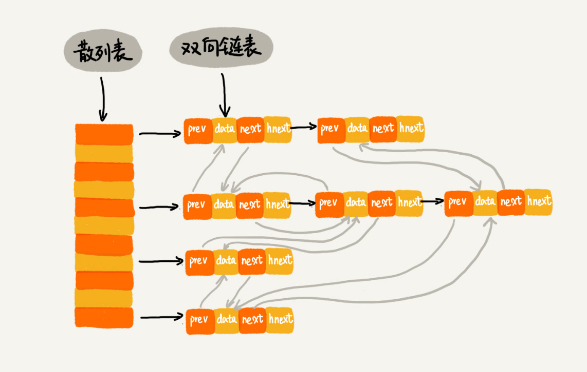

我们使用双向链表存储数据，链表中的每个结点处理存储数据(data)、前驱指针(prev)、后继指针(next)之外，还新增了一个特殊的字段hnext。这个hnext有什么用呢？

因为我们的散列表示通过链表法来解决散列冲突的，所以每个结点会在两条链中。一个链是刚刚我们提到的双向链表，另一个链是散列表中的拉链。前驱和后继指针是为了将结点串在双向链表中，hnext指针是为了将结点串在散列表的拉链中。

了解了这个散列表和双向链表的组合存储结构之后，我们再来看，前面讲到的缓存的三个操作，是如何做到时间复杂度是O(1)的？

1. 每个页面的hash后的值确定的 数组下标位置，后面用链表结点来存。
2. 不同的页面hash后可以有相同的值，相同的数组下标后面用，各个链表结点连接起来。其中各个结点连接起来的指针就是这里的hnext。
3. 各个散列表槽位中的各个链表结点之间，还有一个prev和next指针，这个是用来维护的是页面的访问的时间的。
4. 这个双向链表中，第一个结点是访问最早的时间。最后一个结点是访问最后的时间。
5. 要访问新页面的时候，先计算该页面的hash值，到对应的槽位（数组下标后面一串链表结点中），去找一找是否有已有的页面。
6. 如果没有找到，那么就在刚才找的数组下标后面的一串链表结点末尾增加这个结点，并且让双向链表的末尾结点指向它。
7. 如果这个时候，缓存要满了，那就先删除双向链表的一个结点，再去增加双向链表的末尾结点。
8. 如果找到了，那么就调整双向链表中这个结点的顺序，这个结点塞到双向链表的最后。

首先，我们来看如何查找一个数据。我们前面讲过，散列表中查找数据的时间复杂度接近O(1)，所以通过散列表，我们可以很快地在缓存中找到一个数据。当找到数据之后，我们还需要将它移动到双向链表的尾部。

其次，我们来看如何删除一个数据。我们需要找到数据所在的结点，然后将结点删除。借助散列表，我们可以在O(1)时间复杂度里找到要删除的结点。因为我们的链表是双向链表，双向链表可以通过前驱指针O(1)时间复杂度获取前驱结点，所以在双向链表中，删除结点只需要O(1)的时间复杂度。

最后，我们来看如何添加一个数据。添加数据到缓存稍微有点麻烦，我们需要先看这个数据是否已经在缓存中。如果已经在其中，需要将其移动到双向链表的尾部；如果不在其中，还要看缓存有没有满。如果满了，则将双向链表头部的结点删除，然后再将数据放到链表的尾部；如果没有满，就直接将数据放到链表的尾部。

这整个过程涉及的查找操作都可以通过散列表来完成。其他的操作，比如删除头结点、链表尾部插入数据等，都可以在O(1)的时间复杂度内完成。所以，这三个操作的时间复杂度都是O(1)。至此，我们就通过散列表和双向链表的组合使用，实现了一个高效的、支持LRU缓存淘汰算法的缓存系统原型。


## Redis有序集合

在跳表那一节，讲到有序集合的操作时，我们稍稍做了些简化。实际上，在有序集合中，每个成员对象有两个重要的属性，key(键值)和score(分值)。我们不仅会通过score来查找数据，还会通过key来查找数据。

举个例子，比如用户积分排行榜有这样一个功能：我们可以通过用户的ID来查找积分信息，也可以通过积分区间来查找用户ID或姓名信息。这里包含ID、姓名和积分的用户信息，就是成员对象，用户ID就是key，积分就是score。

所以，如果我们细化一下Redis有序集合的操作，那就是下面这样：

* 添加一个成员对象；
* 按照键值来删除一个成员对象；
* 按照键值来查找一个成员对象；
* 按照分值区间来查找数据，比如积分在[100,356]之间的成员对象；
* 按照分值从小到大排序成员变量；

如果我们仅仅按照分值将成员对象组织成跳表的结构，那按照键值来删除、查询成员对象就会很慢，解决方法与LRU缓存淘汰算法的聚集方法类似。我们可以再按照键值构建一个散列表，这样按照key来删除、查找一个成员对象的时间复杂度就变成了O(1)。同时，借助跳表结构，其他操作也非常高效。

实际上，Redis有序集合的操作还有另外一类，也就是查找成员对象的排名(Rank)或者根据排名区间查找成员对象。


## Java LinkedHashMap

前面我们学习了两个散列表和链表结合的例子，这里再看一个Java中的LinkedHashMap这种容器。

在Java中的HashMap底层就是通过散列表这种数据结构实现的。而LinkedHashMap前面比HashMap多了一个 "Linked"。

实际上，LinkedHashMap并没有这么简单，其中的"Linked"也并不仅仅代表它是通过链表法解决散列冲突的。

LinedHashMap也是通过散列表和链表组合在一起实现的。实际上，它不仅支持按照插入顺序遍历数据，还支持按照访问顺序来遍历数据。


### 按照插入的顺序打印

看下面的一段hashmap的代码，我们依次插入(3,11)，(1,12), (5,23), (2,22)。接下里打印出来，发现打印出来的顺序就是3,1,5,2。

``` 
HashMap<Integer, Integer> m = new LinkedHashMap<>();
m.put(3, 11);
m.put(1, 12);
m.put(5, 23);
m.put(2, 22);

for (Map.Entry e : m.entrySet()) {
  System.out.println(e.getKey());
}
```

这个问题，实际上是比较奇怪的，按照我们对HashMap的字面意思，散列表中的数据不是经过散列函数打乱之后无规则存储的么，这里怎么就按照数据的插入顺序来遍历打印了呢？

实际上，我们已经可以猜测出LinkedHashMap也是通过散列表和链表组合在一起实现。

实际上，它不仅支持按照插入顺序遍历数据，还支持按照访问顺序来遍历数据。


### 按照访问顺序来遍历

看如下的HashMap的代码

``` 
// 10是初始大小，0.75是装载因子，true是表示按照访问时间排序
HashMap<Integer, Integer> m = new LinkedHashMap<>(10, 0.75f, true);
m.put(3, 11);
m.put(1, 12);
m.put(5, 23);
m.put(2, 22);

m.put(3, 26);
m.get(5);

for (Map.Entry e : m.entrySet()) {
  System.out.println(e.getKey());
}
```

我们先是不断的put了3,1,5,2 四个 key/value对。然后再put 了 (3,26)，接着再get(5)。

这段代码打印的结果是1，2，3，5。接下来我们具体分析一下，为什么这段代码会按照这样的顺序来打印。

每次调用put()函数，往LinkedHashMap中添加数据的时候，都会将数据添加到链表的尾部，所以，在前四个从操作完成之后，链表中的数据是下面这样：


在第8行代码中，再次将键值为3的数据放入到LinkedHashMap的时候，会先查找这个键值是否已经有了，然后，再将已经存在的(3,11)删除，并且将新的(3,26)放到链表的尾部。所以，这个时候链表中的数据就是下面这样：


当第9行代码访问到key为5的数据的时候，我们将被访问的数据移动到链表的尾部。所以，第8行代码之后，链表中的数据是下面这样：


所以，最后打印出来的数据是1,2,3,5。从上面的分析，我可以返现，按照访问时间排序的LinkedHashMap本身就是一个支持LRU缓存淘汰策略的缓存系统。

现在总结一下，实际上，LinkedHashMap是通过双向链表和散列表这两种数据结构组合实现的。LinkedHashMap中的"Linked"实际上是指的是双向链表，并非指用链表法解决散列冲突。


## 解答开篇&内容小结

为什么散列表和链表经常一块使用呢？

散列表这种数据结构虽然支持非常高效的数据插入、删除、查找操作，但是散列表中的数据都是通过散列函数打乱之后无规律存储的。也就是说，它无法支持按照某种顺序快速地遍历数据。如果希望按照顺序遍历散列表中的数据，那我们需要将散列表中的数据拷贝到数组中，然后排序，再遍历。

因为散列表是动态数据结构，不停地有数据的插入、删除，所以每当我们希望按照顺序遍历散列表中的数据的时候，都需要先排序，那效率势必会很低。为了解决这个问题，我们将散列表和链表(或者跳表)结合在一起使用。  

用链表或跳表的数据结构，来实现对散列表中的各个数据有序的排序。


## D48(2020/11/25)

今天我们要学习的哈希算法的第一篇。"如何防止数据库中的用户信息被脱库？"


## 什么是哈希算法？

哈希算法的定义和原理非常简单，将任意长度的二进制值串映射为固定长度的二进制值串，这个映射的规则就是哈希算法，而通过原始数据映射之后得到的二进制值串就是哈希值。

但是，要想设计一个优秀的哈希算法并不容易，可以参照如下几点要求：

* 从哈希值不能反向推导出原始数据(所以哈希算法也叫单向哈希算法)；
* 对输入数据非常敏感，哪怕原始数据只修改了一个bit，最后得到的哈希值也大不相同；
* 散列冲突的概率要很小，对于不同的原始数据，哈希值相同的概率非常小；
* 哈希算法的执行效率要尽量高效，针对较长的文本，也能快速地计算出哈希值。

这里拿MD5这种哈希算法来具体说明一下。

我们分别对"今天我来讲哈希算法"和"jiajia"这两个文本，计算MD5哈希值，得到两串看起来毫无规律的字符串(MD5的哈希值是128位的Bit长度，为了方便表示，我们把它们转化成了16进制编码)。可以看出来，无论要哈希的文本有多长、多短，通过MD5哈希之后，得到的哈希值的长度都是相同的，而且得到的哈希值看起来像一堆随机数，完全没有规律。

我们再来看两个非常相似的文本，"我今天讲哈希算法!"和"我今天讲哈希算法"。这两个文本只有一个感叹号的区别。如果用MD5的哈希算法分别计算它们的哈希值，我们会发现，尽管只有一字之差，得到的哈希值也是完全不同的。

我们在前面也讲解过，通过哈希算法得到的哈希值，很难反向推导出原始数据。比如上面的例子中，我们很难通过哈希值反推出对应的文本。

哈希算法要处理的文本可能是各种各样的。比如，对于非常长的文本，如果哈希算法的计算时间很长，那就只能停留在理论研究的层面，很难应用到实际的软件开发中。

哈希算法的应用非常多，最常见的有七个，分别是安全加密、唯一标识、数据校验、散列函数、负载均衡、数据分片、分布式存储。


## 应用一：安全加密

说到哈希算法的应用，最先想到的应该就是安全加密。最常用于加密的哈希算法是MD5和SHA。

除了这两个之外，当然还有很多其他加密算法，比如DES、AES。

前面讲解的哈希算法四点要求，对用于加密的哈希算法来说，有两点格外重要。第一点是很难根据哈希值反向推导出原始数据，第二点是散列冲突的概率要很小。

第一点很好理解，加密的目的就是防止原始数据泄露，所以很难通过哈希值反向推导原始数据，这是一个最基本的要求。所以我们着重看下第二点。实际上，不管是什么哈希算法，我们只能尽量减少碰撞冲突的概率，理论上是没办法做到完全不冲突的。

这里就基于组合数学中一个非常基础的理论，鸽巢原理(也叫抽屉原理)。这个原理本身很简单，它是说，如果有10个鸽巢，有11个鸽子，那肯定有1个鸽巢中的鸽子数量多于1个，换句话说就是，肯定有2只鸽子在1个鸽巢内。

有了鸽巢原理的铺垫之后，我们再来看，为什么哈希算法无法做到零冲突？

我们知道，哈希算法产生的哈希值的长度是固定且有限的。比如上面举的MD5的例子，哈希值是固定的128位二进制串，能表示的数据是有限的，最多能表示2^128个数据，而我们要哈希的数据是无穷的。基于鸽巢原理，如果我们对2^128+1个数据求哈希值，就必须会存在哈希值相同的情况。这里我们应该可以想到，一般情况下，哈希值越长的哈希算法，散列冲突的概率越低。

不过，即便哈希算法存在散列冲突的情况，但是因为哈希值的范围很大，冲突的概率极低，所以相对来说还是很难破解的。像MD5，有2^128个不同的哈希值，这个数据已经是一个天文数字。所以，即便哈希算法存在冲突，但是在有限的时间和资源下，哈希算还是很难被破解的。

除此之外，没有绝对安全的加密。越复杂、越难破解的加密算法，需要的计算时间也越长。比如SHA-256比SHA-1要更复杂、更安全，相应的计算时间就会比较长。密码学界也一致致力于找到一种快速并且很难被破解的哈希算法。我们在实际的开发过程中，也需要权衡破解难度和计算时间，来决定究竟使用哪种加密算法。


## 应用二：唯一标识

我来先举一个例子。如果要在海量的图库中，搜索一张图是否存在，我们不能单纯地用图片的元信息(比如图片名称)来比对，因为有可能存在名称相同但图片内容不同，或者名称不同图片内容相同的情况。那我们该如何搜索呢？

我们知道，任何文件在计算中都可以表示成二进制码串，所以，比较笨的方法就是，拿要查找的图片的二进制码串与图库中的所有图片的二进制码串一一比对。如果相同，则说明图片在图库中存在。但是，每个图片小则几十KB、大则几MB，转化成二进制是一个非常长的串，比对起来非常耗时。有没有比较快的方法呢？

我们可以给每一个图片取一个唯一标识，或者说信息摘要。比如，我们可以从图片的二进制码串开头取100个字节，从中间取100个字节，从最后再取100个字节，然后将这300个字节放到一块，通过哈希算法(比如MD5)，得到一个哈希字符串，用它作为图片的唯一标识。通过这个唯一标识来判定图片是否在图库中，这样就可以减少很多工作量。

如果还想继续提高效率，我们可以把每个图片的唯一标识，和相应的图片文件在图库中的路径信息，都存储在散列表中。当要查看某个图片是不是图库中的时候，我们先通过哈希算法对这个图片取唯一标识，然后在散列表中查找是否存在这个唯一标识。

如果不存在，那就说明这个图片不再图库中；如果存在，我们再通过散列表中存储的文件路径，获取到这个已经存在的图片，跟现在要插入的图片做全量的比对，看是否完全一样。如果一样，就说明已经存在；如果不一样，说明两张图片尽管唯一标识相同，但是并不是相同的图片。


## 应用三：数据校验

电驴这样的BT下载软件的原理是基于P2P协议的。我们从多个机器上并行下载一个2GB的电影，这个电影文件可能会被分割成很多文件块(比如可用分成100块，每块大约20MB)。等所有的文件块都下载完成之后，再组装成一个完整的电影文件就行了。

我们知道，网络传输是不安全的，下载的文件块有可能是被宿主机器恶意修改过的，又或是下载过程中出现了错误，所以下载的文件块可能不是完整的。如果我们没有能力检测这种恶意修改或文件下载出错，就会导致最终合并后的电影无法观看，甚至导致电脑中毒。现在的问题是，如何来校验文件块的安全、正确、完整呢？

具体的BT协议很复杂，校验方法也有很多，下面是其中的一种思路。

我们通过哈希算法，对100个文件块分别去哈希值，并且保存在种子文件中。我们在前面讲过，哈希算法有一个特点，对数据很敏感。只要文件块的内容有一丁点儿的改变，最后计算出的哈希值就会完全不同。所以，当文件块下载完成之后，我们可以通过相同的哈希算法，对下载好的额文件块逐一求哈希值，然后跟种子文件中保存的哈希值比对。如果不同，说明这个文件块不完整或被篡改了，需要再重新从其他宿主机上下载该文件块。


## 应用四：散列函数

散列函数也是哈希算法的一种应用。

前面提及到，散列函数是设计一个散列表的关键。它直接决定了散列冲突的概率和散列表的性能。不过，相对哈希算法的其他应用，散列函数对于散列算法冲突的要求低很多。即便出现个别散列冲突，只要不是过于严重，我们都可以通过开放寻址法或者链表法来解决。

不仅如此，散列函数对于散列算法计算得到的值，是否能反向解密也并不关系。散列函数中用到的散列算法，更加关注散列后的值是否能平均分布，也就是，一组数据是否能均匀地散列在各个槽中。除此之外，散列函数执行的快慢，也会影响散列表的性能，所以，散列函数用的散列算法一般都比较简单，比较追求效率。


## 内容小结

今天主要讲解了哈希算法的四个应用场景。

第一个应用是唯一标识，哈希算法可以对大数据做信息摘要，通过一个较短的二进制编码来表示很大的数据。

第二个应用是用于校验数据的完整性和正确性。

第三个应用是安全加密，我们讲到任何哈希算法都会出现散列冲突，但是这个冲突概率非常小。越是复杂哈希算法越难破解，但同样计算时间也就越长。所以，选择哈希算法的时候，要权衡安全性和计算时间来决定用哪种哈希算法。

第四个应用是散列函数，在散列表中，对哈希算法的要求非常特别，更加看重的是散列的平均性和哈希算法的执行效率。


## D49(2020/11/26)

上一节，我们讲了哈希算法的四个应用，它们分别是：安全加密、数据校验、唯一标识、散列函数。今天，我们再来看剩余三种应用：负载均衡、数据分片、分布式存储。

这三个应用都跟分布式系统有关。今天就是来研究学习下，哈希算法是如何解决这些分布式问题的。


## 应用五：负载均衡

我们知道，负载均衡算法有很多，比如轮询、随机、加权轮询等。那如何才能实现一个会话粘滞(session sticky)的负载均衡算法呢？也就是说，我们需要在同一个客户端上，上一次会话中的所有请求都路由到同一个服务器上。

最直接的方法就是，维护一张映射关系表，这张表的内容是客户端IP地址或会话ID与服务器编号的映射关系。客户端发出的每次请求，都要先在映射表中查找应该路由到的服务器编号，然后再请求编号对应的服务器。这种方法简单直观，但也有几个弊端：

* 如果客户端很多，映射表可能会很大，比较浪费内存空间；
* 客户端下线、上线，服务器扩容、缩容都会导致映射失效，这样维护映射表的成本就会很大。

如果借助哈希算法，这些问题都可以非常完美地解决。我们可以通过哈希算法，对客户端IP地址或会话ID计算哈希值，将取得的哈希值与服务器列表的大小进行取模运算，最终得到的值就是应该被路由到的服务器编号。这样，我们就可以把同一个IP过来的所有请求，都路由到同一个后端服务器上。


## 应用六：数据分片

哈希算法还可以用于数据的分片。这里有两个例子。


### 如何统计"搜索关键词"出现的次数

假如我们有1T的日志文件，这里面记录了用户的搜索关键词，我们想要快速统计出每个关键词被搜索的次数，该怎么做呢？

我们来分析一下。这个问题有两个难点，第一个是搜索日志很大，没办法放到一台机器的内存中。第二个难点是，如果只用一台机器来处理这么巨大的数据，处理时间会很长。

针对这两个难点，我们可以先对数据进行分片，然后采用多台机器处理的方法，来提高处理速度。具体的思路是这样的：为了提高处理的速度，我们用n台机器并行处理。我们从搜索记录的日志文件中，依次读出每个搜索关键词，并且通过哈希函数计算哈希值，然后再跟n取模，最终得到的值，就是应该被分配到的机器编号。

这样，哈希值相同的搜索关键词就被分配到了同一个机器上。也就是说，同一个搜索关键词会被分配到同一个机器上。每个机器会分别计算关键词出现的次数，最后合并起来就是最终的结果。

实际上，这里的处理过程也是MapReduce的基本设计思想。


### 如何快速判断图片是否在图库中

如何快速判断图片是否在图库中？上一节我们讲过这个例子，当时我们介绍了一种方法，就是给每个图片取唯一标识(或者信息摘要)，然后构建散列表。

假设现在我们的图库中有1亿图片，很显然，在单台机器上构建散列表是行不通的。因为单台机器的内存是有限的，而1亿张图片构建散列表显然远远超过了单台机器的内存上限。

我们同样可以对数据进行分片，然后采用多机处理。我们准备n台机器，让每台机器只维护某一部分图片对应的散列表。我们每次从图库中读取一个图片，计算唯一标识，然后与机器个数n 求余取模，得到的值就是要分配的机器编号，然后将这个图片的唯一标识和图片路径发往对应的机器构建散列表。

当我们要判断一个图片是否在图库中的时候，我们通过同样的哈希算法，计算这个图片的唯一标识，然后与机器个数n求余取模。假设得到的值是k，那就去编号k的机器构建的散列表中查找。

现在，我们来估算一下，给这个1亿图片构建散列表大约需要多少台机器。

散列表中每个数据单元包含两个信息，哈希值和图片文件的路径。假设我们通过MD5来计算哈希值，那长度就是128比特，也就是16字节。文件路径长度的上限是256字节，我们可以假设平均长度是128字节。如果我们用链表法来解决冲突，那还需要存储指针，指针只占用8字节。所以，散列表中每个数据单元就占用 152字节。

假设一台机器的内存大小为2GB，散列表的装载因子为0.75，那一台机器可以给大约1000万(2GB*0.75/152)张图片构建散列表。所以，如果要对1亿张图片构建索引，需要大约十几台机器。在工程中，这种估算还是很重要的，能让我们实现对需要投入的资源、资金有个大概的了解，能更好地平均解决方案的可行性。

实际上，针对这种海量数据的处理问题，我们都可以采用多机分布式处理。借助这种分片的思路，可以突破单机内存、CPU等资源的限制。


## 应用七：分布式存储

现在互联网面对的都是海量的数据、海量的用户。我们为了提高数据的读取、写入能力，一般都采用分布式的方式来存储数据，比如分布式缓存。我们有海量的数据需要缓存，所以一个缓存机器肯定是不够的。于是，我们就需要将数据分布在多台机器上。

该如何决定将哪个数据放到哪个机器上呢？我们可以借用前面数据分片的思想，即通过哈希算法对数据取哈希值，然后对机器个数取模，这个最终值就是应该存储的缓存机器编号。

但是，如果数据增多，原来的10个机器已经无法承受了，我们就需要扩容了，比如扩到11个机器，这个时候麻烦就来了。因为，这里并不是简单地加个机器就可以了。

原来的数据是通过与10来取模的。比如13这个数据，存储在编号为3这台机器上。但是新加了一台机器中，我们对数据按照11取模，原来13这个数据就被分配到2号这台机器上了。


因此，所有的数据都要重新计算哈希值，然后重新搬移到正确的机器上。这样就相当于，缓存中的数据一下子就都失效了。所有的数据请求都会穿透缓存，直接去请求数据库。这样就可能发生雪崩效应，压垮数据库。

所以，我们需要一种方法，使得在新加入一个机器后，并不需要做大量的数据搬移。这时候，一致性哈希算法就要可以用到了。

假设我们有k个机器，数据的哈希值的范围是[0,MAX]。我们将整个范围划分成m个小区间(m远大于k)，每个机器负责m/k个小区间。当有新机器加入的时候，我们就将某几个小区间的数据，从原来的机器中搬移到新的机器中。这样，既不用全部重新哈希、搬移数据，也保持了各个机器上数据数量的均衡。

一致性哈希算法的基本思想就是这样的。除此之外，它还会借助一个虚拟的环和虚拟结点，更加优美地实现出来。


## 解答开篇&内容小结

今天我们讲解了三种哈希算法在分布式系统中的应用，它们分别是：复杂均衡、数据分片、分布式存储。

在负载均衡应用中，利用哈希算法替代映射表，可以实现一个会话粘滞的负载均衡策略。在数据分片应用中，通过哈希算法对处理的海量数据进行分片，多机分布式处理，可以突破单机资源的限制。在分布式存储应用中，利用一致性哈希算法，可以解决缓存等分布式系统的扩容、缩容导致数据大量搬移的难题。


## D50(2020/11/28)(二叉树)

今天学习二叉树基础的第一篇。

前面我们讲的都是线性表结构，栈、队列等等。今天我们讲一种非线性表结构，树。树这种数据结构比线性表的数据结构要复杂得多，内容也比较多，会分四节来讲解。

第一节，我们将讲解树和二叉树；第二节，我们将讲解二叉查找树；第三节，平衡二叉查找树、红黑树；第四节，递归树。

今天提出的问题是：二叉树有哪几种存储方式？什么样的二叉树适合用数组来存储？


## 树(Tree)

下面图示中的是一些树，观察这些树都有什么特征？


树这种数据结构很像我们现实生活中的"树"，这里面每个元素我们叫做"节点"；用来连接相邻节点之间的关系，我们叫做"父子关系"。

在下面的这幅画中，A节点就是B节点的父节点，B节点是A节点的子节点。B、C、D这三个节点的父节点是同一个节点，所以它们之间互称为兄弟节点。我们把没有父节点的节点叫做根节点，也就是图中的节点E。我们把没有子节点的节点叫做叶子节点或叶节点，比如图中的G、H、I、J、K、L都是叶子节点。


除此之外，关于"树"，还有三个比较相似的概念：高度(Height)、深度(Depth)、层(Level)。它们的定义是这样的：


这三个概念的定义比较容易混淆，描述起来也比较空洞。从下图的图示中，来观察这些概念的定义。


记住这几个概念，这里还有一个小窍门，就是类比"高度"、"深度"、"层"这几个名词在生活中的含义。

在我们的生活中，"高度"这个概念，其实就是从下往上度量，比如我们要度量第10层楼的高度、第13层楼的高度，起点就是地面。所以，树这种数据结构的高度也是一样，从最底层开始计数，并且计数的起点是0。

"深度"这个概念在生活中是从上往下度量的，比如水中鱼的深度，是从水平面开始度量的。所以，树这种数据结构的速度也是类似的，从根结点开始度量，并且计数起点也是0。

"层数"跟深度的计算类似，不过，计数起点是1，也就是说根节点位于第1层。


## 二叉树

树结构多种多样，我们最常用的还是二叉树。

二叉树，顾名思义，每个节点最多有两个"叉"，也就是两个子结节点，分别是左子节点和右子节点。不过，二叉树并不要求每个节点都有两个子节点，有的节点只有左子节点，有的节点只有右子节点。下面画的都是几个都是二叉树。


这个图里面，有两个比较特殊的二叉树，分别是编号2和编号3这两个。

其中，编号2的二叉树中，叶子节点全部在最底层，除了叶子节点之外，每个节点都有左右两个子节点，这种二叉树就叫做满二叉树。

编号3的二叉树中，叶子节点都在最底下两层，最后一层的叶子节点都靠左排列，并且除了最后一层，其他层的节点个数都要达到最大，这种二叉树叫做完全二叉树。

满二叉树很好理解，也很好识别，但是完全二叉树，有的人就可能分不清了。下面图示中有几个完全二叉树和非完全二叉树的例子，可以对比看。


你可能会说，满二叉树的特征非常明显，我们把它单独拎出来将，这个可以理解。但是完全二叉树的特征不怎么明显，单从长相上来看，完全二叉树并没有特别特殊的地方啊，更像是"芸芸众树"中的一种。

那我们为什么还要特意把它拎出来讲呢？为什么偏偏把最后一层的叶子节点靠左排列的叫完全二叉树？如果靠右排序就不能叫完全二叉树了吗？这个定义的由来或说目的在哪里？

要理解完全二叉树定义的由来，我们需要先了解，如何表示(或者存储)一棵二叉树？

想要存储一棵二叉树，我们有两种方法，一种是基于指针或引用的二叉链式存储法，一种是基于数组的顺序存储法。

我们先来看比较简单、直观的链式存储法。从图中你应该可以很清楚地看到，每个节点有三个字段，其中一个存储数据，另外两个是指向左右子节点的指针。我们只要拎住根节点，就可以通过左右子节点的指针，把整棵树都串起来。这种存储方式我们比较常用。大部分二叉树代码都是通过这种结构来实现的。


我们再来看，基于数组的顺序存储法。我们把根节点存储在下标i=1的位置，那左子节点存储在下标2\*i =2的位置，右子节点存储在2*i +1=3的位置。以此类推，B节点的左子节点存储在2\* i = 2 \* 2 =4的位置，右子节点存储子啊2 \* i + 1 = 2 \* 2 +1 = 5的位置。


我们来总结一下，如果节点X存储在数组中下标为i的位置，下标为2 * i的位置存储的就是左子节点，下标为2 \* i +1 的位置存储的就是右子节点。反过来，下标为i/2的位置存储就是它的父节点。通过这种方式，我们只要知道根节点存储的位置(一般情况下，为了方便计算子节点，根节点会存储在下标为1的位置)，这样就可以通过下标计算，把整棵树都串起来。

上面的一棵完全二叉树的例子中，仅仅"浪费"了一个下标为0的存储位置。如果是非完全二叉树，其实会浪费比较多的数组存储空间。可以看下面的例子。


所以，如果某棵二叉树是一棵完全二叉树，那用数组存储无疑是最节省内存的一种方式。因为数组的存储方式并不需要像链式存储法那样，要存储额外的左右子节点的指针。这也是为什么完全二叉树会单独拎出来的原因，也是为什么完全二叉树要求最后一层的子节点都靠左的原因。

当我们讲到堆和堆排序的时候，就会发现，堆其实就是一种完全二叉树，最常用的存储方式就是数组。


## 二叉树的遍历

前面讲解了二叉树的基本定义和存储方法，现在来看二叉树中非常重要的操作，二叉树的遍历。

如何将所有节点都遍历打印出来呢？经典的方法有三种，前序遍历、中序遍历和后序遍历。其中，前、中、后序，表示的是节点与它的左右子树节点遍历打印的先后顺序。

* 前序遍历是指，对于树中的任意节点来说，先打印这个节点，然后再打印它的左子树，最后打印它的右子树。
* 中序遍历是指，对于树中的任意节点来说，先打印它的左子树，然后再打印它本身，最后打印它的右子树。
* 后序遍历是指，对于树中的任意节点来说，先打印它的左子树，然后再打印它的右子树，最后打印这个节点本身。

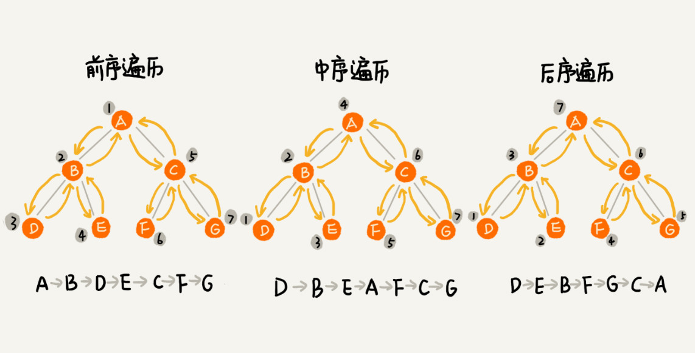

实际上，二叉树的前、中、后序遍历就是一个递归的过程。比如，前序遍历，其实就是先打印根节点，然后再递归地打印左子树，最后递归地打印右子树。

写递归代码的关键，就是看能不能写出递推公式，而写递推公式的关键就是，如果要解决问题A，就假设子问题B、C已经解决，然后再来看如何利用B、C来解决A。所以，我们可以把前、中、后序遍历的递推公式都写出来。

``` 
前序遍历的递推公式：
preOrder(r) = print r->preOrder(r->left)->preOrder(r->right)

中序遍历的递推公式：
inOrder(r) = inOrder(r->left)->print r->inOrder(r->right)

后序遍历的递推公式：
postOrder(r) = postOrder(r->left)->postOrder(r->right)->print r
```

有了递推公式，代码就可以写了。这三种遍历方式的代码，可以见如下的。

``` 
void preOrder(Node* root) {
  if (root == null) return;
  print root // 此处为伪代码，表示打印root节点
  preOrder(root->left);
  preOrder(root->right);
}

void inOrder(Node* root) {
  if (root == null) return;
  inOrder(root->left);
  print root // 此处为伪代码，表示打印root节点
  inOrder(root->right);
}

void postOrder(Node* root) {
  if (root == null) return;
  postOrder(root->left);
  postOrder(root->right);
  print root // 此处为伪代码，表示打印root节点
}
```

二叉树的前、中、后序遍历的递归实现如上，二叉树遍历的时间复杂度是多少？

从前面画的前、中、后序遍历的顺序图，可以看出来，每个节点最多会被访问两次，所以遍历操作的时间复杂度，跟节点的个数n成正比，也就是说二叉树遍历的时间复杂度是O(n)。


## 解答开篇&内容小结

今天，我们讲解了一种非线性表数据结构，树。关于苏，有几个比较常用的概念需要掌握，那就是：根节点、叶子节点、父节点、子节点、兄弟节点，还有节点的高度、深度、层数，以及树的高度。

我们平时最常用的树就是二叉树。二叉树的每个节点最多有两个子结点，分别是左子节点和右子节点。二叉树中，有两种比较特殊的树，分别是满二叉树和完全二叉树。满二叉树又是完全二叉树的一种特殊情况。

二叉树既可以用链式存储，也可以用数组顺序存储。数组顺序存储的方式比较适合完全二叉树，其他类型的二叉树用数组存储会比较浪费存储空间。除此之外，二叉树里非常重要的操作就是前、中、后序遍历操作，遍历的时间复杂度是O(n)，我们需要理解并能用递归代码来实现。


## D51(2020/11/29) (二叉查找树)

上一节我们学习了树、二叉树以及二叉树的遍历，今天我们再来学习一种特殊的二叉树，二叉查找树。二叉查找树最大的特点就是，支持动态数据集合的快速插入、删除、查找操作。

我们之前说过，散列表也是支持这些操作的，并且散列表的这些操作比二叉查找树更高效，时间复杂度是O(1)。既然有了这么高效的散列表，使用二叉树的地方是不是都可以替换成散列表呢？有没有哪些地方是散列表做不了，必须要用二叉树来做的呢？


## 二叉查找树

二叉查找树是二叉树中最常用的一种类型，也叫二叉搜索树。顾名思义，二叉查找树是为了实现快速查找而生的。不过，它不仅仅支持快速查找一个数据，还支持快速插入、删除一个数据。

这些都依赖于二叉查找树的特殊结构。二叉查找树要求，在树中的任意一个节点，其左子树中的每个节点的值，都要小于这个节点的值，而右子树节点的值都大于这个节点的值。


下面来看下二叉查找树的快速查找、插入、删除操作是如何实现的。


### 二叉查找树的查找操作

首先，我们看如何在二叉查找树中查找一个节点。我们先取根节点，如果它等于我们要查找的数据，那就返回。如果要查找的数据比根节点的值小，那就在左子树中递归查找；如果要查找的数据比根节点的值大，那就在右子树中递归查找。


查看下如下的代码。

``` 
public class BinarySearchTree {
  private Node tree;

  public Node find(int data) {
    Node p = tree;
    while (p != null) {
      if (data < p.data) p = p.left;
      else if (data > p.data) p = p.right;
      else return p;
    }
    return null;
  }

  public static class Node {
    private int data;
    private Node left;
    private Node right;

    public Node(int data) {
      this.data = data;
    }
  }
}
```


### 二叉查找树的插入操作

二叉查找树的插入过程有点类似查找操作。新插入的数据一般是在叶子节点上，所以我们只需要从根节点开始，依次比较要插入的数据和节点的大小关系。

如果要插入的数据比节点的数据大，并且节点的右子树为空，就将新数据直接插到右子节点的位置；如果不为空，就再递归遍历右子树，查找插入位置。同理，如果要插入的数据比节点数值小，并且节点的左子树为空，就将新数据插入到左子节点的位置；如果不为空，就再递归遍历左子树，查找插入位置。


具体的代码如下：

``` 
public void insert(int data) {
  if (tree == null) {
    tree = new Node(data);
    return;
  }

  Node p = tree;
  while (p != null) {
    if (data > p.data) {
      if (p.right == null) {
        p.right = new Node(data);
        return;
      }
      p = p.right;
    } else { // data < p.data
      if (p.left == null) {
        p.left = new Node(data);
        return;
      }
      p = p.left;
    }
  }
}
```


### 二叉查找树的删除操作

二叉查找树的查找、插入操作都比较简单易懂，但是它的删除操作就比较复杂了。针对要删除的节点的子节点个数的不同，我们需要分三种情况来处理。

第一种情况是，如果要删除的节点没有子节点，我们只需要直接将父节点中，指向要删除的节点的指针置为null。比如图中的删除节点55。

第二种情况是，如果要删除的节点只有一个子节点(只有左子节点或右子节点)，我们只需要更新父节点中，指向要删除节点的指针，让它指向要删除节点的子节点就可以了。比如图中的删除节点13。

第三种情况是，如果要删除的节点有两个子节点，这就比较复杂了。我们需要找到这个节点的右子树中的最小节点，把它替换到要删除的节点上。然后再删除这个最小节点，因为最小节点肯定没有左子节点(如果有左子节点，那就不是最小节点了)，所以，我们可以应用上面两条规则来删除这个最小节点。比如图中的删除节点18。


如下面的删除代码的示例：

``` 
public void delete(int data) {
  Node p = tree; // p指向要删除的节点，初始化指向根节点
  Node pp = null; // pp记录的是p的父节点
  while (p != null && p.data != data) {
    pp = p;
    if (data > p.data) p = p.right;
    else p = p.left;
  }
  if (p == null) return; // 没有找到

  // 要删除的节点有两个子节点
  if (p.left != null && p.right != null) { // 查找右子树中最小节点
    Node minP = p.right;
    Node minPP = p; // minPP表示minP的父节点
    while (minP.left != null) {
      minPP = minP;
      minP = minP.left;
    }
    p.data = minP.data; // 将minP的数据替换到p中
    p = minP; // 下面就变成了删除minP了
    pp = minPP;
  }

  // 删除节点是叶子节点或者仅有一个子节点
  Node child; // p的子节点
  if (p.left != null) child = p.left;
  else if (p.right != null) child = p.right;
  else child = null;

  if (pp == null) tree = child; // 删除的是根节点
  else if (pp.left == p) pp.left = child;
  else pp.right = child;
}
```

实际上，关于二叉查找树的删除操作，还有个非常简单、取巧的方法，就是单纯将要删除的节点标记为"已删除"，但是并不真正从树中将这个节点去掉。这样原本删除的节点还需要存储在内存中，比较浪费内存空间，但是删除操作就变得简单了很多。而且，这种处理方法也并没有增加插入、查找操作代码实现的难度。


### 二叉查找树的其他操作

除了插入、删除、查找操作之外，二叉查找树中还可以支持快速地查找最大节点和最小节点、前驱节点和后继节点。

二叉查找树除了支持上面几个操作之外，还有一个重要的特性，就是中序遍历二叉查找树，可以输出有序的数据序列，时间复杂度是O(n)，非常高效。因此，二叉查找树也叫做二叉排序树。


## 支持重复数据的二叉查找树

前面讲二叉查找树的时候，我们默认树中节点存储的都是数字。很多时候，在实际的软件开发中，我们在二叉查找树中存储的，是一个包含很多字段的对象。我们利用对象的某个字段作为键值(key)来构建二叉查找树。我们把对象中的其他字段叫做卫星数据。

前面我们讲的二叉查找树的操作，针对的都是不存在键值相同的情况。那如果存储的两个对象键值相同，这种情况该怎么处理呢？这里有两种解决方法。

第一种方法比较容易。二叉查找树中每一个节点不仅会存储一个数据，因为我们通过链表和支持动态扩容的数组等数据结构，把值相同的数据都存储在同一个节点上。

第二种方法比较不好理解，不过更加优雅。

每个节点仍然只存储一个数据。在查找插入位置的过程中，如果碰到一个节点的值，与要插入数据的值相同，我们就将这个要插入的数据放到这个节点的右子树，也就是说，把这个新插入的数据当作大于这个节点的值来处理。


当要查找数据的时候，遇到值相同的节点，我们并不停止查找操作，而是继续在右子树中查找，直到遇到叶子节点，才停止。这样就可以把键值等于要查找值的所有节点都找出来。


对于删除操作，我们也需要先查找到每个要删除的节点，然后再按前面讲的删除操作的方法，依次删除。


## 二叉查找树的时间复杂度分析

上面介绍了二叉查找树的常用操作的实现方式。现在，我们来分析一下，二叉查找树的插入、删除、查找操作的时间复杂度。

实际上，二叉查找树的形态各式各样。比如下面图中，对于同一组数据，我们构造了三种二叉查找树。它们的查找、插入、删除操作的执行效率都不一样的。图中第一种二叉查找树，根节点的左右子树极度不平衡，已经退化成了链表，所以查找的时间复杂度就变成了O(n)。


我们刚才其实分析了一种最糟糕的情况，我们现在来分析一个最理想的情况，二叉查找树是一棵完全二叉树(或满二叉树)。这个时候，插入、删除、查找的时间复杂度是多少呢？

从前面的例子、图，还有代码来看，不管操作是插入、删除还是查找，时间复杂度其实都跟树的高度成正比，也就是O(height)。既然这样，现在问题就转变成另外一个了，也就是，如何求一棵包含n个节点的完全二叉树的高度？

树的高度就等于最大层数减1，为了方便计算，我们转换成层来表示。从图中可以看出，包含n个节点的完全二叉树中，第一层包含1个节点，第二层中包含2个节点，第三层中包含4个节点，以此类推，下面一层节点个数是上一层的2倍，第k层包含的节点个数就是2^(k-1)。

不过，对于完全二叉树来说，最后一层的节点个数有点不遵守上面的规律了。它包含的节点个数在1个到2^(L-1)个之间(我们假设最大层数是L)。如果我们把每一层的节点个数加起来就是总的节点个数n。也就是说，如果节点的个数是n，那么n满足这样一个关系：

``` 
n >= 1+2+4+8+...+2^(L-2)+1
n <= 1+2+4+8+...+2^(L-2)+2^(L-1)
```

借助等比数列的求和公式，我们可以计算出，L的范围是[$log_2 (n+1)$, $log_2n +1$]。完全二叉树的层数小于等于$log_2 n +1$，也就是说，完全二叉树的高度小于等于$log_2 n$。

显然，极度不平衡的二叉查找树，它的查找性能肯定不能满足我们的需求。我们需要构建一种不管怎么删除、插入数据，在任何时候，都能保持任意节点左右子树都比较平衡的二叉查找树，这就是我们下一节可要详细讲的，一种特殊的二叉查找树，平衡二叉查找树。平衡二叉查找树的高度接近logn，所以插入、删除、查找操作的时间复杂度也比较稳定，是O(logn)。


## 解答开篇

我们在散列表那节讲过，散列表的插入、删除、查找操作的时间复杂度可以做到常量级的O(1)，非常高效。而二叉查找树在比较平衡的情况下，插入、删除、查找操作时间复杂度才是O(logn)，相对散列表，好像并没有什么优势，那我们为什么还要使用二叉查找树呢？

我认为有下面几个原因：

第一，散列表中的数据是无序存储的，如果要输出有序的数据，需要先进行排序。而对于二叉查找树来说，我们只需要中序遍历，就可以在O(n)的时间复杂度内，输出有序的数据序列。

第二，散列表扩容耗时很多，而且当遇到散列冲突时，性能不稳定，尽管二叉查找树的性能不稳定，但是在工程中，我们最常用的平衡二叉查找树的性能非常稳定，时间复杂度稳定在O(logn)。

第三，笼统地来说，尽管散列表的查找等操作的时间复杂度是常量级的，但因为哈希冲突的存在，这个常量不一定比logn小，所以实际的查找速度可能不一定比O(logn)快。加上哈希函数的耗时，也不一定就比平衡二叉查找树的效率高。

第四，散列表的构造比二叉查找树要复杂，需要考虑的东西很多。比如散列函数的设计、冲突解决办法、扩容、缩容等。平衡二叉查找树只需要考虑平衡性这一个问题，而且这个问题的解决方案比较成熟、固定。

最后，为了避免过多的散列冲突，散列表装载因子不能太大，特别是基于开放寻址法解决冲突的散列表，不然会浪费一定的存储空间。

综合这几点，平衡二叉查找树在某些方面还是优于散列表的，所以，这两者的存在并不冲突。


## 内容小结

今天学习了一种特殊的二叉树，二叉查找树。它支持快速地查找、插入、删除操作。

二叉查找树中，每个节点的值都大于左子树节点的值，小于右子树节点的值。不过，这只是针对没有重复数据的情况。对于存在重复数据的二叉查找树，这里介绍了两种构建方法，一种是让每个节点存储多个值相同的数据；另一种是，每个节点中存储一个数据。针对这种情况，我们只需要稍加改造原来的插入、删除、查找操作即可。

在二叉查找树中，查找、插入、删除等很多操作的时间复杂度都跟树的高度成正比。两个极端情况的时间复杂度分别是O(n)和O(logn)，分别对应二叉树退化成链表的情况和完全二叉树。

为了避免时间复杂度的退化，针对二叉查找树，我们又涉及了一种更加复杂的树，平衡二叉查找树，时间复杂度可以做到稳定的O(logn)。


## D52(2020/12/01) 红黑树

今天主要学习的是红黑树的第一篇。

上面两节，我们依次讲了树、二叉树、二叉查找树。二叉查找树是最常用的一种二叉树，它支持快速插入、删除、查找操作，各个操作的时间复杂度跟树的高度成正比，理想情况下，时间复杂度是O(logn)。

不过，二叉查找树在频繁的动态更新过程中，可能会出现树的高度远大于$log_2n$的情况，从而导致各个操作的效率下降。极端情况下，二叉树会退化为链表，时间复杂度会退化到O(n)。上一节所说，要解决这个复杂度退化的问题，我们需要设计一种平衡二叉查找树，也就是今天要讲的这种数据结构。

很多书籍中，但凡讲到平衡二叉查找树，就会拿红黑树作为例子。我们在工程中，很多用到平衡二叉查找树的地方都会用红黑树。为什么工程中都喜欢用红黑树，而不是其他平衡二叉查找树呢？


## 什么是"平衡二叉查找树"

平衡二叉树的严格定义是这样的：二叉树中任意一个节点的左右子树的高度相差不能大于1。从这个定义来看，上一节我们讲的完全二叉树、满二叉树其实都是平衡二叉树，但是非完全二叉树也有可能是平衡二叉树。


平衡二叉查找树不仅满足上面平衡二叉树的定义，还满足二叉查找树的特点。最先被发明的平衡二叉查找树是AVL树，它严格符合我们刚讲的平衡二叉查找树的定义，即任何节点的左右子树高度相差不超过1，是一种高度平衡的二叉查找树。

但是很多平衡二叉查找树其实并没有严格符合上面的定义(树中任意一个节点的左右子树的高度相差不能大于1)，比如我们下面要讲的红黑树，它从根节点到各个叶子节点的最长路径，有可能会比最短路径大一倍。

我们学习数据结构和算法是为了应用到实际的开发中的，所以，我觉得没有必要去死抠定义。对于平衡二叉查找树这个概念，我觉得我们要从这个数据结构的由来，去理解"平衡"的意思。

发明平衡二叉查找树这类数据结构的初衷是，解决普通二叉查找树在频繁的插入、删除等动态更新的情况下，出现时间复杂度退化的问题。

所以，平衡二叉查找树中"平衡"的意思，其实就是让整棵树左右看起来比较"对称"、比较"平衡"，不要出现左子树很高、右子树很矮的情况。这样就能让整棵树的高度相对来说低一些，相应的插入、删除、查找等操作的效率高一些。

所以，如果我们现在设计一个新的平衡二叉查找树，只要树的高度不比$log_2 n$大很多(比如树的高度仍然是对数量级的)，尽管它不符合我们前面讲的严格的平衡二叉查找树的定义，但我们仍然可以说，这是一个合格的平衡二叉查找树。


## 如何定义一棵"红黑树"

平衡二叉查找树其实有很多，比如，Splay Tree(伸展树)、Treap(树堆)等，但是我们提到平衡二叉查找树，听到的基本都是红黑树。它的出镜率甚至要高于"平衡二叉查找树"这几个字，有时候，我们甚至默认平衡二叉查找树就是红黑树。

红黑树，简称为R-B Tree。它是一种不严格的平衡二叉查找树，前面也提及到了，它的定义是不严格符合平衡二叉查找树的定义的。

顾名思义，红黑树中的节点，一类被标记为黑色，一类被标记为红色。除此之外，一棵红黑树还需要满足这样几个要求：

* 根节点是黑色的；
* 每个叶子节点都是黑色的空节点(NIL)，也就说，叶子节点不存储数据；
* 任何相邻的节点都不能同时为红色，也就是说，红色节点是被黑色节点隔开的；
* 每个节点，从该节点到达其可达叶子节点的所有路径，都包含相同数目的黑色节点；

这里的第二条要求"叶子节点都是黑色的空节点"，稍微有些奇怪，它主要是为了简化红黑树的代码实现而设置的，下一节我们讲红黑树的实现的时候会江街道。这节我们暂时不考虑这一点，所以，在画图和讲解的时候，我将黑色的、空的叶子节点都省略掉了。

根据上面的定义，画出了两个红黑树的图例，可以参照对照来看。


## 为什么说红黑树是"近似平衡"的？

我们前面也提到，平衡二叉查找树的初衷，是为了解决二叉查找树因为动态更新导致的性能退化问题。所以，"平衡"的意思可以等价为性能不退化。"近似平衡"就等价为性能不会退化得太严重。

上一节讲解过，二叉查找树很多操作的性能都跟树的高度成正比。一棵极其平衡的二叉树(满二叉树或完全二叉树)的高度大约是$log_2 n$ ，所以如果要证明红黑树是近似平衡的，我们只需要分析，红黑树的高度是否比较稳定地趋近$log_2 n$就好了。

红黑树的高度不是很好分析。

首先，我们来看，如果我们将红色节点从红黑树中去掉，那单纯包含黑色节点的红黑树的高度是多少呢？

红色节点删除之后，有些节点就没有父节点了，它们会直接拿这些节点的祖父节点(父节点的父节点)作为父节点。所以，之前的二叉树就变成了四叉树。


前面红黑树的定义里有这么一条：从任意节点到可达的叶子节点的每个路径包含相同数目的黑色节点。我们从四叉树中取出某些节点，放到叶节点位置，四叉树就变成了完全二叉树。所以，仅包含黑色节点的四叉树的高度，比包含相同节点个数的完全二叉树的高度还要小。

上一节我们提及，完全二叉树的高度近似$log_2 n$，这里的四叉"黑树"的高度要低于完全二叉树，所以去掉红色节点的"黑树"的高度也不会超过$log_2 n$。

我们现在知道只包含黑色节点的"黑树"的高度，那我们现在把红色节点加回去，高度会变成多少呢？

从上面我们画的红黑树的例子和定义看，在红黑树中，红色节点不能相邻，也就是说，有一个红色节点就要至少有一个黑色节点，将它跟其他红色节点隔开。红黑树中包含最多黑色节点的路径不会超过$log_2n$ ,所以加入红色节点之后，最长路径不会超过2$log_2 n $，也就是说，红黑树的高度近似2$log_2 n $。

所以，红黑树的高度只比高度平衡的AVL树的高度($log_2 n$)仅仅大了一倍，在性能上，下降得并不多。这样推导出来的结果不够精确，实际上红黑树的性能更好。


## 解答开篇

我们刚刚提到了很多平衡二叉查找树，现在我们来看下，为什么在工程中大家都喜欢用红黑树这种平衡二叉查找树。

前面提到的Treap、Splay Tree，绝大部分情况下，它们操作的效率都很高，但是也无法避免极端情况下时间复杂度的退化。尽管这种情况出现的概率不大，但是对于单词操作时间非常敏感的场景来说，它们并不适用。

AVL树是一种高度平衡的二叉树，所以查找的效率非常高，但是，有利也有弊，AVL树为了维持这种高度的平衡，就要付出更多的代价。每次插入、删除都要做调整，就比较复杂、耗时。所以，对于有频繁的插入、删除操作的数据集合，使用AVL树的代价就有点高了。

红黑树只是做了近似平衡，并不严格的平衡，所以在维护平衡的成本上，要比AVL树要低。

所以，红黑树的插入、删除、查找各种操作性能都比较稳定。对于工程应用来说，要面对各种异常情况，为了支撑这种工业级的应用，我们更倾向于这种性能稳定的平衡二叉查找树。


## 内容小结

红黑树很难，的确，它算是最难掌握的一种数据结构。其实红黑树最难的地方是它的实现，今天还没有涉及。

不过呢，我们认为，其实我们不应该把学习的侧重点，放到它的实现上。红黑树，究竟要掌握哪些东西呢？

我们学习数据结构和算法，要学习它的由来、特性、适用的场景以及它能解决的问题。对于红黑树，也不例外。如果我们能搞懂这几个问题，其实就已经足够了。

红黑树是一种平衡二叉查找树。它是为了解决普通二叉查找树在数据更新的过程中，复杂度退化的问题而产生的。红黑树的高度近似$log_2 n$，所以它是近似平衡，插入、删除、查找操作的时间复杂度都是O($logn$)。

因为红黑树是一种性能稳定的二叉查找树，所以，在工程上，但凡是用到动态插入、删除、查找数据的场景，都可以用到它。不过，它实现其阿里比较复杂，如果自己写代码实现，难度会有些高，这个时候，我们其实更倾向于用跳表来替代它。


## 数据结构整理

1. 数组

   定义：连续的内存空间，支持按下标随机访问O(1)，插入和删除的时候，可能会涉及到数据的搬移，时间复杂度是O(n)。

   适用场景：数据规模较小，不经常变动的场景。

   缺点：对于内存连续性要求高，插入删除操作效率低。

2. 链表

   定义：查询效率不高O(n)，插入和删除效率O(1)，并且内存申请可以不连续。

   适用场景：插入和删除多于查询操作。顺序访问数据，数据维护比较频繁的场景。

   缺点：随机查找效率低，实际上删除之前先要查找，所以实际删除效率也不高。

3. 散列表

   定义：利用数组和链表两个基本数据结构设计了一个高效的动态数据结构。利用了数组的随机访问特性，用于满足根据某个属性来随机访问元素。基于key查找效率很高 O(1)。同时借助链表进行散列冲突解决的方法，删除和插入操作效率也可以接近O(1)。

   适用场景：海量数据随机访问、防止重复、缓存等。

   缺点：需要设计合理的散列函数，并且要考虑散列冲突和动态扩容。

4. 跳表

   定义：尽管散列表效率很高，但是散列表是无序的，跳表效率和散列表类似，并且支持区间序列的输出(因为基于链表)。

   适用场景：对有序元素的快速查找、插入和删除

   缺点：比较占用内存。

5. 红黑树

   定义：红黑树是平衡二叉查找树的一种近似实现。红黑树和跳表类似，但是实现方式有所差异。红黑树存在的价值是，它可以实现比较高效的查找，删除和插入。虽然相比高度平衡的AVL树效率有所下降，但是红黑树不用耗费太多精力维护平衡。相比跳表，红黑树除了内存占用比较小，其他性能并不比跳表更优。但由于历史的原因，红黑树使用的更加广泛。

   缺点：实现比较复杂。


## D53(2020/12/03) 递归树

今天学习的主题的内容是，如何借助于树来求解递归算法的时间复杂度。

我们都知道，递归代码的时间复杂度分析起来很麻烦。我们在第12节讲述过，如何利用递归公式，来求解归并排序、快速排序的时间复杂度，但是，有些情况，比如快排的平均时间复杂度的分析，用递推公式的话，会涉及非常复杂的数学推导。

除了用递推公式这种比较复杂的分析方法，有没有更简单的方法呢？今天，我们就来学习另外一种方法，借助递归树来分析递归算法的时间复杂度。


## 递归树与时间复杂度分析

我们前面讲解过，递归的思想就是，将大问题分解为小问题来求解，然后再将小问题分解为小小问题。这样一层一层地分解，直到问题的数据规模被分解得足够小，不用继续递归分解为止。

如果我们把这个一层一层的分解过程画成图，它其实就是一棵树。我们给这棵树起一个名字，叫做递归树。我们这里画了一棵斐波那契数列的递归树。节点里的数字表示数据的规模，一个节点的求解可以分解为左右子节点两个问题的求解。

> 斐波那契数列中，这个数列从第3项开始，每一项都等于前两项之和。$a_n$ = $a_{n-1}$ + $a_{n-2}$ 
>
> 0,1,1,2,3,5,8,13 ....


通过这个例子，我们可以对递归树的样子应该有个感性的认识了，看其阿里并不复杂。现在，我们就来看，如何用递归树来求解时间复杂度。

归并排序每次会将数据规模一分为二，我们把归并排序画成递归树。

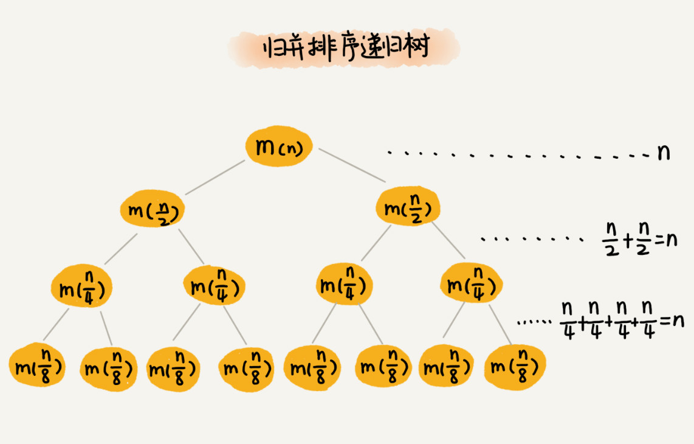

因为每次分解都是一分为二，所以代价很低，我们把时间上的消耗记作常量1。归并算法中比较耗时的是归并排序，也就是把两个子数组合并为大数组。从图中我们可以看出，每一层归并操作消耗的时间总和是一样的，跟要排序的数据规模有关。我们把每一层归并操作消耗的时间记住n。

现在，我们只需要知道这棵树的高度h，用高度h乘以每一层的时间消耗n，就可以得到总的时间复杂度O(n*h)。

从归并排序的原理和递归树，可以看出来，归并排序递归树是一棵满二叉树。我们前两节中讲到，满二叉树的高度大约是$log_2 n$，所以归并排序递归实现的时间复杂度就是O(n$logn$)。这里的时间复杂度都是估算的，对树的高度的计算也没那么精确，但是这并不影响复杂度的计算结果。

利用递归树的时间复杂度分析方法并不难理解，关键还是在实战，所以，接下来我会通过三个实际的递归算法，来实战理解一下递归的复杂度分析。学习完这节课之后，我们才能真正掌握递归代码的复杂度分析。


## 实战一： 分析快速排序的时间复杂度

在用递归树推导之前，我们先来回忆一下用递推公式的分析方法。我们可以回想一下，当时，我们为什么说用递推公式来求解平均时间复杂度非常复杂？

快速排序在最好的情况下，每次分区都能一分为二，这个时候用递推公式T(n) = 2T(n/2) +n，很容易就推导出时间复杂度是O(nlogn)。但是，我们并不可能每次分区都这么幸运，正好一分为二。

我们假设平均情况下，每次分区之后，两个分区的大小比例是1:k。当k=9时，如果用递推公式的方法来求解时间复杂度的话，递推公式就写成T(n) = T(n/10) + T(9n/10) + n。

这个公式可以推导出时间复杂度，但是推导过程非常复杂。如果我们用递归树来分析快速排序的平均情况时间复杂度，是不是比较简单。

我们还是取k等于9，也就是说，每次分区都很大平均，一个分区是另一个分区的9倍。如果我们把递归分解的过程画成递归树，就是下面的样子：


快速排序的过程中，每次分区都要遍历待分区区间的所有数据，所以，每一层分区操作所遍历的数据的个数之和就是n。我们现在只要求出递归树的高度h，这个快排过程遍历的数据个数就是h\*n，也就说，时间复杂度是O(h*n) 。

因为每次分区并不是均匀地一分为二，所以递归树并不是满二叉树。这样一个递归树的高度是多少呢？

我们知道，快速排序结束的条件就是待排序的小区间，大小为1，也就说叶子节点里的数据规模是1。从根节点n到叶子节点1，递归树中最短的一个路径每次都乘以1/10，最长的一个路径每次都乘以9/10。通过计算，我们可以得到，从根节点到叶子节点的最短路径是$log_{10} n$ ,最长的路径是$log{10/9} n$

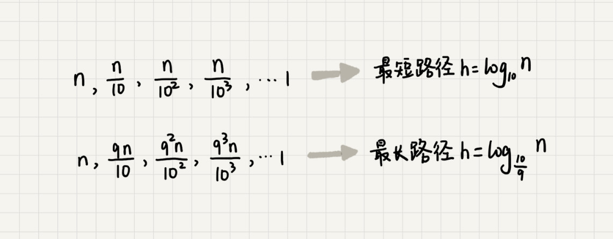

所以，遍历数据的个数总和就介于n$log_{10} n$ 和n $log{10/9} n$ 之间。根据复杂度的大O表示法，对数复杂度的底数不管是多少，我们统一写成logn，所以，当分区大小比例是1:9的时候，快速排序的时间复杂度仍然是O(nlogn)。

刚刚我们假设k=9，那如果k=99，也就是说，每次分区及其不平均，两个区间大小是1:99，这个时候的时间复杂度是多少呢？

我们可以类比上面k=9的分析过程。当k=99的时候，树的最短路径就是$log_{100} n$，最长路径是$log_{100/99} n$，所以总遍历数据个数介于n$log_{100} n$和nlog 100/99 n之间。尽管底数变了，但是时间复杂度也仍然是O(nlogn)。

也就是说，对于k等于9，99，甚至是999，9999.....，只要k的值不随n变化，是一个事先确定的常量，那快排的时间复杂度就是O(nlogn)。所以，从概率论的角度来说，快排的平均时间复杂度就是O(nlogn)。


## 实战二： 分析斐波那契数列的时间复杂度

在递归那一节中，我们举了一个跨台阶的例子。那个例子实际上就是一个斐波那契数列。它的代码实现贴在如下：

``` 
int f(int n) {
  if (n == 1) return 1;
  if (n == 2) return 2;
  return f(n-1) + f(n-2);
}
```

这样一段代码的时间复杂度是多少呢？如何利用递归树来分析。

我们先把上面的递归代码画成递归树，就是下面这个样子：


这棵递归树的高度是多少呢？

f(n)分解为f(n-1)和f(n-2 )，每次数据规模都是-1或-2，叶子节点的数据规模是1或2。所以，从根节点走到叶子节点，每条路径是长短不一的。如果每次都是-1，那最长路径大约就是n；如果每次都是-2，那最短路径大约就是n/2。

每次分解之后的合并操作只需要一次加法运算，我们把这次加法运算的时间消耗记作1 ，第二层的总时间消耗是2，第三层额总时间消耗就是2^2。依次类推，第k层的时间消耗就是2^(k-1)，那整个算法的总的时间消耗就是每一层时间消耗之和。

如果路径长度都为n，那这个总和就是2^n -1。


如果路径长度都是n/2，那整个算法的总的时间消耗就是2^(n/2) -1.


所以，这个算法的时间复杂度就介于O(2^n)和O(2^(n/2))之间。虽然这样得到的结果还不够精确，只是一个范围，但是我们也基本上知道了上面算法的时间复杂度是指数级的，非常高。


## 实战三：分析全排列的时间复杂度

前面两个复杂度分析


## D54(2020/12/05) 堆排序

我们今天讲另外一种特殊的树，"堆"。堆这种数据结构的应用场景非常多，最经典的莫过于堆排序。堆排序是一种原地的、时间复杂度为O(nlogn)的排序算法。

前面我们学过快速排序，平均情况下，它的时间复杂度是O(nlogn)。尽管这两种排序算法的时间复杂度都是O(nlogn)，甚至堆排序比快速排序的时间复杂度还要稳定，但是，在实际的软件开发中，快速排序的性能要比堆排序好，这是为什么呢？


## 如何理解"堆"？

前面我们提到，堆是一种特殊的树。现在来看，什么样的树才是堆。我罗列了两点要求，只要满足这两点，它就是一个堆。

* 堆是一个完全二叉树。
* 堆中每一个节点的值都必须大于等于(或小于等于)其子树中每个节点的值。

第一点，堆必须是一个完全二叉树。之前我们对完全二叉树的定义，完全二叉树要求，除了最后一层，其他层的节点个数都是满的，最后一层的节点都靠左排列。

第二点，堆中的每个节点的值必须大于等于(或小于等于)其子树中每个节点的值。实际上，我们还可以换一种说法，堆中每个节点的值都大于等于(或小于等于)其左右子节点的值。这两种表述是等价的。

对于每个节点的值都大于等于子树中每个节点值的堆，我们叫做"大顶堆"。对于每个节点的值多小于等于子树中每个节点值的堆，我们叫做"小顶堆"。

下面我们来看看，下面的图示中，几个二叉树是不是堆？


其中第1个和第2个是大顶堆，第3个是小顶堆，第4个不是堆。除此之外，从图中还可以看出来，对于同一组数据，我们可以构建多种不同形态的堆。


## 如何实现一个堆？

要实现一个堆，我们先要知道，堆都支持哪些操作以及如何存储一个堆。

我们之前讲过，完全二叉树比较适合用数组来存储。用数组来存储完全二叉树是非常节省存储空间的。因为我们不需要存储左右子节点的指针，单纯地通过数组的下标，就可以找到一个节点的左右子节点和父节点。

下面是画了一个用数组存储堆的例子


从图中我们可以看到，数组下标为i的节点的左子节点，就是下标为i*2的节点，右子节点就是下标为i\*2+1 的节点，父节点就是下标为i/2的节点。

知道了如何存储一个堆，那我们再来看看，堆上的操作有哪些呢？我罗列了几个非常核心的操作，分别是往堆中插入一个元素和删除堆顶元素。


### 往堆中插入一个元素

往堆中插入一个元素后，我们需要继续满足堆的两个特性。

如果我们把新插入的元素放到堆的最后，可以看到下面的图，还是不符合堆的特性了。于是，我们就需要进行调整，让其重新满足堆的特性，这个过程我们起了一个名字，就叫做堆化。

堆化实际上有两种，从下往上和从上往下。这里我们先讲从下往上的堆化方法。


堆化非常简单，就是顺着节点所在的路径，向上或向下，对比，然后交换。

我这里画了一张堆化的过程分解图。我们可以让新插入的节点与父节点对比大小。如果不满足子节点小于等于父节点的大小关系，我们就互换两个节点。一直重复这个过程，直到父子节点之间满足刚说的那种大小关系。


将上面讲的往堆中插入数据的过程，代码如下。

``` 
public class Heap {
  private int[] a; // 数组，从下标1开始存储数据
  private int n;  // 堆可以存储的最大数据个数
  private int count; // 堆中已经存储的数据个数

  public Heap(int capacity) {
    a = new int[capacity + 1];
    n = capacity;
    count = 0;
  }

  public void insert(int data) {
    if (count >= n) return; // 堆满了
    ++count;
    a[count] = data;
    int i = count;
    while (i/2 > 0 && a[i] > a[i/2]) { // 自下往上堆化
      swap(a, i, i/2); // swap()函数作用：交换下标为i和i/2的两个元素
      i = i/2;
    }
  }
 }
```


### 删除堆顶元素

从堆的定义的第二条中，任何节点的值都大于等于(或小于等于)子树节点的值，我们可以发现，堆顶元素存储的就是堆中数据的最大值或最小值。

假设我们构造的是大顶堆，堆顶元素就是最大的元素。当我们删除堆顶元素之后，就需要把第二大的元素放到堆顶，那第二大元素肯定会出现在左右子节点中。然后我们再迭代地删除第二大节点，以此类推，直到叶子节点被删除。

这里我们也有一个分解图。不过这种方法有点问题，就是最后堆化出来的堆并不满足完全二叉树的特性。

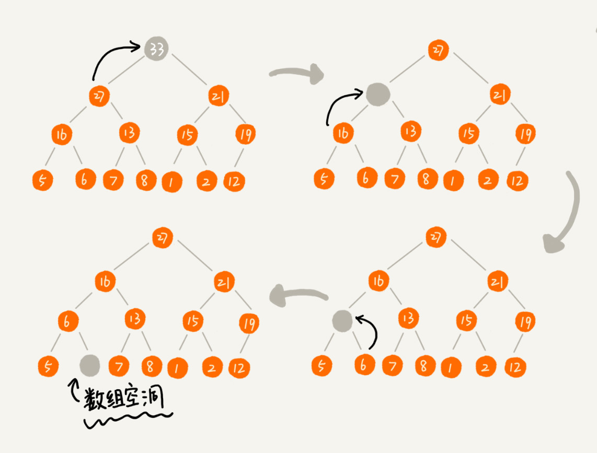

实际上，我们稍微改变一下思路，就可以解决这个问题。看下面画的这幅图，我们把最后一个节点放到堆顶，然后利用同样的父子节点对比方法。对于不满足父子节点大小关系的，互换两个节点，并且重复进行这个过程，直到父子节点之间满足大小关系为止。这就是从上往下的堆化方法。

因为我们移除的是数组中的最后一个元素，而在堆化的过程中，都是交换操作，不会出现数组中的"空洞"，所以这种方法堆化之后的结果，肯定满足完全二叉树的特性。


把上面的删除代码如下。

``` 
public void removeMax() {
  if (count == 0) return -1; // 堆中没有数据
  a[1] = a[count];
  --count;
  heapify(a, count, 1);
}

private void heapify(int[] a, int n, int i) { // 自上往下堆化
  while (true) {
    int maxPos = i;
    if (i*2 <= n && a[i] < a[i*2]) maxPos = i*2;
    if (i*2+1 <= n && a[maxPos] < a[i*2+1]) maxPos = i*2+1;
    if (maxPos == i) break;
    swap(a, i, maxPos);
    i = maxPos;
  }
}
```

我们知道，一个包含n个节点的完全二叉树，树的高度不会超过$log_2 n$。堆化的过程是顺着节点所在路径比较交换的，所以堆化的时间复杂度跟树的高度成正比，也就是O(logn)。插入数据和删除堆顶数据的主要逻辑就是堆化，所以，往堆中插入一个元素和删除堆顶元素的时间复杂度都是O(logn)。


## 如何基于堆实现排序？

前面我们讲过好几种排序算法，我们再来回忆一下，有时间复杂度是O($n ^2$)的冒泡排序、插入排序、选择排序，有时间复杂度是O(nlogn)的归并排序、快速排序，还有线性排序。

这里我们借助于堆这种数据结构实现的排序算法，就叫做堆排序。这种排序方法的时间复杂度非常稳定，是O(nlogn)，并且它还是原地排序算法。

我们可以把堆排序的过程大致分解成两个大的步骤，建堆和排序。


### 建堆

我们首先将数组原地建成一个堆。所谓"原地"就是，不借助另一个数组，就在原数组上操作。建堆的过程，有两种思路。

第一种是借助我们前面讲的，在堆中插入一个元素的思路。尽管数组中包含n个数据，但是我们可以假设，起初堆中只包含一个数据，就是下标为1的数据。然后，我们调用前面讲的插入操作，将下标从2到n的数据依次插入到堆中。这样我们就将包含n个数据的数组，组织成了堆。

第二种实现思路，跟第一种截然相反，也是我这里要详细讲的。第一种建堆的处理过程是从前往后处理数组数据，并且每个数据插入堆中时，都是从下往上堆化。而第二种实现思路，是从后往前处理数组，并且每个数据都是从上往下堆化。

我举了一个例子，并且画了一个第二种实现思路的建堆分解步骤图，可以看下。因为叶子节点往下堆化只能自己跟自己比较，所以我们直接从最后一个非叶子节点开始，依次堆化就行了。


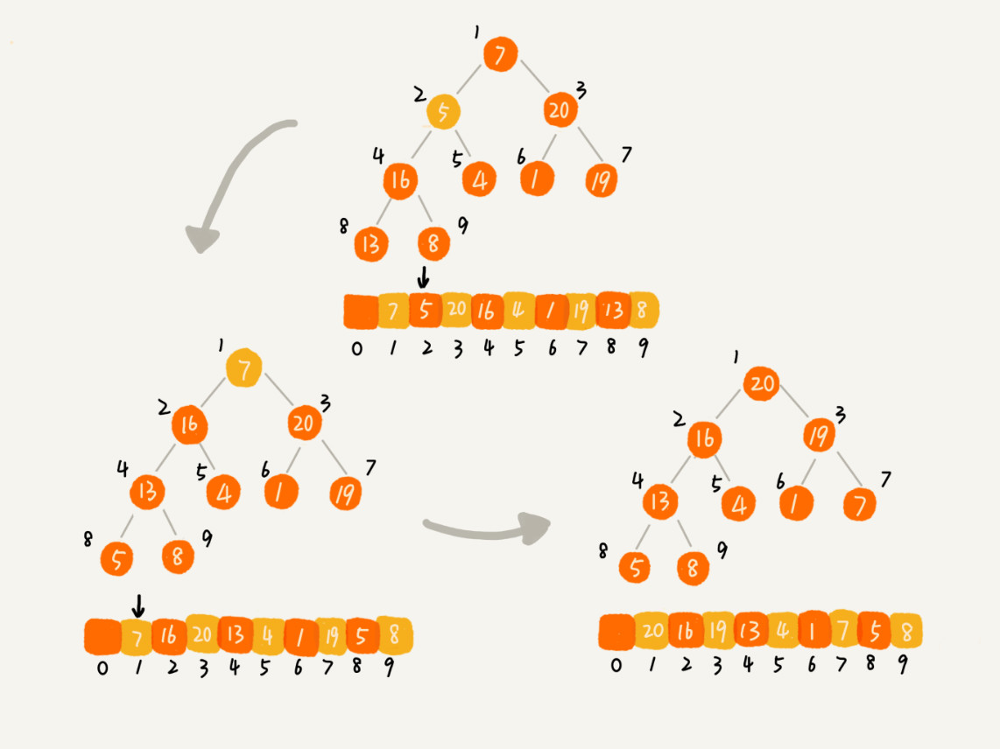

第二种实现思路翻译成了代码。

``` 
private static void buildHeap(int[] a, int n) {
  for (int i = n/2; i >= 1; --i) {
    heapify(a, n, i);
  }
}

private static void heapify(int[] a, int n, int i) {
  while (true) {
    int maxPos = i;
    if (i*2 <= n && a[i] < a[i*2]) maxPos = i*2;
    if (i*2+1 <= n && a[maxPos] < a[i*2+1]) maxPos = i*2+1;
    if (maxPos == i) break;
    swap(a, i, maxPos);
    i = maxPos;
  }
}
```

我们可能已经发现了，在这段代码中，我们从下标从n/2开始到1的数据进行堆化，下标是n/2 + 1到n的节点是叶子节点，我们不需要堆化。实际上，对于完全二叉树来说，下标从n/2 + 1到n的节点都是叶子节点。

现在我们来看一下，建堆操作的时间复杂度是多少？

每个节点堆化的时间复杂度是O(logn)，那n/2 + 1个节点堆化的总时间复杂度是不是就是O(nlogn)呢？这个答案虽然也没有错，但是这个值不够精准。实际上，堆排序的建堆过程的时间复杂度是O(n)。

因为叶子节点不需要堆化，所以需要堆化的节点从倒数第二层开始。每个节点堆化的过程中，需要比较和交换的节点个数，跟这个节点的高度k成正比。

我们把每一层的节点个数和对应的高度画出来，我们可以看下。我们只需要将每个节点的高度求和，得出的就是建堆的时间复杂度。


我们将每个非叶子节点的高度求和，就是下面的这个公式：

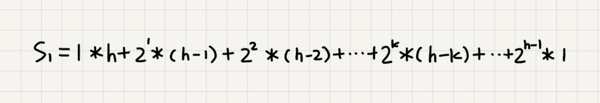

这个公式的求解稍微有点技巧，我们高中就应该学过：把公式左右都乘以2，就得到另一个公式S2。我们将S2错位对齐，并且用S2减去S1，就可以得到S了。


S的中间部分是一个等比数列，所以最后可以用等比数列的求和公式来计算，最终的结果就是下面图中画的样子。


因为h=$log_2 n$，代入公式S，就能得到S = O(n)，所以，建堆的时间复杂度就是O(n)。


### 排序

建堆结束之后，数组中的数据已经是按照大顶堆的特性来组织的。数组中的第一个元素就是堆顶，也就是最大的元素。我们把它跟最后一个元素交换，那最大元素就放到了下标为n的位置。

这个过程有点类似上面讲的"删除堆顶元素"的操作，当堆顶元素移除之后，我们把下标为n的元素放到堆顶，然后再通过堆化的方法，将剩下的n-1个元素重新构建成堆。堆化完成之后，我们再取堆顶的元素，放到下标是n-1的位置，一直重复这个过程，知道最后堆中只剩下标为1的一个元素，排序工作就完成了。


堆排序的过程的代码如下。

``` 
// n表示数据的个数，数组a中的数据从下标1到n的位置。
public static void sort(int[] a, int n) {
  buildHeap(a, n);
  int k = n;
  while (k > 1) {
    swap(a, 1, k);
    --k;
    heapify(a, k, 1);
  }
}
```

现在，我们再来分析一下堆排序的时间复杂度、空间复杂度以及稳定性。

整个堆排序的过程，都只需要极个别临时存储空间，所以堆排序是原地排序算法。堆排序包括建堆和排序两个操作，建堆过程的时间复杂度是O(n)，排序过程的时间复杂度是O(nlogn)，所以，堆排序整体的时间复杂度是O(nlogn)。

堆排序不是稳定的排序算法，因为在排序的过程，存在将堆的最后一个节点跟堆顶节点互换的操作，所以就有可能改变值相同数据的原始相对顺序。

上面的讲解中，都是假设，堆中的数据是从数组下标为1的位置开始存储。如果从0开始存储，实际上处理思路是没有任何变化的，唯一变化的，可能就是，代码实现的时候，计算子节点和父节点的下标的公式改变了。

如果节点的下标是i，那左子节点的下标就是2\*i +1，右子节点的下标就是2\*i + 2，父节点的下标就是 (i-1)/2 。


## 解答开篇

现在我们来看下开篇的问题，在实际开发中，为什么快速排序要比堆排序性能好？

我觉得主要有两方面的原因。

第一点，堆排序数据访问的方式没有快速排序友好。

对于快速排序来说，数据是顺序访问的。而对于堆排序来说，数据是跳着访问的。比如，对排序中，最重要的一个操作就是数据的堆化。比如下面的这个例子，对堆顶节点进行堆化，会依次访问数组下标是1，2，4，8的元素，而不是像快速排序那样，局部顺序访问，所以，这样对CPU缓存是不友好的。

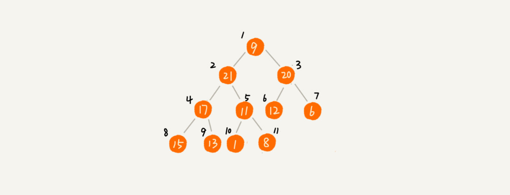

第二点，对于同样的数据，在排序过程中，堆排序算法的数据交换次数要多于快速排序。

我们在讲排序的时候，提过两个概念，有序度和逆序度。对于基于比较的排序算法来说，整个排序过程就是由两个基本的操作组成的，比较和交换(或移动)。快速排序数据交换的次数不会比逆序度多。

但是堆排序的第一步就是建堆，建堆的过程会打乱数据原有的相对先后顺序，导致原数据的有序度降低。比如，对于一组已经有序的数据来说，经过建堆之后，数据反而变得更无序了。


## 内容小结

今天我们讲了堆这种数据结构，堆是一种完全二叉树。它最大的特性是：每个节点的值都大于等于(或小于等于)其子树节点的值。因此，堆被分成了两类，大顶堆和小顶堆。

堆中比较重要的两个操作是插入一个数据和删除堆顶元素。这两个操作都要用到堆化。插入一个数据的时候，我们把新插入的数据放到数组的最后，然后从下往上堆化；删除堆顶数据的时候，我们把数组中的最后一个元素放到堆顶，然后从上往下堆化。这两个操作时间复杂度都是O(logn)。

除此之外，我们还讲了堆的一个经典应用，堆排序。堆排序包含两个过程，建堆和排序。我们将下标n/2到1的节点，依次进行从上到下的堆化操作，然后就可以将数组中的数据组织成堆这种数据结构。接下来，我们迭代地将堆顶的元素放到堆的末尾，并将堆的大小减去一，然后再堆化，重复这个过程，直到堆中只剩下一个元素，整个数组中的数据就都有序排列了。


## D55(2020/12/09) 堆应用

假设现在我们有一个包含10亿个搜索关键词的日志文件，如何能快速获取到热门榜Top 10的搜索关键词呢？

这个问题就可以用堆来解决，这也是堆这种数据结构一个非常典型的应用。上一节我们讲了堆和堆排序的一些理论知识，今天我们就来讲一讲，堆这种数据结构几个非常重要的应用：优先级队列、求Top K和求中位数。


## 堆的应用一：优先级队列

首先，我们来看第一个应用场景：优先级队列。

优先级队列，顾名思义，它首先应该是一个队列。我们前面讲过，队列最大的特性就是先进先出。不过，在优先级队列中，数据的出队顺序不是先进先出，而是按照优先级来，优先级最高的，最先出队。

如果实现一个优先级队列呢？方法有很多，但是用堆来实现是最直接、最高效的。这是因为，堆和优先级队列非常相似。一个堆就可以看作一个优先级队列。很多时候，它们只是概念上的区分而已。往优先级队列中插入一个元素，就相当于往堆中插入一个元素；从优先级队列中取出优先级最高的元素，就相当于取出堆顶元素。

不要小看这个优先级队列，它的应用场景非常多。我们后面要讲的很多数据结构和算法都要依赖它。比如，赫夫曼编码、图的最短路径、最小生成树算法等。不仅如此，很多语言中，都提供了优先级队列的实现。比如，Java的PriorityQueue，C++的priority_queue等。

只讲这些应用场景比较空泛，现在，我举两个具体的例子，来感受一下优先级队列具体是怎么用的。


### 合并有序小文件

假设我们有100个小文件，每个文件的大小是100MB，每个文件中存储的都是有序的字符串。我们希望将这些100个小文件合并成一个有序的大文件。这里就会用到优先级队列。

整体思路有点像归并排序中的合并函数。我们从这100个文件中，各取第一个字符串，放入数组中，然后比较大小，把最小的那个字符串放入合并后的大文件中，并从数组中删除。

假设，这个最小的字符串来自于13.txt这个小文件，我们就再从这个小文件取下一个字符串，放到数组中，重新比较大小，并且选择最小的放入合并后的大文件，将它从数组中删除。

这里我们用数组这种数据结构，来存储从小文件中取出来的字符串。每次从数组中取最小字符串，都需要循环遍历整个数组，显然，这不是很高效。有没有更加高效方法呢？

这里就可以用到优先级队列，也可以说是堆。我们将从小文件中取出来的字符串放入到小顶堆中，那堆顶的元素，也就是优先级队列队首的元素，就是最小的字符串。我们将这个字符串放入到大文件中，并将其从堆中删除。然后再从小文件中取出下一个字符串，放入到堆中。循环这个过程，就可以将100个小文件中的数据依次放入到大文件中。

我们知道，删除堆顶数据和往堆中插入数据的时间复杂度都是O(logn)，n表示堆中的数据个数，这里就是100。这样的话就比原来数组存储的方式要高效很多了。


### 高性能定时器

假设我们有一个定时器，定时器中维护了很多定时任务，每个任务都设定了一个要触发执行的时间点。定时器没过一个很小的单位时间(比如1秒)，就扫描一遍任务，看是否任务到达设定的执行时间。如果到达了，就拿出来执行。

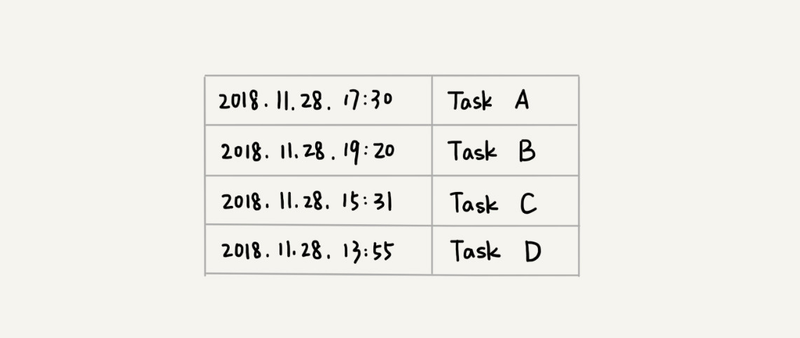

但是，这样每过1秒就扫描一遍任务列表的做法比较低效，主要原因有两点：第一，任务的约定执行时间离当前时间可能还有很久，这样前面很多次扫描其实都是徒劳的；第二，每次都要扫描整个任务列表，如果任务列表很大的话，势必会比较耗时。

针对这些问题，我们就可以用优先级队列来解决。我们按照任务设定的执行时间，将这些任务存储在优先级队列中，队列首部(也就是小顶堆的堆顶)存储的是最先执行的任务。

这样，定时器就不需要每隔1秒就扫描一遍任务列表了。它拿队首任务的执行时间点，与当前时间点相减，得到一个时间间隔T。

这个时间间隔T就是，从当前时间开始，需要等待多久，才会有第一个任务需要被执行。这样，定时器就可以设定在T秒之后，再来执行任务。从当前时间点到(T-1)秒这段时间里，定时器都不需要做任何事情。

当T秒时间过去之后，定时器取优先级队列中队首的任务执行。然后再计算新的队首任务的执行时间与当前时间点的差值，把这个差值作为定时器执行下一个任务需要等待的时间。

这样，定时器既不用间隔1秒就轮询一次，也不用遍历整个任务列表，性能也就提高了。


## 堆的应用二：利用堆求Top K

刚刚我们学习了优先级队列，我们现在来看，堆的另外一个非常重要的应用场景，那就是"求Top K问题"。

我们把这种求Top K的问题抽象成两类。一类是针对静态数据集合，也就是说数据集合事先确定，不会再变。另一类是针对动态数据集合，也就是说数据集合事先并不确定，有数据动态地加入到集合中。

针对静态数据，如何在一个包含n个数据的数组中，查找前K大数据呢？我们可以维护一个大小为K的小顶堆，顺序遍历数组，从数组中取出数据与堆顶元素比较。如果比堆顶元素大，我们就把堆顶元素删除，并且将这个元素插入到堆中；如果比堆顶元素小，则不作处理，继续遍历数组。这样等数组中的数据都遍历完之后，堆中的数据就是前K大数据了。

遍历数组需要O(n)的时间复杂度，一次堆化操作需要O(logk)的时间复杂度，所以最坏情况下，n个元素都入堆一次，时间复杂度就是O(nlogk)。

针对动态数据求得Top K就是实时Top K。例如，一个数据集合中有两个操作，一个是添加数据，另一个询问当前的前K大数据。

如果每次询问前K大数据，我们都基于当前的数据重新计算的话，那时间复杂度就是O(nlogk)，n表示当前的数据的大小。实际上，我们可以一直都维护一个K大小的小顶堆，当有数据被添加到集合中时，我们就拿它与堆顶的元素对比。如果比堆顶元素大，我们就把堆顶元素删除，并且将这个元素插入到堆中；如果比堆顶元素小，则不做处理。这样，无论任何时候需要查询当前的前K大数据，我们都可以立刻返回给他。


## 堆的应用三：利用堆求中位数

如何求动态数据集合中的中位数。

中位数，顾名思义，就是处于中间位置的那个数。如果数据的个数是奇数，把数据从小到大排列，那第n/2 +1个数据就是中位数；如果数据的个数是偶数的话，那处于中间位置的数据有两个，第n/2个和第n/2 +1个数据，这个时候，我们可以随意取一个作为中位数，比如取两个数中靠前的那个，就是第n/2个数据。


对于一组静态数据，中位数是固定的，我们可以先排序，第n/2个数据就是中位数。每次询问中位数的时候，我们直接返回这个固定的值就好了。所以，尽管排序的代价比较大，但是边际成本会很小。但是，如果我们面对的是动态数据集合，中位数在不停地变动，如果再用先排序的方法，每次询问中位数的时候，都要先进行排序，那效率就不高了。

借助堆这种数据结构，我们不用排序，就可以非常高效地实现求中位数操作。

我们需要维护两个堆，一个大顶堆，一个小顶堆。大顶堆中存储前半部分数据，小顶堆中存储后半部分数据，且小顶堆中的数据都大于大顶堆中的数据。

也就是说，如果有n个数据，n是偶数，我们从小到大排序，那前n/2个数据存储在大顶堆中，后n/2个数据存储在小顶堆中。这样，大顶堆中的堆顶元素就是我们要找的中位数。如果n是奇数，情况是类似的，大顶堆就存储了n/2 + 1个数据，小顶堆中就存储n/2个数据。


我们前面也提到，数据是动态变化的，当新添加一个数据的时候，我们如何调整两个堆，让大顶堆的堆顶元素继续是中位数呢？

如果新加入的数据小于等于大顶堆的堆顶元素，我们就将这个新数据插入到大顶堆；否则，我们就将这个新数据插入到小顶堆。

这个时候就有可能出现，两个堆中的数据个数不符合前面约定的情况：如果n是偶数，两个堆中的数据个数都是n/2；如果n是奇数，大顶堆有n/2 +1 个数据，小顶堆有n/2个数据。这个时候，我们可以从一个堆中不停地将堆顶元素移到到另一个堆，通过这样的调整，来让两个堆中的数据满足上面的约定。


于是，我们就可以利用两个堆，一个大顶堆、一个小顶堆，实现在动态数据集合中求中位数的操作。插入数据因为需要涉及堆化，所以时间复杂度变成了O(logn)，但是求中位数我们只需要返回大顶堆的堆顶元素就可以了，所以时间复杂度就是O(1)。

实际上，利用两个堆不仅可以快速求出中位数，还可以快速求其他百分位的数据，原理是类似的。之前我们提到一个问题，"如何快速求接口的99%响应时间？" 我们现在来看下，利用两个堆如何来实现。

在开始这个问题的讲解之前，我们先解释一下，什么是"99%响应时间"。

中位数的概念就是将数据从小到大排列，处于中间位置，就叫中位数，这个数据会大于等于前面50%的数据。99百分位数的概念可以类比中位数，如果将一组数据从小到大排列，这个 99百分位数就是大于前面99%数据的那个数据。

如果这个还是不好接，例如有100个数据，分别是1，2，3，。。。。。100，那99百分位数就是99，因为小于等于99的数占总个数的99%。


我们再来看99%响应时间。如果有100个接口访问请求，每个接口请求的响应时间都不同，比如55毫秒、100毫秒、23毫秒等，我们把这100个接口的响应时间按照从小到大排列，排在第99的那个数据就是99%响应时间，也叫99百分位响应时间。

我们来总结一下，如果有n个数据，将数据从小到大排列之后，99百分位数大约就是第n\*99%个数据，同类，80百分位数大约就是第n\*80%个数据。

弄懂了这些，我们再来看如何求99%响应时间。

我们维护两个堆，一个大顶堆，一个小顶堆。假设当前总数据的个数是n，大顶堆中保存n\*99%个数据，小顶堆中保存n\*1%个数据。大顶堆堆顶的数据就是我们要找的99%响应时间。

每次插入一个数据的时候，我们要判断这个数据跟大顶堆和小顶堆数据的大小关系，然后决定插入到哪个堆中。如果这个新插入的数据比大顶堆的堆顶数据小，那就插入大顶堆；如果这个新插入的数据比小顶堆的堆顶数据大，那就插入小顶堆。

但是，为了保持大顶堆中的数据占99%，小顶堆中的数据占1%，在每次新插入数据之后，我们都要重新计算，这个时候大顶堆和小顶堆中的数据个数，是否还符合99:1这个比例。如果不符合，我们就将一个堆中的数据移动到另一个堆，直到满足这个比例。移动的方法类似前面求中位数的方法。

通过这样的方法，每次插入数据，可能会涉及几个数据的堆化操作，所以时间复杂度是O(logn)。每次求99%响应时间的时候，直接返回大顶堆中的堆顶数据即可，时间复杂度是O(1)。


## 解答开篇

学懂了上面的一些应用场景的处理思路，我们来解答一下开篇的那个问题。假设现在我们有一个包含10亿个搜索关键词的日志文件，如何快速获取到Top 10最热门的搜索关键词呢？

处理这个问题，有很多高级的解决方法，比如使用MapReduce等。但是，如果我们将处理的场景限定为单机，可以使用的内存为1GB。那个这个问题该如何解决呢？

因为用户搜索的关键词，有很多可能都是重复的，所以我们首先要统计每个搜索关键词出现的频率。我们可以通过散列表、平衡二叉查找树或者其他一些支持快速查找、插入的数据结构，来记录关键词及其出现的次数。

假设我们选用散列表。我们就顺序扫描这10亿个搜索关键词。当扫描到某个关键词时，我们去散列表中查询。如果存在，我们就将对应的次数加一；如果不存在，我们就将它插入到散列表，并记录次数为1。以此类推，等遍历完这10亿个搜索关键词之后，散列表中就存储了不重复的搜索关键词以及出现的次数。

假设我们选用散列表。我们就顺序扫描这10亿个搜索关键词。当扫描到某个关键词时，我们去散列表中查询。如果存在，我们就将对应的次数加一；如果不存在，我们就将它插入到散列表，并记录次数为1。以此类推，等遍历完这10亿个搜索关键词之后，散列表中就存储了不重复的搜索关键词以及出现的次数。

然后，我们再根据前面讲的用堆求Top K的方法，建立一个大小为10的小顶堆，遍历散列表，依次取出每个搜索关键词及对应出现的次数，然后与堆顶的搜索关键词对比。如果出现次数比堆顶搜索关键词的次数多，那就删除堆顶的关键词，将这个出现次数更多的关键词加入到堆中。

以此类推，当遍历完整个散列表中的搜索关键词之后，堆中的搜索关键词就是出现次数最多的Top 10搜索关键词了。

上面的解决思路还是存在漏洞的。10亿的关键词还是很多的。我们假设10亿条搜索关键词中不重复的有1亿条，如果每个搜索关键词的平均长度是50个字节，那存储1亿个关键词起码需要5GB的内存空间，而散列表因为要避免频繁冲突，不会选择太大的装载因子，所以消耗的内存空间就更多了。而我们的机器只有1GB的可用内存空间，所以我们无法一次性将所有的搜索关键词加入到内存中。

我们在哈希算法那一节讲过，相同数据经过哈希算法得到的哈希值是一样的。我们可以根据哈希算法的这个特定，将10亿条搜索关键词先通过哈希算法分片到10个文件中。

具体可以这样做：我们创建10个空文件00，01，02，....，09。我们遍历这10亿个关键词，并且通过某个哈希算法对其求哈希值，然后哈希值同10取模，得到的结果就是这个搜索关键词应该被分到的文件编号。

对这10亿个关键词分片之后，每个文件都只有1亿的关键词，去除重复的，可能就只有1000万个，每个关键词平均50个字节，所以总的大小就是500MB。1GB的内存完全可以放得下。

我们针对每个包含1亿条搜索关键词的文件，利用散列表和堆，分别求出Top 10，然后把这个10个Top 10放在一块，然后取这100个关键词中，出现次数最多的10个关键词，这就是这10亿条数据中的Top10最频繁的搜索关键词了。


## 内容小结

我们今天主要讲了堆的几个重要的应用，它们分别是：优先级队列、求Top K问题和求中位数的问题。

优先级队列是一种特殊的队列，优先级高的数据出队，而不再像普通的队列那样，先进先出。实际上，堆就可以看作优先级队列，知识称谓不一样罢了。求Top K问题又可以分为针对静态数据和针对动态数据，只需要利用一个堆，就可以做到非常高效率地查询Top K的数据。求中位数实际上还有很多变形，比如求99百分位数据、90百分位数据等，处理的思路都是一样的，即利用两个堆，一个大顶堆，一个小顶堆，随着数据的动态增加，动态调整两个堆中的数据，最后大顶堆的堆顶元素就是要求的数据。


## D56(2020/12/12) 图的存储

今天我们要学习的就是图这种数据结构。实际上，涉及图的算有很多，也非常复杂，比如图的搜索、最短路径、最小生成树、二分图等。我们今天聚焦在图存储这一方面，后面会分好几节来依次讲解图相关的算法。


## 如何理解"图"

我们前面讲过了树这种非线性表数据结构，今天我们要讲另一种非线性表数据结构，图。和数比起来，这是一种更加复杂的非线性表结构。

我们知道，树中的元素我们称为节点，图中的元素我们就叫做顶点。从画的图中可以看出来，图中的一个顶点可以与任意其他顶点建立连接关系。我们把这种建立的关系叫做边。


我们生活中就有很多符合图这种结构的例子。比如，开篇问题中讲到的社交网络，就是一个非常典型的图结构。

我们就拿微信来举例子把。我们可以把每个用户看作一个顶点。如果两个用户之间互加好友，那就在两者之间建立一条边。所以，整个微信的好友关系就可以用一张图来表示。其中，每个用户有多少个好友，对应到图中，就叫做顶点的度，就是跟顶点相连接的边的条数。

实际上，微博的社交关系跟微信还有点不一样，或者说更加复杂一点。微博允许单向关注，也就是说，用户A关注了用户B，但用户B可以不关注用户A。那我们如何用图来表示这种单向的社交关系呢？

我们可以把刚刚讲的图结构稍微改造一下，引入边的"方向"的概念。

如果用户A关注了用户B，我们就在图中画一条从A到B的带箭头的边，来表示边的方向。如果用户A和用户B互相关注了，那我们就画一条从A指向B的边，再画一条从B指向A的边。我们把这种边有方向的图叫做"有向图"。以此类推，我们把边没有方向的图就叫做"无向图"。


我们刚刚讲过，无向图中有"度"这个概念，表示一个顶点有多少条边。在有向图中，我们把度分为入度和出度。

顶点的入度，表示有多少条边指向这个顶点；顶点的出度，表示有多少条边是以这个顶点为起点指向其他顶点。对应到微博的例子，入度就表示有多少粉丝，出度就表示关注了多少人。

前面讲到了微信、微博、无向图、有向图，现在我们再来看另一种社交软件：QQ。

QQ中的社交关系要更复杂一点。不知道有没有留意过QQ亲密度这样一个功能。QQ不仅记录了用户之间的好友关系，还记录了两个用户之间的亲密度，如果两个用户经常往来，那亲密度就比较高；如果不经常往来，亲密度就比较低。如果在图中记录这种好友关系的亲密度呢？

这里就要用到另一种图，带权图。在带权图中，每条边都有一个权重，我们可以通过这个权重来表示QQ好友间的亲密度。


## 邻接矩阵存储方法

图最直观的一种存储方法就是，邻接矩阵。

邻接矩阵的底层依赖一个二维数组。对于无向图来说，如果顶点i与顶点j之间有边，我们就将A\[i][j]和A\[j][i]标记为1；对于有向图来说，如果顶点i到顶点j之间，有一条箭头从顶点i指向顶点j的边，那我们就将A\[i][j]标记为1。同理，如果有一条箭头从顶点j指向顶点i的边，我们就将A\[j][i]标记为1。对于带权图，数组中就存储相应的权重。

用邻接矩阵来表示一个图，虽然简单、直观，但是比较浪费存储空间。为什么呢？

对于无向图来说，如果A\[i][j]等于1，那么A\[j][i]也肯定等于1。实际上，我们只需要存储一个就可以了。也就是说，无向图的二维数组中，如果我们将其用对角线划分为上下两部分，那我们只需要利用上面或下面这样一半的空间就足够了，另外一半白白浪费掉了。

还有，如果我们存储的是稀疏图，也就是说，顶点很多，但每个顶点的边并不多，那邻接矩阵的存储方法就更加浪费空间了。比如微信有好多亿的用户，对应到图上就好几亿的顶点。但是每个用户的好友并不会很多，一般也就三五百个而已。如果我们用邻接矩阵来存储，那绝大部分的存储空间都被浪费了。

但这也并不是说，邻接矩阵的存储方法就完全没有优点。首先，邻接矩阵的存储方式简单、直接，因为基于数组，所以在获取两个顶点的关系时，就非常高效。其次，用邻接矩阵存储图的另外一个好处是方便计算。这是因为，用邻接矩阵的方式存储图，可以将很多图的运算转换成矩阵之间的运算。比如求解最短路径问题时会提到一个Floyd算法，就是利用矩阵循环相乘若干次得到结果。


## 邻接表存储方法

针对上面邻接矩阵比较浪费内存空间的问题，我们来看另外一种图的存储方法，邻接表。

下面画了一张邻接表的图，乍一看，邻接表有点像散列表。每个顶点对应一条链表，链表中存储的是与这个顶点相连接的其他顶点。另外我需要说明一下，图中画的是一个有向图的邻接表存储方式，每个顶点对应的链表里面，存储的是指向的顶点。对于无向图来说，也是类似的，不过，每个顶点的链表中存储的，是跟这个顶点有边相连的顶点。


还记得我们之前讲过的时间、空间复杂度互换的设计思想吗？邻接矩阵存储起来比较浪费空间，但是使用起来比较节省时间。相反，邻接表存储其阿里比较节省空间，但是使用起来就比较耗费时间。

就像图中的例子，如果我们要确定，是否存在一条从顶点2到顶点4的边，那我们就要遍历顶点2对应的那条链表，看链表中是否存在顶点4。而且，我们前面也讲过，链表的存储方式对缓存不友好。所以，比起邻接矩阵的存储方式，在邻接表中查询两个顶点之间的关系就没那么高效了。

在散列表的那几节中，我们讲到，在基于链表法解决冲突的散列表中，如果链表过长，为了提高查找效率，我们可以将链表换成其他更加高效的数据结构，比如平衡二叉查找树等。刚刚也提及，邻接表长得很像散列。所以，我们也可以将邻接表同散列表一样进行"改进升级"。

我们可以将邻接表中的链表改成平衡二叉查找树。实际开发中，我们可以选择用红黑树。这样，我们就可以更加快速地查找两个顶点之间是否存在边了。当然，这里的二叉查找树可以换成其他动态数据结构，比如跳表、散列表等。除此之外，我们还可以将链表改成有序动态数组，可以通过二分查找的方法来快速定位两个顶点之间是否存在边。


## 解答开篇

有了前面讲的理论知识，现在我们再来看下开篇的问题，如何存储微博、微信等社交网络中的好友关系？

前面我们分析了，微博、微信是两种"图"，前者是有向图，后者是无向图。在这个问题上，两者的解决思路差不多，所以这里只拿微博来讲解。

数据结构是为算法服务的，所以具体选择哪种存储方法，与期望支持的操作有关系。针对微博用户关系，假设我们需要支持下面这样几个操作：

* 判断用户A是否关注了用户B；
* 判断用户A是否是用户B的粉丝；
* 用户A关注用户B；
* 用户A取消关注用户B；
* 根据用户名称的首字母排序，分页获取用户的粉丝列表；
* 根据用户名词的首字母排序，分页获取用户的关注列表。

关于如何存储一个图，前面我们讲到两种主要的存储方法，邻接矩阵和邻接表。因为社交网络是一张稀疏图，使用邻接矩阵存储比较浪费存储空间。所以，这里我们采用邻接表来存储。

不过，用一个邻接表来存储这种有向图是不够的。我们去查找某个用户关注了哪些用户非常容易，但是如果要想知道某个用户都被哪些用户关注了，也就是用户的粉丝列表，是非常困难的。

基于此，我们需要一个逆邻接表。邻接表中存储了用户的关注关系，逆邻接表中存储的是用户的被关注关系。对应到图上，邻接表中，每个顶点的链表中，存储的就是这个顶点指向的顶点，逆邻接表中，每个顶点的链表中，存储的是指向这个顶点的顶点。如果要查找某个用户关注了哪些用户，我们可以在邻接表中查找；如果要查找某个用户被哪些用户关注了，我们从逆邻接表中查找。


基础的邻接表不适合快速判断两个用户之间是否是关注与被关注的关系，所以我们选择改进版本，将邻接表中的链表改为支持快速查找的动态数据结构。选择哪种动态数据结构呢？红黑树、跳表、有序动态数组还是散列表呢？

因为我们需要按照用户名称的首字母排序，分页来获取用户的粉丝列表或关注列表，用跳表这种结构再合适不过了。这是因为，跳表插入、删除、查找都非常高效，时间复杂度是O(logn)，空间复杂度上稍高，是O(n)。最重要的一点，跳表中存储的数据本来就是有序的了，分页获取粉丝列表或关注列表，就非常高效。

如果对于小规模的数据，比如社交网络中只有几万、几十万个用户，我们可以将整个社交关系存储在内存中，上面的解决思路是没有问题的。但是如果像微博那样有上亿用户，数据规模太大，我们就无法全部存储在内存中了。

我们可以通过哈希算法等数据分片方式，将邻接表存储在不同的机器上。可以查看下面的图示，我们在机器1上存储顶点1，2，3的邻接表，在机器2上，存储顶点4，5的邻接表。逆邻接表的处理方式也一样。当要查询顶点与顶点关系的时候，我们就利用同样的哈希算法，先定义顶点所在的机器，然后再在相应的机器上查找。


除此之外，我们还有另外一种解决思路，就是利用外部存储(比如硬盘)，因为外部存储的存储空间要比内存会宽裕很多。数据库是我们经常用来持久化存储关系数据的，下面就介绍一种数据库的存储方式。

下面这张表来存储这样一个图。为了高效地支持前面定义的操作，我们可以在表上建立多个索引，比如第一列、第二列，给这两列都建立索引。


## 内容小结

今天我们学习了图这种非线性表数据结构，关于图，我们需要理解这样几个概念：无向图、有向图、带权图、顶点、边、度、入度、出度。除此之外，我们还学习了图的两个主要存储方式：邻接矩阵和邻接表。

邻接矩阵存储方法的缺点是比较浪费空间，但是优点是查询效率高，而且方便矩阵运算。邻接表存储方法中每个顶点都对应一个链表，存储与其相连接的其他顶点。尽管邻接表的存储方式比较节省存储空间，但链表不方便查找，所以查询效率没有邻接矩阵存储方式高。针对这个问题，邻接表还有改进升级版，即将链表换成更加高效的动态数据结构，比如平衡二叉查找树、跳表、散列表等。


## D57(2020/12/13) 深度和广度优先搜索

上一节我们讲了图的表示方法，讲到如何用有向图、无向图来表示一个社交网络。在社交网络中，有一个六度分隔理论，具体是说，你与世界上的另一个间隔的关系不会超过六度，也就是说平均只需要六步就可以联系到任何两个互不相识的人。

一个用户的一度连接用户很好理解，就是他的好友，二度连接用户就是他好友的好友，三度连接用户就是他好友的好友。在社交网络中，我们往往通过用户之间的连接关系，来实现推荐"可能认识的人"这么一个功能。今天的开篇问题就是，给你一个用户，如何找出这个用户的所有三度(其中包含一度、二度和三度)好友关系？

这就要用到今天要讲的深度优先和广度优先搜索算法。


## 什么是"搜索"算法？

我们知道，算法是作用于具体数据结构之上的，深度优先搜索算法和广度优先搜索算法都是基于"图"这种数据结构的。这是因为，图这种数据结构的表达能力很强，大部分涉及受伤的场景都可以抽象成"图"。

图上的搜索算法，最直接的理解就是，在图中找出从一个顶点触发，到另一顶点的路径。具体方法有很多，比如今天我们要讲的两种最简单、最"暴力"的深度优先、广度优先搜索，还有A\*、IDA*等启发式搜索算法。

我们上一节讲过，图有两种主要存储方法，邻接表和邻接矩阵。今天我们会用邻接表来存储图。

这里先给出了图的代码实现。需要说明一下，深度优先搜索算法和广度优先搜索算法，既可以用在无向图，也可以用在有向图上。在今天的讲解中，针对的是无向图的讲解。

``` 
public class Graph { // 无向图
  private int v; // 顶点的个数
  private LinkedList<Integer> adj[]; // 邻接表

  public Graph(int v) {
    this.v = v;
    adj = new LinkedList[v];
    for (int i=0; i<v; ++i) {
      adj[i] = new LinkedList<>();
    }
  }

  public void addEdge(int s, int t) { // 无向图一条边存两次
    adj[s].add(t);
    adj[t].add(s);
  }
}
```


## 广度优先搜索(BFS)

广度优先搜索(Breadth-First-Search)，我们平常都简称为BFS。直观地讲，它其实就是一种"地毯式"层层推进的搜索策略，即先查找离起点顶点最近的，然后是次近的，依次往外搜索。理解起来并不难，下面有一张示意图。


尽管广度优先搜索的原理挺简单，但代码实现还是稍微有点复杂度。所以，我们重点讲一下它的代码实现。

这里面，bfs()函数就是基于之前定义的，图的广度优先搜索的代码实现。其中s表示起点顶点，t表示终止顶点。我们搜索一条从s到t的路径。实际上，这样求得的路径就是从s到t的最短路径。

``` 
public void bfs(int s, int t) {
  if (s == t) return;
  boolean[] visited = new boolean[v];
  visited[s]=true;
  Queue<Integer> queue = new LinkedList<>();
  queue.add(s);
  int[] prev = new int[v];
  for (int i = 0; i < v; ++i) {
    prev[i] = -1;
  }
  while (queue.size() != 0) {
    int w = queue.poll();
   for (int i = 0; i < adj[w].size(); ++i) {
      int q = adj[w].get(i);
      if (!visited[q]) {
        prev[q] = w;
        if (q == t) {
          print(prev, s, t);
          return;
        }
        visited[q] = true;
        queue.add(q);
      }
    }
  }
}

private void print(int[] prev, int s, int t) { // 递归打印s->t的路径
  if (prev[t] != -1 && t != s) {
    print(prev, s, prev[t]);
  }
  System.out.print(t + " ");
}
```

这段代码不是很好理解，里面有三个重要的辅助变量visited、queue、prev。只要理解三个变量，读懂这段代码估计就没什么问题了。

visited是用来记录已经被访问的顶点，用来避免顶点被重复访问。如果顶点q被访问，那相应的visited[q]会被设置为true。

queue是一个队列，用来存储已经被访问、但相连的顶点还没有被访问的顶点。因为广度优先搜索是逐层访问的，也就是说，我们只有把第k层的顶点都访问完成之后，才能访问第k+1层的顶点。所以，我们用这个队列来实现记录的功能。

>
>
>入队，是指该顶点以及被访问了，但是该顶点的相连的顶点还没被访问。出队，是指该顶点以及被访问了，并且该顶点相连的顶点也被访问了。


prev用来记录搜索路径。当我们从顶点s开始，广度优先搜索到顶点t后，prev数组中存储的就是搜索的路径。不过，这个路径是反向存储的。prev[w]存储的是，顶点w是从哪个前驱顶点遍历过来的。比如，我们通过顶点2的邻接表访问到顶点3，那prev[3]就等于2。为了正向打印出路径，我们需要递归地来打印，可以看下print()函数的实现方式。

为了方便理解，这里画了一个广度优先搜索的分解图，可以结合着代码来看。


掌握了广度优先搜索算法的原理，我们来看下，广度优先搜索的时间、空间复杂度是多少呢？

最坏情况下，终止顶点t离起始顶点s很远，需要遍历完整个图才能找到。这个时候，每个顶点都要进出一遍队列，每个边都会被访问一次，所以，广度优先搜索的时间复杂度是O(V+E)，其中，V表示顶点的个数，E表示边的个数。当然，对于一个连通图来说，也就是说一个图中的所有顶点都是连通的，E肯定要大于等于V-1，所以，广度优先搜索的时间复杂度也可以简写为O(E)。

广度优先搜索的空间消耗主要在几个辅助变量visited数组、queue队列、prev数组上。这三个存储空间的大小都不会超过顶点的个数，所以空间复杂度是O(V)。


## 深度优先搜索(DFS)

深度优先搜索(DFS)，最直观的例子就是"走迷宫"。

假设我们站在迷宫的某个岔路口，然后想找到出口。我们随意选择一个岔路口来走，走着走着发现走不通的时候，我们就回退到上一个岔路口，重新选择一条路继续走，直到最终找到出口。这种走法就是一种深度优先搜索策略。

走迷宫的例子很容易能看懂，我们现在再来看下，如何在图中应用深度优先搜索，来找某个顶点到另一个顶点的路径。

你可以看下面画的这幅图。搜索的起始顶点是s，终止顶点是t，我们希望在图中寻找一条从顶点s到顶点t的路径。如果映射到迷宫这个例子，s就是我们起始所在的位置，t就是出口。

下面用深度递归算法，把整个搜索的路径标记出来了。张雷明实线箭头表示遍历，虚线箭头表示回退。从图中我们可以看出，深度优先搜索找出来的路径，并不是顶点s到顶点t的最短路径。


实际上，深度优先搜索用的是一种比较著名的算分思想，回溯思想。这种思想解决问题的过程，非常适合用递归来实现。

我们将上面的过程用递归来翻译出来，就是下面这个样子。我们发现，深度优先搜索代码实现也用到了prev、visited变量以及print()函数，它们跟广度优先搜索代码实现里的作用是一样的。不过，深度优先搜索代码实现里，有个比较特殊的变量found，它的作用是，当我们已经找到终止顶点t之后，我们就不再递归地继续查找了。

``` 
boolean found = false; // 全局变量或者类成员变量

public void dfs(int s, int t) {
  found = false;
  boolean[] visited = new boolean[v];
  int[] prev = new int[v];
  for (int i = 0; i < v; ++i) {
    prev[i] = -1;
  }
  recurDfs(s, t, visited, prev);
  print(prev, s, t);
}

private void recurDfs(int w, int t, boolean[] visited, int[] prev) {
  if (found == true) return;
  visited[w] = true;
  if (w == t) {
    found = true;
    return;
  }
  for (int i = 0; i < adj[w].size(); ++i) {
    int q = adj[w].get(i);
    if (!visited[q]) {
      prev[q] = w;
      recurDfs(q, t, visited, prev);
    }
  }
}
```

理解了深度优先搜索算法之后，我们来看，深度优先搜索的时间、空间复杂度是多少呢？

从前面画的图可以看出，每条边最多会被访问两次，一次是遍历，一次是回退。所以，图上的深度优先搜索算法的时间复杂度是O(E)，E表示边的个数。

深度优先搜索算法的消耗内存主要是visited、prev数组和递归调用栈。visited、prev数组的大小跟顶点的个数V成正比，递归调用栈的最大深度不会超过顶点的个数，所以总的空间复杂度就是O(V)。


## 解答开篇

了解了深度优先搜索和广度优先搜索的原理之后，开篇的问题就变得很简单了。我们来看下，如何找出社交网络中某个用户的三度好友关系？

社交网络可以用图来表示。这个问题就非常适合用图的广度优先搜索算法来解决，因为广度优先搜索是层层往外推进的。首先，遍历与起始顶点最近的一层顶点，也就是用户的一度好友，然后再遍历与用户举例的边数为2的顶点，也就是二度好友关系，以及与用户距离的边数为3的顶点，也就是三度好友关系。


## 内容小结

广度优先搜索和深度优先搜索是图上的两种最常用、最基本的搜索算法，比起其他高级的搜索算法，比如A\*、IDA*等，要简单粗暴，没有什么优化，所以，也被叫做暴力搜索算法。所以，这两种搜索算法仅适用于状态空间不大，也就是说图不大的搜索。

广度优先搜索，通俗来说，地毯式层层推进，从起始顶点开始，依次往外遍历。广度优先搜索需要借助队列来实现，遍历得到的路径就是，起始顶点到终止顶点的最短路径。深度优先搜索用的是回溯思想，非常适合用递归实现。换种说法，深度优先搜索是借助栈来实现的。在执行效率方面，深度优先和广度优先搜索的时间复杂度都是O(E)，空间复杂度是O(V)。


## D58(2020/12/14)字符串匹配

从今天开始，我们来学习字符串匹配算法。字符串匹配这样一个功能，大家都不会陌生。我们用的最多的就是编程语言提供的字符串查找函数，比如Java中的indexof()，Python中的find()函数等，它们底层就是依赖接下来要讲的字符串匹配算法。

字符串匹配算法很多，这里会分为四节来讲解。今天会讲解两种比较简单那、好理解的，它们分别是：BF算法和RK算法。下一节，我们会学习比较难以理解、但更加高效的，它们是：BM算法和KMP算法。

这两节讲的都是单模式串匹配的算分，也就是一个串跟一个串进行匹配。第三节、第四节，我们会讲两种多模式串匹配算法，也就是在一个串中同时查找多个串，它们分别是Trie树和AC自动机。

今天讲的两个算法中，RK算法是BF算法的改进，它巧妙借助了我们前面讲过的哈希算法，让匹配的效率有了很大的提升。那RK算法是如何借助哈希算法来实现高效字符串匹配的呢？


## BF算法

BF算法中的BF是Brute Force的缩写，中文叫做暴力匹配算法，也叫朴素匹配算法。从名字可以看出，这种算法的字符串匹配方式很"暴力"，当然研究会比较简单、好懂，但相应的性能也不高。

在开始讲解这个算法之前，我们先定义两个概念，方便后面讲解。它们分别是主串和模式串。

比方说，我们在字符串A中查找字符串B，那字符串A就是主串，字符串B就是模式串。我们把主串的长度记住n，模式串的长度记住m。因为我们是在主串中查找模式串，所以n>m。

作为最简单、最暴力的字符串匹配算法，BF算法的思想可以用一句话来概括，那就是，我们在主串中，检查起始位置分别是0、1、2...n-m 且长度为m的n-m+1个子串，看有么有跟模式串匹配的。


从上面的算法思想和例子，我们可以看出，在极端情况下，比如主串是"aaa...aaaa"(省略号表示有很多重复的字符a)，模式串是"aaaaab"。我们每次都比对m个字符，要比对n-m+1次，所以，这种算法的最坏情况时间复杂度是O(n*m)。

尽管理论上，BF算法的时间复杂度很高，是O(n*m)，但在实际的开发中，它却是一个比较常用的字符串匹配算法。为什么这么说呢？原因有两点。

第一，实际的软件开发中，大部分情况下，模式串和主串的长度都不会太长。而且每次模式串与主串中的子串匹配的时候，当中途遇到不能匹配的字符的时候，就可以就停止了，不需要把m个字符都比对一下。所以，尽管理论上的最坏情况时间复杂度是O(n*m)，但是，统计意义上，大部分情况下，算法执行效率要比这个高很多。

第二，朴素字符串匹配算法思想简单，代码实现也非常简单。简单意味着不容易出错，如果有bug也容易暴露和修复。在工程中，在满足性能要求的前提下，简单是首选。这也是我们常常所说的KISS(keep it simple and stupid)设计原则。

所以，在实际的软件开发中，绝大部分情况下，朴素的字符串匹配算法就够用了。


## RK算法

RK算法理解起来也不是很难。个人觉得，它其实就是刚刚讲的BF算法的升级版。

我们在讲解BF算法的时候讲过，如果模式串长度是m，主串的长度为n，那在主串中，就会有n-m+1个长度为m的子串，我们只需要暴力地对比这n-m+1个子串与模式串，就可以找出主串与模式串匹配的子串。

但是，每次检查主串与子串是否匹配，需要依次比对每个字符，所以BF算法的时间复杂度就比较高，是O(n*m)。我们对朴素的字符串匹配算法稍加改造，引入哈希算法，时间复杂度立刻就会降低。

RK算法的思路是这样的：我们通过哈希算法对主串中的n-m+1个子串分别求哈希值，然后逐个与模式串的哈希值比较大小。如果某个子串的哈希值与模式串相等，那就说明对应的子串和模式串匹配了(这里先不考虑哈希冲突的问题，后面我们会讲到)。因为哈希值是一个数字，数字之间比较是否相等是非常快速的，所以模式串与子串比较的效率就提高了。


不过，通过哈希算法计算子串的哈希值的时候，我们需要遍历子串中的每个字符。尽管模式串与子串比较的效率提高了，但是，算法整体的效率并没有提高。有没有方法可以提高哈希算法计算子串哈希值的效率呢？

这就需要哈希算法设计的非常有巧妙了。我们假设要匹配的字符串的字符集中只包含K个字符，我们可以用一个K进制数来表示一个子串，这个K进制数转化成十进制数，作为子串的哈希值。表述起来有点抽象，举个如下的例子。

比如要处理的字符串只包含a~z这26个小写字母，那我们就用二十六进制来表示一个字符串。我们把a~z这26个字符映射到0~25这26个数字，a就表示0，b就表示1，以此类推，z表示25。

在十进制的表示法中，一个数字的值是通过下面的方式计算出来的。对应到二十六进制，一个包含a到z这26个字符的字符串，计算哈希的时候，我们只需要把进位从10改成26就可以。


这个哈希算法应该可以看懂，现在，为了方便解释，在下面的讲解中，我假设字符串中只包含a~z这26个小写字符，我们用二十六进制来表示一个字符串，对应的哈希值就是二十六进制转化成十进制的结果。

这种哈希算法有一个特点，在主串中，相邻两个子串的哈希值的计算公式有一定关系。这里有个例子，可以先看下规律。


从这里例子中，我们很容易就能得出这样的规律：相邻两个子串s[i-1]和s[i] (i表示子串在主串中的起始位置，子串的长度都为m)，对应的哈希值计算公式有交集，也就是说，我们可以使用s[i-1]的哈希值很快的计算出s[i]的哈希值。如果用公式表示的话，就是下面这个样子：


不过，这里有一个小细节需要注意，那就是26^(m-1)这部分的计算，我们可以通过查表的方式来提高效率。我们事先计算好26^0、26^1、26^2 .... 26^(m-1)，并且存储在一个长度为m的数组中，公式中的"次方"就对应数组的下标。当我们需要计算26的x次方的时候，就可以从数组的下标为x的位置取值，直接使用，省去了计算的时间。


我们开头的时候提过，RK的算分的效率要比BF算分高，现在，我们来分析一下，RK算法的时间复杂度到底是多少呢？

整个RK算法包含两部分，计算子串哈希值和模式串哈希值与子串哈希值之间的比较。第一部分，我们前面也分析了，可以通过设计特殊的哈希算法，只需要扫描一遍主串就能计算出所有子串的哈希值了，所以这部分的时间复杂度是O(n)。

模式串哈希值与每个子串哈希值之间的比较的时间复杂度是O(1)，总共需要比较n-m+1个子串的哈希值，所以，这部分的时间复杂度也是O(n)。所以，RK算法整体的时间复杂度就是O(n)。

这里还有一个问题就是，模式串很长，相应的主串中的子串也会很长，铜鼓上面的哈希算法计算得到的哈希值就可能很大，如果超过了计算机中整型数据可以表示的访问，那该如何解决。

刚刚我们设计的哈希算法是没有散列冲突的，也就说，一个字符串与一个二十六进制数一一对应，不同的字符串的哈希值肯定不一样。因为我们是基于进制来表示一个字符串的，我们可以类比成十进制、十六进制来思考一下。实际上，我们为了能将哈希值落在整型数据范围内，可以牺牲一下，允许哈希冲突。这个时候的哈希算法该如何设计呢？

哈希算法的设计方法有很多，这里举一个例子说明一下。假设字符串中只包含a~z这26个英文字母，那我们每个字母对应一个数字，比如a对应1，b对应2，以此类推，z对应26。我们可以把字符串中每个字母对应的数字相加，最后得到的和作为哈希值。这种哈希算法产生的哈希值的数据范围就相对要小很多了。

不过，我们也应该发现，这种哈希算法的哈希冲突概率也是挺高的。当然，这里也只是举了一个最简单的设计方法，还有很多更加优化的方法，比如将每一个字母从小到达对应一个素数，而不是1，2，3.。。这样的自然数，这样冲突的概率就会降低一些。

那现在新的问题来了。之前我们只需要比较一下模式串和子串的哈希值，如果两个值相等，那这个子串就一定可以匹配模式串。但是，当存在哈希冲突的时候，有可能存在这样的情况，子串和模式串的哈希值虽然是相同的，但是两者本身不匹配。

实际上，解决方法很简单。当我们发现一个子串的哈希值跟模式串的哈希值相等的时候，我们只需要再对比一下子串和模式串本身就好了。当然，如果子串的哈希值与模式串的哈希值不相等，那对应的子串和模式串肯定也是不匹配的，就不需要对比子串和模式串本身了。

所以，哈希算法的冲突概率要相对控制得低一些，如果存在大量冲突，就会导致RK算法的时间复杂度退化，效率下降。极端情况下，如果存在大量的冲突，每次都要再对比子串和模式串本身，那时间复杂度就会退化到O(n*m)。但是也不要悲观，一般情况下，冲突不会很多，RK算法的效率还是比BF算法高的。


## 解答开篇&内容小结

今天我们讲了两种字符串匹配算法，BF算法和RK算法。

BF算法是最简单、粗暴的字符串匹配算法，它的实现思路是，拿模式串与主串中是所有子串匹配，看是否有能匹配的子串。所以，时间复杂度也比较高，是O(n*m)，n、m表示主串和模式串的长度。不过，在实际的软件开发中，因为这种算法实现简单，对于处理小规模的字符串匹配很好用。

RK算法是借助哈希算法对BF算法进行改造，即对每个子串分别求哈希值，然后拿子串的哈希值与模式串的哈希值比较，减少了比较的时间。所以，理想的情况下，RK算法的时间复杂度是O(n)，跟BF算法相比，效率提高了很多。不过这样的效率取决于哈希算法的设计方法，如果存在冲突的情况下，时间复杂度可能会退化。极端情况下，哈希算法大量冲突，时间复杂度就退化为O(n*m)。


## D59(2020/12/16) 字符串匹配

文本编辑器中的查找替换功能，比如，我们在word中把一个单词统一替换成另一个，用的就是这个功能。那么这个是怎么实现的呢？

当然，我们可以用上一节的BF算法和RK算法，也可以实现这个功能，但是在某些极端情况下，BF算法性能会退化的比较严重，而RK算法需要用到哈希算法，而设计一个可以应对各种类型字符的哈希算法并不简单。

对于工业级的软件开发来说，我们希望算法尽可能的高效，并且在极端情况下，性能也不要退化的太严重。那么，对于查找功能是重要功能的软件来说，比如一些文本编辑器，它们的查找功能都是用哪些算法来实现的呢？有没有比BF算法和RK算法更加高效的字符串匹配算法呢？

今天，我们就来学习BM(Boyer-Moore)算法。它是一种非常高效的字符串匹配算法，有实验统计，它的性能是著名的KMP算法的3到4倍。BM算法的原理很复杂，比较难懂，学起来会比较烧脑。


## BM算法的核心思想

我们把模式串和主串的匹配过程，看作模式串在主串中不停地往后滑动。当遇到不匹配的字符时，BF算法和RK算法的做法是，模式串往后滑动一位，然后从模式串的第一个字符开始重新匹配。

在这个例子里，主串中的c，在模式串中是不存在的，所以，模式串向后滑动的时候，只要c与模式串有重合，肯定无法匹配。所以，我们可以一次性把模式串往后多滑动几位，把模式串移动到c的后面。

由现象找规律，我们可以思考一下，当遇到不匹配的字符时，有什么固定的规律，可以加个模式串往后多滑动几位呢？这样一次性往后滑动好几位，那匹配的效率岂不是就提高了？

我们今天要学习的BM算法，本质上其实就是在寻找这种规律。借助这种规律，在模式串与主串匹配的过程中，当模式串和主串某个字符不匹配的时候，能够跳过一些肯定不会匹配的情况，将模式串往后躲滑动几位。


## BM算法原理分析

BM算法包含两部分，分别是坏字符规则和好后缀规则。下面来依次来看，这两个规则分别都是怎么工作的。


### 坏字符规则

前面两节讲的算法，在匹配的过程中，我们都是按模式串的下标从小到大的顺序，依次与主串中的字符进行匹配的。这种匹配顺序比较符合我们的思维习惯，而BM算法的匹配顺序比较特别，它是按照模式串下标从大到小的顺序，倒着匹配的。如下面的图示来看。


调整后的匹配顺序是如下：


我们从模式串的末尾往前倒着匹配，当我们发现某个字符没法匹配的时候。我们把这个没有匹配的字符叫做坏字符(主串中的字符)。


我们拿坏字符c在模式串中查找，发现模式串中并不存在这个字符，也就说，字符c与模式串中的任何字符都不可能匹配。这个时候，我们可以将模式串直接往后滑动三位，将模式串滑动到c后面的位置，再从模式串的末尾字符开始比较。

滑动如下了：


这个时候，我们发现，模式串中最后一个字符d，还是无法跟主串中的a匹配，这个时候，还能将模式串往后滑动三位吗？答案是不行的。因为这个时候，怀字符a在模式串中是存在的，模式串中下标是0的位置也是字符a。这种情况下，我们可以将模式串往后滑动两位，让两个a上下对齐，然后再从模式串的末尾字符开始，重新匹配。


第一次不匹配的时候，我们滑动了三位，第二次不匹配的时候，我们将模式串后移两位，那具体滑动多少位，到底有没有规律呢？

当发生不匹配的时候，我们把坏字符对应的模式串中的字符下标记作si。如果坏字符在模式串中存在，我们把这个坏字符在模式串中的下标记作xi。如果不存在，我们把xi记作-1。那模式串往后移动的位数就等于si - xi。(注意，我们这里说的下标，都是字符在模式串的下标)。


这里我要特别说明一点，如果坏字符在模式串里多次出现，那我们在计算xi的时候，选择最靠后的那个，因为这样不会让模式串滑动过多，导致本来可能匹配的情况被滑动略多。

利用坏字符规则，BM算法在最好情况下的时间复杂度非常低，是O(n/m)。比如，主串是aaabaaabaaabaaab，模式串是aaaa。每次对比，模式串都可以直接后移四位，所以，匹配具有类似特点的模式串和主串的时候，BM算法非常高效。

不过，单纯使用坏字符规则还是不够的。因为根据si-xi计算出来的移动位数，有可能是负数，比如主串是aaaaaaaaaa，模式串是baaa。不但不会向后滑动模式串，还有可能倒退。所以，BM算法还需要用到"好后缀规则"。


### 好后缀规则

好后缀规则实际上跟坏字符规则的思路很类似。看下面的图示。当模式串滑动到图中的位置的时候，模式串和主串有2个字符是匹配的，倒数第3个字符发生了不匹配的情况。


这个时候该如何滑动模式串呢？当然，我们还可以利用坏字符规则来计算模式串的滑动位数，不过，我们也可以使用好后缀处理规则。两种规则到底如何选择，这边会稍后讲解。抛开这个问题，现在我们来看，好后缀规则是怎么工作的？

我们把已经匹配的bc叫作好后缀，记作{u}。我们拿它在模式串中查找，如果找到了另一个跟{u}相匹配的子串{u*}，那我们就将模式串滑动到子串{u\*}与主串中{u}对齐的位置。


如果在模式串中找不到另一个等于{u}的子串，我们就直接将模式串，滑动到主串中{u}的后面，因为之前的任何一次往后滑动，都没有匹配主串中{u}的情况。


不过，当模式串中不存在等于{u}的子串的时候，我们直接将模式串滑动到主串{u}的后面。这样做是否太过了？我们可以来看下面的这个例子。这里面bc是好后缀，尽管在模式串中没有另外一个相匹配的子串{u*}，但是如果我们将模式串移动到好后缀的后面，如图所示，那就会错过模式串和主串可以匹配的情况。


如果好后缀在模式串中不存在可匹配的子串，那在我们一步一步往后滑动模式串的过程中，只要主串中的{u}与模式串有重合，那肯定就无法完全匹配。但是当模式串滑动到前缀与主串中{u}的后缀有部分重合的时候，并且重合的部分相等的时候，就有可能会存在完全匹配的情况。


所以，针对这种情况，我们不仅要看好后缀在模式串中，是否有另一个匹配的子串，我们还要考察好后缀的后缀子串，是否存在跟模式串的前缀子串匹配的。

所谓某个字符串s的后缀子串，就是最后一个字符跟s对齐的子串，比如abc的后缀子串就包括c,bc。所谓前缀子串，就是起始字符跟s对其的子串，比如abc的前缀子串有a,ab。我们从好后缀的后缀子串中，找一个最长的并且能跟模式串的前缀子串匹配的，假设是{v}，然后将模式串滑动到如图所示的位置。


坏字符和好后缀的基本原理都讲完了，现在回答一下前面那个问题。当模式串和主串中的某个字符不匹配的时候，如何选择用好后缀规则还是坏字符规则，来计算模式串往后滑动的位数？

我们可以分别计算好后缀和坏字符往后滑动的位数，然后取两个数中最大的，作为模式串往后滑动的位数。这种处理方法还可以避免我们前面提到的，根据坏字符规则，计算得到的往后滑动的位数，有可能是负数的情况。


### BM算法代码实现


### BM算法的性能分析及优化

我们先来分析BM算法的内存消耗。整个算法用到了额外的3个数组，其中bc数组的大小跟字符集大小有关，suffix数组和prefix数组的大小跟模式串长度m有关。

如果我们处理字符集很大的字符串匹配问题，bc数组对内存的消耗就会比较多。因为好后缀和坏字符规则是独立的，如果我们运行的环境对内存要去苛刻，可以只使用好后缀规则，不使用坏字符规则，这样就可以避免bc数组过多的内存消耗。不过，单纯使用好后缀规则的BM算法效率就会下降一些了。

实际上，我前面讲的BM算法是个初步版本。为了能更容易理解，有些复杂的优化这里没有将。基于目前讲的这个版本，在极端情况下，预处理计算suffix数组、 prefix 数组的性能会比较差。

比如模式串是aaaaaaa这种包含很多重复的字符的模式串，预处理的时间复杂度就是O(m^2)。当然，大部分情况下，时间复杂度不会这么差。


## 解答开篇&内容小结

今天，我们讲了一种比较复杂的字符串匹配算法，BM算法。尽管复杂、难懂，但匹配的效率却很高，在实际的软件开发中，特别是一些文本编辑器中，应用比较多。

BM算法的核心思想是，利用模式串本身的特点，在模式串中某个字符与主串不能匹配的时候，将模式串往后多滑动几位，以此来减少不必要的字符比较，提高匹配的效率。BM算法构建的规则有两类，坏字符规则和好后缀规则。好后缀规则可以独立于坏字符规则使用。因为坏字符规则的实现比较耗内存，为了节省内存，我们可以只用好后缀规则来实现BM算法。


## D60(2020/12/18) 字符串匹配

上一节我们讲了BM算法，尽管它很复杂，也不好立即，但确实工程中非常常用的一种高效字符串匹配算法。有统计说，它是最高效、最常用的字符串匹配算法。不过，在所有的字符串匹配算法里，要说最知名的一种的话，那就非KMP算法莫属。很多时候，提到字符串匹配，我们首先想要的就是KMP算法。

尽管在实际的开发中，我们几乎不大可能自己亲手实现一个KMP算法。但是，学习这个算法的思想，可以开拓眼界、锻炼下逻辑思维，也是极好的。

实际上，KMP算法跟BM算法的本质是一样的。上一节，我们讲了好后缀和坏字符规则，今天，我们就来看下，如何借助于上一节的BM算分的讲解思路，更好地理解KMP算法？


## KMP算法基本原理

KMP算法的核心思想，跟上一节讲的BM算法非常接近。我们假设主串是a，模式串是b。在模式串与主串匹配的过程中，当遇到不可匹配的字符的时候，我们希望找到一些规律，可以将模式串往后多滑动几位，跳过那些肯定不会匹配的情况。

上一节中我们讲解到了好后缀和坏字符。这里我们可以类比一下，在模式串和主串匹配的过程中，把不能匹配的那个字符仍然叫做坏字符，把已经匹配的那段字符串叫做好前缀。


当遇到坏字符的时候，我们就要把模式串往后滑动，在滑动的过程中，只要模式串和好前缀有上下重合，前面几个字符的比较，就相当于拿好前缀的后缀子串，跟模式串的前缀子串在比较。可不可以不用一个字符一个字符地比较？


KMP算法就是在试图寻找一种规律：在模式串和主串匹配的过程中，当遇到坏字符后，对于已经比对过的好前缀，能否找到一种规律，将模式串一次性滑动很多位？


## D61(2020/12/18) Trie树

搜索引擎的搜索关键词提示功能，为了方便快速输入，当我们在搜索引擎的搜索框中，输入要搜索的文字的某一部分的时候，搜索引擎就会自动弹出下拉框，里面是各种关键词提示。我们可以直接从下拉框中选择我们要搜索的东西，而不用把所有内容都输入进去，一定程度上节省了我们的搜索时间。

像谷歌、百度这样的搜索引擎，它们的关键词提示功能非常全面和精准，肯定做了很多优化，但是万变不离其宗，底层最基本的原理就是今天要讲的这种数据结构：Trie树。


## 什么是"Trie"树

Trie树，也叫"字典树"。顾名思义，它是一个树形结构。它是一种专门处理字符串匹配的数据结构，用来解决在一组字符串集合中快速查找某个字符串的问题。

当然，这样一个问题可以有多种解决办法，比如散列表、红黑树，或者我们前面几节讲到的一些字符串匹配算法，但是，Trie树在这个问题的解决上，有它特有的优点。不仅如此，Trie树能解决的问题也不限于此。

下面来看个简单的例子来说明一下。我们有6个字符串，它们分别是：how，hi，her，hello，so，see。我们希望在里面多次查找某个字符串是否存在。如果每次查找，都是拿要查找的字符串跟这6个字符串依次进行字符串匹配，那效率就比较低，有没有更高效的方法呢？

这个时候，我们就可以先对这6个字符串做一下预处理，组织成Trie树的结构，之后每次查找，都是在Trie树中进行匹配查找。Trie树的本质，就是利用字符串之间的公共前缀，将重复的前缀合并在一起。最后构造出来的就是下面这个图中的样子。

其中，根节点不包含任何信息。每个节点表示一个字符串中的字符，从根节点到红色节点的一条路径表示一个字符串(注意：红色节点并不都是叶子节点)。

为了让我们更容易理解Trie树是怎么构造出来的，这里画了一个Trie树构造的分解过程。构造过程的每一步，都相当于往Trie树中插入一个字符串。当所有字符串都插入完成之后，Trie树就构造好了。


当我们在Trie树中查找一个字符串的时候，比如查找字符串"her"，那我们将要查找的字符串分隔成单个的字符h,e,r，然后从Trie树的根节点开始匹配。如图所示，绿色的路径就是在Trie树中匹配的路径。


如果我们要查找的是字符串"he"呢？我们还用上面同样的方法，从根节点开始，沿着某条路径来匹配，如图所示，绿色的路径，是字符串"he"匹配的路径。但是，路径的最后一个节点"e"并不是红色的。也就是说，"he"是某个字符串的前缀子串，但并不能完全匹配任何字符串。


## 如何实现一棵Trie树？

现在来看下，如何用代码来实现一个Trie树。

从刚刚Trie树的介绍来看，Trie树主要有两个操作，一个是将字符串集合构造成Trie树。这个过程分解开来的话，就是一个将字符串插入到Trie树的过程。另一个是在Trie树中查询一个字符串。

了解了Trie树的两个主要操作之后，我们再来看下，如何存储一个Trie树？

从前面的图中，我们可以看出，Trie树是一个多叉树。我们知道，二叉树中，一个节点的左右子节点是通过两个指针来存储的，如下所示Java代码。那对于多叉树来说，我们怎么存储一个节点的所有子节点的指针呢？

```
class BinaryTreeNode {
  char data;
  BinaryTreeNode left;
  BinaryTreeNode right;  
}
```

我们先介绍其中一个存储方式，也是经典的存储方式，大部分数据结构和算法书籍中都是这么讲解的。还记得我们前面讲到的散列表吗？借助散列表的思想，我们通过一个下标与字符一一映射的数组，来存储子节点的指针。这句话稍微有点抽象，不怎么好理解。

假设我们的字符串只有a到z这26个小写字母，我们在数组中下标为0的位置，存储指向子节点a的指针，下标为1的位置存储指向子节点b的指针，以此类推，下标为25的位置，存储的是指向的子节点z的指针。如果某个字符的子节点不存在，我们就在对应的下标的位置存储null。

``` 
class TrieNode {
  char data;
  TrieNode children[26];
}
```

当我们在Trie树中查找字符串的时候，我们就可以通过字符的ASCII码减去"a"的ASCII码，迅速找到匹配的子节点的指针。比如，d的ASCII码减去a的ASCII码就是3，那子节点d的指针就存储在数组中下标为3的位置中。

把上面的描述翻译成了代码如下。

``` 
public class Trie {
  private TrieNode root = new TrieNode('/'); // 存储无意义字符

  // 往Trie树中插入一个字符串
  public void insert(char[] text) {
    TrieNode p = root;
    for (int i = 0; i < text.length; ++i) {
      int index = text[i] - 'a';
      if (p.children[index] == null) {
        TrieNode newNode = new TrieNode(text[i]);
        p.children[index] = newNode;
      }
      p = p.children[index];
    }
    p.isEndingChar = true;
  }

  // 在Trie树中查找一个字符串
  public boolean find(char[] pattern) {
    TrieNode p = root;
    for (int i = 0; i < pattern.length; ++i) {
      int index = pattern[i] - 'a';
      if (p.children[index] == null) {
        return false; // 不存在pattern
      }
      p = p.children[index];
    }
    if (p.isEndingChar == false) return false; // 不能完全匹配，只是前缀
    else return true; // 找到pattern
  }

  public class TrieNode {
    public char data;
    public TrieNode[] children = new TrieNode[26];
    public boolean isEndingChar = false;
    public TrieNode(char data) {
      this.data = data;
    }
  }
}
```

在Trie树中，查找某个字符串的时间复杂度是多少？

如果要在一组字符串中，频繁地查询某些字符串，用Trie树会非常高效。构建Trie树的过程，需要扫描所有的字符串，时间复杂度是O(n). n表示所有字符串的长度和。但是一旦构建成功之后，后续的查询操作会非常高效。

每次查询的时候，如果要查询的字符串长度是k，那我们只需要比对大约k个节点，就能完成查询操作。跟原本那组字符串的长度和个数没有任何关系。所以说，构建好Trie树后，在其中查找字符串的时间复杂度是O(k)，k表示要查找的字符串的长度。


## Trie树真的很耗内存吗？

前面也讲了Trie树的实现，也分析了时间复杂度。现在可以知道，Trie树是一种非常独特的、高效的字符串匹配方法。但是，关于Trie树，有一种说法是："Trie树是非常耗内存的，用的是一种空间换时间的思路"。这是什么原因呢？

刚刚我们在讲Trie树的实现的时候，讲到用数组来存储一个节点的子节点的指针。如果字符串中包含从a到z这26个字符，那每个节点都要存储一个长度为26的数组，并且每个数组元素要存储一个8字节指针(或者是4字节，这个大小跟CPU、操作系统、编译器等有关)。而且，即便一个节点只有很少的子节点，远小于26个，比如3，4个，我们也要维护一个长度为26的数组。

前面讲过，Trie树的本质是避免重复存储一组字符串的相同前缀子串，但是现在每个字符(对应一个节点)的存储远远大于1个字节。按照我们上面举的例子，数组长度为26，每个元素是8字节，那么每个节点就会额外需要26*8=208个字节。而且这还是只包含26个字符的情况。

如果字符串中不仅包含小写字母，还包含大写字母、数字、甚至是中文，那需要的存储空间就更多了。所以，也就是说，在某些情况下，Trie树不一定会节省存储空间。在重复的前缀并不多的情况下，Trie树不但不能节省内存，还有可能会浪费更多的内存。

当然，我们不可否认，Trie树尽管有可能很浪费内存，但是确实非常高效。那为了解决这个内存问题，我们是否有其他方法呢？

我们可以稍微牺牲一点查询的效率，将每个节点中的数组换成其他数据结构，来存储一个节点的子节点指针。用哪种数据结构呢？我们的选择其实有很多，比如有序数组、跳表、散列表、红黑树等。

假设我们用有序数组，数组中的指针按照所指向的子节点中的字符的大小顺序排列。查询的时候，我们可以通过二分查找的方法，快速查找到某个字符应该匹配的子节点的指针。但是，在往Trie树中插入一个字符串的时候，我们为了维护数组中数据的有序性，就会稍微慢了点。

替换成其他数据结构的思路是类似的。

实际上，Trie树的变体有很多，都可以在一定程度上解决内存消耗的问题。比如，缩点优化，就是对只有一个子节点的节点，而且此节点不是一个串的结束节点，可以将此节点与子节点合并。这样可以节省空间，但却增加了编码难度。这里我就不展开了。


## Trie树与散列表、红黑树的比较

实际上，字符串的匹配问题，笼统上讲，其实就是数据的查找问题。对于支持动态数据高效操作的数据结构，例如散列表、红黑树、跳表等等。实际上，这些数据结构也可以实现在一组字符串中查找字符串的功能。我们选了你数据结构，散列表和红黑树，跟Trie树比较一下，看看它们各自的优缺点和应用场景。

在刚刚讲的这个场景，在一组字符串中查找字符串，Trie树实际上表现得并不好。它对要处理的字符串有及其严格的要求。

第一，字符串中包含的字符集不能太大。我们前面讲到，如果字符集太大，那存储空间可能就会浪费很多。即便可以优化，但也要付出牺牲查询、插入效率的代价。

第二，要求字符串的前缀重合比较多，不然空间消耗会变大很多。

第三，如果要用Trie树解决问题，那我们就要自己从零开始实现一个Trie树，还要保证没有bug，这个在工程上是将简单问题复杂化，除非必须，一般不建议这样做。

第四，我们知道，通过指针串起来的数据库是不连续的，而Trie树中用到了指针，所以，对缓存并不友好，性能上会打个折扣。

综合这几点，针对在一组字符串中查找字符串的问题，我们在工程中，更倾向于用散列表或者红黑树。因为这两种数据结构，我们都不需要自己去实现，直接利用编译语言中提供的现成类库就行了。

那Trie树是不是就没用了呢？实际上，Trie树是不适合精确匹配查找，这种问题更适合用散列表或红黑树来解决。Trie树比较适合的是查找前缀匹配的字符串。


## 解答开篇

如何利用Trie树，实现搜索关键词的提示功能？

我们假设关键词库由用户的热门搜索关键词组成。我们将这个词库构建成一个Trie树。当用户输入其中某个单词的时候，把这个词作为一个前缀子串在Trie树中匹配。为了将解方便，我们假设词库只有hello、her、hi、how、so、see这6个关键词。当用户输入了字母h的时候，我们就把以h为前缀的hello、her、hi、how展示在搜索提示框内。当用户继续键入字母e的时候我们就把以he为前缀的hello、her展示在搜索提示框内。这就是搜索关键词提示的最基本的算法原理。


不过，我将的都只是最基本的实现原理，实际上，搜索引擎的搜索关键词提示功能远非我们讲的这么简单。如果再稍微深入一点，我们就会想到，上面的解决问题遇到下面几个问题：

* 我刚讲的思路是针对英文的搜索关键词提示，对于更加复杂的中文来说，词库中的数据又该如何构建成Trie树呢？
* 如果词库中有很多关键词，在搜索提示的时候，用户输入关键词，作为前缀在Trie树中可以匹配的关键词也有很多，如何选择展示哪些内容呢？
* 像Google这样的搜索引擎，用户单词拼写错误的情况下，google还是可以使用正确的拼写来做关键词提示，这个又是怎么做到的呢？

实际上，Trie树的这个应用可以扩展到更加广泛的一个应用上，就是自动输入补全，比如输入法自动补全功能、IDE代码编辑器自动补全功能、浏览器网址输入的自动补全功能等等。


## 内容小结

今天我们讲了一种特殊的树，Trie树。Trie树是一种解决字符串快速匹配问题的数据结构。如果用来构建Trie树的这一组字符串中，前缀重复的情况不是很多，那Trie树这种数据结构总体上来讲是比较耗费内存的，是一种空间换时间的解决问题思路。

尽管比较耗费内存，但是对内存不敏感或者内存消耗在接受范围内的情况下，在Trie树中做字符串匹配还是比较高效的，时间复杂度是O(k)，k表示要匹配的字符串的长度。

但是，Trie树的优势并不在于，用它来做动态集合数据的查找，因为，这个工作完全可以用更加合适的散列表或红黑树来替代。Trie树最有优势的是查找前缀匹配的字符串，比如搜索引擎中的关键词提示功能这个场景，就比较适合用它来解决，也是Trie树比较经典的应用场景。


## D62(2020/12/21) AC自动机

今天要学习的内容是，如何用多模式串匹配实现敏感词过滤功能。

很多支持用户发表的文本内容的网站，比如BBS，大都会有敏感词过滤功能，用来过滤掉用户输入的一些淫秽、反动、谩骂等内容。

实际上，这些功能最基本的原理就是字符串匹配算法，也就是通过维护一个敏感词的字典，当用户输入一段文字内容之后，通过字符串匹配算法，来查找用户输入的这段文字，是否包含敏感词。如果有，就用星号替换掉。

我们前面讲过的好几种字符串匹配算，它们都可以处理这个问题。但是，对于访问量巨大的网站来说，比如淘宝，用户每天的评论数有几亿、甚至几十亿。这个时候，我们对敏感词过滤系统的性能要求就要很高。毕竟，我们也不想，用户输入内容之后，要等几秒才能发送出去？我们也不想，为了这个功能耗费过多的机器。那如何才能实现一个高性能的敏感词过滤系统呢？这就是今天所说的多模式串匹配算法。


## 基于单模式串和Trie树实现的敏感词过滤

我们前面几节讲了好几种字符串匹配算法，有BF算法、RK算法、BM算法、KMP算法，还有Trie树。前面四种算法都是单模式匹配算法，只有Trie树是多模式串匹配算法。

我们讲解过，单模式串匹配算法，是在一个模式串和一个主串之间进行匹配，也就是说，在一个主串中查找一个模式串。多模式串匹配算法，就是在多个模式串和一个主串之间做匹配，也就是说，在一个主串中查找多个模式串。

尽管，单模式串匹配算法也能完成多模式串的匹配工作。例如开篇的思考题，我们可以针对每个敏感词，通过单模式串匹配算法(比如KMP算法)与用户输入的文字内容进行匹配。但是，这样做的话，每个匹配过程都需要扫描一遍用户输入的内容。整个过程下来就要扫描很多遍用户输入的内容。如果敏感词很多，比如几千个，并且用户输入的内容很长，加入有上千个字符，那我们就需要扫描几千遍这样的输入内容。很显然，这种处理思路比较低效。

与单模式匹配算法相比，多模式匹配算法在这个问题的处理上就很高效了。它只需要扫描一遍主串，就能在主串中一次性查找多个模式串是否存在，从而大大提高匹配效率。我们知道，Trie树就是一种多模式匹配算法。那如何用Trie树来实现敏感词过滤功能呢？

我们可以对敏感词字典进行预处理，构建成Trie树结构。这个预处理的操作只需要做一次，如果敏感字典动态更新了，比如删除、添加了一个敏感词，那我们只需要动态更新一下Trie树就可以了。

当用户输入一个文本内容后，我们把用户输入的内容作为主串，从第一个字符(假设是字符C)开始，在Trie树中匹配。当匹配到Trie树的叶子节点，或者中途遇到不匹配字符的时候，我们将主串的开始匹配位置后移一位，也就是从字符C的下一个字符开始，重新在Trie树中匹配。

基于Trie树的这种处理方法，有点类似单模式串匹配的BF算分。我们知道，单模式串匹配算法中，KMP算法对BF算法进行改进，引入了next数组，让匹配失败时，尽可能将模式串往后多滑动几位。借鉴单模式串的优化改进方法，能否对多模式串Trie树进行改进，进一步提高Trie树的效率呢？这就要用到AC自动机算法了。


## 经典的多模式串匹配算法：AC自动机

其实，Trie树跟AC自动机之间的关系，就像单串匹配中朴素的串匹配算法，跟KMP算法之间的关系一样，只不过前者针对的是多模式串而已。所以，AC自动机实际上就是在Trie树之上，加了类似KMP的next数组，只不过此处的next数组是构建在树上罢了。


## 解答开篇


## 内容小结


## D63(2020/12/22) 贪心算法

接下来的几节，我们会讲解几种更加基本的算法。它们分别是贪心算法、分治算法、回溯算法、动态规划。更加确切地说，它们应该是算法思想，并不是具体的算法，常用来指导我们设计具体的算法和编码等。

贪心、分治、回溯、动态规划这4个算法思想，原理解释起来都很简单，但是要真正掌握且灵活应用，并不是件容易的事情。所以，接下来的这4个算法思想的讲解，我依旧不会长篇大论地去讲理论，而是结合具体的问题，让我们自己感觉这些算法是怎么工作的，是如何解决问题的，让我们在问题中体会这些算法的本质。我觉得，这比单纯记忆原理和定义要更有价值。

今天，我们先来学习一下贪心算法。贪心算法有很多经典的应用，比如霍夫曼编码、Prim和最小生成树算法、还有单源最短路径算法。今天讲解的是在霍夫曼编码中，是如何利用贪心算法来实现对数据压缩编码，有效节省数据存储空间的。


## 如何理解"贪心算法"

假设我们有一个可以容纳100kg物品的背包，可以装各种物品。我们有以下5种豆子，每种豆子的总量和总价值都各不相同。为了让背包中所装物品的总价值最大，我们如何选择在背包中装哪些豆子？每种豆子又该装多少呢？


实际上，这个问题很简单，没错，我只要先算一算每个物品的单价，按照单价由高到低依次来装就好了。单价从高到低排列，依次是：黑豆、绿豆、红豆、青豆、黄豆，所以，我们可以往背包里装20kg黑豆、30kg绿豆、50kg红豆。

第一步，当我们看到这类问题的时候，首先要联想到贪心算法：针对一组数据，我们定义了限制值和期望值，希望从中选出几个数据，在满足限制值的情况下，期望值最大。

类比到刚刚的例子，限制值就是重量不能超过100kg，期望值就是物品的总价值。这组数据就是5种豆子。我们从中选出一部分，满足重量不超过100kg，并且总价值最大。

第二步，我们尝试看下这个问题是否可以用贪心算法解决：每次选择当前情况下，在对限制值同等贡献量的情况下，对期望值贡献最大的数据。

类比到刚刚的例子，我们每次都从剩下的豆子里面，选择单价最高的，也就是重量相同的情况下，对价值贡献最大的豆子。

第三步，我们举几个例子看下贪心算法产生的结果是否是最优的。大部分情况下，举几个例子验证一下就可以了。严格地证明贪心算法的正确性，是非常复杂的，需要涉及比较多的数学推理。而且，从实践的角度来看，大部分能用贪心算法解决的问题，贪心算法的正确性都是显而易见的，也不需要严格的数学推导证明。

实际上，用贪心算法解决问题的思路，并不总能给出最优解。

这里来举一个例子。在一个有权图中，我们从顶点S开始，找一条到顶点T的最短路径(路径中边的权值和最小)。贪心算法的解决思路是，每次都选择一条跟当前顶点相连的权最小的边，直到找到顶点T。按照这种思路，我们求出的最短路径是S->A->E->T，路径长度是1+4+4=9 

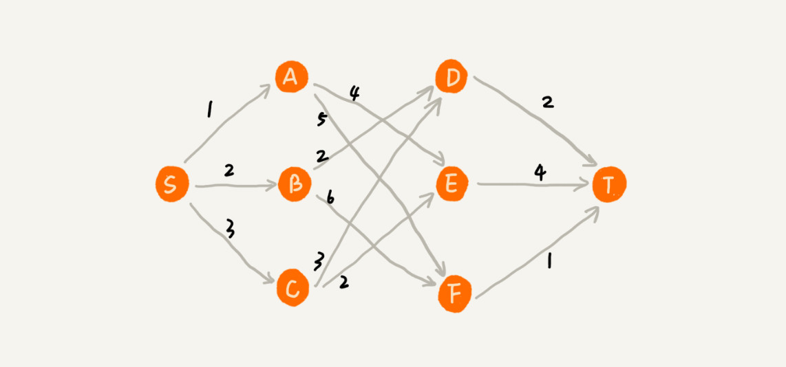

但是，这种贪心的选择方式，最终求的路径并不是最短路径，因为路径S->B->D->T 才是最短路径，因为这条路径的长度是2+2+2 =6。为什么贪心算法在这个问题上不工作了呢？

在这个问题上，贪心算法不工作的主要原因是，前面的选择，会影响后面的选择。如果我们第一步从顶点S走到顶点A，那接下来面对的顶点和边，跟第一步从顶点S走到顶点B，是完全不同的。所以，即便我们第一步选择最优的走法(边最短)，但有可能因为这一步选择，导致后面每一步的选择都很糟糕，最终也就无缘全局最优解了。


## 贪心算法实战分析

对于贪心算法，如果死抠理论的话，确实很难理解透彻。掌握贪心算法的关键是多练习。下面来分析几个具体的例子，帮助来深入理解贪心算法。


### 分糖果

我们有m个糖果和n个汉字。我们现在要把糖果分给这些孩子吃但是糖果少，孩子多(m<n)，所以糖果只能分配给一部分孩子。

每个糖果的大小不等，这m个糖果的打下分别是s1,s2,s3, ....., sm。除此之外，每个孩子对糖果大小的需求也是不一样的，只有糖果的大小大于等于孩子的对糖果大小的需求的时候，孩子才得到满足。假设这n个孩子对糖果大小的需求分别是g1,g2,g3, .... , gn。

我的问题是，如何分配糖果，能尽可能满足最多数量的孩子？

我们可以把这个问题抽象成，从n个孩子中，抽取一部分孩子分配糖果，让满足的孩子的个数(期望值)是最大的。这个问题的限制值就是糖果个数m。

现在来看如何用贪心算法来解决。对于一个孩子来说，如果小的糖果可以满足，我们就没必要用更大的糖果，这样更大的就可以留给其他对糖果大小需求更大的孩子。另一方面，对糖果大小需求小的孩子更容易被满足，所以，我们可以从需求小的孩子开始分配糖果。因为满足一个需求大的孩子跟满足一个需求小的孩子，对我们期望值的贡献是一样的。

我们每次从剩下的孩子中，找出对糖果大小需求最小的，然后发给他剩下的糖果中能满足他的最小的糖果，这样得到的分配方案，也就是满足的孩子个数最多的方案。


### 钱币找零

这个问题在我们的日常生活中更加普遍。假设我们有1元，2元，5元，10元，20元，50元，100元这些面额的纸币，它们的张数分别是c1、c2、c5、c20、c50、c100。我们现在要用这些钱来支付K元，最少用多少张纸币呢？

在生活中，我们肯定要先用面值最大的来支付，如果不够，就继续用更小一点的面值的，以此类推，最后剩下的用1元来补齐。

在贡献相同期望值(纸币数目)的情况下，我们希望多贡献点金额，这样就可以让纸币数更少，这就是一种贪心算法的解决思路。直觉告诉我们，这种处理方法就是最好的。实际上，要严谨地证明这种贪心算法的正确性，需要比较复杂的、有技巧的数学推导。


### 区间覆盖

假设我们有n个区间，区间的起始端点和结束端点分别是[l1,r1]，[l2,r2]，[l3,r3]，...., [ln,rn]。我们从这n个区间中选出一部分区间，这部分区间满足两两不想交(端点相交的情况不算相交)，最多能选出多少个区间呢？


这个问题的处理思路稍微不是那么好懂，不过，我建议你最好能弄懂，因为这个处理思想在很多贪心算法问题中都有用到，比如任务调度、教师排课等等问题。

这个问题的解决思路是这样的：我们假设这n个区间中最左端点是lmin，最右端点是rmax。这个问题就相当于，我们选择几个不相交的区间，从左到右将[lmin, rmax]覆盖上。我们按照起始端点从小到大的顺序对这n个区间排序。

我们每次选择的时候，左端点跟前面的已经覆盖的区间不重合的，右端点又尽量小的，这样可以让剩下的未覆盖区间尽可能的大，就可以放置更多的区间。这实际上就是一种贪心的选择方法。


## 解答开篇

现在我们来看下开篇的问题，如何用贪心算法实现霍夫曼编码？

假设我有一个包含1000个字符的文件，每个字符占1个byte (1byte=8bits)，存储这1000个字符就一共需要8000bits，那有没有更加节省空间的存储方式呢？

假设我们通过统计分析发现，这1000个字符中只包含6种不同字符，假设它们分别是a、b、c、d、e、f。而3个二进制位(bit)就可以表示8个不同的字符，所以，为了尽量减少存储空间，每个字符我们用3个二进制位来表示。那存储这1000个字符只需要3000bits就可以了，比原来的存储方式节省了很多空间。不过，还有没有更加节省空间的存储方式呢？

``` 
a(000)、b(001)、c(010)、d(011)、e(100)、f(101)
```

霍夫曼编码是一种十分有效的编码方法，广泛用于数据压缩中，其压缩率通常在20% ~ 90%之间。

霍夫曼编码不仅会考察文本中有多少个不同字符，还会考察每个字符出现的频率，根据频率的不同，选择不同长度的编码。霍夫曼编码视图用这种不等长的编码方法，来进一步增加压缩的效率。如何给不同频率的字符选择不同长度的编码呢？ 根据贪心的思想，我们可以把出现频率比较多的字符，用稍微短一些的编码；出现频率比较少的字符，用稍微长的一些编码。

对于等长的编码来说，我们解压缩起来很简单。比如刚才那个例子中，我们用3个bit表示一个字符。在解压缩的时候，我们每次从文本中读取3位二进制码，然后翻译成对应的字符。但是，霍夫曼编码是不等长的，每次应该读取1位还是2位、3位等等来解压缩呢？这个问题就导致霍夫曼编码解压缩起来比较复杂。为了避免解压缩过程中的歧义，霍夫曼编码要求各个字符的编码之间，不会出现某个编码是另一个编码前缀的情况。


假设这6个字符出现的频率从高到低依次是a、b、c、d、e、f。我们把它们编码下面这个样子，任何一个字符的编码都不是另一个的前缀，在解压缩的时候，我们每次会读取尽可能长的可解压的二进制串，所以在解压缩的时候也不会歧义。经过这种编码压缩之后，这1000个字符只需要2100bits就可以了。


尽管霍夫曼编码的思想并不难理解，但是如何根据字符出现的频率的不同，给不同的字符进行不同长度的编码呢？这里的处理稍微有些技巧。

我们把每个字符看作一个节点，并且附带着把频率放到优先级队列中。我们从队列中取出频率最小的两个节点A、B，然后新建一个节点C，把频率设置为两个节点的频率之和，并把这个新节点C作为A、B的父节点。最后再把C节点放入到优先级队列中。重复这个过程，直到队列中没有数据。


现在，我们给每一条边加上画一个权值，指向左子节点的边我们统统标记为0，指向右子节点的边，我们统统标记为1，那从根节点到叶节点的路径就是叶节点对应字符的霍夫曼编码。


## 内容小结

今天我们学习了贪心算法。

实际上，贪心算法适用的场景比较有限。这种算法思想更多的是指导设计基础算法。比如最小生成树算法、单源最短路径算法，这些算法都用到了贪心算法。从我个人的学习经验来讲，不要刻意去记忆贪心算法的原理，多练习才是最有效的学习方法。

贪心算法的最难的一块是如何将要解决的问题抽象成贪心算法模型，只要这一步搞定之后，贪心算法的编码一般都很简单。贪心算法解决问题的正确性虽然很多时候都看起来是显而易见的，但是要严谨地证明算法能够得到最优解，并不是件容易的事。所以，很多时候，我们只需要多举几个例子，看一下贪心算法的解决方案是否真的能得到最优解就可以了。


## D64(2020/12/23) 分治算法

MapReduce是谷歌大数据处理的三驾马车之一，另外两个是GFS和Bigtable。它在倒排索引、PageRank计算、网页分析等搜索引擎相关的技术中都有大量的应用。

尽管开发一个MapReduce看起来很高深，感觉跟我们遥不可及。实际上，万变不离其宗，它的本质就是我们今天要学的这种算法思想，分治算法。


## 如何理解分治算法？

为什么说MapRedue的本质就是分治算法呢？我们先来看，什么是分治算法？

分治算法的核心思想其实就是四个字，分而治之，也就是将原问题划分成n个规模较小，并且结构与原问题相似的子问题，递归地解决这些子问题，然后再合并其结果，就得到原问题的解。

这个定义看起来有点难类似递归的定义。关于分治和递归的区别，我们在排序(下)的时候讲过，分治算法是一种处理问题的思想，递归是一种编程技巧。实际上，分治算法一般都比较适合用递归来实现呢。分治算法的递归实现中，每一层递归都会涉及这样三个操作：

* 分解：将原问题分解成一系列子问题；
* 解决：递归地求解各个子问题，若子问题足够小，则直接求解；
* 合并：将子问题的结果合并成原问题。

分治算法能解决的问题，一般需要满足下面这几个条件：

* 原问题与分解成的小问题具有相同的模式；
* 原问题分解成的子问题可以独立求解，子问题之间没有相关性，这一点是分治算法跟动态规划的明显区别，等我们讲到动态规划的时候，会详细对比这两种算法；
* 具有分解终止条件，也就是说，当问题足够小时，可以直接求解；
* 可以将子问题合并成原问题，而这个合并操作的复杂度不能太高，否则就起不到减小算法总体复杂度的效果了。


## 分治算法应用举例分析

理解分治算法的原理并不难，但是要想灵活应用并不容易。所以，接下来，我们会用分治算法解决我们在讲排序的时候涉及的一个问题，加深我们对分治算法的理解。

还记得我们在排序算法里讲到的数据的有序度、逆序度的概念吗？当时我们讲到，我们用有序度来表示一组数据的有序程度，用逆序度表示一组数据的无序程度。

假设我们有n个数据，我们期望数据从小到大排序，那完全有序的数据的有序度就是n(n-1)/2，逆序度等于0；相反，倒序排列的数据的有序度就是0，逆序度是n(n-1)/2。除了这两种极端情况外，我们通过计算有序对或者逆序对的个数，来表示数据的有序度或逆序度。


现在的问题是，如何编程求出一组数据的有序对个数或逆序对个数呢？因为有序对个数和逆序对个数的求解方式是类似的，所以我们只需要思考逆序对个数的求解方法。

最笨的方法是，拿每个数字跟它后面的数字比较，看有几个比它小的。我们把比它小的数字个数记作k，通过这样的方式，把每个数字都考察一遍之后，然后对每个数字对应的k值求和，最后得到的总和就是逆序对个数。不过，这样操作的时间复杂度是O(n^2)。那有没有更加高效的处理方法呢？

我们用分治算法来试试。我们套用分治的思想来求数组A的逆序对个数。我们可以将数组分成前后两半A1和A2，分别计算A1和A2的逆序对个数K1和K2，然后再计算A1与A2之间的逆序对个数K3。那数组A的逆序对个数就等于K1+K2+K3。

我们前面讲过，使用分治算法其中一个要求是，子问题合并的代价不能太大，否则就起不了降低时间复杂度的效果了。那回到这个问题，如何快速计算出两个子问题A1与A2之间的逆序对个数呢？

这里就要借助归并排序算法了。

归并排序中有一个非常关键的操作，就是将两个有序的小数组，合并成一个有序的数组。实际上，在这个合并的过程中，我们就可以计算这两个小数组的逆序对个数了。每次合并操作，我们都计算逆序对个数，把这些计算出来的逆序对个数求和，就是这个数组的逆序对个数了。


具体的代码如下：

``` 
private int num = 0; // 全局变量或者成员变量

public int count(int[] a, int n) {
  num = 0;
  mergeSortCounting(a, 0, n-1);
  return num;
}

private void mergeSortCounting(int[] a, int p, int r) {
  if (p >= r) return;
  int q = (p+r)/2;
  mergeSortCounting(a, p, q);
  mergeSortCounting(a, q+1, r);
  merge(a, p, q, r);
}

private void merge(int[] a, int p, int q, int r) {
  int i = p, j = q+1, k = 0;
  int[] tmp = new int[r-p+1];
  while (i<=q && j<=r) {
    if (a[i] <= a[j]) {
      tmp[k++] = a[i++];
    } else {
      num += (q-i+1); // 统计p-q之间，比a[j]大的元素个数
      tmp[k++] = a[j++];
    }
  }
  while (i <= q) { // 处理剩下的
    tmp[k++] = a[i++];
  }
  while (j <= r) { // 处理剩下的
    tmp[k++] = a[j++];
  }
  for (i = 0; i <= r-p; ++i) { // 从tmp拷贝回a
    a[p+i] = tmp[i];
  }
}
```

但是，如果我告诉你可以借助归并排序算法来解决，那我们就应该要想到如何改造归并排序，来求解这个问题了。

关于分治算法，这里还有两道比较经典的问题，我们可以自己练习一下。

* 二维平面上有n个点，如何快速计算出两个距离最近的点对？
* 有两个n\*n的矩阵A，B，如何快速求解两个矩阵的乘积C=A*B ？


## 分治思想在海量数据处理中的应用

分治算法思想的应用是非常广泛的，并不仅局限于指导编程和算法设计。它还经常用在海量数据处理的场景中。我们前面讲的数据结构和算法，大部分都是基于内存存储和单机处理。但是，如果要处理的数据量非常大，没法一次性放到内存中，这个时候，这些数据结构和算法就无法工作了。

比如，给10GB的订单文件按照金额排序这样一个需求，看似是一个简单的排序问题，但是因为数据量大，有10GB，而我们的机器的内存可能只有2、3GB这样子，无法一次性加载到内存，也就无法通过单纯地使用快排、归并等基础算法来解决了。

要解决这种数据量大到内存装不下的问题，我们就可以利用分治的思想。我们可以将海量的数据集合根据某种方法，划分为几个小的数据集合，每个小的数据集合单独加载到内存来解决，然后再将小数据结合合并成大数据集合。实际上，利用这种分治的处理思路，不仅仅能克服内存的限制，还能利用多线程或多机处理，加快处理的速度。

比如刚刚举的那个例子，给10GB的订单排序，我们就可以先扫描一遍订单，根据订单的金额，将10GB的文件划分为几个金额区间。比如订单净额为1到100元的放到一个小文件，101到200之间的放到另一个文件，以此类推。这样每个小文件都可以单独加载到内存排序，最后将这些有序的小文件合并，就是最终的10GB订单数据了。

如果订单数据存储在类似GFS这样的分布式系统上，当10GB的订单被划分成多个小文件的时候，每个文件可以并行加载到多台机器上处理，最后再将结果合并在一起，这样并行处理的速度也加快了很多。不过，这里有一个点要注意，就是数据的存储与计算所在的机器是同一个或者在网络中靠的很近(比如一个局域网内，数据存取速度很快)，否则就会因为数据访问的速度，导致整个处理过程不但不会变快，反而有可能变慢。


## 解答开篇

这里我们来看下，为什么说MapReduce的本质就是分治思想呢？

我们刚刚举的订单的例子，数据有10GB大小，可能给你的感受还不强烈。那如果我们要处理的数据是1T、10T、100T这样子的，那一台机器处理的效率肯定是非常低的。而对于谷歌搜索引擎来说，网页爬取、清洗、分析、分词、计算权重、倒排索引等等各个环节中，都会面对如此海量的数据(比如网页)。所以，利用集群并行处理显然是大势所趋。

一台机器过于低效，那我们就把任务拆分到多台机器上来处理。如果拆分之后的小任务之间互不干扰，独立计算，最后再将结果合并。这不就是分治思想吗？

实际上，MapReduce框架只是一个任务调度器，底层依赖GFS来存储数据，依赖Borg管理机器。它从GFS中拿数据，交给Borg中的机器执行，并且时刻监控机器执行的进度，一旦出现机器宕机、进度卡壳等，就重新从Borg中调度一台机器执行。

尽管MapReduce的模型非常简单，但是在谷歌内部引用非常广泛。它除了可以用来处理这种数据与数据之间存在关系的任务，比如MapReduce的经典例子，就是统计文件中单词出现的频率。除此之外，它还可以用来处理数据与数据之间没有关系的任务，比如对网页分析、分词等，每个网页可以独立的分析、分词，而这两个网页之间并没有关系。网页几十亿、上百亿，如果单机处理，效率低下，我们就可以利用MapReduce提供的高可靠、高性能、高容错的并行计算框架，并行地处理这几十亿、上百亿的网页。


## 内容小结

今天我们讲解了一种应用非常广泛的算法思想，分治算法。

分治算法用四个字概括就是"分而治之"，将原问题划分成n个规模较小而结构与原问题相似的子问题，递归地解决这些子问题，然后再合并其结果，就得到原问题的解。这个思想非常简单，好理解。

今天我们讲了两种分治算法的典型的应用场景，一个是用来指导编码，降低问题求解的时间复杂度，另一个是解决海量数据处理问题。比如MapReduce本质上就是利用了分治思想。


## D65(2020/12/25) 回溯算法

在之前我们学习图的过程中，提到了深度优先搜索算法利用的是回溯算法思想。这个算法思想非常简单，但是应用内非常广泛，它除了用来指导像深度优先搜索这种经典的算法设计之外，还可以用在很多实际的软件开发场景中，比如正则表达式匹配、编译原理中的语法分析等。

除此之外，很多经典的数学问题都可以用回溯算法解决，比如数独、八皇后、0-1背包、图的着色、旅行商问题、全排列等等。既然应用如此广泛，我们今天就来学习一下这个算法思想，看看它是如何知道我们解决问题的？


## 如何理解"回溯算法"？

在我们的一生中，会遇到很多重要的岔路口。在岔路口，每个选择都会影响我们今后的人生。有的人在每个岔路口都能做出最正确的选择，最后生活、事业都达到了一个很高的高度；而有的人一路选错，最后碌碌无为。如果人生可以量化，那如何才能在岔路口做出最正确的选择，让自己的人生"最优"呢？

我们可以借助前面学过的贪心算法，在每次面对岔路口的时候，都做出看起来最优的选择，期望这一组选择可以使得我们的人生达到"最优"。但是，我们前面也讲过，贪心算法并不一定能得到最优解。那有没有什么办法能得到最优解呢？

笼统地讲，回溯算法很多时候都应用在"搜索"这类问题上。不过这里说的搜索，并不是狭义的指我们前面讲过的图的搜索算法，而是在一组可能的解中，搜索满足期望的解。

回溯的处理思想，有点类似枚举搜索。我们枚举所有的解，找到满足期望的解。为了有规律地枚举所有可能的解，避免遗漏和重复，我们把问题求解的过程分为多个阶段。每个阶段，我们都会面对一个岔路口，我们先随意选一条路走，当发现这条路走不通的时候(不符合期望的解)，就回退到上一个岔路口，另选一种走法继续走。

理论的东西还是过于抽象，老规矩，这里还是举例说明一下。这里举一个经典的回溯的例子，八皇后的问题。

我们有一个8*8的棋盘，希望往里放8个棋子(皇后)，每个棋子所在的行、列、对角线都不能有另一个棋子。可以看下面的图示，第一幅图是满足条件的一种方法，第二幅图是不满足条件的。八皇后问题就是期望找到所有满足这种要求的放棋子方式。


我们把这个问题划分成8个阶段，依次将8个棋子放到第一行、第二行、第三行....第八行。在放置的过程中，我们不停地检查当前放法，是否满足要求。如果满足，则跳到下一行继续放置棋子；如果不满足，那就再换一种放法，继续尝试。

回溯算法非常适合用递归代码实现，所以，我把八皇后的算分翻译成了代码。我在代码里添加了详细的注释，可以对比看看。

``` 
int[] result = new int[8];//全局或成员变量,下标表示行,值表示queen存储在哪一列
public void cal8queens(int row) { // 调用方式：cal8queens(0);
  if (row == 8) { // 8个棋子都放置好了，打印结果
    printQueens(result);
    return; // 8行棋子都放好了，已经没法再往下递归了，所以就return
  }
  for (int column = 0; column < 8; ++column) { // 每一行都有8中放法
    if (isOk(row, column)) { // 有些放法不满足要求
      result[row] = column; // 第row行的棋子放到了column列
      cal8queens(row+1); // 考察下一行
    }
  }
}

private boolean isOk(int row, int column) {//判断row行column列放置是否合适
  int leftup = column - 1, rightup = column + 1;
  for (int i = row-1; i >= 0; --i) { // 逐行往上考察每一行
    if (result[i] == column) return false; // 第i行的column列有棋子吗？
    if (leftup >= 0) { // 考察左上对角线：第i行leftup列有棋子吗？
      if (result[i] == leftup) return false;
    }
    if (rightup < 8) { // 考察右上对角线：第i行rightup列有棋子吗？
      if (result[i] == rightup) return false;
    }
    --leftup; ++rightup;
  }
  return true;
}

private void printQueens(int[] result) { // 打印出一个二维矩阵
  for (int row = 0; row < 8; ++row) {
    for (int column = 0; column < 8; ++column) {
      if (result[row] == column) System.out.print("Q ");
      else System.out.print("* ");
    }
    System.out.println();
  }
  System.out.println();
}
```


## 两个回溯算法的经典应用

回溯算法的理论知识很容易弄懂。不过，对于新手来说，比较难的是用递归来实现。所以，我们再通过两个例子，来练习一下回溯算法的应用和实现。


### 0-1背包

0-1背包是非常经典的算法问题，很多场景都可以抽象成这个问题模型。这个问题的经典解法是动态规划，不过还有一种简单但没有那么高效的解法，那就是今天讲的回溯算法。

0-1背包问题有很多变体，这里介绍一种比较基础的。我们有一个背包，背包总的承载重量是Wkg。现在我们有n个物品，每个物品的重量不等，并且不可分割。我们现在期望选择几件物品，装载到背包中。在不超过背包所能装载重量的前提下，如何让背包中物品的总重量最大？

实际上，背包问题我们在贪心算法那一节，已经讲过一个了，不过那里讲的物品是可以分割的，我可以装某个物品的一部分到背包里面。今天讲的这个背包问题，物品是不可分割的，要么装要么不装，所以叫0-1背包问题。显然，这个问题已经无法通过贪心算法来解决了。我们现在来看看，用回溯算法如何来解决。

对于每个物品来说，都有两种选择，装进背包或不装进背包。对于n个物品来说，总的装法就有2^n种，去掉总重量超过Wkg的，从剩下的装法中选择总重量最接近Wkg的。不过，我们如何才能不重复地穷举出这2^n种装法呢？

这里就可以用回溯的方法。我们可以把物品依次排列，整个问题就分解为了n个阶段，每个阶段对应一个物品怎么选择。先对第一个物品进行处理，选择装进去或不装进去，然后再递归地处理剩下的物品。

这里还稍微用到了一点搜索减枝的技巧，就是当发现已经选择的物品的总量超过1Wkg之后，我们就停止继续探测剩下的物品。

``` 
public int maxW = Integer.MIN_VALUE; //存储背包中物品总重量的最大值
// cw表示当前已经装进去的物品的重量和；i表示考察到哪个物品了；
// w背包重量；items表示每个物品的重量；n表示物品个数
// 假设背包可承受重量100，物品个数10，物品重量存储在数组a中，那可以这样调用函数：
// f(0, 0, a, 10, 100)
public void f(int i, int cw, int[] items, int n, int w) {
  if (cw == w || i == n) { // cw==w表示装满了;i==n表示已经考察完所有的物品
    if (cw > maxW) maxW = cw;
    return;
  }
  f(i+1, cw, items, n, w);
  if (cw + items[i] <= w) {// 已经超过可以背包承受的重量的时候，就不要再装了
    f(i+1,cw + items[i], items, n, w);
  }
}
```


### 正则表达式

看懂了0-1背包问题，我们再来看另外一个例子，正则表达式匹配。

对于一个开发工程师来说，正则表达式应该不会陌生。在平时的开发中，或多或少都应该用过。实际上，正则表达式里最重要的一种算法思想就是回溯。

正则表达式中，最重要的就是通配符，通配符结合在一起，可以表达非常丰富的语义。为了方便讲解，我们假设正则表达式中只包含"*"和"?"这两种通配符，并且对这两个通配符的语义稍微做些改变，其中，"\*"匹配任意多个(大于等于0个)任意字符，"?"匹配零个或者一个任意字符。基于以上背景假设，我们看下，如何用回溯算法，判断一个给定的文本，能否跟给定的正则表达式匹配？

我们依次考察正则表达式的每个字符，当是非通配符的时候，我们就直接跟文本的字符进行匹配，如果相同，则继续往下处理；如果不同，则回溯。

如果遇到特殊字符的时候，我们就有多种处理方式了，也就是所谓的岔路口，比如"*"有多种匹配方案，可以匹配任意个文本串中的字符，我们就先随意的选择一种匹配方案，然后继续考察剩下的字符。如果中途发现无法继续匹配下去了，我们就回到这个岔路口，重新选择一种匹配方案，然后再继续匹配剩下的字符。

有了前面的基础，这个问题就好懂多了。可以详细看下下面的代码。

``` 
public class Pattern {
  private boolean matched = false;
  private char[] pattern; // 正则表达式
  private int plen; // 正则表达式长度

  public Pattern(char[] pattern, int plen) {
    this.pattern = pattern;
    this.plen = plen;
  }

  public boolean match(char[] text, int tlen) { // 文本串及长度
    matched = false;
    rmatch(0, 0, text, tlen);
    return matched;
  }

  private void rmatch(int ti, int pj, char[] text, int tlen) {
    if (matched) return; // 如果已经匹配了，就不要继续递归了
    if (pj == plen) { // 正则表达式到结尾了
      if (ti == tlen) matched = true; // 文本串也到结尾了
      return;
    }
    if (pattern[pj] == '*') { // *匹配任意个字符
      for (int k = 0; k <= tlen-ti; ++k) {
        rmatch(ti+k, pj+1, text, tlen);
      }
    } else if (pattern[pj] == '?') { // ?匹配0个或者1个字符
      rmatch(ti, pj+1, text, tlen);
      rmatch(ti+1, pj+1, text, tlen);
    } else if (ti < tlen && pattern[pj] == text[ti]) { // 纯字符匹配才行
      rmatch(ti+1, pj+1, text, tlen);
    }
  }
}
```


## 内容小结

回溯算法的思想非常简单，大部分情况下，都是用来解决广义的搜索问题，也就是，从一组可能的解中，选择出一个满足要求的解。回溯算法非常适合用递归来实现，在实现的过程中，剪枝操作是提高回溯效率的一种技巧。利用剪枝，我们并不需要穷举搜索所有的情况，从而提高搜索效率。


## D66(2020/12/26) 动态规划

淘宝的"双十一"购物节有各种促销活动，比如"满200减50元"。假设购物车中有n个(n>100)想买的商品，她希望从里面选几个，在凑满满减条件的前提下，让选出来的商品价格和最大程度低接近满减条件(200元)，这样就可以极大限度地"薅羊毛"。

要想高效地解决这个问题，就要用到我们今天讲的动态规划。


## 动态规划学习路线

动态规划比较适合用来求解最优问题，比如求最大值、最小值等等。它可以非常显著地降低时间复杂度，提高代码的执行效率。不过，它也是出了名的难学。它的主要学习难点跟递归类似，那就是，求解问题的过程不太符合人类常规的思维方式。对于新手来说，要想入门确实不容易。不过，等我们掌握了之后，就会发现，实际上并没有想象中那么难。

为了让我们更容易理解动态规划，这里分了三节来讲解。这三节分别是，初识动态规划、动态规划理论、动态规划实战。

第一节，我们会通过两个非常经典的动态规划问题模型，来展示我们为什么需要动态规划，以及动态规划解题方法是如何演化过来的。实际上，我们只要掌握了这两个例子的解决思路，对于其他很多动态规划问题，我们都可以套用类似的思路来解决。

第二节，我们会总结动态规划适合解决的问题的特征，以及动态符合解题思路。除此之外，我们还会将贪心、分治、回溯、动态规划这四种算法思想放在一起，对比分析它们各自的特点以及适用的场景。

第三节，我们会讲解如何应用第二节中讲的动态规划理论知识，实战解决三个非常经典的动态规划问题，加深对理论的理解。弄懂了这三节中的例子，对于动态规划这个知识点，我们就算是入门了。


## 0-1背包问题

我们在讲贪心算法、回溯算法的时候，多次讲到背包问题。现在，我们依旧拿这个问题来举例。

关于这个问题，我们上一节讲了回溯的解决方法，也就是穷举搜索所有的可能的装法，然后找出满足条件的最大值。不过，回溯算法的复杂度比较高，是指数级别的。那有没有什么规律，可以有效降低时间复杂度呢？

``` 
// 回溯算法实现。注意：我把输入的变量都定义成了成员变量。
private int maxW = Integer.MIN_VALUE; // 结果放到maxW中
private int[] weight = {2，2，4，6，3};  // 物品重量
private int n = 5; // 物品个数
private int w = 9; // 背包承受的最大重量
public void f(int i, int cw) { // 调用f(0, 0)
  if (cw == w || i == n) { // cw==w表示装满了，i==n表示物品都考察完了
    if (cw > maxW) maxW = cw;
    return;
  }
  f(i+1, cw); // 选择不装第i个物品
  if (cw + weight[i] <= w) {
    f(i+1,cw + weight[i]); // 选择装第i个物品
  }
}
```

规律是不是不好找？那我们就举了例子、画个图看看。我们假设背包的最大承载重量是9。我们有5个不同的物品，每个物品的重量分别是2，2，4，6，3。如果我们把这个例子的回溯求解过程，用递归树画出来，就是下面这个样子。


递归树中的每个节点表示一种状态，我们用(i,cw)来表示。其中，i表示将要决策第几个物品是否装入背包，cw表示当前背包中物品的总重量。


## 内容小结

从今天讲解的例子中来看，应该能发现，大部分动态规则能解决的问题，都可以通过回溯算法来执行，只不过回溯算法解决起来效率比较地，时间复杂度是指数级的。动态规划算法，在执行效率方面，要高很多。尽管执行效率提高了，但是动态规划的空间复杂度也提高了，所以，很多时候，我们会说，动态规划是一种空间换时间的算法思想。 


## D67(2020/12/26) B+树索引

数据库索引是如何实现的呢？底层使用的是什么数据结构和算法呢？


## 算法解析

### 解决问题的前提是定义清楚问题

如何定义清楚问题呢？除了对问题进行详细的调研，还有一个办法，那就是，通过对一些模糊的需求进行假设，来限定要解决的问题的范围。

如果我们对数据库的操作非常了解，针对我们现在这个问题，我们就能把索引的需求定义得非常清楚。但是，对于大部分软件工程师来说，我们可能只了解一小部分常用的SQL语句，所以，这里我们假设要解决的问题，只包含这样两个常用的需求：

* 根据某个值查找数据，比如  `select * from user where id =1234;`
* 根据区间值来查找某些数据，比如`select * from user where id > 1234 and id < 2345;`

在执行效率方面，我们希望通过索引，查询数据的效率尽可能地高；在存储空间方面，我们希望索引不要消耗太多的内存空间。


### 尝试用学过的数据结构解决这个问题

问题的需求大致定义清楚了，我们现在回想一下，能否利用已经学习过的数据结构解决这个问题呢？支持快速查询、插入等操作的动态数据结构，我们已经学习过散列表、平衡二叉树、跳表。

我们先来看散列表。散列表的查询性能很好，时间复杂度是O(1)。但是，散列表不能支持按照区间快速查找数据。所以，散列表不能满足我们的需求。

我们再来看平衡二叉查找树。尽管平衡二叉查找树查询的性能也很高，时间复杂度是O(logn)。而且，对树进行中序遍历，我们还可以得到一个从小到大有序的数据序列，但是这个仍然不足以支持按照区间快速查找数据。

我们再来看跳表。跳表是在链表之上加上多层索引构成的。它支持快速地插入、查找、删除数据，对应的时间复杂度是O(logn)。并且，跳表也支持按照区间快速地查找数据。我们只需要定位到区间起点值对应在链表中的结点，然后从这个结点开始，顺序遍历链表，直到区间终点对应的结点为止，这期间遍历得到的数据就是满足区间值的数据。


这样看来，跳表是可以解决这个问题。实际上，数据库索引所用到的数据结构跟跳表非常相似，叫做B+树。不过，它是通过二叉查找树演化过来的，而非跳表。为了还原发明B+树的整个思考过程，所以，接下来，我们还要从二叉查找树讲起，看它是如何一步一步被改造成B+树的。


### 改造二叉查找树来解决这个问题

为了让二叉查找树支持按照区间来查找数据，我们可以对它进行这样的改造：树中的节点并不存储数据本身，而是只是作为索引。除此之外，我们把每个叶子节点串在一条链表上，链表中的数据是从小到大有序的。经过改造之后的二叉树，就像图中这样，看起来很像跳表。

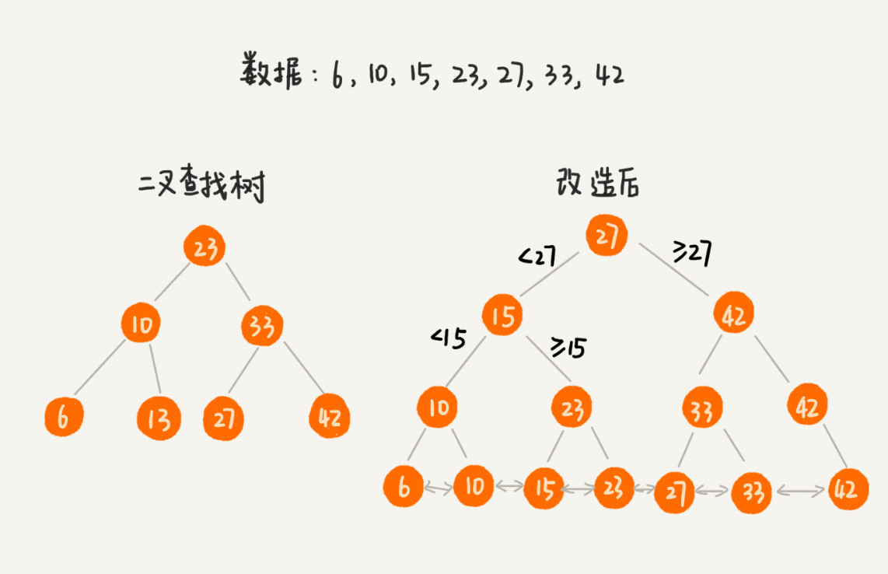

改造之后，如果我们要求某个区间的数据。我们只需要拿区间的起始值，在树中进行查找，当查找到某个叶子节点之后，我们再顺着链表往后遍历，直到链表中的结点数据值大于区间的终止值为止。所有遍历到的数据，就是符合区间值的所有数据。


但是，我们要为几千万、上亿的数据构建索引，如果将索引存储在内存中，尽管内存访问的速度非常快，查询的效率非常高，但是，占用的内存会非常多。

比如，我们给一亿个数据构建二叉查找数索引，那索引中会包含大约1亿个节点，每个节点假设占用16个字节，那就需要大约1GB的内存空间。给一张表建立索引，我们需要1GB的内存空间。如果我们要给10张表建立索引，那就内存的需求是无法满足的。如何解决这个索引占用太多内存的问题呢？

我们可以借助时间换空间的思路，把索引存储在硬盘中，而非内存中。我们都知道，硬盘是一个非常慢速的存储设备。通常内存的访问速度是纳秒级别的，而磁盘访问的速度是毫秒级别的。读取同样大小的数据，从磁盘中读取花费的时间，是从内存中读取所花费时间的上万倍，甚至几十万倍。

这种将索引存储在硬盘中的方案，尽管减少了内存消耗，但是在数据查找的过程中，需要读取磁盘中的索引，因此数据查询效率就相应降低很多。

二叉查找树，经过改造之后，支持区间查找的功能就实现了。不过，为了节省内存，如果把树存储在硬盘中，那么每个节点的读取(或者访问)，都对应一次磁盘IO操作。树的高度就等于每次查找数据时磁盘IO操作的次数。

我们前面讲到，比起内存读写操作，磁盘IO操作非常耗时，所以我们优化的重点就是尽量减少磁盘IO操作，也就是，尽量降低树的高度。那如何降低树的高度呢？

我们来看下，如果我们把索引构建成m叉树，高度是不是比二叉树要小呢？如图所示，给16个数据构建二叉树索引，树的高度是4，查找一个数据，就需要4个磁盘IO操作(如果根节点存储在内存中，其他节点存储在磁盘中)，如果对16个数据构建五叉树索引，那高度只有2，查找一个数据，对应只需要2次此案操作。如果m叉树中的m是100，那对一亿个数据构建索引，树的高度也只有3，最多只要3次磁盘IO就能获取到数据。磁盘IO变少了，查找数据的效率也就提高了。


如果我们将m叉树实现B+树索引，用代码实现出来，就是下面这个样子(假设我们给int类型的数据库字段添加索引，所以代码中的keywords是int类型的):

``` 
/**
 * 这是B+树非叶子节点的定义。
 *
 * 假设keywords=[3, 5, 8, 10]
 * 4个键值将数据分为5个区间：(-INF,3), [3,5), [5,8), [8,10), [10,INF)
 * 5个区间分别对应：children[0]...children[4]
 *
 * m值是事先计算得到的，计算的依据是让所有信息的大小正好等于页的大小：
 * PAGE_SIZE = (m-1)*4[keywordss大小]+m*8[children大小]
 */
public class BPlusTreeNode {
  public static int m = 5; // 5叉树
  public int[] keywords = new int[m-1]; // 键值，用来划分数据区间
  public BPlusTreeNode[] children = new BPlusTreeNode[m];//保存子节点指针
}

/**
 * 这是B+树中叶子节点的定义。
 *
 * B+树中的叶子节点跟内部节点是不一样的,
 * 叶子节点存储的是值，而非区间。
 * 这个定义里，每个叶子节点存储3个数据行的键值及地址信息。
 *
 * k值是事先计算得到的，计算的依据是让所有信息的大小正好等于页的大小：
 * PAGE_SIZE = k*4[keyw..大小]+k*8[dataAd..大小]+8[prev大小]+8[next大小]
 */
public class BPlusTreeLeafNode {
  public static int k = 3;
  public int[] keywords = new int[k]; // 数据的键值
  public long[] dataAddress = new long[k]; // 数据地址

  public BPlusTreeLeafNode prev; // 这个结点在链表中的前驱结点
  public BPlusTreeLeafNode next; // 这个结点在链表中的后继结点
}
```

对于相同个数的数据构建m叉树索引，m叉树中的m越大，那树的高度就越小，那m叉树中的m是不是越大越好呢？到底多大才最合适呢？

不管是内存中的数据，还是磁盘中的数据，操作系统都是按页(一页大小通常是4KB，这个值可以通过getconfig PAGE_SIZE命令查看)来读取的，一次会读一页的数据。如果要读取的数据量超过一页的大小，就会触发多次IO操作。所以，我们在选择m大小的时候，要尽量让每个节点的大小等于一个页的大小。读取一个节点，只需要一次磁盘IO操作。


尽管索引可以提高数据库的查询效率，但是，作为一名开发工程师，我们应该也知道，索引有利也有弊，它也会让写入数据的效率下降。这是为什么呢？

数据的写入过程，会涉及索引的更新，这是索引导致写入变慢的主要原因。

对于一个B+树来说，m值是根据页的大小事先计算好的，也就是说，每个节点最多只能有m个子节点。在往数据库中写入数据的过程中，这样就有可能使索引中某些节点的子节点个数超过m，这个节点的大小超过了一个页的大小，读取这样一个节点，就会导致多次磁盘IO操作。我们该如何解决这个问题呢？

实际上，处理思路并不复杂。我们只需要将这个节点分裂成两个节点。但是，节点分裂之后，其上层父节点的子节点个数就有可能超过m个。不过这也没关系，我们可以用同样的方法，将父节点也分裂成两个节点。这种级联反应会从下往上，一直影响到根节点。这个分裂过程，我们可以结合着下面这个图一起看，会更容易理解(图中的B+树是一个三叉树。我们限定叶子节点中，数据的个数超过2个就分裂节点；非叶子节点中，子节点的个数超过3个就分裂节点)。


正是因为要时刻保证B+树索引是一个m叉树，所以，索引的存在会导致数据库写入的速度降低。实际上，不光写入数据会变慢，删除数据也会变慢。这是为什么呢？

我们在删除某个数据的时候，也要对应地更新索引节点。这个处理思路有点类似跳表中删除数据的处理思路。频繁的数据删除，就会导致某些节点中，子节点的个数变得非常少，长此以往，如果每个节点的子节点都比较少，势必会影响索引的效率。

我们可以设置一个阀值。在B+树中，这个阀值等于m/2。如果某个节点的子节点个数小于m/2，我们就将它跟相邻的兄弟节点合并。不过，合并之后节点的子节点个数有可能会超过m。针对这种情况，我们可以借助插入数据时候的处理方法，再分裂节点。

文字描述不是很直观，这里举了一个删除操作的例子，我们可以对比看着下(图中的B+树是一个五叉树。我们限定叶子节点中，数据的个数少于2个就合并节点；非叶子节点中，子节点的个数少于3个就合并节点。)


数据库索引以及B+树的由来，到此已经讲完了。我们可以发现，B+树的结构和操作，跟跳表非常类似。理论上讲，对跳表稍加改造，也可以替代B+树，作为数据库的索引实现的。


## 总结引申

今天，我们讲解了数据库索引实现，依赖的底层数据结构，B+树。它通过存储在磁盘的多叉树结构，做到了时间、空间的平衡，既保证了执行效率，又节省了内存。

前面的讲解中，为了一步一步详细地给你介绍B+树的由来，内容看起来比较零散。为了方便掌握和记忆，这里再总结一下B+树的特点：

* 每个节点中子节点的个数不能超过m，也不能小于m/2;
* 根节点的子节点个数可以不超过m/2，这是一个例外；
* m叉树只存储索引，并不真正存储数据，这个有点类似跳表；
* 通过链表将叶子节点串联在一起，这样可以方便按区间查找；
* 一般情况，根节点会被存储在内存中，其他节点存储在磁盘中。

除了B+树，可能还听说过B树、B-树。实际上，B-树就是B树，英文翻译为B-Tree，这里的"-"并不是相对B+树中的"+"，而只是一个连接符。

而B树实际上是低级版的B+树，或者说B+树是B树的改进版。B树跟B+树的不同点主要集中在这几个地方：

* B+树中的节点不存储数据，只是索引，而B树中的节点存储数据；
* B树中的叶子节点并不需要链表来串联。

也就是说，B树只是一个每个节点的子节点个数不能小于m/2的m叉树。


## D68(2020/12/27) 索引：如何在海量数据中快速查找某个数据

在之前的学习中，我们讲解了MySQL数据库索引的实现原理。MySQL底层依赖的是B+树这种数据结构。那类似Redis这样的Key-Value数据库中索引，又是怎么实现的呢？底层依赖的又是什么数据结构呢？

今天，我们就来讲一下索引这种常用的技术解决思路，底层往往会依赖哪些数据结构。同时，通过索引这个应用场景，也来回顾一下，之前我们学过的几种支持动态集合的数据结构。


## 为什么需要索引？

在实际的软件开发中，业务纷繁复杂，功能千变万化，但是，万变不离其宗。如果抛开这些业务和功能的外壳，其实它们的本质都可以抽象为"对数据的存储和计算"。对应到数据结构和算法中，那"存储"需要的就是数据结构，"计算"需要的就是算法。

对于存储的需求，功能上无外乎增删改查。这其实并不复杂。但是，一旦存储的数据很多，那性能就成了这些系统要关注的重点，特别是在一些跟存储相关的基础系统(比如MYSQL数据库、分布式文件系统等)、中间件(比如消息中间件RocketMQ等)中。

"如何节省存储空间、如何提高数据增删改查的执行效率"，这样的问题就成了设计的重点。而这些系统的实现，都离不开一个东西，那就是索引。不夸张地说，索引设计得好坏，直接决定了这些系统是否优秀。

索引这个概念，非常好理解。我们可以类比书籍的目录来理解。如果没有目录，我们想要查找某个知识点的时候，就要一页一页翻。通过目录，我们就可以快速定位相关知识点的页数，查找的速度也会有质的提高。


## 索引的需求定义

接下来，我们就分析一下，在设计索引的过程中，需要考虑到的一些因素，换句话说就是，我们该如何定义清楚需求呢？

对于系统设计需求，我们一般可以从功能性需求和非功能性需求两方面来分析，这个问题也不例外。


### 功能性需求

对于功能性需求需要考虑的点，我把我们大致概括成下面的这几点。

数据是格式化数据还是非格式化数据？要构建索引的原始数据，类型有很多。我把它分为两类，一类是结构化数据，比如，MySQL中的数据；另一类是非结构化数据，比如搜索引擎中网页。对于非结构化数据，我们一般需要做预处理，提取出查询关键词，对关键词构建索引。

数据是静态数据还是动态数据？如果原始数据是一组静态数据，也就是说，不会有数据的增加、删除、更新操作，所以，我们在构建索引的时候，只需要考虑查询效率就可以了。这样，索引的构建就相对简单些。不过，不部分情况下，我们都是对动态数据构建索引，也就是说，我们不仅要考虑到索引的查询效率，在原始数据更新的同时，我们还需要动态地更新索引。支持动态数据集合的索引，设计起来相对也要更加复杂些。

索引存储在内存还是硬盘？如果索引存储在内存中，那查询的速度肯定要比存储在磁盘中的高。但是，如果原始数据量很大的情况下，对应的索引可能也会很大。这个时候，因为内存有限，我们可能就不得不将索引存储在磁盘中了。实际上，还有第三种情况，那就是一部分存储在内存，一部分存储在磁盘，这样就可以兼顾内存消耗和查询效率。

单值查找还是区间查找？所谓单值查找，也就是根据关键词等于某个值的数据。这种查询需求最常见。所谓区间查找，就是查找关键词处于某个区间值的所有数据。我们可以类比MySQL数据库的查询需求。实际上，不同的应用场景，查询的需求会多种多样。

单关键词查找还是多关键词组合查找？比如，搜索引擎中构建的索引，既要支持一个关键词的查找，比如'数据结构'，也要支持组合关键词查找，比如"数据结构AND算法"。对于单关键词的查找，索引构建起来相对简单些。对于多关键词查询来说，要分多种情况。像MySQL这种结构化数据的查询需求，我们可以实现正对多个关键词的组合，建立索引；对于像搜索引擎这样的非结构化的查询需求，我们可以针对单个关键词构建索引，然后通过集合操作，比如求并集、求交集等，计算出多个关键词组合的查询结果。

实际上，不同的场景，不同的原始数据，对于索引的需求也会千差万别。我们这里只是列举了一些比较有共性的需求。


### 非功能性需求

讲完功能性需求，我们再来看，索引设计的非功能性需求。

不管是存储在内存中还是磁盘中，索引对存储空间的消耗不能过大。如果存储在内存中，索引对占用存储空间的限制就会非常苛刻。毕竟内存空间非常有限，一个中间件启动后就占用几个GB的内存，开发者显然是无法接受的。如果存储在硬盘中，那索引对占用存储空间的限制，稍微会放宽一些。但是，我们也不能掉以轻心。因为，有时候，索引对存储空间的消耗会查过原始数据。

在考虑索引查询效率的同时，我们还要考虑索引的维护成本。索引的目的是提高查询效率，但是，基于动态数据集合构建的索引，我们还要考虑到，索引的维护成本。因为在原始数据动态增删改查的同时，我们也需要动态地更新索引。而索引的更新势必会影响到增删改查操作的性能。


## 构建索引常用的数据结构有哪些？

我们刚刚从宏观的角度，总结了在索引设计的过程中，需要考虑的一些共性因素。现在，我们就来看，对于不同需求的索引结构，底层一般使用哪种数据结构。

实际上，常用来构建索引的数据结构，就是我们之前讲过的几种支持动态数据集合的数据结构。比如，散列表、红黑树、跳表、B+树。除此之外，位图、布隆过滤器可以作为辅助索引，有序数组可以用来对静态数据构建索引。

我们知道，散列表增删改查操作的性能非常好，时间复杂度是O(1)。一些键值数据库，比如Redis、Memcache，就是使用散列表来构建索引的。这类索引，一般都构建在内存中。

红黑树作为一种常用的平衡二叉查找树，数据插入、删除、查找的时间复杂度是O(logn)，也非常适用来构建内存索引。EXT文件系统中，对磁盘块的索引，用的就是红黑树。

B+树比起红黑树来说，更加适合构建存储在磁盘中的索引。B+树是一个多叉树，所以，对相同个数的数据构建索引，B+树的高度要低于红黑树。当借助索引查询数据的时候，读取B+树索引，需要的磁盘IO次数会更少。所以，大部分关系型数据库的所以，比如MySQL、Oracle，都是用B+树来实现的。

跳表也支持快速添加、删除、查找数据。而且，我们通过公灵活调整索引结点个数和数据个数之间的比例，可以很好地平衡索引对内存的消耗及其查询效率。Redis的有序集合，就是用跳表来构建的。

除了散列表、红黑树、B+树、跳表之外，位图和布隆过滤器这两个数据结构，也可以用索引中，辅助存储在磁盘中的索引，加速数据查找的效率。

我们知道，布隆过滤器有一定的判错率。但是，我们可以规避它的短处，发挥它的长处。尽管对于判定存在的数据，有可能并不存在，但是对于判定不存在的数据，那肯定就不存在。而且，布隆过滤器还有一个更大的特点，那就是内存占用非常少。我们可以针对数据，构建一个布隆过滤器，并且存储在内存中。当要查询数据的时候，我们可以先通过布隆过滤器，判定是否存在。如果通过布隆过滤器判定数据不存在，那我们就没有必要读取磁盘中的索引了。对于数据不存在的情况，数据查询就更加快速了。

实际上，有序数组也可以被作为索引。如果数据是静态的，也就是不会有插入、删除、更新操作，那我们可以把数据的关键词(查询用的)抽取出来，组织成有序数组，然后利用二分查找算法来快速查找数据。


## 总结引申

今天这节算是一节总结课。我们从索引这个非常常用的技术方案，展示了散列表、红黑树、跳表、位图、布隆过滤器、有序数组这些数据结构的应用场景。从这一节内容中，我们应该可以看出，架构设计离不开数据结构和算法。要想成长为一个优秀的业务架构师、基础架构师，数据结构和算法的根基一定要打稳。因为，那些看似很惊艳的架构设计思路，实际上，都是来自最常用的数据结构和算法。


## D69(2020/12/28) 并行算法

时间复杂度是衡量算法执行效率的一种标准。但是，时间复杂度并不能跟性能划等号。在真实的软件开发中，即便在不降低时间复杂度的情况下，也可以通过一些优化手段，提升代码的执行效率。毕竟，对于实际的软件开发来说，即便是像10%、20%这样微小的性能提升，也是非常可观的。

算法的目的就是为了提高代码执行的效率。当算法无法再继续优化的情况下，我们该如何来进一步提高执行效率呢？我们今天就来讲解一种非常简单但又非常好用的优化方法，那就是并行计算。今天，我们就通过几个例子，来展示一下，如何借助并行计算的处理思想对算法进行改造？


## 并行排序

假设我们要给大小为8GB的数据进行排序，并且，我们机器的内存可以一次性容纳这么多数据。对于排序来说，最常用的就是时间复杂度为O(nlogn)的三种排序算法，归并排序、快速排序、堆排序。从理论上讲，这个排序问题已经很难再从算法层面优化了。而利用并行的处理思想，我们可以很轻松地将这个给8GB数据排序问题的执行效率提高很多倍。具体的实现思路有下面几种。


### 归并排序中并行

第一种是对归并排序并行化处理。

我们可以将这8GB的数据划分成16个小的数据集合，每个集合包含500MB的数据。我们用16个线程，并行地对这16个500MB的数据集合进行排序。这16个小集合分别排序完成之后，我们再将这16个有序集合合并。


### 快速排序中并行

第二种是对快速排序并行化处理。

我们通过扫描一遍数据，找到数据所处的范围区间。我们把这个区间从小到大划分成16个小区间。我们将8GB的数据划分到对应的区间中。针对这16个小区间的数据，我们启动了16个线程，并行地进行排序。等到16个线程都执行结束之后，得到的数据就是有序数据了。

对比这两种处理思路，它们利用的都是分治的思想，对数据进行分片，然后并行处理。它们的区别在于，第一种处理思路是，先随意地对数据分片，排序之后再合并。第二种处理思路是，先对数据按照大小划分区间，然后在排序，排完序就不需要再处理了。这个跟归并和快排的区别如出一辙。


## 并行查找

我们知道，散列表是一种非常适合快速查找的数据结构。

如果我们是给动态数据构建索引，在数据不断加入的时候，散列表的装载因子就越来越大。为了保证散列表性能不下降，我们就需要对散列表进行动态扩容。对如此大的散列表进行动态扩容，一方面比较耗时，另一方面比较消耗内存。比如，我们给一个2GB大小的散列表进行扩容，扩展到原来的1.5倍，也就是3GB大小。这个时候，实际存储在散列表中的数据只有不到2GB，所以内存的利用率只有60%，有1GB的内是空闲的。

实际上，我们可以将数据随机分割成k份(比如16份)，每份中的数据只有原来的1/k，然后我们针对这k个小数据集合分别构建散列表。这样，散列表的维护成本就变低了。当某个小散列表的装载因子过大的时候，我们可以单独对这个散列表进行扩容，而其他散列表不需要进行扩容。

还是刚才那个例子，假设现在有2GB的数据，我们放到16个散列表中，每个散列表中的数据大约是150MB。当某个散列表需要扩容的时候，我们只需要额外增加150*0.5=75MB的内存(假设还是扩容到原来的1.5倍)。无论从扩容的执行效率还是内存的利用率上，这种多个小散列表的处理方法，都要比大散列表高效。

当我们要查找某个数据的时候，我们只需要通过16个线程，并行地在这16个散列表中查找数据。这样的查找性能，比起一个大散列表的做法，也并不会下降，反倒有可能提高。

当往散列表中添加数据的时候，我们可以选择将这个新数据放入装载因子最小的那个散列表中，这样也有助于减少散列冲突。


## 并行字符串匹配

我们前面学过，在文本中查找某个关键词这样一个功能，可以通过字符串匹配算法来实现。我们之前学过的字符串匹配算法有KMP、BM、RK、BF等。当在一个不是很长的文本中查找关键词的时候，这些字符串匹配算法中的任何一个，都可以表现得非常高效。但是，如果我们处理的是超级大的文本，那处理的瞬间可能就会变得很长，那有没有办法加快匹配速度呢？

我们可以把大的文本，分割成k个小文本。假设k是16，我们就启动16个线程，并行地在这16个小文本中查找关键词，这样整个查找的性能就提高了16倍。16倍效率的提升，从理论的角度来说并不多。但是，对于真实的软件开发来说，这显然是一个非常可观的优化。

不过，这里还有一个细节要处理，那就是原本包含在大文本中的关键词，被一分为二，分隔到两个小文本中，这就会导致尽管大文本中包含这个关键词，但在这16个小文本中查找不到它。实际上，这个问题也不难解决，我们只需要针对这种特殊情况，做一些特殊处理就可以了。

我们假设关键词的长度是m。我们在每个小文本的结尾和开始各取m个字符串。前一个小文本的末尾m个字符和后一个小文本的开头m个字符，组成一个长度是2m的字符串。我们再拿关键词，在这个长度为2m的字符串中再重新查找一遍，就可以补上刚才的漏洞了。


## 并行搜索

前面我们学习过好几种搜索算法，它们分别是广度优先搜索、深度优先搜索、Dijkstra最短路径算法、A*启发式搜索算。对于广度优先搜索算法，我们也可以将其改造成并行算法。

广度优先搜索是一种逐层搜索的搜索策略。基于当前这一层顶点，我们可以启动多个线程，并行地搜索下一层的顶点。在代码实现方面，原来广度优先搜索的代码实现，是通过一个队列来记录已经遍历到但还没有扩展的顶点。现在，经过改造之后的并行广度优先搜索算法，我们需要利用两个队列来完成扩展顶点的工作。

假设这两个队列分别是队列A和队列B。多线程并行处理队列A中的顶点，并将扩展得到的顶点存储在队列B 中。等队列A中的顶点都扩展完成之后，队列A被清空，我们再并行地扩展队列B中的顶点，并将扩展出来的顶点存储在队列A。这样两个队列循环使用，就可以实现并行广度优先搜索算法。


## 总结引申

上一节，我们通过实际软件开发中的"索引"这一技术点，回顾了之前学过的一些支持动态数据集合的数据结构。今天，我们又通过"并行算法"这个话题，回顾了之前学过的一些算法。

通过一些例子，比如并行排序、查找、搜索、字符串匹配，展示了并行处理的实现思路，也就是对数据进行分片，对没有依赖关系的任务，并行地执行。

并行计算是一个工程上的实现思路，尽管跟算法关系不大，但是，在实际的软件开发中，它确实可以非常巧妙地提高程序的运行效率，是一种非常好用的性能优化手段。

特别是，当要处理的数据规模达到一定程度之后，我们无法通过继续优化算法，来提高执行效率的时候，我们就需要在实现的思路上做文章，利用更多的硬件资源，来加快执行的效率。所以，在很多超大规模数据处理中，并行处理的思想，应用非常广泛，比如MapReduce实际上就是一种并行计算框架。


## D70(2020/12/29) 算法实战：Redis

今天我们就来学习一下，经典数据库Redis中的常用数据类型，底层都是用哪种数据结构实现的？


## Redis数据库介绍

Redis是一种键值(key-value)数据库。相对于关系型数据库Mysql，Redis也被叫做非关系型数据库。

像MySQL这样的关系型数据库，表的结构比较复杂，会包含很多字段，可以通过SQL语句，来实现非常复杂的查询需求。而Redis中只包含"键"和"值"两部分，只能通过"键"来查询"值"。正是因为这样简单的存储结构，也让Redis的读写效率非常高。

除此之外，Redis主要是作为内存数据库来使用，也就是说，数据是存储在内存中的。尽管它经常被用作内存数据库，但是，它也支持将数据存储在硬盘中。

Redis中，键的数据类型是字符串，但是为了丰富数据存储的方式，方便开发者使用，值的数据类型有很多，常用的数据类型有这样几种，它们分别是字符串、列表、字典、集合、有序集合。

"字符串string"这种数据类型非常简单，对应到数据结构里，就是字符串。

下面我们重点看下，其他四种比较复杂的数据类型，看看它们底层都依赖哪些数据结构。


## 列表(list)

我们先来看看列表。列表这种数据类型支持存储一组数据。这种数据类型对应两种实现方法，一种是压缩列表ziplist，另一种是双向循环链表。

当列表中存储的数据量比较小的时候，列表就可以采用压缩列表的方式实现。具体需要同时满足下面的两个条件：

* 列表中保存的单个数据(有可能是字符串类型的)小于64字节；
* 列表中数据少于512个。

关于压缩列表，这里稍微解释一下。它并不是基础数据结构，而是Redis字节设计的一种数据结构。它有点类似数组，通过一片连续的内存空间，来存储数据。不过，它跟数组不同的一点是，它允许存储的数据大小不同。具体的存储结构也非常简单，可以看下面的图示。


现在，我们来看看，压缩列表中的"压缩"两个字该如何理解？

听到"压缩"两个字，直观的反应就是节省内存。之所以说这种存储结构节省内存，是相较于数组的存储思路而言的。我们知道，数组要求每个元素的大小相同，如果我们要存储不同长度的字符串，那我们就需要用最大长度的字符串大小作为元素的大小(假设是20个字节)。那当我们存储小于20个字节长度的字符串的时候，便会浪费部分存储空间。

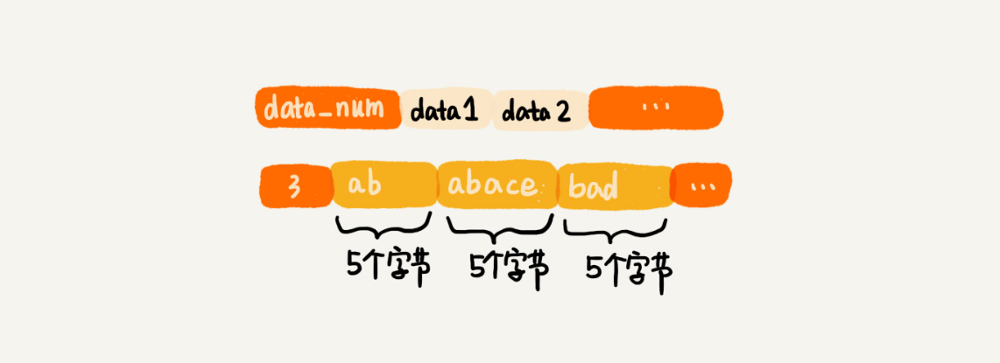

压缩列表这种存储结构，一方面比较节省内存，另一方面可以支持不同类型数据的存储。而且，因为数据存储在一片连续的内存空间，通过键来获取值为列表类型的数据，读取的效率也非常高。

当列表中存储的数据量比较大的时候，也就是不能同时满足刚刚讲的两个条件的时候，列表就要通过双向循环链表来实现了。

在链表里，我们已经讲过双向循环链表这种数据结构了，这里我们着重看一下Redis中双向链表的编码实现方式。

Redis的这种双向链表的实现方式，非常值得借鉴。它额外定义了一个list结构体，来组织链表的首、尾指针，还有长度等信息。

``` 
// 以下是C语言代码，因为Redis是用C语言实现的。
typedef struct listnode {
  struct listNode *prev;
  struct listNode *next;
  void *value;
} listNode;


typedef struct list {
  listNode *head;
  listNode *tail;
  unsigned long len;
  // ....省略其他定义
} list;
```


## 字典(hash)

字典类型用来存储一组数据对。每个数据对又包含键值两部分。字典类型也有两种实现方式。一种是我们刚刚讲到的压缩列表，另一种是散列表。

同样，只有当存储的数据量比较小的情况下，Redis才使用压缩列表来实现字典类型。具体需要满足两个条件：

* 字典中保存的键和值的大小都要小于64字节。
* 字典中键值对的个数要小于512个。

当不能同时满足上面两个条件的时候，Redis就使用散列表来实现字典类型。Redis使用MurmurHash2这种运行速度快、随机性好的哈希算法作为哈希函数。对于哈希冲突问题，Redis使用链表法来解决。除此之外，Redis还支持散列表的动态扩容、缩容。

当数据动态增加之后，散列表的装载因子会不停地变大。为了避免散列表性能的下降，当装载因子大于1的时候，Redis会触发扩容，将散列表扩大为原来大小的2倍左右。

当数据动态减少之后，为了节省内存，当装载因子小于0.1的时候，Redis就会触发缩容，缩小为字典中数据个数的大约2倍大小。

我们前面讲过，扩缩容要做大量的数据搬移和哈希值的重新计算，所以比较耗时。针对这个问题，Redis使用我们在散列表中讲的渐进式扩容缩容策略，将数据的搬移分批进行，避免了大量数据一次性搬移导致的服务停顿。


## 集合(set)

集合这种数据类型用来存储一组不重复的数据。这种数据类型也有两种实现方法，一种是基于有序数组，另一种是基于散列表。

当要存储的数据，同时满足下面这样两个条件的时候，Redis就采用有序数组，来实现集合这种数据类型。

* 存储的数据都是整数；
* 存储的数据元素个数不超过512个

当不能同时满足这两个条件的时候，Redis就使用散列表来存储集合中的数据。


## 有序集合(sortedset)

有序集合这种数据类型，我们在跳表中已经讲解过了。它用来存储一组数组，并且每个数据会附带一个得分。通过得分的大小，我们将数据组织成跳表这样的数据结构，以支持快速地按照得分值、得分区间获取数据。

实际上，跟Redis的其他数据类型一样，有序集合也并不仅仅只有跳表这一种实现方式。当数据量比较小的时候，Redis会用压缩列表来实现有序集合。具体点说就是，使用压缩列表来实现有序集合的前提，有这样两个：

* 所有数据的大小都要小于64字节。
* 元素个数要小于128个。


## 数据结构持久化

尽管Redis经常会被用作内存数据库，但是，它也支持数据落盘，也就是将内存中的数据存储到硬盘中。这样，当机器断电的时候，存储在Redis中的数据也不会丢失。在机器重新启动之后，Redis只需要再将存储在硬盘中的数据，重新读取到内存，就可以继续工作了。

刚刚我们讲到，Redis的数据格式由"键"和"值"两部分组成。而"值"又支持很多数据类型，比如字符串、列表、字典、集合、有序集合。像字典、集合等类型，底层用到了散列表，散列表中有指针的概念，而指针指向的是内存中的存储地址。那Redis 是如何将这一个跟具体内存地址有关的数据结构存储到磁盘中的呢？

实际上，Redis遇到的这个问题并不特殊，很多场景都会遇到。我们把它叫做数据结构的持久化问题，或者对象的持久化问题。这里的"持久化"，我们可以笼统地理解为"存储到磁盘"。

如何将数据结构持久化到磁盘？我们主要有两种解决思路。

第一种是清除原有的存储结构，只将数据存储到磁盘中。当我们需要从磁盘还原数据到内存的时候，再重新将数据组织成原来的数据结构。实际上，Redis采用的就是这种持久化思路。

不过，这种方式也有一定的弊端。那就是数据从磁盘还原到内存的过程，会耗用比较多的时间。比如，我们现在要将散列表中的数据存储到磁盘。当我们从磁盘中，取出数据重新构建散列表的时候，需要重新计算每个数据的哈希值。如果磁盘中存储的是几GB的数据，那重构数据结构的耗时就不可忽视了。

第二种是保留原来的存储格式，将数据按照原有的格式存储在磁盘中。我们拿散列表这样的数据结构来举例。我们可以将散列表的大小、每个数据被散列到的槽的编号的信息，都保存在磁盘中。有了这些信息，我们从磁盘中将数据还原到内存中的时候，就可以避免重新计算哈希值。


## 总结引申

今天，我们学习了Redis中常用数据类型底层依赖的数据结构，总结婴喜爱大概有这五种：压缩列表(可以看作一种特殊的数组)、有序数组、链表、散列表、跳表。实际上，Redis就是这些常用数据结构的封装。


## D71(2020/12/31) 高性能队列Disruptor

Disruptor是一种内存消息队列。从功能上讲，它其实有点类似kafka。不过，和kafka不同的是，disruptor是线程之间用于消息传递的队列。它在Apache Storm、Camel、Log4j2等很多知名项目中都有广泛应用。

之所以如此受青睐，主要还是因为它的性能表现非常优秀。它比Java中另外一个非常常用的内存消息队列ArrayBlockingQueue(ABS)的性能，要高一个数量级，可以算得上是最快的内存消息队列了。

如此高性能的内存消息队列，在设计和实现上，必然后它独到的地方。


## 基于循环队列的"生产者——消费者模型"

内存消息队列，来源于"生产者——消费者模型"。在这个模型中，"生产者"生产数据，并且将数据放到一个中心存储容器中。之后，"消费者"从中心存储容器中，取出数据消费。

这个模型还是非常好理解的，这里面存储数据的中心存储容器，是用什么样的数据结构来实现的呢？

实际上，实现中心存储容器最常用的一种数据结构，就是我们所讲的队列。队列支持数据的先进先出。正是这个特性，使得数据被霞飞的顺序性可以得到保证，也就是说，早被生产的数据就会早被消费。

我们在第9节中讲过，队列有两种实现思路。一种是基于链表实现的链式队列，另一种是基于数组实现的顺序队列。不同的需求背景下，我们会选择不同的实现方式。

如果我们要实现一个无界队列，也就是说，队列的大小事先不确定，理论上可以支持无限大。这种情况下，我们适合选用链表来实现队列。因为链表支持快速地动态扩容。如果我们要实现一个有界队列，也就是说，队列的大小实现确定，当队列中数据满了之后，生产者就需要等待。直到消费者消费了数据，队列有空闲位置的时候，生产者才能将数据放入。

实际上，相较于无界队列，有界队列的应用场景更加广泛。毕竟，我们的机器内存是有限的。而无界队列占用的内存数量是不可控的。对于实际的软件开发来说，这种不可控的因素，就会有潜在的风险。在某些极端情况下，无界队列就有可能因为内存持续增长，而导致OOM错误。

在第9节中，我们还讲过了一种特殊的顺序队列，循环队列。我们讲过，非循环的顺序队列在添加、删除数据的工程中，会涉及数据的搬移操作，导致性能变差。而循环队列正好可以解决这个数据搬移的问题。所以，性能更加好。所以，大部分用到顺序队列的场景中，我们都选择用顺序队列中的循环队列。

实际上，循环队列这种数据结构，就是我们今天要讲的内存消息队列的雏形。我们借助循环队列，实现了一个最简单的"生产者——消费者模型"。

为了方便理解，对于生产者和消费者之间操作的同步，我并没有用到线程相关的操作。而是采用了"当队列满了之后，生产者就轮询等待；当队列空了之后，消费者就轮训等待"这样的措施。

``` 
public class Queue {
  private Long[] data;
  private int size = 0, head = 0, tail = 0;
  public Queue(int size) {
    this.data = new Long[size];
    this.size = size;
  }

  public boolean add(Long element) {
    if ((tail + 1) % size == head) return false;
    data[tail] = element;
    tail = (tail + 1) % size;
    return true;
  }

  public Long poll() {
    if (head == tail) return null;
    long ret = data[head];
    head = (head + 1) % size;
    return ret;
  }
}

public class Producer {
  private Queue queue;
  public Producer(Queue queue) {
    this.queue = queue;
  }

  public void produce(Long data) throws InterruptedException {
    while (!queue.add(data)) {
      Thread.sleep(100);
    }
  }
}

public class Consumer {
  private Queue queue;
  public Consumer(Queue queue) {
    this.queue = queue;
  }

  public void comsume() throws InterruptedException {
    while (true) {
      Long data = queue.poll();
      if (data == null) {
        Thread.sleep(100);
      } else {
        // TODO:...消费数据的业务逻辑...
      }
    }
  }
}
```


## 基于加锁的并发"生产者-消费者模型"

实际上，刚刚的"生产者——消费者模型"实现代码，是不完善的。

如果我们只有一个生产者往队列中写数据，一个消费者从队列中读取数据，那上面的代码是没有问题的。但是，如果有多个生产者在并发地往队列中写入数据，或者多个消费者并发地从队列中消费数据，那上面的代码就不能正确工作了。

在多个生产者或多个消费者并发操作队列的情况下，刚刚的代码主要会有下面的两个问题：

* 多个生产者写入的数据可能会互相覆盖；
* 多个消费者可能会读取重复的数据。

因为第一个问题和第二个问题产生的原理是类似的。所以，我着重讲解第一个问题是如何产生的以及该如何解决。对于第二个问题，也可以类比对第一个问题的解决思路来想一想。

两个线程同时往队列中添加数据，也就相当于两个线程同时执行类Queue中的add()函数。我们假设队列的大小size是10，当前的tail指向下标7，head指向下标3，也就是说，队列中还有空闲空间。这个时候，线程1调用add()函数，往队列中添加一个值为12的数据；线程2调用add()函数，往队列中添加一个值为15的数据。在极端的情况下，本来是往队列中添加了两个数据(12和15)，最终可能只有一个数据添加成功，另一个数据会被覆盖。这是为什么呢？

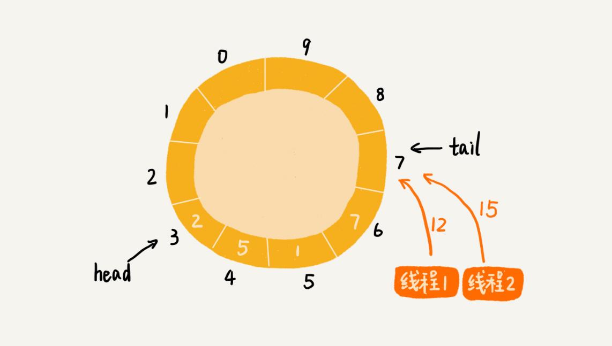

为了方便查看队列Queue中的add()函数，我们把它从上面的代码中摘录了出来。

``` 
public boolean add(Long element) {
  if ((tail + 1) % size == head) return false;
  data[tail] = element;
  tail = (tail + 1) % size;
  return true;
}
```

从这段代码中，我们可以看出，第3行给data[tail]赋值，然后第4行才给tail的值加一。赋值和tail加一两个操作，并非原子操作。这就会导致这样的情况发生：当线程1和线程2同时执行add()函数的时候，线程1先执行完了 3行语句，将data[7] (tail等于7)的值设置为12。在线程1还未执行到第行语句之前，也就是还未将tail 加一之前，线程2执行了第3行语句，又将data[7]的值设置为15，也就是说，那线程2插入的数据覆盖了线程1插入的数据。原本应该插入两个数据(12和15)的，现在只插入了一个数据(15)。


那如何解决这种线程并发往队列中添加数据时，导致的数据覆盖、运行不正确问题呢？

最简单的处理方法就是给这段代码加锁，同一时间只允许一个线程执行add()函数。这就相当于将这段代码的执行，由并行改成了串行，也就不存在我们刚刚说的问题了。

不过，加锁将并行改为串行，必然导致多个生产者同时生成数据的时候，执行效率的下降。当然，我们可以继续优化代码，用CAS操作等减少加锁的粒度。我这里直接看下disruptor的处理方法。


## 基于无锁的并发"生产者 —— 消费者模型"

尽管disruptor的源码读起来很复杂，但是基本其实非常简单。实际上，它是换了一种队列和"生产者- 消费者模型"的实现思路。

之前的实现思路中，队列只支持两个操作，添加数据和读取并移除数据，分别对应代码中的add()函数和poll()函数，而disruptor采用了另一种实现思路。

对于生产者来说，它往队列中添加数据之前，先申请可用空闲存储单元，并且是批量地申请连续的n个(n>=1)存储单元。当申请到这组连续的存储单元之后，后续往队列中添加元素，就可以不用加锁了，因为这组存储单元是这个线程独享的。不过，从刚刚的描述中，我们可以看出，申请存储单元的过程是需要加锁的。

对于消费者来说，处理的过程跟生产者是类似的。它先去申请一批连续可读的存储单元(这个申请的过程也是需要加锁的)，当申请到这批存储单元之后，后续的读取操作就可以不用加锁了。

不过，还有一个需要特别注意的地方，那就是，如果生产者A申请到了一组连续的存储单元，假设是下标为3到6的存储单元，生产者B紧跟着申请到了下标是7到9的存储单元，那在3到6没有完全写入数据之前，7到9的数据是无法读取的。这个也是disruptor实现思路的一个弊端。

如下图所示：


实际上，disruptor采用的是ringbuffer和availablebuffer这两个结构，来实现上面的功能。不过，因为我们主要聚焦在数据结构和算法上，所以对这两种结构做了简化，但是基本思想是一致的。


## 总结引申

今天，我们讲解了如何实现一个高性能的并发队列。这里的"并发"两个字，实际上就是多线程安全的意思。

常见的内存队列往往采用循环队列来实现。这种实现方法，对于只有一个生产者和一个消费者的场景，已经足够了。但是，当存在多个生产者或多个消费者的时候，单纯的循环队列的实现方式，就无法正确工作了。

这主要是因为，多个生产者在同时往队列中写入数据的时候，在某些情况下，会存在数据覆盖的问题。而多个消费者同时消费数据，在某些情况下，会存在消费重复数据的问题。

针对这个问题，最简单、暴力的解决方法就是，对写入和读取过程加锁。这种处理方法，相当于将原来可以并行执行的操作，强制串行执行，相应地就会导致操作性能的下降。

为了在保证逻辑正确的前提下，尽可能地提高队列在并发情况下的性能，disruptor采用了"两阶段写入"的方法。在写入数据之前，先加锁申请批量的空闲存储单元，之后往队列中写入数据的操作就不需要加锁了，写入的性能因此就提高了。Disruptor对消费过程的改造，跟对生产过程的改造是类似的。它先加锁申请批量的可读取的存储单元，之后从队列中读取数据的操作也就不需要加锁了，读取的性能因此也就提高了。

这个优化思路非常简单。实际上，不管架构设计还是产品设计，往往越简单的设计思路，越能更好地解决问题。


